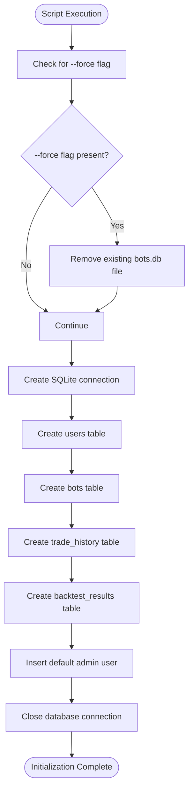
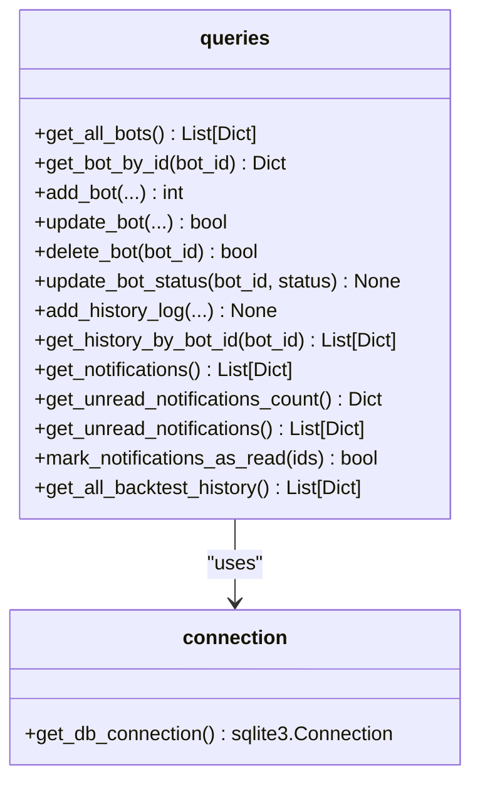

# Database Connection and Query Layer

<cite>
**Referenced Files in This Document**   
- [connection.py](file://core/db/connection.py)
- [queries.py](file://core/db/queries.py)
- [init_db.py](file://init_db.py)
- [models.py](file://core/db/models.py)
- [api_bots.py](file://core/routes/api_bots.py)
- [controller.py](file://core/bots/controller.py)
</cite>

## Table of Contents
1. [Introduction](#introduction)
2. [Database Initialization and Schema Setup](#database-initialization-and-schema-setup)
3. [Connection Management](#connection-management)
4. [Query Abstraction Layer](#query-abstraction-layer)
5. [Transaction Management and Error Handling](#transaction-management-and-error-handling)
6. [Usage in Business Logic](#usage-in-business-logic)
7. [Security Considerations](#security-considerations)
8. [Performance and Best Practices](#performance-and-best-practices)

## Introduction
The quantumbotx application implements a lightweight yet robust database layer using SQLite to persistently store bot configurations, trading history, backtest results, and user data. This document details the architecture and implementation of the database connection management and query abstraction system. The design emphasizes simplicity, safety, and maintainability through centralized connection handling, parameterized queries, and a clean separation between raw SQL operations and business logic.

## Database Initialization and Schema Setup

The `init_db.py` script is responsible for initializing the SQLite database, creating all required tables, and inserting default data. It serves as the single source of truth for the database schema and is designed to be idempotent, meaning it can be safely run multiple times without causing errors.



**Diagram sources**
- [init_db.py](file://init_db.py#L1-L137)

**Section sources**
- [init_db.py](file://init_db.py#L1-L137)

The script defines four main tables:
- **users**: Stores user credentials with a hashed password.
- **bots**: Stores configuration for each trading bot.
- **trade_history**: Logs all actions and events related to bots, with a flag for notifications.
- **backtest_results**: Stores comprehensive results from backtesting operations, including JSON-serialized equity curves and trade logs.

A default admin user is inserted with the email `admin@quantumbotx.com` and password `admin`. This provides immediate access to the application after initialization.

## Connection Management

The `connection.py` module provides a centralized function for establishing database connections. It abstracts the physical location of the database file and ensures consistent configuration across the application.

```python
# core/db/connection.py
import sqlite3
import os

DATABASE_FILENAME = 'bots.db'
BASE_DIR = os.path.dirname(os.path.abspath(__file__))
DATABASE_PATH = os.path.join(BASE_DIR, '..', '..', DATABASE_FILENAME)

def get_db_connection():
    """Creates and returns a connection to the SQLite database."""
    conn = sqlite3.connect(DATABASE_PATH)
    conn.row_factory = sqlite3.Row  # Enables dict-like access to rows
    return conn
```

**Section sources**
- [connection.py](file://core/db/connection.py#L1-L15)

The `get_db_connection()` function:
- Uses a relative path to locate the `bots.db` file, making the application portable.
- Sets `row_factory = sqlite3.Row`, which allows result rows to be accessed like dictionaries (e.g., `row['id']` instead of `row[0]`), improving code readability.
- Returns a raw `sqlite3.Connection` object, which is then used by the query layer.

**Connection Pooling and Timeout Configuration**
The current implementation does not use explicit connection pooling. SQLite's built-in support for multiple connections is leveraged, and connections are opened and closed for each operation using context managers. While this is efficient for low-to-medium concurrency, it may become a bottleneck under high load. No explicit connection timeout is configured, relying on SQLite's default behavior. For production deployments with higher concurrency, integrating a connection pool (e.g., using `SQLAlchemy` or `sqlite3`'s built-in `check_same_thread` with a pool) would be recommended.

## Query Abstraction Layer

The `queries.py` module provides a comprehensive set of functions that abstract all CRUD operations for the application's core entities. This layer completely isolates business logic from raw SQL, enhancing security, maintainability, and testability.



**Diagram sources**
- [queries.py](file://core/db/queries.py#L1-L175)
- [connection.py](file://core/db/connection.py#L1-L15)

**Section sources**
- [queries.py](file://core/db/queries.py#L1-L175)

### Key Query Functions

#### Bot Management
- `get_all_bots()`: Retrieves all bots, ordered by ID descending.
- `get_bot_by_id(bot_id)`: Fetches a single bot by its primary key.
- `add_bot(...)`: Inserts a new bot with a default 'Paused' status.
- `update_bot(...)`: Updates all configurable fields of a bot.
- `delete_bot(bot_id)`: Removes a bot and its history (due to `ON DELETE CASCADE`).
- `update_bot_status(bot_id, status)`: Changes the operational status of a bot.

#### History and Notifications
- `add_history_log(...)`: Logs an action for a bot, with a flag to mark it as a user notification.
- `get_history_by_bot_id(bot_id)`: Retrieves the complete history for a specific bot.
- `get_notifications()`: Joins `trade_history` and `bots` to get all notifications with bot names.
- `get_unread_notifications_count()`: Returns the count of unread notifications.
- `mark_notifications_as_read(notification_ids)`: Marks notifications as read, with special handling for bulk operations.

#### Backtesting
- `get_all_backtest_history()`: Retrieves all stored backtest results for analysis and reporting.

All functions return Python dictionaries or lists of dictionaries, making the data immediately usable by the Flask-based web interface.

## Transaction Management and Error Handling

The database layer employs a consistent pattern for transaction management and error handling.

### Transaction Management
Every query function uses a context manager (`with get_db_connection() as conn:`) to ensure proper resource management. The `sqlite3.Connection` object automatically starts a transaction when the first SQL statement is executed. The transaction is explicitly committed with `conn.commit()` after successful operations or rolled back automatically if an exception occurs and the context manager exits.

```python
def add_bot(name, market, lot_size, sl_pips, tp_pips, timeframe, interval, strategy, strategy_params='{}'):
    try:
        with get_db_connection() as conn:
            cursor = conn.cursor()
            cursor.execute('''
                INSERT INTO bots (name, market, lot_size, sl_pips, tp_pips, timeframe, check_interval_seconds, strategy, strategy_params, status)
                VALUES (?, ?, ?, ?, ?, ?, ?, ?, ?, 'Dijeda')
            ''', (name, market, lot_size, sl_pips, tp_pips, timeframe, interval, strategy, strategy_params))
            conn.commit()
            return cursor.lastrowid
    except sqlite3.Error as e:
        logger.error(f"Gagal menambah bot ke DB: {e}", exc_info=True)
        return None
```

This pattern guarantees that every database operation is atomic and that connections are always closed, even in the event of an error.

### Error Handling
All database operations are wrapped in `try-except` blocks that catch `sqlite3.Error`. When an error occurs:
- It is logged using the `logging` module with a descriptive message.
- The function returns a safe default value (e.g., `None`, `False`, or an empty list) instead of propagating the exception.
- The `exc_info=True` parameter in `logger.error()` ensures the full stack trace is captured for debugging.

This defensive approach prevents database errors from crashing the application and provides clear logs for troubleshooting.

**Section sources**
- [queries.py](file://core/db/queries.py#L1-L175)

## Usage in Business Logic

The query functions are consumed by higher-level business logic components, primarily the API routes and the bot controller. This demonstrates a clean separation of concerns.

### Example: Creating a New Bot (API Route)
The `add_bot_route` function in `api_bots.py` uses `queries.add_bot()` to persist new bot configurations.

```python
@api_bots.route('/api/bots', methods=['POST'])
def add_bot_route():
    data = request.get_json()
    params_json = json.dumps(data.get('params', {}))

    new_bot_id = queries.add_bot(
        name=data.get('name'), market=data.get('market'), lot_size=data.get('risk_percent'),
        sl_pips=data.get('sl_atr_multiplier'), tp_pips=data.get('tp_atr_multiplier'), timeframe=data.get('timeframe'),
        interval=data.get('check_interval_seconds'), strategy=data.get('strategy'),
        strategy_params=params_json
    )
    if new_bot_id:
        controller.add_new_bot_to_controller(new_bot_id)
        return jsonify({"message": "Bot successfully created", "bot_id": new_bot_id}), 201
    return jsonify({"error": "Failed to save bot"}), 500
```

**Section sources**
- [api_bots.py](file://core/routes/api_bots.py#L1-L168)

### Example: Starting a Bot (Controller)
The `controller.py` module uses multiple query functions to manage the bot lifecycle. When starting a bot, it first retrieves its configuration with `queries.get_bot_by_id()` and updates its status with `queries.update_bot_status()`.

```python
def mulai_bot(bot_id: int):
    bot_data = queries.get_bot_by_id(bot_id)
    # ... create and start thread ...
    queries.update_bot_status(bot_id, 'Aktif')
```

This pattern ensures that the bot's operational state in memory is always synchronized with its persistent state in the database.

**Section sources**
- [controller.py](file://core/bots/controller.py#L1-L177)

## Security Considerations

The database layer implements several security best practices:

### SQL Injection Prevention
All user-supplied data is passed to SQL queries using parameterized statements (the `?` placeholder). This is evident in functions like `get_bot_by_id()`:

```python
conn.execute('SELECT * FROM bots WHERE id = ?', (bot_id,))
```

The `sqlite3` module safely escapes the `bot_id` value, making SQL injection attacks impossible. Even the dynamic query in `mark_notifications_as_read()` safely uses `?` placeholders for the list of IDs.

### Authentication Data Protection
In `init_db.py`, the default user's password is hashed using `werkzeug.security.generate_password_hash()` before being stored in the database. This ensures that even if the database file is compromised, the plaintext password remains protected.

### Input Validation
While not part of the database layer itself, the business logic (e.g., in `controller.py`) performs input validation and sanitization (e.g., converting `risk_percent` to `lot_size`) before passing data to the query functions, adding another layer of defense.

**Section sources**
- [queries.py](file://core/db/queries.py#L1-L175)
- [init_db.py](file://init_db.py#L1-L137)
- [controller.py](file://core/bots/controller.py#L1-L177)

## Performance and Best Practices

### Performance Monitoring Tips
- **Query Logging**: Enable SQLite's query logger to identify slow queries. Add `conn.set_trace_callback(print)` in `get_db_connection()` for development.
- **Indexing**: The primary keys are automatically indexed. Consider adding indexes on frequently queried columns like `bot_id` in `trade_history` or `timestamp` in `backtest_results` if performance degrades.
- **Connection Overhead**: Monitor the application's response time. If database connection setup becomes a bottleneck, implement a connection pool.

### Best Practices for Database Migrations
The current system lacks a formal migration framework. For future versions:
1. **Schema Versioning**: Add a `schema_version` table to track the database version.
2. **Migration Scripts**: Create incremental migration scripts (e.g., `migrate_v1_to_v2.py`) that alter the schema and transform data.
3. **Atomic Migrations**: Each migration should be a single transaction to ensure consistency.
4. **Backup**: Always create a backup of the database before applying migrations.
5. **Testing**: Test migrations on a copy of production data.

The `init_db.py` script can be enhanced to check the current schema version and apply pending migrations automatically on startup, ensuring the database is always up-to-date.