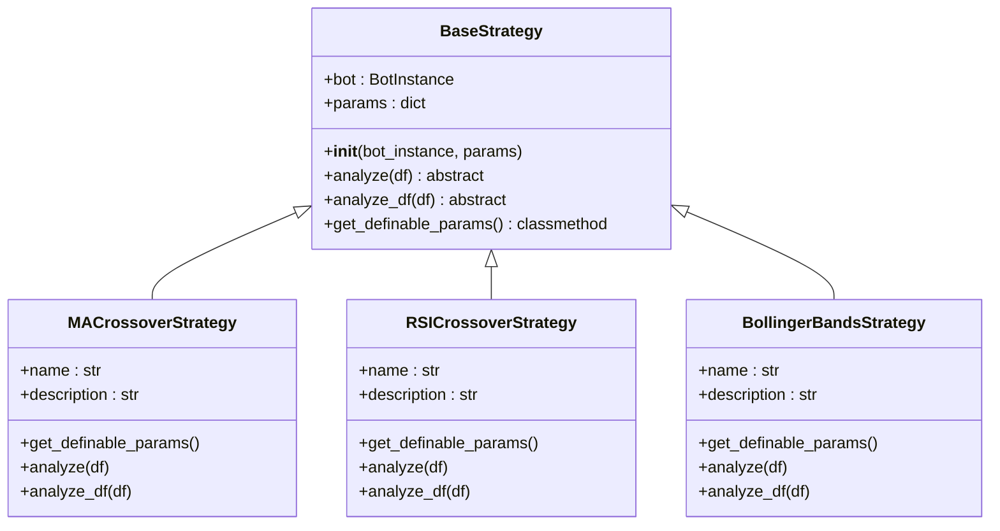
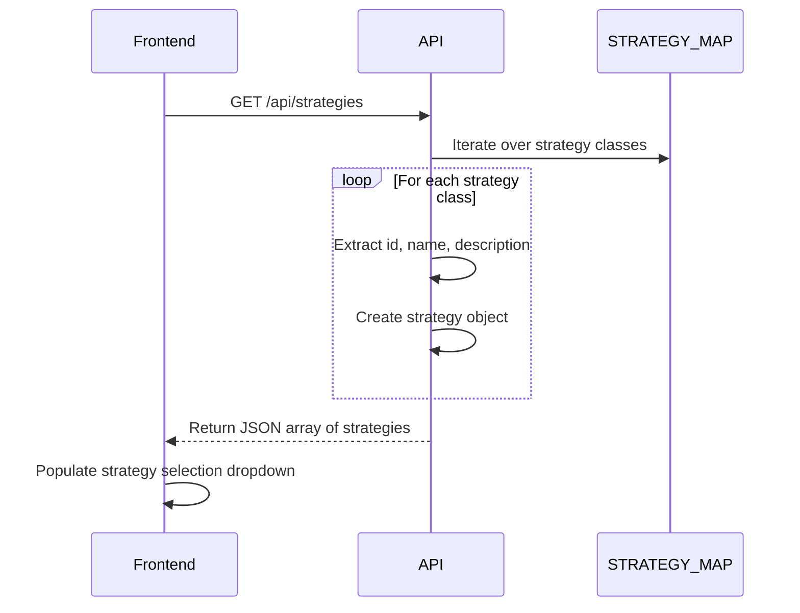

# Strategies Configuration Schema

<cite>
**Referenced Files in This Document**   
- [init_db.py](file://init_db.py#L49-L78)
- [api_bots.py](file://core/routes/api_bots.py#L0-L28)
- [strategy_map.py](file://core/strategies/strategy_map.py#L0-L27)
- [ma_crossover.py](file://core/strategies/ma_crossover.py#L0-L60)
- [rsi_crossover.py](file://core/strategies/rsi_crossover.py#L0-L84)
- [bollinger_reversion.py](file://core/strategies/bollinger_reversion.py#L0-L75)
- [base_strategy.py](file://core/strategies/base_strategy.py#L0-L28)
- [backtesting.js](file://static/js/backtesting.js#L12-L44)
- [trading_bots.js](file://static/js/trading_bots.js#L18-L52)
</cite>

## Table of Contents
1. [Strategies Table Schema](#strategies-table-schema)
2. [Strategy Plugin Architecture Integration](#strategy-plugin-architecture-integration)
3. [Default Parameters Field Structure](#default-parameters-field-structure)
4. [Strategy Selection Workflow](#strategy-selection-workflow)
5. [Performance Considerations](#performance-considerations)

## Strategies Table Schema

The strategies configuration storage in the quantumbotx database is implemented through a strategy registration system that dynamically exposes available trading strategies to the application. While there is no dedicated `strategies` table in the database schema, the system implements a virtual strategies table through code-based registration and API exposure.

The core schema elements for strategy configuration are derived from the strategy classes themselves and exposed through the application's API layer. The effective schema for strategies includes the following fields:

- **id**: Strategy identifier key used in the STRATEGY_MAP dictionary (e.g., 'MA_CROSSOVER')
- **name**: Display name of the strategy (e.g., 'Moving Average Crossover')
- **description**: Detailed explanation of the strategy logic and use cases
- **default_parameters**: Template values for strategy initialization, defined through the `get_definable_params()` method
- **category**: Not explicitly defined, but can be inferred from strategy naming patterns (e.g., 'trend', 'momentum', 'mean_reversion')
- **is_active**: Not applicable as all registered strategies are available; activation is controlled at the bot level

The actual strategy parameters for active bots are stored in the `bots` table within the `strategy_params` field, which is defined as TEXT type to store JSON-serialized parameter values.

```sql
-- bots table schema from init_db.py
CREATE TABLE IF NOT EXISTS bots (
    id INTEGER PRIMARY KEY AUTOINCREMENT,
    name TEXT NOT NULL,
    market TEXT NOT NULL,
    status TEXT NOT NULL DEFAULT 'Dijeda',
    lot_size REAL NOT NULL DEFAULT 0.01,
    sl_pips INTEGER NOT NULL DEFAULT 100,
    tp_pips INTEGER NOT NULL DEFAULT 200,
    timeframe TEXT NOT NULL DEFAULT 'H1',
    check_interval_seconds INTEGER NOT NULL DEFAULT 60,
    strategy TEXT NOT NULL,
    strategy_params TEXT
);
```

**Section sources**
- [init_db.py](file://init_db.py#L49-L78)

## Strategy Plugin Architecture Integration

The strategy plugin architecture is implemented through a class-based inheritance model with dynamic registration via the STRATEGY_MAP dictionary. All strategies inherit from the BaseStrategy abstract base class, ensuring a consistent interface across all strategy implementations.



**Diagram sources**
- [base_strategy.py](file://core/strategies/base_strategy.py#L0-L28)
- [ma_crossover.py](file://core/strategies/ma_crossover.py#L0-L60)
- [rsi_crossover.py](file://core/strategies/rsi_crossover.py#L0-L84)
- [bollinger_reversion.py](file://core/strategies/bollinger_reversion.py#L0-L75)

The STRATEGY_MAP dictionary in strategy_map.py serves as the central registry for all available strategies, mapping string identifiers to their corresponding strategy classes:

```python
STRATEGY_MAP = {
    'MA_CROSSOVER': MACrossoverStrategy,
    'QUANTUMBOTX_HYBRID': QuantumBotXHybridStrategy,
    'RSI_CROSSOVER': RSICrossoverStrategy,
    'BOLLINGER_REVERSION': BollingerBandsStrategy,
    # ... other strategies
}
```

This architecture enables the application to dynamically discover and instantiate strategies based on user selection, supporting a plugin-like extensibility model where new strategies can be added by implementing the BaseStrategy interface and registering them in the STRATEGY_MAP.

**Section sources**
- [strategy_map.py](file://core/strategies/strategy_map.py#L0-L27)
- [base_strategy.py](file://core/strategies/base_strategy.py#L0-L28)

## Default Parameters Field Structure

The default_parameters field is implemented through the `get_definable_params()` class method in each strategy class. This method returns a list of parameter definitions that include the parameter name, display label, input type, default value, and step size (where applicable).

### MA Crossover Strategy Parameters
```json
[
    {
        "name": "fast_period",
        "label": "Fast MA Period",
        "type": "number",
        "default": 20
    },
    {
        "name": "slow_period",
        "label": "Slow MA Period",
        "type": "number",
        "default": 50
    }
]
```

### RSI Crossover Strategy Parameters
```json
[
    {
        "name": "rsi_period",
        "label": "RSI Period",
        "type": "number",
        "default": 14
    },
    {
        "name": "rsi_ma_period",
        "label": "RSI MA Period",
        "type": "number",
        "default": 10
    },
    {
        "name": "trend_filter_period",
        "label": "Trend Filter Period",
        "type": "number",
        "default": 50
    }
]
```

### Bollinger Bands Strategy Parameters
```json
[
    {
        "name": "bb_length",
        "label": "BB Length",
        "type": "number",
        "default": 20
    },
    {
        "name": "bb_std",
        "label": "BB Standard Deviation",
        "type": "number",
        "default": 2.0,
        "step": 0.1
    },
    {
        "name": "trend_filter_period",
        "label": "Trend Filter Period",
        "type": "number",
        "default": 200
    }
]
```

The default_parameters structure serves as a template for strategy initialization, providing the UI with the necessary information to render appropriate input fields and set initial values when creating new trading bots. When a user creates a bot, these default values are serialized to JSON and stored in the `strategy_params` field of the `bots` table.

**Section sources**
- [ma_crossover.py](file://core/strategies/ma_crossover.py#L0-L60)
- [rsi_crossover.py](file://core/strategies/rsi_crossover.py#L0-L84)
- [bollinger_reversion.py](file://core/strategies/bollinger_reversion.py#L0-L75)

## Strategy Selection Workflow

The application queries the available strategies through the `/api/strategies` endpoint, which dynamically generates the strategy list from the STRATEGY_MAP registry. The API route implementation in api_bots.py converts the strategy class metadata into a JSON response:



**Diagram sources**
- [api_bots.py](file://core/routes/api_bots.py#L0-L28)
- [backtesting.js](file://static/js/backtesting.js#L12-L44)
- [trading_bots.js](file://static/js/trading_bots.js#L18-L52)

When a user selects a strategy in the UI, the application makes a second request to `/api/strategies/{strategy_id}/params` to retrieve the parameter configuration. This triggers the `get_definable_params()` method on the selected strategy class, which returns the parameter structure used to dynamically generate the parameter input form.

The complete workflow for bot creation is:
1. User navigates to bot creation form
2. Frontend calls `/api/strategies` to populate strategy dropdown
3. User selects a strategy from the dropdown
4. Frontend calls `/api/strategies/{strategy_id}/params` to get parameter configuration
5. Frontend dynamically generates parameter input fields based on the response
6. User configures parameters and submits the form
7. Frontend sends strategy ID and parameter values to `/api/bots` endpoint
8. Backend stores the strategy ID in the `strategy` field and serialized parameters in `strategy_params` field

This dynamic approach allows the UI to automatically adapt to any strategy added to the system without requiring code changes to the frontend or database schema.

**Section sources**
- [api_bots.py](file://core/routes/api_bots.py#L30-L56)
- [backtesting.js](file://static/js/backtesting.js#L46-L69)
- [trading_bots.js](file://static/js/trading_bots.js#336-L360)

## Performance Considerations

Since the strategies are not stored in a database table but rather in code, there are no direct database performance considerations for querying strategies by category or active status. The strategy discovery process occurs in memory by iterating over the STRATEGY_MAP dictionary, which has O(n) complexity where n is the number of registered strategies.

For applications with a large number of strategies, performance could be optimized by:
- Caching the strategy list in memory and invalidating on application restart
- Implementing lazy loading of strategy parameter configurations
- Adding indexing to the STRATEGY_MAP if filtering by category becomes necessary

The storage of strategy parameters in the `strategy_params` TEXT field of the `bots` table follows SQLite's JSON-as-text pattern. Since SQLite does not have a native JSON data type, the field is stored as plain text. This approach has the following performance implications:

- **Query Efficiency**: Cannot efficiently query based on parameter values without loading and parsing the JSON
- **Indexing**: Cannot create indexes on specific JSON fields within strategy_params
- **Storage**: Text-based JSON storage is space-efficient but requires serialization/deserialization overhead

For improved query performance on parameter values, consider:
- Extracting frequently queried parameters to dedicated columns in the bots table
- Implementing application-level caching of bot configurations
- Using a database with native JSON support (e.g., PostgreSQL) if complex parameter queries are required

The current implementation prioritizes flexibility and simplicity over query performance, which is appropriate for the typical access patterns where bots are retrieved by ID rather than by parameter values.

**Section sources**
- [init_db.py](file://init_db.py#L49-L78)
- [api_bots.py](file://core/routes/api_bots.py#L0-L28)