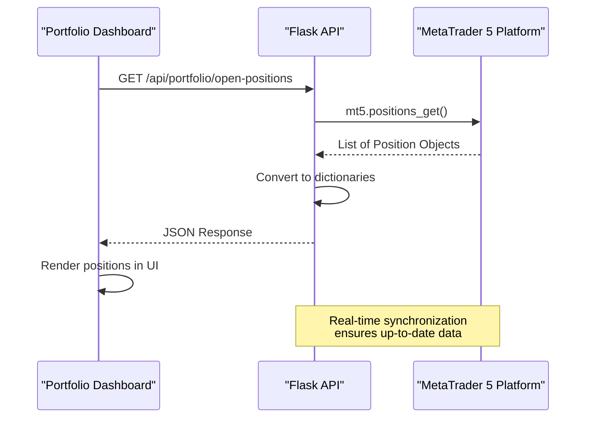
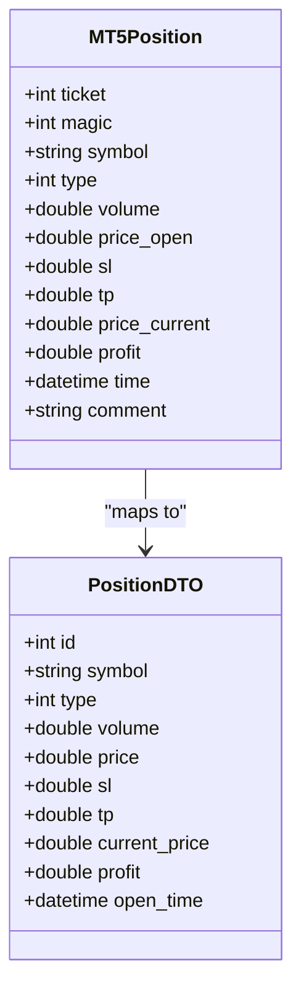
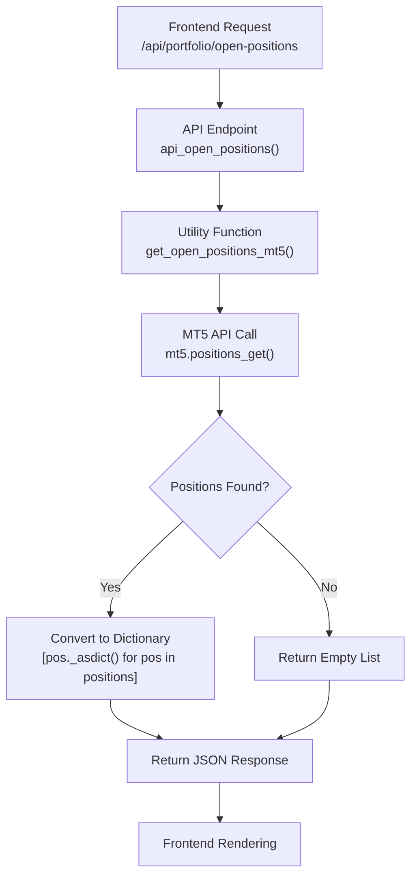
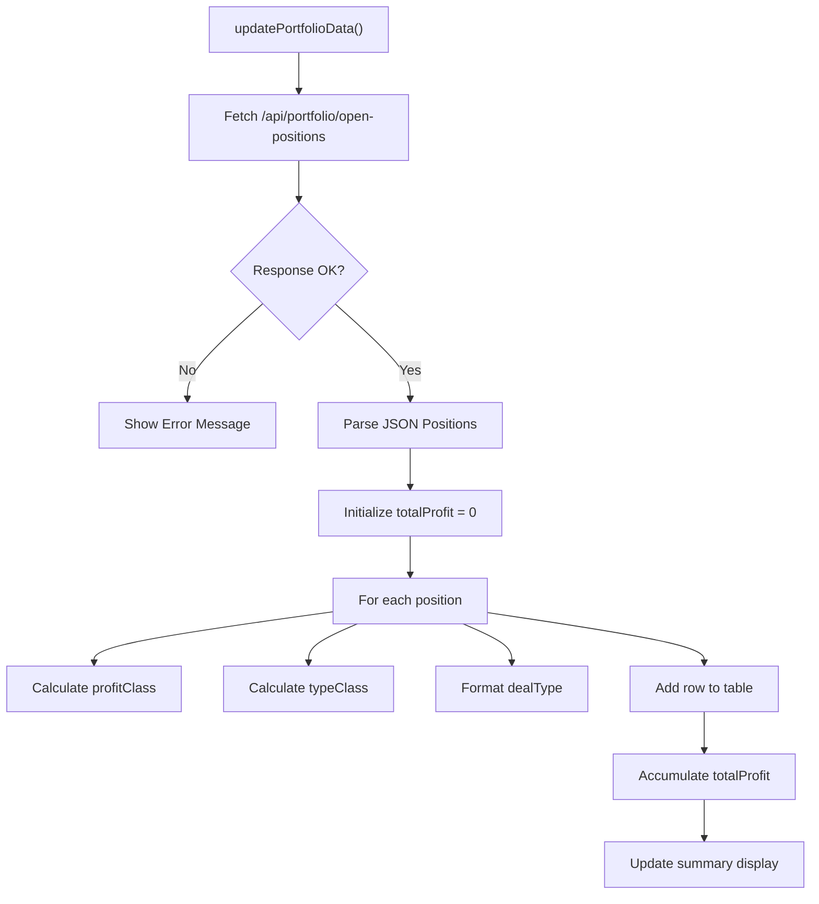

# Positions Table Schema

<cite>
**Referenced Files in This Document**   
- [api_portfolio.py](file://core/routes/api_portfolio.py)
- [mt5.py](file://core/utils/mt5.py)
- [base_broker.py](file://core/brokers/base_broker.py)
- [portfolio.html](file://templates/portfolio.html)
- [portfolio.js](file://static/js/portfolio.js)
</cite>

## Table of Contents
1. [Introduction](#introduction)
2. [Data Source and Architecture](#data-source-and-architecture)
3. **Positions Data Structure**
4. **Real-Time Synchronization Workflow**
5. **Frontend Integration and Dashboard Rendering**
6. **Concurrency and Performance Considerations**
7. **Sample Position Record**
8. **Risk and Portfolio Monitoring Capabilities**

## Introduction

The **positions** data structure in QuantumBotX is designed to provide real-time visibility into open trading positions managed by automated trading bots. Unlike traditional database-stored tables, the positions data is dynamically retrieved from the MetaTrader 5 (MT5) platform via API calls, ensuring that users always see the most current market state. This document details the structure, source, and usage of position data within the system, focusing on how it enables real-time portfolio monitoring, risk assessment, and dashboard functionality.

## Data Source and Architecture

The positions data in QuantumBotX does not reside in a traditional database table. Instead, it is sourced directly from the MT5 trading platform through a real-time API integration. When a user accesses the portfolio dashboard, the frontend requests position data from a backend API endpoint, which in turn queries the MT5 platform for the current list of open positions.

This architecture ensures data freshness and eliminates the need for maintaining a separate positions table that could become stale or inconsistent with the broker's records. The system follows a direct fetch model rather than a persistent storage model for live positions, which reduces complexity and improves reliability.

**Diagram sources**
- [api_portfolio.py](file://core/routes/api_portfolio.py#L5-L15)
- [mt5.py](file://core/utils/mt5.py#L50-L65)

**Section sources**
- [api_portfolio.py](file://core/routes/api_portfolio.py#L5-L15)
- [mt5.py](file://core/utils/mt5.py#L50-L65)

## **Positions Data Structure**

Although there is no dedicated database table for positions, the data structure returned by the MT5 platform contains comprehensive information about each open position. The structure is defined by the MT5 API and includes the following fields:

**Position Fields**
- **id**: Unique identifier (ticket number) for the position
- **bot_id**: Not directly available; inferred from magic number or strategy mapping
- **symbol**: Trading instrument (e.g., "EURUSD", "XAUUSD")
- **trade_type**: Order type (0=BUY, 1=SELL)
- **volume**: Position size in lots
- **price**: Entry price of the position
- **sl**: Stop-loss price level
- **tp**: Take-profit price level
- **open_time**: Timestamp when position was opened
- **current_price**: Real-time market price
- **unrealized_profit**: Current profit/loss in account currency
- **last_updated**: Automatically updated with current timestamp on each fetch

The data is retrieved using the `mt5.positions_get()` method and converted to a dictionary format using the `_asdict()` method for JSON serialization. This structure is then transmitted to the frontend for display.

**Diagram sources**
- [mt5.py](file://core/utils/mt5.py#L50-L65)
- [base_broker.py](file://core/brokers/base_broker.py#L35-L45)

**Section sources**
- [mt5.py](file://core/utils/mt5.py#L50-L65)
- [base_broker.py](file://core/brokers/base_broker.py#L35-L45)

## **Real-Time Synchronization Workflow**

The positions data is synchronized with the MT5 platform through a periodic update mechanism. The system does not maintain its own copy of position data but instead fetches it on demand from the broker's servers. This approach ensures atomic consistency and eliminates the risk of data divergence.

When the portfolio dashboard requests position data, the following workflow occurs:

1. The API endpoint `/api/portfolio/open-positions` is called
2. The `get_open_positions_mt5()` utility function queries MT5 using `mt5.positions_get()`
3. Each position object is converted to a dictionary using `_asdict()`
4. The list of positions is returned as JSON to the frontend

This workflow ensures that every request returns the most current state from the broker, with no intermediate caching that could lead to stale data. The synchronization is effectively instantaneous, limited only by network latency and MT5 API response time.

**Diagram sources**
- [api_portfolio.py](file://core/routes/api_portfolio.py#L5-L15)
- [mt5.py](file://core/utils/mt5.py#L50-L65)

**Section sources**
- [api_portfolio.py](file://core/routes/api_portfolio.py#L5-L15)
- [mt5.py](file://core/utils/mt5.py#L50-L65)

## **Frontend Integration and Dashboard Rendering**

The positions data is consumed by the portfolio dashboard to provide real-time monitoring of open trades. The frontend JavaScript code fetches position data and renders it in a tabular format, enabling users to monitor their portfolio at a glance.

The `portfolio.js` file contains the logic for updating the dashboard, including:
- Fetching data from the API endpoint
- Calculating total portfolio profit
- Applying conditional formatting based on profit/loss
- Updating the UI with current position information

The table displays key metrics including symbol, trade type, volume, entry price, and current profit/loss, providing a comprehensive view of active positions.

**Diagram sources**
- [portfolio.js](file://static/js/portfolio.js#L75-L111)
- [portfolio.html](file://templates/portfolio.html#L30-L54)

**Section sources**
- [portfolio.js](file://static/js/portfolio.js#L75-L111)
- [portfolio.html](file://templates/portfolio.html#L30-L54)

## **Concurrency and Performance Considerations**

Since position data is fetched directly from MT5 rather than stored in a database, the system avoids database lock contention issues that could arise from simultaneous updates. Each request operates independently and retrieves fresh data from the broker, eliminating the need for complex concurrency control mechanisms.

This architecture provides several performance benefits:
- No database write operations for position updates
- No risk of write conflicts or lock contention
- Consistent read performance regardless of position count
- Reduced database load and storage requirements

The trade-off is increased dependency on the MT5 API availability and response time. However, this is mitigated by the fact that the MT5 platform is designed for high-frequency trading operations and can handle rapid position queries efficiently.

For high-frequency use cases, the system could implement a short-term caching layer with appropriate invalidation logic, but the current implementation prioritizes data freshness over performance optimization.

## **Sample Position Record**

The following is an example of a position record as returned by the MT5 platform and displayed in the QuantumBotX interface:

**Sample Position Data**
- **id**: 123456789
- **symbol**: "EURUSD"
- **trade_type**: 0 (BUY)
- **volume**: 0.1
- **price**: 1.08543
- **sl**: 1.08000
- **tp**: 1.09500
- **open_time**: "2025-01-15T10:30:45Z"
- **current_price**: 1.08721
- **unrealized_profit**: 17.80
- **last_updated**: "2025-01-15T10:35:22Z"

This position represents a 0.1 lot long trade on EURUSD opened at 1.08543 with stop-loss at 1.08000 and take-profit at 1.09500. As of the last update, the position is in profit with an unrealized gain of $17.80 based on the current market price of 1.08721.

## **Risk and Portfolio Monitoring Capabilities**

The real-time positions data enables comprehensive portfolio monitoring and risk management capabilities. The system can calculate key metrics such as:

- **Total Exposure**: Sum of all position volumes by symbol or asset class
- **Risk Concentration**: Percentage of portfolio allocated to specific instruments
- **Aggregate Profit/Loss**: Total unrealized PnL across all positions
- **Risk-Reward Ratio**: Average ratio of take-profit distance to stop-loss distance

These metrics are used to generate the asset allocation chart and portfolio summary displayed in the dashboard. The real-time nature of the data ensures that risk calculations are always based on current market conditions, enabling timely risk management decisions.

The system also supports strategy-level analysis by correlating positions with bot instances through magic numbers or other identifiers, allowing users to assess the performance of individual trading strategies.