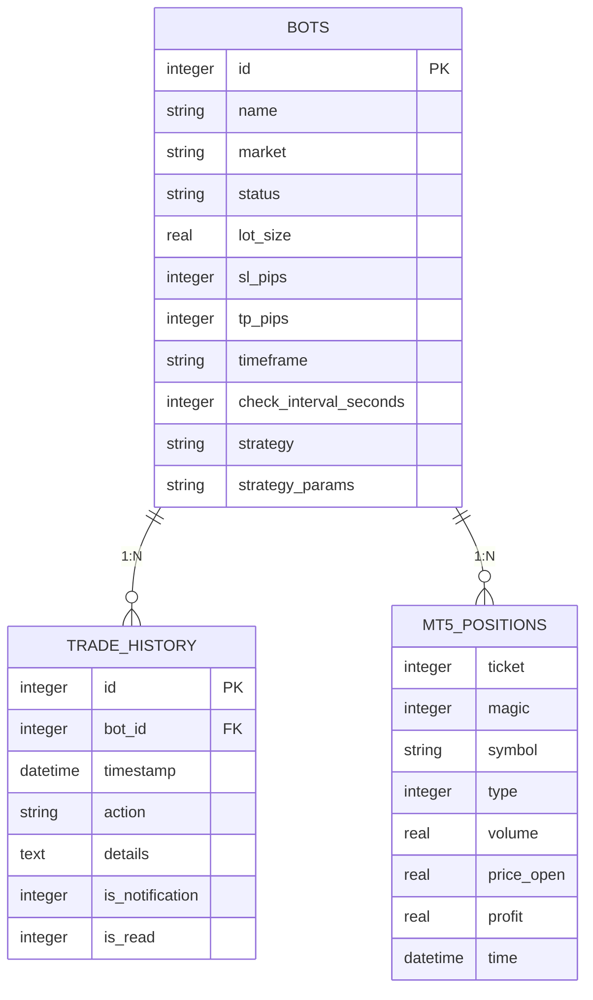

# Schema Relationships and Constraints

<cite>
**Referenced Files in This Document**   
- [init_db.py](file://init_db.py#L49-L114)
- [core/db/queries.py](file://core/db/queries.py#L70-L102)
- [core/db/models.py](file://core/db/models.py#L0-L19)
- [core/bots/trading_bot.py](file://core/bots/trading_bot.py#L142-L168)
- [core/routes/api_portfolio.py](file://core/routes/api_portfolio.py#L0-L57)
- [core/utils/mt5.py](file://core/utils/mt5.py#L67-L98)
</cite>

## Table of Contents
1. [Introduction](#introduction)
2. [Entity-Relationship Overview](#entity-relationship-overview)
3. [Bot-Trade Relationship](#bot-trade-relationship)
4. [Bot-Position Relationship](#bot-position-relationship)
5. [Data Flow Lifecycle](#data-flow-lifecycle)
6. [Foreign Key Constraints](#foreign-key-constraints)
7. [Performance Reporting Queries](#performance-reporting-queries)

## Introduction
This document details the relational structure between bots, trades, and positions in the quantumbotx database system. The architecture enables comprehensive performance tracking for trading bots through a well-defined schema with referential integrity. The core relationship is established through the bot_id field, which creates a one-to-many relationship from bots to both trade history records and active positions. This design allows each bot to maintain multiple historical trades while managing up to one active position per financial symbol at any given time.

## Entity-Relationship Overview



**Diagram sources**
- [init_db.py](file://init_db.py#L49-L78)
- [core/routes/api_portfolio.py](file://core/routes/api_portfolio.py#L0-L57)

**Section sources**
- [init_db.py](file://init_db.py#L49-L114)

## Bot-Trade Relationship

The relationship between bots and trades is implemented through the trade_history table, which stores all historical trading activities. Each record in this table contains a bot_id field that serves as a foreign key referencing the primary key (id) in the bots table. This establishes a one-to-many relationship where a single bot can have multiple associated trade records.

The trade_history table captures various trading actions including:
- **OPEN BUY**: Creation of a long position
- **OPEN SELL**: Creation of a short position  
- **CLOSE BUY**: Closure of a long position
- **CLOSE SELL**: Closure of a short position

When a trading bot executes a trade, it logs the action through the add_history_log function in queries.py, which inserts a new record into the trade_history table with the corresponding bot_id. This enables comprehensive performance tracking by associating every trade action with its originating bot.

```python
def add_history_log(bot_id, action, details, is_notification=False):
    """Menambahkan log aktivitas/riwayat untuk bot tertentu."""
    try:
        with get_db_connection() as conn:
            conn.execute(
                'INSERT INTO trade_history (bot_id, action, details, is_notification, is_read) VALUES (?, ?, ?, ?, ?)',
                (bot_id, action, details, is_notification, False)
            )
            conn.commit()
    except sqlite3.Error as e:
        logger.error(f"Gagal mencatat riwayat untuk bot {bot_id}: {e}")
```

**Section sources**
- [core/db/queries.py](file://core/db/queries.py#L70-L102)
- [core/bots/trading_bot.py](file://core/bots/trading_bot.py#L142-L168)

## Bot-Position Relationship

Unlike the persistent trade_history table, positions are managed differently in the system. The quantumbotx application does not maintain a dedicated positions table in its SQLite database. Instead, it retrieves active positions directly from the MetaTrader 5 (MT5) platform through API calls.

The relationship between bots and positions is established through the "magic" number field in MT5, which corresponds to the bot's ID. When a bot opens a position in MT5, it uses its own ID as the magic number, creating an implicit link between the bot and its active positions. The system retrieves these positions through the get_open_positions_mt5 function, which queries the MT5 platform and filters positions by the magic number.

```python
def get_open_positions_mt5():
    """Mengambil semua posisi trading yang sedang terbuka dari akun MT5."""
    try:
        positions = mt5.positions_get()
        if positions is None:
            return []
        # Mengubah tuple objek menjadi list dictionary
        return [pos._asdict() for pos in positions]
    except Exception as e:
        logger.error(f"Error saat get_open_positions_mt5: {e}", exc_info=True)
        return []
```

This design allows each bot to have up to one active position per financial symbol, as MT5 prevents multiple concurrent positions on the same symbol. The absence of a dedicated positions table in the local database reflects the system's architecture decision to treat MT5 as the source of truth for active positions.

**Section sources**
- [core/utils/mt5.py](file://core/utils/mt5.py#L67-L98)
- [core/routes/api_portfolio.py](file://core/routes/api_portfolio.py#L0-L57)

## Data Flow Lifecycle

The data flow in the quantumbotx system follows a specific lifecycle that connects trade execution with position management and historical record-keeping:

1. **Trade Execution**: When a bot generates a trading signal, it calls the _handle_trade_signal method, which determines whether to open or close a position based on the current market conditions and existing positions.

2. **Position Creation**: If a new position is opened, the place_trade function executes the order on the MT5 platform, creating an active position with the bot's ID as the magic number.

3. **Activity Logging**: Concurrently, the bot calls log_activity (which uses add_history_log), creating a record in the trade_history table with the bot_id, action type (e.g., "OPEN BUY"), and relevant details.

4. **Position Closure**: When a position is closed (either by hitting stop-loss/take-profit levels or by a contrary signal), the close_trade function executes the closure on MT5.

5. **Final Profit Calculation**: Upon position closure, the system captures the final profit/loss value from MT5 and updates the corresponding trade_history record with the complete performance data.

6. **Notification Generation**: If the action is significant (e.g., position opening, failure, or automated action), the system creates a notification record linked to the bot.

This lifecycle ensures that all trading activities are properly recorded and associated with their originating bot, enabling comprehensive performance analysis while maintaining referential integrity.

**Section sources**
- [core/bots/trading_bot.py](file://core/bots/trading_bot.py#L142-L168)
- [core/db/models.py](file://core/db/models.py#L0-L19)

## Foreign Key Constraints

The quantumbotx database implements referential integrity through foreign key constraints, specifically in the trade_history table. The bot_id field in trade_history is defined as a foreign key that references the id field in the bots table, with cascading delete behavior.

```sql
CREATE TABLE IF NOT EXISTS trade_history (
    id INTEGER PRIMARY KEY AUTOINCREMENT,
    bot_id INTEGER NOT NULL,
    timestamp DATETIME DEFAULT CURRENT_TIMESTAMP,
    action TEXT NOT NULL,
    details TEXT,
    is_notification INTEGER NOT NULL DEFAULT 0,
    is_read INTEGER NOT NULL DEFAULT 0,
    FOREIGN KEY (bot_id) REFERENCES bots (id) ON DELETE CASCADE
);
```

This constraint ensures that:
- Every trade_history record must be associated with an existing bot
- If a bot is deleted from the system, all of its associated trade history records are automatically deleted (cascading delete)
- Database integrity is maintained by preventing orphaned trade records

The cascading delete behavior is particularly important for data cleanup and user experience, as it ensures that when a bot is removed, its entire history is also removed, preventing data clutter and potential confusion.

**Section sources**
- [init_db.py](file://init_db.py#L49-L78)

## Performance Reporting Queries

The system provides several SQL queries for generating performance reports across the bots and trade_history tables. These queries leverage JOIN operations to combine bot metadata with their trading activities, enabling comprehensive performance analysis.

### Bot Performance Summary
```sql
SELECT 
    b.id,
    b.name,
    b.strategy,
    COUNT(th.id) as total_trades,
    SUM(CASE WHEN th.action LIKE 'CLOSE%' THEN 1 ELSE 0 END) as closed_trades,
    SUM(CASE WHEN th.action = 'CLOSE BUY' OR th.action = 'CLOSE SELL' THEN 1 ELSE 0 END) as completed_trades
FROM bots b
LEFT JOIN trade_history th ON b.id = th.bot_id
GROUP BY b.id, b.name, b.strategy
ORDER BY completed_trades DESC;
```

### Recent Trading Activity
```sql
SELECT 
    b.name as bot_name,
    th.action,
    th.details,
    th.timestamp,
    th.is_notification
FROM trade_history th
JOIN bots b ON th.bot_id = b.id
WHERE th.timestamp >= datetime('now', '-7 days')
ORDER BY th.timestamp DESC;
```

### Notification Management
```sql
SELECT 
    h.id,
    h.action,
    h.details,
    h.timestamp,
    b.name as bot_name
FROM trade_history h
LEFT JOIN bots b ON h.bot_id = b.id
WHERE h.is_notification = 1
ORDER BY h.timestamp DESC;
```

These queries demonstrate how the bot_id foreign key enables powerful reporting capabilities, allowing users to track bot performance, monitor recent activities, and manage notifications across the entire system.

**Section sources**
- [core/db/queries.py](file://core/db/queries.py#L104-L128)