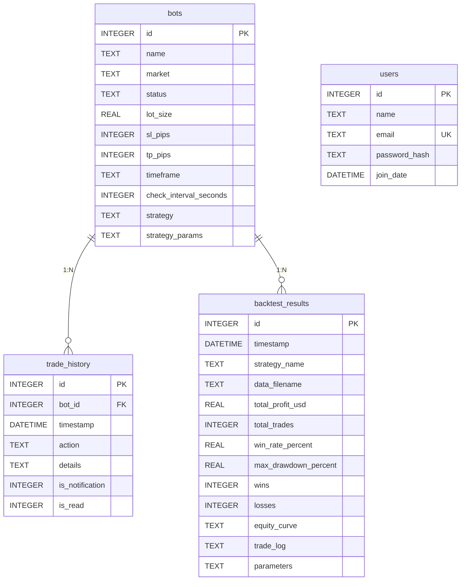
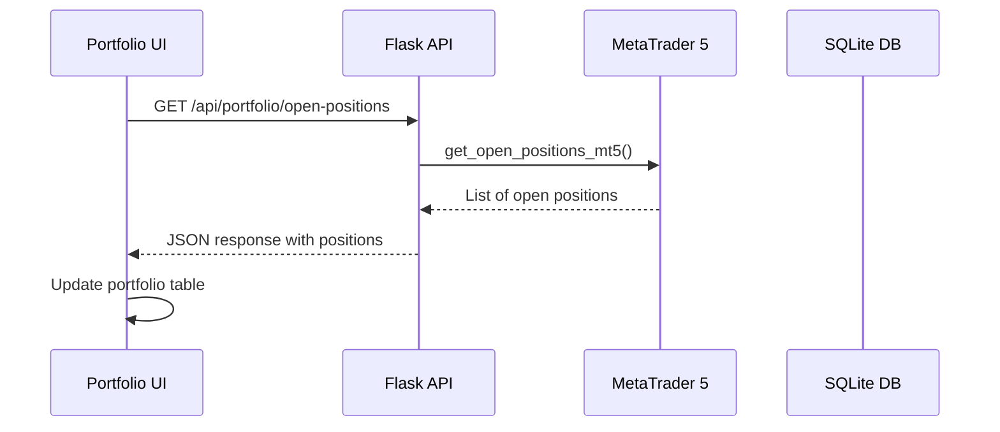
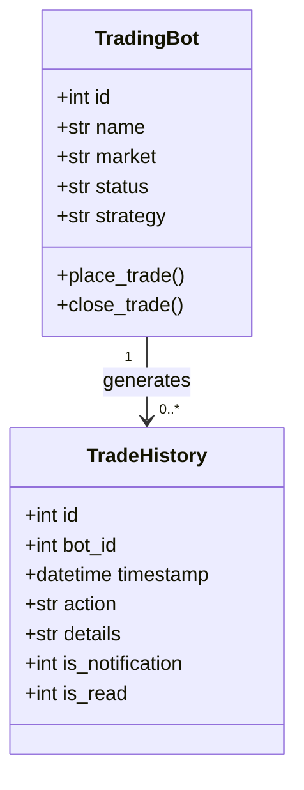
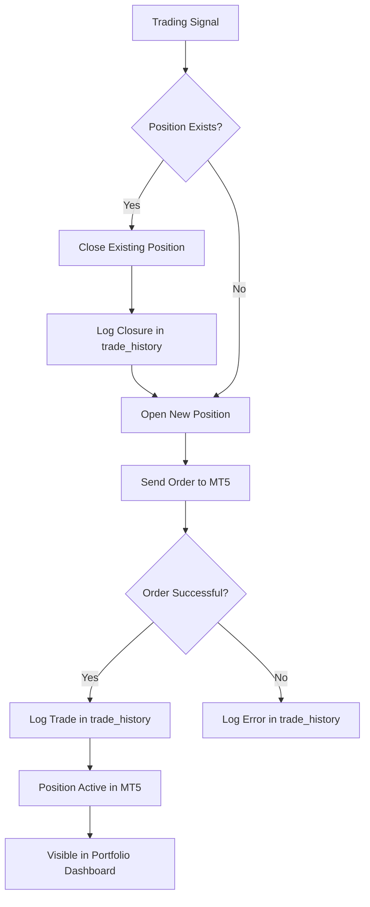

# Trades and Positions Schema

<cite>
**Referenced Files in This Document**   
- [init_db.py](file://init_db.py#L49-L78)
- [mt5.py](file://core/utils/mt5.py#L100-L115)
- [trade.py](file://core/mt5/trade.py#L0-L152)
- [trading_bot.py](file://core/bots/trading_bot.py#L142-L168)
- [queries.py](file://core/db/queries.py#L70-L85)
- [api_portfolio.py](file://core/routes/api_portfolio.py#L5-L15)
- [portfolio.html](file://templates/portfolio.html#L30-L54)
- [portfolio.js](file://static/js/portfolio.js#L75-L92)
</cite>

## Table of Contents
1. [Introduction](#introduction)
2. [Database Schema Overview](#database-schema-overview)
3. [Trades Table Structure](#trades-table-structure)
4. [Positions Tracking Mechanism](#positions-tracking-mechanism)
5. [Relationships and Constraints](#relationships-and-constraints)
6. [Data Flow and Lifecycle](#data-flow-and-lifecycle)
7. [Query Optimization and Performance](#query-optimization-and-performance)
8. [Sample Records](#sample-records)
9. [Portfolio and Backtesting Integration](#portfolio-and-backtesting-integration)
10. [Conclusion](#conclusion)

## Introduction
This document provides comprehensive documentation for the trade tracking and position management system in the quantumbotx trading platform. The system is designed to record completed trades and track currently open positions, enabling performance analysis, backtesting, and real-time portfolio monitoring. Unlike traditional database schemas with separate trades and positions tables, this implementation uses a hybrid approach where completed trades are stored in a database table while open positions are retrieved in real-time from the MetaTrader 5 (MT5) platform.

## Database Schema Overview
The quantumbotx platform uses SQLite for persistent data storage, with a schema defined in the `init_db.py` file. The system includes tables for users, bots, trade history, and backtest results. Notably, there is no dedicated "positions" table in the database schema. Instead, open positions are tracked in real-time through direct integration with the MT5 trading platform. The "trades" functionality is implemented through the `trade_history` table, which logs all trading activities and outcomes.



**Diagram sources**
- [init_db.py](file://init_db.py#L49-L114)

**Section sources**
- [init_db.py](file://init_db.py#L0-L136)

## Trades Table Structure
The trade records in quantumbotx are stored in the `trade_history` table, which captures all trading activities and outcomes. This table serves as the primary record of completed trades and trading events.

### Field Definitions
- **id**: Integer, Primary Key, Auto-increment - Unique identifier for each trade record
- **bot_id**: Integer, Foreign Key - References the `id` field in the `bots` table, establishing the relationship between trades and trading bots
- **timestamp**: Datetime, Default CURRENT_TIMESTAMP - Records when the trade action occurred
- **action**: Text, Not Null - Describes the type of trade action (e.g., "OPEN BUY", "CLOSE SELL", "ERROR")
- **details**: Text - Provides additional information about the trade, such as execution details or error messages
- **is_notification**: Integer, Not Null, Default 0 - Flag indicating whether the record should generate a user notification (0 = false, 1 = true)
- **is_read**: Integer, Not Null, Default 0 - Flag indicating whether a notification has been read by the user (0 = unread, 1 = read)

### Indexes and Constraints
The `trade_history` table includes a foreign key constraint that references the `bots` table with `ON DELETE CASCADE`, ensuring that when a bot is deleted, all its associated trade history is automatically removed. While explicit indexes are not defined in the schema, the `bot_id` and `timestamp` fields are frequently queried and would benefit from indexing for performance optimization.

### Data Retention Policy
The system does not implement a specific data retention policy for trade records in the database. All trade history is retained indefinitely unless explicitly deleted through bot removal. For time-series analysis and reporting, the application typically queries recent data, with UI components often limiting display to the last 30 days of activity.

**Section sources**
- [init_db.py](file://init_db.py#L68-L78)
- [queries.py](file://core/db/queries.py#L70-L85)

## Positions Tracking Mechanism
Unlike the persistent storage of trade history, open positions in quantumbotx are not stored in the application database. Instead, they are retrieved in real-time from the MetaTrader 5 (MT5) trading platform, reflecting the current state of active trades.

### Real-time Position Retrieval
The system uses the `get_open_positions_mt5()` function from the `mt5.py` utility module to fetch currently open positions directly from the MT5 platform. This function calls `mt5.positions_get()` from the MetaTrader 5 Python API and converts the returned tuple of position objects into a list of dictionaries for easier processing.



**Diagram sources**
- [api_portfolio.py](file://core/routes/api_portfolio.py#L5-L15)
- [mt5.py](file://core/utils/mt5.py#L100-L115)

### Position Data Structure
When retrieved from MT5, each open position contains numerous fields including:
- **ticket**: Integer - Position identifier
- **symbol**: String - Trading symbol (e.g., "EURUSD")
- **volume**: Float - Trade volume/lot size
- **price_open**: Float - Entry price
- **sl**: Float - Stop-loss price level
- **tp**: Float - Take-profit price level
- **profit**: Float - Current profit/loss in account currency
- **type**: Integer - Order type (0 = BUY, 1 = SELL)
- **magic**: Integer - Magic number used to identify the bot that opened the position

The magic number field is particularly important as it links positions to specific trading bots, allowing the system to associate MT5 positions with application bots.

### Position Lifecycle Management
Positions are created when a trading bot executes a trade through the `place_trade()` function, which sends an order request to MT5 with the bot's ID as the magic number. When a position is closed, either by hitting stop-loss/take-profit levels or through manual closure, it is removed from the MT5 platform and will no longer appear in subsequent `get_open_positions_mt5()` calls. The closure event is then recorded in the `trade_history` table.

**Section sources**
- [mt5.py](file://core/utils/mt5.py#L100-L115)
- [trade.py](file://core/mt5/trade.py#L0-L152)
- [trading_bot.py](file://core/bots/trading_bot.py#L142-L168)

## Relationships and Constraints
The trade and position tracking system in quantumbotx implements several important relationships and constraints that define how trading bots, trades, and positions are connected.

### One-to-Many Relationship: Bots to Trades
Each trading bot can generate multiple trade records, establishing a one-to-many relationship between bots and trade history entries. This relationship is enforced through the `bot_id` foreign key in the `trade_history` table that references the `id` field in the `bots` table.



**Diagram sources**
- [init_db.py](file://init_db.py#L49-L78)
- [trading_bot.py](file://core/bots/trading_bot.py#L0-L169)

### Bot to Positions Relationship
Although there is no direct database table for positions, a logical one-to-many relationship exists between bots and open positions. A single bot can have at most one open position at a time for its designated market, as the trading logic closes any existing position before opening a new one in the opposite direction. This relationship is maintained through the magic number field in MT5 positions, which is set to the bot's database ID when a trade is executed.

### Foreign Key Constraints
The only explicit foreign key constraint in the trade tracking system is between the `trade_history.bot_id` field and the `bots.id` field. This constraint ensures referential integrity and is defined with `ON DELETE CASCADE`, meaning that when a bot is deleted, all its associated trade history records are automatically removed from the database.

### Data Integrity Considerations
Since open positions are not stored in the application database, there is a potential for data inconsistency if the connection to MT5 is lost or if position data cannot be retrieved. The system mitigates this risk by using the magic number to reliably associate positions with bots and by logging all trade actions in the persistent `trade_history` table.

**Section sources**
- [init_db.py](file://init_db.py#L68-L78)
- [trading_bot.py](file://core/bots/trading_bot.py#L142-L168)

## Data Flow and Lifecycle
The trade and position management system in quantumbotx follows a specific data flow pattern that integrates database persistence with real-time trading platform data.

### Trade Execution Flow
When a trading bot generates a signal to open a position, the following sequence occurs:
1. The bot calls `place_trade()` with the appropriate parameters
2. The trade request is sent to MT5 with the bot's ID as the magic number
3. If successful, MT5 creates a new position and returns a result
4. The bot logs the trade action in the `trade_history` table via `add_history_log()`
5. The position appears in subsequent calls to `get_open_positions_mt5()`



**Diagram sources**
- [trading_bot.py](file://core/bots/trading_bot.py#L142-L168)
- [trade.py](file://core/mt5/trade.py#L0-L152)

### Position Closure Flow
Positions can be closed through several mechanisms:
- Hitting stop-loss or take-profit levels
- Receiving a contrary trading signal
- Manual closure through the UI
- Bot deactivation

When a position is closed, the flow is:
1. The closure action is initiated (automatically or manually)
2. A close order is sent to MT5
3. MT5 removes the position from its active positions list
4. The closure is logged in the `trade_history` table
5. The position disappears from subsequent `get_open_positions_mt5()` calls

### Data Synchronization
The system maintains data consistency through careful logging and state management. All significant trading events are recorded in the `trade_history` table, providing an audit trail even if real-time position data becomes temporarily unavailable. The magic number serves as the critical link between database records and MT5 platform positions, ensuring that the application can correctly associate trading activities with specific bots.

**Section sources**
- [trading_bot.py](file://core/bots/trading_bot.py#L142-L168)
- [mt5.py](file://core/utils/mt5.py#L100-L115)

## Query Optimization and Performance
While the current implementation does not include explicit database indexes beyond primary keys, several optimization opportunities exist for improving query performance, especially for time-series data retrieval and aggregation.

### Recommended Indexes
To optimize common query patterns, the following indexes should be considered:
- **Index on bot_id**: This would accelerate queries that retrieve trade history for a specific bot, which is a common operation in the bot detail views
- **Index on timestamp**: This would improve performance for time-range queries, such as retrieving trades from the last 24 hours or last 7 days
- **Composite index on (bot_id, timestamp)**: This would optimize queries that retrieve a specific bot's trade history within a time range, which is essential for performance reporting and backtesting analysis

### Time-series Data Retrieval
For efficient time-series data retrieval, queries should use the timestamp field with appropriate WHERE clauses:
```sql
-- Retrieve trades for a specific bot from the last 7 days
SELECT * FROM trade_history 
WHERE bot_id = ? 
AND timestamp >= datetime('now', '-7 days') 
ORDER BY timestamp DESC;
```

### Aggregation Queries
For portfolio performance calculations, aggregation queries can be used to summarize trade history:
```sql
-- Calculate total profit for a specific bot
SELECT SUM(CASE WHEN action LIKE 'CLOSE%' THEN CAST(details AS REAL) ELSE 0 END) as total_profit
FROM trade_history 
WHERE bot_id = ? AND action LIKE 'CLOSE%';
```

### Performance Considerations
Since open positions are retrieved from MT5 rather than queried from a local database, their retrieval performance depends on the MT5 platform connection and the number of active positions. The trade history queries, however, are subject to database performance limitations. As the trade_history table grows, implementing the recommended indexes will become increasingly important for maintaining responsive UI performance.

**Section sources**
- [queries.py](file://core/db/queries.py#L85-L102)
- [init_db.py](file://init_db.py#L68-L78)

## Sample Records
The following examples illustrate typical records in the trade history system and demonstrate how open positions are represented.

### Completed Trade Records
**Sample trade_history record for a successful trade:**
```
{
  "id": 12345,
  "bot_id": 7,
  "timestamp": "2023-12-01 14:30:25",
  "action": "OPEN BUY",
  "details": "Membuka posisi BELI berdasarkan sinyal.",
  "is_notification": 1,
  "is_read": 1
}
```

**Sample trade_history record for a closed trade:**
```
{
  "id": 12346,
  "bot_id": 7,
  "timestamp": "2023-12-01 16:45:10",
  "action": "CLOSE BUY",
  "details": "Menutup posisi BELI: Take-profit tercapai.",
  "is_notification": 1,
  "is_read": 0
}
```

### Active Position Record
**Sample position from MT5 (as returned by get_open_positions_mt5):**
```
{
  "ticket": 987654,
  "symbol": "EURUSD",
  "volume": 0.1,
  "price_open": 1.08543,
  "sl": 1.08043,
  "tp": 1.09543,
  "profit": 12.50,
  "type": 0,
  "magic": 7,
  "comment": "QuantumBotX Trade"
}
```
In this example, the `magic` field value of 7 corresponds to the bot ID, linking this active position to a specific trading bot in the application.

**Section sources**
- [mt5.py](file://core/utils/mt5.py#L100-L115)
- [init_db.py](file://init_db.py#L68-L78)

## Portfolio and Backtesting Integration
The trade and position tracking system serves as the foundation for portfolio performance calculations and backtesting result comparisons in the quantumbotx platform.

### Portfolio Performance Calculations
The system supports portfolio performance analysis by aggregating data from both completed trades and active positions:
- **Historical performance**: Calculated from closed trades in the `trade_history` table
- **Current exposure**: Determined from active positions retrieved from MT5
- **Risk metrics**: Derived from stop-loss levels and position sizes

The portfolio dashboard combines these data sources to provide a comprehensive view of trading performance, showing both realized profits from closed trades and unrealized profits from open positions.

### Backtesting Result Comparisons
Backtesting results are stored in the `backtest_results` table, which includes fields for total profit, win rate, maximum drawdown, and trade logs. These results can be compared against live trading performance by:
- Comparing backtested win rates with actual win rates from `trade_history`
- Analyzing equity curves from backtests versus actual portfolio value changes
- Evaluating risk metrics like maximum drawdown across both simulated and live trading

### Data Aggregation for Reporting
The system enables various performance reports by aggregating trade history data:
- **Profit and loss statements**: Summarizing gains and losses over specific time periods
- **Trade frequency analysis**: Counting trades by strategy, symbol, or time of day
- **Win/loss ratio calculations**: Determining the success rate of trading strategies
- **Average profit per trade**: Calculating the mean profitability of closed trades

These aggregations are essential for evaluating bot performance and making informed decisions about strategy optimization and risk management.

**Section sources**
- [backtest_results table](file://init_db.py#L80-L114)
- [api_portfolio.py](file://core/routes/api_portfolio.py#L17-L57)

## Conclusion
The trades and positions system in quantumbotx implements a hybrid approach that combines persistent database storage for trade history with real-time retrieval of open positions from the MT5 platform. The `trade_history` table serves as the primary record of all trading activities, capturing completed trades and significant events with a schema that includes bot_id, timestamp, action, and details fields. This table maintains a one-to-many relationship with the bots table through a foreign key constraint.

For open positions, the system leverages direct integration with MT5 through the `get_open_positions_mt5()` function, eliminating the need for a separate positions table and ensuring that position data is always current. The magic number field in MT5 positions provides the critical link between platform positions and application bots.

This architecture enables comprehensive portfolio performance calculations and backtesting comparisons by combining historical trade data with real-time position information. For optimal performance, implementing indexes on the bot_id and timestamp fields is recommended to accelerate common query patterns. The system provides a robust foundation for trading analytics while maintaining data consistency through careful logging and state management.