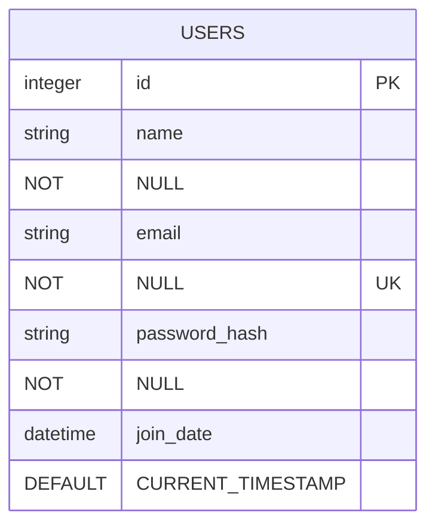
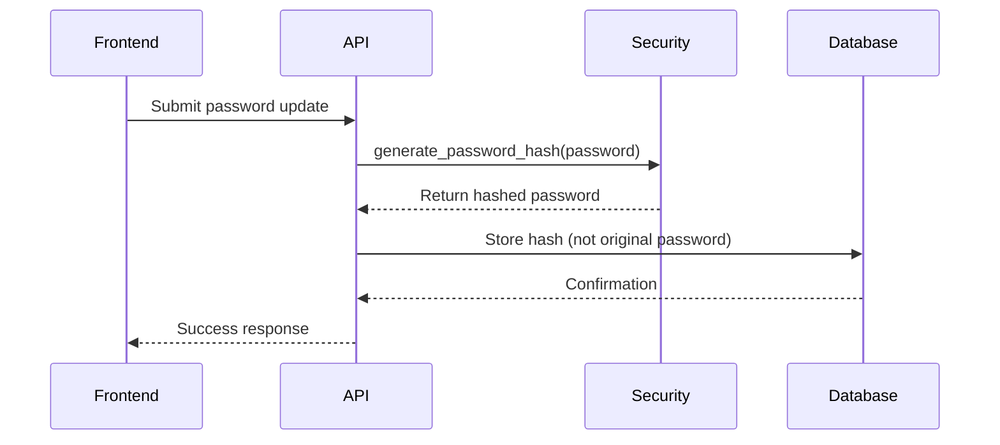
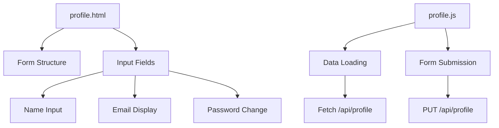
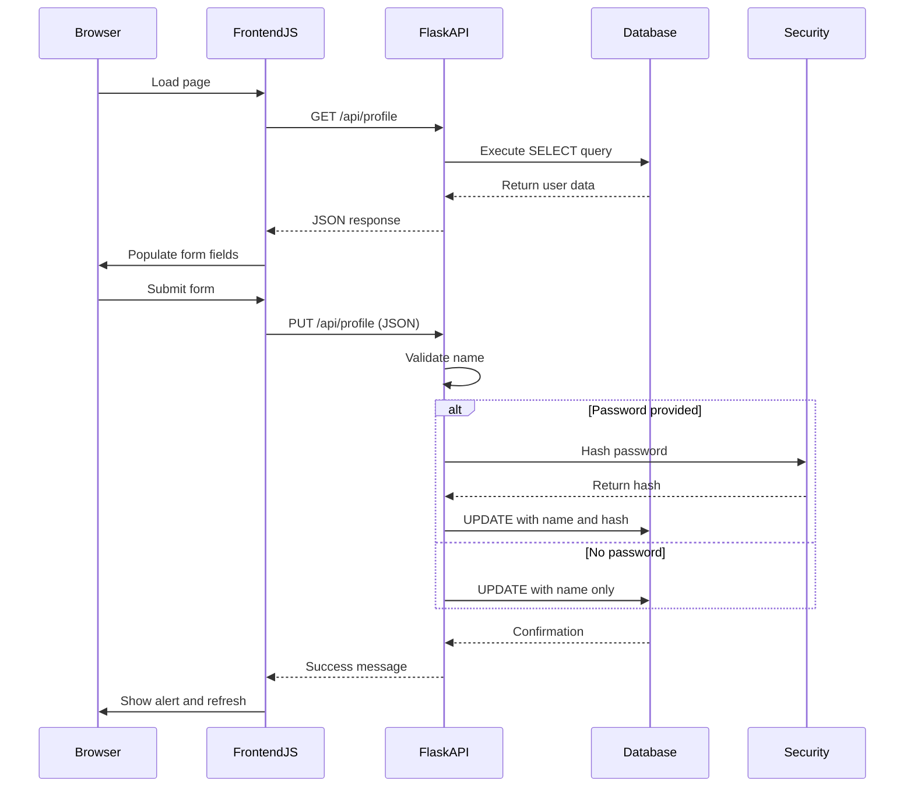

# User Profile Schema

<cite>
**Referenced Files in This Document**   
- [init_db.py](file://init_db.py#L25-L45)
- [api_profile.py](file://core/routes/api_profile.py#L10-L38)
- [profile.html](file://templates/profile.html#L1-L48)
- [profile.js](file://static/js/profile.js#L1-L60)
</cite>

## Table of Contents
1. [User Profile Schema Overview](#user-profile-schema-overview)
2. [Database Schema Details](#database-schema-details)
3. [Security Implementation](#security-implementation)
4. [Frontend Integration](#frontend-integration)
5. [Query Patterns and API Usage](#query-patterns-and-api-usage)
6. [Data Privacy and Security Considerations](#data-privacy-and-security-considerations)

## User Profile Schema Overview

The user profile system in the quantumbotx application manages user identity, authentication, and basic account information. The schema is designed to support a single-user application with fields for personal identification, secure authentication, and account metadata. The implementation uses SQLite as the database backend with a simple users table that stores essential user information.

The user profile functionality is integrated across multiple layers of the application:
- **Database layer**: Stores user data in the SQLite database
- **Backend API**: Provides REST endpoints for profile retrieval and updates
- **Frontend interface**: Allows users to view and modify their profile information

**Section sources**
- [init_db.py](file://init_db.py#L25-L45)
- [api_profile.py](file://core/routes/api_profile.py#L10-L38)

## Database Schema Details

The users table in the quantumbotx database contains the following fields:



**Diagram sources**
- [init_db.py](file://init_db.py#L25-L45)

### Field Specifications

**id**
- Type: INTEGER
- Constraints: PRIMARY KEY, AUTOINCREMENT
- Description: Unique identifier for the user record

**name**
- Type: TEXT
- Constraints: NOT NULL
- Description: User's full name or display name
- Example: "Admin User"

**email**
- Type: TEXT
- Constraints: NOT NULL, UNIQUE
- Description: User's email address used as a unique identifier
- Example: "admin@quantumbotx.com"

**password_hash**
- Type: TEXT
- Constraints: NOT NULL
- Description: Secure hash of the user's password using Werkzeug's security functions
- Example: "pbkdf2:sha256:260000$..."

**join_date**
- Type: DATETIME
- Constraints: DEFAULT CURRENT_TIMESTAMP
- Description: Timestamp when the user account was created
- Format: Stored as SQLite DATETIME, formatted as "DD MMM YYYY" for display

### Constraints and Indexes

The users table implements the following constraints:
- **Primary Key**: id field ensures unique user identification
- **Unique Constraint**: email field prevents duplicate email addresses
- **Not Null Constraints**: name, email, and password_hash fields require values
- **Default Value**: join_date automatically populated with account creation timestamp

The schema is optimized for a single-user application, as evidenced by the hardcoded user ID (1) in the API endpoints, suggesting this implementation is designed for personal use rather than multi-user support.

**Section sources**
- [init_db.py](file://init_db.py#L25-L45)

## Security Implementation

### Password Hashing Strategy

The application implements secure password storage using Werkzeug's security utilities:

```python
from werkzeug.security import generate_password_hash

# Password hashing implementation
default_password_hash = generate_password_hash('admin')
```

The `generate_password_hash` function creates a secure PBKDF2 hash with the following characteristics:
- Algorithm: PBKDF2 with SHA-256
- Salt length: 8 bytes (default)
- Iterations: 260,000 (default for PBKDF2)
- Hash format: Includes algorithm, iterations, salt, and hash in a single string

This approach follows security best practices by:
- Using a proven cryptographic algorithm
- Incorporating random salt to prevent rainbow table attacks
- Employing high iteration counts to slow down brute force attempts
- Storing all necessary hash parameters in the database field



**Diagram sources**
- [api_profile.py](file://core/routes/api_profile.py#L15-L38)
- [init_db.py](file://init_db.py#L75-L78)

### Authentication Flow

The authentication system follows a simple but secure pattern:

1. Passwords are never stored in plain text
2. During login (not shown in code), the system would use `check_password_hash` to verify credentials
3. The password hash is updated only when the user explicitly changes their password
4. The system prevents empty name updates with validation

The current implementation only supports updating the user's name and password, with the email field being read-only through the API, suggesting it serves as a permanent identifier.

**Section sources**
- [api_profile.py](file://core/routes/api_profile.py#L15-L38)

## Frontend Integration

### User Interface Components

The user profile interface is implemented across HTML, CSS, and JavaScript files:



**Diagram sources**
- [profile.html](file://templates/profile.html#L1-L48)
- [profile.js](file://static/js/profile.js#L1-L60)

### Profile Form Structure

The profile form includes the following elements:

**Name Field**
- Input type: text
- ID: profile-name
- Purpose: Allows updating the user's display name
- Validation: Required field

**Email Field**
- Input type: email
- ID: profile-email
- Purpose: Displays the user's email address
- State: Read-only (display only)

**Password Field**
- Input type: password
- ID: profile-password
- Purpose: Allows password changes
- Behavior: Optional field (only processed if filled)

### JavaScript Implementation

The frontend logic in profile.js handles the complete profile management workflow:

```javascript
// Function to load profile data
const loadProfile = async () => {
    const response = await fetch('/api/profile');
    const user = await response.json();
    
    // Populate form fields
    profileNameInput.value = user.name;
    profileEmailInput.value = user.email;
    displayName.textContent = user.name;
    joinDate.textContent = `Joined since: ${user.join_date}`;
};

// Function to save profile changes
const saveProfile = async (e) => {
    e.preventDefault();
    
    const dataToUpdate = { name: profileNameInput.value };
    if (profilePasswordInput.value) {
        dataToUpdate.password = profilePasswordInput.value;
    }
    
    const response = await fetch('/api/profile', {
        method: 'PUT',
        headers: { 'Content-Type': 'application/json' },
        body: JSON.stringify(dataToUpdate),
    });
    
    // Handle response and refresh data
    profilePasswordInput.value = '';
    loadProfile();
};
```

The implementation follows best practices by:
- Preventing default form submission behavior
- Only sending password data when explicitly provided
- Clearing the password field after successful update
- Refreshing the displayed data after updates
- Providing user feedback through alerts

**Section sources**
- [profile.html](file://templates/profile.html#L1-L48)
- [profile.js](file://static/js/profile.js#L1-L60)

## Query Patterns and API Usage

### Data Retrieval Pattern

The GET /api/profile endpoint retrieves user information with formatted date display:

```sql
SELECT id, name, email, strftime("%d %b %Y", join_date) as join_date 
FROM users 
WHERE id = ?
```

Key aspects of this query:
- Uses parameterized query to prevent SQL injection
- Formats the join_date for user-friendly display
- Returns only a single user record (hardcoded ID = 1)
- Converts SQLite Row object to dictionary for JSON response

### Profile Update Pattern

The PUT /api/profile endpoint handles profile updates with conditional logic:

```sql
-- Update with password change
UPDATE users SET name = ?, password_hash = ? WHERE id = ?

-- Update without password change  
UPDATE users SET name = ? WHERE id = ?
```

The update logic includes:
- Validation to ensure name is not empty
- Conditional password hashing only when password is provided
- Transaction safety with explicit commit
- Error handling for database operations

### API Endpoint Summary

**GET /api/profile**
- Method: GET
- Response: User profile data (id, name, email, formatted join_date)
- Error: 404 if user not found
- Security: No authentication shown in code

**PUT /api/profile**
- Method: PUT
- Request body: JSON with name and optional password
- Validation: Rejects empty name
- Response: Success message
- Security: Password hashed before storage



**Diagram sources**
- [api_profile.py](file://core/routes/api_profile.py#L10-L38)
- [profile.js](file://static/js/profile.js#L25-L60)

**Section sources**
- [api_profile.py](file://core/routes/api_profile.py#L10-L38)
- [profile.js](file://static/js/profile.js#L25-L60)

## Data Privacy and Security Considerations

### Current Security Strengths

The user profile implementation includes several security best practices:

**Secure Password Storage**
- Uses Werkzeug's industry-standard password hashing
- Implements PBKDF2 with high iteration count
- Automatically generates and stores salt values
- Never stores plain text passwords

**Input Validation**
- Validates that name field is not empty
- Uses parameterized queries to prevent SQL injection
- Sanitizes input through Flask request handling

**Data Minimization**
- Stores only essential user information
- No unnecessary personal data collection
- Simple schema reduces attack surface

### Security Limitations and Recommendations

**Authentication Mechanism**
- No visible session management or token generation
- API endpoints lack authentication checks
- Recommendation: Implement JWT or session-based authentication

**Single User Architecture**
- Hardcoded user ID (1) limits multi-user support
- Email uniqueness constraint suggests multi-user capability
- Recommendation: Implement proper user authentication and authorization

**Missing Features**
- No password reset functionality
- No account recovery options
- No two-factor authentication
- Recommendation: Add comprehensive authentication features

### Data Privacy Compliance

The current implementation should consider the following privacy aspects:

**Data Encryption**
- Database file is not encrypted at rest
- Recommendation: Implement SQLite encryption or use encrypted storage

**Access Controls**
- No role-based access control
- All users would have same privileges
- Recommendation: Implement user roles and permissions

**Audit Logging**
- No visible logging of profile changes
- Recommendation: Add audit logs for security events

**Data Retention**
- No account deletion functionality
- Recommendation: Implement GDPR-compliant data handling

The user profile system provides a solid foundation for authentication but would benefit from enhanced security features for production deployment, particularly around authentication, authorization, and comprehensive user management.

**Section sources**
- [init_db.py](file://init_db.py#L25-L45)
- [api_profile.py](file://core/routes/api_profile.py#L10-L38)