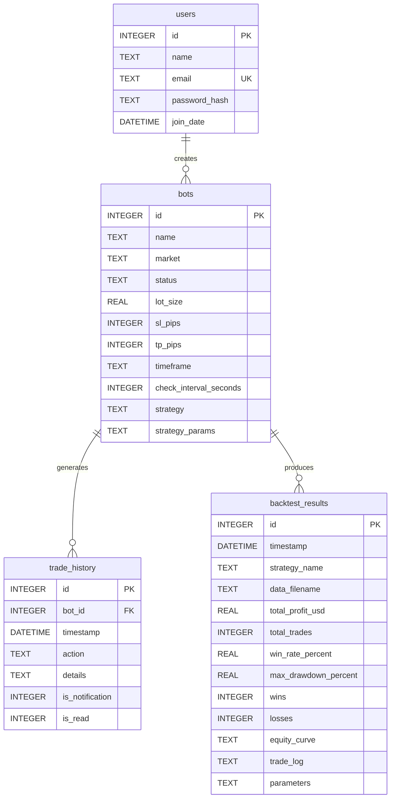

# Database Model Extension

<cite>
**Referenced Files in This Document**   
- [init_db.py](file://init_db.py#L0-L136)
- [core/db/models.py](file://core/db/models.py#L0-L20)
- [core/db/connection.py](file://core/db/connection.py#L0-L14)
- [core/db/queries.py](file://core/db/queries.py#L0-L174)
- [core/routes/api_bots.py](file://core/routes/api_bots.py#L0-L167)
</cite>

## Table of Contents
1. [Introduction](#introduction)
2. [Current Database Schema Overview](#current-database-schema-overview)
3. [Extending the Database Schema](#extending-the-database-schema)
4. [Step-by-Step Guide to Adding a New Model](#step-by-step-guide-to-adding-a-new-model)
5. [Implementing Query Functions](#implementing-query-functions)
6. [CRUD Operations Example](#crud-operations-example)
7. [Transaction Management and Data Integrity](#transaction-management-and-data-integrity)
8. [Indexing and Performance Optimization](#indexing-and-performance-optimization)
9. [Testing Database Changes](#testing-database-changes)
10. [Integration with API Endpoints](#integration-with-api-endpoints)
11. [Conclusion](#conclusion)

## Introduction
This document provides a comprehensive guide for extending the database schema in the quantumbotx application. The system currently uses SQLite as its primary database engine, with schema initialization handled through `init_db.py` and data access managed via Python modules in the `core/db` directory. This guide details the process of adding new models such as 'Watchlist' or 'TradeJournal', including schema definition, migration strategies, query implementation, and integration with existing components.

**Section sources**
- [init_db.py](file://init_db.py#L0-L136)
- [core/db/models.py](file://core/db/models.py#L0-L20)

## Current Database Schema Overview
The quantumbotx application defines its database schema using raw SQL statements in `init_db.py`. The current schema consists of four main tables: `users`, `bots`, `trade_history`, and `backtest_results`. These tables are created during the initial setup process when running `init_db.py`.

The `bots` table stores trading bot configurations, while `trade_history` maintains a log of bot activities with a foreign key relationship to `bots`. The `backtest_results` table holds performance metrics from backtesting operations, and `users` manages user authentication data.



**Diagram sources**
- [init_db.py](file://init_db.py#L0-L136)

**Section sources**
- [init_db.py](file://init_db.py#L0-L136)

## Extending the Database Schema
To extend the database schema in quantumbotx, modifications must be made to both the schema initialization logic and the data access layer. Since the application uses SQLite without an ORM, schema changes require direct SQL manipulation.

Key considerations for schema extension include:
- Maintaining backward compatibility
- Preserving data integrity
- Ensuring proper indexing for performance
- Handling transactions safely

The `init_db.py` script serves as the single source of truth for table definitions. Any new model must be added here using a `CREATE TABLE IF NOT EXISTS` statement to prevent errors during reinitialization.

**Section sources**
- [init_db.py](file://init_db.py#L0-L136)

## Step-by-Step Guide to Adding a New Model
This section provides a detailed walkthrough for adding a new model, using a 'Watchlist' entity as an example.

### Step 1: Define the Table Schema
Add a new SQL statement in `init_db.py` to define the `watchlist` table:

```python
# SQL statement for creating 'watchlist' table
sql_create_watchlist_table = """
CREATE TABLE IF NOT EXISTS watchlist (
    id INTEGER PRIMARY KEY AUTOINCREMENT,
    user_id INTEGER NOT NULL,
    symbol TEXT NOT NULL,
    added_date DATETIME DEFAULT CURRENT_TIMESTAMP,
    notes TEXT,
    alert_price REAL,
    FOREIGN KEY (user_id) REFERENCES users (id) ON DELETE CASCADE
);
"""
```

Insert this before the connection creation in the `main()` function and call `create_table(conn, sql_create_watchlist_table)`.

### Step 2: Update Database Initialization
Modify the `main()` function in `init_db.py` to include the new table creation:

```python
print("\nCreating 'watchlist' table...")
create_table(conn, sql_create_watchlist_table)
```

### Step 3: Create Model Representation
Although the project does not use formal ORM classes, create a logical representation in `models.py`:

```python
# core/db/models.py
class WatchlistEntry:
    def __init__(self, id=None, user_id=None, symbol=None, notes=None, alert_price=None):
        self.id = id
        self.user_id = user_id
        self.symbol = symbol
        self.notes = notes
        self.alert_price = alert_price
```

**Section sources**
- [init_db.py](file://init_db.py#L0-L136)
- [core/db/models.py](file://core/db/models.py#L0-L20)

## Implementing Query Functions
New query functions should follow the patterns established in `queries.py`. All database interactions should use the `get_db_connection()` context manager for proper resource handling.

### Watchlist Query Functions
Add the following functions to `queries.py`:

```python
def add_to_watchlist(user_id, symbol, notes=None, alert_price=None):
    """Add a symbol to user's watchlist."""
    try:
        with get_db_connection() as conn:
            cursor = conn.cursor()
            cursor.execute(
                'INSERT INTO watchlist (user_id, symbol, notes, alert_price) VALUES (?, ?, ?, ?)',
                (user_id, symbol, notes, alert_price)
            )
            conn.commit()
            return cursor.lastrowid
    except sqlite3.Error as e:
        logger.error(f"Failed to add to watchlist: {e}")
        return None

def get_watchlist_by_user(user_id):
    """Retrieve all watchlist entries for a user."""
    try:
        with get_db_connection() as conn:
            entries = conn.execute(
                'SELECT * FROM watchlist WHERE user_id = ? ORDER BY added_date DESC',
                (user_id,)
            ).fetchall()
            return [dict(row) for row in entries]
    except sqlite3.Error as e:
        logger.error(f"Database error retrieving watchlist: {e}")
        return []

def remove_from_watchlist(entry_id, user_id):
    """Remove an entry from watchlist."""
    try:
        with get_db_connection() as conn:
            conn.execute(
                'DELETE FROM watchlist WHERE id = ? AND user_id = ?',
                (entry_id, user_id)
            )
            conn.commit()
            return True
    except sqlite3.Error as e:
        logger.error(f"Failed to remove from watchlist: {e}")
        return False
```

**Section sources**
- [core/db/queries.py](file://core/db/queries.py#L0-L174)
- [core/db/connection.py](file://core/db/connection.py#L0-L14)

## CRUD Operations Example
This section demonstrates complete CRUD operations for the new Watchlist model using the connection interface.

### Create Operation
```python
from core.db.queries import add_to_watchlist

# Add BTC/USDT to user 1's watchlist
entry_id = add_to_watchlist(
    user_id=1,
    symbol="BTC/USDT",
    notes="Potential breakout pattern forming",
    alert_price=50000.0
)
if entry_id:
    print(f"Successfully added to watchlist with ID: {entry_id}")
```

### Read Operation
```python
from core.db.queries import get_watchlist_by_user

# Retrieve all watchlist entries for user 1
watchlist = get_watchlist_by_user(1)
for item in watchlist:
    print(f"{item['symbol']}: {item['notes'] or 'No notes'}")
```

### Update Operation
```python
def update_watchlist_entry(entry_id, user_id, **updates):
    """Update specific fields of a watchlist entry."""
    try:
        with get_db_connection() as conn:
            # Build dynamic update query
            set_clause = ', '.join([f"{k} = ?" for k in updates.keys()])
            values = list(updates.values()) + [entry_id, user_id]
            
            query = f"UPDATE watchlist SET {set_clause} WHERE id = ? AND user_id = ?"
            conn.execute(query, values)
            conn.commit()
            return True
    except sqlite3.Error as e:
        logger.error(f"Failed to update watchlist: {e}")
        return False

# Update alert price
success = update_watchlist_entry(
    entry_id=1,
    user_id=1,
    alert_price=52000.0,
    notes="Updated analysis: stronger resistance at $52k"
)
```

### Delete Operation
```python
from core.db.queries import remove_from_watchlist

# Remove entry from watchlist
if remove_from_watchlist(entry_id=1, user_id=1):
    print("Successfully removed from watchlist")
```

**Section sources**
- [core/db/queries.py](file://core/db/queries.py#L0-L174)
- [core/db/connection.py](file://core/db/connection.py#L0-L14)

## Transaction Management and Data Integrity
The quantumbotx application leverages SQLite's built-in transaction support through the context manager pattern. All write operations should be wrapped in `with get_db_connection()` blocks to ensure atomicity.

Key principles:
- **Atomicity**: Each `with` block creates a transaction that automatically commits on successful completion or rolls back on exception
- **Consistency**: Foreign key constraints (e.g., `ON DELETE CASCADE`) maintain referential integrity
- **Isolation**: SQLite handles isolation at the connection level
- **Durability**: Changes are written to disk upon commit

Example of complex transaction:
```python
def add_symbol_with_notification(user_id, symbol, alert_price):
    """Add symbol to watchlist and create a notification."""
    try:
        with get_db_connection() as conn:
            # Both operations in same transaction
            cursor = conn.cursor()
            cursor.execute(
                'INSERT INTO watchlist (user_id, symbol, alert_price) VALUES (?, ?, ?)',
                (user_id, symbol, alert_price)
            )
            watchlist_id = cursor.lastrowid
            
            # Create related notification
            cursor.execute(
                'INSERT INTO trade_history (bot_id, action, details, is_notification) VALUES (?, ?, ?, ?)',
                (None, 'WATCHLIST_ADD', f'Symbol {symbol} added with alert ${alert_price}', 1)
            )
            
            conn.commit()
            return watchlist_id
    except sqlite3.Error as e:
        logger.error(f"Transaction failed: {e}")
        return None
```

**Section sources**
- [core/db/connection.py](file://core/db/connection.py#L0-L14)
- [core/db/queries.py](file://core/db/queries.py#L0-L174)

## Indexing and Performance Optimization
To maintain performance as data grows, appropriate indexes should be created for frequently queried columns.

### Recommended Indexes
Add these index creations in `init_db.py` after table creation:

```python
# Create indexes for performance
def create_index(conn, index_sql):
    """Create an index if it doesn't exist."""
    try:
        c = conn.cursor()
        c.execute(index_sql)
        print("Index created successfully.")
    except sqlite3.Error as e:
        print(f"Index creation warning: {e}")  # Index might already exist

# In main() function, after table creation:
create_index(conn, "CREATE INDEX IF NOT EXISTS idx_trade_history_bot_id ON trade_history(bot_id)")
create_index(conn, "CREATE INDEX IF NOT EXISTS idx_watchlist_user_id ON watchlist(user_id)")
create_index(conn, "CREATE INDEX IF NOT EXISTS idx_watchlist_symbol ON watchlist(symbol)")
create_index(conn, "CREATE INDEX IF NOT EXISTS idx_backtest_timestamp ON backtest_results(timestamp)")
```

### Query Optimization Tips
- Use parameterized queries to prevent SQL injection
- Select only needed columns instead of `SELECT *`
- Use appropriate WHERE clauses to limit result sets
- Consider query frequency when designing indexes

**Section sources**
- [init_db.py](file://init_db.py#L0-L136)

## Testing Database Changes
Database changes should be tested using isolated test environments to prevent data corruption.

### Test Database Setup
```python
import tempfile
import os
import shutil

class TestDatabase:
    def __init__(self):
        self.temp_dir = tempfile.mkdtemp()
        self.db_path = os.path.join(self.temp_dir, 'test_bots.db')
        
    def setup(self):
        # Temporarily override database path
        original_path = connection.DATABASE_PATH
        connection.DATABASE_PATH = self.db_path
        
        # Initialize test database
        init_db.DB_FILE = self.db_path
        init_db.main()
        
        return original_path
    
    def teardown(self, original_path):
        connection.DATABASE_PATH = original_path
        shutil.rmtree(self.temp_dir)
```

### Example Test Case
```python
def test_watchlist_crud():
    db = TestDatabase()
    original_path = db.setup()
    
    try:
        # Test create
        entry_id = queries.add_to_watchlist(1, "ETH/USDT")
        assert entry_id is not None
        
        # Test read
        watchlist = queries.get_watchlist_by_user(1)
        assert len(watchlist) == 1
        assert watchlist[0]['symbol'] == 'ETH/USDT'
        
        # Test delete
        success = queries.remove_from_watchlist(entry_id, 1)
        assert success is True
        
    finally:
        db.teardown(original_path)
```

**Section sources**
- [init_db.py](file://init_db.py#L0-L136)
- [core/db/queries.py](file://core/db/queries.py#L0-L174)
- [core/db/connection.py](file://core/db/connection.py#L0-L14)

## Integration with API Endpoints
New models must be exposed through API endpoints to be accessible by the frontend.

### API Route Example
Add to `core/routes/api_portfolio.py`:

```python
@api_portfolio.route('/api/watchlist', methods=['GET'])
def get_watchlist():
    """Get current user's watchlist."""
    # In a real implementation, get user_id from session
    user_id = 1  # Placeholder
    watchlist = queries.get_watchlist_by_user(user_id)
    return jsonify(watchlist)

@api_portfolio.route('/api/watchlist', methods=['POST'])
def add_watchlist_item():
    """Add item to watchlist."""
    data = request.get_json()
    user_id = 1  # From authentication
    entry_id = queries.add_to_watchlist(
        user_id=user_id,
        symbol=data.get('symbol'),
        notes=data.get('notes'),
        alert_price=data.get('alert_price')
    )
    if entry_id:
        return jsonify({"message": "Added to watchlist", "id": entry_id}), 201
    return jsonify({"error": "Failed to add"}), 500
```

### Frontend Integration
The frontend JavaScript can then interact with these endpoints:

```javascript
// Add to watchlist
async function addToWatchlist(symbol, alertPrice) {
    const response = await fetch('/api/watchlist', {
        method: 'POST',
        headers: { 'Content-Type': 'application/json' },
        body: JSON.stringify({ symbol, alertPrice })
    });
    const data = await response.json();
    if (data.id) {
        showToast(`Added ${symbol} to watchlist`);
    }
}
```

**Section sources**
- [core/routes/api_bots.py](file://core/routes/api_bots.py#L0-L167)
- [core/db/queries.py](file://core/db/queries.py#L0-L174)

## Conclusion
Extending the database schema in quantumbotx requires careful coordination between schema definition, query implementation, and API integration. By following the patterns established in the existing codebase—particularly the use of raw SQL statements in `init_db.py`, the query function patterns in `queries.py`, and the connection management in `connection.py`—new models can be added safely and efficiently. Always ensure proper transaction handling, data integrity constraints, and thorough testing in isolated environments before deploying schema changes to production.