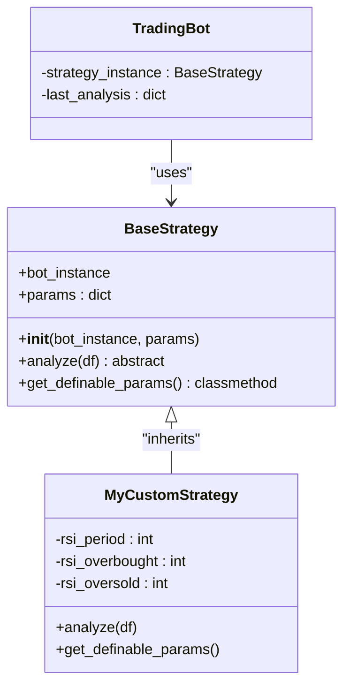
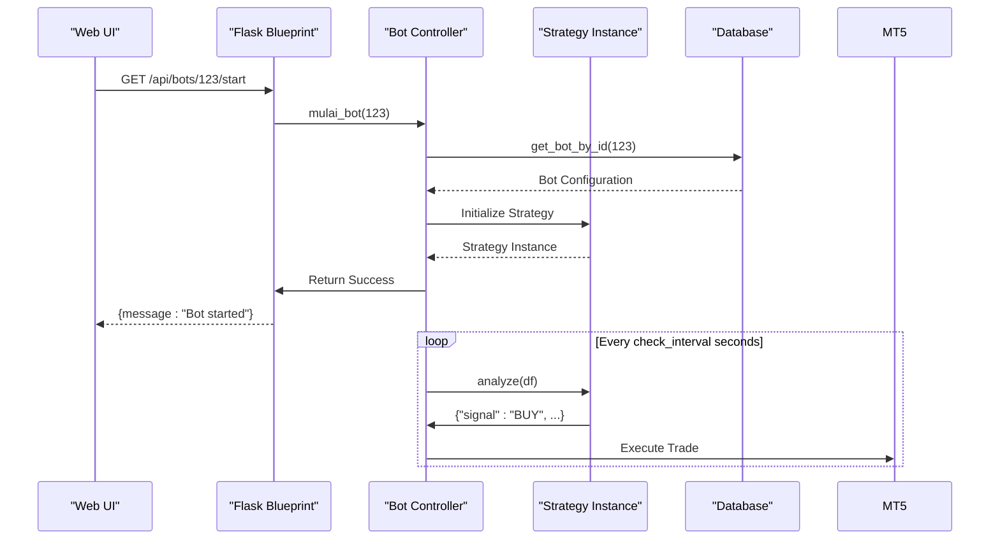
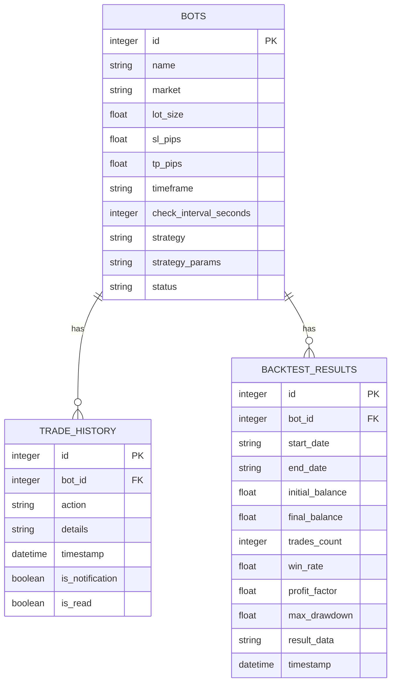
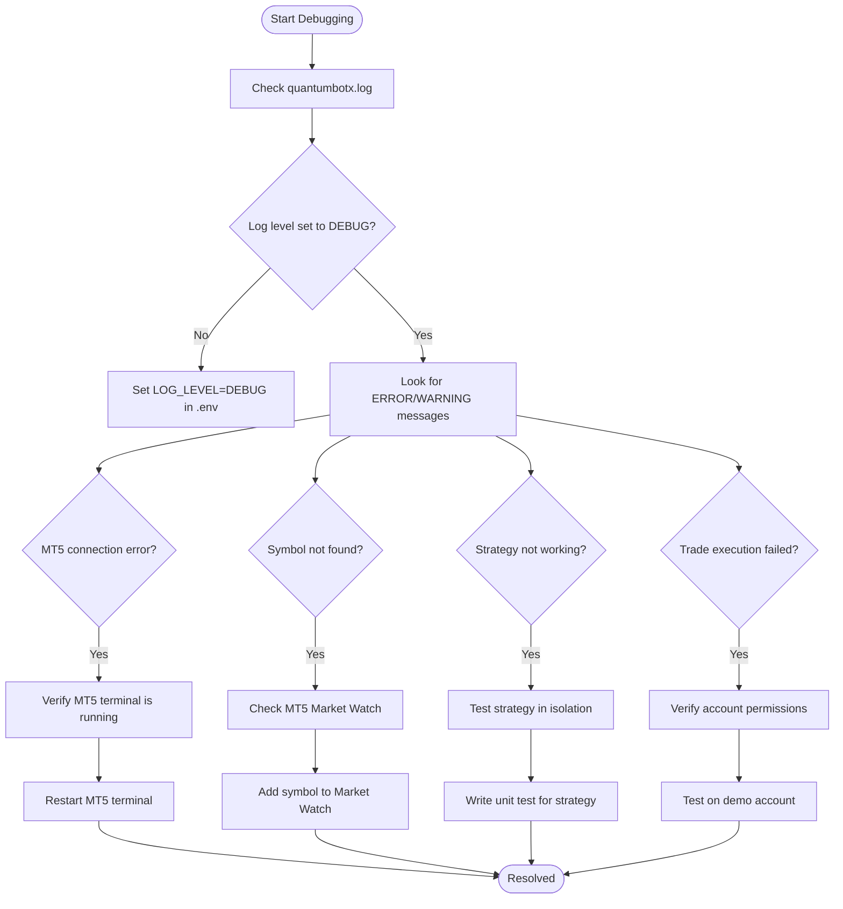
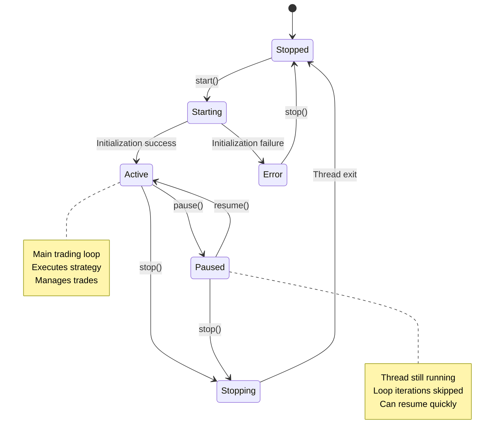

# Development Guide

<cite>
**Referenced Files in This Document**   
- [base_strategy.py](file://core/strategies/base_strategy.py#L1-L28)
- [strategy_map.py](file://core/strategies/strategy_map.py#L1-L27)
- [api_bots.py](file://core/routes/api_bots.py#L1-L167)
- [models.py](file://core/db/models.py#L1-L20)
- [queries.py](file://core/db/queries.py#L1-L174)
- [logger.py](file://core/utils/logger.py#L1-L25)
- [eslint.config.mjs](file://eslint.config.mjs#L1-L28)
- [trading_bot.py](file://core/bots/trading_bot.py#L1-L169)
- [run.py](file://run.py)
</cite>

## Table of Contents
1. [Introduction](#introduction)
2. [Adding New Trading Strategies](#adding-new-trading-strategies)
3. [Implementing New API Endpoints](#implementing-new-api-endpoints)
4. [Adding Database Models and Migrations](#adding-database-models-and-migrations)
5. [Writing Unit and Integration Tests](#writing-unit-and-integration-tests)
6. [Debugging and Logging Practices](#debugging-and-logging-practices)
7. [Code Style and Linting Conventions](#code-style-and-linting-conventions)
8. [Thread Management in Trading Bots](#thread-management-in-trading-bots)
9. [Performance Optimization for Backtesting](#performance-optimization-for-backtesting)
10. [Contribution Guidelines](#contribution-guidelines)

## Introduction
This guide provides comprehensive instructions for extending and contributing to the QuantumBotX codebase. It covers key development workflows including strategy creation, API endpoint implementation, database operations, testing, logging, threading, and performance optimization. The system is built on Python with Flask, MetaTrader5 integration, and SQLite, designed for modularity and ease of extension.

## Adding New Trading Strategies
To extend the QuantumBotX trading bot with new strategies, developers must create a class that inherits from `BaseStrategy` and register it in the `STRATEGY_MAP`. This modular design enables plug-and-play strategy development.

### Extending BaseStrategy
All custom strategies must inherit from the abstract base class `BaseStrategy` located in `core/strategies/base_strategy.py`. This class defines the contract that all strategies must fulfill.

```python
class BaseStrategy(ABC):
    def __init__(self, bot_instance, params: dict = {}):
        self.bot = bot_instance
        self.params = params

    @abstractmethod
    def analyze(self, df):
        raise NotImplementedError("Setiap strategi harus mengimplementasikan metode `analyze(df)`.")

    @classmethod
    def get_definable_params(cls):
        return []
```

The `analyze(df)` method is the core of any strategy and must return a dictionary containing at minimum a `"signal"` key with one of these values: `"BUY"`, `"SELL"`, or `"HOLD"`. The input `df` is a pandas DataFrame containing historical price data.

#### Example Implementation
```python
from core.strategies.base_strategy import BaseStrategy

class MyCustomStrategy(BaseStrategy):
    name = "My Custom Strategy"
    description = "A strategy based on custom logic."

    def __init__(self, bot_instance, params: dict = {}):
        super().__init__(bot_instance, params)
        self.rsi_period = params.get('rsi_period', 14)
        self.rsi_overbought = params.get('rsi_overbought', 70)
        self.rsi_oversold = params.get('rsi_oversold', 30)

    def analyze(self, df):
        # Calculate RSI
        delta = df['close'].diff()
        gain = (delta.where(delta > 0, 0)).rolling(window=self.rsi_period).mean()
        loss = (-delta.where(delta < 0, 0)).rolling(window=self.rsi_period).mean()
        rs = gain / loss
        rsi = 100 - (100 / (1 + rs))

        current_rsi = rsi.iloc[-1]
        current_price = df['close'].iloc[-1]

        if current_rsi < self.rsi_oversold:
            signal = "BUY"
            explanation = f"RSI ({current_rsi:.1f}) below oversold threshold"
        elif current_rsi > self.rsi_overbought:
            signal = "SELL"
            explanation = f"RSI ({current_rsi:.1f}) above overbought threshold"
        else:
            signal = "HOLD"
            explanation = f"RSI ({current_rsi:.1f}) in neutral zone"

        return {
            "signal": signal,
            "explanation": explanation,
            "price": current_price,
            "indicator_values": {"rsi": current_rsi}
        }

    @classmethod
    def get_definable_params(cls):
        return [
            {"name": "rsi_period", "label": "RSI Period", "type": "number", "default": 14},
            {"name": "rsi_overbought", "label": "Overbought Level", "type": "number", "default": 70},
            {"name": "rsi_oversold", "label": "Oversold Level", "type": "number", "default": 30}
        ]
```

### Registering in STRATEGY_MAP
After implementing the strategy class, it must be registered in `core/strategies/strategy_map.py` to be accessible through the API and UI.

```python
from .ma_crossover import MACrossoverStrategy
from .quantumbotx_hybrid import QuantumBotXHybridStrategy
# ... other imports
from .my_custom_strategy import MyCustomStrategy  # Add this import

STRATEGY_MAP = {
    'MA_CROSSOVER': MACrossoverStrategy,
    'QUANTUMBOTX_HYBRID': QuantumBotXHybridStrategy,
    # ... other mappings
    'MY_CUSTOM_STRATEGY': MyCustomStrategy,  # Add this mapping
}
```

Once registered, the strategy will automatically appear in the `/api/strategies` endpoint and be available for use in trading bots.



**Diagram sources**
- [base_strategy.py](file://core/strategies/base_strategy.py#L1-L28)
- [trading_bot.py](file://core/bots/trading_bot.py#L1-L169)

**Section sources**
- [base_strategy.py](file://core/strategies/base_strategy.py#L1-L28)
- [strategy_map.py](file://core/strategies/strategy_map.py#L1-L27)

## Implementing New API Endpoints
The QuantumBotX backend uses Flask blueprints to organize API endpoints. All routes are defined in the `core/routes/` directory, with each file representing a logical group of endpoints.

### Blueprint Structure
The application follows a modular blueprint pattern. Each API file creates a Flask Blueprint instance that is later registered with the main application in `run.py`.

```python
api_bots = Blueprint('api_bots', __name__)
```

This blueprint is then imported and registered in the main application, allowing route isolation and better organization.

### Creating New Endpoints
To implement a new API endpoint, follow these steps:

1. **Choose or create a route file**: For bot-related endpoints, use `api_bots.py`. For new feature areas, create a new file like `api_analytics.py`.

2. **Define the route with proper decorators**:
```python
@api_bots.route('/api/bots/<int:bot_id>/performance', methods=['GET'])
def get_bot_performance(bot_id):
    # Endpoint logic here
    pass
```

3. **Implement proper error handling and logging**:
```python
import logging
from flask import jsonify
logger = logging.getLogger(__name__)

@api_bots.route('/api/bots/<int:bot_id>/performance', methods=['GET'])
def get_bot_performance(bot_id):
    try:
        # Business logic
        performance_data = calculate_bot_performance(bot_id)
        return jsonify(performance_data)
    except Exception as e:
        logger.error(f"Error calculating performance for bot {bot_id}: {e}", exc_info=True)
        return jsonify({"error": "Failed to calculate performance"}), 500
```

4. **Use consistent response formats**:
- Success: `jsonify(data), 200`
- Created: `jsonify({"message": "...", "id": new_id}), 201`
- Error: `jsonify({"error": "message"}), status_code`

### Example: Adding a Strategy Parameters Endpoint
The existing `/api/strategies/<strategy_id>/params` endpoint demonstrates best practices:

```python
@api_bots.route('/api/strategies/<strategy_id>/params', methods=['GET'])
def get_strategy_params_route(strategy_id):
    """Returns configurable parameters for a strategy."""
    strategy_class = STRATEGY_MAP.get(strategy_id)
    if not strategy_class:
        return jsonify({"error": "Strategy not found"}), 404
    
    if hasattr(strategy_class, 'get_definable_params'):
        params = strategy_class.get_definable_params()
        return jsonify(params)
    
    return jsonify([])
```

This endpoint:
- Uses descriptive URL patterns
- Implements proper error handling (404 for not found)
- Leverages existing system components (`STRATEGY_MAP`)
- Returns consistent JSON responses
- Includes docstring documentation



**Diagram sources**
- [api_bots.py](file://core/routes/api_bots.py#L1-L167)
- [trading_bot.py](file://core/bots/trading_bot.py#L1-L169)

**Section sources**
- [api_bots.py](file://core/routes/api_bots.py#L1-L167)

## Adding Database Models and Migrations
QuantumBotX uses SQLite with raw SQL queries for database operations. The schema is managed manually rather than through an ORM migration system.

### Current Database Structure
The application uses two primary tables:

**bots table**: Stores bot configurations
- id (INTEGER PRIMARY KEY)
- name, market, lot_size, sl_pips, tp_pips
- timeframe, check_interval_seconds
- strategy, strategy_params (JSON string)
- status

**trade_history table**: Stores bot activity and notifications
- id (INTEGER PRIMARY KEY)
- bot_id (FOREIGN KEY)
- action, details, timestamp
- is_notification, is_read

### Adding New Models
To add a new database model:

1. **Modify the database schema**: Update the `init_db.py` script or manually alter the schema using SQLite commands.

2. **Create data access functions**: Add new functions to `core/db/queries.py` for CRUD operations.

```python
def create_backtest_model():
    """Creates the backtest_results table if it doesn't exist."""
    try:
        with get_db_connection() as conn:
            conn.execute('''
                CREATE TABLE IF NOT EXISTS backtest_results (
                    id INTEGER PRIMARY KEY,
                    bot_id INTEGER,
                    start_date TEXT,
                    end_date TEXT,
                    initial_balance REAL,
                    final_balance REAL,
                    trades_count INTEGER,
                    win_rate REAL,
                    profit_factor REAL,
                    max_drawdown REAL,
                    result_data TEXT,
                    timestamp DATETIME DEFAULT CURRENT_TIMESTAMP,
                    FOREIGN KEY (bot_id) REFERENCES bots (id)
                )
            ''')
            conn.commit()
    except sqlite3.Error as e:
        logger.error(f"Failed to create backtest_results table: {e}")
```

3. **Implement business logic functions**:
```python
def save_backtest_result(bot_id, result_data):
    """Saves backtest results to the database."""
    try:
        with get_db_connection() as conn:
            cursor = conn.cursor()
            cursor.execute('''
                INSERT INTO backtest_results 
                (bot_id, start_date, end_date, initial_balance, final_balance,
                 trades_count, win_rate, profit_factor, max_drawdown, result_data)
                VALUES (?, ?, ?, ?, ?, ?, ?, ?, ?, ?)
            ''', (
                bot_id,
                result_data['start_date'],
                result_data['end_date'],
                result_data['initial_balance'],
                result_data['final_balance'],
                result_data['trades_count'],
                result_data['win_rate'],
                result_data['profit_factor'],
                result_data['max_drawdown'],
                json.dumps(result_data['detailed_results'])
            ))
            conn.commit()
            return cursor.lastrowid
    except sqlite3.Error as e:
        logger.error(f"Failed to save backtest result: {e}")
        return None
```

4. **Ensure thread safety**: All database operations use context managers (`with get_db_connection()`) to ensure proper connection handling and thread safety.

### Data Access Best Practices
- Always use parameterized queries to prevent SQL injection
- Wrap operations in try-except blocks with proper logging
- Use transactions for multiple related operations
- Return consistent data types (lists of dicts for queries)



**Diagram sources**
- [models.py](file://core/db/models.py#L1-L20)
- [queries.py](file://core/db/queries.py#L1-L174)

**Section sources**
- [models.py](file://core/db/models.py#L1-L20)
- [queries.py](file://core/db/queries.py#L1-L174)

## Writing Unit and Integration Tests
While the repository contains test files like `test_xauusd.py`, a comprehensive testing strategy is essential for reliable contributions.

### Unit Testing Strategies
Create unit tests for individual strategy classes to verify their logic in isolation.

```python
import unittest
import pandas as pd
from core.strategies.my_custom_strategy import MyCustomStrategy

class TestMyCustomStrategy(unittest.TestCase):
    def setUp(self):
        # Create a mock bot instance
        class MockBot:
            def __init__(self):
                self.id = 1
                self.name = "Test Bot"
        
        self.bot = MockBot()
        self.strategy = MyCustomStrategy(self.bot, {'rsi_period': 3})

    def test_buy_signal_on_oversold(self):
        # Create test data with oversold condition
        df = pd.DataFrame({
            'close': [100, 95, 90, 85, 80],
            'open': [101, 96, 91, 86, 81],
            'high': [102, 97, 92, 87, 82],
            'low': [99, 94, 89, 84, 79],
            'volume': [1000, 1200, 1100, 1300, 1400]
        })
        
        result = self.strategy.analyze(df)
        
        self.assertEqual(result['signal'], 'BUY')
        self.assertIn('oversold', result['explanation'].lower())
        self.assertIn('rsi', result['indicator_values'])

    def test_hold_signal_in_neutral_zone(self):
        # Create test data with neutral RSI
        df = pd.DataFrame({
            'close': [100, 101, 102, 103, 104],
            'open': [99, 100, 101, 102, 103],
            'high': [101, 102, 103, 104, 105],
            'low': [98, 99, 100, 101, 102],
            'volume': [1000, 900, 800, 700, 600]
        })
        
        result = self.strategy.analyze(df)
        
        self.assertEqual(result['signal'], 'HOLD')
        self.assertIn('neutral', result['explanation'].lower())

if __name__ == '__main__':
    unittest.main()
```

### Integration Testing
Test the integration between components, such as strategy execution within a trading bot.

```python
import unittest
from unittest.mock import patch, MagicMock
from core.bots.trading_bot import TradingBot

class TestTradingBotIntegration(unittest.TestCase):
    @patch('core.bots.trading_bot.mt5')
    @patch('core.bots.trading_bot.get_rates_mt5')
    def test_bot_execution_cycle(self, mock_get_rates, mock_mt5):
        # Setup mock data
        mock_mt5.symbol_info.return_value = MagicMock()
        mock_get_rates.return_value = pd.DataFrame({
            'close': [100, 101, 102],
            'open': [99, 100, 101],
            'high': [101, 102, 103],
            'low': [98, 99, 100],
            'volume': [1000, 1100, 1200]
        })
        
        # Create bot with mock strategy
        with patch.dict('core.strategies.strategy_map.STRATEGY_MAP', 
                       {'TEST_STRATEGY': MagicMock()}):
            bot = TradingBot(
                id=1,
                name="Test Bot",
                market="EURUSD",
                risk_percent=1.0,
                sl_pips=10,
                tp_pips=20,
                timeframe="M1",
                check_interval=1,
                strategy="TEST_STRATEGY"
            )
            
            # Mock strategy analysis result
            bot.strategy_instance.analyze.return_value = {
                "signal": "BUY",
                "explanation": "Test buy signal"
            }
            
            # Run one iteration
            bot.run_iteration()
            
            # Assertions
            self.assertEqual(bot.last_analysis["signal"], "BUY")
            bot.strategy_instance.analyze.assert_called_once()

if __name__ == '__main__':
    unittest.main()
```

### Testing Best Practices
- Test edge cases (empty data, invalid parameters)
- Use mocking for external dependencies (MT5 API, database)
- Verify both success and error paths
- Ensure thread safety in tests
- Test parameter validation and defaults

**Section sources**
- [trading_bot.py](file://core/bots/trading_bot.py#L1-L169)
- [base_strategy.py](file://core/strategies/base_strategy.py#L1-L28)

## Debugging and Logging Practices
The QuantumBotX system includes a comprehensive logging framework to aid in debugging and monitoring.

### Logger Configuration
The logging system is configured in `core/utils/logger.py` and provides both file and console output with consistent formatting.

```python
# core/utils/logger.py
import logging
import os

LOG_LEVEL = os.getenv("LOG_LEVEL", "INFO").upper()
LOG_FILE = os.getenv("LOG_FILE", "quantumbotx.log")

formatter = logging.Formatter('[%(asctime)s] [%(levelname)s] %(message)s')

file_handler = logging.FileHandler(LOG_FILE)
file_handler.setFormatter(formatter)

console_handler = logging.StreamHandler()
console_handler.setFormatter(formatter)

logger = logging.getLogger("QuantumBotX")
logger.setLevel(getattr(logging, LOG_LEVEL, logging.INFO))
logger.addHandler(file_handler)
logger.addHandler(console_handler)
logger.propagate = False
```

Key features:
- Configurable log level via `LOG_LEVEL` environment variable
- Log file name configurable via `LOG_FILE` environment variable
- Consistent timestamp and level formatting
- Both file and console output
- Prevents log message propagation to root logger

### Using the Logger
Import and use the configured logger throughout the codebase:

```python
import logging
logger = logging.getLogger(__name__)

# Different log levels for different situations
logger.debug("Detailed debug information")
logger.info("Normal operation message")
logger.warning("Potential issue detected")
logger.error("Error occurred", exc_info=True)  # Include exception info
```

In the trading bot, logging is integrated with database history:

```python
def log_activity(self, action, details, exc_info=False, is_notification=False):
    try:
        from core.db.queries import add_history_log
        add_history_log(self.id, action, details, is_notification)
        log_message = f"Bot {self.id} [{action}]: {details}"
        if exc_info:
            logger.error(log_message, exc_info=True)
        else:
            logger.info(log_message)
    except Exception as e:
        logger.error(f"Failed to log activity for bot {self.id}: {e}")
```

### Debugging Techniques
1. **Enable debug logging**: Set `LOG_LEVEL=DEBUG` in the `.env` file
2. **Use structured logging**: Include relevant context in log messages
3. **Monitor the log file**: `tail -f quantumbotx.log` for real-time monitoring
4. **Check database history**: Query the `trade_history` table for bot activities
5. **Use Python debugger**: Insert `import pdb; pdb.set_trace()` for interactive debugging

### Common Debugging Scenarios
- **MT5 connection issues**: Check if MT5 terminal is running and credentials are correct
- **Symbol not found**: Verify the symbol exists in MT5 Market Watch
- **Strategy not generating signals**: Check data quality and strategy logic
- **Trade execution failures**: Verify account permissions and market conditions



**Diagram sources**
- [logger.py](file://core/utils/logger.py#L1-L25)
- [trading_bot.py](file://core/bots/trading_bot.py#L1-L169)

**Section sources**
- [logger.py](file://core/utils/logger.py#L1-L25)

## Code Style and Linting Conventions
The project uses ESLint for JavaScript code and follows standard Python conventions for Python code.

### JavaScript Linting Rules
The ESLint configuration in `eslint.config.mjs` defines the rules for frontend JavaScript code:

```javascript
import js from "@eslint/js";
import globals from "globals";
import json from "@eslint/json";
import markdown from "@eslint/markdown";
import css from "@eslint/css";
import { defineConfig } from "eslint/config";

export default defineConfig([
  { 
    files: ["**/*.{js,mjs,cjs}"], 
    plugins: { js }, 
    extends: ["js/recommended"], 
    languageOptions: { 
        globals: {
            ...globals.browser,
            "Chart": "readonly"
        } 
    } 
  },
  { files: ["**/*.js"], languageOptions: { sourceType: "commonjs" } },
  { files: ["**/*.json"], plugins: { json }, language: "json/json", extends: ["json/recommended"] },
  { files: ["**/*.md"], plugins: { markdown }, language: "markdown/gfm", extends: ["markdown/recommended"] },
  { files: ["**/*.css"], plugins: { css }, language: "css/css", extends: ["css/recommended"] },
]);
```

Key rules:
- Follows ESLint's recommended JavaScript rules
- Includes browser global variables (window, document, etc.)
- Explicitly declares `Chart` as a readonly global (for Chart.js)
- Uses CommonJS module format
- Also lints JSON, Markdown, and CSS files

### Python Code Conventions
While no explicit Python linter configuration is provided, the codebase follows these conventions:

1. **PEP 8 Style**: Standard Python formatting
2. **Type hints**: Used in function signatures where appropriate
3. **Docstrings**: Google-style docstrings for classes and methods
4. **Error handling**: Comprehensive try-except blocks with logging
5. **Thread safety**: Proper use of threading primitives and synchronization

### Best Practices
- **Consistent naming**: Use snake_case for Python, camelCase for JavaScript
- **Meaningful variable names**: Avoid abbreviations unless well-known
- **Function length**: Keep functions focused and under 50 lines
- **Commenting**: Explain why, not what (code should be self-documenting)
- **Error logging**: Always log exceptions with context

**Section sources**
- [eslint.config.mjs](file://eslint.config.mjs#L1-L28)

## Thread Management in Trading Bots
The QuantumBotX system uses Python's threading module to manage concurrent trading bot execution.

### TradingBot Class Design
The `TradingBot` class inherits from `threading.Thread`, allowing each bot to run in its own thread.

```python
class TradingBot(threading.Thread):
    def __init__(self, id, name, market, risk_percent, sl_pips, tp_pips, 
                 timeframe, check_interval, strategy, strategy_params={}, status='Dijeda'):
        super().__init__()
        self.id = id
        self.name = name  # Thread name
        self._stop_event = threading.Event()
        # ... other attributes
```

Key threading components:
- **Inheritance from Thread**: Enables the `start()` and `run()` methods
- **Stop event**: `threading.Event()` for graceful shutdown
- **Thread-safe operations**: Database access wrapped in context managers

### Lifecycle Management
The bot lifecycle is controlled through the following methods:

```python
def run(self):
    """Main method executed in the thread."""
    self.status = 'Aktif'
    # ... initialization and main loop
    
    while not self._stop_event.is_set():
        # ... trading logic
        time.sleep(self.check_interval)
    
    self.status = 'Dijeda'

def stop(self):
    """Signal the thread to stop."""
    self._stop_event.set()

def is_stopped(self):
    """Check if stop signal has been received."""
    return self._stop_event.is_set()
```

### Safe Modification Guidelines
When modifying the thread management system:

1. **Always use the stop event**: Never force-terminate threads
2. **Handle exceptions in run()**: Prevent thread crashes
3. **Use thread-safe data structures**: For shared state
4. **Avoid blocking operations**: Or implement proper timeouts
5. **Test concurrency**: Verify behavior with multiple bots

### Example: Adding a Pause Feature
To add a pause/resume feature while maintaining thread safety:

```python
def __init__(self, *args, **kwargs):
    super().__init__(*args, **kwargs)
    self._pause_event = threading.Event()
    self._pause_event.set()  # Initially not paused

def pause(self):
    """Pause the bot without stopping it."""
    self._pause_event.clear()
    self.status = 'Paused'

def resume(self):
    """Resume a paused bot."""
    self._pause_event.set()
    self.status = 'Aktif'

def run(self):
    # ... setup code
    
    while not self._stop_event.is_set():
        # Wait for resume signal if paused
        if not self._pause_event.wait(timeout=1):
            continue  # Skip iteration if paused
            
        # ... trading logic
        time.sleep(self.check_interval)
```



**Diagram sources**
- [trading_bot.py](file://core/bots/trading_bot.py#L1-L169)

**Section sources**
- [trading_bot.py](file://core/bots/trading_bot.py#L1-L169)

## Performance Optimization for Backtesting
Backtesting operations can be computationally intensive. The following optimizations improve performance.

### Vectorized Operations
Use pandas and pandas-ta for vectorized calculations instead of loops:

```python
# Slow: Using loops
def slow_rsi(df, period=14):
    gains = []
    losses = []
    for i in range(1, len(df)):
        change = df['close'][i] - df['close'][i-1]
        gains.append(max(change, 0))
        losses.append(max(-change, 0))
    
    # Manual RSI calculation
    avg_gain = sum(gains[-period:]) / period
    avg_loss = sum(losses[-period:]) / period
    rs = avg_gain / avg_loss if avg_loss != 0 else float('inf')
    return 100 - (100 / (1 + rs))

# Fast: Using pandas
def fast_rsi(df, period=14):
    delta = df['close'].diff()
    gain = delta.where(delta > 0, 0)
    loss = -delta.where(delta < 0, 0)
    
    avg_gain = gain.rolling(window=period).mean()
    avg_loss = loss.rolling(window=period).mean()
    
    rs = avg_gain / avg_loss
    rsi = 100 - (100 / (1 + rs))
    return rsi
```

### Data Preprocessing
Minimize data processing in the main loop:

```python
class OptimizedStrategy(BaseStrategy):
    def __init__(self, bot_instance, params={}):
        super().__init__(bot_instance, params)
        self.required_bars = params.get('lookback', 200)
        self.indicator_cache = {}
    
    def analyze(self, df):
        # Only process if we have enough data
        if len(df) < self.required_bars:
            return {"signal": "HOLD", "explanation": "Insufficient data"}
        
        # Use only necessary columns and recent bars
        recent_df = df[['open', 'high', 'low', 'close', 'volume']].tail(self.required_bars)
        
        # Calculate indicators once and reuse
        if 'rsi' not in self.indicator_cache:
            self.indicator_cache['rsi'] = self._calculate_rsi(recent_df)
        
        current_rsi = self.indicator_cache['rsi'].iloc[-1]
        
        # Clear cache periodically to avoid memory growth
        if len(df) % 100 == 0:
            self.indicator_cache.clear()
            
        # ... signal logic
```

### Caching and Memoization
Cache expensive calculations:

```python
from functools import lru_cache
import hashlib

class CachedStrategy(BaseStrategy):
    @lru_cache(maxsize=128)
    def _cached_indicator_calculation(self, hash_key, data_tuple):
        # Convert back to DataFrame
        df = pd.DataFrame([data_tuple], columns=['open', 'high', 'low', 'close', 'volume'])
        # Perform expensive calculation
        return expensive_calculation(df)
    
    def analyze(self, df):
        # Create hashable representation of recent data
        recent_data = tuple(df[['open', 'high', 'low', 'close', 'volume']].iloc[-1].values)
        hash_key = hashlib.md5(str(recent_data).encode()).hexdigest()[:8]
        
        indicator_value = self._cached_indicator_calculation(hash_key, recent_data)
        
        # ... signal logic
```

### Parallel Backtesting
Run multiple backtests concurrently:

```python
from concurrent.futures import ThreadPoolExecutor
import multiprocessing

def run_single_backtest(config):
    """Function to run a single backtest."""
    # Setup bot with config
    bot = BacktestBot(**config)
    results = bot.run_backtest()
    return results

def run_parallel_backtests(configs):
    """Run multiple backtests in parallel."""
    num_workers = multiprocessing.cpu_count()
    
    with ThreadPoolExecutor(max_workers=num_workers) as executor:
        futures = [executor.submit(run_single_backtest, config) for config in configs]
        results = [future.result() for future in futures]
    
    return results
```

### Memory Management
Monitor and control memory usage:

```python
import psutil
import gc

def monitor_memory():
    """Monitor memory usage and trigger garbage collection if needed."""
    process = psutil.Process()
    memory_mb = process.memory_info().rss / 1024 / 1024
    
    if memory_mb > 500:  # If using more than 500MB
        gc.collect()  # Force garbage collection
        logger.warning(f"High memory usage: {memory_mb:.1f}MB, triggered GC")
```

**Section sources**
- [trading_bot.py](file://core/bots/trading_bot.py#L1-L169)
- [base_strategy.py](file://core/strategies/base_strategy.py#L1-L28)

## Contribution Guidelines
Follow these guidelines when contributing to the QuantumBotX project.

### Code Review Process
1. **Create a feature branch**: `git checkout -b feature/my-new-strategy`
2. **Implement changes**: Follow coding standards and include tests
3. **Commit with descriptive messages**: "Add RSI divergence strategy with unit tests"
4. **Push to your fork**: `git push origin feature/my-new-strategy`
5. **Create a pull request**: Provide a detailed description of changes

### Pull Request Requirements
- **Clear description**: Explain what the PR does and why
- **Related issues**: Reference any related issues with `Fixes #123`
- **Test coverage**: Include unit and/or integration tests
- **Documentation**: Update relevant documentation
- **No merge conflicts**: Keep your branch updated with main

### Best Practices
- **Small, focused PRs**: One feature or fix per PR
- **Descriptive commit messages**: Follow conventional commits
- **Code comments**: Explain complex logic
- **Error handling**: Anticipate and handle edge cases
- **Performance awareness**: Consider computational complexity

### Review Criteria
Code reviewers will evaluate:
- **Functionality**: Does it work as intended?
- **Code quality**: Is it clean, readable, and maintainable?
- **Testing**: Are there adequate tests?
- **Documentation**: Is it properly documented?
- **Performance**: Are there any performance concerns?
- **Security**: Are there any security implications?

**Section sources**
- [run.py](file://run.py)