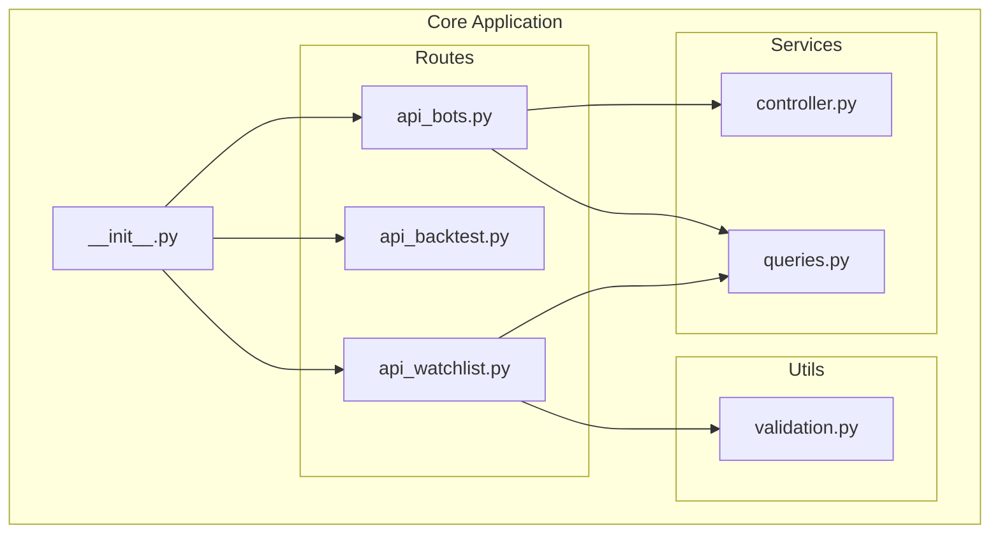
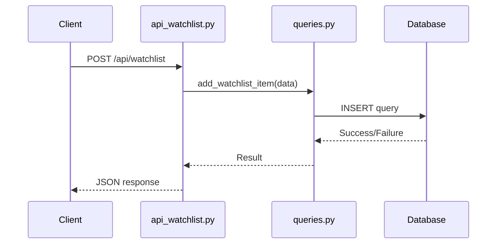

# Extending API Endpoints

<cite>
**Referenced Files in This Document**   
- [core/__init__.py](file://core/__init__.py#L51-L85)
- [core/routes/api_bots.py](file://core/routes/api_bots.py)
- [core/routes/api_backtest.py](file://core/routes/api_backtest.py)
- [core/utils/validation.py](file://core/utils/validation.py)
- [core/db/queries.py](file://core/db/queries.py)
- [core/bots/controller.py](file://core/bots/controller.py)
- [test_xauusd.py](file://test_xauusd.py)
</cite>

## Table of Contents
1. [Introduction](#introduction)
2. [Project Structure and API Organization](#project-structure-and-api-organization)
3. [Core Components and Blueprint Pattern](#core-components-and-blueprint-pattern)
4. [Creating a New RESTful API Endpoint](#creating-a-new-restful-api-endpoint)
5. [Registering the Blueprint in Application Factory](#registering-the-blueprint-in-application-factory)
6. [Example Implementation: Watchlist Management API](#example-implementation-watchlist-management-api)
7. [Request Validation and Input Sanitization](#request-validation-and-input-sanitization)
8. [Security Considerations](#security-considerations)
9. [Error Handling and Standardized Responses](#error-handling-and-standardized-responses)
10. [Integration with Backend Services](#integration-with-backend-services)
11. [API Documentation Conventions](#api-documentation-conventions)
12. [Testing API Endpoints](#testing-api-endpoints)

## Introduction
This document provides comprehensive guidance on extending the QuantumBotX application with new RESTful API endpoints. It details the established patterns for creating Flask blueprints, registering them in the application factory, implementing CRUD operations, validating requests, handling errors, and testing endpoints. The documentation uses the existing codebase as reference, particularly the `api_bots.py` and `api_backtest.py` files, to demonstrate best practices and architectural consistency.

## Project Structure and API Organization
The QuantumBotX project follows a modular structure with API endpoints organized in the `core/routes/` directory. Each file represents a logical group of related endpoints (e.g., bots, backtesting, portfolio). This separation of concerns enhances maintainability and scalability.



**Diagram sources**
- [core/routes/api_bots.py](file://core/routes/api_bots.py)
- [core/routes/api_backtest.py](file://core/routes/api_backtest.py)
- [core/__init__.py](file://core/__init__.py)

**Section sources**
- [core/routes/api_bots.py](file://core/routes/api_bots.py)
- [core/routes/api_backtest.py](file://core/routes/api_backtest.py)

## Core Components and Blueprint Pattern
The application uses Flask's Blueprint pattern to modularize API endpoints. Each blueprint is a self-contained collection of routes, error handlers, and other app-related functions. The `api_bots.py` file demonstrates this pattern effectively, defining routes for bot management operations.

```mermaid
classDiagram
class Blueprint {
+str name
+str import_name
+str url_prefix
+register(app)
+route(rule, **options)
}
class api_bots {
+Blueprint api_bots
+get_strategies_route()
+get_bots_route()
+add_bot_route()
+update_bot_route()
+delete_bot_route()
}
class api_backtest {
+Blueprint api_backtest
+run_backtest_route()
+get_history_route()
}
Blueprint <|-- api_bots : "inherits"
Blueprint <|-- api_backtest : "inherits"
api_bots --> "controller" : "uses"
api_bots --> "queries" : "uses"
api_backtest --> "engine" : "uses"
api_backtest --> "queries" : "uses"
```

**Diagram sources**
- [core/routes/api_bots.py](file://core/routes/api_bots.py)
- [core/routes/api_backtest.py](file://core/routes/api_backtest.py)

**Section sources**
- [core/routes/api_bots.py](file://core/routes/api_bots.py)
- [core/routes/api_backtest.py](file://core/routes/api_backtest.py)

## Creating a New RESTful API Endpoint
To create a new RESTful API endpoint, follow the established pattern in the `core/routes/` directory. Begin by creating a new Python file (e.g., `api_watchlist.py`) and defining a Flask Blueprint. The blueprint should contain route functions for the required HTTP methods (GET, POST, PUT, DELETE).

The existing endpoints in `api_bots.py` provide a clear model for implementing CRUD operations. For example, the `add_bot_route()` function demonstrates how to handle POST requests with JSON data, while `get_bots_route()` shows how to retrieve and format data for a GET request.

**Section sources**
- [core/routes/api_bots.py](file://core/routes/api_bots.py)

## Registering the Blueprint in Application Factory
The Flask application factory pattern is implemented in `core/__init__.py`. The `create_app()` function is responsible for creating and configuring the Flask application instance. To register a new blueprint, import it and call `app.register_blueprint()` within this function.

The existing code shows the registration of multiple blueprints, including `api_bots` and `api_backtest`. This centralized registration ensures that all routes are properly mounted on the application.

```python
# core/__init__.py
def create_app():
    # ... other configuration ...
    
    from .routes.api_dashboard import api_dashboard
    from .routes.api_chart import api_chart
    from .routes.api_bots import api_bots
    # ... other imports ...
    from .routes.api_watchlist import api_watchlist  # New import
    
    app.register_blueprint(api_dashboard)
    app.register_blueprint(api_chart)
    app.register_blueprint(api_bots)
    # ... other registrations ...
    app.register_blueprint(api_watchlist)  # New registration
    
    # ... other configuration ...
    return app
```

**Section sources**
- [core/__init__.py](file://core/__init__.py#L51-L85)

## Example Implementation: Watchlist Management API
Below is a concrete example of implementing a new endpoint group for managing watchlists. This implementation follows the patterns established in `api_bots.py` and `api_backtest.py`, including proper request validation, response formatting, and error handling.

```python
# core/routes/api_watchlist.py

import json
import logging
from flask import Blueprint, jsonify, request
from core.db import queries
from core.utils.validation import validate_watchlist_data

api_watchlist = Blueprint('api_watchlist', __name__)
logger = logging.getLogger(__name__)

@api_watchlist.route('/api/watchlist', methods=['GET'])
def get_watchlist_route():
    """Retrieve all watchlist items."""
    try:
        watchlist = queries.get_all_watchlist_items()
        return jsonify(watchlist)
    except Exception as e:
        logger.error(f"Failed to retrieve watchlist: {e}", exc_info=True)
        return jsonify({"error": "Failed to retrieve watchlist"}), 500

@api_watchlist.route('/api/watchlist', methods=['POST'])
def add_watchlist_item_route():
    """Add a new item to the watchlist."""
    data = request.get_json()
    
    # Validate input data
    errors = validate_watchlist_data(data)
    if errors:
        return jsonify({"errors": errors}), 400
    
    try:
        new_item_id = queries.add_watchlist_item(
            symbol=data.get('symbol'),
            name=data.get('name'),
            category=data.get('category'),
            notes=data.get('notes', '')
        )
        if new_item_id:
            return jsonify({"message": "Watchlist item added successfully", "item_id": new_item_id}), 201
        return jsonify({"error": "Failed to add watchlist item"}), 500
    except Exception as e:
        logger.error(f"Failed to add watchlist item: {e}", exc_info=True)
        return jsonify({"error": "Failed to add watchlist item"}), 500

@api_watchlist.route('/api/watchlist/<int:item_id>', methods=['PUT'])
def update_watchlist_item_route(item_id):
    """Update an existing watchlist item."""
    data = request.get_json()
    
    # Validate input data
    errors = validate_watchlist_data(data)
    if errors:
        return jsonify({"errors": errors}), 400
    
    try:
        success = queries.update_watchlist_item(
            item_id=item_id,
            symbol=data.get('symbol'),
            name=data.get('name'),
            category=data.get('category'),
            notes=data.get('notes', '')
        )
        if success:
            return jsonify({"message": "Watchlist item updated successfully"}), 200
        return jsonify({"error": "Failed to update watchlist item"}), 500
    except Exception as e:
        logger.error(f"Failed to update watchlist item {item_id}: {e}", exc_info=True)
        return jsonify({"error": "Failed to update watchlist item"}), 500

@api_watchlist.route('/api/watchlist/<int:item_id>', methods=['DELETE'])
def delete_watchlist_item_route(item_id):
    """Remove an item from the watchlist."""
    try:
        success = queries.delete_watchlist_item(item_id)
        if success:
            return jsonify({"message": "Watchlist item deleted successfully"}), 200
        return jsonify({"error": "Failed to delete watchlist item"}), 500
    except Exception as e:
        logger.error(f"Failed to delete watchlist item {item_id}: {e}", exc_info=True)
        return jsonify({"error": "Failed to delete watchlist item"}), 500
```

**Section sources**
- [core/routes/api_watchlist.py](file://core/routes/api_watchlist.py)

## Request Validation and Input Sanitization
The application implements request validation through utility functions in `core/utils/validation.py`. The `validate_bot_params()` function demonstrates how to validate incoming JSON data, checking for required fields and proper data types.

For the watchlist API, a similar validation function should be created to ensure data integrity. Input sanitization is also critical, particularly when handling user-provided data that will be stored in the database or used in external API calls.

```python
# core/utils/validation.py

def validate_watchlist_data(data):
    """Validate watchlist item data."""
    required_fields = ['symbol', 'name', 'category']
    errors = []

    for field in required_fields:
        if field not in data or not data[field]:
            errors.append(f"Field '{field}' is required and cannot be empty.")

    # Additional validation rules can be added here
    if 'symbol' in data and not isinstance(data['symbol'], str):
        errors.append("Symbol must be a string.")
    
    if 'category' in data and data['category'] not in ['forex', 'stocks', 'crypto', 'commodities']:
        errors.append("Category must be one of: forex, stocks, crypto, commodities.")

    return errors
```

**Section sources**
- [core/utils/validation.py](file://core/utils/validation.py)

## Security Considerations
The existing codebase does not implement explicit authentication decorators for API endpoints, suggesting that security may be handled at the application level or through external mechanisms. When adding new endpoints, consider the following security aspects:

- **Input Validation**: Always validate and sanitize input data to prevent injection attacks.
- **Authentication**: If authentication is required, implement appropriate decorators or middleware.
- **Rate Limiting**: Although not present in the current code, rate limiting should be considered for public APIs to prevent abuse.
- **Data Exposure**: Be cautious about exposing sensitive information in API responses.

The application currently lacks explicit authentication checks in the API routes, which may be intentional for internal use or may require enhancement for production deployment.

**Section sources**
- [core/routes/api_bots.py](file://core/routes/api_bots.py)
- [core/routes/api_backtest.py](file://core/routes/api_backtest.py)

## Error Handling and Standardized Responses
The application uses a consistent pattern for error handling, returning JSON responses with error messages and appropriate HTTP status codes. Successful operations typically return a 200 (OK) or 201 (Created) status, while errors return 4xx or 5xx status codes with descriptive messages.

The `api_backtest.py` file demonstrates proper error handling in the `run_backtest_route()` function, which validates file uploads and handles exceptions gracefully. Standardized error responses improve client-side error handling and debugging.

```python
# Standard error response pattern
return jsonify({"error": "Descriptive error message"}), 400  # Client error
return jsonify({"error": "Internal server error description"}), 500  # Server error
```

**Section sources**
- [core/routes/api_backtest.py](file://core/routes/api_backtest.py)

## Integration with Backend Services
New API endpoints should integrate with backend services through the existing abstraction layers. The `core/db/queries.py` module provides database access functions, while business logic is handled in modules like `core/bots/controller.py`.

The watchlist API would use `queries.py` for database operations, maintaining separation between the API layer and data access logic. This approach ensures consistency with the existing architecture and facilitates testing and maintenance.



**Diagram sources**
- [core/routes/api_watchlist.py](file://core/routes/api_watchlist.py)
- [core/db/queries.py](file://core/db/queries.py)

**Section sources**
- [core/db/queries.py](file://core/db/queries.py)

## API Documentation Conventions
The existing codebase uses docstrings to document route functions, describing their purpose and behavior. While OpenAPI/Swagger documentation is not currently implemented, the docstrings provide valuable information for developers.

When adding new endpoints, follow the existing documentation convention by providing clear docstrings for each route function. This practice ensures that the code remains self-documenting and facilitates future integration with automated documentation tools.

```python
@api_watchlist.route('/api/watchlist', methods=['GET'])
def get_watchlist_route():
    """Retrieve all watchlist items."""
    # Function implementation
```

**Section sources**
- [core/routes/api_bots.py](file://core/routes/api_bots.py)

## Testing API Endpoints
The application includes test files such as `test_xauusd.py`, which demonstrates testing of backtesting functionality. Although these tests focus on business logic rather than API endpoints, they provide insight into the testing approach.

For API endpoint testing, use Flask's test client to simulate HTTP requests and verify responses. Write unit tests for each endpoint, covering both successful operations and error conditions.

```python
# Example test structure
def test_add_watchlist_item():
    # Setup test client
    # Make POST request with valid data
    # Assert 201 status and expected response
    # Test with invalid data and assert 400 status
```

The existing test files show a focus on functional testing of trading strategies and backtesting, which can serve as a model for testing the business logic behind API endpoints.

**Section sources**
- [test_xauusd.py](file://test_xauusd.py)