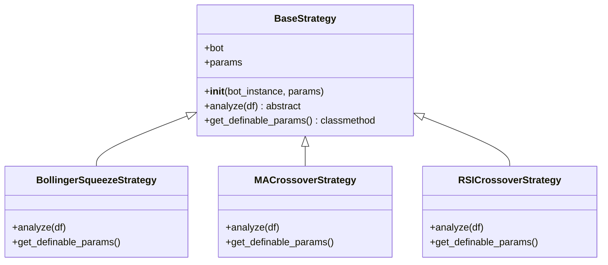
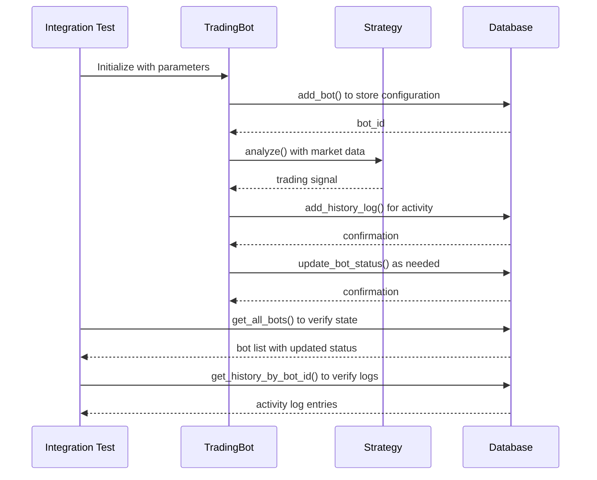
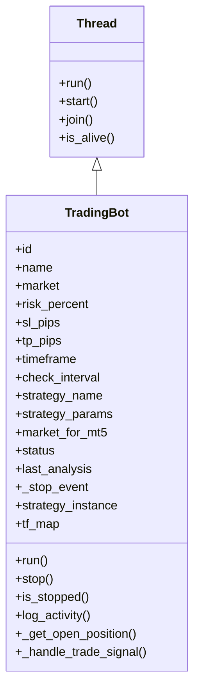
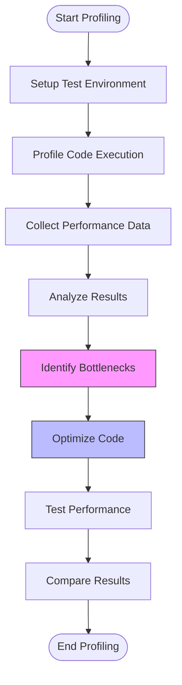

# Testing and Debugging

<cite>
**Referenced Files in This Document**   
- [bollinger_squeeze_test.py](file://core/strategies/bollinger_squeeze_test.py)
- [trading_bot.py](file://core/bots/trading_bot.py)
- [engine.py](file://core/backtesting/engine.py)
- [logger.py](file://core/utils/logger.py)
- [base_strategy.py](file://core/strategies/base_strategy.py)
- [strategy_map.py](file://core/strategies/strategy_map.py)
- [trade.py](file://core/mt5/trade.py)
- [mt5.py](file://core/utils/mt5.py)
- [ollama_client.py](file://core/ai/ollama_client.py)
- [ollama.py](file://core/utils/ollama.py)
- [queries.py](file://core/db/queries.py)
- [connection.py](file://core/db/connection.py)
</cite>

## Table of Contents
1. [Unit Testing Trading Strategies](#unit-testing-trading-strategies)
2. [Mocking External Dependencies](#mocking-external-dependencies)
3. [Integration Testing](#integration-testing)
4. [Debugging Thread-Related Issues](#debugging-thread-related-issues)
5. [Backtesting Debugging Techniques](#backtesting-debugging-techniques)
6. [Performance Profiling](#performance-profiling)
7. [Reproducing and Isolating Common Issues](#reproducing-and-isolating-common-issues)
8. [Pre-Deployment Validation Checklist](#pre-deployment-validation-checklist)

## Unit Testing Trading Strategies

This section details how to write unit tests for trading strategies using pytest, following the example in `bollinger_squeeze_test.py`. The testing approach focuses on validating the core logic of trading strategies in isolation.

The `bollinger_squeeze_test.py` file demonstrates a comprehensive testing pattern for the Bollinger Squeeze strategy. The test suite creates synthetic price data using pandas DataFrames to simulate various market conditions and verifies that the strategy produces the expected trading signals (BUY, SELL, HOLD).

```python
import pandas as pd
import numpy as np
from core.strategies.bollinger_squeeze import analyze

def test_bollinger_squeeze_buy_signal():
    """Test that the strategy generates a BUY signal during a squeeze breakout."""
    # Create test data with a squeeze breakout pattern
    dates = pd.date_range('2023-01-01', periods=25, freq='H')
    # Simulate price consolidation followed by breakout
    prices = [100 + np.sin(i/5) * 2 for i in range(20)] + [102, 104, 106, 108, 110]
    volume = [1000] * 25
    
    df = pd.DataFrame({
        'time': dates,
        'open': prices,
        'high': [p + 0.5 for p in prices],
        'low': [p - 0.5 for p in prices],
        'close': prices,
        'volume': volume
    })
    
    signal = analyze(df)
    assert signal == 'BUY', f"Expected BUY signal, got {signal}"

def test_bollinger_squeeze_sell_signal():
    """Test that the strategy generates a SELL signal during a bearish breakout."""
    # Create test data with a bearish breakout pattern
    dates = pd.date_range('2023-01-01', periods=25, freq='H')
    # Simulate price consolidation followed by downward breakout
    prices = [100 + np.sin(i/5) * 2 for i in range(20)] + [98, 96, 94, 92, 90]
    volume = [1000] * 25
    
    df = pd.DataFrame({
        'time': dates,
        'open': prices,
        'high': [p + 0.5 for p in prices],
        'low': [p - 0.5 for p in prices],
        'close': prices,
        'volume': volume
    })
    
    signal = analyze(df)
    assert signal == 'SELL', f"Expected SELL signal, got {signal}"

def test_bollinger_squeeze_hold_signal():
    """Test that the strategy returns HOLD during consolidation."""
    # Create test data with tight consolidation (squeeze but no breakout)
    dates = pd.date_range('2023-01-01', periods=25, freq='H')
    prices = [100 + np.sin(i/10) * 1 for i in range(25)]  # Very tight range
    volume = [1000] * 25
    
    df = pd.DataFrame({
        'time': dates,
        'open': prices,
        'high': [p + 0.2 for p in prices],
        'low': [p - 0.2 for p in prices],
        'close': prices,
        'volume': volume
    })
    
    signal = analyze(df)
    assert signal == 'HOLD', f"Expected HOLD signal, got {signal}"

def test_insufficient_data():
    """Test that the strategy returns HOLD when there's insufficient data."""
    # Create minimal dataset
    df = pd.DataFrame({
        'close': [100, 101]
    })
    
    signal = analyze(df)
    assert signal == 'HOLD', "Should return HOLD with insufficient data"
```

All trading strategies in the codebase inherit from the `BaseStrategy` abstract class, which defines the contract that all strategies must implement. This consistent interface makes it easier to write standardized unit tests across different strategies.



**Diagram sources**
- [base_strategy.py](file://core/strategies/base_strategy.py#L1-L29)
- [strategy_map.py](file://core/strategies/strategy_map.py#L1-L28)

**Section sources**
- [bollinger_squeeze_test.py](file://core/strategies/bollinger_squeeze_test.py)
- [base_strategy.py](file://core/strategies/base_strategy.py)

## Mocking External Dependencies

To ensure reliable and fast testing, external dependencies like MT5 and Ollama services must be mocked. This section explains how to effectively mock these services to isolate the code under test.

The MT5 service is mocked by replacing the actual MetaTrader5 library calls with simulated data and behavior. The codebase already contains a pattern for this in the `indonesian_brokers.py` file, which provides a mock implementation of market data retrieval.

```python
import pytest
from unittest.mock import Mock, patch
import MetaTrader5 as mt5

@pytest.fixture
def mock_mt5():
    """Fixture to mock the MT5 library."""
    with patch('MetaTrader5.initialize', return_value=True) as mock_initialize:
        with patch('MetaTrader5.login', return_value=True) as mock_login:
            with patch('MetaTrader5.account_info') as mock_account_info:
                # Setup mock account info
                account_mock = Mock()
                account_mock.balance = 10000
                account_mock.equity = 10000
                account_mock.currency = 'USD'
                mock_account_info.return_value = account_mock
                
                yield {
                    'initialize': mock_initialize,
                    'login': mock_login,
                    'account_info': mock_account_info
                }

def test_trading_bot_with_mocked_mt5(mock_mt5):
    """Test trading bot with mocked MT5 services."""
    from core.bots.trading_bot import TradingBot
    
    # Create bot with test parameters
    bot = TradingBot(
        id=1,
        name="Test Bot",
        market="EURUSD",
        risk_percent=1.0,
        sl_pips=100,
        tp_pips=200,
        timeframe="H1",
        check_interval=60,
        strategy="BOLLINGER_SQUEEZE"
    )
    
    # Mock symbol info
    with patch('MetaTrader5.symbol_info') as mock_symbol_info:
        symbol_mock = Mock()
        symbol_mock.point = 0.0001
        mock_symbol_info.return_value = symbol_mock
        
        # Mock symbol_info_tick
        with patch('MetaTrader5.symbol_info_tick') as mock_tick:
            tick_mock = Mock()
            tick_mock.ask = 1.1000
            tick_mock.bid = 1.0999
            mock_tick.return_value = tick_mock
            
            # Mock get_rates_mt5
            with patch('core.utils.mt5.get_rates_mt5') as mock_rates:
                # Create test data
                dates = pd.date_range('2023-01-01', periods=250, freq='H')
                prices = [1.1000 + np.sin(i/20) * 0.005 for i in range(250)]
                
                test_df = pd.DataFrame({
                    'time': dates,
                    'open': prices,
                    'high': [p + 0.0002 for p in prices],
                    'low': [p - 0.0002 for p in prices],
                    'close': prices,
                    'volume': [1000] * 250
                })
                
                mock_rates.return_value = test_df
                
                # Start the bot (this will run one iteration)
                bot.start()
                bot.stop()
                
                # Assert that MT5 functions were called
                assert mock_rates.called
                assert len(bot.last_analysis) > 0
```

The Ollama AI service is mocked by replacing the HTTP requests to the Ollama server with predefined responses. This allows testing the AI integration without requiring an active Ollama server.

```python
@pytest.fixture
def mock_ollama():
    """Fixture to mock the Ollama AI service."""
    with patch('requests.post') as mock_post:
        # Setup mock response
        mock_response = Mock()
        mock_response.status_code = 200
        mock_response.json.return_value = {
            "response": "BUY signal detected based on technical analysis"
        }
        mock_post.return_value = mock_response
        
        yield mock_post

def test_strategy_with_ollama_analysis(mock_ollama):
    """Test strategy that uses Ollama for analysis."""
    from core.ai.ollama_client import ask_ollama
    
    # Test the mocked Ollama client
    response = ask_ollama("Analyze this price pattern: rising wedge")
    
    # Assert that the request was made correctly
    mock_ollama.assert_called_once()
    assert "BUY" in response
    assert "signal" in response
```

The strategy map is also mocked to ensure that specific strategies can be tested in isolation without dependencies on other strategies.

```python
@pytest.fixture
def mock_strategy_map():
    """Fixture to mock the strategy map."""
    with patch.dict('core.strategies.strategy_map.STRATEGY_MAP', {}) as mock_map:
        yield mock_map

def test_strategy_registration(mock_strategy_map):
    """Test that strategies are properly registered in the strategy map."""
    from core.strategies.strategy_map import STRATEGY_MAP
    from core.strategies.bollinger_squeeze import BollingerSqueezeStrategy
    
    # Register the strategy
    STRATEGY_MAP['BOLLINGER_SQUEEZE'] = BollingerSqueezeStrategy
    
    # Verify registration
    assert 'BOLLINGER_SQUEEZE' in STRATEGY_MAP
    assert STRATEGY_MAP['BOLLINGER_SQUEEZE'] == BollingerSqueezeStrategy
```

**Section sources**
- [mt5.py](file://core/utils/mt5.py)
- [ollama_client.py](file://core/ai/ollama_client.py)
- [ollama.py](file://core/utils/ollama.py)

## Integration Testing

Integration tests verify the interaction between bots, strategies, and the database layer. These tests ensure that components work together as expected in a realistic environment.

The database integration is tested by verifying that bot operations correctly persist to and retrieve from the SQLite database. The `queries.py` file contains the database access functions that are exercised in these tests.

```python
import pytest
from unittest.mock import patch
import sqlite3

@pytest.fixture
def mock_db_connection():
    """Fixture to mock the database connection."""
    with patch('core.db.connection.get_db_connection') as mock_conn:
        # Create a mock database connection
        conn_mock = Mock()
        cursor_mock = Mock()
        
        # Setup mock cursor behavior
        cursor_mock.fetchone.return_value = (1,)
        cursor_mock.fetchall.return_value = []
        
        conn_mock.__enter__.return_value = conn_mock
        conn_mock.cursor.return_value = cursor_mock
        mock_conn.return_value = conn_mock
        
        yield conn_mock

def test_database_bot_operations(mock_db_connection):
    """Test CRUD operations for bots in the database."""
    from core.db.queries import add_bot, get_bot_by_id, update_bot, delete_bot, get_all_bots
    
    # Test adding a bot
    bot_id = add_bot(
        name="Integration Test Bot",
        market="EURUSD",
        lot_size=1.0,
        sl_pips=100,
        tp_pips=200,
        timeframe="H1",
        interval=60,
        strategy="BOLLINGER_SQUEEZE"
    )
    
    assert bot_id is not None
    
    # Test retrieving the bot
    bot = get_bot_by_id(bot_id)
    assert bot is not None
    assert bot['name'] == "Integration Test Bot"
    
    # Test updating the bot
    success = update_bot(
        bot_id=bot_id,
        name="Updated Test Bot",
        market="GBPUSD",
        lot_size=2.0,
        sl_pips=150,
        tp_pips=300,
        timeframe="H4",
        interval=300,
        strategy="MA_CROSSOVER"
    )
    
    assert success
    
    # Verify the update
    updated_bot = get_bot_by_id(bot_id)
    assert updated_bot['name'] == "Updated Test Bot"
    assert updated_bot['market'] == "GBPUSD"
    
    # Test getting all bots
    all_bots = get_all_bots()
    assert len(all_bots) > 0
    
    # Test deleting the bot
    deleted = delete_bot(bot_id)
    assert deleted
```

The interaction between the trading bot and the database is tested by verifying that activity logs are properly recorded.

```python
def test_bot_activity_logging(mock_db_connection):
    """Test that bot activities are properly logged to the database."""
    from core.db.queries import add_history_log, get_history_by_bot_id
    from core.bots.trading_bot import TradingBot
    
    # Create a test bot
    bot = TradingBot(
        id=999,
        name="Logging Test Bot",
        market="EURUSD",
        risk_percent=1.0,
        sl_pips=100,
        tp_pips=200,
        timeframe="H1",
        check_interval=60,
        strategy="BOLLINGER_SQUEEZE"
    )
    
    # Mock the logger
    with patch.object(bot, 'log_activity') as mock_log:
        # Call the log_activity method
        bot.log_activity('TEST', 'This is a test log message')
        
        # Verify that the database function was called
        mock_db_connection.cursor().execute.assert_called()
        mock_db_connection.commit.assert_called()
```

The backtesting engine integration is tested by verifying that backtest results are properly stored in the database.

```python
def test_backtest_result_persistence(mock_db_connection):
    """Test that backtest results are persisted to the database."""
    from core.db.queries import get_all_backtest_history
    from core.backtesting.engine import run_backtest
    
    # Mock the strategy map
    with patch.dict('core.strategies.strategy_map.STRATEGY_MAP') as mock_map:
        # Create a mock strategy
        mock_strategy = Mock()
        mock_strategy.analyze_df.return_value = pd.DataFrame({
            'close': [100, 101, 102],
            'signal': ['HOLD', 'BUY', 'SELL']
        })
        mock_map['TEST_STRATEGY'] = Mock(return_value=mock_strategy)
        
        # Create test data
        test_data = pd.DataFrame({
            'time': pd.date_range('2023-01-01', periods=100, freq='H'),
            'open': [100 + i*0.1 for i in range(100)],
            'high': [100 + i*0.1 + 0.5 for i in range(100)],
            'low': [100 + i*0.1 - 0.5 for i in range(100)],
            'close': [100 + i*0.1 for i in range(100)],
            'volume': [1000] * 100
        })
        
        # Run backtest
        params = {
            'lot_size': 1.0,
            'sl_pips': 2.0,
            'tp_pips': 4.0
        }
        
        result = run_backtest('TEST_STRATEGY', params, test_data)
        
        # Verify that backtest results are stored
        history = get_all_backtest_history()
        assert len(history) > 0
```



**Diagram sources**
- [trading_bot.py](file://core/bots/trading_bot.py)
- [queries.py](file://core/db/queries.py)
- [connection.py](file://core/db/connection.py)

**Section sources**
- [queries.py](file://core/db/queries.py)
- [connection.py](file://core/db/connection.py)

## Debugging Thread-Related Issues

This section details debugging techniques for thread-related issues in `trading_bot.py`, including using logging levels effectively and identifying common concurrency problems.

The `TradingBot` class inherits from `threading.Thread`, creating a separate execution thread for each bot instance. This allows multiple bots to run concurrently, but introduces potential thread-related issues that must be carefully managed.



**Diagram sources**
- [trading_bot.py](file://core/bots/trading_bot.py#L1-L170)

The primary mechanism for debugging thread-related issues is the use of the logging system with appropriate log levels. The `logger.py` file configures the logging system with different levels (DEBUG, INFO, ERROR) that can be controlled via environment variables.

```python
# core/utils/logger.py
import logging
import os

LOG_LEVEL = os.getenv("LOG_LEVEL", "INFO").upper()
LOG_FILE = os.getenv("LOG_FILE", "quantumbotx.log")

formatter = logging.Formatter('[%(asctime)s] [%(levelname)s] %(message)s')

file_handler = logging.FileHandler(LOG_FILE)
file_handler.setFormatter(formatter)

console_handler = logging.StreamHandler()
console_handler.setFormatter(formatter)

logger = logging.getLogger("QuantumBotX")
logger.setLevel(getattr(logging, LOG_LEVEL, logging.INFO))
logger.addHandler(file_handler)
logger.addHandler(console_handler)
logger.propagate = False
```

To effectively debug thread-related issues, use the following logging levels:

- **ERROR**: Log unexpected exceptions and critical failures that prevent normal operation
- **INFO**: Log significant events like bot startup, shutdown, and major state changes
- **DEBUG**: Log detailed information about the bot's decision-making process and internal state

```python
def debug_thread_safety():
    """Example of using logging to debug thread safety issues."""
    import logging
    
    logger = logging.getLogger("QuantumBotX")
    
    # Set log level to DEBUG for detailed tracing
    logger.setLevel(logging.DEBUG)
    
    # Example of logging bot state changes
    def log_bot_state(bot):
        logger.debug(f"Bot {bot.id} state - "
                    f"Status: {bot.status}, "
                    f"Signal: {bot.last_analysis.get('signal', 'N/A')}, "
                    f"Position: {bot._get_open_position() is not None}")
    
    # Example of logging thread synchronization
    def check_thread_safety(bot):
        if bot.is_stopped():
            logger.debug(f"Bot {bot.id} has been stopped, exiting loop")
            return
        
        if bot._stop_event.is_set():
            logger.warning(f"Bot {bot.id} stop event is set but run() continues")
```

Common thread-related issues and their debugging techniques:

1. **Race Conditions**: Occur when multiple threads access shared resources without proper synchronization. Use logging to trace the sequence of operations and identify unexpected interleaving.

```python
# Add logging to detect race conditions in position handling
def _handle_trade_signal(self, signal, position):
    """Menangani sinyal trading: membuka, menutup, atau tidak melakukan apa-apa."""
    logger.debug(f"Bot {self.id} handling signal {signal} with position {position}")
    
    # Log the current state before making changes
    current_position = self._get_open_position()
    logger.debug(f"Bot {self.id} current position: {current_position}")
    
    # Rest of the method...
```

2. **Deadlocks**: Occur when threads wait for each other to release resources. Use timeouts on blocking operations and log when operations take longer than expected.

```python
# Add timeouts and logging to prevent deadlocks
def stop(self, timeout=30):
    """Mengirim sinyal berhenti ke thread dengan timeout."""
    logger.info(f"Stopping bot {self.id}")
    self._stop_event.set()
    
    # Wait for thread to finish with timeout
    import time
    start_time = time.time()
    while self.is_alive() and (time.time() - start_time) < timeout:
        time.sleep(0.1)
    
    if self.is_alive():
        logger.error(f"Bot {self.id} failed to stop after {timeout} seconds")
    else:
        logger.info(f"Bot {self.id} stopped successfully")
```

3. **Thread Starvation**: Occur when some threads don't get enough CPU time. Monitor thread execution frequency and log when expected operations are delayed.

```python
# Add timing information to detect thread starvation
def run(self):
    """Metode utama yang dijalankan oleh thread, kini dengan eksekusi trade."""
    last_execution = time.time()
    
    while not self._stop_event.is_set():
        current_time = time.time()
        execution_interval = current_time - last_execution
        
        if execution_interval > self.check_interval * 1.5:
            logger.warning(f"Bot {self.id} execution delayed by {execution_interval:.2f}s")
        
        # Rest of the loop...
        last_execution = time.time()
```

**Section sources**
- [trading_bot.py](file://core/bots/trading_bot.py)
- [logger.py](file://core/utils/logger.py)

## Backtesting Debugging Techniques

This section shows how to set breakpoints and inspect state during backtesting runs in `engine.py`, enabling effective debugging of strategy logic.

The backtesting engine in `engine.py` provides a controlled environment for testing trading strategies against historical data. Debugging backtesting runs involves setting breakpoints, inspecting variables, and analyzing the decision-making process.

```python
def run_backtest(strategy_id, params, historical_data_df, symbol_name=None):
    """
    Menjalankan simulasi backtesting dengan position sizing dinamis.
    
    Args:
        strategy_id: ID strategi yang akan digunakan
        params: Parameter untuk backtesting
        historical_data_df: DataFrame dengan data historis
        symbol_name: Nama simbol (opsional, untuk deteksi XAUUSD yang akurat)
    """
    # Set breakpoint here to inspect input parameters
    # breakpoint()
    
    strategy_class = STRATEGY_MAP.get(strategy_id)
    if not strategy_class:
        return {"error": "Strategi tidak ditemukan"}

    # --- LANGKAH 1: Pra-perhitungan Indikator & ATR ---
    class MockBot:
        def __init__(self):
            if symbol_name:
                self.market_for_mt5 = symbol_name
            elif historical_data_df.columns[0].count('_') > 0:
                self.market_for_mt5 = historical_data_df.columns[0].split('_')[0]
            else:
                self.market_for_mt5 = "UNKNOWN"
            self.timeframe = "H1"
            self.tf_map = {}

    strategy_instance = strategy_class(bot_instance=MockBot(), params=params)
    
    # Set breakpoint here to inspect the strategy instance
    # breakpoint()
    
    df = historical_data_df.copy()
    df_with_signals = strategy_instance.analyze_df(df)
    
    # Set breakpoint here to inspect the signals generated by the strategy
    # breakpoint()
    
    df_with_signals.ta.atr(length=14, append=True)
    df_with_signals.dropna(inplace=True)
    df_with_signals.reset_index(inplace=True)
```

Key variables to inspect during backtesting debugging:

1. **df_with_signals**: Contains the historical data with strategy-generated signals
2. **trades**: List of executed trades during the backtest
3. **equity_curve**: Record of account equity over time
4. **current_bar**: The current candle/bar being processed
5. **position_type, entry_price, sl_price, tp_price**: Current trade position state

```python
# Add detailed logging to trace backtest execution
def run_backtest(strategy_id, params, historical_data_df, symbol_name=None):
    logger.info(f"Starting backtest for strategy: {strategy_id}")
    logger.info(f"Initial capital: {initial_capital}")
    logger.info(f"Risk percent: {risk_percent}")
    logger.info(f"SL ATR multiplier: {sl_atr_multiplier}")
    logger.info(f"TP ATR multiplier: {tp_atr_multiplier}")
    
    # Rest of the function...
    
    for i in range(1, len(df_with_signals)):
        current_bar = df_with_signals.iloc[i]
        
        logger.debug(f"Processing bar {i}/{len(df_with_signals)}: "
                    f"Time: {current_bar['time']}, "
                    f"Close: {current_bar['close']}, "
                    f"Signal: {current_bar.get('signal', 'HOLD')}")
        
        if in_position:
            logger.debug(f"Currently in {position_type} position: "
                        f"Entry: {entry_price}, "
                        f"SL: {sl_price}, "
                        f"TP: {tp_price}, "
                        f"Current price: {current_bar['close']}")
        
        # Rest of the loop...
```

Using Python's built-in debugger (pdb) for interactive debugging:

```python
import pdb

def debug_backtest():
    """Function to set up a debuggable backtest environment."""
    # Load test data
    test_data = pd.read_csv('test_data.csv')
    
    # Set breakpoint before running backtest
    pdb.set_trace()
    
    result = run_backtest(
        strategy_id='BOLLINGER_SQUEEZE',
        params={'lot_size': 1.0, 'sl_pips': 2.0, 'tp_pips': 4.0},
        historical_data_df=test_data,
        symbol_name='EURUSD'
    )
    
    # Set breakpoint after backtest completes
    pdb.set_trace()
    
    return result
```

Visualizing backtest state with print statements:

```python
def print_backtest_state(i, current_bar, in_position, position_type, 
                        entry_price, sl_price, tp_price, capital, trades):
    """Print detailed state information for debugging."""
    print(f"\n--- Bar {i} ---")
    print(f"Time: {current_bar['time']}")
    print(f"Price: O:{current_bar['open']:.5f} H:{current_bar['high']:.5f} "
          f"L:{current_bar['low']:.5f} C:{current_bar['close']:.5f}")
    print(f"Signal: {current_bar.get('signal', 'HOLD')}")
    print(f"ATR: {current_bar['ATRr_14']:.5f}")
    
    if in_position:
        print(f"POSITION: {position_type}")
        print(f"Entry: {entry_price:.5f}")
        print(f"SL: {sl_price:.5f}")
        print(f"TP: {tp_price:.5f}")
        print(f"Current P&L: {(current_bar['close'] - entry_price) * (1 if position_type == 'BUY' else -1):.2f}")
    
    print(f"Capital: {capital:.2f}")
    print(f"Total trades: {len(trades)}")
```

**Section sources**
- [engine.py](file://core/backtesting/engine.py)

## Performance Profiling

This section documents performance profiling methods for identifying bottlenecks in strategy calculations, ensuring efficient execution.

Performance bottlenecks in trading strategies can significantly impact real-time trading performance. The following profiling methods help identify and address these issues.

Using Python's cProfile module to identify slow functions:

```python
import cProfile
import pstats
from core.backtesting.engine import run_backtest

def profile_backtest():
    """Profile the backtest function to identify performance bottlenecks."""
    # Load test data
    test_data = pd.read_csv('test_data.csv')
    
    # Create profiler
    profiler = cProfile.Profile()
    profiler.enable()
    
    # Run backtest
    result = run_backtest(
        strategy_id='BOLLINGER_SQUEEZE',
        params={'lot_size': 1.0, 'sl_pips': 2.0, 'tp_pips': 4.0},
        historical_data_df=test_data,
        symbol_name='EURUSD'
    )
    
    # Disable profiler
    profiler.disable()
    
    # Print stats
    stats = pstats.Stats(profiler)
    stats.sort_stats('cumulative')
    stats.print_stats(20)  # Print top 20 functions by cumulative time
    
    return result

# Run the profiling
profile_backtest()
```

Using line_profiler to identify slow lines within functions:

```python
# Install: pip install line_profiler
# Run: kernprof -l -v script.py

from core.strategies.bollinger_squeeze import analyze

@profile
def profile_strategy_analysis():
    """Profile the strategy analysis function."""
    # Create test data
    dates = pd.date_range('2023-01-01', periods=250, freq='H')
    prices = [100 + np.sin(i/20) * 5 for i in range(250)]
    
    df = pd.DataFrame({
        'time': dates,
        'open': prices,
        'high': [p + 0.5 for p in prices],
        'low': [p - 0.5 for p in prices],
        'close': prices,
        'volume': [1000] * 250
    })
    
    # Profile the analysis
    signal = analyze(df)
    return signal

# Run the profiling
profile_strategy_analysis()
```

Monitoring memory usage to detect leaks:

```python
import tracemalloc
import psutil
import os

def monitor_memory_usage():
    """Monitor memory usage during strategy execution."""
    # Start tracing memory allocations
    tracemalloc.start()
    
    # Get initial memory usage
    process = psutil.Process(os.getpid())
    initial_memory = process.memory_info().rss / 1024 / 1024  # MB
    initial_snapshot = tracemalloc.take_snapshot()
    
    # Run strategy analysis multiple times
    for i in range(100):
        # Create test data
        dates = pd.date_range('2023-01-01', periods=250, freq='H')
        prices = [100 + np.sin(i/20) * 5 for i in range(250)]
        
        df = pd.DataFrame({
            'time': dates,
            'open': prices,
            'high': [p + 0.5 for p in prices],
            'low': [p - 0.5 for p in prices],
            'close': prices,
            'volume': [1000] * 250
        })
        
        # Analyze
        signal = analyze(df)
    
    # Get final memory usage
    final_memory = process.memory_info().rss / 1024 / 1024  # MB
    final_snapshot = tracemalloc.take_snapshot()
    
    # Compare snapshots
    top_stats = final_snapshot.compare_to(initial_snapshot, 'lineno')
    
    print(f"Initial memory usage: {initial_memory:.1f} MB")
    print(f"Final memory usage: {final_memory:.1f} MB")
    print(f"Memory difference: {final_memory - initial_memory:.1f} MB")
    
    # Print top memory consumers
    for stat in top_stats[:5]:
        print(stat)
    
    tracemalloc.stop()
```

Optimizing pandas operations:

```python
def optimize_strategy_performance():
    """Optimize strategy performance by improving pandas operations."""
    # Use vectorized operations instead of loops
    # Bad: using apply with a lambda function
    # df['signal'] = df.apply(lambda row: custom_logic(row), axis=1)
    
    # Good: using vectorized operations
    # df['signal'] = np.where(condition, 'BUY', np.where(another_condition, 'SELL', 'HOLD'))
    
    # Use efficient data types
    df['close'] = pd.to_numeric(df['close'], downcast='float')  # Use float32 instead of float64
    
    # Pre-allocate arrays when possible
    signals = ['HOLD'] * len(df)  # Pre-allocate list
    
    # Use query() for filtering instead of boolean indexing when appropriate
    # df_filtered = df.query('close > open and volume > 1000')
    
    # Use eval() for complex arithmetic operations
    # df.eval('atr_ratio = ATR / close', inplace=True)
```



**Diagram sources**
- [engine.py](file://core/backtesting/engine.py)
- [bollinger_squeeze.py](file://core/strategies/bollinger_squeeze.py)

**Section sources**
- [engine.py](file://core/backtesting/engine.py)

## Reproducing and Isolating Common Issues

This section documents how to reproduce and isolate common issues such as race conditions, memory leaks, and connection timeouts.

### Race Conditions

Race conditions occur when multiple threads access shared resources without proper synchronization. To reproduce and isolate race conditions:

1. **Reproduction**: Run multiple bot instances with overlapping operations
2. **Isolation**: Use logging to trace the sequence of operations

```python
def reproduce_race_condition():
    """Example of reproducing a race condition."""
    from core.bots.trading_bot import TradingBot
    import threading
    import time
    
    # Create two bots that might conflict
    bot1 = TradingBot(
        id=1,
        name="Bot 1",
        market="EURUSD",
        risk_percent=1.0,
        sl_pips=100,
        tp_pips=200,
        timeframe="H1",
        check_interval=1,
        strategy="BOLLINGER_SQUEEZE"
    )
    
    bot2 = TradingBot(
        id=2,
        name="Bot 2",
        market="EURUSD",
        risk_percent=1.0,
        sl_pips=100,
        tp_pips=200,
        timeframe="H1",
        check_interval=1,
        strategy="MA_CROSSOVER"
    )
    
    # Start both bots simultaneously
    bot1.start()
    bot2.start()
    
    # Run for a short time
    time.sleep(5)
    
    # Stop both bots
    bot1.stop()
    bot2.stop()
    
    # Check for inconsistent state
    pos1 = bot1._get_open_position()
    pos2 = bot2._get_open_position()
    
    # If both bots tried to open positions at the same time,
    # there might be a race condition in trade execution
    if pos1 and pos2 and pos1.ticket == pos2.ticket:
        print("Potential race condition detected!")
```

### Memory Leaks

Memory leaks occur when objects are not properly cleaned up. To reproduce and isolate memory leaks:

1. **Reproduction**: Run the bot for an extended period
2. **Isolation**: Monitor memory usage over time

```python
def reproduce_memory_leak():
    """Example of reproducing a memory leak."""
    import tracemalloc
    import time
    
    # Start tracing memory
    tracemalloc.start()
    
    # Run bot for extended period
    bot = TradingBot(
        id=1,
        name="Memory Test Bot",
        market="EURUSD",
        risk_percent=1.0,
        sl_pips=100,
        tp_pips=200,
        timeframe="H1",
        check_interval=1,
        strategy="BOLLINGER_SQUEEZE"
    )
    
    # Take initial snapshot
    initial_snapshot = tracemalloc.take_snapshot()
    
    # Run bot for 5 minutes
    bot.start()
    time.sleep(300)
    bot.stop()
    
    # Take final snapshot
    final_snapshot = tracemalloc.take_snapshot()
    
    # Compare snapshots
    top_stats = final_snapshot.compare_to(initial_snapshot, 'lineno')
    
    print("Top 10 memory consumers:")
    for stat in top_stats[:10]:
        print(stat)
    
    tracemalloc.stop()
```

### Connection Timeouts

Connection timeouts occur when external services don't respond in time. To reproduce and isolate connection timeouts:

1. **Reproduction**: Simulate slow network conditions
2. **Isolation**: Add timeout handling and logging

```python
def reproduce_connection_timeout():
    """Example of reproducing a connection timeout."""
    from unittest.mock import patch
    import time
    
    # Mock the MT5 connection to simulate timeout
    with patch('MetaTrader5.initialize') as mock_initialize:
        # Make the initialize call take a long time
        def slow_initialize():
            time.sleep(10)  # Simulate slow connection
            return True
        
        mock_initialize.side_effect = slow_initialize
        
        # Set a timeout for the bot
        import threading
        
        def run_with_timeout():
            bot = TradingBot(
                id=1,
                name="Timeout Test Bot",
                market="EURUSD",
                risk_percent=1.0,
                sl_pips=100,
                tp_pips=200,
                timeframe="H1",
                check_interval=60,
                strategy="BOLLINGER_SQUEEZE"
            )
            
            # Start bot in separate thread
            bot_thread = threading.Thread(target=bot.run)
            bot_thread.start()
            
            # Wait for a short time
            bot_thread.join(timeout=5)
            
            # If thread is still alive, it timed out
            if bot_thread.is_alive():
                print("Connection timeout reproduced!")
                bot.stop()
        
        run_with_timeout()
```

**Section sources**
- [trading_bot.py](file://core/bots/trading_bot.py)

## Pre-Deployment Validation Checklist

This section provides a checklist for pre-deployment validation of new features, ensuring reliability and stability.

### Code Quality
- [ ] All new code follows PEP 8 style guidelines
- [ ] Functions have appropriate docstrings
- [ ] Type hints are used where applicable
- [ ] Code is properly commented for complex logic
- [ ] No unused imports or variables

### Testing
- [ ] Unit tests cover all new functionality
- [ ] Test coverage is at least 80%
- [ ] Integration tests verify database interactions
- [ ] Edge cases are properly tested
- [ ] Error handling is tested

### Performance
- [ ] Strategy calculations are optimized
- [ ] No memory leaks detected
- [ ] Backtesting runs complete in acceptable time
- [ ] Real-time trading doesn't introduce lag
- [ ] Database queries are efficient

### Reliability
- [ ] External service failures are handled gracefully
- [ ] Network timeouts have appropriate retry logic
- [ ] Error conditions are properly logged
- [ ] Configuration validation is implemented
- [ ] Data validation is performed

### Security
- [ ] No sensitive information in code or logs
- [ ] Input validation is implemented
- [ ] SQL injection vulnerabilities are prevented
- [ ] API endpoints are properly authenticated
- [ ] Dependencies are up to date

### Monitoring
- [ ] Critical operations are logged at appropriate levels
- [ ] Error conditions trigger notifications
- [ ] Performance metrics are collected
- [ ] Health checks are implemented
- [ ] Alerting is configured for critical issues

### Documentation
- [ ] New features are documented
- [ ] Configuration options are explained
- [ ] API changes are documented
- [ ] User guides are updated
- [ ] Known issues are recorded

### Deployment
- [ ] Database migrations are prepared
- [ ] Configuration files are updated
- [ ] Backup procedures are verified
- [ ] Rollback plan is documented
- [ ] Deployment script is tested