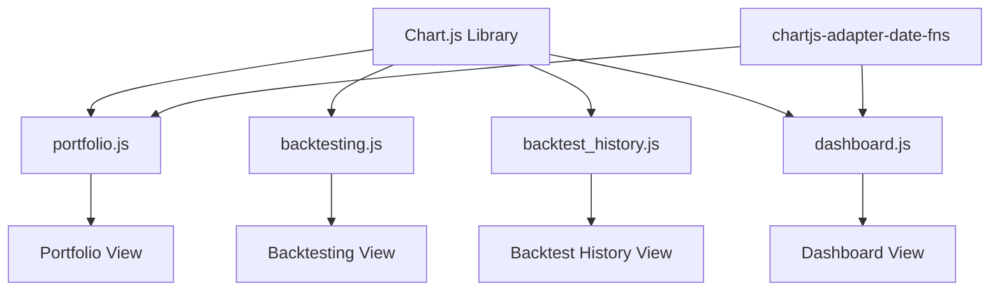
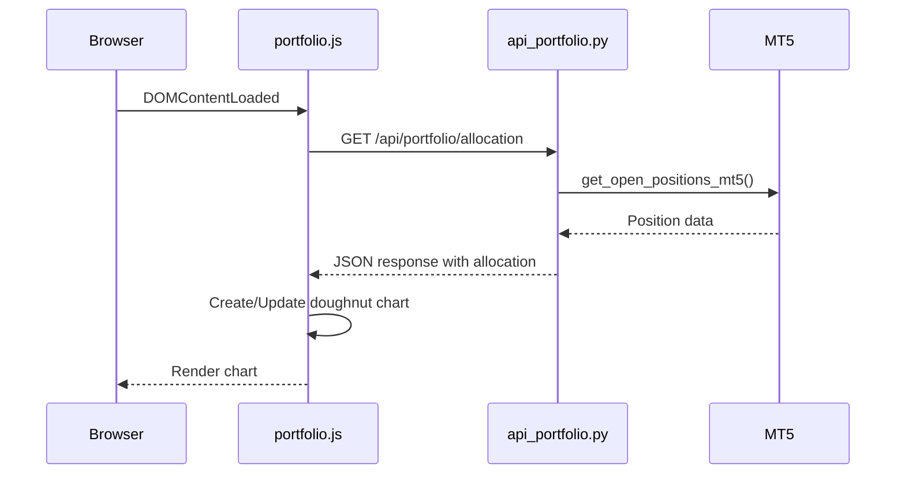
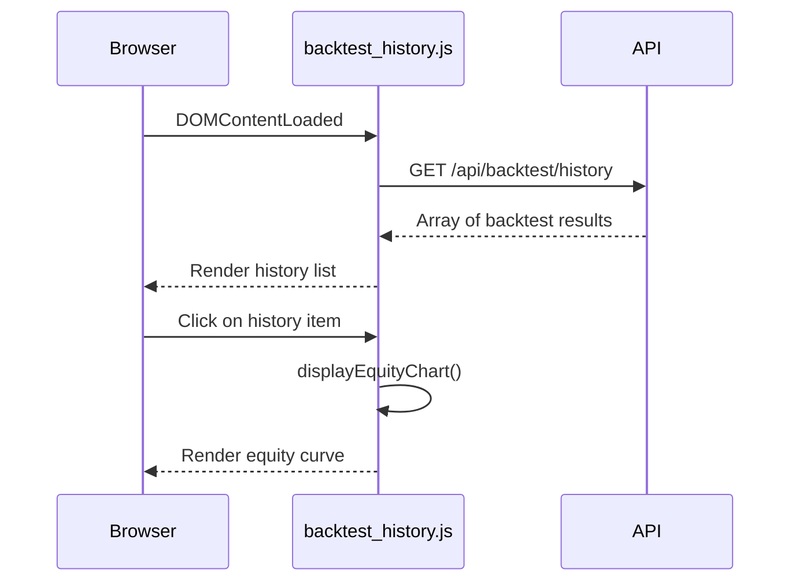
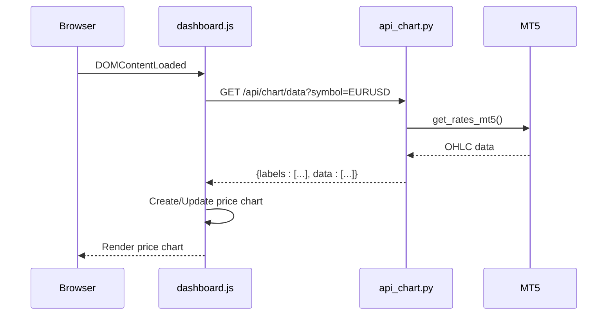
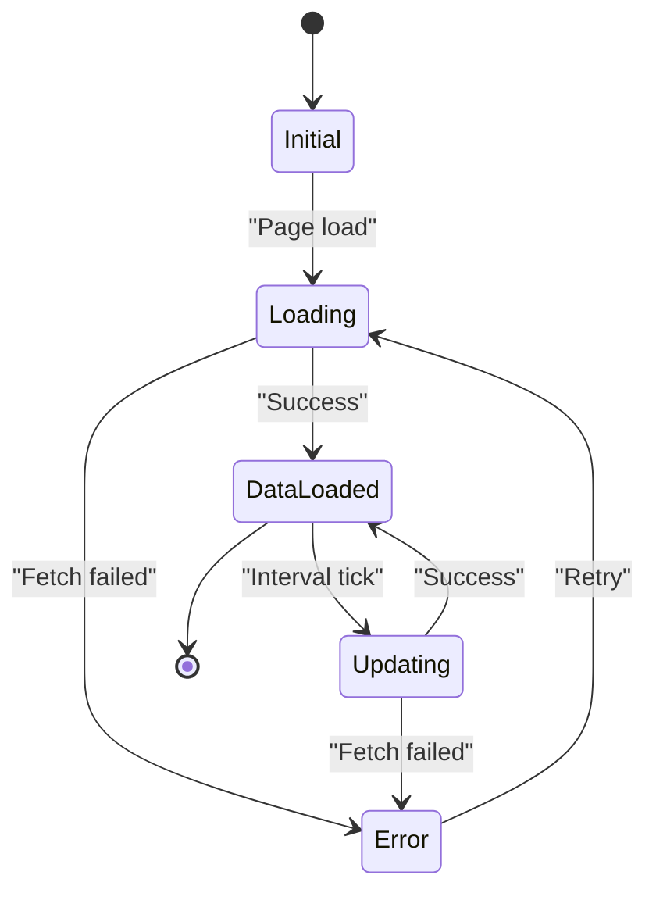

# Data Visualization Implementation

<cite>
**Referenced Files in This Document**   
- [portfolio.js](file://static/js/portfolio.js)
- [backtesting.js](file://static/js/backtesting.js)
- [backtest_history.js](file://static/js/backtest_history.js)
- [dashboard.js](file://static/js/dashboard.js)
- [portfolio.html](file://templates/portfolio.html)
- [backtesting.html](file://templates/backtesting.html)
- [backtest_history.html](file://templates/backtest_history.html)
- [index.html](file://templates/index.html)
- [api_chart.py](file://core/routes/api_chart.py)
- [api_portfolio.py](file://core/routes/api_portfolio.py)
</cite>

## Table of Contents
1. [Introduction](#introduction)
2. [Charting Library Integration](#charting-library-integration)
3. [Portfolio Performance Visualization](#portfolio-performance-visualization)
4. [Backtesting Results Visualization](#backtesting-results-visualization)
5. [Market Data Visualization](#market-data-visualization)
6. [Data Formatting and API Structure](#data-formatting-and-api-structure)
7. [Update Intervals and Real-Time Behavior](#update-intervals-and-real-time-behavior)
8. [User Interaction Features](#user-interaction-features)
9. [Performance Optimization](#performance-optimization)
10. [Customization and Extension](#customization-and-extension)

## Introduction
The quantumbotx platform implements a comprehensive data visualization system across multiple views including portfolio performance, backtesting results, and market data. The system leverages Chart.js as the primary charting library, integrated through dedicated JavaScript modules (dashboard.js, backtesting.js, and portfolio.js) that handle data fetching, chart rendering, and real-time updates. This documentation details the implementation architecture, data flow, and customization options for the visualization components.

## Charting Library Integration
The application uses Chart.js as its primary visualization library, with specific integrations across different views. Chart.js is loaded via CDN in templates that require visualization capabilities, along with the chartjs-adapter-date-fns for date/time formatting support.



**Diagram sources**
- [portfolio.html](file://templates/portfolio.html#L50)
- [index.html](file://templates/index.html#L62)
- [backtesting.html](file://templates/backtesting.html#L67)

**Section sources**
- [portfolio.html](file://templates/portfolio.html#L50)
- [index.html](file://templates/index.html#L62)

## Portfolio Performance Visualization
The portfolio visualization system displays real-time trading performance through two primary charts: a profit/loss time series and an asset allocation doughnut chart.

### P/L Time Series Chart
The profit/loss chart in the portfolio view tracks the cumulative profit and loss of open positions over time. It is implemented in portfolio.js with the following configuration:

```mermaid
classDiagram
class PnlChart {
+initPnlChart()
+updatePnlData()
-pnlCanvas : HTMLCanvasElement
-pnlChart : Chart
-MAX_CHART_POINTS : 60
}
PnlChart --> Chart : "uses"
PnlChart --> "Time Series Data" : "displays"
```

**Diagram sources**
- [portfolio.js](file://static/js/portfolio.js#L20-L48)
- [portfolio.html](file://templates/portfolio.html#L37)

### Asset Allocation Chart
The asset allocation chart displays the distribution of trading volume across different asset classes. It is dynamically updated from the /api/portfolio/allocation endpoint.



**Diagram sources**
- [portfolio.js](file://static/js/portfolio.js#L50-L73)
- [api_portfolio.py](file://core/routes/api_portfolio.py#L15-L33)

**Section sources**
- [portfolio.js](file://static/js/portfolio.js#L20-L150)
- [portfolio.html](file://templates/portfolio.html#L42)

## Backtesting Results Visualization
The backtesting module visualizes strategy performance through equity curve charts that display the growth of capital over the backtesting period.

### Equity Curve Implementation
The equity curve is rendered using Chart.js in the backtesting interface, showing the cumulative profit/loss of the simulated trading strategy.

```mermaid
classDiagram
class EquityChart {
+displayEquityChart(equityData)
-equityChart : Chart
-ctx : CanvasRenderingContext2D
}
EquityChart --> Chart : "creates"
EquityChart --> "Equity Data Array" : "displays"
```

**Diagram sources**
- [backtesting.js](file://static/js/backtesting.js#L138-L170)
- [backtesting.html](file://templates/backtesting.html#L59)

### Backtest History Visualization
Historical backtest results are visualized in the backtest history view, allowing users to examine previous simulation results.



**Diagram sources**
- [backtest_history.js](file://static/js/backtest_history.js#L167-L203)
- [backtest_history.html](file://templates/backtest_history.html#L37)

**Section sources**
- [backtesting.js](file://static/js/backtesting.js#L138-L170)
- [backtest_history.js](file://static/js/backtest_history.js#L167-L203)

## Market Data Visualization
The dashboard provides real-time market data visualization through price and technical indicator charts.

### Price Chart Implementation
The price chart on the dashboard displays historical price data for a selected symbol (default: EUR/USD).



**Diagram sources**
- [dashboard.js](file://static/js/dashboard.js#L78-L123)
- [api_chart.py](file://core/routes/api_chart.py#L7-L21)

### RSI Indicator Chart
The dashboard also displays the Relative Strength Index (RSI) indicator for market analysis.

```mermaid
classDiagram
class RsiChart {
+updateRsiChart(symbol)
+config : ChartConfiguration
-rsiChart : Chart
}
RsiChart --> Chart : "uses"
RsiChart --> "RSI Data" : "displays"
```

**Diagram sources**
- [dashboard.js](file://static/js/dashboard.js#L125-L163)
- [index.html](file://templates/index.html#L58)

**Section sources**
- [dashboard.js](file://static/js/dashboard.js#L78-L193)
- [index.html](file://templates/index.html#L54-L62)

## Data Formatting and API Structure
The visualization components rely on specific API endpoints that provide data in predefined formats.

### Chart Data API Structure
The /api/chart/data endpoint provides price data in a standardized format:

```json
{
  "labels": ["10:00", "10:01", "10:02", ...],
  "data": [1.0850, 1.0852, 1.0849, ...]
}
```

**Section sources**
- [api_chart.py](file://core/routes/api_chart.py#L7-L21)

### Portfolio Data API Structure
The portfolio endpoints provide data for both open positions and asset allocation:

**Open Positions Endpoint**: `/api/portfolio/open-positions`
```json
[
  {
    "symbol": "EURUSD",
    "type": 0,
    "volume": 0.1,
    "price_open": 1.0850,
    "profit": 12.50,
    "magic": 1001
  }
]
```

**Asset Allocation Endpoint**: `/api/portfolio/allocation`
```json
{
  "labels": ["Forex", "Emas", "Saham", "Crypto", "Lainnya"],
  "values": [85.0, 10.0, 3.0, 1.5, 0.5]
}
```

**Section sources**
- [api_portfolio.py](file://core/routes/api_portfolio.py#L7-L33)

## Update Intervals and Real-Time Behavior
The visualization system implements different update intervals based on the nature of the data being displayed.

```mermaid
flowchart TD
A[Real-Time Updates] --> B[Portfolio View]
A --> C[Dashboard View]
D[On-Demand Updates] --> E[Backtesting View]
D --> F[Backtest History View]
B --> G[5-second interval]
C --> H[5-10 second intervals]
E --> I[Manual execution]
F --> J[Manual selection]
G --> K[updatePortfolioData()]
G --> L[updateAssetAllocationChart()]
H --> M[updateDashboardStats()]
H --> N[fetchAllBots()]
H --> O[updatePriceChart()]
H --> P[updateRsiChart()]
```

**Section sources**
- [portfolio.js](file://static/js/portfolio.js#L138-L150)
- [dashboard.js](file://static/js/dashboard.js#L188-L193)

## User Interaction Features
The visualization components include several user interaction features to enhance the user experience.

### Data Refresh Mechanisms
All real-time views implement automatic data refresh:
- Portfolio view: 5-second interval for both position data and asset allocation
- Dashboard view: 10-second interval for statistics, 5-second interval for bot list

### Error Handling and Feedback
The system provides user feedback for various states:
- Loading states with spinner animations
- Error messages displayed directly in the UI
- Empty state messages when no data is available



**Section sources**
- [portfolio.js](file://static/js/portfolio.js#L113-L150)
- [dashboard.js](file://static/js/dashboard.js#L188-L193)

## Performance Optimization
The visualization system includes several performance optimizations to handle data efficiently.

### Chart Data Management
The portfolio P/L chart implements a sliding window to limit the number of data points:

```javascript
const MAX_CHART_POINTS = 60; // Display last 60 data points
// When adding new data:
if (pnlChart.data.labels.length > MAX_CHART_POINTS) {
    pnlChart.data.labels.shift();
    pnlChart.data.datasets[0].data.shift();
}
```

### Efficient Chart Updates
The system uses efficient update methods to minimize re-rendering:
- Using `chart.update('none')` for P/L chart to prevent animation on each update
- Destroying and recreating charts only when necessary
- Batch updating chart data rather than individual point additions

**Section sources**
- [portfolio.js](file://static/js/portfolio.js#L130-L135)

## Customization and Extension
The visualization system can be extended and customized through several mechanisms.

### Adding New Chart Types
To add a new chart type, follow these steps:
1. Create a new canvas element in the relevant HTML template
2. Implement a new chart initialization function in the corresponding JavaScript file
3. Create or modify an API endpoint to provide the required data
4. Add the chart update call to the appropriate refresh interval

### Customizing Existing Visualizations
Existing visualizations can be customized by modifying:
- Chart colors and styling in the Chart.js configuration
- Update intervals by changing the setInterval values
- Data formatting functions for currency and number display
- Chart options for responsiveness and interactivity

### Performance for Large Datasets
For handling large datasets, consider these optimizations:
- Implement server-side data aggregation
- Use data sampling for historical views
- Add pagination for tabular data
- Implement lazy loading for historical data

**Section sources**
- [portfolio.js](file://static/js/portfolio.js#L20-L48)
- [backtesting.js](file://static/js/backtesting.js#L138-L170)
- [dashboard.js](file://static/js/dashboard.js#L78-L123)