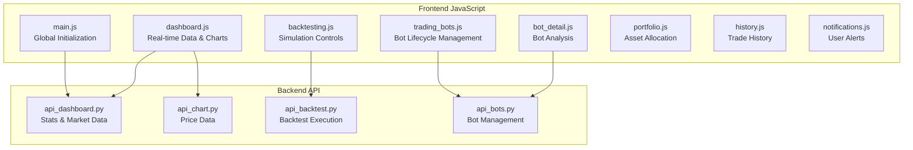
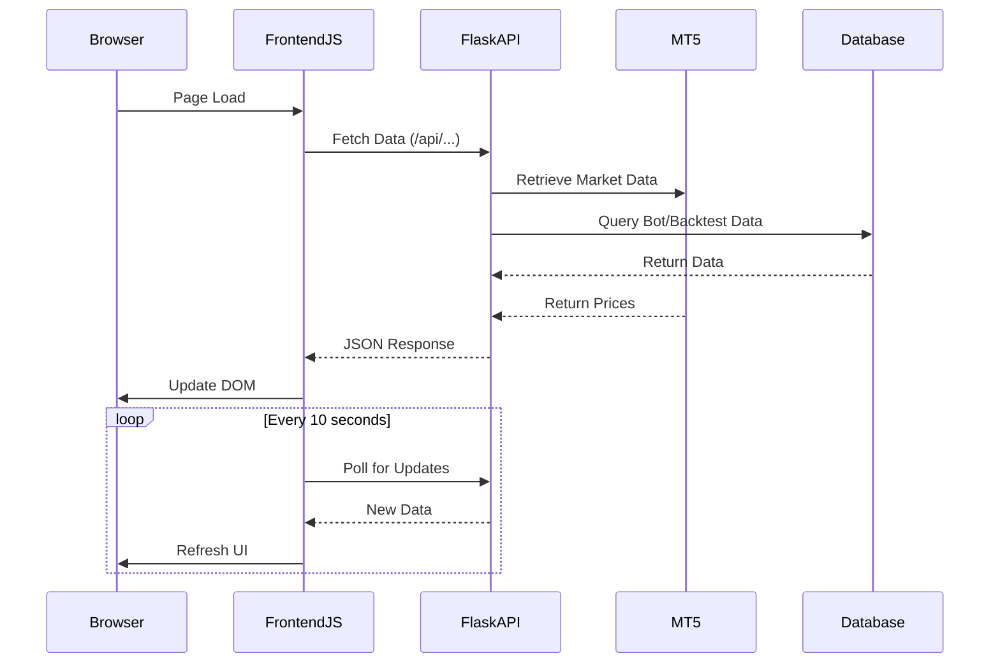
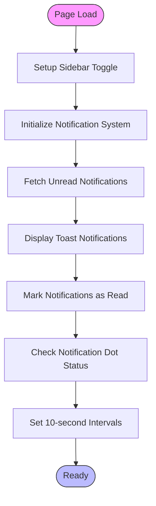
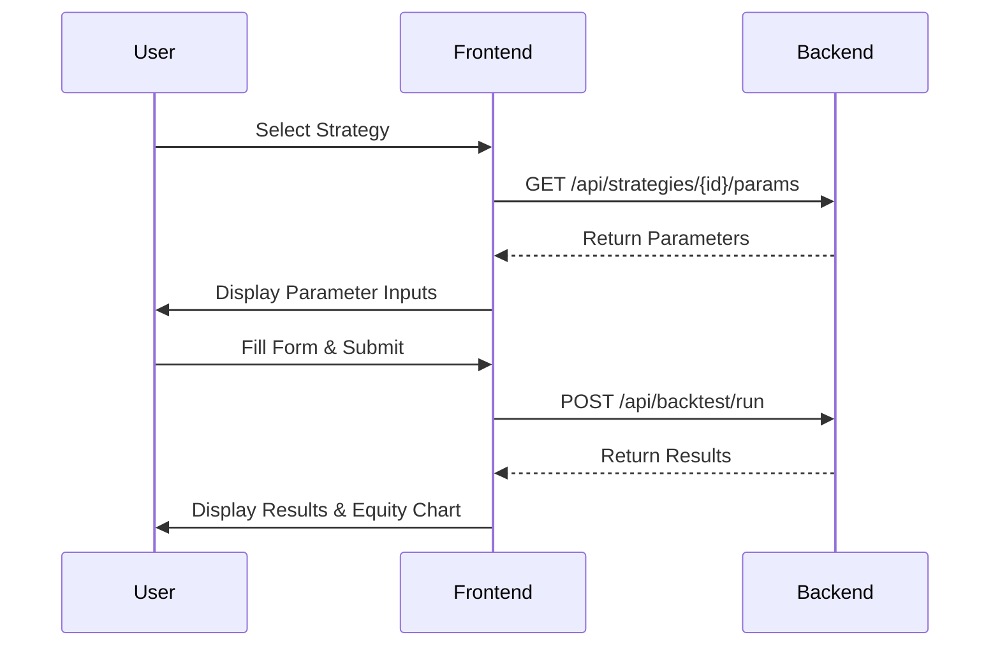
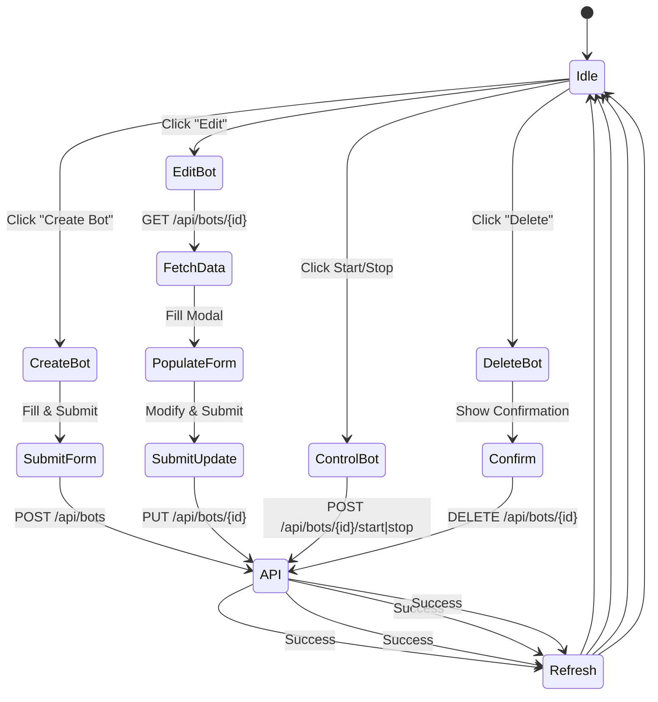

# JavaScript Functionality

<cite>
**Referenced Files in This Document**   
- [main.js](file://static/js/main.js)
- [dashboard.js](file://static/js/dashboard.js)
- [backtesting.js](file://static/js/backtesting.js)
- [trading_bots.js](file://static/js/trading_bots.js)
- [api_dashboard.py](file://core/routes/api_dashboard.py)
- [api_backtest.py](file://core/routes/api_backtest.py)
- [api_bots.py](file://core/routes/api_bots.py)
</cite>

## Table of Contents
1. [Introduction](#introduction)
2. [Project Structure](#project-structure)
3. [Core Components](#core-components)
4. [Architecture Overview](#architecture-overview)
5. [Detailed Component Analysis](#detailed-component-analysis)
6. [Dependency Analysis](#dependency-analysis)
7. [Performance Considerations](#performance-considerations)
8. [Troubleshooting Guide](#troubleshooting-guide)
9. [Conclusion](#conclusion)

## Introduction
This document provides comprehensive documentation for the frontend JavaScript modules in the quantumbotx application. It details the functionality, initialization processes, event handling, API interactions, and state management patterns used across key scripts including main.js, dashboard.js, backtesting.js, and trading_bots.js. The analysis covers real-time data updates, simulation controls, bot lifecycle management, error handling, and user feedback mechanisms.

## Project Structure
The frontend JavaScript files are organized under the static/js directory and correspond to specific pages and functionalities within the application. Each script handles the dynamic behavior of its respective page, with shared dependencies on libraries like Chart.js and Toastify for visualization and notifications.



**Diagram sources**
- [main.js](file://static/js/main.js)
- [dashboard.js](file://static/js/dashboard.js)
- [backtesting.js](file://static/js/backtesting.js)
- [trading_bots.js](file://static/js/trading_bots.js)
- [api_dashboard.py](file://core/routes/api_dashboard.py)
- [api_backtest.py](file://core/routes/api_backtest.py)
- [api_bots.py](file://core/routes/api_bots.py)

**Section sources**
- [main.js](file://static/js/main.js)
- [dashboard.js](file://static/js/dashboard.js)
- [backtesting.js](file://static/js/backtesting.js)
- [trading_bots.js](file://static/js/trading_bots.js)

## Core Components
The core frontend components include main.js for global initialization, dashboard.js for real-time data display, backtesting.js for simulation execution, and trading_bots.js for bot lifecycle management. These scripts handle DOM manipulation, API communication, and user interaction through event listeners and asynchronous operations.

**Section sources**
- [main.js](file://static/js/main.js#L1-L95)
- [dashboard.js](file://static/js/dashboard.js#L1-L193)
- [backtesting.js](file://static/js/backtesting.js#L1-L171)
- [trading_bots.js](file://static/js/trading_bots.js#L1-L360)

## Architecture Overview
The frontend architecture follows a modular pattern where each page-specific JavaScript file handles its own functionality while sharing common libraries and patterns. The system uses AJAX calls to Flask API endpoints for data retrieval and manipulation, with real-time updates achieved through periodic polling.



**Diagram sources**
- [main.js](file://static/js/main.js#L1-L95)
- [dashboard.js](file://static/js/dashboard.js#L1-L193)
- [api_dashboard.py](file://core/routes/api_dashboard.py#L1-L27)

## Detailed Component Analysis

### Main.js Analysis
The main.js file handles global initialization tasks including sidebar toggling and real-time notification handling. It implements a polling mechanism to check for unread notifications and displays them using Toastify.



**Diagram sources**
- [main.js](file://static/js/main.js#L1-L95)

**Section sources**
- [main.js](file://static/js/main.js#L1-L95)

### Dashboard.js Analysis
The dashboard.js module manages real-time data updates for the dashboard page, including account statistics, active bots list, and price/RSI charts. It uses Chart.js for visualization and polls multiple endpoints at different intervals.

#### Data Flow Diagram
```mermaid
flowchart LR
A[DOMContentLoaded] --> B[updateDashboardStats]
A --> C[fetchAllBots]
A --> D[updatePriceChart]
A --> E[updateRsiChart]
B --> F[/api/dashboard/stats]
F --> G[Update Equity/Profit Elements]
C --> H[/api/bots]
H --> I[Render Active Bots List]
D --> J[/api/chart/data]
J --> K[Update Price Chart]
E --> L[/api/rsi_data]
L --> M[Update RSI Chart]
N[setInterval] --> B
O[setInterval] --> C
```

**Diagram sources**
- [dashboard.js](file://static/js/dashboard.js#L1-L193)
- [api_dashboard.py](file://core/routes/api_dashboard.py#L1-L27)

**Section sources**
- [dashboard.js](file://static/js/dashboard.js#L1-L193)

### Backtesting.js Analysis
The backtesting.js file handles the simulation controls on the backtesting page, managing strategy selection, parameter input, and result visualization. It implements a form submission process that sends configuration to the backend for processing.

#### Backtest Execution Flow


**Diagram sources**
- [backtesting.js](file://static/js/backtesting.js#L1-L171)
- [api_backtest.py](file://core/routes/api_backtest.py#L25-L57)

**Section sources**
- [backtesting.js](file://static/js/backtesting.js#L1-L171)

### Trading_bots.js Analysis
The trading_bots.js module provides comprehensive bot lifecycle management, handling creation, editing, starting, stopping, and deletion of trading bots. It features a modal-based interface for bot configuration and real-time table updates.

#### Bot Lifecycle Management


**Diagram sources**
- [trading_bots.js](file://static/js/trading_bots.js#L1-L360)
- [api_bots.py](file://core/routes/api_bots.py#L58-L90)

**Section sources**
- [trading_bots.js](file://static/js/trading_bots.js#L1-L360)

## Dependency Analysis
The frontend JavaScript modules depend on several external libraries and internal API endpoints. The dependency graph shows how different components interact with backend services and shared resources.

```mermaid
graph TD
main.js --> Toastify
main.js --> /api/notifications/unread
main.js --> /api/notifications/unread-count
dashboard.js --> Chart.js
dashboard.js --> /api/dashboard/stats
dashboard.js --> /api/bots
dashboard.js --> /api/chart/data
dashboard.js --> /api/rsi_data
backtesting.js --> Chart.js
backtesting.js --> /api/strategies
backtesting.js --> /api/strategies/{id}/params
backtesting.js --> /api/backtest/run
trading_bots.js --> Chart.js
trading_bots.js --> /api/strategies
trading_bots.js --> /api/strategies/{id}/params
trading_bots.js --> /api/bots
trading_bots.js --> /api/bots/{id}
trading_bots.js --> /api/bots/{id}/start
trading_bots.js --> /api/bots/{id}/stop
trading_bots.js --> /api/bots/start_all
trading_bots.js --> /api/bots/stop_all
Toastify --> main.js
Chart.js --> dashboard.js
Chart.js --> backtesting.js
Chart.js --> trading_bots.js
```

**Diagram sources**
- [main.js](file://static/js/main.js)
- [dashboard.js](file://static/js/dashboard.js)
- [backtesting.js](file://static/js/backtesting.js)
- [trading_bots.js](file://static/js/trading_bots.js)

**Section sources**
- [main.js](file://static/js/main.js#L1-L95)
- [dashboard.js](file://static/js/dashboard.js#L1-L193)
- [backtesting.js](file://static/js/backtesting.js#L1-L171)
- [trading_bots.js](file://static/js/trading_bots.js#L1-L360)

## Performance Considerations
The frontend implements several performance optimizations including:
- **Efficient Polling**: Different refresh intervals based on data volatility (10s for stats, 5s for bots)
- **DOM Caching**: Reusing Chart.js instances instead of recreating them
- **Conditional Updates**: Only updating changed elements rather than full page reloads
- **Error Resilience**: Silent failures for non-critical API calls to maintain UX
- **Lazy Loading**: Loading strategy parameters only when needed

The system balances real-time updates with server load considerations, using appropriate intervals to prevent overwhelming the backend while maintaining a responsive user interface.

## Troubleshooting Guide
Common issues and debugging techniques for frontend JavaScript:

**Section sources**
- [main.js](file://static/js/main.js#L37-L54)
- [dashboard.js](file://static/js/dashboard.js#L15-L35)
- [backtesting.js](file://static/js/backtesting.js#L12-L25)
- [trading_bots.js](file://static/js/trading_bots.js#L276-L304)

### Common Issues
1. **Notifications Not Appearing**
   - Check browser console for fetch errors
   - Verify `/api/notifications/unread` endpoint is accessible
   - Ensure Toastify library is properly loaded

2. **Charts Not Rendering**
   - Confirm Chart.js is loaded before chart initialization
   - Check API response format matches expected structure
   - Verify canvas element exists in DOM

3. **Form Submission Failures**
   - Validate JSON payload structure
   - Check network tab for HTTP errors
   - Verify parameter parsing on backend

4. **Bot Management Issues**
   - Ensure proper CSRF protection if implemented
   - Validate strategy parameter types
   - Check for race conditions in start/stop operations

### Debugging Techniques
- Use browser developer tools to monitor network requests
- Add console.log statements to track function execution
- Test API endpoints directly using browser or curl
- Check server logs for backend errors
- Validate data formats between frontend and backend

## Conclusion
The quantumbotx frontend JavaScript architecture demonstrates a well-structured approach to building a trading dashboard application. Key strengths include modular code organization, consistent API interaction patterns, effective real-time updates, and comprehensive error handling. The system effectively balances functionality with performance through intelligent polling intervals and efficient DOM manipulation. Future improvements could include implementing WebSocket for real-time updates instead of polling, adding more comprehensive client-side validation, and enhancing accessibility features.