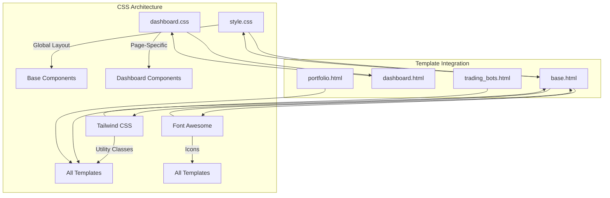
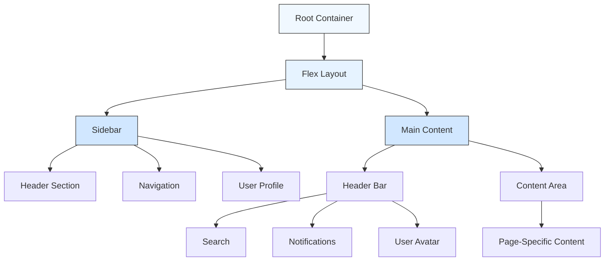
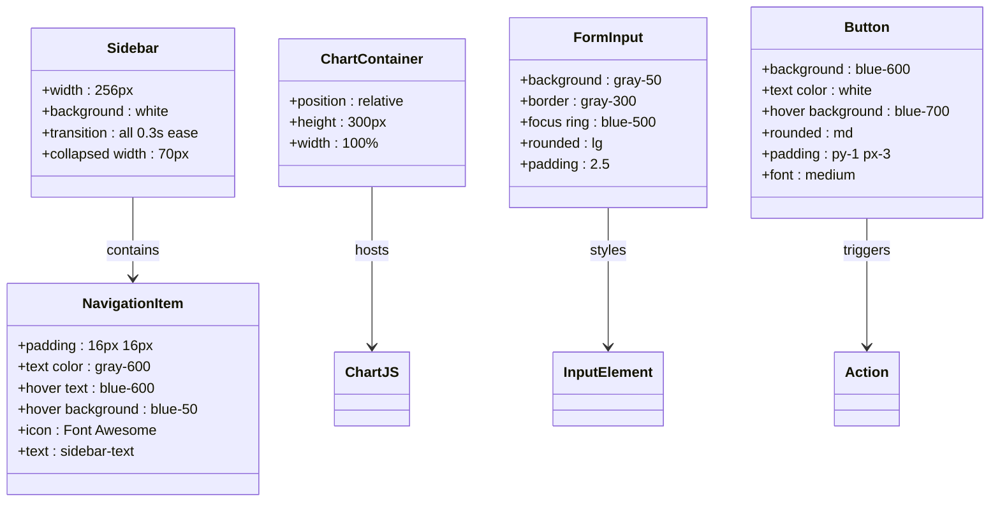
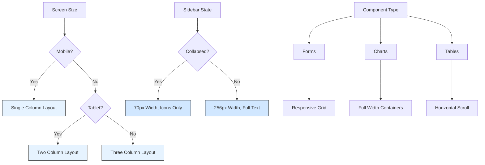

# Styling and CSS Assets

<cite>
**Referenced Files in This Document**   
- [style.css](file://static/css/style.css)
- [dashboard.css](file://static/css/dashboard.css)
- [base.html](file://templates/base.html)
- [backtesting_analyzer.html](file://backtesting_analyzer.html)
- [trading_bots.html](file://templates/trading_bots.html)
- [forex.html](file://templates/forex.html)
- [profile.html](file://templates/profile.html)
- [main.js](file://static/js/main.js)
</cite>

## Table of Contents
1. [Introduction](#introduction)
2. [CSS Architecture Overview](#css-architecture-overview)
3. [Global Styles and Base Configuration](#global-styles-and-base-configuration)
4. [Layout System Implementation](#layout-system-implementation)
5. [Color Schemes and Visual Design](#color-schemes-and-visual-design)
6. [Typography and Spacing System](#typography-and-spacing-system)
7. [UI Component Styles](#ui-component-styles)
8. [Responsive Design and Media Queries](#responsive-design-and-media-queries)
9. [CSS Dependencies and Optimization](#css-dependencies-and-optimization)
10. [Extending Styles and Theme Management](#extending-styles-and-theme-management)

## Introduction
This document provides comprehensive documentation for the CSS architecture in QuantumBotX, an AI-powered trading strategy platform. The styling system combines utility-first CSS with custom component styles to create a modern, responsive interface for financial data visualization and trading bot management. The architecture leverages Tailwind CSS as a utility framework while maintaining custom stylesheets for specific components and global configurations. This documentation analyzes the structure, organization, and implementation details of the CSS assets to guide developers in maintaining visual consistency and extending the styling system.

## CSS Architecture Overview
The QuantumBotX application implements a hybrid CSS architecture that combines external utility frameworks with internal custom stylesheets. The system uses a two-tier approach with `style.css` serving as the global stylesheet for layout and structural components, and `dashboard.css` providing page-specific styles for data visualization and specialized UI elements. The architecture follows a modular pattern where global styles handle layout, navigation, and base components, while page-specific styles manage unique visual requirements for different sections of the application.

The CSS files are organized in the `static/css` directory and are referenced in the base template. The system relies heavily on Tailwind CSS for utility classes, reducing the need for extensive custom CSS while allowing for targeted styling where needed. This approach enables rapid development while maintaining design consistency across the application.



**Diagram sources**
- [style.css](file://static/css/style.css)
- [dashboard.css](file://static/css/dashboard.css)
- [base.html](file://templates/base.html)

**Section sources**
- [style.css](file://static/css/style.css)
- [dashboard.css](file://static/css/dashboard.css)
- [base.html](file://templates/base.html)

## Global Styles and Base Configuration
The global stylesheet `style.css` defines the foundational styles for the QuantumBotX application, focusing primarily on layout behavior and interactive elements. The file implements a collapsible sidebar navigation system that responds to user interaction, providing a space-efficient interface for the trading platform. The styles are minimal but effective, targeting specific components that require custom behavior beyond what utility classes can provide.

The sidebar implementation uses CSS transitions to create smooth animations when collapsing and expanding. The transition property is applied to all animatable properties with a 0.3-second duration and ease timing function, ensuring a polished user experience. When the sidebar is collapsed, the width is reduced from 256px (w-64) to 70px, and text elements are hidden using display: none to maintain visual clarity in the compact mode.

```css
.sidebar { transition: all 0.3s ease; }
.sidebar.collapsed { width: 70px; }
.sidebar.collapsed .sidebar-text, .sidebar.collapsed .logo-text { display: none; }
.sidebar.collapsed .nav-item { justify-content: center; }
```

This implementation works in conjunction with JavaScript in `main.js` to toggle the collapsed state when users click the sidebar toggle button. The class-based approach allows for easy state management and ensures consistent behavior across different pages that extend the base template.

**Section sources**
- [style.css](file://static/css/style.css)
- [main.js](file://static/js/main.js)
- [base.html](file://templates/base.html)

## Layout System Implementation
The QuantumBotX application implements a responsive layout system that combines CSS Flexbox and Grid with Tailwind CSS utility classes. The primary layout structure uses Flexbox to create a two-column interface with a fixed sidebar and flexible main content area. The base template defines this structure using Tailwind's flex utilities, creating a responsive dashboard layout that adapts to different screen sizes.

The sidebar and main content are contained within a flex container with `h-screen` to occupy the full viewport height and `overflow-hidden` to prevent scrollbars at the root level. The sidebar uses `flex flex-col` to stack its content vertically, while the main content area uses `flex-1` to expand and fill the remaining space. This creates a stable layout where the sidebar maintains its width while the content area adapts to available space.

For more complex layouts within specific pages, the application employs CSS Grid through Tailwind's grid utilities. The responsive grid system uses `grid-cols-1 md:grid-cols-2` and `grid-cols-1 lg:grid-cols-3` patterns to create flexible card-based layouts that reflow based on screen size. The `gap-6` utility ensures consistent spacing between grid items, maintaining visual rhythm across different breakpoints.



**Diagram sources**
- [base.html](file://templates/base.html)
- [style.css](file://static/css/style.css)

**Section sources**
- [base.html](file://templates/base.html)
- [style.css](file://static/css/style.css)
- [trading_bots.html](file://templates/trading_bots.html)

## Color Schemes and Visual Design
The QuantumBotX application implements a professional color scheme optimized for financial data visualization and extended screen usage. The design system uses a dark blue gradient background for key dashboard elements, creating visual hierarchy and focus for important data visualizations. The primary gradient defined in `dashboard.css` uses a 135-degree linear gradient from `#1e3a8a` (dark blue) to `#0f172a` (near black), providing a sophisticated backdrop for charts and trading information.

The application follows a consistent color palette across components, using Tailwind CSS color classes for most elements. The primary color scheme centers around blue tones, with `bg-blue-600` for primary buttons and interactive elements, and `hover:bg-blue-700` for hover states. The sidebar uses a white background (`bg-white`) with gray text (`text-gray-600`) and blue hover states (`hover:text-blue-600`, `hover:bg-blue-50`) to create clear visual feedback.

For status indicators and alerts, the application uses a semantic color system:
- Green (`bg-green-100`, `text-green-800`) for buy signals and positive indicators
- Red (`bg-red-100`, `text-red-800`) for sell signals and negative indicators
- Gray (`bg-gray-200`, `text-gray-800`) for neutral or holding states

The notification system uses a red dot (`bg-red-500`) to indicate unread notifications, positioned absolutely in the top-right corner of the bell icon. This creates a clear visual indicator without disrupting the overall interface balance.

**Section sources**
- [dashboard.css](file://static/css/dashboard.css)
- [base.html](file://templates/base.html)
- [bot_detail.js](file://static/js/bot_detail.js)

## Typography and Spacing System
The QuantumBotX application implements a consistent typography system using Tailwind CSS defaults with specific customizations for key components. The base font is set to system-ui through the `font-sans` class applied to the body element, ensuring optimal readability across different operating systems. The typography hierarchy uses a range of text sizes from `text-xs` (12px) for captions and labels to `text-2xl` (24px) for section headings.

The spacing system follows a consistent pattern using Tailwind's spacing scale, with `p-6` (24px) padding for main content areas, `p-4` (16px) for card interiors, and `gap-6` (24px) for grid spacing. Margins are used strategically to create visual separation, with `mb-6` (24px) for section spacing and `mt-4` (16px) for smaller divisions. The form elements use `text-sm` (14px) for labels and input text, with `mb-2` (8px) margin between labels and inputs to create clear associations.

For specific components, the application defines custom typography rules:
- Button text uses `font-medium` (500) weight for emphasis
- Navigation items use `font-semibold` (600) for better visibility
- Status badges use `font-bold` (700) to draw attention to trading signals
- Table headers use `font-medium` with uppercase transformation for clear categorization

The line height is managed through Tailwind's `leading` utilities, with `leading-tight` for headings and `leading-normal` for body text, ensuring optimal readability for financial data.

**Section sources**
- [base.html](file://templates/base.html)
- [trading_bots.html](file://templates/trading_bots.html)
- [forex.html](file://templates/forex.html)
- [profile.html](file://templates/profile.html)

## UI Component Styles
The QuantumBotX application implements a comprehensive system of UI components with consistent styling patterns across the interface. The component library includes navigation elements, data visualization containers, forms, buttons, and cards, each following specific design conventions for visual consistency.

The sidebar navigation uses a clean, minimalist design with `nav-item` links that feature horizontal padding (`px-4`), vertical padding (`py-3`), and rounded corners on hover states. Each navigation item includes an icon from Font Awesome and text, with the text hidden when the sidebar is collapsed. The active state is managed through a Django template variable that adds an `active` class to the current page's navigation item.

Data visualization components are styled to integrate seamlessly with Chart.js and TradingView widgets. The `chart-container` class provides a relative positioning context with fixed height (300px) and full width, ensuring charts render correctly within their containers. The `tradingview-widget-container` class uses 100% height and width to maximize the trading widget's display area.

Form components follow a consistent pattern with `bg-gray-50` background, `border-gray-300` borders, and `focus:ring-blue-500` focus states. Labels use `text-sm font-medium text-gray-900` for clear readability, and inputs have `rounded-lg` corners with `p-2.5` padding for comfortable interaction. The grid system (`grid-cols-1 md:grid-cols-2`) ensures forms are responsive and well-organized on different screen sizes.



**Diagram sources**
- [style.css](file://static/css/style.css)
- [dashboard.css](file://static/css/dashboard.css)
- [base.html](file://templates/base.html)
- [trading_bots.html](file://templates/trading_bots.html)

**Section sources**
- [style.css](file://static/css/style.css)
- [dashboard.css](file://static/css/dashboard.css)
- [base.html](file://templates/base.html)
- [trading_bots.html](file://templates/trading_bots.html)
- [forex.html](file://templates/forex.html)

## Responsive Design and Media Queries
The QuantumBotX application implements a mobile-first responsive design approach using Tailwind CSS's breakpoint system. The layout adapts to different screen sizes through a combination of Flexbox, CSS Grid, and responsive utility classes. While no explicit media queries are defined in the custom CSS files, the application leverages Tailwind's responsive prefixes (sm, md, lg) to create adaptive layouts.

The responsive strategy focuses on three main breakpoints:
- Mobile (default): Single-column layout for all content
- Tablet (md): Two-column layouts for forms and data displays
- Desktop (lg): Three-column layouts for complex dashboards

The sidebar navigation is designed to be responsive, collapsing to a compact mode with only icons visible when the `collapsed` class is applied. This collapse functionality is triggered by JavaScript when users click the toggle button, making the interface more space-efficient on smaller screens or when users prefer a minimalist view.

Grid layouts use responsive column definitions like `grid-cols-1 md:grid-cols-2` and `grid-cols-1 lg:grid-cols-3` to create flexible card-based interfaces that reflow based on available space. This ensures that content remains accessible and well-organized across different device sizes, from mobile phones to large desktop monitors.

The application also implements responsive typography and spacing, with larger padding and margins on desktop views and more compact spacing on mobile devices. Interactive elements maintain sufficient touch targets on mobile devices while optimizing space usage on larger screens.



**Diagram sources**
- [style.css](file://static/css/style.css)
- [base.html](file://templates/base.html)
- [trading_bots.html](file://templates/trading_bots.html)

**Section sources**
- [style.css](file://static/css/style.css)
- [base.html](file://templates/base.html)
- [trading_bots.html](file://templates/trading_bots.html)

## CSS Dependencies and Optimization
The QuantumBotX application manages CSS dependencies through a combination of CDN-hosted libraries and local custom stylesheets. The primary CSS dependencies are loaded in the base template and include Tailwind CSS, Font Awesome, and Toastify CSS, all served from CDN to improve loading performance and leverage browser caching.

The dependency management strategy follows best practices for web performance:
- Critical CSS is inlined through the CDN links in the head section
- Non-critical styles are loaded sequentially
- External libraries are version-pinned through the CDN URLs
- No CSS bundling or minification is implemented, relying on CDN optimization

The project includes ESLint configuration with CSS linting capabilities, as indicated by the `@eslint/css` dependency in `package.json` and the CSS configuration in `eslint.config.mjs`. This suggests that the project maintains code quality standards for CSS, even though the actual styles are primarily utility-based from Tailwind.

The optimization approach prioritizes development speed and maintainability over aggressive CSS optimization. By relying on Tailwind CSS, the application benefits from a highly optimized utility-first framework that eliminates unused CSS through its JIT compiler in production. The custom CSS files are minimal, focusing only on styles that cannot be achieved through utility classes, which reduces the overall CSS bundle size.

The project does not appear to implement advanced CSS optimization techniques such as:
- CSS minification or compression
- Critical CSS extraction
- CSS code splitting
- Preload hints for stylesheets

Instead, it leverages the optimization provided by the CDN-hosted libraries and the efficiency of the utility-first approach.

**Section sources**
- [base.html](file://templates/base.html)
- [package.json](file://package.json)
- [eslint.config.mjs](file://eslint.config.mjs)
- [style.css](file://static/css/style.css)

## Extending Styles and Theme Management
The QuantumBotX application provides several mechanisms for extending styles and maintaining visual consistency across the interface. The architecture is designed to be extensible, allowing developers to add new components and pages while preserving the established design language.

To extend the stylesheet, developers should follow these guidelines:
1. Use Tailwind CSS utility classes for new components whenever possible
2. Add custom styles to `style.css` for global components or behaviors
3. Use `dashboard.css` for page-specific styles related to data visualization
4. Maintain consistent class naming conventions and spacing patterns

The theme management system is currently implicit rather than explicit, with colors and typography defined throughout the templates using Tailwind classes. To create new themes, developers would need to:
1. Define a new color palette using Tailwind's theme configuration
2. Create a theme class that can be applied to the body element
3. Override default colors with theme-specific classes
4. Implement a theme toggle in the settings interface

The application already includes some theming capabilities through the `gradient-bg` class in `dashboard.css`, which could be extended to support multiple gradient themes. The blinking animation defined in `dashboard.css` demonstrates how custom animations can be added to enhance the user interface.

For maintaining visual consistency, the application relies on:
- Consistent use of Tailwind's spacing scale (p-4, p-6, gap-6, etc.)
- Standardized color classes for semantic meaning
- Reusable component patterns in the templates
- Centralized layout management in the base template

New components should follow the established patterns for buttons, forms, cards, and navigation to ensure a cohesive user experience across the platform.

**Section sources**
- [style.css](file://static/css/style.css)
- [dashboard.css](file://static/css/dashboard.css)
- [base.html](file://templates/base.html)
- [backtesting_analyzer.html](file://backtesting_analyzer.html)