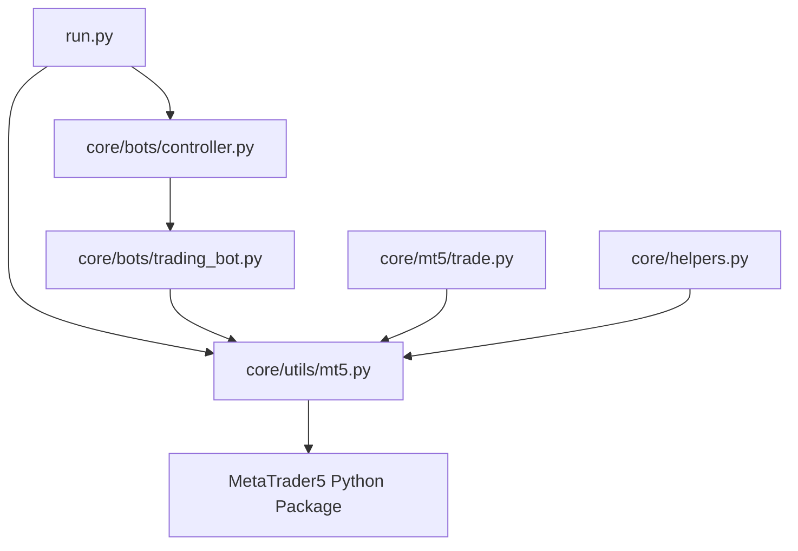
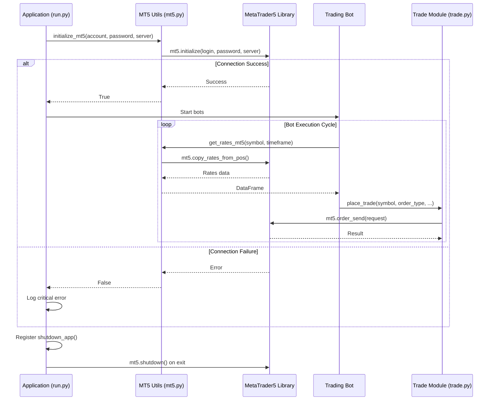
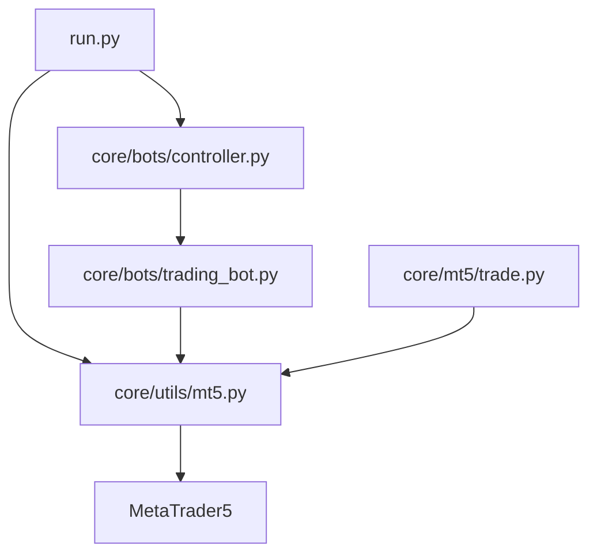

# Connection Management

<cite>
**Referenced Files in This Document**   
- [run.py](file://run.py#L1-L51)
- [core/utils/mt5.py](file://core/utils/mt5.py#L1-L144)
- [core/helpers.py](file://core/helpers.py#L1-L68)
- [core/mt5/trade.py](file://core/mt5/trade.py#L1-L152)
- [core/bots/trading_bot.py](file://core/bots/trading_bot.py#L64-L87)
</cite>

## Table of Contents
1. [Introduction](#introduction)
2. [Project Structure](#project-structure)
3. [Core Components](#core-components)
4. [Architecture Overview](#architecture-overview)
5. [Detailed Component Analysis](#detailed-component-analysis)
6. [Dependency Analysis](#dependency-analysis)
7. [Performance Considerations](#performance-considerations)
8. [Troubleshooting Guide](#troubleshooting-guide)
9. [Conclusion](#conclusion)

## Introduction
The QuantumBotX platform integrates with MetaTrader 5 (MT5) to enable automated trading strategies. This document details the connection management system responsible for initializing, authenticating, maintaining, and gracefully terminating the MT5 connection. The system ensures reliable access to market data, account information, and trade execution capabilities across multiple trading bots. It leverages environment variables for secure credential management, implements centralized initialization, and provides utility functions for health checks and error handling.

## Project Structure
The MT5 connection management functionality is distributed across several key modules within the QuantumBotX project. The main application entry point (`run.py`) handles startup and shutdown, while dedicated utility modules encapsulate connection logic and trading operations. The `core/utils/mt5.py` file contains core connection and data retrieval functions, and `core/mt5/trade.py` manages trade execution. The `core/bots/trading_bot.py` module demonstrates how individual bots interact with the shared MT5 connection.



**Diagram sources**
- [run.py](file://run.py#L1-L51)
- [core/utils/mt5.py](file://core/utils/mt5.py#L1-L144)
- [core/mt5/trade.py](file://core/mt5/trade.py#L1-L152)
- [core/bots/trading_bot.py](file://core/bots/trading_bot.py#L64-L87)

**Section sources**
- [run.py](file://run.py#L1-L51)
- [core/utils/mt5.py](file://core/utils/mt5.py#L1-L144)

## Core Components
The MT5 connection management system is built around several core components. The `initialize_mt5` function in `core/utils/mt5.py` is responsible for establishing the initial connection using credentials from environment variables. The `run.py` script orchestrates the application lifecycle, ensuring the MT5 connection is initialized before any trading bots start and properly shut down when the application exits. The `get_rates_mt5` and `get_account_info_mt5` functions provide safe access to market data and account state, handling common errors and disconnections.

**Section sources**
- [core/utils/mt5.py](file://core/utils/mt5.py#L1-L144)
- [run.py](file://run.py#L1-L51)

## Architecture Overview
The connection management architecture follows a centralized model where a single MT5 connection is shared among all trading bots. This approach minimizes resource usage and avoids rate limits associated with multiple concurrent connections. The Flask-based web server in `run.py` initializes the connection at startup. All bots and services use the globally initialized MetaTrader5 module instance for their operations. Error handling is implemented at the utility function level, with logging used to track connection status and failures.



**Diagram sources**
- [run.py](file://run.py#L1-L51)
- [core/utils/mt5.py](file://core/utils/mt5.py#L1-L144)
- [core/mt5/trade.py](file://core/mt5/trade.py#L1-L152)
- [core/bots/trading_bot.py](file://core/bots/trading_bot.py#L64-L87)

## Detailed Component Analysis

### Connection Initialization and Authentication
The application establishes its MT5 connection during the startup sequence in `run.py`. This process is centralized to ensure only one connection is created for the entire application. The `initialize_mt5` function from `core/utils/mt5.py` is called with credentials retrieved from environment variables (`MT5_LOGIN`, `MT5_PASSWORD`, `MT5_SERVER`). The function uses the `mt5.initialize()` method with login parameters directly, which combines initialization and authentication into a single step. If successful, the connection remains active for the lifetime of the application.

```python
# Example from run.py
ACCOUNT = int(os.getenv('MT5_LOGIN'))
PASSWORD = os.getenv('MT5_PASSWORD')
SERVER = os.getenv('MT5_SERVER', 'MetaQuotes-Demo')
if initialize_mt5(ACCOUNT, PASSWORD, SERVER):
    logging.info("Koneksi MT5 berhasil diinisialisasi dari run.py.")
    ambil_semua_bot() # Load all bots
    atexit.register(shutdown_app)
```

**Section sources**
- [run.py](file://run.py#L1-L51)
- [core/utils/mt5.py](file://core/utils/mt5.py#L1-L144)

### Reconnection Logic and Session Management
The current implementation does not include an explicit reconnection mechanism for handling disconnections or session timeouts. The system assumes a persistent connection established at startup. However, utility functions like `get_rates_mt5` and `get_account_info_mt5` incorporate defensive programming by checking return values from the MetaTrader5 library and logging warnings or errors when data retrieval fails. This indicates a potential disconnection, but no automatic reconnection attempt is made. The responsibility for handling connection loss falls to the calling components, which may need to implement their own retry logic.

```python
# Example from core/utils/mt5.py
def get_rates_mt5(symbol: str, timeframe: int, count: int = 100):
    try:
        rates = mt5.copy_rates_from_pos(symbol, timeframe, 0, count)
        if rates is None or len(rates) == 0:
            logger.warning(f"Gagal mengambil data harga untuk {symbol} (Timeframe: {timeframe}).")
            return pd.DataFrame()
        # ... process data
    except Exception as e:
        logger.error(f"Error saat get_rates_mt5 untuk {symbol}: {e}", exc_info=True)
        return pd.DataFrame()
```

**Section sources**
- [core/utils/mt5.py](file://core/utils/mt5.py#L1-L144)
- [core/bots/trading_bot.py](file://core/bots/trading_bot.py#L64-L87)

### Connection Health Checks and Recovery
The `core/utils/mt5.py` module provides several functions that serve as implicit health checks for the MT5 connection. Functions like `get_account_info_mt5`, `get_rates_mt5`, and `find_mt5_symbol` all interact with the MT5 terminal and can detect connection issues through their return values and error handling. For example, `get_account_info_mt5` checks if `mt5.account_info()` returns `None` and logs a warning, indicating a potential problem. The `find_mt5_symbol` function attempts to retrieve the list of available symbols, which is a reliable indicator of connection health. However, there is no dedicated `is_connected` or `ping` function; health is inferred from the success of operational calls.

```python
# Example from core/utils/mt5.py
def get_account_info_mt5():
    try:
        info = mt5.account_info()
        if info:
            return info._asdict()
        else:
            logger.warning(f"Gagal mengambil info akun. Error: {mt5.last_error()}")
            return None
    except Exception as e:
        logger.error(f"Error saat get_account_info_mt5: {e}", exc_info=True)
        return None
```

**Section sources**
- [core/utils/mt5.py](file://core/utils/mt5.py#L1-L144)

### Safe Connect/Disconnect Patterns and Error Handling
The system employs a safe connect/disconnect pattern centered around the application lifecycle. The connection is established once at startup in `run.py` and terminated once at shutdown via the `atexit` module. The `shutdown_app` function ensures that all trading bots are stopped before the MT5 connection is closed with `mt5.shutdown()`. Error handling is comprehensive, using try-except blocks in utility functions to catch exceptions and log detailed error messages. Common connection failures are handled as follows:
- **Invalid Credentials**: The `initialize_mt5` function logs an error if `mt5.initialize()` fails, capturing the error code with `mt5.last_error()`.
- **Server Unreachable**: This is treated the same as other initialization failures, with an error logged and the function returning `False`.
- **Symbol Not Found**: Functions like `symbol_info` return `None`, which is checked and handled with a warning log.

```python
# Example from core/helpers.py (alternative implementation)
def initialize_mt5(account, password, server):
    if not mt5.initialize():
        print("Failed to initialize MT5:", mt5.last_error())
        return False
    if not mt5.login(account, password=password, server=server):
        print("Failed to login to MT5:", mt5.last_error())
        mt5.shutdown()
        return False
    print(f"Successfully logged into MT5 account: {account} on server {server}")
    return True
```

**Section sources**
- [run.py](file://run.py#L1-L51)
- [core/utils/mt5.py](file://core/utils/mt5.py#L1-L144)
- [core/helpers.py](file://core/helpers.py#L1-L68)

### Managing Connection State Across Multiple Bots
Multiple trading bots share the same global MT5 connection state. This is achieved because the MetaTrader5 Python package uses a singleton-like pattern where the `mt5` module maintains a single connection state across the entire Python process. All bots in `core/bots/trading_bot.py` import and use the `mt5` module directly or through utility functions like `get_rates_mt5`. This design minimizes connection overhead and prevents rate limiting. The `BrokerFactory` pattern, though not fully implemented for MT5, suggests a future direction for managing multiple broker connections, but currently, the MT5 connection is a global resource.

```python
# Example from core/bots/trading_bot.py
from core.utils.mt5 import get_rates_mt5
# ...
df = get_rates_mt5(self.market_for_mt5, tf_const, 250)
if df.empty:
    msg = f"Failed to retrieve price data for {self.market_for_mt5}."
    self.log_activity('WARNING', msg)
    # ... handle error, but no reconnection attempt
```

**Section sources**
- [core/bots/trading_bot.py](file://core/bots/trading_bot.py#L64-L87)
- [core/utils/mt5.py](file://core/utils/mt5.py#L1-L144)

## Dependency Analysis
The MT5 connection management system has a clear dependency hierarchy. The top-level `run.py` script depends on `core/utils/mt5.py` for connection initialization and on `core/bots/controller.py` for bot management. The `core/utils/mt5.py` module has a direct dependency on the `MetaTrader5` Python package, which is the primary interface to the MT5 terminal. Other components like `core/mt5/trade.py` and `core/bots/trading_bot.py` depend on `core/utils/mt5.py` for data access, creating a centralized dependency that promotes code reuse and consistent error handling.



**Diagram sources**
- [run.py](file://run.py#L1-L51)
- [core/utils/mt5.py](file://core/utils/mt5.py#L1-L144)
- [core/mt5/trade.py](file://core/mt5/trade.py#L1-L152)
- [core/bots/trading_bot.py](file://core/bots/trading_bot.py#L64-L87)

**Section sources**
- [run.py](file://run.py#L1-L51)
- [core/utils/mt5.py](file://core/utils/mt5.py#L1-L144)
- [core/mt5/trade.py](file://core/mt5/trade.py#L1-L152)

## Performance Considerations
The centralized connection model provides significant performance benefits by eliminating the overhead of multiple connections and reducing the risk of hitting MT5 server rate limits. Data retrieval functions like `get_rates_mt5` are optimized to fetch data efficiently and return pandas DataFrames for easy processing. However, the lack of a reconnection mechanism could lead to degraded performance or downtime if the connection is lost, requiring a full application restart. To minimize overhead, bots should cache data when possible and avoid making redundant API calls. The use of `mt5.copy_rates_from_pos` with a specific count is more efficient than retrieving all historical data.

## Troubleshooting Guide
Common issues with the MT5 connection and their solutions include:
- **Initialization/Login Failure**: Verify that the MT5 terminal is running and that the `MT5_LOGIN`, `MT5_PASSWORD`, and `MT5_SERVER` environment variables are correctly set. Check the application logs for the specific error code from `mt5.last_error()`.
- **Empty Data Frames**: If `get_rates_mt5` returns an empty DataFrame, ensure the symbol name is correct and available in the MT5 Market Watch. Use `find_mt5_symbol` to resolve naming variations.
- **Symbol Information Not Found**: This often indicates a connection issue or an incorrect symbol name. Check the connection health by calling `get_account_info_mt5` first.
- **Application Fails to Start**: If the MT5 connection fails during startup, the application will log a critical error. Ensure the MT5 terminal is open and accessible from the Python environment.

**Section sources**
- [core/utils/mt5.py](file://core/utils/mt5.py#L1-L144)
- [run.py](file://run.py#L1-L51)
- [core/helpers.py](file://core/helpers.py#L1-L68)

## Conclusion
The QuantumBotX MT5 connection management system provides a robust foundation for automated trading by centralizing the connection lifecycle and providing well-documented utility functions for data access and trading. Its strength lies in its simplicity and efficient use of a single, shared connection. However, the lack of an automatic reconnection mechanism is a notable limitation that could impact reliability in production environments with unstable network conditions. Future improvements should focus on implementing a heartbeat or reconnection loop to automatically restore the connection if it is lost, thereby enhancing the system's resilience without compromising its performance advantages.