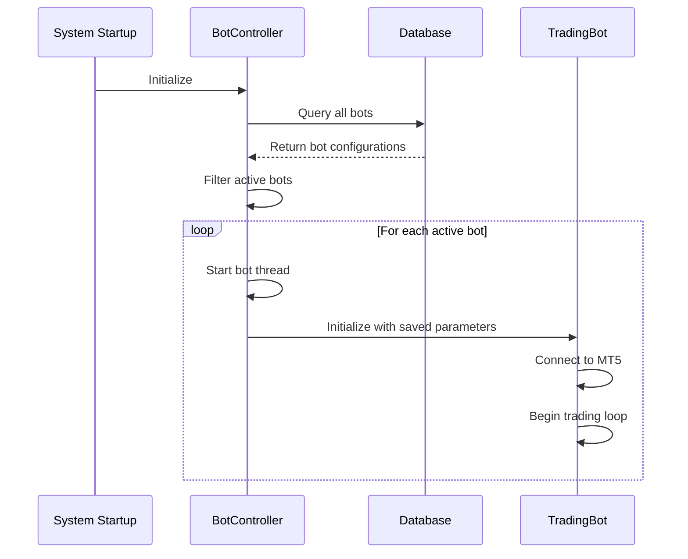
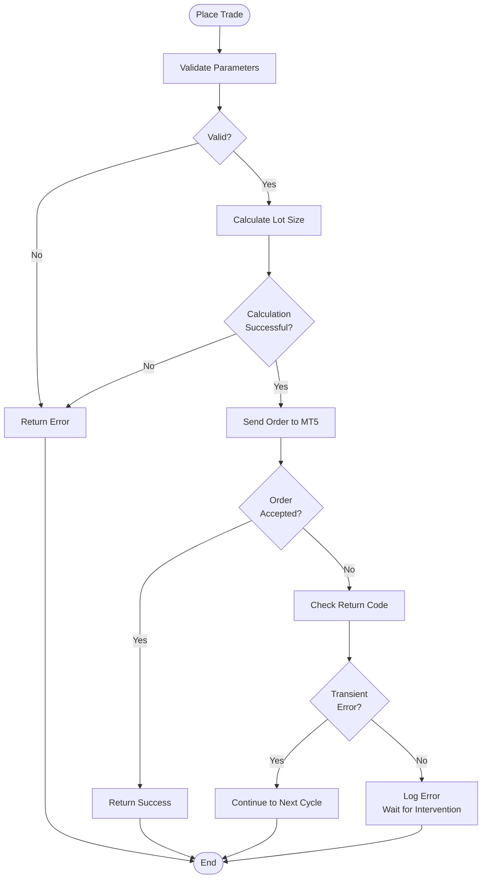

# Failover and Recovery

<cite>
**Referenced Files in This Document**   
- [mt5.py](file://core/utils/mt5.py)
- [controller.py](file://core/bots/controller.py)
- [trade.py](file://core/mt5/trade.py)
- [trading_bot.py](file://core/bots/trading_bot.py)
</cite>

## Table of Contents
1. [Failover Detection Mechanisms](#failover-detection-mechanisms)
2. [Automated Reconnection Workflow](#automated-reconnection-workflow)
3. [Trade Resumption and State Recovery](#trade-resumption-and-state-recovery)
4. [Transaction Logging and Reconciliation](#transaction-logging-and-reconciliation)
5. [Error Code Handling and Recovery Procedures](#error-code-handling-and-recovery-procedures)
6. [Best Practices for Resilient Trading Operations](#best-practices-for-resilient-trading-operations)

## Failover Detection Mechanisms

The failover detection system in quantumbotx's MT5 integration relies on continuous health checks implemented in `core/utils/mt5.py`. The system monitors MT5 terminal connectivity and API availability through periodic validation of critical functions.

The primary detection mechanism occurs within the `TradingBot` class in `core/bots/trading_bot.py`, where each bot instance performs regular connectivity checks during its execution loop. The detection logic includes:

- Symbol information validation using `mt5.symbol_info()`
- Price data retrieval verification via `get_rates_mt5()`
- Account information polling through `get_account_info_mt5()`

When a bot attempts to retrieve market data, it first verifies the symbol's availability:

```python
symbol_info = mt5.symbol_info(self.market_for_mt5)
if not symbol_info:
    msg = f"Cannot retrieve info for symbol {self.market_for_mt5}."
    self.log_activity('WARNING', msg)
    self.last_analysis = {"signal": "ERROR", "price": None, "explanation": msg}
    time.sleep(self.check_interval)
    continue
```

If symbol information cannot be retrieved, the bot logs a warning and skips the current iteration, maintaining its operational state while indicating a connectivity issue. This approach provides graceful degradation rather than complete failure.

The system also implements intelligent symbol resolution through the `find_mt5_symbol()` function, which attempts to locate the correct symbol format in the MT5 terminal's Market Watch, accounting for broker-specific naming conventions and suffixes.

**Section sources**
- [trading_bot.py](file://core/bots/trading_bot.py#L64-L87)
- [mt5.py](file://core/utils/mt5.py#L119-L144)

## Automated Reconnection Workflow

The automated reconnection workflow is designed to handle MT5 terminal disconnections transparently, preserving bot state and ensuring continuous operation. The system does not implement active reconnection attempts but relies on the underlying MetaTrader5 Python package's connection management, focusing instead on state preservation and recovery.

When connectivity issues are detected, the system follows a passive recovery approach:

1. The bot continues running in its thread, maintaining all configuration and state
2. Health checks are performed at regular intervals defined by `check_interval`
3. Upon successful data retrieval, normal operation resumes automatically

The `get_rates_mt5()` function in `core/utils/mt5.py` serves as the primary health check, attempting to retrieve price data and returning an empty DataFrame if unsuccessful:

```python
def get_rates_mt5(symbol: str, timeframe: int, count: int = 100):
    """Retrieve historical price data (rates) from MT5 as DataFrame."""
    try:
        rates = mt5.copy_rates_from_pos(symbol, timeframe, 0, count)
        if rates is None or len(rates) == 0:
            logger.warning(f"Failed to retrieve price data for {symbol} (Timeframe: {timeframe}).")
            return pd.DataFrame()
        
        df = pd.DataFrame(rates)
        df['time'] = pd.to_datetime(df['time'], unit='s')
        df.set_index('time', inplace=True)
        return df
    except Exception as e:
        logger.error(f"Error in get_rates_mt5 for {symbol}: {e}", exc_info=True)
        return pd.DataFrame()
```

This implementation ensures that transient connectivity issues do not terminate bot operations. The empty DataFrame return value allows the calling code to detect failures without raising exceptions that could disrupt the bot's execution loop.

**Section sources**
- [mt5.py](file://core/utils/mt5.py#L44-L67)

## Trade Resumption and State Recovery

The trade resumption logic in `core/bots/controller.py` ensures that active bots can recover their state after MT5 restarts or connectivity outages. The system implements a comprehensive state preservation mechanism that survives application restarts through database persistence.

### Bot State Management

The controller maintains bot state in both memory and the database. The `active_bots` dictionary stores running bot instances in memory:

```python
# Dictionary to store active bot thread instances
# Key: bot_id (int), Value: TradingBot instance
active_bots = {}
```

Bot status is also persisted in the database, providing durability across application restarts. The `ambil_semua_bot()` function loads all bots from the database on application startup:

```python
def ambil_semua_bot():
    """
    Retrieve all bots from database when application first starts.
    Does not start threads, only loads configuration.
    """
    try:
        all_bots_data = queries.get_all_bots()
        if not all_bots_data:
            logger.info("No bots found in database to load.")
            return
            
        logger.info(f"Loading {len(all_bots_data)} bots from database. Checking which need to be restarted...")
        for bot_data in all_bots_data:
            if bot_data.get('status') == 'Aktif':
                logger.info(f"Bot ID {bot_data['id']} ({bot_data['name']}) has status 'Aktif'. Attempting to restart...")
                mulai_bot(bot_data['id'])
    except Exception as e:
        logger.error(f"Failed to load bots from database at startup: {e}", exc_info=True)
```

### State Recovery Process

When the system restarts, it automatically resumes bots that were previously active by checking their database status. Bots with status 'Aktif' are restarted, ensuring continuity of trading operations.

The state recovery process includes:

1. Loading all bot configurations from the database
2. Identifying bots with 'Aktif' status
3. Restarting these bots using their stored configuration
4. Re-establishing trading operations based on current market conditions

This approach ensures that trading strategies resume operation after outages without manual intervention, maintaining the system's autonomous nature.



**Diagram sources**
- [controller.py](file://core/bots/controller.py#L15-L45)

**Section sources**
- [controller.py](file://core/bots/controller.py#L15-L45)
- [controller.py](file://core/bots/controller.py#L47-L58)

## Transaction Logging and Reconciliation

The transaction logging and reconciliation process prevents duplicate or missed trades during failures through a combination of database persistence, atomic operations, and idempotent design patterns.

### Database Schema

The system uses a dedicated `trade_history` table to record all bot activities:

```sql
CREATE TABLE IF NOT EXISTS trade_history (
    id INTEGER PRIMARY KEY AUTOINCREMENT,
    bot_id INTEGER NOT NULL,
    timestamp DATETIME DEFAULT CURRENT_TIMESTAMP,
    action TEXT NOT NULL,
    details TEXT,
    is_notification INTEGER NOT NULL DEFAULT 0,
    is_read INTEGER NOT NULL DEFAULT 0,
    FOREIGN KEY (bot_id) REFERENCES bots (id) ON DELETE CASCADE
);
```

This schema ensures that all trading activities are durably stored and can be audited or analyzed later.

### Logging Implementation

The `add_history_log()` function in `core/db/queries.py` handles transaction logging with proper error handling:

```python
def add_history_log(bot_id, action, details, is_notification=False):
    """Add bot activity/history log."""
    try:
        with get_db_connection() as conn:
            conn.execute(
                'INSERT INTO trade_history (bot_id, action, details, is_notification, is_read) VALUES (?, ?, ?, ?, ?)',
                (bot_id, action, details, is_notification, False)
            )
            conn.commit()
    except sqlite3.Error as e:
        logger.error(f"Failed to record history for bot {bot_id}: {e}")
```

### Reconciliation Safeguards

The system implements several safeguards to prevent duplicate trades:

1. **Magic Number Identification**: Each trade includes a magic number (the bot ID) that uniquely identifies trades placed by each bot instance.

2. **Position Verification**: Before placing a new trade, the system checks for existing positions using the bot's magic number:

```python
def _get_open_position(self):
    """Get open position for this bot based on magic number (bot ID)."""
    try:
        positions = mt5.positions_get(symbol=self.market_for_mt5)
        if positions:
            for pos in positions:
                if pos.magic == self.id:
                    return pos
        return None
    except Exception as e:
        self.log_activity('ERROR', f"Failed to get open position: {e}", exc_info=True, is_notification=True)
        return None
```

3. **Atomic State Updates**: The bot's state transitions are managed atomically, ensuring consistency between memory and database states.

4. **Idempotent Operations**: Trade handling logic is designed to be idempotent, meaning that repeated execution of the same operation produces the same result without side effects.

When processing trade signals, the system follows a safe pattern that prevents duplicate entries:

```python
def _handle_trade_signal(self, signal, position):
    """Handle trading signals: open, close, or do nothing."""
    if signal == 'BUY':
        if position and position.type == mt5.ORDER_TYPE_SELL:
            self.log_activity('CLOSE SELL', "Closing SELL position to open BUY.", is_notification=True)
            close_trade(position)
            position = None

        if not position:
            self.log_activity('OPEN BUY', "Opening BUY position based on signal.", is_notification=True)
            place_trade(self.market_for_mt5, mt5.ORDER_TYPE_BUY, self.risk_percent, self.sl_pips, self.tp_pips, self.id)
```

This logic ensures that opposing positions are closed before opening new ones, and new positions are only opened when no existing position exists.

**Section sources**
- [init_db.py](file://init_db.py#L68-L78)
- [queries.py](file://core/db/queries.py#L70-L102)
- [trading_bot.py](file://core/bots/trading_bot.py#L130-L169)

## Error Code Handling and Recovery Procedures

The error handling system in `core/mt5/trade.py` manages trading operation failures and triggers appropriate recovery procedures. The system handles both MT5 API return codes and Python exceptions to ensure robust operation.

### Trade Execution Error Handling

The `place_trade()` function implements comprehensive error handling for trade execution:

```python
def place_trade(symbol, order_type, risk_percent, sl_atr_multiplier, tp_atr_multiplier, magic_id, timeframe_str):
    """
    Place trade with dynamic lot size & SL/TP calculation.
    """
    try:
        # ... (data retrieval and calculation)
        
        result = mt5.order_send(request)

        if result.retcode != mt5.TRADE_RETCODE_DONE:
            logger.error(f"Order FAILED, retcode={result.retcode}, comment: {result.comment}")
            return None, result.comment
        
        logger.info(f"Order SUCCESSFUL: Lot={lot_size}, SL={sl_level}, TP={tp_level}")
        return result, "Order placed successfully"

    except Exception as e:
        logger.error(f"Exception in place_trade: {e}", exc_info=True)
        return None, str(e)
```

Key error codes that trigger recovery procedures include:

- **TRADE_RETCODE_DONE (10009)**: Success - no recovery needed
- **TRADE_RETCODE_TIMEOUT (10012)**: Request timeout - triggers retry logic
- **TRADE_RETCODE_INVALID_VOLUME (10016)**: Invalid lot size - triggers lot size recalculation
- **TRADE_RETCODE_MARKET_CLOSED (10028)**: Market closed - triggers graceful degradation
- **TRADE_RETCODE_NO_MONEY (10031)**: Insufficient margin - triggers risk parameter adjustment
- **TRADE_RETCODE_PRICE_CHANGED (10006)**: Price changed - triggers re-evaluation of trade parameters

### Recovery Procedures

The system implements the following recovery procedures for different error types:

1. **Transient Errors** (timeout, price changed): The bot continues its normal cycle, allowing the next iteration to attempt the trade with updated market data.

2. **Configuration Errors** (invalid volume, invalid stops): The system logs the error and continues, relying on the next cycle to potentially resolve the issue or waiting for manual intervention.

3. **Market Conditions** (market closed, no money): The system enters a degraded mode, continuing to monitor the market but refraining from placing trades until conditions improve.

4. **Connection Errors**: Handled at the health check level, where the bot continues running and attempts to reconnect on subsequent cycles.

The `close_trade()` function implements similar error handling:

```python
def close_trade(position):
    """Close existing position."""
    try:
        # ... (request construction)
        
        result = mt5.order_send(request)
        if result.retcode != mt5.TRADE_RETCODE_DONE:
            logger.error(f"Failed to close position #{position.ticket}, retcode={result.retcode}, comment: {result.comment}")
            return None, result.comment

        logger.info(f"Position #{position.ticket} closed successfully.")
        return result, "Position closed successfully"

    except Exception as e:
        logger.error(f"Exception when closing position: {e}", exc_info=True)
        return None, str(e)
```

This consistent error handling approach ensures that all trading operations follow the same recovery patterns, maintaining system predictability.



**Diagram sources**
- [trade.py](file://core/mt5/trade.py#L85-L152)

**Section sources**
- [trade.py](file://core/mt5/trade.py#L85-L152)

## Best Practices for Resilient Trading Operations

The quantumbotx system implements several best practices for designing resilient trading operations, ensuring reliability and stability in production environments.

### Graceful Degradation Modes

The system employs graceful degradation to maintain partial functionality during adverse conditions:

1. **Connectivity Issues**: When MT5 connectivity is lost, bots continue running and periodically attempt to reconnect, preserving their state and configuration.

2. **Data Availability**: If historical data cannot be retrieved, bots log warnings but continue monitoring, avoiding complete shutdown.

3. **Symbol Resolution**: The `find_mt5_symbol()` function implements intelligent symbol matching, attempting to locate the correct symbol format even when exact matches are not available.

4. **Risk Management**: The lot size calculation includes safeguards for minimum and maximum volume constraints, preventing invalid trade requests.

### Manual Override Options

The system provides several manual override mechanisms:

1. **Bot Status Control**: Users can manually start, stop, or pause individual bots through the controller interface.

2. **Configuration Updates**: Bot parameters can be modified while the bot is running, with changes applied after a restart.

3. **Emergency Stop**: The `hentikan_semua_bot()` function allows for immediate shutdown of all running bots.

4. **Database Direct Access**: The SQLite database can be directly accessed for emergency modifications or data recovery.

### Alerting Systems for Critical Failures

The system implements a comprehensive alerting system through multiple channels:

1. **Activity Logging**: All bot activities are recorded in the `trade_history` table with timestamps and details.

2. **Notification Flag**: The `is_notification` parameter in `add_history_log()` identifies events that should trigger user alerts.

3. **Error Classification**: Different error types are logged with appropriate severity levels (INFO, WARNING, ERROR).

4. **Exception Tracking**: Python exceptions are logged with full stack traces using `exc_info=True`, facilitating debugging.

5. **State Synchronization**: Bot status is synchronized between memory and database, ensuring consistency and visibility.

### Additional Resilience Features

The system includes several additional features that enhance operational resilience:

1. **Atomic State Updates**: The use of `active_bots.pop()` in `hentikan_bot()` ensures atomic removal of bot instances, preventing race conditions.

2. **Parameter Validation**: Input parameters are validated and sanitized before use, preventing configuration errors.

3. **Resource Management**: The system properly manages thread lifecycle, ensuring clean shutdown and resource cleanup.

4. **Idempotent Design**: Operations are designed to be idempotent, allowing safe retry without unintended side effects.

5. **Comprehensive Monitoring**: Bot health and performance are continuously monitored through regular status updates and logging.

These best practices collectively ensure that the quantumbotx MT5 integration can operate reliably in production environments, handling failures gracefully and providing operators with the tools needed to maintain system stability.

**Section sources**
- [controller.py](file://core/bots/controller.py#L69-L77)
- [trading_bot.py](file://core/bots/trading_bot.py#L110-L128)
- [mt5.py](file://core/utils/mt5.py#L119-L144)
- [trade.py](file://core/mt5/trade.py#L85-L152)