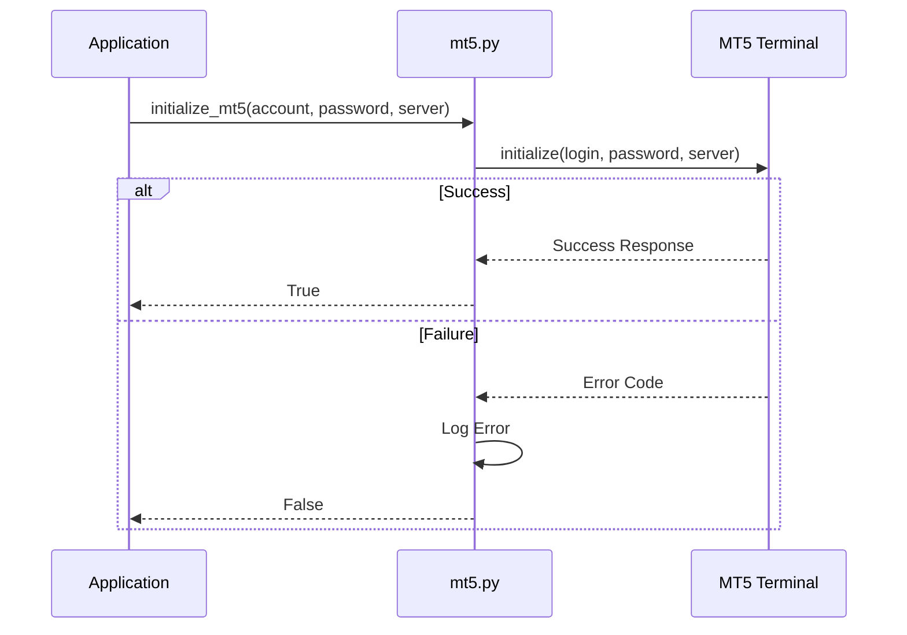

# MT5 Integration

<cite>
**Referenced Files in This Document**   
- [core/mt5/trade.py](file://core/mt5/trade.py#L1-L152)
- [core/utils/mt5.py](file://core/utils/mt5.py#L1-L144)
- [core/helpers.py](file://core/helpers.py#L1-L68)
- [core/bots/trading_bot.py](file://core/bots/trading_bot.py#L64-L87)
- [core/utils/symbols.py](file://core/utils/symbols.py#L1-L84)
- [core/routes/api_stocks.py](file://core/routes/api_stocks.py#L71-L97)
- [core/utils/external.py](file://core/utils/external.py#L54-L71)
</cite>

## Table of Contents
1. [Introduction](#introduction)
2. [Connection Management System](#connection-management-system)
3. [Market Data Access Methods](#market-data-access-methods)
4. [Trade Execution Capabilities](#trade-execution-capabilities)
5. [Risk Management Features](#risk-management-features)
6. [Error Handling and Performance Considerations](#error-handling-and-performance-considerations)
7. [Best Practices for Multiple Accounts and Symbols](#best-practices-for-multiple-accounts-and-symbols)
8. [Failover and Recovery Mechanisms](#failover-and-recovery-mechanisms)

## Introduction
The QuantumBotX platform integrates with MetaTrader 5 (MT5) through a modular Python-based interface that enables automated trading, market data retrieval, and account monitoring. This document provides a comprehensive overview of the MT5 integration layer, focusing on connection lifecycle management, market data access, trade execution, risk controls, error handling, and system resilience. The integration leverages the official MetaTrader5 Python package to interact directly with the MT5 terminal, ensuring reliable and low-latency communication for algorithmic trading strategies.

## Connection Management System

The connection management system in QuantumBotX handles initialization, authentication, and reconnection logic for MT5 connectivity. It ensures secure and persistent access to trading accounts while managing session state across multiple components.

### Initialization and Authentication
Connection to MT5 is established using the `initialize_mt5()` function, which performs both terminal initialization and user login in a single call. Two implementations exist within the codebase:

- **Primary Implementation**: Located in `core/utils/mt5.py`, this version uses structured logging and direct login via `mt5.initialize(login=..., password=..., server=...)`.
- **Legacy Implementation**: Found in `core/helpers.py`, it uses basic print statements and separate `mt5.initialize()` and `mt5.login()` calls.

The preferred method is from `utils/mt5.py` due to its robust error logging and atomic login behavior.



**Diagram sources**
- [core/utils/mt5.py](file://core/utils/mt5.py#L20-L35)

**Section sources**
- [core/utils/mt5.py](file://core/utils/mt5.py#L20-L35)
- [core/helpers.py](file://core/helpers.py#L20-L39)

### Reconnection Logic
While no explicit reconnection loop is implemented, the system employs a passive recovery strategy:
- All MT5 API calls are wrapped in try-except blocks.
- Functions like `get_rates_mt5()` and `symbol_info()` return `None` or empty structures on failure.
- Trading bots periodically retry operations upon failure with a sleep interval (e.g., `time.sleep(self.check_interval)`).

This design allows the system to resume operations once MT5 is restored without requiring active polling or forced reinitialization.

## Market Data Access Methods

QuantumBotX provides several utility functions for retrieving market data from MT5, including price history, symbol information, and account data.

### Price History Retrieval
Historical price data is fetched using the `get_rates_mt5()` function, which wraps `mt5.copy_rates_from_pos()` and returns a pandas DataFrame.

```python
def get_rates_mt5(symbol: str, timeframe: int, count: int = 100):
    rates = mt5.copy_rates_from_pos(symbol, timeframe, 0, count)
    df = pd.DataFrame(rates)
    df['time'] = pd.to_datetime(df['time'], unit='s')
    df.set_index('time', inplace=True)
    return df
```

Supported timeframes are mapped via `TIMEFRAME_MAP`, which translates string keys (e.g., "H1") to MT5 constants.

### Symbol Information Access
Symbol metadata is retrieved using:
- `mt5.symbol_info(symbol)` – for detailed contract specifications
- `mt5.symbol_info_tick(symbol)` – for real-time bid/ask prices
- `find_mt5_symbol(base_symbol)` – to resolve symbol naming variations

The `find_mt5_symbol()` function uses regex pattern matching to locate symbols even when naming conventions differ between brokers.

### Account and Position Data
Key functions include:
- `get_account_info_mt5()` – returns account balance, equity, margin
- `get_open_positions_mt5()` – retrieves active positions as dictionaries
- `get_trade_history_mt5(days)` – fetches closed deals from history

```mermaid
flowchart TD
A["Application Request"] --> B{Data Type?}
B --> |Price History| C[get_rates_mt5()]
B --> |Account Info| D[get_account_info_mt5()]
B --> |Open Positions| E[get_open_positions_mt5()]
B --> |Symbol Info| F[find_mt5_symbol() + symbol_info()]
C --> G[MT5 Terminal]
D --> G
E --> G
F --> G
G --> H[Return Structured Data]
```

**Diagram sources**
- [core/utils/mt5.py](file://core/utils/mt5.py#L37-L65)
- [core/utils/mt5.py](file://core/utils/mt5.py#L100-L144)

**Section sources**
- [core/utils/mt5.py](file://core/utils/mt5.py#L37-L65)
- [core/utils/mt5.py](file://core/utils/mt5.py#L100-L144)
- [core/utils/external.py](file://core/utils/external.py#L54-L71)

## Trade Execution Capabilities

The system supports full trade lifecycle management, including market orders, position closing, and dynamic order parameters.

### Market Orders and Position Management
Trade execution is handled by the `place_trade()` function in `core/mt5/trade.py`. It:
1. Calculates ATR-based stop-loss and take-profit levels
2. Dynamically computes lot size based on risk percentage
3. Submits a market order using `mt5.order_send()`

```python
request = {
    "action": mt5.TRADE_ACTION_DEAL,
    "symbol": symbol,
    "volume": lot_size,
    "type": order_type,
    "price": price,
    "sl": sl_level,
    "tp": tp_level,
    "magic": magic_id,
    "comment": "QuantumBotX Trade",
    "type_time": mt5.ORDER_TIME_GTC,
    "type_filling": mt5.ORDER_FILLING_FOK,
}
```

Positions are closed using `close_trade(position)`, which sends a counter-order based on the current position type.

### Order Modification
While direct order modification (e.g., SL/TP update) is not explicitly implemented, the system achieves similar results by:
- Closing existing positions
- Opening new ones with updated parameters
- Using Magic IDs to track bot-generated trades

This approach ensures atomicity and simplifies state management.


**Diagram sources**
- [core/mt5/trade.py](file://core/mt5/trade.py#L66-L128)

**Section sources**
- [core/mt5/trade.py](file://core/mt5/trade.py#L1-L152)
- [core/bots/trading_bot.py](file://core/bots/trading_bot.py#L142-L168)

## Risk Management Features

The integration includes robust risk controls, particularly around position sizing and volatility-based scaling.

### Stop-Loss and Take-Profit Calculation
SL and TP levels are calculated dynamically using Average True Range (ATR):
```python
atr = ta.atr(df['high'], df['low'], df['close'], length=14).iloc[-1]
sl_distance = atr * sl_atr_multiplier
tp_distance = atr * tp_atr_multiplier
```
This ensures that stop levels adapt to current market volatility.

### Dynamic Lot Sizing
The `calculate_lot_size()` function implements risk-based position sizing:
1. Determines amount to risk: `balance * (risk_percent / 100)`
2. Uses `mt5.order_calc_profit()` to determine loss per lot
3. Computes lot size: `amount_to_risk / loss_per_lot`
4. Rounds to broker’s `volume_step` and enforces min/max limits

This prevents over-leveraging and aligns with sound money management principles.


**Diagram sources**
- [core/mt5/trade.py](file://core/mt5/trade.py#L1-L70)

**Section sources**
- [core/mt5/trade.py](file://core/mt5/trade.py#L1-L70)
- [XAUUSD_FIXES_COMPLETE.md](file://XAUUSD_FIXES_COMPLETE.md#L66-L93)

## Error Handling and Performance Considerations

### Error Handling Strategies
All MT5 interactions are wrapped in try-except blocks with detailed logging. Common failure modes include:
- Connection loss
- Invalid symbol names
- Insufficient data for indicators
- Order rejection due to market conditions

Functions return `None` or error messages, allowing callers to handle failures gracefully.

### Performance Optimization
To minimize API load:
- Data is fetched in bulk (e.g., 250 candles)
- Symbol lookups are cached via `find_mt5_symbol()`
- Redundant `symbol_select()` calls are commented out
- Generator expressions are used for efficient history processing

Frequent polling is throttled using `time.sleep(self.check_interval)` in trading bots.

**Section sources**
- [core/bots/trading_bot.py](file://core/bots/trading_bot.py#L64-L87)
- [core/utils/mt5.py](file://core/utils/mt5.py#L37-L65)

## Best Practices for Managing Multiple Accounts and Symbols Efficiently

### Symbol Resolution
Use `find_mt5_symbol(base_symbol)` to handle broker-specific naming (e.g., XAUUSD.pro, GOLD).mt5).

### Efficient Symbol Filtering
The `get_stock_symbols()` and `get_forex_symbols()` functions filter symbols by path prefix (e.g., "Forex\\") and sort by volume, enabling efficient selection of liquid instruments.

### Account Isolation
Each trading bot instance manages its own account credentials and state, preventing cross-account interference. Magic IDs are used to identify bot-generated trades.

**Section sources**
- [core/utils/symbols.py](file://core/utils/symbols.py#L1-L84)
- [core/routes/api_stocks.py](file://core/routes/api_stocks.py#L71-L97)

## Failover and Recovery Mechanisms

The system maintains trading operations during MT5 downtime through:
- **Graceful Degradation**: When data fetch fails, bots log warnings and retry after delay
- **State Resilience**: No persistent state is stored in MT5; all decisions are recalculated
- **Passive Reconnection**: Upon MT5 restart, subsequent API calls automatically reconnect
- **Data Validation**: All responses are checked for `None` before use

There is no active heartbeat or forced reinitialization, relying instead on the next trading cycle to restore connectivity.


**Diagram sources**
- [core/bots/trading_bot.py](file://core/bots/trading_bot.py#L64-L87)
- [core/utils/mt5.py](file://core/utils/mt5.py#L20-L35)

**Section sources**
- [core/bots/trading_bot.py](file://core/bots/trading_bot.py#L64-L87)
- [core/utils/mt5.py](file://core/utils/mt5.py#L20-L35)