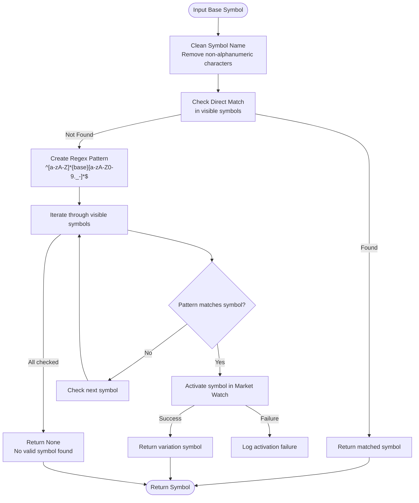
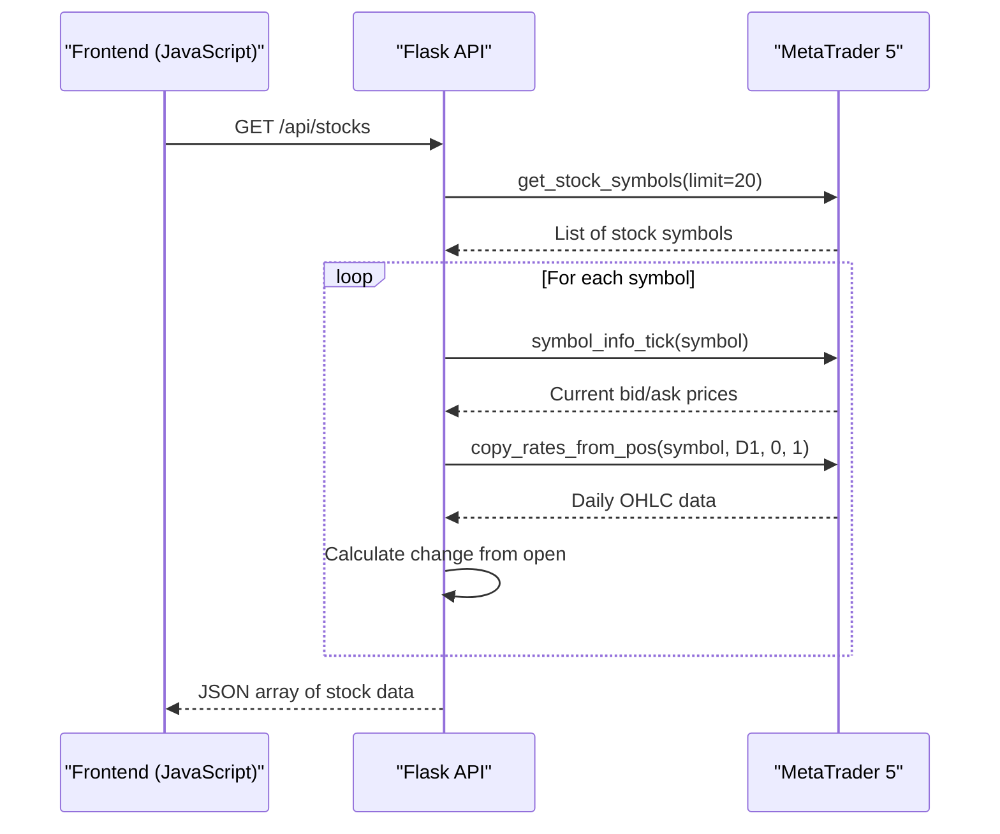
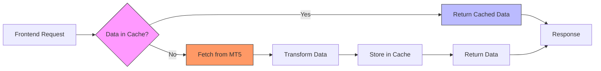

# Market Data Access

<cite>
**Referenced Files in This Document**   
- [core/utils/mt5.py](file://core/utils/mt5.py#L1-L144)
- [core/routes/api_forex.py](file://core/routes/api_forex.py#L1-L23)
- [core/routes/api_stocks.py](file://core/routes/api_stocks.py#L1-L98)
- [core/utils/symbols.py](file://core/utils/symbols.py#L1-L85)
- [core/brokers/interactive_brokers.py](file://core/brokers/interactive_brokers.py#L1-L490)
</cite>

## Table of Contents
1. [Introduction](#introduction)
2. [Market Data Retrieval Functions](#market-data-retrieval-functions)
3. [Symbol Discovery and Filtering](#symbol-discovery-and-filtering)
4. [Data Transformation and Normalization](#data-transformation-and-normalization)
5. [API Endpoints and Request Flow](#api-endpoints-and-request-flow)
6. [Error Handling and Common Issues](#error-handling-and-common-issues)
7. [Performance Optimization Techniques](#performance-optimization-techniques)
8. [Conclusion](#conclusion)

## Introduction
The QuantumBotX platform integrates with MetaTrader 5 (MT5) to provide real-time and historical market data for trading strategies. This document details the implementation of market data access functionality, focusing on how price data, symbol lists, and account information are retrieved from MT5, transformed into usable formats, and exposed through API endpoints. The system is designed to handle both forex and stock instruments with robust error handling, symbol resolution, and performance considerations.

**Section sources**
- [core/utils/mt5.py](file://core/utils/mt5.py#L1-L20)
- [core/routes/api_forex.py](file://core/routes/api_forex.py#L1-L5)

## Market Data Retrieval Functions

The core market data retrieval functionality is implemented in `core/utils/mt5.py`, which provides a clean interface to the MetaTrader5 Python API. The module handles connection management, data retrieval, and error handling for various market data types.

### Historical Price Data Retrieval
The `get_rates_mt5` function retrieves historical price data using MT5's `copy_rates_from_pos` method. It converts the raw data into a pandas DataFrame with proper datetime indexing for easy consumption by trading strategies.

```python
def get_rates_mt5(symbol: str, timeframe: int, count: int = 100):
    """Retrieve historical price data from MT5 as a DataFrame."""
    try:
        rates = mt5.copy_rates_from_pos(symbol, timeframe, 0, count)
        if rates is None or len(rates) == 0:
            logger.warning(f"Failed to retrieve price data for {symbol} (Timeframe: {timeframe}).")
            return pd.DataFrame()
        
        df = pd.DataFrame(rates)
        df['time'] = pd.to_datetime(df['time'], unit='s')
        df.set_index('time', inplace=True)
        return df
    except Exception as e:
        logger.error(f"Error in get_rates_mt5 for {symbol}: {e}", exc_info=True)
        return pd.DataFrame()
```

### Account Information Retrieval
The `get_account_info_mt5` function retrieves account details such as balance, equity, and profit from MT5, converting the named tuple result to a dictionary for easier JSON serialization.

```python
def get_account_info_mt5():
    """Retrieve account information (balance, equity, profit) from MT5."""
    try:
        info = mt5.account_info()
        if info:
            return info._asdict()
        else:
            logger.warning(f"Failed to retrieve account info. Error: {mt5.last_error()}")
            return None
    except Exception as e:
        logger.error(f"Error in get_account_info_mt5: {e}", exc_info=True)
        return None
```

### Timeframe Mapping
The module includes a `TIMEFRAME_MAP` constant that translates string representations of timeframes to their corresponding MT5 constants, enabling flexible timeframe selection.

```python
TIMEFRAME_MAP = {
    "M1": mt5.TIMEFRAME_M1, "M5": mt5.TIMEFRAME_M5, "M15": mt5.TIMEFRAME_M15, 
    "H1": mt5.TIMEFRAME_H1, "H4": mt5.TIMEFRAME_H4, "D1": mt5.TIMEFRAME_D1,
    "W1": mt5.TIMEFRAME_W1, "MN1": mt5.TIMEFRAME_MN1
}
```

**Section sources**
- [core/utils/mt5.py](file://core/utils/mt5.py#L24-L35)
- [core/utils/mt5.py](file://core/utils/mt5.py#L37-L65)
- [core/utils/mt5.py](file://core/utils/mt5.py#L10-L14)

## Symbol Discovery and Filtering

The platform implements sophisticated symbol discovery and filtering mechanisms to identify available trading instruments and resolve symbol naming discrepancies between different brokers.

### Symbol List Retrieval
The `symbols.py` utility provides functions to retrieve filtered lists of forex and stock symbols based on their path structure in MT5. Forex symbols are identified by the "Forex\\" prefix, while stocks are identified by keywords like "stock", "share", or "equity" in their path.

```python
def get_forex_symbols():
    """Retrieve forex symbols based on path filter."""
    all_symbols = get_all_symbols_from_mt5()
    forex_list = []
    
    if not all_symbols:
        return []
    
    for s in all_symbols:
        if s.path.lower().startswith(FOREX_PREFIX):
            tick = mt5.symbol_info_tick(s.name)
            if tick:
                forex_list.append({
                    "name": s.name,
                    "description": s.description,
                    "ask": tick.ask,
                    "bid": tick.bid,
                    "spread": s.spread,
                    "digits": s.digits,
                })
    
    return forex_list
```

### Symbol Name Resolution
The `find_mt5_symbol` function implements intelligent symbol name resolution to handle variations in symbol naming conventions across different brokers. It cleans the input symbol, checks for direct matches, and uses regex pattern matching to find variations.



**Diagram sources**
- [core/utils/mt5.py](file://core/utils/mt5.py#L100-L144)

**Section sources**
- [core/utils/symbols.py](file://core/utils/symbols.py#L34-L85)
- [core/utils/mt5.py](file://core/utils/mt5.py#L100-L144)

## Data Transformation and Normalization

The platform transforms raw MT5 data into standardized formats suitable for strategy consumption and frontend display. This includes converting time formats, normalizing price data, and structuring symbol information.

### Time and Date Handling
All timestamps from MT5 are in Unix epoch format (seconds since 1970). The `get_rates_mt5` function converts these to proper datetime objects and sets them as the DataFrame index:

```python
df['time'] = pd.to_datetime(df['time'], unit='s')
df.set_index('time', inplace=True)
```

This transformation enables time-based operations in pandas and ensures consistent datetime handling across the application.

### Price Data Normalization
For stock data, the platform calculates price changes relative to the daily opening price rather than using absolute values. This provides a more meaningful representation of intraday performance:

```python
daily_open = rates[0]['open']
last_price = tick.ask
change = last_price - daily_open
```

### Symbol Profile Data
The `get_mt5_symbol_profile` function (in `external.py`) retrieves detailed symbol information and normalizes it into a consistent format for frontend consumption:

```python
return {
    "name": symbol_info.description,
    "symbol": symbol_info.name,
    "currency_base": symbol_info.currency_base,
    "currency_profit": symbol_info.currency_profit,
    "digits": symbol_info.digits,
    "spread": symbol_info.spread,
    "trade_contract_size": symbol_info.trade_contract_size,
    "volume_min": symbol_info.volume_min,
    "volume_max": symbol_info.volume_max,
    "volume_step": symbol_info.volume_step,
    "margin_initial": symbol_info.margin_initial,
    "margin_maintenance": symbol_info.margin_maintenance,
}
```

**Section sources**
- [core/utils/mt5.py](file://core/utils/mt5.py#L37-L65)
- [core/routes/api_stocks.py](file://core/routes/api_stocks.py#L50-L70)
- [core/utils/external.py](file://core/utils/external.py#L54-L71)

## API Endpoints and Request Flow

The platform exposes market data through RESTful API endpoints that handle frontend requests and orchestrate data retrieval from MT5.

### Forex Data Endpoints
The `/api/forex-data` endpoint returns a list of available forex symbols with their current prices and spread information:

```python
@api_forex.route('/api/forex-data')
def get_forex_data():
    """Return list of forex symbols sorted by popularity (daily volume)."""
    forex_symbols = get_forex_symbols()
    return jsonify(forex_symbols)
```

### Stock Data Endpoints
The stock endpoints provide both summary data and detailed information:

```python
@api_stocks.route('/api/stocks')
def get_stocks():
    """Retrieve current stock prices with change from daily open."""
    stock_symbols = get_stock_symbols(limit=20)
    result = []
    
    for symbol in [stock['name'] for stock in stock_symbols]:
        try:
            # Get current tick
            tick = mt5.symbol_info_tick(symbol)
            if not tick or tick.ask == 0:
                continue
                
            # Get daily open
            rates = mt5.copy_rates_from_pos(symbol, mt5.TIMEFRAME_D1, 0, 1)
            if rates is None or len(rates) == 0:
                continue
                
            daily_open = rates[0]['open']
            last_price = tick.ask
            change = last_price - daily_open
            
            result.append({
                'symbol': symbol,
                'last_price': last_price,
                'change': round(change, 2),
                'time': datetime.fromtimestamp(tick.time).strftime('%H:%M:%S')
            })
        except Exception as e:
            logger.error(f"Error processing stock symbol {symbol}: {e}", exc_info=True)
    
    return jsonify(result)
```



**Diagram sources**
- [core/routes/api_stocks.py](file://core/routes/api_stocks.py#L15-L98)

**Section sources**
- [core/routes/api_forex.py](file://core/routes/api_forex.py#L7-L23)
- [core/routes/api_stocks.py](file://core/routes/api_stocks.py#L15-L98)

## Error Handling and Common Issues

The market data system implements comprehensive error handling to address common issues encountered when working with MT5 data.

### Missing Data Handling
The system gracefully handles cases where data is unavailable:

```python
rates = mt5.copy_rates_from_pos(symbol, timeframe, 0, count)
if rates is None or len(rates) == 0:
    logger.warning(f"Failed to retrieve price data for {symbol}")
    return pd.DataFrame()
```

### Timezone Mismatches
All timestamps are converted from MT5's server time (Unix epoch) to local datetime objects, avoiding timezone confusion in the application:

```python
df['time'] = pd.to_datetime(df['time'], unit='s')
```

### Symbol Availability Issues
The `find_mt5_symbol` function addresses symbol naming inconsistencies by attempting to match variations and ensuring symbols are activated in the Market Watch:

```python
if mt5.symbol_select(symbol_name, True):
    return symbol_name
else:
    logger.warning(f"Symbol '{symbol_name}' found but failed to activate.")
```

### Market Hours Considerations
For stocks, the system checks if markets are open before attempting to retrieve data, preventing errors during non-trading hours:

```python
# In interactive_brokers.py
def is_market_open(self) -> bool:
    """Check if markets are open (simplified)"""
    now = datetime.now()
    return now.weekday() < 5  # Weekdays only
```

**Section sources**
- [core/utils/mt5.py](file://core/utils/mt5.py#L37-L65)
- [core/utils/mt5.py](file://core/utils/mt5.py#L100-L144)
- [core/brokers/interactive_brokers.py](file://core/brokers/interactive_brokers.py#L470-L474)

## Performance Optimization Techniques

The platform employs several performance optimization techniques to minimize API load and improve response times.

### Caching Mechanisms
While the MT5 integration doesn't implement explicit caching, the Interactive Brokers broker demonstrates a caching pattern that could be applied:

```python
# In interactive_brokers.py
self.market_data_cache = {}
...
self.market_data_cache[reqId] = []
...
data = self.market_data_cache.get(req_id, [])
```

### Batch Requests
The stock data endpoint processes multiple symbols in a single request rather than making separate API calls for each symbol:

```python
for symbol in symbols_to_process:
    try:
        tick = mt5.symbol_info_tick(symbol)
        rates = mt5.copy_rates_from_pos(symbol, mt5.TIMEFRAME_D1, 0, 1)
        # Process data...
    except Exception as e:
        logger.error(f"Error processing {symbol}: {e}")
```

### Efficient Time Range Selection
The system uses `copy_rates_from_pos` with a count parameter rather than specifying date ranges, which is more efficient for retrieving recent data:

```python
rates = mt5.copy_rates_from_pos(symbol, timeframe, 0, count)
```

This approach avoids date parsing and timezone conversions on the MT5 server side.

### Connection Management
The system assumes MT5 is already initialized when the application starts, avoiding repeated connection overhead:

```python
# In symbols.py
# Koneksi sudah diinisialisasi saat aplikasi pertama kali berjalan.
# Kita tidak perlu melakukan initialize() di sini lagi.
```



**Diagram sources**
- [core/brokers/interactive_brokers.py](file://core/brokers/interactive_brokers.py#L43-L490)

**Section sources**
- [core/brokers/interactive_brokers.py](file://core/brokers/interactive_brokers.py#L43-L490)
- [core/routes/api_stocks.py](file://core/routes/api_stocks.py#L50-L80)

## Conclusion
The QuantumBotX platform's market data access system provides a robust and efficient interface to MetaTrader 5, enabling trading strategies to access historical and real-time price data. The system handles symbol discovery, data transformation, and error conditions gracefully, while the API endpoints expose this functionality to the frontend in a consumable format. By converting MT5's native data structures to pandas DataFrames and implementing intelligent symbol resolution, the platform ensures reliable data access across different brokers and market conditions. Future enhancements could include explicit caching mechanisms and more sophisticated error recovery strategies to further improve performance and reliability.