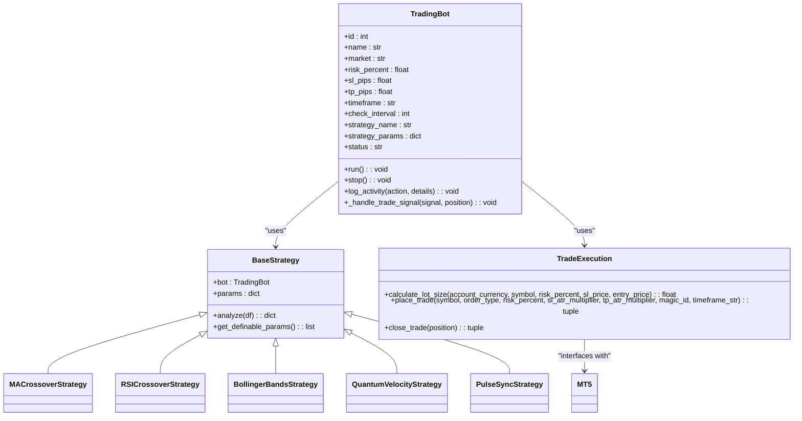
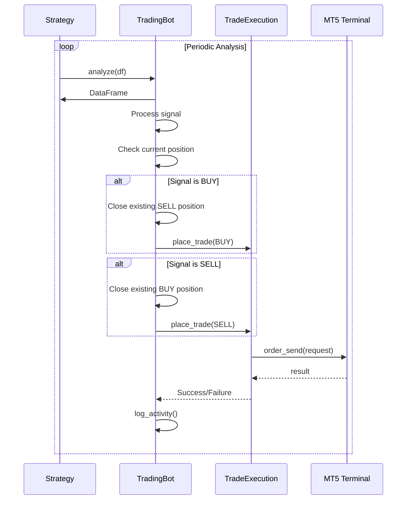
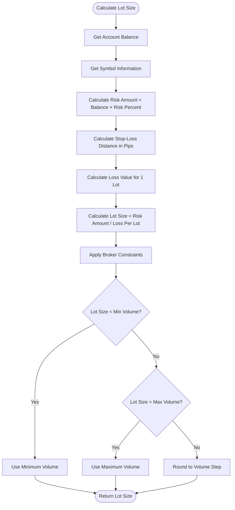

# Trade Execution

<cite>
**Referenced Files in This Document**   
- [trade.py](file://core/mt5/trade.py#L1-L153)
- [base_strategy.py](file://core/strategies/base_strategy.py#L1-L29)
- [trading_bot.py](file://core/bots/trading_bot.py#L1-L170)
- [helpers.py](file://core/helpers.py#L1-L69)
- [queries.py](file://core/db/queries.py#L70-L102)
</cite>

## Table of Contents
1. [Trade Execution Overview](#trade-execution-overview)
2. [Core Trade Execution Components](#core-trade-execution-components)
3. [Trade Signal Generation](#trade-signal-generation)
4. [Trade Execution Workflow](#trade-execution-workflow)
5. [Order Construction and Parameters](#order-construction-and-parameters)
6. [Position Sizing and Risk Management](#position-sizing-and-risk-management)
7. [Error Handling and Validation](#error-handling-and-validation)
8. [Trade Logging and Monitoring](#trade-logging-and-monitoring)

## Trade Execution Overview
The QuantumBotX trading system implements a robust trade execution framework that converts trading signals from strategies into actual trades via the MetaTrader 5 (MT5) terminal. The system follows a structured workflow where strategy-generated signals are processed by trading bots, which then execute trades through the MT5 API using proper risk management, position sizing, and error handling mechanisms. This document details the complete trade execution pipeline, from signal generation to order placement and position management.

## Core Trade Execution Components

The trade execution system consists of three primary components that work together to process trading signals and execute orders:

1. **Strategy Layer**: Generates standardized trading signals through strategy classes that inherit from BaseStrategy
2. **Bot Layer**: Processes signals and manages the trading lifecycle through the TradingBot class
3. **Execution Layer**: Interfaces with MT5 to send orders and manage positions through the trade.py module



**Diagram sources**
- [base_strategy.py](file://core/strategies/base_strategy.py#L1-L29)
- [trading_bot.py](file://core/bots/trading_bot.py#L1-L170)
- [trade.py](file://core/mt5/trade.py#L1-L153)

**Section sources**
- [base_strategy.py](file://core/strategies/base_strategy.py#L1-L29)
- [trading_bot.py](file://core/bots/trading_bot.py#L1-L170)
- [trade.py](file://core/mt5/trade.py#L1-L153)

## Trade Signal Generation

The BaseStrategy class serves as the foundation for all trading strategies in the QuantumBotX system, providing a standardized interface for generating trading signals. All strategy implementations inherit from this abstract base class and must implement the analyze method, which processes market data and returns a standardized signal dictionary.

```python
class BaseStrategy(ABC):
    """
    Abstract base class for all trading strategies.
    Each strategy must inherit from this class and implement the `analyze` method.
    """
    def __init__(self, bot_instance, params: dict = {}):
        self.bot = bot_instance
        self.params = params

    @abstractmethod
    def analyze(self, df):
        """
        Core method that must be overridden by each strategy.
        This method must return a dictionary containing the analysis results.
        Receives a DataFrame as input.
        """
        raise NotImplementedError("Each strategy must implement the `analyze(df)` method.")
```

Strategies generate signals by analyzing price data (typically in the form of a pandas DataFrame containing OHLCV data) and applying their specific logic. The analyze method returns a dictionary with at least a "signal" key, which can have values like "BUY", "SELL", or "HOLD". Some strategies may also include additional information such as entry price, stop-loss level, take-profit level, or confidence scores.

The strategy_map.py file maintains a registry of all available strategies, mapping strategy names to their corresponding classes:

```python
STRATEGY_MAP = {
    'MA_CROSSOVER': MACrossoverStrategy,
    'QUANTUMBOTX_HYBRID': QuantumBotXHybridStrategy,
    'RSI_CROSSOVER': RSICrossoverStrategy,
    'BOLLINGER_REVERSION': BollingerBandsStrategy,
    # ... other strategies
}
```

This design allows the trading bot to dynamically instantiate the appropriate strategy class based on the configured strategy name.

**Section sources**
- [base_strategy.py](file://core/strategies/base_strategy.py#L1-L29)
- [strategy_map.py](file://core/strategies/strategy_map.py#L1-L26)

## Trade Execution Workflow

The trade execution workflow begins when a TradingBot instance receives a signal from its associated strategy and proceeds through several stages to execute the trade. The process is managed by the bot's run method, which operates in a continuous loop, periodically checking for new signals and acting on them.



**Diagram sources**
- [trading_bot.py](file://core/bots/trading_bot.py#L1-L170)
- [trade.py](file://core/mt5/trade.py#L1-L153)

The workflow follows these steps:

1. The TradingBot periodically retrieves market data and passes it to the strategy's analyze method
2. The strategy processes the data and returns a signal dictionary
3. The bot checks if there is an existing position for the same symbol
4. Based on the signal and current position status, the bot determines the appropriate action:
   - For a BUY signal: Close any existing SELL position, then open a new BUY position
   - For a SELL signal: Close any existing BUY position, then open a new SELL position
   - For a HOLD signal: Take no action
5. The bot calls the appropriate trade execution function to place the order
6. The result is logged and the bot waits for the next iteration

The _handle_trade_signal method in the TradingBot class implements this logic:

```python
def _handle_trade_signal(self, signal, position):
    """Handles trading signals: opening, closing, or taking no action."""
    if signal == 'BUY':
        if position and position.type == mt5.ORDER_TYPE_SELL:
            self.log_activity('CLOSE SELL', "Closing SELL position to open BUY position.", is_notification=True)
            close_trade(position)
            position = None
        if not position:
            self.log_activity('OPEN BUY', "Opening BUY position based on signal.", is_notification=True)
            place_trade(self.market_for_mt5, mt5.ORDER_TYPE_BUY, self.risk_percent, self.sl_pips, self.tp_pips, self.id)
```

**Section sources**
- [trading_bot.py](file://core/bots/trading_bot.py#L1-L170)

## Order Construction and Parameters

Trade orders are constructed through the place_trade function in the trade.py module, which creates a properly formatted request dictionary that is sent to the MT5 terminal via the mt5.order_send function. The request includes all necessary parameters for order execution.

```python
def place_trade(symbol, order_type, risk_percent, sl_atr_multiplier, tp_atr_multiplier, magic_id, timeframe_str):
    # ... parameter calculation ...
    
    request = {
        "action": mt5.TRADE_ACTION_DEAL,
        "symbol": symbol,
        "volume": lot_size,
        "type": order_type,
        "price": price,
        "sl": sl_level,
        "tp": tp_level,
        "magic": magic_id,
        "comment": "QuantumBotX Trade",
        "type_time": mt5.ORDER_TIME_GTC,
        "type_filling": mt5.ORDER_FILLING_FOK,
    }

    result = mt5.order_send(request)
    # ... result handling ...
```

Key order parameters include:

- **action**: Specifies the trade action (TRADE_ACTION_DEAL for immediate execution)
- **symbol**: The financial instrument to trade (e.g., "EURUSD")
- **volume**: The lot size for the trade
- **type**: The order type (ORDER_TYPE_BUY or ORDER_TYPE_SELL for market orders)
- **price**: The execution price (current ask for buys, bid for sells)
- **sl**: The stop-loss price level
- **tp**: The take-profit price level
- **magic**: A unique identifier (the bot's ID) for tracking purposes
- **comment**: A descriptive comment for the trade
- **type_time**: Time validity (GTC = Good Till Cancelled)
- **type_filling**: Fill policy (FOK = Fill or Kill)

The system supports both market orders and pending orders. Market orders are executed immediately at the current market price, while pending orders (limit, stop) are placed at specified price levels for future execution. The current implementation primarily uses market orders, but the framework can be extended to support pending orders by modifying the order type and price parameters.

For position management, the close_trade function handles closing existing positions:

```python
def close_trade(position):
    close_order_type = mt5.ORDER_TYPE_SELL if position.type == mt5.ORDER_TYPE_BUY else mt5.ORDER_TYPE_BUY
    price = mt5.symbol_info_tick(position.symbol).bid if close_order_type == mt5.ORDER_TYPE_SELL else mt5.symbol_info_tick(position.symbol).ask

    request = {
        "action": mt5.TRADE_ACTION_DEAL,
        "position": position.ticket,
        "symbol": position.symbol,
        "volume": position.volume,
        "type": close_order_type,
        "price": price,
        "magic": position.magic,
        "comment": "QuantumBotX Close",
        "type_time": mt5.ORDER_TIME_GTC,
        "type_filling": mt5.ORDER_FILLING_FOK,
    }
```

**Section sources**
- [trade.py](file://core/mt5/trade.py#L1-L153)

## Position Sizing and Risk Management

The QuantumBotX system implements sophisticated position sizing and risk management through the calculate_lot_size function, which determines the appropriate lot size based on the account's risk parameters and the specific trade characteristics.



**Diagram sources**
- [trade.py](file://core/mt5/trade.py#L1-L153)

The calculate_lot_size function follows these steps:

1. Retrieve account information (balance) and symbol information (contract specifications)
2. Calculate the amount to risk based on the account balance and configured risk percentage
3. Determine the stop-loss distance in price units
4. Calculate the monetary value of a 1-lot position movement over the stop-loss distance
5. Compute the lot size by dividing the risk amount by the loss per lot
6. Apply broker constraints (minimum volume, maximum volume, volume step)
7. Return the final lot size

```python
def calculate_lot_size(account_currency, symbol, risk_percent, sl_price, entry_price):
    # 1. Get account and symbol information
    account_info = mt5.account_info()
    symbol_info = mt5.symbol_info(symbol)
    
    # 2. Determine important parameters
    balance = account_info.balance
    amount_to_risk = balance * (risk_percent / 100.0)
    sl_pips_distance = abs(entry_price - sl_price)
    
    # 3. Calculate value per lot
    lot_value_check = mt5.order_calc_profit(
        mt5.ORDER_TYPE_BUY, symbol, 1.0, entry_price, sl_price
    )
    loss_for_one_lot = abs(lot_value_check)
    
    # 4. Calculate lot size
    lot_size = amount_to_risk / loss_for_one_lot
    
    # 5. Adjust for broker limitations
    volume_step = symbol_info.volume_step
    min_volume = symbol_info.volume_min
    max_volume = symbol_info.volume_max
    
    # Round to nearest volume step
    lot_size = math.floor(lot_size / volume_step) * volume_step
    lot_size = round(lot_size, len(str(volume_step).split('.')[1]) if '.' in str(volume_step) else 0)
    
    # Apply minimum and maximum constraints
    if lot_size < min_volume:
        return min_volume
    if lot_size > max_volume:
        return max_volume
        
    return lot_size
```

The system also implements special risk management rules for high-volatility instruments like XAUUSD (gold), as evidenced by the backtesting engine and diagnostic scripts. These include fixed maximum lot sizes, ATR-based volatility protection, and emergency brakes that prevent trades with excessive risk.

**Section sources**
- [trade.py](file://core/mt5/trade.py#L1-L153)
- [backtesting/engine.py](file://core/backtesting/engine.py#L159-L288)

## Error Handling and Validation

The trade execution system implements comprehensive error handling and validation at multiple levels to ensure robust operation and prevent catastrophic failures.

At the function level, both place_trade and calculate_lot_size use try-except blocks to catch and handle exceptions:

```python
def place_trade(symbol, order_type, risk_percent, sl_atr_multiplier, tp_atr_multiplier, magic_id, timeframe_str):
    try:
        # ... trade execution logic ...
        
        result = mt5.order_send(request)
        if result.retcode != mt5.TRADE_RETCODE_DONE:
            logger.error(f"Order FAILED, retcode={result.retcode}, comment: {result.comment}")
            return None, result.comment
        
        logger.info(f"Order SUCCESSFUL: Lot={lot_size}, SL={sl_level}, TP={tp_level}")
        return result, "Order placed successfully"
        
    except Exception as e:
        logger.error(f"Exception in place_trade: {e}", exc_info=True)
        return None, str(e)
```

Key validation checks include:

1. **Account and symbol validation**: Verifying that account information and symbol information can be retrieved
2. **Data sufficiency**: Ensuring sufficient historical data is available for analysis
3. **ATR validation**: Checking that the calculated ATR value is valid and non-zero
4. **Lot size validation**: Ensuring the calculated lot size is within broker limits
5. **Position validation**: Confirming that position information can be retrieved

The system handles various error conditions:

- **Rejected orders**: When mt5.order_send returns a retcode other than TRADE_RETCODE_DONE, the error is logged with the specific retcode and comment
- **Insufficient margin**: This would be indicated by a specific retcode from MT5, which is captured in the error handling
- **Market closure**: If the market is closed, the symbol_info_tick function would return None or invalid prices, which is checked in the code
- **Connection issues**: MT5 API failures are caught by the exception handlers

The trading bot also implements additional validation, such as verifying that the market symbol exists in the MT5 terminal's Market Watch before attempting trades:

```python
from core.utils.mt5 import find_mt5_symbol
self.market_for_mt5 = find_mt5_symbol(self.market)

if not self.market_for_mt5:
    msg = f"Symbol '{self.market}' or its variations cannot be found/activated in MT5 Market Watch."
    self.log_activity('ERROR', msg, is_notification=True)
    self.status = 'Error'
    self.last_analysis = {"signal": "ERROR", "explanation": msg}
    return
```

**Section sources**
- [trade.py](file://core/mt5/trade.py#L1-L153)
- [trading_bot.py](file://core/bots/trading_bot.py#L1-L170)

## Trade Logging and Monitoring

The QuantumBotX system implements comprehensive trade logging and monitoring to track all trading activities and provide transparency into the bot's operations. The log_activity method in the TradingBot class serves as the central logging mechanism.

```python
def log_activity(self, action, details, exc_info=False, is_notification=False):
    """Records bot activities to database and log files."""
    try:
        from core.db.queries import add_history_log
        add_history_log(self.id, action, details, is_notification)
        log_message = f"Bot {self.id} [{action}]: {details}"
        if exc_info:
            logger.error(log_message, exc_info=True)
        else:
            logger.info(log_message)
    except Exception as e:
        logger.error(f"Failed to record history for bot {self.id}: {e}")
```

The logging system captures various types of events:

- **Trade execution**: Opening and closing positions
- **Errors**: Any exceptions or failed operations
- **Status changes**: Bot start, stop, and configuration changes
- **Analysis results**: Trading signals and market analysis

Log entries are stored in the trade_history table in the database and may also be sent as notifications if the is_notification flag is set. The add_history_log function in queries.py handles the database insertion:

```python
def add_history_log(bot_id, action, details, is_notification=False):
    """Adds a log entry for a specific bot."""
    try:
        with get_db_connection() as conn:
            conn.execute(
                'INSERT INTO trade_history (bot_id, action, details, is_notification, is_read) VALUES (?, ?, ?, ?, ?)',
                (bot_id, action, details, is_notification, False)
            )
            conn.commit()
    except sqlite3.Error as e:
        logger.error(f"Failed to record history for bot {bot_id}: {e}")
```

The system logs specific trade events with descriptive action codes:

- **OPEN BUY**: When a buy position is opened
- **OPEN SELL**: When a sell position is opened
- **CLOSE BUY**: When a buy position is closed
- **CLOSE SELL**: When a sell position is closed
- **START**: When the bot starts
- **STOP**: When the bot stops
- **ERROR**: When an error occurs

These logs enable users to monitor bot performance, troubleshoot issues, and analyze trading history. The logs are accessible through the web interface and can be used for performance analysis and strategy optimization.

**Section sources**
- [trading_bot.py](file://core/bots/trading_bot.py#L1-L170)
- [queries.py](file://core/db/queries.py#L70-L102)