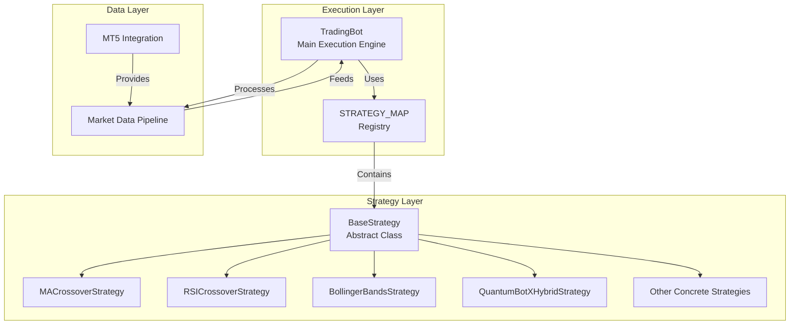
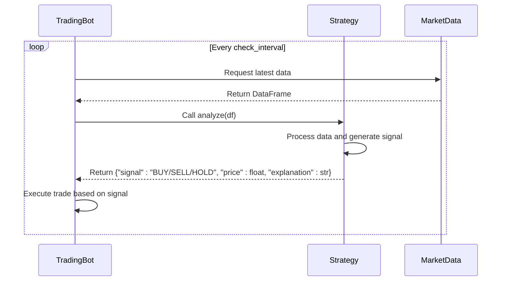
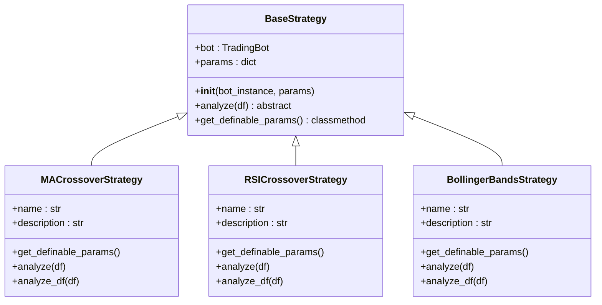

# Base Strategy Interface

<cite>
**Referenced Files in This Document**   
- [base_strategy.py](file://core/strategies/base_strategy.py#L1-L28)
- [trading_bot.py](file://core/bots/trading_bot.py#L13-L168)
- [strategy_map.py](file://core/strategies/strategy_map.py#L1-L27)
- [ma_crossover.py](file://core/strategies/ma_crossover.py#L1-L60)
- [rsi_crossover.py](file://core/strategies/rsi_crossover.py#L1-L84)
- [bollinger_reversion.py](file://core/strategies/bollinger_reversion.py#L1-L75)
- [quantumbotx_hybrid.py](file://core/strategies/quantumbotx_hybrid.py#L1-L113)
</cite>

## Table of Contents
1. [Introduction](#introduction)
2. [Core Architecture](#core-architecture)
3. [BaseStrategy Class Structure](#basestrategy-class-structure)
4. [Required Methods and Lifecycle](#required-methods-and-lifecycle)
5. [Strategy Integration with TradingBot](#strategy-integration-with-tradingbot)
6. [Concrete Strategy Implementations](#concrete-strategy-implementations)
7. [Parameter Management and Configuration](#parameter-management-and-configuration)
8. [Best Practices for Implementation](#best-practices-for-implementation)
9. [Common Errors and Debugging](#common-errors-and-debugging)
10. [Performance and Optimization](#performance-and-optimization)

## Introduction
The `BaseStrategy` abstract class serves as the foundational interface for all trading strategies within the quantumbotx system. It defines a standardized contract that ensures consistency across diverse algorithmic trading strategies while enabling flexibility in implementation. This document provides a comprehensive analysis of the `BaseStrategy` class, its role in the architecture, integration with the trading engine, and best practices for extending it. The design follows object-oriented principles using Python's Abstract Base Class (ABC) pattern to enforce method implementation in derived classes.

## Core Architecture
The quantumbotx system is structured around a modular strategy pattern where all trading logic is encapsulated within strategy classes that inherit from `BaseStrategy`. This abstraction allows the core trading engine (`TradingBot`) to remain agnostic of specific trading logic while supporting dynamic strategy loading and execution.



**Diagram sources**
- [base_strategy.py](file://core/strategies/base_strategy.py#L1-L28)
- [trading_bot.py](file://core/bots/trading_bot.py#L13-L168)
- [strategy_map.py](file://core/strategies/strategy_map.py#L1-L27)

**Section sources**
- [base_strategy.py](file://core/strategies/base_strategy.py#L1-L28)
- [trading_bot.py](file://core/bots/trading_bot.py#L13-L168)

## BaseStrategy Class Structure
The `BaseStrategy` class is implemented as an abstract base class using Python's `abc` module. It provides a common interface and shared functionality for all trading strategies while enforcing the implementation of core analytical methods.

```python
from abc import ABC, abstractmethod

class BaseStrategy(ABC):
    """
    Abstract base class for all trading strategies.
    Each strategy must inherit from this class and implement the `analyze` method.
    """
    def __init__(self, bot_instance, params: dict = {}):
        self.bot = bot_instance
        self.params = params

    @abstractmethod
    def analyze(self, df):
        """
        Core method that must be overridden by each derived strategy.
        This method must return a dictionary containing the analysis results.
        Accepts a DataFrame as input.
        """
        raise NotImplementedError("Each strategy must implement the `analyze(df)` method.")

    @classmethod
    def get_definable_params(cls):
        """
        Class method that returns a list of parameters that can be set by the user.
        Each derived strategy should override this if it has parameters.
        """
        return []
```

**Section sources**
- [base_strategy.py](file://core/strategies/base_strategy.py#L1-L28)

## Required Methods and Lifecycle
The `BaseStrategy` class defines a clear lifecycle and method contract that all concrete strategies must follow. This section details the required methods and their execution flow.

### Initialization (`__init__`)
The constructor initializes the strategy with a reference to the parent `TradingBot` instance and a dictionary of parameters. This enables strategies to access bot functionality and maintain state.

**Key Parameters:**
- `bot_instance`: Reference to the parent TradingBot
- `params`: Dictionary of strategy-specific configuration parameters

### Core Analysis Method (`analyze`)
The `analyze` method is the primary interface for signal generation. It is called repeatedly by the `TradingBot` during live trading to process the latest market data.



**Diagram sources**
- [trading_bot.py](file://core/bots/trading_bot.py#L13-L168)
- [base_strategy.py](file://core/strategies/base_strategy.py#L1-L28)

### Parameter Definition (`get_definable_params`)
This class method returns metadata about configurable parameters, enabling dynamic UI generation and parameter validation.

**Return Structure:**
```json
[
    {
        "name": "parameter_name",
        "label": "User-friendly label",
        "type": "number",
        "default": 20,
        "step": 0.1
    }
]
```

**Section sources**
- [base_strategy.py](file://core/strategies/base_strategy.py#L1-L28)
- [ma_crossover.py](file://core/strategies/ma_crossover.py#L1-L60)

## Strategy Integration with TradingBot
The `TradingBot` class integrates with strategies through a well-defined execution pipeline that handles initialization, data flow, and signal processing.

```mermaid
flowchart TD
A["Start TradingBot"] --> B{Validate Symbol}
B --> |Invalid| C[Set Status: Error]
B --> |Valid| D[Initialize Strategy Instance]
D --> E{Strategy Found?}
E --> |No| F[Set Status: Error]
E --> |Yes| G[Enter Main Loop]
G --> H[Fetch Market Data]
H --> I{Data Available?}
I --> |No| J[Wait and Retry]
I --> |Yes| K[Call strategy.analyze(df)]
K --> L{Signal Generated?}
L --> M[Update Last Analysis]
M --> N[Handle Trade Signal]
N --> O[Wait check_interval]
O --> G
```

**Diagram sources**
- [trading_bot.py](file://core/bots/trading_bot.py#L13-L168)

**Section sources**
- [trading_bot.py](file://core/bots/trading_bot.py#L13-L168)

## Concrete Strategy Implementations
Multiple concrete strategies inherit from `BaseStrategy`, demonstrating different trading methodologies while adhering to the same interface.

### MA Crossover Strategy
A trend-following strategy that generates signals based on moving average crossovers.

```python
class MACrossoverStrategy(BaseStrategy):
    name = 'Moving Average Crossover'
    
    @classmethod
    def get_definable_params(cls):
        return [
            {"name": "fast_period", "label": "Fast MA Period", "type": "number", "default": 20},
            {"name": "slow_period", "label": "Slow MA Period", "type": "number", "default": 50}
        ]

    def analyze(self, df):
        if len(df) < self.params.get('slow_period', 50) + 1:
            return {"signal": "HOLD", "explanation": "Insufficient data."}
            
        # Calculate moving averages
        df["ma_fast"] = ta.sma(df["close"], length=self.params.get('fast_period', 20))
        df["ma_slow"] = ta.sma(df["close"], length=self.params.get('slow_period', 50))
        df.dropna(inplace=True)
        
        # Generate signals based on crossovers
        if prev["ma_fast"] <= prev["ma_slow"] and last["ma_fast"] > last["ma_slow"]:
            return {"signal": "BUY", "price": price, "explanation": "Golden Cross"}
        elif prev["ma_fast"] >= prev["ma_slow"] and last["ma_fast"] < last["ma_slow"]:
            return {"signal": "SELL", "price": price, "explanation": "Death Cross"}
            
        return {"signal": "HOLD", "price": price, "explanation": "No crossover"}
```

### RSI Crossover Strategy
A momentum-based strategy that combines RSI with its moving average and trend filtering.

```python
class RSICrossoverStrategy(BaseStrategy):
    name = 'RSI Crossover'
    
    def analyze(self, df):
        # Calculate RSI and its moving average
        df['RSI'] = ta.rsi(df['close'], length=self.params.get('rsi_period', 14))
        df['RSI_MA'] = ta.sma(df['RSI'], length=self.params.get('rsi_ma_period', 10))
        df['SMA_Trend'] = ta.sma(df['close'], length=self.params.get('trend_filter_period', 50))
        
        # Generate signals with trend confirmation
        is_uptrend = last['close'] > last['SMA_Trend']
        rsi_bullish_cross = prev['RSI'] <= prev['RSI_MA'] and last['RSI'] > last['RSI_MA']
        
        if is_uptrend and rsi_bullish_cross:
            return {"signal": "BUY", "explanation": "Uptrend & RSI Bullish Crossover"}
```

**Section sources**
- [ma_crossover.py](file://core/strategies/ma_crossover.py#L1-L60)
- [rsi_crossover.py](file://core/strategies/rsi_crossover.py#L1-L84)
- [bollinger_reversion.py](file://core/strategies/bollinger_reversion.py#L1-L75)

## Parameter Management and Configuration
The strategy system supports dynamic parameter configuration through the `get_definable_params` method and strategy map registration.



**Diagram sources**
- [base_strategy.py](file://core/strategies/base_strategy.py#L1-L28)
- [ma_crossover.py](file://core/strategies/ma_crossover.py#L1-L60)
- [rsi_crossover.py](file://core/strategies/rsi_crossover.py#L1-L84)

**Section sources**
- [strategy_map.py](file://core/strategies/strategy_map.py#L1-L27)
- [ma_crossover.py](file://core/strategies/ma_crossover.py#L1-L60)

## Best Practices for Implementation
When extending `BaseStrategy`, follow these best practices to ensure robust and maintainable code.

### State Management
- Avoid storing state in instance variables unless necessary
- Use the `params` dictionary for configuration
- Keep the strategy stateless when possible

### Exception Handling
- Wrap critical calculations in try-except blocks
- Return appropriate "HOLD" signals on error
- Log errors for debugging

```python
def analyze(self, df):
    try:
        # Strategy logic here
        if len(df) < required_length:
            return {"signal": "HOLD", "explanation": "Insufficient data"}
            
        # Normal analysis
        return {"signal": signal, "price": price, "explanation": explanation}
        
    except Exception as e:
        logger.warning(f"Strategy {self.__class__.__name__} error: {e}")
        return {"signal": "HOLD", "explanation": f"Analysis error: {str(e)}"}
```

### Performance Optimization
- Minimize redundant calculations
- Use vectorized operations with pandas
- Cache expensive computations when appropriate

**Section sources**
- [quantumbotx_hybrid.py](file://core/strategies/quantumbotx_hybrid.py#L1-L113)
- [ma_crossover.py](file://core/strategies/ma_crossover.py#L1-L60)

## Common Errors and Debugging
Understanding common implementation errors helps prevent issues in strategy development.

### Common Implementation Errors
1. **Forgetting to override `analyze`**: Results in `NotImplementedError`
2. **Insufficient data handling**: Not checking DataFrame length before analysis
3. **Parameter validation**: Not validating parameter values before use
4. **NaN handling**: Not properly handling NaN values in calculations

### Debugging Techniques
- Use `last_analysis` field in `TradingBot` to inspect signal output
- Check logs for strategy execution errors
- Validate parameter values in `get_definable_params`
- Test with historical data using `analyze_df` method

```python
# Debugging example
def analyze(self, df):
    logger.debug(f"Strategy {self.__class__.__name__} received {len(df)} bars")
    logger.debug(f"Parameters: {self.params}")
    
    # Rest of analysis
```

**Section sources**
- [trading_bot.py](file://core/bots/trading_bot.py#L13-L168)
- [base_strategy.py](file://core/strategies/base_strategy.py#L1-L28)

## Performance and Optimization
Optimizing strategy performance is critical for real-time trading applications.

### Key Performance Considerations
- **Data Processing Efficiency**: Minimize DataFrame operations
- **Indicator Calculation**: Use optimized libraries like `pandas_ta`
- **Memory Usage**: Avoid unnecessary data copying
- **Execution Speed**: Keep analysis under check_interval threshold

### Optimization Strategies
1. **Vectorization**: Use pandas vectorized operations instead of loops
2. **Caching**: Cache indicator calculations when possible
3. **Selective Calculation**: Only calculate needed indicators
4. **Data Sampling**: Process only required data points

The `analyze_df` method in concrete strategies demonstrates backtesting optimization by processing entire DataFrames efficiently for historical analysis.

**Section sources**
- [ma_crossover.py](file://core/strategies/ma_crossover.py#L1-L60)
- [rsi_crossover.py](file://core/strategies/rsi_crossover.py#L1-L84)
- [quantumbotx_hybrid.py](file://core/strategies/quantumbotx_hybrid.py#L1-L113)