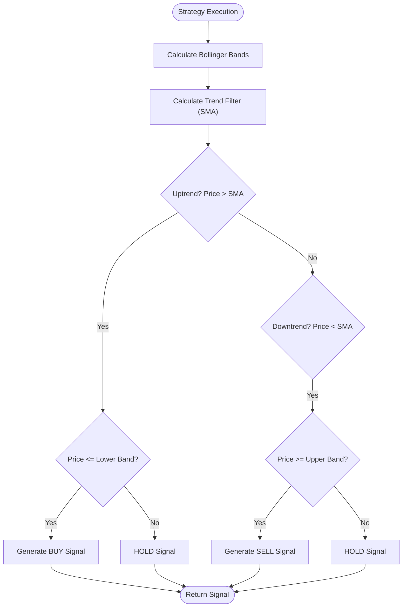
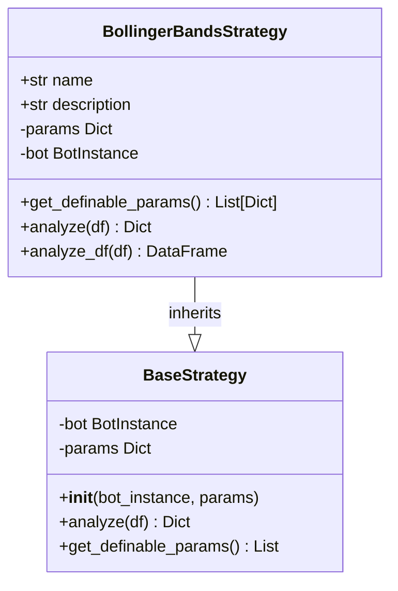
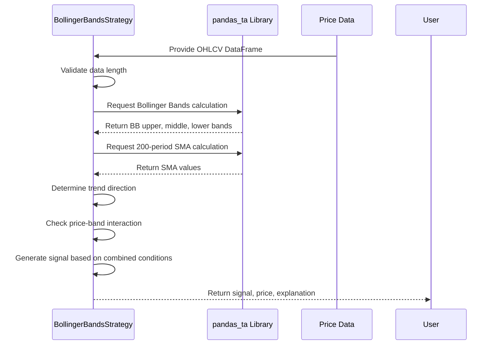

# Bollinger Reversion Strategy

<cite>
**Referenced Files in This Document**   
- [bollinger_reversion.py](file://core/strategies/bollinger_reversion.py#L1-L75)
- [base_strategy.py](file://core/strategies/base_strategy.py#L1-L28)
</cite>

## Table of Contents
1. [Introduction](#introduction)
2. [Core Strategy Logic](#core-strategy-logic)
3. [Parameter Configuration](#parameter-configuration)
4. [Signal Generation Mechanism](#signal-generation-mechanism)
5. [Trend Filter Integration](#trend-filter-integration)
6. [Backtesting Implementation](#backtesting-implementation)
7. [Live Trading Analysis](#live-trading-analysis)
8. [Risk Management Considerations](#risk-management-considerations)
9. [Performance Characteristics](#performance-characteristics)
10. [False Signal Mitigation](#false-signal-mitigation)
11. [Strategy Limitations](#strategy-limitations)

## Introduction
The Bollinger Reversion Strategy is a mean-reversion trading system implemented within the quantumbotx framework. It leverages Bollinger Bands to identify potential price reversals when market prices extend beyond statistically significant levels. The strategy incorporates a long-term trend filter to improve signal quality and reduce whipsaw trades in strongly trending markets. This document provides a comprehensive analysis of the strategy's implementation, logic, parameters, and operational characteristics.

**Section sources**
- [bollinger_reversion.py](file://core/strategies/bollinger_reversion.py#L1-L10)

## Core Strategy Logic
The Bollinger Reversion Strategy operates on the principle of statistical mean reversion, assuming that prices tend to return to their moving average after extreme deviations. The strategy uses Bollinger Bands, which consist of a middle band (simple moving average) and upper/lower bands (standard deviations away from the mean). When price touches or crosses these bands, it may indicate overbought or oversold conditions.

The implementation extends the `BaseStrategy` abstract class, inheriting core functionality while providing specific trading logic in the `analyze` and `analyze_df` methods. The strategy is designed to work in both live trading and backtesting environments, with separate methods optimized for each use case.

**Diagram sources**
- [bollinger_reversion.py](file://core/strategies/bollinger_reversion.py#L25-L75)

**Section sources**
- [bollinger_reversion.py](file://core/strategies/bollinger_reversion.py#L1-L75)
- [base_strategy.py](file://core/strategies/base_strategy.py#L1-L28)

## Parameter Configuration
The strategy exposes configurable parameters through the `get_definable_params` class method, allowing users to customize its behavior without modifying the source code. These parameters are essential for adapting the strategy to different market conditions and instruments.

:bb_length: (Default: 20) - The period length for calculating the Bollinger Bands and the underlying simple moving average. A longer period creates smoother bands with fewer signals, while a shorter period increases sensitivity to price movements.

:bb_std: (Default: 2.0) - The number of standard deviations used to calculate the upper and lower bands. Higher values create wider bands, requiring more extreme price movements to generate signals, thus reducing signal frequency but potentially increasing signal reliability.

:trend_filter_period: (Default: 200) - The period for the long-term simple moving average used as a trend filter. This parameter determines the market bias for signal generation, helping to align trades with the dominant trend direction.

**Diagram sources**
- [bollinger_reversion.py](file://core/strategies/bollinger_reversion.py#L11-L23)
- [base_strategy.py](file://core/strategies/base_strategy.py#L5-L28)

**Section sources**
- [bollinger_reversion.py](file://core/strategies/bollinger_reversion.py#L11-L23)

## Signal Generation Mechanism
The strategy generates trading signals based on price interactions with Bollinger Bands, combined with trend confirmation. The signal logic follows a contrarian approach, seeking to enter positions when price extremes suggest potential reversal opportunities.

For BUY signals, the strategy requires two conditions to be met simultaneously: an uptrend confirmation (price above the 200-period SMA) and an oversold condition (low price touching or crossing below the lower Bollinger Band). This combination suggests a healthy uptrend that has experienced a temporary pullback, presenting a potential buying opportunity.

For SELL signals, the strategy requires a downtrend confirmation (price below the 200-period SMA) and an overbought condition (high price touching or crossing above the upper Bollinger Band). This indicates a strong downtrend with a temporary rally, potentially offering a selling opportunity.

The HOLD signal is generated when neither condition is met, indicating that price is trading within the bands without sufficient trend alignment to justify a contrarian position.

**Section sources**
- [bollinger_reversion.py](file://core/strategies/bollinger_reversion.py#L45-L70)

## Trend Filter Integration
The strategy incorporates a 200-period simple moving average as a trend filter to improve signal quality and reduce false entries. This long-term filter serves as a market bias indicator, ensuring that reversion trades align with the dominant trend direction.

The trend filter addresses a common weakness of pure mean-reversion strategies: trading against strong trends. By requiring price to be above the 200-period SMA for buy signals and below it for sell signals, the strategy avoids counter-trend trades in strongly directional markets. This approach follows the principle of "trading with the trend" even within a mean-reversion framework.

The implementation checks if sufficient data exists for the trend filter calculation, returning a HOLD signal when the dataset is too short. This prevents premature signal generation based on incomplete indicator calculations.

**Diagram sources**
- [bollinger_reversion.py](file://core/strategies/bollinger_reversion.py#L35-L75)

**Section sources**
- [bollinger_reversion.py](file://core/strategies/bollinger_reversion.py#L35-L75)

## Backtesting Implementation
The `analyze_df` method is specifically designed for backtesting scenarios, processing an entire DataFrame to generate signals for all historical periods simultaneously. This vectorized approach enables efficient historical analysis and performance evaluation.

Unlike the live trading method, the backtesting implementation does not include data sufficiency checks, assuming that the input DataFrame contains adequate historical data. The method calculates Bollinger Bands and the trend filter SMA, then applies boolean logic to identify buy and sell conditions across the entire dataset.

The vectorized approach uses pandas' efficient array operations to create boolean masks for buy and sell signals, which are then combined using `np.where` to populate the signal column. This implementation provides consistent results with the live trading logic while optimizing for batch processing performance.

**Section sources**
- [bollinger_reversion.py](file://core/strategies/bollinger_reversion.py#L72-L75)

## Live Trading Analysis
The `analyze` method is optimized for live trading applications, processing the most recent data point to generate a single trading decision. This method includes comprehensive error handling and data validation to ensure robust operation in real-time environments.

Key features of the live trading implementation include:
- Data sufficiency validation to prevent signals based on incomplete indicators
- NA value handling to avoid errors from missing calculations
- Detailed explanation generation to provide transparency into signal rationale
- Single-point analysis to minimize computational overhead in real-time systems

The method returns a dictionary containing the signal type, current price, and a human-readable explanation, facilitating integration with trading execution systems and user interfaces.

**Section sources**
- [bollinger_reversion.py](file://core/strategies/bollinger_reversion.py#L25-L71)

## Risk Management Considerations
While the strategy incorporates a trend filter to improve signal quality, users should be aware of inherent risks when trading mean-reversion strategies in strong trending markets. The 200-period SMA filter helps mitigate but does not eliminate the risk of catching falling knives in extended trends.

The strategy performs best in range-bound or moderately trending markets where price oscillates around a central tendency. In strongly trending markets, prices can remain at band extremes for extended periods, leading to multiple consecutive losses if the trend continues.

Recommended risk management practices include:
- Position sizing adjustments based on volatility (bandwidth)
- Stop-loss placement beyond recent swing points
- Profit targets aligned with the opposite band or moving average
- Strategy deactivation during high-impact news events
- Regular parameter re-optimization to adapt to changing market regimes

**Section sources**
- [bollinger_reversion.py](file://core/strategies/bollinger_reversion.py#L1-L75)

## Performance Characteristics
The Bollinger Reversion Strategy typically exhibits performance characteristics associated with mean-reversion approaches:

- Higher win rate in range-bound markets with clear support and resistance levels
- Potential for extended drawdowns during strong trending periods
- Optimal performance on timeframes of 1-hour and above, where noise is reduced
- Effectiveness varies by instrument, with mean-reverting assets (e.g., forex pairs, indices) generally performing better than strongly trending assets (e.g., individual stocks in bull markets)

The strategy's performance is sensitive to parameter selection, with the `bb_std` parameter having a significant impact on signal frequency and reliability. Backtesting results typically show improved risk-adjusted returns when combined with the trend filter compared to a pure mean-reversion approach.

**Section sources**
- [bollinger_reversion.py](file://core/strategies/bollinger_reversion.py#L1-L75)

## False Signal Mitigation
The strategy employs several techniques to reduce false signals:

1. **Trend Filter**: The 200-period SMA requirement ensures trades align with the dominant trend direction, filtering out counter-trend signals that often fail.

2. **Price Extremes**: Requiring price to touch or cross the bands ensures signals are generated only at statistically significant levels, avoiding premature entries.

3. **Data Validation**: The live trading method validates data sufficiency and handles missing values, preventing signals based on incomplete calculations.

4. **Candle Confirmation**: Using the high/low of the current candle for signal generation provides stronger confirmation than using only the closing price.

Additional false signal mitigation techniques that could be implemented include:
- Volume confirmation for breakout/band touch events
- Divergence detection between price and momentum indicators
- Multiple timeframe confirmation
- Volatility-based band adjustment

**Section sources**
- [bollinger_reversion.py](file://core/strategies/bollinger_reversion.py#L1-L75)

## Strategy Limitations
The Bollinger Reversion Strategy has several limitations that users should consider:

- **Lagging Indicators**: Both Bollinger Bands and SMA are based on historical prices, making them inherently lagging indicators that may miss turning points.

- **Parameter Sensitivity**: Performance is highly dependent on parameter selection, requiring regular optimization for different market conditions.

- **Trend Following Weakness**: The strategy is not designed to capture strong trending moves and may underperform in momentum-driven markets.

- **Whipsaw Risk**: In choppy markets, price may repeatedly touch both bands, generating multiple losing trades.

- **No Position Sizing**: The implementation focuses on signal generation without integrated position sizing or risk management logic.

Understanding these limitations is crucial for proper strategy deployment and risk management in live trading environments.

**Section sources**
- [bollinger_reversion.py](file://core/strategies/bollinger_reversion.py#L1-L75)