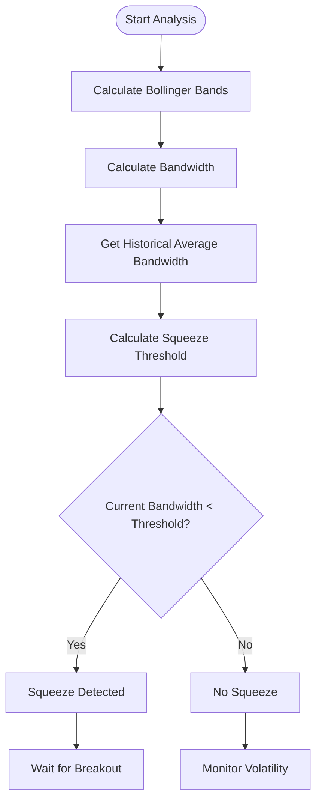
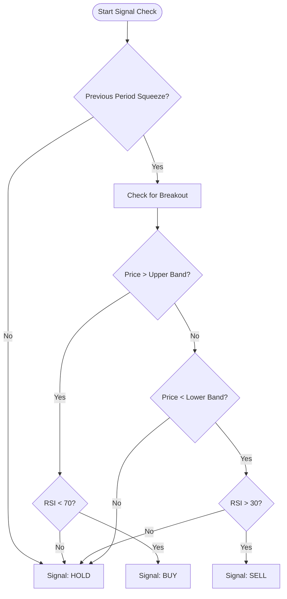
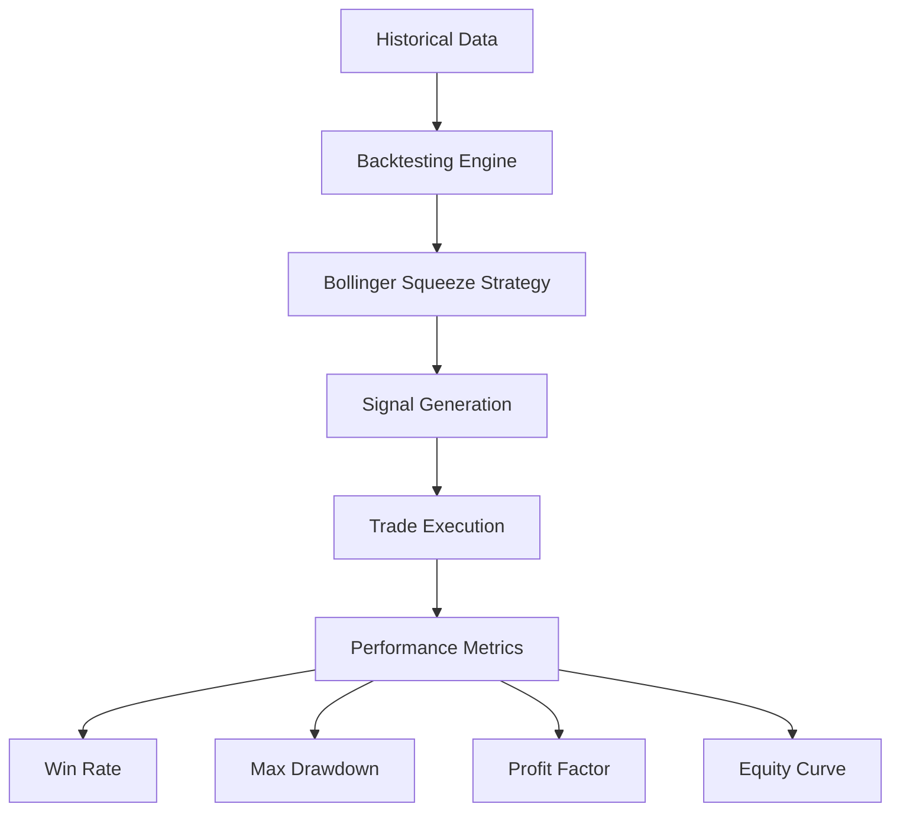

# Bollinger Squeeze Strategy

<cite>
**Referenced Files in This Document**   
- [bollinger_squeeze.py](file://core/strategies/bollinger_squeeze.py)
- [bollinger_squeeze_test.py](file://core/strategies/bollinger_squeeze_test.py)
- [engine.py](file://core/backtesting/engine.py)
</cite>

## Table of Contents
1. [Introduction](#introduction)
2. [Volatility Contraction Detection](#volatility-contraction-detection)
3. [Strategy Parameters](#strategy-parameters)
4. [Signal Generation Logic](#signal-generation-logic)
5. [Volume Integration for Breakout Confirmation](#volume-integration-for-breakout-confirmation)
6. [Testing Methodology and Statistical Validation](#testing-methodology-and-statistical-validation)
7. [Performance and Timing Considerations](#performance-and-timing-considerations)

## Introduction
The Bollinger Squeeze strategy is a volatility-based trading approach designed to identify periods of low market volatility (squeeze) that often precede significant price breakouts. This strategy leverages Bollinger Bands to measure volatility contraction and expansion, generating trading signals when price breaks out of the bands following a confirmed squeeze. The implementation in quantumbotx combines Bollinger Band width analysis with RSI filtering and optional volume confirmation to improve signal reliability.

**Section sources**
- [bollinger_squeeze.py](file://core/strategies/bollinger_squeeze.py#L1-L10)

## Volatility Contraction Detection
The Bollinger Squeeze strategy detects volatility contraction by analyzing the width of Bollinger Bands relative to historical levels. The bandwidth is calculated as the percentage difference between the upper and lower bands relative to the middle band (SMA). A squeeze is identified when the current bandwidth falls below a threshold derived from the average bandwidth over a specified window.

The detection mechanism works as follows:
- Calculate Bollinger Bands using the specified period and standard deviation
- Compute bandwidth as: (Upper Band - Lower Band) / Middle Band * 100
- Calculate average bandwidth over the squeeze window period
- Set squeeze threshold as average bandwidth multiplied by the squeeze factor
- Identify squeeze when current bandwidth is below the threshold

This approach effectively captures periods of low volatility where price is consolidating, creating the potential for explosive breakouts.

**Diagram sources**
- [bollinger_squeeze.py](file://core/strategies/bollinger_squeeze.py#L30-L40)
- [bollinger_squeeze_test.py](file://core/strategies/bollinger_squeeze_test.py#L41-L50)

**Section sources**
- [bollinger_squeeze.py](file://core/strategies/bollinger_squeeze.py#L30-L45)
- [bollinger_squeeze_test.py](file://core/strategies/bollinger_squeeze_test.py#L41-L55)

## Strategy Parameters
The Bollinger Squeeze strategy is configurable through several key parameters that control its behavior and sensitivity:

**:bb_length**
- **Description**: Length of the Bollinger Bands period (number of candles)
- **Default**: 20
- **Type**: Number
- Controls the lookback period for the moving average and standard deviation calculation

**:bb_std**
- **Description**: Standard deviation multiplier for Bollinger Bands
- **Default**: 2.0
- **Type**: Number with 0.1 step
- Determines the width of the bands from the middle line

**:squeeze_window**
- **Description**: Window period for calculating average bandwidth
- **Default**: 10
- **Type**: Number
- Defines the historical period used to establish normal volatility levels

**:squeeze_factor**
- **Description**: Multiplier for determining squeeze threshold
- **Default**: 0.7
- **Type**: Number with 0.1 step
- Sets how much narrower than average the bandwidth must be to qualify as a squeeze (70% of average)

**:rsi_period**
- **Description**: Period for RSI calculation
- **Default**: 14
- **Type**: Number
- Used for filtering signals to avoid overbought/oversold conditions

These parameters allow traders to customize the strategy for different market conditions and instruments, balancing sensitivity and reliability.

**Section sources**
- [bollinger_squeeze.py](file://core/strategies/bollinger_squeeze.py#L10-L18)

## Signal Generation Logic
The Bollinger Squeeze strategy generates trading signals based on a two-step process: first detecting a squeeze condition, then confirming a breakout from the Bollinger Bands.

For live trading, the strategy uses the `analyze` method which:
1. Checks for sufficient data availability
2. Calculates Bollinger Bands and bandwidth metrics
3. Identifies squeeze conditions using historical bandwidth comparison
4. Generates BUY signals when price closes above the upper band during a squeeze with RSI below 70
5. Generates SELL signals when price closes below the lower band during a squeeze with RSI above 30

The backtesting implementation in `analyze_df` processes the entire dataset at once, creating a signal column for each time period. It uses shifted values to prevent lookahead bias, ensuring that signals are generated based on information available at the time.

The signal logic prioritizes breakout trades following confirmed squeeze periods, as these often represent the highest probability setups. The RSI filter helps prevent entries during extreme overbought or oversold conditions that might lead to false breakouts.

**Diagram sources**
- [bollinger_squeeze.py](file://core/strategies/bollinger_squeeze.py#L50-L60)
- [bollinger_squeeze.py](file://core/strategies/bollinger_squeeze.py#L75-L85)

**Section sources**
- [bollinger_squeeze.py](file://core/strategies/bollinger_squeeze.py#L50-L60)
- [bollinger_squeeze.py](file://core/strategies/bollinger_squeeze.py#L75-L85)

## Volume Integration for Breakout Confirmation
The Bollinger Squeeze strategy test implementation includes volume analysis to confirm breakout validity. When volume data is available, the strategy assesses whether breakouts are accompanied by increased trading volume, which helps distinguish genuine breakouts from false signals.

Volume surge detection works as follows:
- Calculate the 10-period average volume
- Compare current volume to the average
- Identify volume surge when current volume exceeds average by 50% or more

In the test implementation, volume confirmation is used in the post-squeeze momentum phase:
- BUY signals are strengthened when price is near the upper band with volume surge
- SELL signals are strengthened when price is near the lower band with volume surge

This volume integration helps filter out low-volume breakouts that are more likely to fail, improving the overall win rate of the strategy. The presence of volume confirmation increases confidence that institutional players are participating in the move, making the breakout more sustainable.

**Section sources**
- [bollinger_squeeze_test.py](file://core/strategies/bollinger_squeeze_test.py#L50-L55)

## Testing Methodology and Statistical Validation
The Bollinger Squeeze strategy is validated through a comprehensive testing methodology that includes both unit testing and backtesting frameworks.

The `bollinger_squeeze_test.py` file contains a standalone analysis function that demonstrates the complete signal generation process, including:
- Bollinger Band calculation
- Bandwidth and squeeze detection
- Volume analysis (when available)
- Multi-condition signal logic
- Error handling and fallback mechanisms

The backtesting engine in `engine.py` provides statistical validation through:
- Trade simulation with position sizing
- Profit/loss calculation
- Win rate analysis
- Maximum drawdown measurement
- Equity curve generation

Key validation metrics include:
- Total number of trades
- Final capital and total profit
- Win rate percentage
- Maximum drawdown percentage
- Trade-by-trade performance analysis

The testing approach also includes special handling for high-volatility instruments like XAUUSD, with conservative position sizing and risk management parameters to prevent catastrophic losses during extreme market conditions.

**Diagram sources**
- [engine.py](file://core/backtesting/engine.py#L1-L317)
- [bollinger_squeeze_test.py](file://core/strategies/bollinger_squeeze_test.py#L1-L168)

**Section sources**
- [engine.py](file://core/backtesting/engine.py#L1-L317)
- [bollinger_squeeze_test.py](file://core/strategies/bollinger_squeeze_test.py#L1-L168)

## Performance and Timing Considerations
The Bollinger Squeeze strategy faces several performance and timing challenges that affect its effectiveness in capturing early momentum:

**Timing Challenges:**
- Lag in squeeze detection due to reliance on historical averages
- Delay in signal generation until price closes beyond bands
- Potential to miss the initial momentum of strong breakouts

**Optimization Approaches:**
- Using multiple timeframe analysis to detect squeezes earlier
- Incorporating volume confirmation to increase confidence in breakout validity
- Adjusting squeeze factor based on market regime

**Risk Management:**
- Conservative position sizing, especially for volatile instruments
- Dynamic risk percentage based on account size and volatility
- Stop-loss placement using ATR-based multiples

The strategy implementation includes several safeguards to address these challenges:
- Gold-specific risk limits to prevent excessive exposure
- ATR-based position sizing that adapts to current volatility
- Emergency brake mechanisms when estimated risk exceeds thresholds

These considerations ensure that while the strategy may not capture the very beginning of a breakout, it maintains a favorable risk-reward profile by focusing on higher-probability setups with proper risk management.

**Section sources**
- [engine.py](file://core/backtesting/engine.py#L100-L200)
- [bollinger_squeeze.py](file://core/strategies/bollinger_squeeze.py#L50-L60)