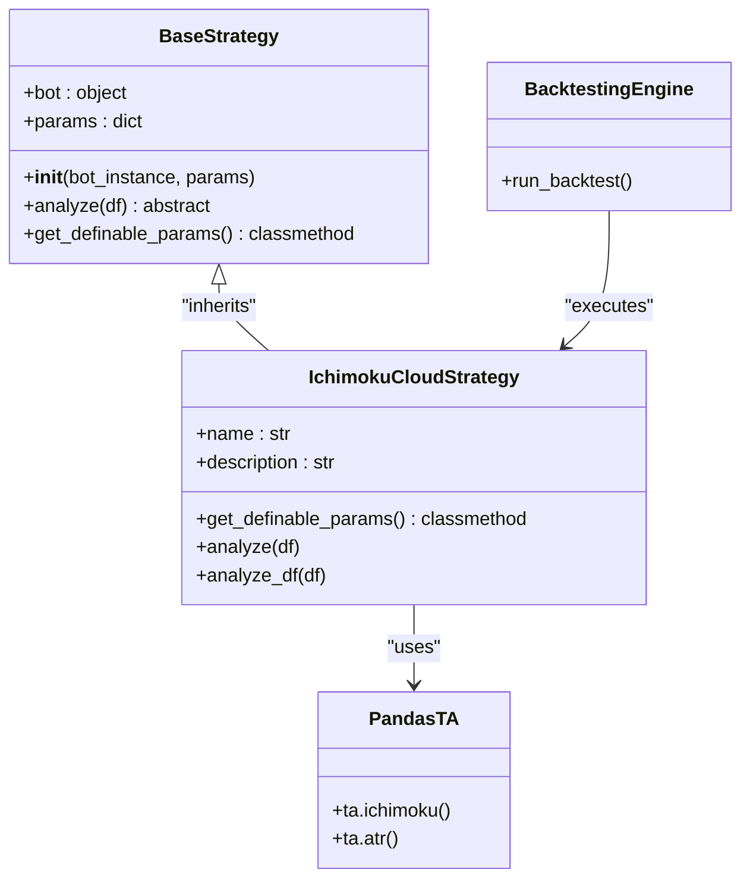
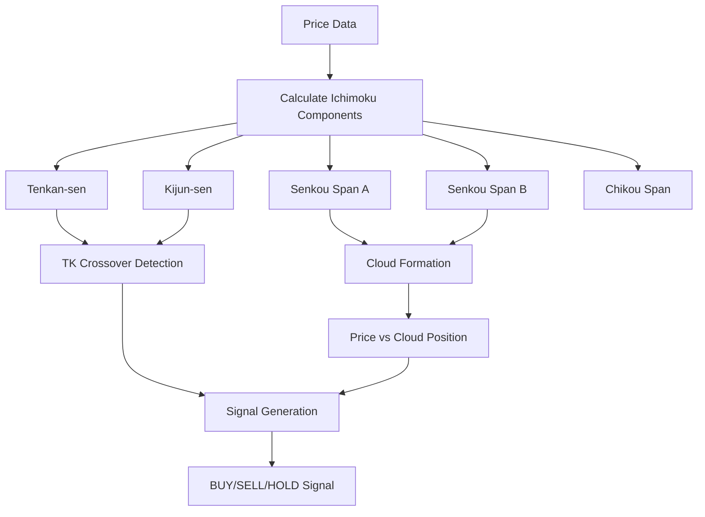
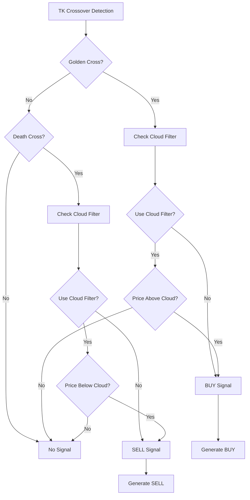
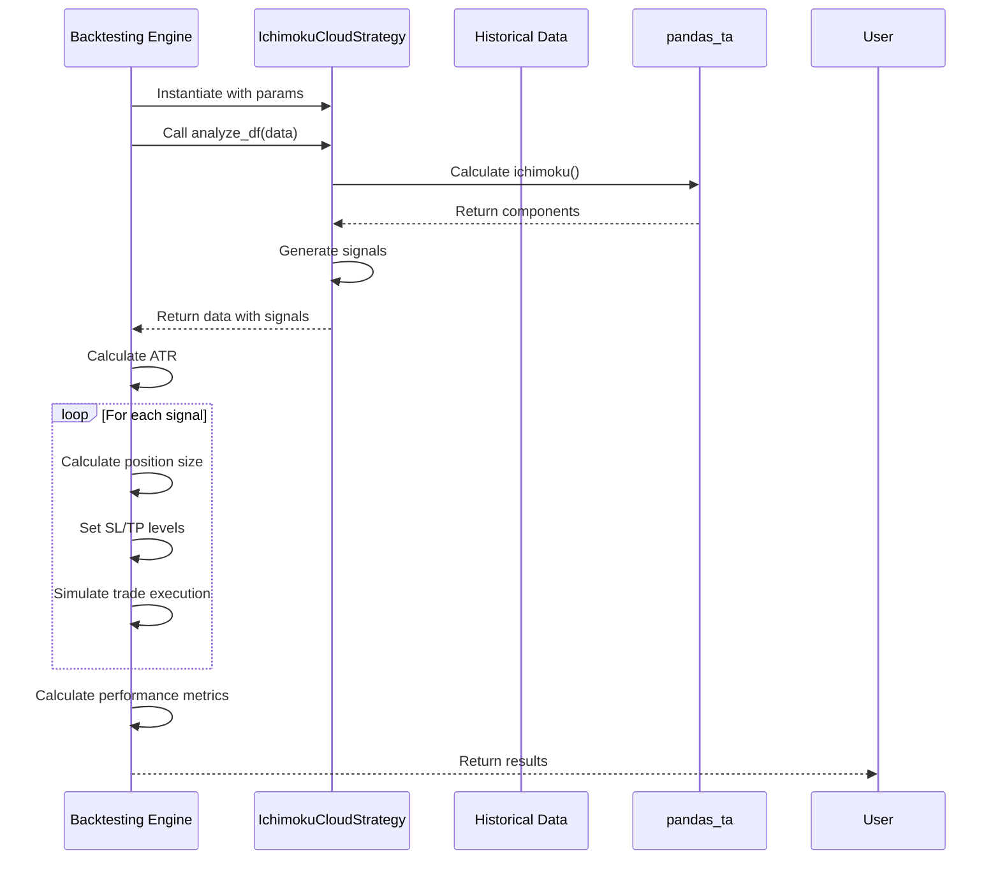

# Ichimoku Cloud Strategy

<cite>
**Referenced Files in This Document**   
- [ichimoku_cloud.py](file://core/strategies/ichimoku_cloud.py)
- [base_strategy.py](file://core/strategies/base_strategy.py)
- [ichimoku.py](file://venv/Lib/site-packages/pandas_ta/overlap/ichimoku.py)
- [midprice.py](file://venv/Lib/site-packages/pandas_ta/overlap/midprice.py)
- [engine.py](file://core/backtesting/engine.py)
- [strategy_map.py](file://core/strategies/strategy_map.py)
</cite>

## Table of Contents
1. [Introduction](#introduction)
2. [Core Components](#core-components)
3. [Ichimoku Cloud System Overview](#ichimoku-cloud-system-overview)
4. [Component Calculations and Parameters](#component-calculations-and-parameters)
5. [Signal Generation Logic](#signal-generation-logic)
6. [Backtesting Integration](#backtesting-integration)
7. [Strategy Configuration and Parameters](#strategy-configuration-and-parameters)
8. [Implementation Complexity and Performance](#implementation-complexity-and-performance)
9. [Conclusion](#conclusion)

## Introduction
The Ichimoku Cloud Strategy is a comprehensive trading system implemented within the quantumbotx platform for identifying trends and momentum signals. This strategy leverages the five-component Ichimoku Kinkō Hyō indicator to provide a holistic view of market conditions, combining trend identification, support/resistance levels, and momentum signals into a single analytical framework. The implementation utilizes the pandas_ta library for indicator calculations and integrates with the platform's backtesting engine for performance evaluation. This document provides a detailed analysis of the strategy's architecture, component functionality, signal generation logic, and integration within the broader trading system.

**Section sources**
- [ichimoku_cloud.py](file://core/strategies/ichimoku_cloud.py#L1-L10)

## Core Components

The Ichimoku Cloud Strategy is implemented as a class that inherits from the BaseStrategy abstract class, following the platform's strategy pattern. The core functionality is divided into two primary methods: `analyze` for live trading and `analyze_df` for backtesting. The strategy relies on external calculations from the pandas_ta library to compute the Ichimoku components, then applies custom logic to generate trading signals based on component interactions.



**Diagram sources**
- [ichimoku_cloud.py](file://core/strategies/ichimoku_cloud.py#L1-L125)
- [base_strategy.py](file://core/strategies/base_strategy.py#L1-L29)

**Section sources**
- [ichimoku_cloud.py](file://core/strategies/ichimoku_cloud.py#L1-L125)
- [base_strategy.py](file://core/strategies/base_strategy.py#L1-L29)

## Ichimoku Cloud System Overview

The Ichimoku Cloud strategy implements a five-component technical analysis system designed to provide a comprehensive view of market conditions. The system consists of Tenkan-sen (Conversion Line), Kijun-sen (Base Line), Senkou Span A (Leading Span A), Senkou Span B (Leading Span B), and Chikou Span (Lagging Span). These components work together to identify trend direction, momentum, and potential support/resistance levels. The cloud (Kumo) formed by Senkou Span A and B serves as a dynamic support/resistance zone, with price position relative to the cloud indicating bullish or bearish bias.

The strategy implementation follows the standard Ichimoku methodology with specific parameterization for the quantumbotx platform. The cloud is projected forward by 26 periods, creating a predictive element that allows traders to anticipate future support and resistance levels. The time-shifted nature of the Senkou spans provides a unique forward-looking perspective that distinguishes Ichimoku from other technical indicators.



**Diagram sources**
- [ichimoku_cloud.py](file://core/strategies/ichimoku_cloud.py#L29-L124)
- [ichimoku.py](file://venv/Lib/site-packages/pandas_ta/overlap/ichimoku.py#L1-L141)

## Component Calculations and Parameters

The Ichimoku Cloud components are calculated using specific formulas with configurable periods. Each component serves a distinct purpose in the overall analysis framework:

**Tenkan-sen (Conversion Line)**: Calculated as the midpoint of the highest high and lowest low over a specified period (default: 9). This component represents short-term momentum and acts as a trigger line for potential trend changes.

**Kijun-sen (Base Line)**: Calculated as the midpoint of the highest high and lowest low over a longer period (default: 26). This component represents medium-term momentum and serves as a confirmation line for trend direction.

**Senkou Span A (Leading Span A)**: Calculated as the midpoint of Tenkan-sen and Kijun-sen, then projected forward by 26 periods. This line forms one boundary of the cloud (Kumo).

**Senkou Span B (Leading Span B)**: Calculated as the midpoint of the highest high and lowest low over an even longer period (default: 52), then projected forward by 26 periods. This line forms the other boundary of the cloud.

**Chikou Span (Lagging Span)**: The current closing price plotted 26 periods into the past, used to confirm trend strength by comparing it to historical price action.

```mermaid
flowchart TD
A[High, Low, Close Data] --> B[Midprice Calculation]
B --> C[Tenkan-sen: 9-period]
B --> D[Kijun-sen: 26-period]
B --> E[Senkou Span B: 52-period]
C --> F[Senkou Span A: (Tenkan + Kijun)/2]
F --> G[Shift Forward 26 Periods]
E --> H[Shift Forward 26 Periods]
G --> I[Cloud Top/Bot]
H --> I
I --> J[Ichimoku Cloud]
```

**Diagram sources**
- [ichimoku.py](file://venv/Lib/site-packages/pandas_ta/overlap/ichimoku.py#L1-L141)
- [midprice.py](file://venv/Lib/site-packages/pandas_ta/overlap/midprice.py#L1-L43)

**Section sources**
- [ichimoku.py](file://venv/Lib/site-packages/pandas_ta/overlap/ichimoku.py#L1-L141)
- [midprice.py](file://venv/Lib/site-packages/pandas_ta/overlap/midprice.py#L1-L43)

## Signal Generation Logic

The Ichimoku Cloud strategy generates trading signals through a combination of component interactions, primarily focusing on TK crossovers and price position relative to the cloud. The signal generation logic is implemented in both `analyze` (for live trading) and `analyze_df` (for backtesting) methods, with identical logic to ensure consistency between simulation and execution.

The primary signal trigger is the Tenkan-Kijun crossover:
- **Golden Cross**: When Tenkan-sen crosses above Kijun-sen, generating a potential buy signal
- **Death Cross**: When Tenkan-sen crosses below Kijun-sen, generating a potential sell signal

These signals are filtered by the price position relative to the cloud (Kumo):
- **Bullish Configuration**: Price above the cloud, indicating strong uptrend conditions
- **Bearish Configuration**: Price below the cloud, indicating strong downtrend conditions
- **Neutral/Transition**: Price within the cloud, indicating potential consolidation or trend change

The strategy includes a configurable parameter (`use_cloud_filter`) that determines whether the cloud position acts as a mandatory filter for signals. When enabled, a buy signal requires both a Golden Cross and price above the cloud, while a sell signal requires both a Death Cross and price below the cloud. When disabled, the TK crossover alone generates the signal.



**Diagram sources**
- [ichimoku_cloud.py](file://core/strategies/ichimoku_cloud.py#L58-L88)
- [ichimoku_cloud.py](file://core/strategies/ichimoku_cloud.py#L100-L124)

**Section sources**
- [ichimoku_cloud.py](file://core/strategies/ichimoku_cloud.py#L58-L124)

## Backtesting Integration

The Ichimoku Cloud strategy is integrated into the quantumbotx backtesting engine through the strategy map registration system. The backtesting process follows a structured workflow that includes data preparation, indicator calculation, signal generation, and trade simulation with position sizing and risk management.

The backtesting engine retrieves the strategy through the STRATEGY_MAP dictionary, instantiates it with appropriate parameters, and executes the `analyze_df` method to generate signals across the historical dataset. The engine then simulates trades based on these signals, incorporating dynamic position sizing, stop-loss, and take-profit levels based on ATR (Average True Range) calculations.

For high-volatility instruments like XAUUSD (gold), the system implements enhanced risk management with conservative position sizing, reduced ATR multipliers, and additional volatility-based lot size adjustments. This ensures that the strategy performs safely across different market conditions and asset classes.



**Diagram sources**
- [engine.py](file://core/backtesting/engine.py#L1-L318)
- [ichimoku_cloud.py](file://core/strategies/ichimoku_cloud.py#L89-L124)
- [strategy_map.py](file://core/strategies/strategy_map.py#L1-L28)

**Section sources**
- [engine.py](file://core/backtesting/engine.py#L1-L318)
- [ichimoku_cloud.py](file://core/strategies/ichimoku_cloud.py#L89-L124)

## Strategy Configuration and Parameters

The Ichimoku Cloud strategy exposes several configurable parameters that allow users to customize its behavior according to their trading preferences and market conditions:

**tenkan_period**: The period used for calculating the Tenkan-sen (Conversion Line), with a default value of 9. This parameter controls the sensitivity of the short-term momentum component.

**kijun_period**: The period used for calculating the Kijun-sen (Base Line), with a default value of 26. This parameter controls the medium-term trend confirmation component.

**senkou_period**: The period used for calculating the Senkou Span B (Leading Span B), with a default value of 52. This parameter affects the longer-term support/resistance levels in the cloud.

**use_cloud_filter**: A boolean parameter that determines whether price position relative to the cloud is required for signal validation. When enabled (default), signals are filtered by cloud position; when disabled, TK crossovers generate signals regardless of cloud position.

These parameters are defined in the `get_definable_params` class method, which returns a list of parameter configurations including name, label, type, and default value. This structure allows the platform's user interface to dynamically generate configuration forms for the strategy.

**Section sources**
- [ichimoku_cloud.py](file://core/strategies/ichimoku_cloud.py#L11-L20)

## Implementation Complexity and Performance

The Ichimoku Cloud strategy implementation demonstrates moderate computational complexity due to the multiple components and forward-projection calculations. The strategy relies on the pandas_ta library for efficient vectorized calculations, which optimizes performance for both live trading and backtesting scenarios.

The primary computational overhead comes from:
1. Multiple rolling window calculations for high/low midpoints
2. Forward projection of Senkou spans by 26 periods
3. Vectorized signal generation across entire datasets
4. Data validation and error handling for edge cases

The implementation includes several performance optimizations:
- Minimum data length validation to prevent processing insufficient data
- Efficient column name generation using f-strings
- Vectorized operations in the backtesting method using pandas operations
- Early termination conditions for invalid data states

For high-frequency applications, the strategy may benefit from additional optimizations such as caching intermediate calculations or implementing incremental updates rather than full recalculation on each bar. The current implementation prioritizes accuracy and consistency between live and backtesting environments over maximum computational efficiency.

**Section sources**
- [ichimoku_cloud.py](file://core/strategies/ichimoku_cloud.py#L21-L125)
- [ichimoku.py](file://venv/Lib/site-packages/pandas_ta/overlap/ichimoku.py#L1-L141)

## Conclusion
The Ichimoku Cloud strategy in quantumbotx provides a comprehensive technical analysis system that combines multiple components to identify trends, momentum, and support/resistance levels. By leveraging the five-component Ichimoku framework, the strategy offers a holistic view of market conditions that can be particularly effective in trending markets. The implementation integrates seamlessly with the platform's backtesting engine and includes configurable parameters that allow users to adapt the strategy to different market conditions and risk preferences. While the strategy has moderate computational overhead due to its multiple components and forward projections, the use of optimized libraries and vectorized operations ensures acceptable performance for both live trading and historical analysis.