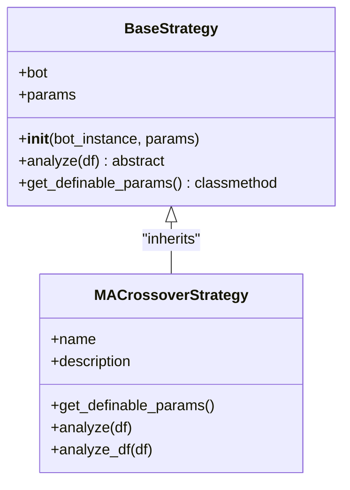
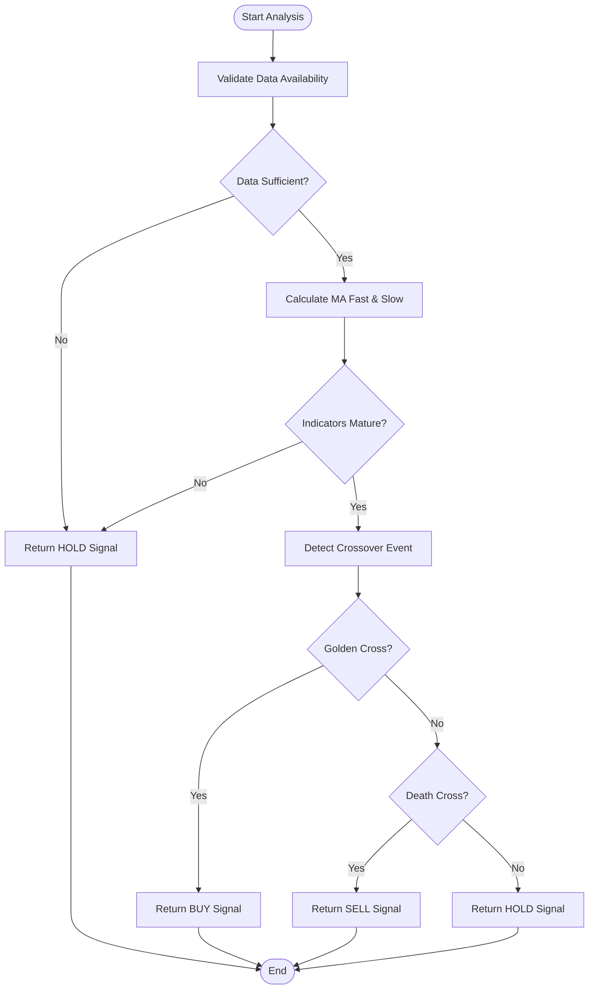
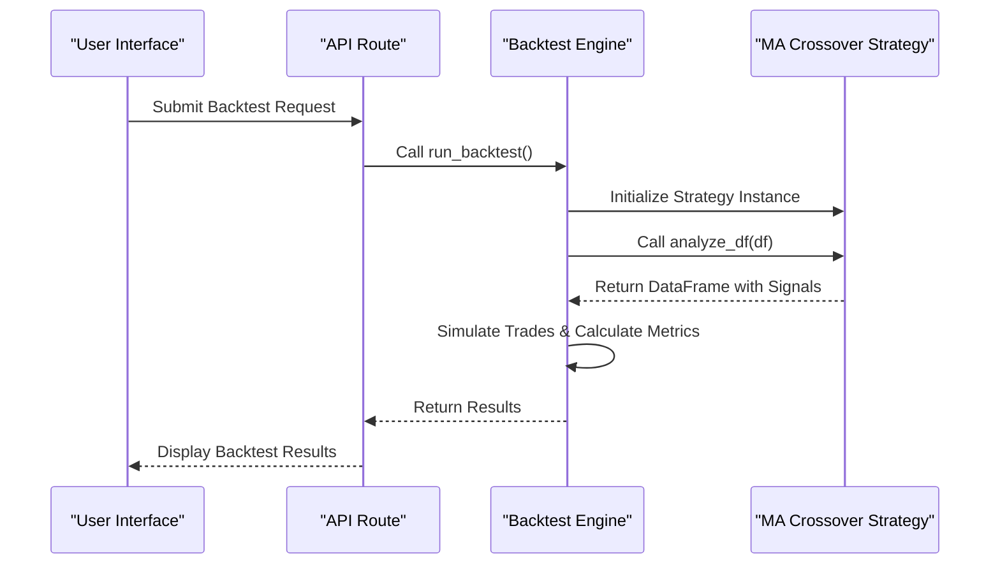

# MA Crossover Strategy

<cite>
**Referenced Files in This Document**   
- [ma_crossover.py](file://core/strategies/ma_crossover.py)
- [base_strategy.py](file://core/strategies/base_strategy.py)
- [strategy_map.py](file://core/strategies/strategy_map.py)
- [engine.py](file://core/backtesting/engine.py)
- [api_bots.py](file://core/routes/api_bots.py)
- [README.md](file://README.md)
- [STRATEGY_OPTIMIZATION_GUIDE.md](file://STRATEGY_OPTIMIZATION_GUIDE.md)
- [BACKTEST_FIXES.md](file://BACKTEST_FIXES.md)
- [XAUUSD_FIXES_COMPLETE.md](file://XAUUSD_FIXES_COMPLETE.md)
</cite>

## Table of Contents
1. [Introduction](#introduction)
2. [Core Implementation](#core-implementation)
3. [Strategy Logic and Signal Generation](#strategy-logic-and-signal-generation)
4. [Configurable Parameters](#configurable-parameters)
5. [Backtesting Integration](#backtesting-integration)
6. [Frontend and API Integration](#frontend-and-api-integration)
7. [Optimal Market Conditions and Performance](#optimal-market-conditions-and-performance)
8. [Parameter Optimization and Best Practices](#parameter-optimization-and-best-practices)
9. [Common Pitfalls and Risk Management](#common-pitfalls-and-risk-management)
10. [Conclusion](#conclusion)

## Introduction
The MA Crossover Strategy is a classic trend-following trading approach implemented within the QuantumBotX platform. This strategy generates buy and sell signals based on the interaction between two moving averages of different periods. The core principle is that when a shorter-term moving average crosses above a longer-term moving average, it signals a potential upward trend (Golden Cross), while a cross below indicates a potential downward trend (Death Cross). This document provides a comprehensive analysis of the strategy's implementation, configuration, integration, and performance characteristics within the quantumbotx repository.

## Core Implementation

The MA Crossover Strategy is implemented in the `ma_crossover.py` file and extends the `BaseStrategy` class, establishing a clear inheritance relationship. This design pattern allows the strategy to inherit core functionality while implementing its specific logic. The strategy is registered in the `strategy_map.py` file, making it accessible throughout the application. The implementation leverages the `pandas_ta` library for technical indicator calculations, ensuring efficient and accurate computation of moving averages.

**Diagram sources**
- [base_strategy.py](file://core/strategies/base_strategy.py#L1-L28)
- [ma_crossover.py](file://core/strategies/ma_crossover.py#L1-L60)

**Section sources**
- [ma_crossover.py](file://core/strategies/ma_crossover.py#L1-L60)
- [base_strategy.py](file://core/strategies/base_strategy.py#L1-L28)
- [strategy_map.py](file://core/strategies/strategy_map.py#L1-L26)

## Strategy Logic and Signal Generation

The strategy's signal generation logic is implemented in two primary methods: `analyze` for live trading and `analyze_df` for backtesting. Both methods follow the dual moving average principle but are optimized for their respective use cases. The `analyze` method processes the most recent data bars to generate a single trading decision, while `analyze_df` processes the entire dataset to generate a complete signal series for historical analysis.

The signal logic is based on detecting crossover events between the fast and slow moving averages. A "Golden Cross" occurs when the fast MA crosses above the slow MA, generating a BUY signal. Conversely, a "Death Cross" occurs when the fast MA crosses below the slow MA, generating a SELL signal. The strategy includes robust data validation to ensure sufficient historical data is available before attempting to generate signals.

**Diagram sources**
- [ma_crossover.py](file://core/strategies/ma_crossover.py#L30-L60)

**Section sources**
- [ma_crossover.py](file://core/strategies/ma_crossover.py#L30-L60)

## Configurable Parameters

The MA Crossover Strategy exposes two primary configurable parameters that allow users to customize its behavior. These parameters are defined in the `get_definable_params` class method and are accessible through the web interface. The parameters are designed to be intuitive and user-friendly, with clear labels and default values that represent common trading practices.

**Configurable Parameters:**
- **fast_period**: Defines the period for the short-term moving average. Default value is 20, representing a 20-period SMA.
- **slow_period**: Defines the period for the long-term moving average. Default value is 50, representing a 50-period SMA.

These parameters can be adjusted to make the strategy more responsive (shorter periods) or more stable (longer periods). The strategy implementation includes safeguards to handle edge cases, such as insufficient data, by returning a HOLD signal when the required historical data is not available.

**Section sources**
- [ma_crossover.py](file://core/strategies/ma_crossover.py#L10-L15)

## Backtesting Integration

The MA Crossover Strategy is fully integrated with the QuantumBotX backtesting engine, which is implemented in `engine.py`. The backtesting process follows a systematic workflow that begins with strategy initialization and ends with performance metric calculation. The `analyze_df` method of the strategy is specifically designed for backtesting, as it processes the entire dataset and returns a DataFrame with a complete signal series.

The backtesting engine applies the strategy to historical data, simulates trades based on the generated signals, and calculates key performance metrics such as total profit, win rate, and maximum drawdown. The engine also implements position sizing logic and risk management rules, which are critical for realistic backtesting results. For instruments like XAUUSD, the engine applies special risk management rules to prevent catastrophic losses due to high volatility.

**Diagram sources**
- [engine.py](file://core/backtesting/engine.py#L1-L317)
- [ma_crossover.py](file://core/strategies/ma_crossover.py#L50-L60)
- [api_backtest.py](file://core/routes/api_backtest.py#L1-L23)

**Section sources**
- [engine.py](file://core/backtesting/engine.py#L1-L317)
- [ma_crossover.py](file://core/strategies/ma_crossover.py#L50-L60)

## Frontend and API Integration

The MA Crossover Strategy is seamlessly integrated into the QuantumBotX web interface through a combination of backend API routes and frontend JavaScript code. The strategy is exposed via the `/api/strategies` endpoint, which returns a list of all available strategies with their names and descriptions. When a user selects the MA Crossover Strategy, the frontend makes a request to `/api/strategies/MA_CROSSOVER/params` to retrieve the configurable parameters.

The frontend dynamically generates input fields for each parameter based on the metadata returned by the API, including the parameter name, label, type, and default value. This dynamic approach allows the interface to adapt to any strategy without requiring code changes. The integration is robust and includes error handling to manage cases where the strategy or parameters are not found.

**Section sources**
- [api_bots.py](file://core/routes/api_bots.py#L1-L56)
- [strategy_map.py](file://core/strategies/strategy_map.py#L1-L26)
- [backtesting.js](file://static/js/backtesting.js#L12-L69)

## Optimal Market Conditions and Performance

According to the project documentation in `README.md`, the MA Crossover Strategy is best suited for trending markets. It performs well on assets like indices and XAUUSD where sustained price movements are common. In trending conditions, the strategy can capture significant portions of price moves by following the direction indicated by the moving average crossover.

However, the strategy is less effective in ranging or choppy markets where prices oscillate without a clear trend. In such conditions, the moving averages frequently cross back and forth, generating false signals that can lead to whipsaw losses. The strategy's performance is highly dependent on the chosen time frame and asset, with longer time frames generally providing more reliable signals due to reduced noise.

The QuantumBotX Hybrid strategy, which combines MA Crossover with other indicators, is designed to adapt to both trending and ranging markets, providing a more robust solution for varying market conditions.

**Section sources**
- [README.md](file://README.md#L40-L45)

## Parameter Optimization and Best Practices

The `STRATEGY_OPTIMIZATION_GUIDE.md` document provides valuable insights into parameter optimization for trading strategies, including principles that can be applied to the MA Crossover Strategy. While the guide focuses on the QuantumBotX Hybrid strategy, the optimization techniques are broadly applicable. Key recommendations include adjusting parameters based on the specific asset being traded and implementing pair-specific parameter sets.

For the MA Crossover Strategy, optimization could involve testing different combinations of fast and slow periods to find the optimal balance between responsiveness and reliability. For example, shorter periods (e.g., 10 and 30) might be more suitable for volatile assets, while longer periods (e.g., 50 and 200) might be better for stable assets. The guide also emphasizes the importance of risk management, suggesting adjustments to position sizing and stop-loss levels based on market conditions.

A systematic approach to optimization would involve backtesting the strategy across multiple assets and time frames, analyzing the results, and iteratively refining the parameters to improve performance while maintaining acceptable risk levels.

**Section sources**
- [STRATEGY_OPTIMIZATION_GUIDE.md](file://STRATEGY_OPTIMIZATION_GUIDE.md#L1-L143)

## Common Pitfalls and Risk Management

The MA Crossover Strategy is susceptible to several common pitfalls, particularly in volatile or ranging markets. The most significant risk is whipsaw losses, where the strategy generates a series of false signals due to price oscillations around the moving averages. This can lead to multiple losing trades in quick succession, eroding capital.

To mitigate these risks, the QuantumBotX platform implements comprehensive risk management features, particularly for high-volatility instruments like XAUUSD. As documented in `XAUUSD_FIXES_COMPLETE.md`, the backtesting engine applies an ultra-conservative approach to gold trading, including capped risk percentages, fixed lot sizes, and an emergency brake system that prevents trades when risk exceeds a threshold.

The strategy also faces the challenge of lag, as moving averages are inherently backward-looking indicators. This means that signals are generated after a price move has already begun, potentially reducing profitability. Traders should be aware of this limitation and consider combining the MA Crossover Strategy with other indicators or analysis methods to improve timing and confirmation.

**Section sources**
- [XAUUSD_FIXES_COMPLETE.md](file://XAUUSD_FIXES_COMPLETE.md#L1-L140)
- [ma_crossover.py](file://core/strategies/ma_crossover.py#L30-L60)

## Conclusion

The MA Crossover Strategy is a fundamental and well-implemented trend-following approach within the QuantumBotX platform. Its clean code structure, clear parameterization, and seamless integration with the backtesting and trading systems make it a valuable tool for both novice and experienced traders. While the strategy has inherent limitations in ranging markets and is subject to signal lag, its performance in trending conditions can be highly effective when properly configured and managed.

The comprehensive risk management features of the QuantumBotX platform, particularly the specialized handling of high-volatility instruments like XAUUSD, provide a robust framework for deploying the strategy in real-world trading scenarios. By following the optimization principles outlined in the project documentation and being mindful of the strategy's limitations, users can effectively leverage the MA Crossover Strategy as part of a diversified trading approach.