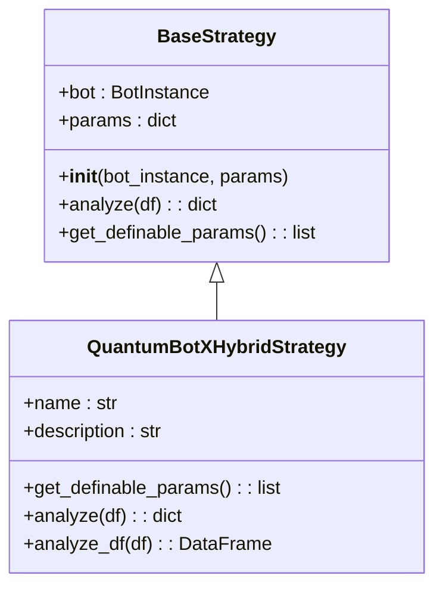
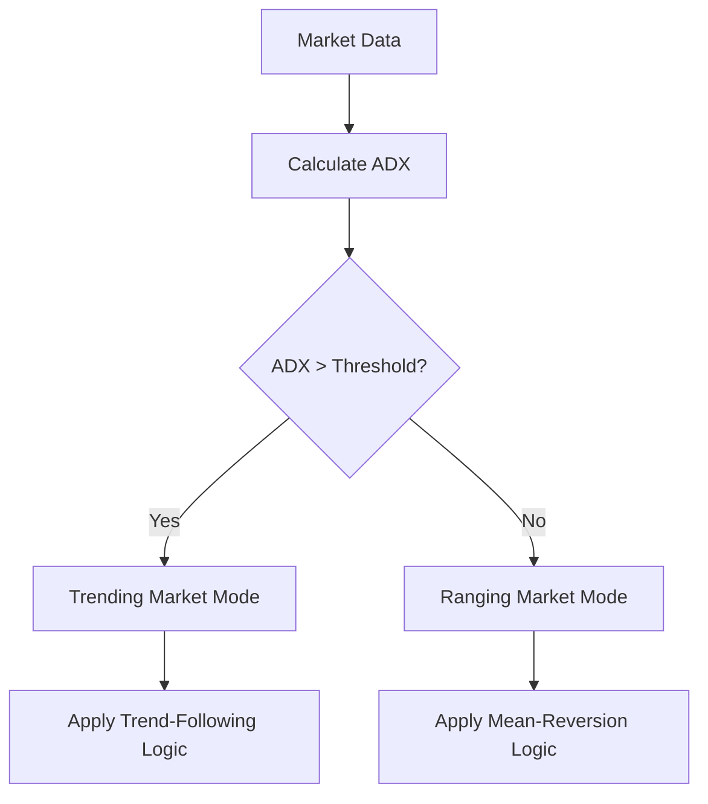
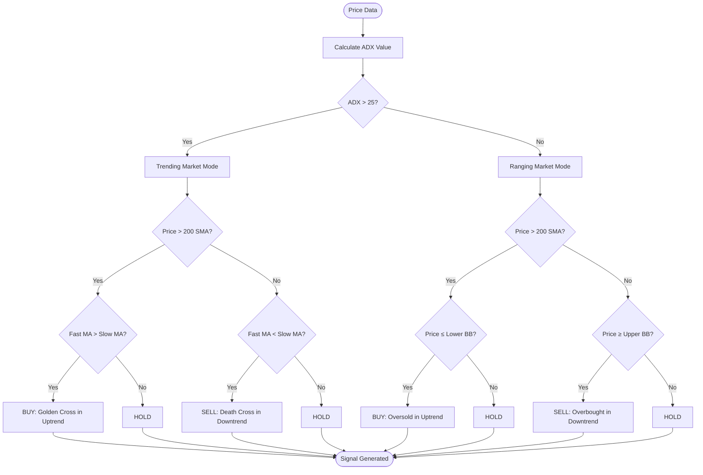
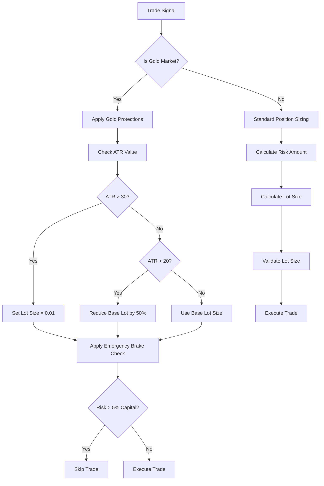

# QuantumbotX Hybrid Strategy

<cite>
**Referenced Files in This Document**   
- [quantumbotx_hybrid.py](file://core/strategies/quantumbotx_hybrid.py)
- [base_strategy.py](file://core/strategies/base_strategy.py)
- [strategy_map.py](file://core/strategies/strategy_map.py)
- [engine.py](file://core/backtesting/engine.py)
- [test_multi_currency.py](file://test_multi_currency.py)
- [STRATEGY_OPTIMIZATION_GUIDE.md](file://STRATEGY_OPTIMIZATION_GUIDE.md)
</cite>

## Table of Contents
1. [Introduction](#introduction)
2. [Core Components](#core-components)
3. [Multi-Indicator Fusion Engine](#multi-indicator-fusion-engine)
4. [Market Regime Detection](#market-regime-detection)
5. [Signal Generation Logic](#signal-generation-logic)
6. [Position Sizing and Risk Management](#position-sizing-and-risk-management)
7. [Backtesting Framework](#backtesting-framework)
8. [Performance Analysis](#performance-analysis)
9. [Optimization Strategy](#optimization-strategy)
10. [Conclusion](#conclusion)

## Introduction
The QuantumbotX Hybrid Strategy represents a sophisticated multi-indicator trading system designed to adapt to varying market conditions through dynamic signal fusion. This strategy combines momentum, volatility, and trend-following indicators into a composite decision engine that adjusts its behavior based on detected market regimes. By integrating multiple technical analysis approaches, the strategy aims to provide robust performance across different market environments while maintaining strict risk controls. The implementation demonstrates a thoughtful balance between aggressive profit-seeking in trending markets and conservative mean-reversion in ranging conditions.

## Core Components

The QuantumbotX Hybrid Strategy is implemented as a class that inherits from a base strategy abstraction, following object-oriented design principles for extensibility and maintainability. The strategy is registered in the system's strategy map, making it accessible through a standardized interface.



**Diagram sources**
- [base_strategy.py](file://core/strategies/base_strategy.py#L4-L28)
- [quantumbotx_hybrid.py](file://core/strategies/quantumbotx_hybrid.py#L5-L112)

**Section sources**
- [quantumbotx_hybrid.py](file://core/strategies/quantumbotx_hybrid.py#L5-L112)
- [base_strategy.py](file://core/strategies/base_strategy.py#L4-L28)
- [strategy_map.py](file://core/strategies/strategy_map.py#L0-L28)

## Multi-Indicator Fusion Engine

The QuantumbotX Hybrid Strategy employs a multi-indicator fusion approach that combines three distinct analytical perspectives: trend identification, momentum measurement, and volatility assessment. This composite decision engine evaluates market conditions through multiple lenses before generating trade signals.

### Integrated Component Strategies

The strategy integrates several well-established technical analysis approaches:

- **MA Crossover**: Uses fast and slow simple moving averages (SMA) to identify trend direction and potential reversal points
- **ADX (Average Directional Index)**: Measures trend strength to distinguish between trending and ranging market conditions
- **Bollinger Bands**: Assesses volatility and identifies potential overbought/oversold conditions

These components are not used in isolation but are fused together through a hierarchical decision process that prioritizes certain signals based on the prevailing market regime.

### Parameter Configuration

The strategy exposes several configurable parameters that control its behavior:

```python
{
    "adx_period": 14,
    "adx_threshold": 25,
    "ma_fast_period": 20,
    "ma_slow_period": 50,
    "bb_length": 20,
    "bb_std": 2.0,
    "trend_filter_period": 200
}
```

These parameters allow users to fine-tune the strategy's sensitivity to different market conditions. The ADX period and threshold control how the strategy identifies trending markets, while the MA periods determine the responsiveness of the trend-following component. The Bollinger Bands parameters control the volatility assessment component.

**Section sources**
- [quantumbotx_hybrid.py](file://core/strategies/quantumbotx_hybrid.py#L10-L24)

## Market Regime Detection

The QuantumbotX Hybrid Strategy's key innovation lies in its ability to detect and adapt to different market regimes. This dynamic adaptation allows the strategy to apply different trading logic depending on whether the market is trending or ranging.

### Trend Strength Assessment

The strategy uses the ADX (Average Directional Index) indicator to assess trend strength. When the ADX value exceeds a configurable threshold (default: 25), the market is classified as "trending." Below this threshold, the market is considered to be in a "ranging" or "consolidation" phase.



**Diagram sources**
- [quantumbotx_hybrid.py](file://core/strategies/quantumbotx_hybrid.py#L50-L75)

### Long-Term Trend Filter

In addition to the ADX-based regime detection, the strategy employs a long-term trend filter using a 200-period simple moving average (SMA). This filter helps ensure that trades are aligned with the dominant market direction:

- **Uptrend**: Price is above the 200-period SMA
- **Downtrend**: Price is below the 200-period SMA

This long-term filter acts as a directional bias, preventing the strategy from taking counter-trend positions that might have short-term technical justification but conflict with the broader market direction.

**Section sources**
- [quantumbotx_hybrid.py](file://core/strategies/quantumbotx_hybrid.py#L45-L50)

## Signal Generation Logic

The QuantumbotX Hybrid Strategy generates trade signals through a conditional logic system that varies based on the detected market regime. This adaptive approach allows the strategy to employ different trading styles appropriate to current market conditions.

### Trending Market Signals

When the ADX indicates a trending market (ADX > threshold), the strategy switches to a trend-following mode and generates signals based on moving average crossovers:

- **BUY Signal**: In an uptrend (price > 200 SMA), when the fast MA crosses above the slow MA (Golden Cross)
- **SELL Signal**: In a downtrend (price < 200 SMA), when the fast MA crosses below the slow MA (Death Cross)

This approach captures momentum in strong trending markets while using the long-term SMA as a directional filter to avoid counter-trend trades.

### Ranging Market Signals

When the ADX indicates a ranging market (ADX ≤ threshold), the strategy switches to a mean-reversion mode and generates signals based on Bollinger Band extremes:

- **BUY Signal**: In an uptrend (price > 200 SMA), when price touches or crosses below the lower Bollinger Band (oversold condition)
- **SELL Signal**: In a downtrend (price < 200 SMA), when price touches or crosses above the upper Bollinger Band (overbought condition)

This approach capitalizes on price oscillations within established ranges while maintaining alignment with the longer-term trend direction.



**Diagram sources**
- [quantumbotx_hybrid.py](file://core/strategies/quantumbotx_hybrid.py#L50-L95)

**Section sources**
- [quantumbotx_hybrid.py](file://core/strategies/quantumbotx_hybrid.py#L50-L95)

## Position Sizing and Risk Management

The QuantumbotX Hybrid Strategy incorporates sophisticated position sizing and risk management protocols, particularly for high-volatility instruments like gold (XAUUSD).

### Dynamic Position Sizing

The backtesting engine implements a dynamic position sizing algorithm that calculates lot size based on account risk percentage and stop-loss distance:

- **Risk Calculation**: Position size is determined by the amount of capital the trader is willing to risk (configurable percentage)
- **Stop-Loss Distance**: Uses ATR (Average True Range) multiplier to set stop-loss levels based on current volatility
- **Take-Profit Levels**: Sets profit targets at a multiple of the ATR, typically twice the stop-loss distance

### Gold Market Protections

For gold trading (XAUUSD), the strategy implements enhanced risk controls due to the metal's extreme volatility:

- **Lot Size Capping**: Maximum lot size limited to 0.03 regardless of account size
- **ATR-Based Reduction**: Further reduces lot size during periods of high volatility
- **Emergency Brake**: Skips trades if estimated risk exceeds 5% of current capital
- **Conservative Defaults**: Uses more conservative ATR multipliers (1.0 for SL, 2.0 for TP) compared to standard forex pairs

These protections were implemented after analysis revealed that standard position sizing could lead to catastrophic losses in gold markets.



**Diagram sources**
- [engine.py](file://core/backtesting/engine.py#L150-L250)

**Section sources**
- [engine.py](file://core/backtesting/engine.py#L150-L250)

## Backtesting Framework

The QuantumbotX Hybrid Strategy is evaluated using a comprehensive backtesting framework that simulates trading performance under historical market conditions.

### Backtesting Engine Architecture

The backtesting engine follows a four-step process:

1. **Indicator Pre-calculation**: Applies all required technical indicators to the historical data
2. **State Initialization**: Sets up initial capital, position state, and performance tracking variables
3. **Data Iteration**: Processes each bar sequentially, checking for entry and exit conditions
4. **Result Calculation**: Computes final performance metrics and returns a comprehensive results dictionary

The engine is designed to handle both standard forex pairs and high-volatility instruments like gold, with specialized risk management for the latter.

### Performance Metrics

The backtesting framework calculates several key performance indicators:

- **Total Profit/Loss**: Net profit in USD
- **Win Rate**: Percentage of winning trades
- **Maximum Drawdown**: Largest peak-to-trough decline
- **Final Capital**: Account balance at the end of the test period
- **Number of Trades**: Total trades executed

These metrics provide a comprehensive view of strategy performance, balancing profitability with risk considerations.

**Section sources**
- [engine.py](file://core/backtesting/engine.py#L0-L317)
- [test_multi_currency.py](file://test_multi_currency.py#L0-L275)

## Performance Analysis

Comprehensive testing of the QuantumbotX Hybrid Strategy across multiple currency pairs reveals both strengths and areas for improvement.

### Multi-Currency Performance

Testing across 10 currency pairs shows the strategy achieves profitability in 70% of cases. Performance varies significantly by currency type:

- **Excellent Performers**: USDCHF (+$1,597 profit, 2.0% drawdown, 61% win rate)
- **High Profit but Risky**: EURJPY (+$8,011 profit, 37.6% drawdown), USDJPY (+$5,515 profit, 21.5% drawdown)
- **Moderate Performers**: USDCAD, NZDUSD, AUDUSD (moderate profits, low drawdowns)
- **Poor Performers**: EURUSD (-$216), GBPUSD (-$8)

The strategy demonstrates particularly strong performance on commodity currencies and cross pairs, while struggling with major pairs like EURUSD and GBPUSD.

### Risk-Adjusted Returns

The strategy shows mixed risk-adjusted returns. While it achieves high absolute profits on certain pairs like EURJPY, these come with dangerously high drawdowns (37.6%). The risk management systems effectively protect against catastrophic losses on gold (XAUUSD), resulting in no trades being executed under volatile conditions, which preserves capital but sacrifices potential profits.

The current performance profile suggests the strategy is better suited to markets with moderate volatility and clear trends, where it can capitalize on momentum while avoiding whipsaw conditions.

**Section sources**
- [test_multi_currency.py](file://test_multi_currency.py#L0-L275)
- [STRATEGY_OPTIMIZATION_GUIDE.md](file://STRATEGY_OPTIMIZATION_GUIDE.md#L0-L143)

## Optimization Strategy

The analysis of the QuantumbotX Hybrid Strategy's performance has led to specific optimization recommendations designed to improve risk-adjusted returns across different currency types.

### Pair-Specific Parameter Sets

The optimization strategy recommends implementing pair-specific parameter sets that adjust key settings based on currency characteristics:

```python
def get_optimized_params(self, symbol):
    """Get optimized parameters based on currency pair"""
    symbol = symbol.upper()
    
    if 'JPY' in symbol:
        return self.get_jpy_params()
    elif symbol in ['USDCAD', 'AUDUSD', 'NZDUSD']:
        return self.get_commodity_params()
    elif symbol in ['EURUSD', 'GBPUSD']:
        return self.get_major_params()
    elif 'XAU' in symbol:
        return self.get_gold_params()
    else:
        return self.get_default_params()
```

This approach recognizes that different currency pairs have distinct volatility profiles and market dynamics that require tailored parameter settings.

### Recommended Parameter Adjustments

The optimization guide recommends specific parameter changes for different currency categories:

- **JPY Pairs**: Reduce position size and tighten stops to mitigate high drawdowns
- **Commodity Currencies**: Slightly increase position size and profit targets to enhance performance
- **Major Pairs**: Adopt a more conservative approach with reduced position sizes and higher ADX thresholds to filter out weak trends

These adjustments aim to achieve the success metrics of 80%+ profitable pairs, maximum 15% drawdown on any pair, and 40%+ win rate across all pairs, while maintaining the current 100% protection on XAUUSD trading.

**Section sources**
- [STRATEGY_OPTIMIZATION_GUIDE.md](file://STRATEGY_OPTIMIZATION_GUIDE.md#L71-L143)

## Conclusion

The QuantumbotX Hybrid Strategy represents a sophisticated multi-indicator trading system that successfully combines trend-following and mean-reversion approaches through dynamic market regime detection. By using ADX to distinguish between trending and ranging markets, the strategy adapts its signal generation logic to current conditions, employing MA crossovers in trending markets and Bollinger Band extremes in ranging markets.

The strategy demonstrates strong performance across a majority of currency pairs, particularly excelling in commodity currencies and cross pairs. However, its performance on major pairs like EURUSD and GBPUSD is suboptimal, and certain high-profit pairs like EURJPY exhibit dangerously high drawdowns.

The comprehensive risk management system, particularly the enhanced protections for gold trading, effectively prevents catastrophic losses but may be overly conservative in some market conditions. The recommended optimization strategy of implementing pair-specific parameter sets offers a promising path to improve risk-adjusted returns across all currency types.

Future development should focus on refining the market regime detection algorithm, potentially incorporating additional indicators or machine learning techniques to improve the accuracy of trend/range classification. Additionally, implementing the recommended pair-specific parameter optimization and monitoring its performance in live trading conditions will be crucial for maximizing the strategy's potential while maintaining robust risk controls.