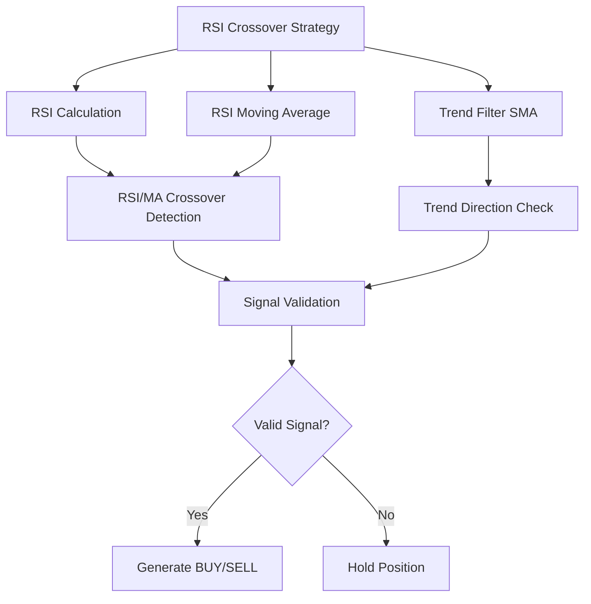
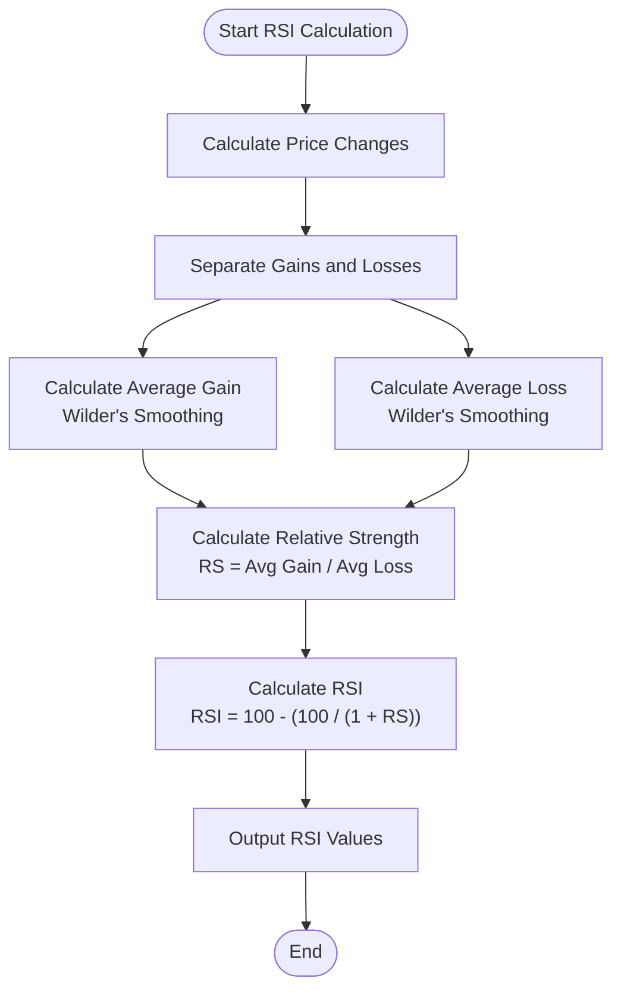
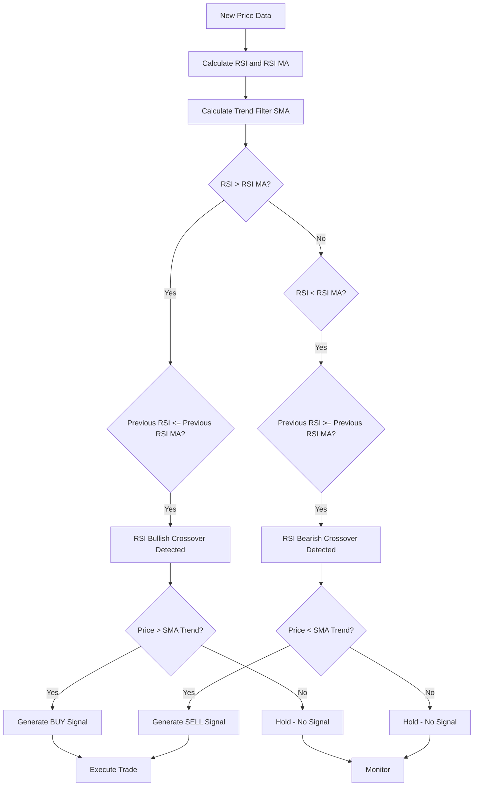
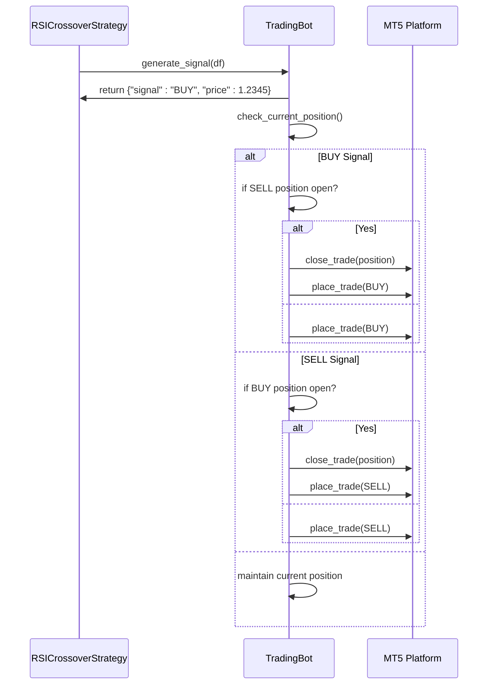
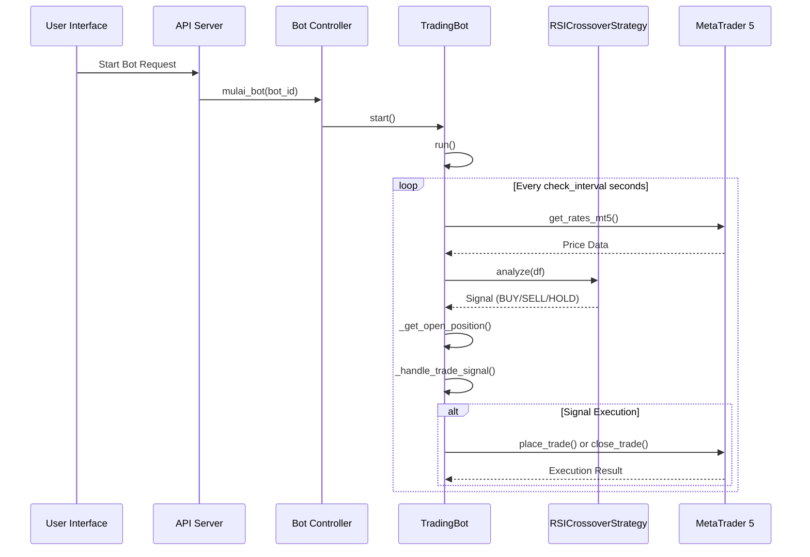

# RSI Crossover Strategy

<cite>
**Referenced Files in This Document**   
- [rsi_crossover.py](file://core/strategies/rsi_crossover.py)
- [base_strategy.py](file://core/strategies/base_strategy.py)
- [strategy_map.py](file://core/strategies/strategy_map.py)
- [engine.py](file://core/backtesting/engine.py)
- [api_bots.py](file://core/routes/api_bots.py)
- [controller.py](file://core/bots/controller.py)
- [trading_bot.py](file://core/bots/trading_bot.py)
- [mt5.py](file://core/utils/mt5.py)
- [api_indicators.py](file://core/routes/api_indicators.py)
</cite>

## Table of Contents
1. [Introduction](#introduction)
2. [Strategy Overview](#strategy-overview)
3. [RSI Calculation and Methodology](#rsi-calculation-and-methodology)
4. [Strategy Parameters](#strategy-parameters)
5. [Signal Generation Logic](#signal-generation-logic)
6. [Integration with Position Management](#integration-with-position-management)
7. [Backtesting Framework Integration](#backtesting-framework-integration)
8. [Live Trading Execution](#live-trading-execution)
9. [Parameter Tuning Guidance](#parameter-tuning-guidance)
10. [Limitations and Considerations](#limitations-and-considerations)

## Introduction
The RSI Crossover Strategy is a momentum-based trading approach implemented within the quantumbotx platform. Unlike traditional RSI strategies that rely on overbought (>70) and oversold (<30) thresholds, this strategy employs a crossover methodology between the Relative Strength Index (RSI) and its moving average (MA) to generate trading signals. The strategy incorporates a long-term trend filter to validate signals and avoid counter-trend entries. This document provides a comprehensive analysis of the strategy's implementation, parameters, signal logic, and integration within the quantumbotx ecosystem.

## Strategy Overview
The RSI Crossover Strategy is designed to identify momentum shifts by detecting crossovers between the RSI indicator and a moving average of the RSI. The strategy operates on a dual confirmation principle: a momentum signal (RSI/MA crossover) must align with the prevailing long-term trend. This approach aims to capture early momentum moves while filtering out false signals in ranging markets.

The strategy is implemented as a Python class `RSICrossoverStrategy` that inherits from the `BaseStrategy` abstract base class. It is registered in the system's `STRATEGY_MAP`, making it accessible through the API and user interface. The strategy supports both live trading and backtesting through two distinct analysis methods: `analyze()` for real-time execution and `analyze_df()` for historical simulation.



**Diagram sources**
- [rsi_crossover.py](file://core/strategies/rsi_crossover.py)

**Section sources**
- [rsi_crossover.py](file://core/strategies/rsi_crossover.py)
- [base_strategy.py](file://core/strategies/base_strategy.py)

## RSI Calculation and Methodology
The strategy utilizes the `pandas_ta` library to calculate the Relative Strength Index (RSI). The RSI is computed using the standard Wilder's smoothing method, which is the default implementation in `pandas_ta`. The calculation involves the following steps:

1. Calculate price changes between consecutive periods
2. Separate gains (positive changes) and losses (negative changes)
3. Calculate the average gain and average loss over the specified period using Wilder's smoothing
4. Compute the Relative Strength (RS) as the ratio of average gain to average loss
5. Derive the RSI using the formula: RSI = 100 - (100 / (1 + RS))

The strategy does not use the traditional overbought (>70) and oversold (<30) thresholds for signal generation. Instead, it focuses on the relationship between the RSI and its moving average. The RSI values are calculated directly from the closing prices of the input DataFrame using the `ta.rsi()` function with the specified `rsi_period` parameter.



**Diagram sources**
- [rsi_crossover.py](file://core/strategies/rsi_crossover.py)
- [api_indicators.py](file://core/routes/api_indicators.py)

**Section sources**
- [rsi_crossover.py](file://core/strategies/rsi_crossover.py)
- [api_indicators.py](file://core/routes/api_indicators.py)

## Strategy Parameters
The RSI Crossover Strategy exposes three configurable parameters that users can adjust to optimize performance for different market conditions and asset classes:

**rsi_period**: This parameter defines the lookback period for calculating the RSI indicator. The default value is 14 periods, which is the standard setting used in most technical analysis applications. A shorter period makes the RSI more sensitive to price changes, while a longer period smooths the indicator and reduces noise.

**rsi_ma_period**: This parameter specifies the period for the moving average applied to the RSI values. The default value is 10 periods. This moving average acts as a signal line for the RSI, and crossovers between the RSI and this line generate trading signals. A shorter MA period makes the strategy more responsive, while a longer period provides stronger filtering.

**trend_filter_period**: This parameter determines the period for the Simple Moving Average (SMA) used as a trend filter. The default value is 50 periods. The strategy only generates signals that align with the direction of this long-term trend. This filter helps avoid counter-trend trades and improves the quality of signals.

```mermaid
classDiagram
class RSICrossoverStrategy {
+str name
+str description
+dict params
+analyze(df) dict
+analyze_df(df) DataFrame
+get_definable_params() list
}
class BaseStrategy {
+bot_instance
+params
+__init__(bot_instance, params)
+analyze(df) abstract
+get_definable_params() classmethod
}
RSICrossoverStrategy --|> BaseStrategy : inherits
RSICrossoverStrategy : +name : str = 'RSI Crossover'
RSICrossoverStrategy : +description : str = 'Momentum signals from RSI/MA crossover with trend filter'
RSICrossoverStrategy : +params : dict = {rsi_period : 14, rsi_ma_period : 10, trend_filter_period : 50}
```

**Diagram sources**
- [rsi_crossover.py](file://core/strategies/rsi_crossover.py)
- [base_strategy.py](file://core/strategies/base_strategy.py)

**Section sources**
- [rsi_crossover.py](file://core/strategies/rsi_crossover.py)

## Signal Generation Logic
The signal generation logic in the RSI Crossover Strategy is based on a two-factor confirmation system: RSI/MA crossover and trend alignment. The strategy generates signals only when both conditions are satisfied simultaneously.

For a **bullish signal (BUY)**, two conditions must be met:
1. **RSI Bullish Crossover**: The RSI value crosses above its moving average. This is detected when the previous RSI value was less than or equal to the previous RSI MA value, and the current RSI value is greater than the current RSI MA value.
2. **Uptrend Confirmation**: The current price is above the long-term trend filter (SMA). This ensures the signal aligns with the prevailing upward trend.

For a **bearish signal (SELL)**, two conditions must be met:
1. **RSI Bearish Crossover**: The RSI value crosses below its moving average. This is detected when the previous RSI value was greater than or equal to the previous RSI MA value, and the current RSI value is less than the current RSI MA value.
2. **Downtrend Confirmation**: The current price is below the long-term trend filter (SMA). This ensures the signal aligns with the prevailing downward trend.

If neither condition is met, the strategy returns a "HOLD" signal, indicating no action should be taken.



**Diagram sources**
- [rsi_crossover.py](file://core/strategies/rsi_crossover.py)

**Section sources**
- [rsi_crossover.py](file://core/strategies/rsi_crossover.py)

## Integration with Position Management
The RSI Crossover Strategy integrates with the position management system through the `TradingBot` class, which handles trade execution and position monitoring. When a signal is generated, the trading bot evaluates the current position status before executing any trades.

The position management logic follows these rules:
1. If a BUY signal is generated and a SELL position is open, the bot first closes the existing SELL position before opening a new BUY position.
2. If a BUY signal is generated and no position is open, the bot opens a new BUY position.
3. If a SELL signal is generated and a BUY position is open, the bot first closes the existing BUY position before opening a new SELL position.
4. If a SELL signal is generated and no position is open, the bot opens a new SELL position.
5. If a HOLD signal is generated, the bot maintains the current position without making any changes.

This approach ensures that the strategy never holds conflicting positions and always aligns with the most recent signal. The bot uses the strategy's signal output to determine the appropriate action, creating a clean separation between signal generation and trade execution.



**Diagram sources**
- [rsi_crossover.py](file://core/strategies/rsi_crossover.py)
- [trading_bot.py](file://core/bots/trading_bot.py)

**Section sources**
- [trading_bot.py](file://core/bots/trading_bot.py)
- [rsi_crossover.py](file://core/strategies/rsi_crossover.py)

## Backtesting Framework Integration
The RSI Crossover Strategy is fully integrated with the quantumbotx backtesting framework, allowing users to evaluate its performance on historical data. The backtesting engine, implemented in `engine.py`, executes the strategy on historical price data and simulates trade execution with realistic parameters.

During backtesting, the strategy's `analyze_df()` method is used to generate signals for all historical data points simultaneously. The backtesting engine then processes these signals sequentially, simulating trade entries and exits based on stop-loss (SL) and take-profit (TP) levels derived from the Average True Range (ATR) indicator.

The backtesting framework incorporates several risk management features:
- Dynamic position sizing based on account risk percentage
- Stop-loss and take-profit levels calculated as multiples of ATR
- Special handling for high-volatility assets like XAUUSD (Gold)
- Maximum drawdown tracking and performance metrics calculation

The backtesting results include key performance indicators such as total trades, win rate, final capital, total profit, and maximum drawdown percentage, providing a comprehensive evaluation of the strategy's historical performance.

```mermaid
graph TD
A[Historical Data] --> B[Backtesting Engine]
B --> C[Strategy Initialization]
C --> D[Signal Generation<br/>analyze_df()]
D --> E[Trade Simulation]
E --> F[Position Sizing<br/>Risk Management]
F --> G[SL/TP Execution]
G --> H[Performance Metrics]
H --> I[Equity Curve]
H --> J[Trade Log]
H --> K[Summary Statistics]
I --> L[Backtest Report]
J --> L
K --> L
```

**Diagram sources**
- [engine.py](file://core/backtesting/engine.py)
- [rsi_crossover.py](file://core/strategies/rsi_crossover.py)

**Section sources**
- [engine.py](file://core/backtesting/engine.py)
- [rsi_crossover.py](file://core/strategies/rsi_crossover.py)

## Live Trading Execution
In live trading, the RSI Crossover Strategy is executed through the `TradingBot` system, which runs as a separate thread for each active bot. The execution flow begins when a user creates and starts a bot through the API, which triggers the bot controller to initialize and start the trading thread.

The live trading loop operates on a configurable interval (check_interval), typically ranging from 1 to 60 seconds. During each iteration, the bot:
1. Retrieves the latest market data from the MetaTrader 5 platform
2. Passes the data to the RSI Crossover Strategy's `analyze()` method
3. Receives the generated signal (BUY, SELL, or HOLD)
4. Evaluates the current position status
5. Executes the appropriate trade action based on the signal and position management rules

The bot maintains a connection to the MetaTrader 5 platform through the `mt5` module, using the `get_rates_mt5()` function to retrieve price data and the `place_trade()` and `close_trade()` functions to execute orders. The system includes comprehensive error handling and logging to ensure reliability and provide transparency into the bot's operations.



**Diagram sources**
- [api_bots.py](file://core/routes/api_bots.py)
- [controller.py](file://core/bots/controller.py)
- [trading_bot.py](file://core/bots/trading_bot.py)
- [rsi_crossover.py](file://core/strategies/rsi_crossover.py)
- [mt5.py](file://core/utils/mt5.py)

**Section sources**
- [api_bots.py](file://core/routes/api_bots.py)
- [controller.py](file://core/bots/controller.py)
- [trading_bot.py](file://core/bots/trading_bot.py)

## Parameter Tuning Guidance
Optimal parameter configuration for the RSI Crossover Strategy varies depending on the asset class, market volatility, and trading timeframe. The following guidelines can help users tune the strategy parameters for different conditions:

**For high-volatility assets (e.g., XAUUSD/Gold):**
- Use shorter RSI and RSI MA periods (e.g., rsi_period=10, rsi_ma_period=7) to increase responsiveness
- Maintain a longer trend filter period (e.g., trend_filter_period=50-100) to avoid whipsaws
- Consider reducing position size and tightening stop-loss levels due to increased price swings

**For low-volatility assets (e.g., major forex pairs):**
- Use standard or slightly longer periods (e.g., rsi_period=14-21, rsi_ma_period=10-14) for smoother signals
- A trend filter period of 50 is typically sufficient
- Can afford slightly wider stop-loss levels relative to average volatility

**For different timeframes:**
- **Shorter timeframes (M1-M15):** Use shorter periods for all parameters to capture quick momentum shifts
- **Medium timeframes (H1-H4):** Use standard periods (14, 10, 50) as starting points
- **Longer timeframes (D1+):** Use longer periods (e.g., rsi_period=21, rsi_ma_period=14, trend_filter_period=100) to filter out noise

**General optimization approach:**
1. Start with default parameters (14, 10, 50)
2. Conduct backtesting on relevant historical data
3. Adjust one parameter at a time while keeping others constant
4. Evaluate performance metrics (win rate, profit factor, max drawdown)
5. Validate results on out-of-sample data
6. Implement in live trading with small position sizes initially

## Limitations and Considerations
The RSI Crossover Strategy, while effective in certain market conditions, has several limitations that users should be aware of:

**Performance in strong trending markets:** The strategy may underperform in strong, sustained trends as RSI can remain in overbought or oversold territory for extended periods. The trend filter helps mitigate this issue, but the strategy may still generate late signals or miss significant portions of strong trends.

**Whipsaw in ranging markets:** In sideways or choppy markets, the RSI and its moving average may generate frequent crossovers, leading to multiple losing trades. The trend filter reduces but does not eliminate this risk.

**Lagging nature of moving averages:** Both the RSI MA and trend filter SMA are lagging indicators, which means signals are generated after price moves have already begun. This inherent delay can reduce profitability and increase drawdowns.

**Parameter sensitivity:** The strategy's performance is sensitive to parameter selection. Suboptimal parameters can lead to poor results, and parameters that work well in one market condition may fail in another.

**Potential solutions and enhancements:**
- Combine with additional confirmation indicators (e.g., volume, MACD)
- Implement adaptive parameters that adjust based on market volatility
- Use multiple timeframes for signal confirmation (higher timeframe trend, lower timeframe entry)
- Incorporate price action patterns for additional validation
- Implement dynamic position sizing based on confidence levels

Users should thoroughly backtest the strategy under various market conditions and exercise proper risk management when deploying it in live trading environments.