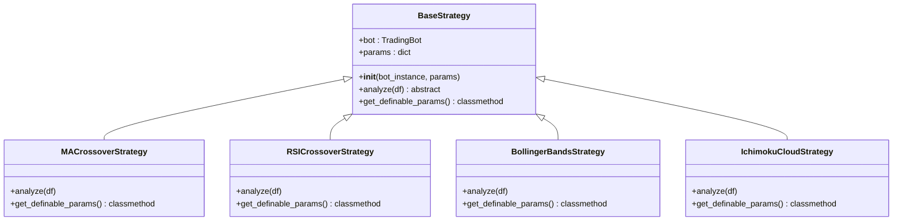
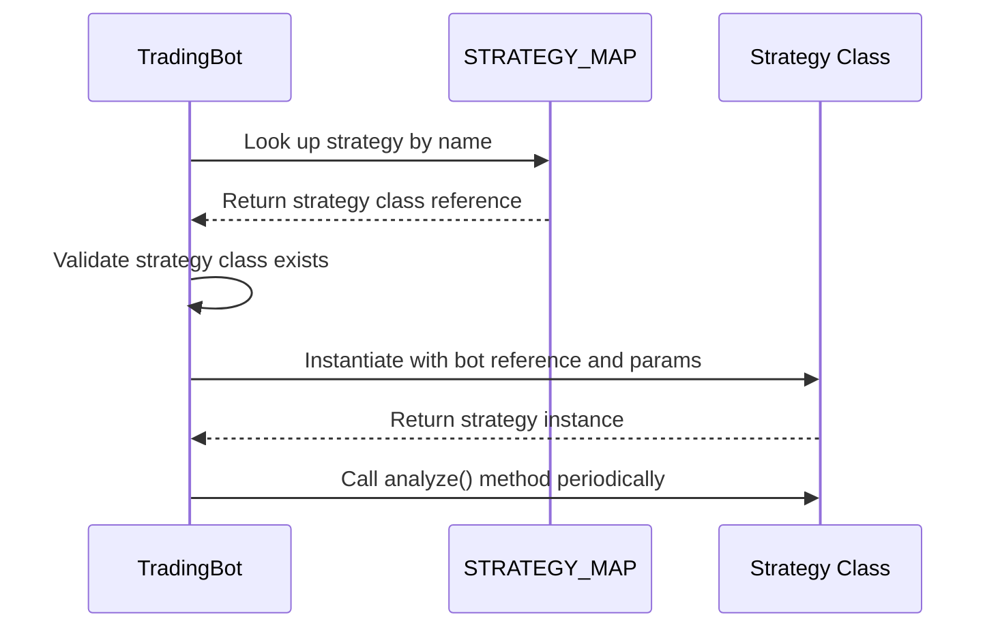

# Strategy Registration System

<cite>
**Referenced Files in This Document**   
- [strategy_map.py](file://core/strategies/strategy_map.py#L1-L27)
- [base_strategy.py](file://core/strategies/base_strategy.py#L1-L29)
- [trading_bot.py](file://core/bots/trading_bot.py#L1-L170)
- [api_bots.py](file://core/routes/api_bots.py#L1-L168)
- [ma_crossover.py](file://core/strategies/ma_crossover.py)
- [rsi_crossover.py](file://core/strategies/rsi_crossover.py)
- [bollinger_reversion.py](file://core/strategies/bollinger_reversion.py)
- [ichimoku_cloud.py](file://core/strategies/ichimoku_cloud.py)
- [quantum_velocity.py](file://core/strategies/quantum_velocity.py)
- [quantumbotx_hybrid.py](file://core/strategies/quantumbotx_hybrid.py)
</cite>

## Table of Contents
1. [Introduction](#introduction)
2. [Strategy Map Structure](#strategy-map-structure)
3. [Base Strategy Interface](#base-strategy-interface)
4. [Dynamic Strategy Instantiation](#dynamic-strategy-instantiation)
5. [Strategy Registration and Imports](#strategy-registration-and-imports)
6. [API Exposure and Frontend Integration](#api-exposure-and-frontend-integration)
7. [Valid Configuration Examples](#valid-configuration-examples)
8. [Error Handling and Validation](#error-handling-and-validation)
9. [Thread Safety and Initialization](#thread-safety-and-initialization)
10. [Troubleshooting Common Issues](#troubleshooting-common-issues)

## Introduction
The Strategy Registration System in quantumbotx enables dynamic loading and execution of trading strategies through a centralized mapping mechanism. This system allows the application to instantiate strategy classes at runtime based on configuration, providing flexibility and extensibility. The core component is the `STRATEGY_MAP` dictionary, which maps string identifiers to strategy class references, enabling configuration-driven bot behavior. This document details the implementation, usage patterns, and best practices for working with this dynamic strategy system.

**Section sources**
- [strategy_map.py](file://core/strategies/strategy_map.py#L1-L27)
- [trading_bot.py](file://core/bots/trading_bot.py#L1-L170)

## Strategy Map Structure
The `STRATEGY_MAP` dictionary serves as the central registry for all available trading strategies in the quantumbotx system. It maps string keys to strategy class references, enabling runtime lookup and instantiation.

```python
STRATEGY_MAP = {
    'MA_CROSSOVER': MACrossoverStrategy,
    'QUANTUMBOTX_HYBRID': QuantumBotXHybridStrategy,
    'RSI_CROSSOVER': RSICrossoverStrategy,
    'BOLLINGER_REVERSION': BollingerBandsStrategy,
    'BOLLINGER_SQUEEZE': BollingerSqueezeStrategy,
    'MERCY_EDGE': MercyEdgeStrategy,
    'quantum_velocity': QuantumVelocityStrategy,
    'PULSE_SYNC': PulseSyncStrategy,
    'TURTLE_BREAKOUT': TurtleBreakoutStrategy,
    'ICHIMOKU_CLOUD': IchimokuCloudStrategy,
    'DYNAMIC_BREAKOUT': DynamicBreakoutStrategy,
}
```

Each key represents a unique identifier used in configuration to specify which strategy a bot should use. The values are direct references to strategy classes imported from their respective modules. This design enables the system to resolve strategy names to executable classes during bot initialization.

**Section sources**
- [strategy_map.py](file://core/strategies/strategy_map.py#L1-L27)

## Base Strategy Interface
All trading strategies inherit from the `BaseStrategy` abstract base class, which defines the contract that all strategies must implement.

```python
class BaseStrategy(ABC):
    def __init__(self, bot_instance, params: dict = {}):
        self.bot = bot_instance
        self.params = params

    @abstractmethod
    def analyze(self, df):
        raise NotImplementedError("Setiap strategi harus mengimplementasikan metode `analyze(df)`.")

    @classmethod
    def get_definable_params(cls):
        return []
```

The `analyze` method is the core of every strategy, accepting a DataFrame of market data and returning a dictionary with signal information. The `get_definable_params` class method allows strategies to declare configurable parameters that can be exposed through the UI. This interface ensures consistency across all strategy implementations while allowing for specialized behavior.



**Diagram sources**
- [base_strategy.py](file://core/strategies/base_strategy.py#L1-L29)

**Section sources**
- [base_strategy.py](file://core/strategies/base_strategy.py#L1-L29)

## Dynamic Strategy Instantiation
The `TradingBot` class uses the `STRATEGY_MAP` to dynamically instantiate strategy classes based on configuration. During initialization, the bot resolves the strategy name to its corresponding class and creates an instance.

```python
def run(self):
    try:
        strategy_class = STRATEGY_MAP.get(self.strategy_name)
        if not strategy_class:
            raise ValueError(f"Strategi '{self.strategy_name}' tidak ditemukan.")
            
        self.strategy_instance = strategy_class(bot_instance=self, params=self.strategy_params)
    except Exception as e:
        self.log_activity('ERROR', f"Inisialisasi Gagal: {e}", is_notification=True)
        self.status = 'Error'
        return
```

This pattern enables configuration-driven bot behavior, where the same `TradingBot` class can execute different trading logic based on the strategy specified in its configuration. The strategy instance receives a reference to the bot itself and any strategy-specific parameters, allowing for contextual analysis and decision making.



**Diagram sources**
- [trading_bot.py](file://core/bots/trading_bot.py#L1-L170)

**Section sources**
- [trading_bot.py](file://core/bots/trading_bot.py#L1-L170)

## Strategy Registration and Imports
Strategies are registered in the `STRATEGY_MAP` through explicit imports in the `strategy_map.py` file. Each strategy module is imported, and its class is added to the dictionary with a unique string key.

```python
from .ma_crossover import MACrossoverStrategy
from .quantumbotx_hybrid import QuantumBotXHybridStrategy
from .rsi_crossover import RSICrossoverStrategy
from .bollinger_reversion import BollingerBandsStrategy
# ... additional imports

STRATEGY_MAP = {
    'MA_CROSSOVER': MACrossoverStrategy,
    'QUANTUMBOTX_HYBRID': QuantumBotXHybridStrategy,
    'RSI_CROSSOVER': RSICrossoverStrategy,
    'BOLLINGER_REVERSION': BollingerBandsStrategy,
    # ... additional mappings
}
```

To add a new strategy, developers must:
1. Create a new strategy class that inherits from `BaseStrategy`
2. Import the class in `strategy_map.py`
3. Add an entry to the `STRATEGY_MAP` dictionary

This explicit registration pattern avoids circular import issues and ensures all strategies are available at module load time. The `__init__.py` file in the strategies directory is empty, indicating that module-level imports are handled through the explicit strategy map.

**Section sources**
- [strategy_map.py](file://core/strategies/strategy_map.py#L1-L27)

## API Exposure and Frontend Integration
The strategy system is exposed through REST API endpoints that allow the frontend to discover available strategies and their parameters.

```python
@api_bots.route('/api/strategies', methods=['GET'])
def get_strategies_route():
    strategies = []
    for key, strategy_class in STRATEGY_MAP.items():
        strategies.append({
            'id': key,
            'name': getattr(strategy_class, 'name', key.replace('_', ' ').title()),
            'description': getattr(strategy_class, 'description', 'No description available.')
        })
    return jsonify(strategies)

@api_bots.route('/api/strategies/<strategy_id>/params', methods=['GET'])
def get_strategy_params_route(strategy_id):
    strategy_class = STRATEGY_MAP.get(strategy_id)
    if not strategy_class:
        return jsonify({"error": "Strategi tidak ditemukan"}), 404
    
    if hasattr(strategy_class, 'get_definable_params'):
        params = strategy_class.get_definable_params()
        return jsonify(params)
    
    return jsonify([])
```

These endpoints enable the frontend to:
- Populate strategy selection dropdowns
- Dynamically load parameter inputs based on the selected strategy
- Display strategy metadata to users

The frontend uses this information to create dynamic configuration forms that adapt to the selected strategy's requirements.

```mermaid
flowchart TD
A[Frontend Request] --> B[/api/strategies]
B --> C{Strategy Map}
C --> D[Strategy Metadata]
D --> E[JSON Response]
E --> F[Populate Dropdown]
G[User Selects Strategy] --> H[/api/strategies/{id}/params]
H --> C
C --> I[Parameter Definitions]
I --> J[JSON Response]
J --> K[Generate Input Fields]
```

**Diagram sources**
- [api_bots.py](file://core/routes/api_bots.py#L1-L168)

**Section sources**
- [api_bots.py](file://core/routes/api_bots.py#L1-L168)

## Valid Configuration Examples
Valid strategy configurations follow the pattern where the strategy name matches a key in the `STRATEGY_MAP`. Here are examples of valid configurations:

**MA Crossover Strategy**
```json
{
  "strategy": "MA_CROSSOVER",
  "strategy_params": {
    "fast_period": 10,
    "slow_period": 30
  }
}
```

**RSI Crossover Strategy**
```json
{
  "strategy": "RSI_CROSSOVER",
  "strategy_params": {
    "rsi_period": 14,
    "overbought_level": 70,
    "oversold_level": 30
  }
}
```

**Bollinger Reversion Strategy**
```json
{
  "strategy": "BOLLINGER_REVERSION",
  "strategy_params": {
    "window": 20,
    "std_dev": 2.0
  }
}
```

**Quantum Velocity Strategy**
```json
{
  "strategy": "quantum_velocity",
  "strategy_params": {
    "velocity_threshold": 1.5,
    "confirmation_periods": 3
  }
}
```

These configurations are typically stored in the database and loaded when creating or starting a bot. The string identifier in the "strategy" field must exactly match a key in the `STRATEGY_MAP` (case-sensitive).

**Section sources**
- [trading_bot.py](file://core/bots/trading_bot.py#L1-L170)
- [api_bots.py](file://core/routes/api_bots.py#L1-L168)

## Error Handling and Validation
The system includes comprehensive error handling for invalid or missing strategy configurations.

**Strategy Not Found Handling**
```python
strategy_class = STRATEGY_MAP.get(self.strategy_name)
if not strategy_class:
    raise ValueError(f"Strategi '{self.strategy_name}' tidak ditemukan.")
```

When a strategy name cannot be resolved in the `STRATEGY_MAP`, the system raises a `ValueError` with a descriptive message. This prevents the bot from starting with an invalid configuration.

**Graceful Degradation in API**
```python
if not strategy_class:
    return jsonify({"error": "Strategi tidak ditemukan"}), 404
```

The API endpoints return appropriate HTTP status codes (404) when requested strategies are not found, allowing the frontend to handle these cases gracefully.

**Database Integration**
```python
for bot in bots:
    strategy_key = bot.get('strategy')
    strategy_class = STRATEGY_MAP.get(strategy_key)
    if strategy_class:
        bot['strategy_name'] = getattr(strategy_class, 'name', strategy_key)
    else:
        bot['strategy_name'] = strategy_key
```

When retrieving bots from the database, the system gracefully handles missing strategies by falling back to the raw strategy key as the display name, ensuring the UI remains functional even if a strategy is temporarily unavailable.

**Section sources**
- [trading_bot.py](file://core/bots/trading_bot.py#L1-L170)
- [api_bots.py](file://core/routes/api_bots.py#L1-L168)

## Thread Safety and Initialization
The strategy registration system is designed to be thread-safe through careful initialization patterns.

**Module-Level Registration**
The `STRATEGY_MAP` is constructed at module load time, before any threads are created. This ensures that all strategy references are available and immutable during runtime.

**Single Point of Truth**
The `STRATEGY_MAP` is imported directly by components that need it:
```python
from core.strategies.strategy_map import STRATEGY_MAP
```

This prevents race conditions that could occur if multiple components tried to modify a shared registry.

**Initialization Order**
The system follows a strict initialization order:
1. Import and register all strategy classes
2. Create the immutable `STRATEGY_MAP` dictionary
3. Start bot threads that reference the pre-initialized map

This pattern eliminates the need for locks or synchronization mechanisms when accessing the strategy map, as it is effectively immutable after module initialization.

**Section sources**
- [strategy_map.py](file://core/strategies/strategy_map.py#L1-L27)
- [trading_bot.py](file://core/bots/trading_bot.py#L1-L170)

## Troubleshooting Common Issues

### Strategy Not Found Errors
**Symptoms**: "Strategi 'XYZ' tidak ditemukan" error messages
**Causes**:
- Typo in strategy name (case-sensitive)
- Strategy not imported in `strategy_map.py`
- Missing entry in `STRATEGY_MAP` dictionary
- Circular import issues preventing module loading

**Solutions**:
1. Verify the strategy name matches exactly (including case)
2. Check that the strategy class is imported in `strategy_map.py`
3. Ensure the strategy has an entry in the `STRATEGY_MAP` dictionary
4. Confirm the strategy file exists and has no syntax errors

### Module Loading Failures
**Symptoms**: Import errors or missing strategies
**Causes**:
- Syntax errors in strategy implementation files
- Missing dependencies required by the strategy
- Circular imports between modules
- Incorrect file permissions

**Solutions**:
1. Check application logs for import error details
2. Validate that all strategy files have correct Python syntax
3. Ensure all required packages are installed
4. Review import statements for circular dependencies
5. Verify file system permissions allow reading strategy files

### Configuration Issues
**Symptoms**: Bots fail to start or use incorrect strategies
**Causes**:
- Invalid JSON in strategy parameters
- Parameters not matching expected types
- Database corruption or inconsistent state
- Frontend sending incorrect strategy IDs

**Solutions**:
1. Validate JSON structure in database entries
2. Check parameter types against strategy expectations
3. Use the `/api/strategies/{id}/params` endpoint to verify expected parameters
4. Clear browser cache if frontend is sending stale data

**Section sources**
- [strategy_map.py](file://core/strategies/strategy_map.py#L1-L27)
- [trading_bot.py](file://core/bots/trading_bot.py#L1-L170)
- [api_bots.py](file://core/routes/api_bots.py#L1-L168)