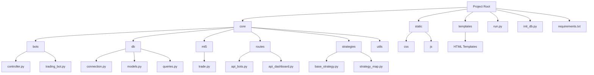
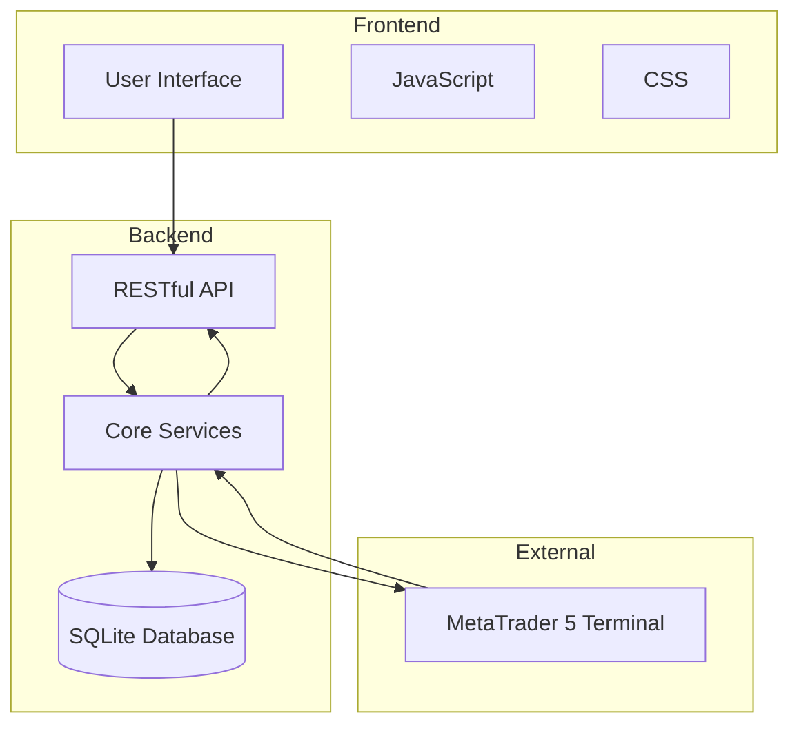
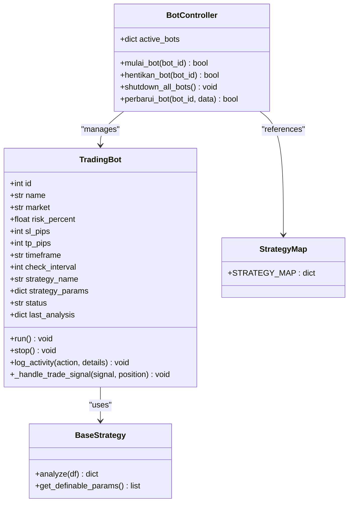
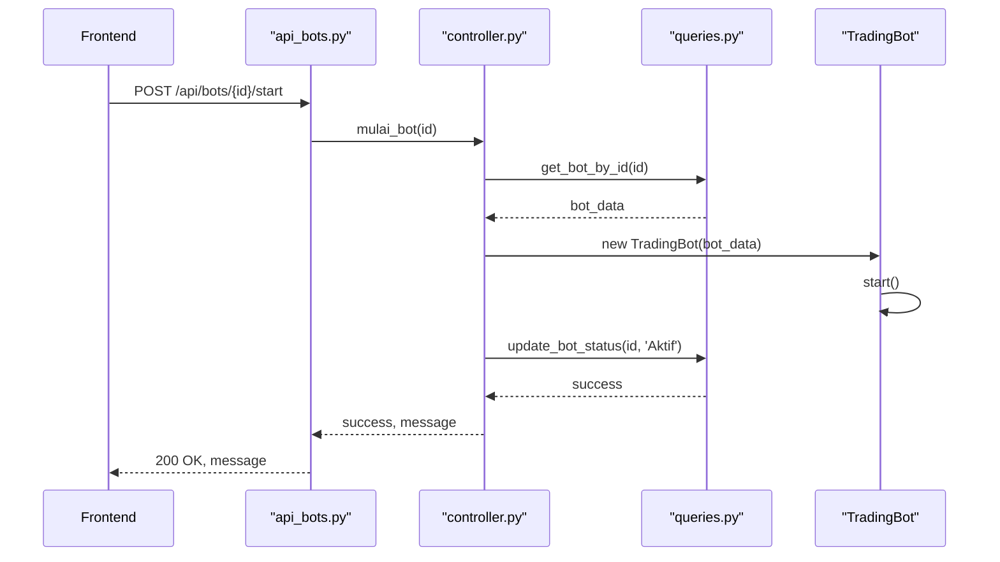
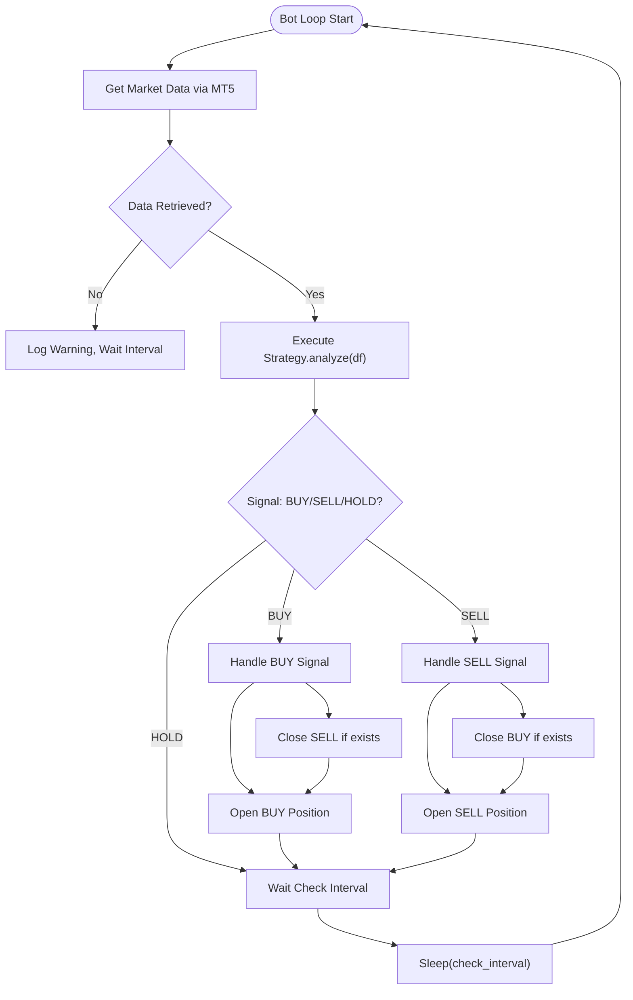
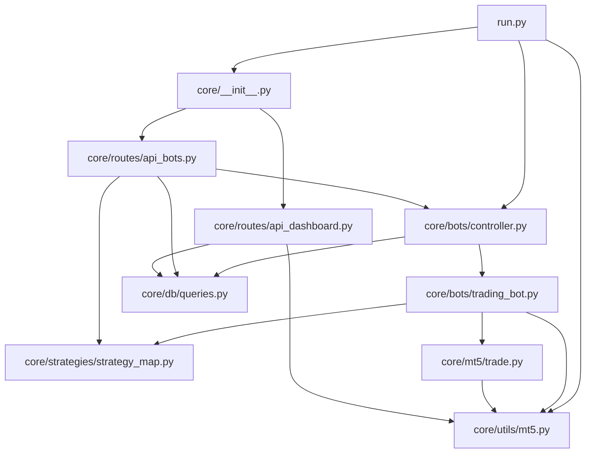

# Architecture Overview

<cite>
**Referenced Files in This Document**   
- [run.py](file://run.py)
- [core/__init__.py](file://core/__init__.py)
- [core/bots/controller.py](file://core/bots/controller.py)
- [core/bots/trading_bot.py](file://core/bots/trading_bot.py)
- [core/strategies/base_strategy.py](file://core/strategies/base_strategy.py)
- [core/strategies/strategy_map.py](file://core/strategies/strategy_map.py)
- [core/db/connection.py](file://core/db/connection.py)
- [core/db/models.py](file://core/db/models.py)
- [core/db/queries.py](file://core/db/queries.py)
- [core/mt5/trade.py](file://core/mt5/trade.py)
- [core/utils/mt5.py](file://core/utils/mt5.py)
- [core/routes/api_bots.py](file://core/routes/api_bots.py)
- [core/routes/api_dashboard.py](file://core/routes/api_dashboard.py)
</cite>

## Table of Contents
1. [Introduction](#introduction)
2. [Project Structure](#project-structure)
3. [Core Components](#core-components)
4. [Architecture Overview](#architecture-overview)
5. [Detailed Component Analysis](#detailed-component-analysis)
6. [Dependency Analysis](#dependency-analysis)
7. [Performance Considerations](#performance-considerations)
8. [Troubleshooting Guide](#troubleshooting-guide)
9. [Conclusion](#conclusion)

## Introduction
QuantumBotX is a modular, AI-powered trading platform built on Flask and integrated with the MetaTrader 5 (MT5) terminal. It enables users to create, manage, and backtest automated trading bots using a variety of technical strategies. The system follows a clean separation of concerns, dividing functionality into frontend (HTML/CSS/JS), backend logic (Python), and external MT5 integration. This document provides a comprehensive architectural overview, detailing the MVC-like structure, key components, data flows, and integration points. The design emphasizes extensibility through a plugin-style strategy system and robustness via persistent logging and error handling.

## Project Structure
The project is organized into a modular directory structure that separates concerns by functionality. The core application logic resides in the `core` directory, which contains submodules for bots, database operations, MT5 integration, routing, strategies, and utilities. Static assets (CSS, JS) and HTML templates are stored in dedicated directories, while configuration and entry points are located at the root.

**Diagram sources**
- [run.py](file://run.py#L1-L52)
- [core/__init__.py](file://core/__init__.py#L1-L138)

**Section sources**
- [run.py](file://run.py#L1-L52)
- [core/__init__.py](file://core/__init__.py#L1-L138)

## Core Components
The core components of QuantumBotX include the Flask application factory, a thread-based bot execution system, a strategy plugin architecture, and a RESTful API layer. The application is initialized via `run.py`, which sets up the Flask app, connects to MT5, and registers shutdown handlers. Bots are managed by the `controller.py` module, which maintains a dictionary of active bot threads. Each bot is an instance of the `TradingBot` class, which runs in its own thread and executes trades based on signals from a selected strategy. Strategies are implemented as classes that inherit from `BaseStrategy` and are registered in the `STRATEGY_MAP` for dynamic loading. Data persistence is handled by SQLite, with queries abstracted through the `queries.py` module.

**Section sources**
- [core/bots/controller.py](file://core/bots/controller.py#L1-L177)
- [core/bots/trading_bot.py](file://core/bots/trading_bot.py#L1-L170)
- [core/strategies/base_strategy.py](file://core/strategies/base_strategy.py#L1-L29)
- [core/strategies/strategy_map.py](file://core/strategies/strategy_map.py#L1-L28)

## Architecture Overview
QuantumBotX follows a modular, MVC-like architectural pattern with clear separation between the user interface, business logic, and data layers. The Flask application serves as the central hub, routing HTTP requests to appropriate API endpoints. These endpoints interact with core services that manage bot lifecycle, strategy execution, and data retrieval. The system integrates with the MetaTrader 5 terminal for real-time market data and trade execution. A SQLite database provides lightweight persistence for bot configurations, trade history, and notifications.

**Diagram sources**
- [run.py](file://run.py#L1-L52)
- [core/__init__.py](file://core/__init__.py#L1-L138)
- [core/routes/api_bots.py](file://core/routes/api_bots.py#L1-L168)
- [core/routes/api_dashboard.py](file://core/routes/api_dashboard.py#L1-L29)

## Detailed Component Analysis

### Bot Management System
The bot management system is responsible for creating, starting, stopping, and monitoring trading bots. It uses a thread-based model where each active bot runs in its own thread, allowing for concurrent execution without blocking the main application.

#### Class Diagram for Bot System

**Diagram sources**
- [core/bots/trading_bot.py](file://core/bots/trading_bot.py#L1-L170)
- [core/strategies/base_strategy.py](file://core/strategies/base_strategy.py#L1-L29)
- [core/strategies/strategy_map.py](file://core/strategies/strategy_map.py#L1-L28)
- [core/bots/controller.py](file://core/bots/controller.py#L1-L177)

### API Layer
The API layer exposes RESTful endpoints for managing bots, retrieving dashboard data, and interacting with trading strategies. It acts as the bridge between the frontend and the backend services.

#### Sequence Diagram for Bot Start Request

**Diagram sources**
- [core/routes/api_bots.py](file://core/routes/api_bots.py#L1-L168)
- [core/bots/controller.py](file://core/bots/controller.py#L1-L177)
- [core/db/queries.py](file://core/db/queries.py#L1-L175)

### Strategy Plugin System
The strategy plugin system allows for extensible trading logic by defining a common interface (`BaseStrategy`) that all strategies must implement. Strategies are dynamically loaded via the `STRATEGY_MAP`, enabling easy addition of new strategies without modifying core code.

#### Flowchart for Strategy Execution

**Diagram sources**
- [core/bots/trading_bot.py](file://core/bots/trading_bot.py#L1-L170)
- [core/strategies/base_strategy.py](file://core/strategies/base_strategy.py#L1-L29)

**Section sources**
- [core/bots/trading_bot.py](file://core/bots/trading_bot.py#L1-L170)
- [core/strategies/base_strategy.py](file://core/strategies/base_strategy.py#L1-L29)

## Dependency Analysis
The QuantumBotX application has a well-defined dependency graph with minimal circular dependencies. The core modules depend on standard libraries and the MetaTrader5 package, while internal modules maintain loose coupling through defined interfaces.

**Diagram sources**
- [run.py](file://run.py#L1-L52)
- [core/__init__.py](file://core/__init__.py#L1-L138)
- [core/bots/controller.py](file://core/bots/controller.py#L1-L177)
- [core/bots/trading_bot.py](file://core/bots/trading_bot.py#L1-L170)
- [core/mt5/trade.py](file://core/mt5/trade.py#L1-L153)
- [core/routes/api_bots.py](file://core/routes/api_bots.py#L1-L168)
- [core/routes/api_dashboard.py](file://core/routes/api_dashboard.py#L1-L29)

**Section sources**
- [run.py](file://run.py#L1-L52)
- [core/__init__.py](file://core/__init__.py#L1-L138)
- [core/bots/controller.py](file://core/bots/controller.py#L1-L177)

## Performance Considerations
The current architecture uses threading for bot execution, which is suitable for I/O-bound tasks like market data retrieval and trade execution. However, Python's Global Interpreter Lock (GIL) limits true parallelism, making this model less efficient for CPU-intensive strategies. The use of SQLite provides fast, lightweight persistence but may become a bottleneck with high-frequency trading or large datasets. The polling-based approach in `TradingBot.run()` introduces a small delay between analysis cycles, determined by the `check_interval` parameter. For improved scalability, a message queue system (e.g., Redis, RabbitMQ) could decouple bot execution from the main application, and a more robust database (e.g., PostgreSQL) could handle larger data volumes.

## Troubleshooting Guide
Common issues in QuantumBotX typically relate to MT5 connectivity, symbol resolution, or database operations. The system logs detailed information to both console and file (in production mode), which should be the first place to check for errors. If a bot fails to start, verify that the MT5 terminal is running and that the symbol exists in the Market Watch. Database issues can often be resolved by checking the `bots.db` file permissions and integrity. The `/api/health` endpoint can be used to verify that the Flask server is running. For strategy-specific problems, ensure that all required parameters are correctly configured and that the market data is available for the selected timeframe.

**Section sources**
- [run.py](file://run.py#L1-L52)
- [core/utils/logger.py](file://core/utils/logger.py)
- [core/db/queries.py](file://core/db/queries.py#L1-L175)
- [core/utils/mt5.py](file://core/utils/mt5.py#L1-L145)

## Conclusion
QuantumBotX presents a well-structured, modular architecture for automated trading with clear separation of concerns and extensible design. Its use of Flask, threading, and a plugin-based strategy system makes it accessible for development and customization. The integration with MetaTrader 5 provides reliable access to real trading environments, while the SQLite backend ensures simple deployment. Future improvements could include containerization for easier deployment, adoption of async/await for better concurrency, and implementation of a distributed backtesting framework for improved performance and scalability.