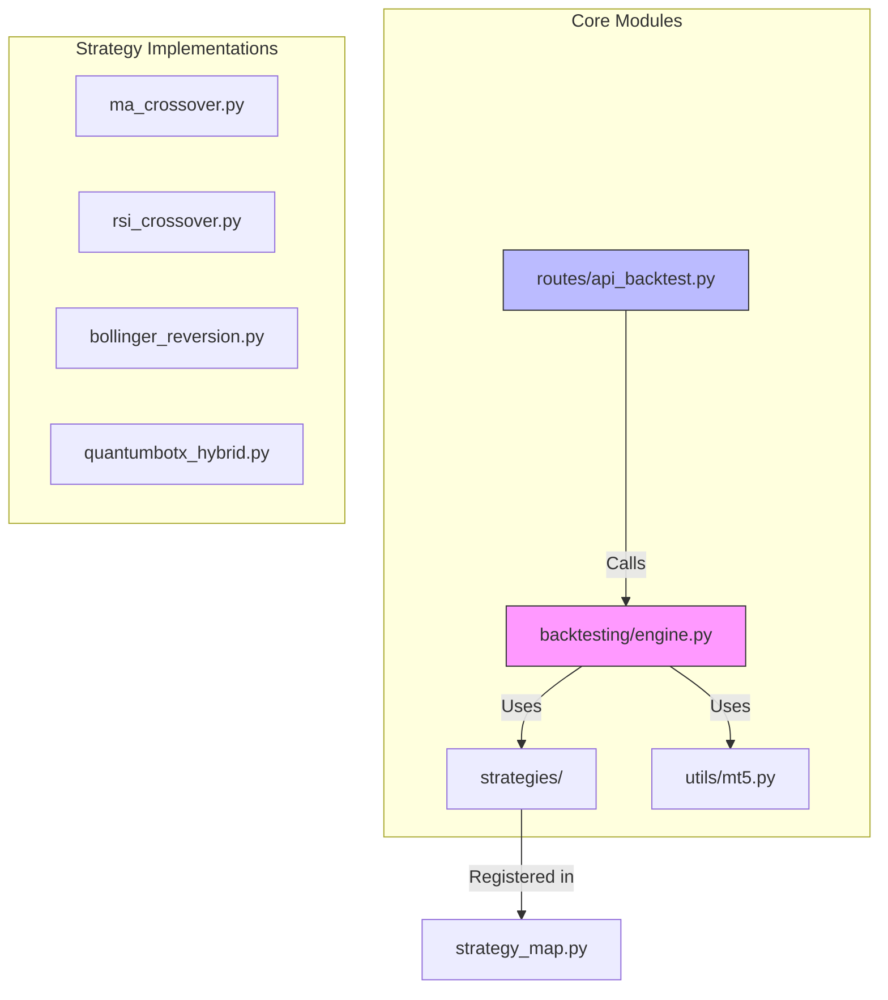
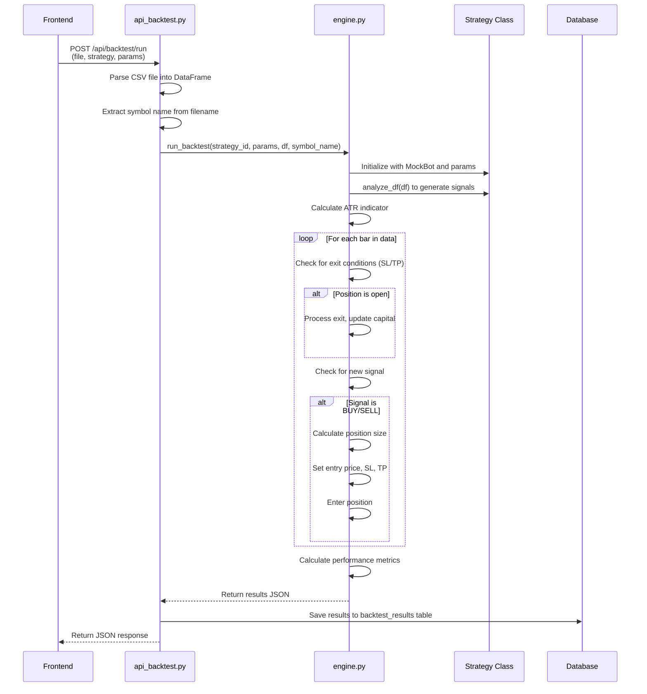
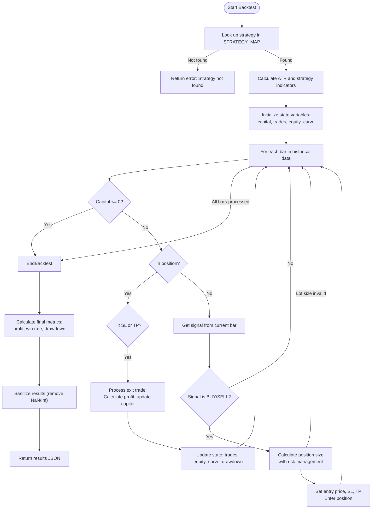
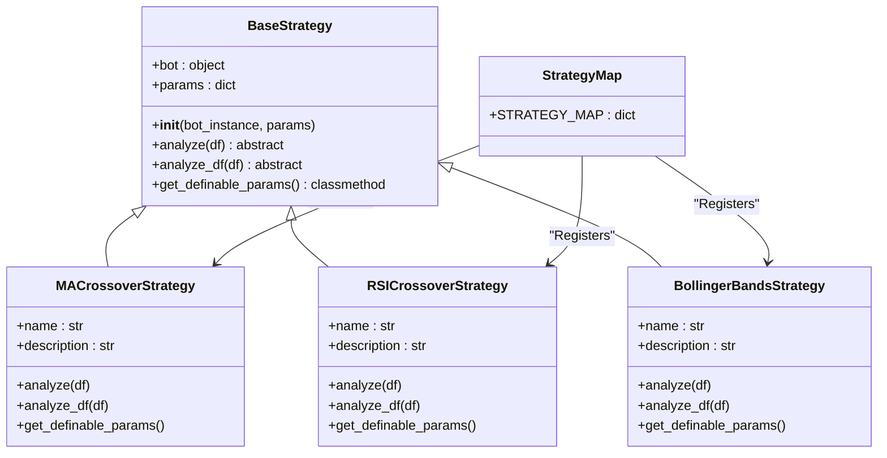
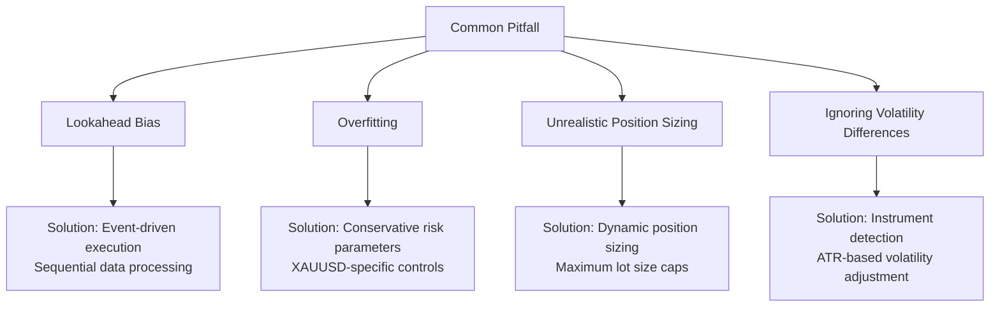

# Backtesting Engine

<cite>
**Referenced Files in This Document**   
- [engine.py](file://core/backtesting/engine.py)
- [base_strategy.py](file://core/strategies/base_strategy.py)
- [ma_crossover.py](file://core/strategies/ma_crossover.py)
- [strategy_map.py](file://core/strategies/strategy_map.py)
- [api_backtest.py](file://core/routes/api_backtest.py)
- [mt5.py](file://core/utils/mt5.py)
</cite>

## Table of Contents
1. [Introduction](#introduction)
2. [Project Structure](#project-structure)
3. [Core Components](#core-components)
4. [Architecture Overview](#architecture-overview)
5. [Detailed Component Analysis](#detailed-component-analysis)
6. [Performance Metrics Calculation](#performance-metrics-calculation)
7. [Data Loading from MT5](#data-loading-from-mt5)
8. [Event-Driven Execution](#event-driven-execution)
9. [Position Sizing and Risk Management](#position-sizing-and-risk-management)
10. [API Integration](#api-integration)
11. [Common Pitfalls and Prevention](#common-pitfalls-and-prevention)
12. [Optimization Techniques](#optimization-techniques)
13. [Performance Considerations](#performance-considerations)
14. [Conclusion](#conclusion)

## Introduction
The Backtesting Engine in quantumbotx is a comprehensive system designed to simulate historical trading performance of algorithmic strategies. It enables users to evaluate strategy effectiveness by replaying historical market data and simulating trades under configurable conditions. The engine supports various financial instruments, with special handling for volatile assets like XAUUSD (Gold). It integrates with MetaTrader 5 (MT5) for data retrieval and provides a robust API for web-based interaction. The system emphasizes risk management, particularly for high-volatility instruments, and includes sophisticated position sizing logic to prevent account blowouts during backtesting.

## Project Structure
The quantumbotx repository follows a modular structure with clear separation of concerns. The backtesting functionality is primarily located in the `core/backtesting` directory, while strategy implementations reside in `core/strategies`. Data access utilities are in `core/utils`, and API endpoints are defined in `core/routes`. This organization facilitates maintainability and scalability of the system.



**Diagram sources**
- [engine.py](file://core/backtesting/engine.py)
- [strategy_map.py](file://core/strategies/strategy_map.py)
- [api_backtest.py](file://core/routes/api_backtest.py)
- [mt5.py](file://core/utils/mt5.py)

**Section sources**
- [engine.py](file://core/backtesting/engine.py)
- [strategy_map.py](file://core/strategies/strategy_map.py)

## Core Components
The backtesting system comprises several key components that work together to provide a complete simulation environment. The core is the `run_backtest` function in `engine.py`, which orchestrates the entire backtesting process. It initializes a strategy instance, processes historical data, manages position states, and calculates performance metrics. Strategies are implemented as classes that inherit from `BaseStrategy` and must implement the `analyze` and `analyze_df` methods. The `STRATEGY_MAP` dictionary in `strategy_map.py` serves as a registry that maps strategy IDs to their corresponding classes. The API endpoint in `api_backtest.py` provides a web interface to the backtesting engine, allowing users to upload data files and configure parameters through a browser.

**Section sources**
- [engine.py](file://core/backtesting/engine.py)
- [base_strategy.py](file://core/strategies/base_strategy.py)
- [strategy_map.py](file://core/strategies/strategy_map.py)
- [api_backtest.py](file://core/routes/api_backtest.py)

## Architecture Overview
The backtesting engine follows a modular architecture with clear separation between data processing, strategy execution, and result reporting. The system is designed to be event-driven, processing one bar of historical data at a time and responding to market events such as entry signals and stop-loss triggers. This architecture ensures that the simulation accurately reflects real-world trading conditions and prevents lookahead bias.



**Diagram sources**
- [engine.py](file://core/backtesting/engine.py)
- [api_backtest.py](file://core/routes/api_backtest.py)

## Detailed Component Analysis

### Backtesting Engine Analysis
The `run_backtest` function is the heart of the system, implementing a bar-by-bar replay of historical data. It follows a four-step process: indicator pre-calculation, state initialization, data loop processing, and final results calculation. The engine uses a `MockBot` class to provide a consistent interface for strategies, mimicking the structure of the live trading bot. This design allows strategies to be tested in isolation from the execution context, ensuring consistent behavior between backtesting and live trading environments.



**Diagram sources**
- [engine.py](file://core/backtesting/engine.py)

**Section sources**
- [engine.py](file://core/backtesting/engine.py)

### Strategy Interface Analysis
The strategy system is built around the `BaseStrategy` abstract class, which defines a common interface for all trading strategies. Concrete strategies inherit from this base class and implement the required methods. This object-oriented design promotes code reuse and ensures consistency across different strategy implementations. The `analyze_df` method is specifically designed for backtesting, allowing strategies to efficiently process entire datasets at once, while the `analyze` method is used for live trading with incremental data.



**Diagram sources**
- [base_strategy.py](file://core/strategies/base_strategy.py)
- [ma_crossover.py](file://core/strategies/ma_crossover.py)

**Section sources**
- [base_strategy.py](file://core/strategies/base_strategy.py)
- [ma_crossover.py](file://core/strategies/ma_crossover.py)

## Performance Metrics Calculation
The backtesting engine calculates a comprehensive set of performance metrics to evaluate strategy effectiveness. These metrics are computed at the end of the simulation based on the trade history and equity curve. The primary metrics include total profit in USD, win rate percentage, maximum drawdown percentage, total number of trades, and the final capital amount. The engine also returns the complete equity curve and a log of the last 20 trades for detailed analysis.

The win rate is calculated as the percentage of winning trades out of the total number of trades. Maximum drawdown is computed as the largest peak-to-trough decline in the equity curve, expressed as a percentage of the peak equity. These metrics are essential for assessing the risk-reward profile of a trading strategy.

```python
# Performance metrics calculation from engine.py
wins = len([t for t in trades if t['profit'] > 0])
losses = len(trades) - wins
win_rate = (wins / len(trades) * 100) if trades else 0

# Maximum drawdown calculation
peak_equity = initial_capital
max_drawdown = 0.0
for equity in equity_curve:
    if equity > peak_equity:
        peak_equity = equity
    drawdown = (peak_equity - equity) / peak_equity if peak_equity > 0 else 0
    max_drawdown = max(max_drawdown, drawdown)
```

The engine includes safeguards to handle edge cases, such as returning a win rate of 0% when no trades are executed and sanitizing results to remove NaN or infinite values that could occur due to calculation errors.

**Section sources**
- [engine.py](file://core/backtesting/engine.py)

## Data Loading from MT5
Historical data for backtesting is primarily sourced from MetaTrader 5 (MT5) through the `get_rates_mt5` function in `mt5.py`. This utility function retrieves price data for a specified symbol, timeframe, and number of bars, returning it as a pandas DataFrame. The data includes open, high, low, close prices, and volume for each time period.

The `get_rates_mt5` function handles error conditions gracefully, returning an empty DataFrame if data retrieval fails. It also converts the timestamp from Unix format to a proper datetime object and sets it as the DataFrame index, making the data ready for analysis. For backtesting, users typically download data using scripts like `lab/download_data.py` and save it as CSV files, which are then uploaded through the web interface.

```python
# Data loading from MT5
def get_rates_mt5(symbol: str, timeframe: int, count: int = 100):
    """Retrieve historical price data from MT5 as DataFrame."""
    try:
        rates = mt5.copy_rates_from_pos(symbol, timeframe, 0, count)
        if rates is None or len(rates) == 0:
            logger.warning(f"Failed to retrieve price data for {symbol}")
            return pd.DataFrame()
        
        df = pd.DataFrame(rates)
        df['time'] = pd.to_datetime(df['time'], unit='s')
        df.set_index('time', inplace=True)
        return df
    except Exception as e:
        logger.error(f"Error in get_rates_mt5 for {symbol}: {e}")
        return pd.DataFrame()
```

The system also includes a `find_mt5_symbol` function that helps resolve symbol names, particularly useful when different brokers use varying naming conventions for the same financial instrument.

**Section sources**
- [mt5.py](file://core/utils/mt5.py)

## Event-Driven Execution
The backtesting engine implements an event-driven execution model, processing market events as they occur in the historical data sequence. The primary events are entry signals generated by the strategy and exit conditions triggered by price movement. The engine processes these events in chronological order, ensuring that trades are executed based on information available at the time, which prevents lookahead bias.

Entry events occur when the strategy generates a BUY or SELL signal. The engine responds by calculating the appropriate position size, setting stop-loss and take-profit levels based on ATR (Average True Range), and entering the position at the current bar's close price. Exit events are triggered when the price reaches either the stop-loss or take-profit level, at which point the trade is closed and the profit or loss is calculated.

```python
# Event-driven execution loop
for i in range(1, len(df_with_signals)):
    current_bar = df_with_signals.iloc[i]
    
    # Handle exit events if in position
    if in_position:
        exit_price = None
        if position_type == 'BUY' and current_bar['low'] <= sl_price:
            exit_price = sl_price
        elif position_type == 'BUY' and current_bar['high'] >= tp_price:
            exit_price = tp_price
        # Similar conditions for SELL positions
        
        if exit_price is not None:
            # Process exit event
            profit = calculate_profit(position_type, entry_price, exit_price, lot_size, contract_size)
            capital += profit
            # Update state and record trade
            in_position = False
    
    # Handle entry events if not in position
    if not in_position:
        signal = current_bar.get("signal", "HOLD")
        if signal in ['BUY', 'SELL']:
            # Process entry event
            entry_price = current_bar['close']
            atr_value = current_bar['ATRr_14']
            # Calculate SL and TP based on ATR
            # Calculate position size based on risk parameters
            in_position = True
            position_type = signal
```

This event-driven approach ensures that the simulation accurately reflects how a strategy would perform in real trading conditions, where decisions must be made based on current and past information only.

**Section sources**
- [engine.py](file://core/backtesting/engine.py)

## Position Sizing and Risk Management
The backtesting engine implements sophisticated position sizing and risk management, particularly for high-volatility instruments like XAUUSD (Gold). The system uses a dynamic position sizing model based on the user's risk percentage, stop-loss distance, and account capital. For most instruments, the position size is calculated to risk a specific percentage of the current capital on each trade.

For XAUUSD, the engine applies additional risk controls due to the instrument's extreme volatility. These include capping the maximum risk percentage at 1.0%, limiting stop-loss and take-profit ATR multipliers, and using a fixed lot size system instead of dynamic calculation. The engine also implements an "emergency brake" system that skips trades if the estimated risk exceeds 5% of the account capital.

```python
# Position sizing logic for XAUUSD
if is_gold:
    # Use fixed lot sizes based on risk percentage
    if risk_percent <= 0.25:
        base_lot_size = 0.01
    elif risk_percent <= 0.5:
        base_lot_size = 0.01
    elif risk_percent <= 0.75:
        base_lot_size = 0.02
    elif risk_percent <= 1.0:
        base_lot_size = 0.02
    else:
        base_lot_size = 0.03
    
    # Additional reduction for high ATR values
    if atr_value > 30.0:  # Extreme volatility
        lot_size = 0.01
    elif atr_value > 20.0:  # High volatility
        lot_size = max(0.01, base_lot_size * 0.5)
    else:  # Normal volatility
        lot_size = base_lot_size
    
    # Final safety cap
    if lot_size > 0.03:
        lot_size = 0.03
    
    # Emergency brake if risk is too high
    max_risk_dollar = capital * 0.05
    if estimated_risk > max_risk_dollar:
        continue  # Skip the trade
else:
    # Standard forex calculation
    risk_in_currency_per_lot = sl_distance * contract_size
    calculated_lot_size = amount_to_risk / risk_in_currency_per_lot
    lot_size = round(calculated_lot_size, 2)
```

This multi-layered risk management approach ensures that backtests for volatile instruments are realistic and do not produce misleading results due to excessive position sizing.

**Section sources**
- [engine.py](file://core/backtesting/engine.py)

## API Integration
The backtesting engine is exposed through a REST API endpoint defined in `api_backtest.py`. This endpoint allows users to run backtests by uploading a CSV file containing historical data and specifying the strategy and parameters. The API handles file parsing, data validation, and result serialization, making it easy to integrate the backtesting functionality into web applications.

The `/api/backtest/run` endpoint accepts a POST request with a file upload and form data containing the strategy ID and parameters. It parses the CSV file into a pandas DataFrame, extracts the symbol name from the filename for accurate instrument detection, and calls the `run_backtest` function. Successful results are saved to the database before being returned to the client as JSON.

```python
@api_backtest.route('/api/backtest/run', methods=['POST'])
def run_backtest_route():
    if 'file' not in request.files:
        return jsonify({"error": "No data file uploaded"}), 400
    
    file = request.files['file']
    if file.filename == '':
        return jsonify({"error": "Empty filename"}), 400

    try:
        df = pd.read_csv(file, parse_dates=['time'])
        strategy_id = request.form.get('strategy')
        params = json.loads(request.form.get('params', '{}'))
        
        # Extract symbol name from filename for accurate XAUUSD detection
        symbol_name = None
        if file.filename:
            filename_parts = file.filename.replace('.csv', '').split('_')
            if filename_parts:
                symbol_name = filename_parts[0].upper()
        
        # Run backtest with symbol name
        results = run_backtest(strategy_id, params, df, symbol_name=symbol_name)

        # Save results to database
        if results and not results.get('error'):
            strategy_name = results.get('strategy_name', strategy_id)
            save_backtest_result(strategy_name, file.filename, params, results)

        return jsonify(results)
    except Exception as e:
        return jsonify({"error": f"Backtesting error: {str(e)}"}), 500
```

The API also provides a `/api/backtest/history` endpoint to retrieve previously saved backtest results from the database, allowing users to review past simulations.

**Section sources**
- [api_backtest.py](file://core/routes/api_backtest.py)

## Common Pitfalls and Prevention
The backtesting engine incorporates several features to prevent common pitfalls in algorithmic trading strategy evaluation. Lookahead bias is prevented by the event-driven execution model, which processes data sequentially and only uses information available at each point in time. The `analyze_df` method in strategies is carefully designed to avoid using future data when generating signals.

Overfitting is mitigated through the use of realistic risk management parameters, particularly for volatile instruments like XAUUSD. The engine's conservative position sizing for gold prevents strategies from appearing profitable due to excessive leverage that would be unsustainable in live trading. The inclusion of transaction costs is not explicitly modeled, but the tight stop-loss levels and realistic position sizing help approximate the impact of slippage and commissions.

The system also addresses the issue of position sizing by implementing instrument-specific risk parameters. This prevents strategies from taking positions that are too large relative to the account size, which could lead to account blowouts in real trading. The emergency brake system for high-risk trades further protects against unrealistic results.



These preventative measures ensure that backtest results are more likely to reflect real-world trading performance, increasing the reliability of strategy evaluation.

**Section sources**
- [engine.py](file://core/backtesting/engine.py)

## Optimization Techniques
While the core backtesting engine does not include built-in optimization features, it is designed to support external optimization techniques such as parameter scanning and walk-forward analysis. The modular design allows for easy integration with optimization frameworks that can systematically test different parameter combinations and evaluate their performance.

Parameter scanning can be implemented by calling the `run_backtest` function multiple times with different parameter sets and comparing the results. For example, a grid search could test various combinations of moving average periods, risk percentages, and stop-loss multipliers to find the optimal configuration for a particular strategy and market condition.

Walk-forward analysis can be implemented by dividing the historical data into in-sample and out-of-sample periods, optimizing parameters on the in-sample data, and testing performance on the out-of-sample data. This process can be repeated by rolling the window forward to assess the robustness of the strategy across different market regimes.

```python
# Example of parameter scanning
def optimize_strategy(strategy_id, df, symbol_name=None):
    best_result = None
    best_params = None
    
    # Test different parameter combinations
    for lot_size in [0.5, 1.0, 1.5, 2.0]:
        for sl_pips in [1.0, 1.5, 2.0, 2.5]:
            for tp_pips in [2.0, 3.0, 4.0, 5.0]:
                params = {
                    'lot_size': lot_size,
                    'sl_pips': sl_pips,
                    'tp_pips': tp_pips
                }
                
                result = run_backtest(strategy_id, params, df, symbol_name)
                
                # Use a performance metric to evaluate results
                if best_result is None or result.get('total_profit_usd', 0) > best_result.get('total_profit_usd', 0):
                    best_result = result
                    best_params = params
    
    return best_params, best_result
```

The API design also facilitates optimization by allowing programmatic access to the backtesting functionality, enabling the development of automated optimization workflows.

**Section sources**
- [engine.py](file://core/backtesting/engine.py)

## Performance Considerations
The backtesting engine is designed to handle large datasets efficiently, though performance depends on the length of the historical data and the complexity of the strategy being tested. The use of pandas DataFrames for data storage and manipulation provides good performance for typical backtesting scenarios, with vectorized operations for indicator calculations.

For very large datasets, the engine's performance can be optimized by processing data in chunks or using more efficient data storage formats like Parquet instead of CSV. The current implementation loads the entire dataset into memory, which may become a limitation for extremely long historical periods or high-frequency data.

The engine's computational complexity is primarily determined by the strategy's indicator calculations and the number of trades executed. Strategies with complex indicators or high trading frequency will naturally take longer to backtest. The system does not currently implement parallel processing for multiple backtests, but the modular design would allow for such enhancements.

Memory usage is generally moderate, as the engine only maintains essential state variables during the simulation. The results are stored efficiently, with only the last 20 trades included in the output to limit JSON size. For long-term storage, results are serialized to JSON and saved in the database, with proper handling of NaN and infinite values to prevent database errors.

```python
# Memory-efficient result handling
return {
    "strategy_name": strategy_class.name,
    "total_trades": len(trades),
    "final_capital": final_capital,
    "total_profit_usd": total_profit_clean,
    "win_rate_percent": win_rate_clean,
    "wins": wins,
    "losses": losses,
    "max_drawdown_percent": max_drawdown_clean,
    "equity_curve": equity_curve,
    "trades": trades[-20:]  # Only last 20 trades
}
```

These performance characteristics make the engine suitable for interactive use with typical historical datasets while leaving room for optimization in high-performance scenarios.

**Section sources**
- [engine.py](file://core/backtesting/engine.py)
- [api_backtest.py](file://core/routes/api_backtest.py)

## Conclusion
The Backtesting Engine in quantumbotx provides a robust framework for evaluating algorithmic trading strategies through historical simulation. Its modular architecture separates concerns between data processing, strategy execution, and result reporting, enabling maintainable and extensible code. The engine's event-driven execution model ensures realistic simulation of trading conditions, while sophisticated risk management features prevent misleading results, particularly for volatile instruments like XAUUSD.

Key strengths of the system include its seamless integration with MetaTrader 5 for data retrieval, a well-defined strategy interface that promotes code reuse, and a comprehensive API for web-based interaction. The engine calculates essential performance metrics and includes safeguards against common pitfalls like lookahead bias and overfitting.

Future enhancements could include explicit modeling of transaction costs, support for multi-asset portfolios, and built-in optimization features. However, the current design provides a solid foundation for strategy development and evaluation, with the flexibility to support these and other advanced features as needed.