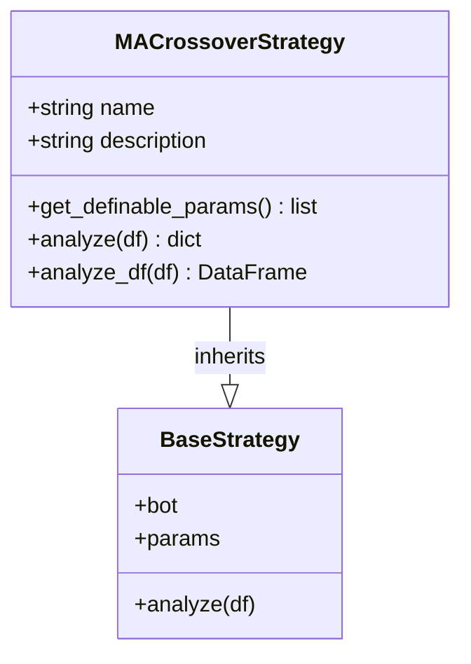
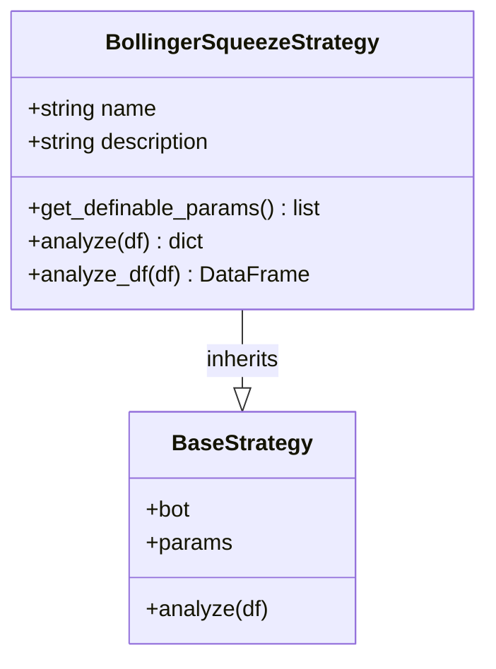
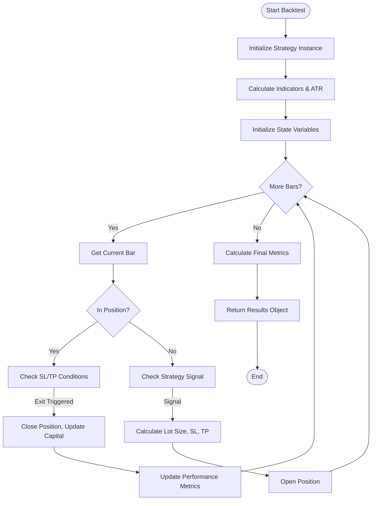
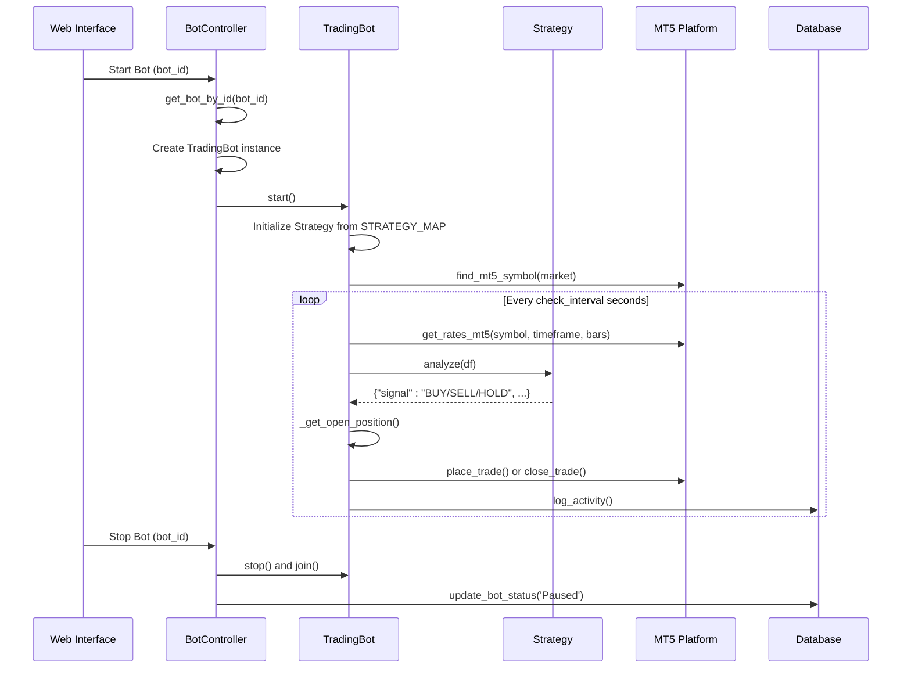
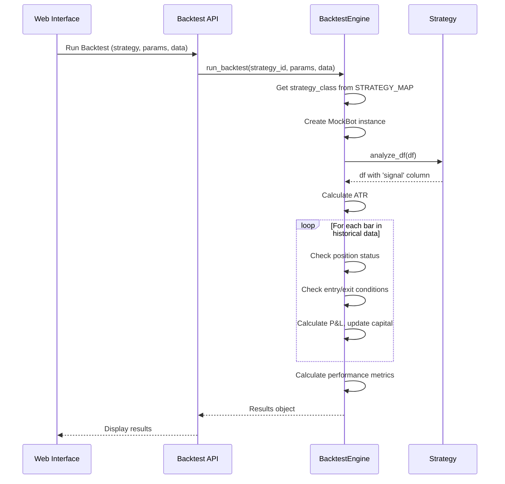

# Core Components

<cite>
**Referenced Files in This Document**   
- [trading_bot.py](file://core/bots/trading_bot.py#L1-L170)
- [base_strategy.py](file://core/strategies/base_strategy.py#L1-L29)
- [strategy_map.py](file://core/strategies/strategy_map.py#L1-L28)
- [ma_crossover.py](file://core/strategies/ma_crossover.py#L1-L61)
- [bollinger_squeeze.py](file://core/strategies/bollinger_squeeze.py#L1-L89)
- [models.py](file://core/db/models.py#L1-L21)
- [engine.py](file://core/backtesting/engine.py#L1-L318)
- [trade.py](file://core/mt5/trade.py#L1-L153)
- [controller.py](file://core/bots/controller.py#L1-L177)
</cite>

## Table of Contents
1. [Core Components](#core-components)
2. [TradingBot: Threaded Execution Engine](#tradingbot-threaded-execution-engine)
3. [Strategy System: Abstract Base and Concrete Implementations](#strategy-system-abstract-base-and-concrete-implementations)
4. [Database Layer: SQLite Schema and Persistence](#database-layer-sqlite-schema-and-persistence)
5. [MT5 Integration: Market Data and Order Execution](#mt5-integration-market-data-and-order-execution)
6. [Backtesting Engine: Historical Simulation and Metrics](#backtesting-engine-historical-simulation-and-metrics)
7. [Component Interaction Flow](#component-interaction-flow)
8. [Common Issues and Considerations](#common-issues-and-considerations)

## Core Components

This document provides a comprehensive analysis of the core components of the QuantumBotX trading system. It details the architecture, implementation, and interaction of key modules including the TradingBot, Strategy system, Database layer, MT5 integration, and Backtesting Engine. The analysis is based on direct examination of the source code and illustrates how these components work together to enable automated trading strategies.

## TradingBot: Threaded Execution Engine

The `TradingBot` class is the central execution unit of the QuantumBotX system, responsible for running trading strategies in a continuous loop on a separate thread. It manages the lifecycle of a trading bot, including initialization, market data retrieval, strategy execution, trade handling, and graceful shutdown.

The bot is implemented as a subclass of Python's `threading.Thread`, allowing it to run independently of the main application. Upon starting, it initializes the specified trading strategy, connects to the MetaTrader 5 (MT5) platform, and enters a loop that periodically checks for trading signals based on the configured `check_interval`.

Key responsibilities of the `TradingBot` include:
- **Symbol Verification**: Uses `find_mt5_symbol` to ensure the trading symbol is available in MT5's Market Watch.
- **Strategy Initialization**: Loads the appropriate strategy class from `STRATEGY_MAP` using the strategy name.
- **Market Data Retrieval**: Fetches historical price data via `get_rates_mt5` for the specified timeframe.
- **Signal Processing**: Passes data to the strategy instance for analysis and receives buy/sell/hold signals.
- **Trade Execution**: Manages opening and closing positions through the MT5 integration layer.
- **State Management**: Maintains the bot's status and last analysis result for monitoring.

```python
class TradingBot(threading.Thread):
    def __init__(self, id, name, market, risk_percent, sl_pips, tp_pips, timeframe, 
                 check_interval, strategy, strategy_params={}, status='Paused'):
        super().__init__()
        self.id = id
        self.name = name
        self.market = market
        self.risk_percent = risk_percent
        self.sl_pips = sl_pips
        self.tp_pips = tp_pips
        self.timeframe = timeframe
        self.check_interval = check_interval
        self.strategy_name = strategy
        self.strategy_params = strategy_params
        self.status = status
        self.last_analysis = {"signal": "LOADING", "explanation": "Bot starting, awaiting first analysis..."}
        self._stop_event = threading.Event()
        self.strategy_instance = None
```

The `run()` method contains the main execution loop, which continues until the `_stop_event` is set. It handles exceptions gracefully and updates the bot's status accordingly. The `_handle_trade_signal()` method implements logic to close opposing positions before opening new ones, ensuring only one position exists per bot at a time.

**Section sources**
- [trading_bot.py](file://core/bots/trading_bot.py#L1-L170)

## Strategy System: Abstract Base and Concrete Implementations

The strategy system is built around an object-oriented design with a clear separation between the abstract base class and concrete strategy implementations. This architecture enables extensibility and consistent behavior across different trading strategies.

### Base Strategy Contract

The `BaseStrategy` abstract base class defines the contract that all trading strategies must follow. It requires concrete strategies to implement the `analyze()` method and provides a default implementation for `get_definable_params()`.

```python
class BaseStrategy(ABC):
    def __init__(self, bot_instance, params: dict = {}):
        self.bot = bot_instance
        self.params = params

    @abstractmethod
    def analyze(self, df):
        raise NotImplementedError("Each strategy must implement the `analyze(df)` method.")

    @classmethod
    def get_definable_params(cls):
        return []
```

The `analyze()` method is designed for live trading, processing a DataFrame of recent market data to generate a trading signal. Strategies can access their parent bot instance and user-defined parameters through `self.bot` and `self.params`.

### Strategy Registry

Strategies are registered in a central `STRATEGY_MAP` dictionary, which maps string identifiers to strategy classes. This allows the `TradingBot` to dynamically instantiate the correct strategy based on configuration.

```python
STRATEGY_MAP = {
    'MA_CROSSOVER': MACrossoverStrategy,
    'QUANTUMBOTX_HYBRID': QuantumBotXHybridStrategy,
    'RSI_CROSSOVER': RSICrossoverStrategy,
    # ... other strategies
}
```

### Concrete Strategy Examples

#### MA Crossover Strategy

The `MACrossoverStrategy` generates signals based on the crossover of two moving averages. It allows users to configure the periods for the fast and slow moving averages.



**Diagram sources**
- [ma_crossover.py](file://core/strategies/ma_crossover.py#L1-L61)
- [base_strategy.py](file://core/strategies/base_strategy.py#L1-L29)

#### Bollinger Squeeze Strategy

The `BollingerSqueezeStrategy` identifies periods of low volatility (squeeze) and generates breakout signals when price moves outside the Bollinger Bands. It incorporates additional filters using RSI to avoid overbought/oversold conditions.



**Diagram sources**
- [bollinger_squeeze.py](file://core/strategies/bollinger_squeeze.py#L1-L89)
- [base_strategy.py](file://core/strategies/base_strategy.py#L1-L29)

Both strategies implement a dual-method pattern: `analyze()` for live trading and `analyze_df()` for backtesting, allowing optimized processing for each context.

**Section sources**
- [base_strategy.py](file://core/strategies/base_strategy.py#L1-L29)
- [strategy_map.py](file://core/strategies/strategy_map.py#L1-L28)
- [ma_crossover.py](file://core/strategies/ma_crossover.py#L1-L61)
- [bollinger_squeeze.py](file://core/strategies/bollinger_squeeze.py#L1-L89)

## Database Layer: SQLite Schema and Persistence

The database layer provides persistence for bot configurations, trade history, and notifications using SQLite. The system uses a simple but effective schema with minimal direct SQL operations.

The primary data model consists of:
- **Bots**: Stores configuration for each trading bot (name, market, strategy, parameters, risk settings)
- **Trade History**: Logs all bot activities and trade actions
- **Notifications**: Stores user notifications generated by bot events

The `log_trade_action` function in `models.py` demonstrates the core persistence pattern, inserting records into the `trade_history` table and conditionally creating notifications.

```python
def log_trade_action(bot_id, action, details):
    try:
        with sqlite3.connect('bots.db') as conn:
            cursor = conn.cursor()
            cursor.execute(
                'INSERT INTO trade_history (bot_id, action, details) VALUES (?, ?, ?)',
                (bot_id, action, details)
            )
            if action.startswith("POSITION") or action.startswith("FAILED") or action.startswith("AUTO"):
                notif_msg = f"Bot ID {bot_id} - {details}"
                cursor.execute(
                    'INSERT INTO notifications (bot_id, message) VALUES (?, ?)',
                    (bot_id, notif_msg)
                )
            conn.commit()
    except Exception as e:
        print(f"[DB ERROR] Failed to log action: {e}")
```

The database operations are abstracted through the `queries.py` module (referenced but not analyzed), which is called by the bot controller and trading bot for CRUD operations.

**Section sources**
- [models.py](file://core/db/models.py#L1-L21)

## MT5 Integration: Market Data and Order Execution

The MT5 integration layer provides bidirectional communication with the MetaTrader 5 platform for market data retrieval and trade execution.

### Trade Execution

The `place_trade` function handles the complete order placement process:
1. Retrieves market data to calculate ATR for dynamic stop-loss and take-profit levels
2. Calculates appropriate lot size based on risk percentage and stop distance
3. Constructs and sends the order request to MT5
4. Handles success and failure responses

```python
def place_trade(symbol, order_type, risk_percent, sl_atr_multiplier, tp_atr_multiplier, magic_id, timeframe_str):
    # Get ATR for dynamic SL/TP
    df = get_rates_mt5(symbol, timeframe_const, 30)
    atr = ta.atr(df['high'], df['low'], df['close'], length=14).iloc[-1]
    
    # Calculate SL/TP levels
    sl_distance = atr * sl_atr_multiplier
    tp_distance = atr * tp_atr_multiplier
    
    # Calculate dynamic lot size
    lot_size = calculate_lot_size(account_currency, symbol, risk_percent, sl_level, price)
    
    # Send order
    request = {
        "action": mt5.TRADE_ACTION_DEAL,
        "symbol": symbol,
        "volume": lot_size,
        "type": order_type,
        "price": price,
        "sl": sl_level,
        "tp": tp_level,
        "magic": magic_id,
        # ... other fields
    }
    result = mt5.order_send(request)
    return result
```

The `close_trade` function safely closes existing positions by sending a counter-order through the MT5 API.

### Market Data Retrieval

Market data is retrieved using the `get_rates_mt5` function (imported from `utils/mt5.py`), which wraps MT5's `copy_rates_from_pos` function to fetch historical price data for analysis.

**Section sources**
- [trade.py](file://core/mt5/trade.py#L1-L153)

## Backtesting Engine: Historical Simulation and Metrics

The backtesting engine provides historical simulation capabilities to evaluate strategy performance before live deployment. It operates independently of the live trading system but shares the same strategy logic.

### Simulation Process

The `run_backtest` function follows a four-step process:

1. **Indicator Pre-calculation**: Applies the strategy's indicators to the entire historical dataset
2. **State Initialization**: Sets up initial capital, position state, and performance tracking variables
3. **Historical Loop**: Iterates through each bar, checking for entry/exit conditions
4. **Result Calculation**: Computes performance metrics from the simulated trades

### Key Features

- **Dynamic Position Sizing**: Calculates lot size based on account risk percentage and stop-loss distance
- **ATR-based Volatility Adjustment**: Uses Average True Range to set stop-loss and take-profit levels
- **Gold Market Protection**: Implements special conservative rules for XAUUSD due to high volatility
- **Comprehensive Metrics**: Calculates win rate, maximum drawdown, total profit, and equity curve

```python
def run_backtest(strategy_id, params, historical_data_df, symbol_name=None):
    # Strategy initialization
    strategy_class = STRATEGY_MAP.get(strategy_id)
    strategy_instance = strategy_class(bot_instance=MockBot(), params=params)
    
    # Indicator calculation
    df_with_signals = strategy_instance.analyze_df(df)
    df_with_signals.ta.atr(length=14, append=True)
    
    # State variables
    capital = 10000.0
    in_position = False
    trades = []
    
    # Main simulation loop
    for i in range(1, len(df_with_signals)):
        current_bar = df_with_signals.iloc[i]
        # Check entry/exit conditions
        # Calculate P&L
        # Update state
```

The engine includes special handling for gold (XAUUSD) markets, applying more conservative risk parameters and position sizing due to the instrument's extreme volatility.



**Diagram sources**
- [engine.py](file://core/backtesting/engine.py#L1-L318)

**Section sources**
- [engine.py](file://core/backtesting/engine.py#L1-L318)

## Component Interaction Flow

The QuantumBotX system components interact through well-defined interfaces and data flows. This section illustrates the sequence of operations during both live trading and backtesting scenarios.

### Live Trading Sequence



**Diagram sources**
- [trading_bot.py](file://core/bots/trading_bot.py#L1-L170)
- [controller.py](file://core/bots/controller.py#L1-L177)
- [trade.py](file://core/mt5/trade.py#L1-L153)

### Backtesting Sequence



**Diagram sources**
- [engine.py](file://core/backtesting/engine.py#L1-L318)
- [ma_crossover.py](file://core/strategies/ma_crossover.py#L1-L61)

## Common Issues and Considerations

### Thread Safety in Bot Management

The bot controller uses a global `active_bots` dictionary to track running bot instances. While the current implementation uses `.pop()` for atomic removal during shutdown, there are potential race conditions when multiple operations access the same bot simultaneously.

The controller mitigates this by:
- Using atomic dictionary operations (`pop`)
- Checking thread status before operations
- Synchronizing database status with in-memory state

However, a more robust solution would involve using thread-safe data structures like `threading.RLock` or a queue-based architecture for command processing.

### Data Consistency Between MT5 and Local Database

Data consistency challenges arise from the distributed nature of the system:
- **Position State**: The bot relies on MT5 for current position data but may experience delays or connectivity issues
- **Order Confirmation**: There's a potential gap between order submission and confirmation
- **Database Logging**: Local logs may not perfectly align with MT5's internal records

The system addresses these through:
- Regular position polling in the main loop
- Comprehensive error handling and logging
- Using the bot's ID as a "magic number" to identify its positions in MT5
- Synchronous database updates for critical state changes

### Performance Considerations

- **Data Retrieval Frequency**: The `check_interval` parameter directly impacts API usage and system load
- **Indicator Calculation**: Complex strategies with multiple indicators can introduce latency
- **Thread Overhead**: Each active bot consumes memory and CPU resources for its thread
- **Database Transactions**: Frequent logging can impact SQLite performance

The architecture balances responsiveness with resource usage by allowing configurable check intervals and offloading heavy computation (like backtesting) to separate processes.

**Section sources**
- [trading_bot.py](file://core/bots/trading_bot.py#L1-L170)
- [controller.py](file://core/bots/controller.py#L1-L177)