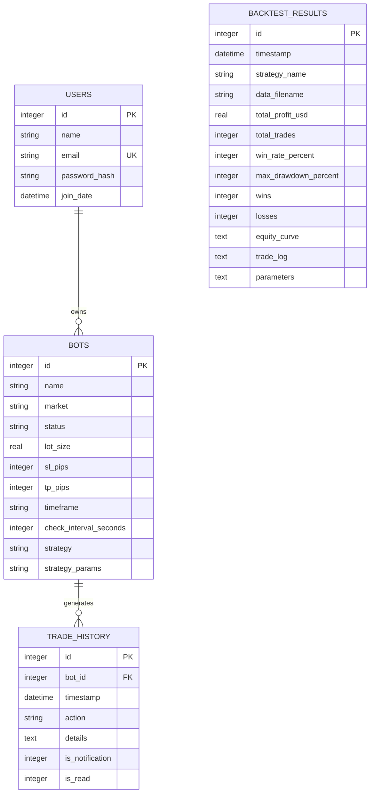
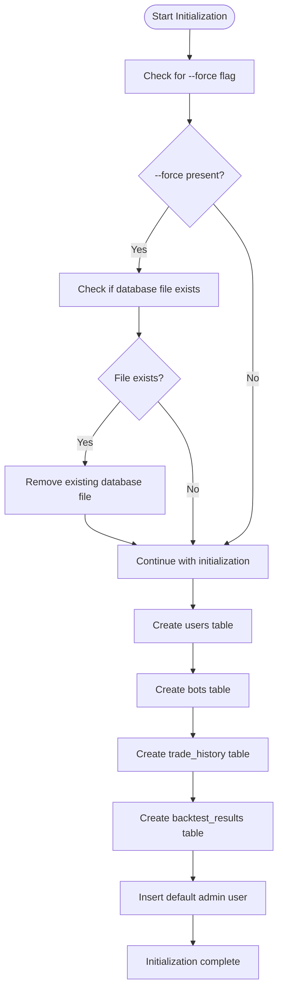
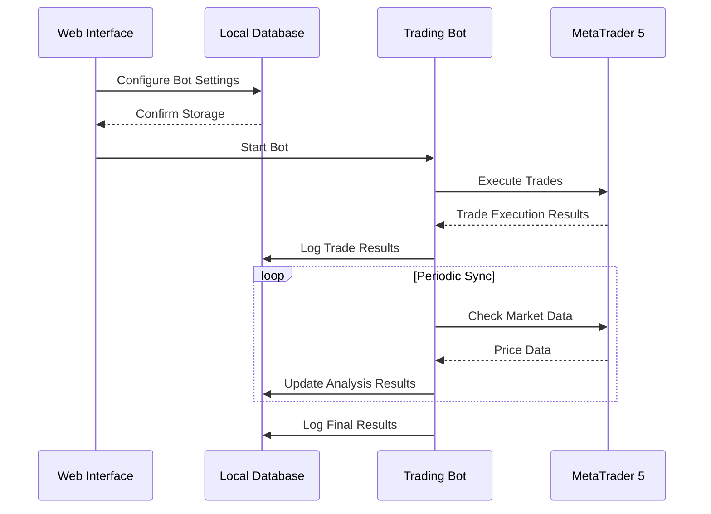

# Database Layer

<cite>
**Referenced Files in This Document**   
- [init_db.py](file://init_db.py#L1-L136)
- [core/db/connection.py](file://core/db/connection.py#L1-L14)
- [core/db/models.py](file://core/db/models.py#L1-L20)
- [core/db/queries.py](file://core/db/queries.py#L1-L174)
- [core/utils/mt5.py](file://core/utils/mt5.py#L1-L129)
- [core/bots/controller.py](file://core/bots/controller.py#L1-L39)
</cite>

## Table of Contents
1. [Database Schema Overview](#database-schema-overview)
2. [Entity Relationships and Constraints](#entity-relationships-and-constraints)
3. [Data Access Patterns](#data-access-patterns)
4. [CRUD Operations Examples](#crud-operations-examples)
5. [Database Initialization Process](#database-initialization-process)
6. [Data Consistency and Synchronization](#data-consistency-and-synchronization)
7. [Performance Optimizations](#performance-optimizations)
8. [Security Considerations](#security-considerations)

## Database Schema Overview

The QuantumBotX database layer uses SQLite as its primary data storage mechanism, with a schema designed to support automated trading bots, trade history logging, backtesting results, and user management. The database is initialized through the `init_db.py` script and consists of four main tables: `users`, `bots`, `trade_history`, and `backtest_results`.

### Table: users
Stores user account information with secure credential storage.

**Schema Definition**
```sql
CREATE TABLE IF NOT EXISTS users (
    id INTEGER PRIMARY KEY AUTOINCREMENT,
    name TEXT NOT NULL,
    email TEXT NOT NULL UNIQUE,
    password_hash TEXT NOT NULL,
    join_date DATETIME DEFAULT CURRENT_TIMESTAMP
);
```

**Field Descriptions**
- `id`: Unique identifier for the user (Primary Key)
- `name`: Full name of the user
- `email`: Email address (Unique Constraint)
- `password_hash`: Securely hashed password using Werkzeug's generate_password_hash
- `join_date`: Timestamp of account creation

### Table: bots
Stores configuration and state information for trading bots.

**Schema Definition**
```sql
CREATE TABLE IF NOT EXISTS bots (
    id INTEGER PRIMARY KEY AUTOINCREMENT,
    name TEXT NOT NULL,
    market TEXT NOT NULL,
    status TEXT NOT NULL DEFAULT 'Dijeda',
    lot_size REAL NOT NULL DEFAULT 0.01,
    sl_pips INTEGER NOT NULL DEFAULT 100,
    tp_pips INTEGER NOT NULL DEFAULT 200,
    timeframe TEXT NOT NULL DEFAULT 'H1',
    check_interval_seconds INTEGER NOT NULL DEFAULT 60,
    strategy TEXT NOT NULL,
    strategy_params TEXT
);
```

**Field Descriptions**
- `id`: Unique identifier for the bot (Primary Key)
- `name`: Descriptive name for the bot
- `market`: Trading symbol or market (e.g., EURUSD, XAUUSD)
- `status`: Current operational status ('Aktif' or 'Dijeda')
- `lot_size`: Trade lot size in units
- `sl_pips`: Stop loss distance in pips
- `tp_pips`: Take profit distance in pips
- `timeframe`: Chart timeframe for analysis (e.g., H1, M15)
- `check_interval_seconds`: Frequency of market analysis checks
- `strategy`: Name of the trading strategy implementation
- `strategy_params`: JSON-formatted string containing strategy-specific parameters

### Table: trade_history
Logs all trading activities and system notifications.

**Schema Definition**
```sql
CREATE TABLE IF NOT EXISTS trade_history (
    id INTEGER PRIMARY KEY AUTOINCREMENT,
    bot_id INTEGER NOT NULL,
    timestamp DATETIME DEFAULT CURRENT_TIMESTAMP,
    action TEXT NOT NULL,
    details TEXT,
    is_notification INTEGER NOT NULL DEFAULT 0,
    is_read INTEGER NOT NULL DEFAULT 0,
    FOREIGN KEY (bot_id) REFERENCES bots (id) ON DELETE CASCADE
);
```

**Field Descriptions**
- `id`: Unique identifier for the log entry (Primary Key)
- `bot_id`: Foreign key referencing the bot that generated the log
- `timestamp`: Date and time of the logged event
- `action`: Type of action performed (e.g., "POSISI DIBUKA", "GAGAL BUKA POSISI")
- `details`: Detailed description of the event
- `is_notification`: Flag indicating if the log should trigger a user notification (0 or 1)
- `is_read`: Flag indicating if the notification has been acknowledged by the user (0 or 1)

### Table: backtest_results
Stores results from historical strategy testing.

**Schema Definition**
```sql
CREATE TABLE IF NOT EXISTS backtest_results (
    id INTEGER PRIMARY KEY AUTOINCREMENT,
    timestamp DATETIME DEFAULT CURRENT_TIMESTAMP,
    strategy_name TEXT NOT NULL,
    data_filename TEXT NOT NULL,
    total_profit_usd REAL NOT NULL,
    total_trades INTEGER NOT NULL,
    win_rate_percent REAL NOT NULL,
    max_drawdown_percent REAL NOT NULL,
    wins INTEGER NOT NULL,
    losses INTEGER NOT NULL,
    equity_curve TEXT, -- Stored as JSON
    trade_log TEXT,    -- Stored as JSON
    parameters TEXT    -- Stored as JSON
);
```

**Field Descriptions**
- `id`: Unique identifier for the backtest result (Primary Key)
- `timestamp`: Date and time when the backtest was executed
- `strategy_name`: Name of the strategy that was tested
- `data_filename`: Source data file used for backtesting
- `total_profit_usd`: Net profit in USD from the backtest
- `total_trades`: Total number of trades executed during backtest
- `win_rate_percent`: Percentage of winning trades
- `max_drawdown_percent`: Maximum drawdown percentage during the test period
- `wins`: Number of winning trades
- `losses`: Number of losing trades
- `equity_curve`: JSON array representing equity changes over time
- `trade_log`: JSON array containing detailed information about each trade
- `parameters`: JSON object containing the strategy parameters used

**Section sources**
- [init_db.py](file://init_db.py#L49-L136)

## Entity Relationships and Constraints

The database schema implements referential integrity through foreign key constraints and enforces data consistency through various constraints.

### Relationship Diagram



### Constraint Analysis

**Primary Keys**
- All tables use `id` as an auto-incrementing primary key
- Ensures unique identification of each record

**Foreign Key Constraints**
- `trade_history.bot_id` references `bots.id` with `ON DELETE CASCADE`
- When a bot is deleted, all associated trade history records are automatically removed

**Unique Constraints**
- `users.email` has a UNIQUE constraint to prevent duplicate accounts
- Enforced at the database level

**Default Values**
- `bots.status` defaults to 'Dijeda' (Paused)
- `bots.lot_size` defaults to 0.01
- `bots.sl_pips` defaults to 100
- `bots.tp_pips` defaults to 200
- `bots.timeframe` defaults to 'H1'
- `bots.check_interval_seconds` defaults to 60
- `trade_history.timestamp` defaults to current timestamp
- `trade_history.is_notification` defaults to 0
- `trade_history.is_read` defaults to 0

**Section sources**
- [init_db.py](file://init_db.py#L49-L136)

## Data Access Patterns

The database layer implements a clean separation of concerns with dedicated modules for connection management, queries, and business logic.

### Connection Management

The connection module provides a centralized way to access the database with consistent configuration.

```python
# core/db/connection.py
import sqlite3
import os

DATABASE_FILENAME = 'bots.db'
BASE_DIR = os.path.dirname(os.path.abspath(__file__))
DATABASE_PATH = os.path.join(BASE_DIR, '..', '..', DATABASE_FILENAME)

def get_db_connection():
    """Creates and returns a connection to the SQLite database."""
    conn = sqlite3.connect(DATABASE_PATH)
    # Configure connection to return rows as dictionary-like objects
    conn.row_factory = sqlite3.Row
    return conn
```

**Key Features**
- Centralized database path definition
- Uses `sqlite3.Row` factory for dictionary-style row access
- Returns connection objects ready for immediate use

### Query Execution Pattern

The queries module implements a comprehensive set of CRUD operations using parameterized queries to prevent SQL injection.

```python
# core/db/queries.py
def get_all_bots():
    """Retrieves all bot data from the database."""
    try:
        with get_db_connection() as conn:
            bots = conn.execute('SELECT * FROM bots ORDER BY id DESC').fetchall()
            return [dict(row) for row in bots]
    except sqlite3.Error as e:
        logger.error(f"Database error when retrieving all bots: {e}")
        return []
```

**Access Pattern Characteristics**
- Context manager (`with` statement) ensures proper connection cleanup
- All queries use parameterized statements with `?` placeholders
- Comprehensive error handling with logging
- Results converted to dictionaries for easy JSON serialization
- Consistent ordering (typically by ID descending)

### Connection Pooling Analysis

The current implementation does not use explicit connection pooling. Each query creates a new connection and closes it when the context manager exits. This approach is suitable for low-to-medium traffic applications but may become a bottleneck under high load.

SQLite's built-in threading support allows multiple connections, but performance optimization would require implementing a connection pool or switching to a database server with native pooling support.

**Section sources**
- [core/db/connection.py](file://core/db/connection.py#L1-L14)
- [core/db/queries.py](file://core/db/queries.py#L1-L174)

## CRUD Operations Examples

### Bot Configuration Management

#### Create Operation
```python
def add_bot(name, market, lot_size, sl_pips, tp_pips, timeframe, interval, strategy, strategy_params='{}'):
    """Adds a new bot to the database."""
    try:
        with get_db_connection() as conn:
            cursor = conn.cursor()
            cursor.execute('''
                INSERT INTO bots (name, market, lot_size, sl_pips, tp_pips, timeframe, 
                check_interval_seconds, strategy, strategy_params, status)
                VALUES (?, ?, ?, ?, ?, ?, ?, ?, ?, 'Dijeda')
            ''', (name, market, lot_size, sl_pips, tp_pips, timeframe, interval, strategy, strategy_params))
            conn.commit()
            return cursor.lastrowid
    except sqlite3.Error as e:
        logger.error(f"Failed to add bot to DB: {e}", exc_info=True)
        return None
```

#### Read Operations
```python
def get_all_bots():
    """Retrieves all bot data from the database."""
    try:
        with get_db_connection() as conn:
            bots = conn.execute('SELECT * FROM bots ORDER BY id DESC').fetchall()
            return [dict(row) for row in bots]
    except sqlite3.Error as e:
        logger.error(f"Database error when retrieving all bots: {e}")
        return []

def get_bot_by_id(bot_id):
    """Retrieves a single bot record by its ID."""
    try:
        with get_db_connection() as conn:
            bot = conn.execute('SELECT * FROM bots WHERE id = ?', (bot_id,)).fetchone()
            return dict(bot) if bot else None
    except sqlite3.Error as e:
        logger.error(f"Database error when retrieving bot {bot_id}: {e}")
        return None
```

#### Update Operation
```python
def update_bot(bot_id, name, market, lot_size, sl_pips, tp_pips, timeframe, interval, strategy, strategy_params='{}'):
    """Updates existing bot data in the database."""
    try:
        with get_db_connection() as conn:
            conn.execute('''
                UPDATE bots SET 
                name = ?, market = ?, lot_size = ?, sl_pips = ?, tp_pips = ?, 
                timeframe = ?, check_interval_seconds = ?, strategy = ?, strategy_params = ?
                WHERE id = ?
            ''', (name, market, lot_size, sl_pips, tp_pips, timeframe, interval, strategy, strategy_params, bot_id))
            conn.commit()
            return True
    except sqlite3.Error as e:
        logger.error(f"Failed to update bot {bot_id} in DB: {e}", exc_info=True)
        return False
```

#### Delete Operation
```python
def delete_bot(bot_id):
    """Deletes a bot from the database by ID."""
    try:
        with get_db_connection() as conn:
            conn.execute('DELETE FROM bots WHERE id = ?', (bot_id,))
            conn.commit()
            return True
    except sqlite3.Error as e:
        logger.error(f"Failed to delete bot {bot_id} from DB: {e}", exc_info=True)
        return False
```

### Trade Logging Operations

#### Add Trade History
```python
def add_history_log(bot_id, action, details, is_notification=False):
    """Adds an activity/history log for a specific bot."""
    try:
        with get_db_connection() as conn:
            conn.execute(
                'INSERT INTO trade_history (bot_id, action, details, is_notification, is_read) VALUES (?, ?, ?, ?, ?)',
                (bot_id, action, details, is_notification, False)
            )
            conn.commit()
    except sqlite3.Error as e:
        logger.error(f"Failed to record history for bot {bot_id}: {e}")
```

#### Retrieve Trade History
```python
def get_history_by_bot_id(bot_id):
    """Retrieves all history records for a bot by ID."""
    try:
        with get_db_connection() as conn:
            history = conn.execute(
                'SELECT * FROM trade_history WHERE bot_id = ? ORDER BY timestamp DESC',
                (bot_id,)
            ).fetchall()
            return [dict(row) for row in history]
    except sqlite3.Error as e:
        logger.error(f"Database error when retrieving bot {bot_id} history: {e}")
        return []
```

**Section sources**
- [core/db/queries.py](file://core/db/queries.py#L1-L174)

## Database Initialization Process

The database initialization process is handled by the `init_db.py` script, which creates the database file and all required tables.

### Initialization Workflow



### Key Initialization Features

**Conditional Database Reset**
- The `--force` command-line argument triggers removal of the existing database
- Prevents accidental data loss during normal operation
- Permission errors are handled gracefully

**Table Creation**
- All tables are created with `IF NOT EXISTS` to prevent errors on subsequent runs
- Foreign key constraints are properly defined
- Default values are specified for all appropriate fields

**Default User Creation**
- A default admin user is created with email 'admin@quantumbotx.com'
- Password is set to 'admin' (hashed using Werkzeug's security functions)
- Only attempted if table creation is successful

**Error Handling**
- Comprehensive try-except blocks for database operations
- Informative console output for troubleshooting
- Graceful degradation if certain operations fail

```python
# init_db.py - Default user insertion
try:
    print("\nInserting default user...")
    cursor = conn.cursor()
    default_password_hash = generate_password_hash('admin')
    cursor.execute("INSERT INTO users (name, email, password_hash) VALUES (?, ?, ?)", 
                   ('Admin User', 'admin@quantumbotx.com', default_password_hash))
    conn.commit()
    print("Default user successfully inserted.")
except sqlite3.Error as e:
    print(f"Failed to insert default user: {e}")
```

**Section sources**
- [init_db.py](file://init_db.py#L1-L136)

## Data Consistency and Synchronization

### Local Database and MT5 Platform Integration

The system maintains data consistency between the local SQLite database and the MetaTrader 5 platform through a well-defined synchronization strategy.

#### Synchronization Architecture



#### Synchronization Strategy

**State Management**
- Bot operational state (Active/Paused) is stored in the database
- The controller module synchronizes memory state with database state on startup
- When the application starts, it checks the database for bots with 'Aktif' status and restarts them

```python
# core/bots/controller.py
def ambil_semua_bot():
    """Load all bots from database on application startup."""
    try:
        all_bots_data = queries.get_all_bots()
        for bot_data in all_bots_data:
            if bot_data.get('status') == 'Aktif':
                logger.info(f"Bot ID {bot_data['id']} has 'Aktif' status. Restarting...")
                mulai_bot(bot_data['id'])
    except Exception as e:
        logger.error(f"Failed to load bots from database: {e}", exc_info=True)
```

**Trade Execution Logging**
- All trade actions are immediately logged to the local database
- The `log_trade_action` function in models.py handles trade logging
- Notification flags are set for important events

**Failure Recovery**
- The system implements graceful error handling for MT5 connectivity issues
- If MT5 connection fails, the bot continues to run and attempts reconnection
- Trade history is preserved locally even if MT5 operations fail
- The controller ensures database state consistency when stopping bots

```python
# core/bots/controller.py
def hentikan_bot(bot_id: int):
    """Stop a running bot and update database status."""
    if bot_thread and bot_thread.is_alive():
        bot_thread.stop()
        bot_thread.join(timeout=10)
        queries.update_bot_status(bot_id, 'Dijeda')
    
    # Ensure database consistency even if bot not in memory
    queries.update_bot_status(bot_id, 'Dijeda')
```

**Section sources**
- [core/utils/mt5.py](file://core/utils/mt5.py#L1-L129)
- [core/bots/controller.py](file://core/bots/controller.py#L1-L39)

## Performance Optimizations

### Current Performance Characteristics

The current implementation focuses on simplicity and reliability rather than high-performance optimization. Several areas could be improved for better performance under load.

### Indexing Strategy Analysis

**Current Status**
- No explicit indexes are created in the `init_db.py` script
- SQLite automatically creates indexes for primary keys and unique constraints
- The `users.email` field has an implicit index due to the UNIQUE constraint
- Foreign key fields do not have dedicated indexes

**Recommended Indexes**
For improved query performance, the following indexes should be considered:

```sql
-- Index on bot_id for faster trade history lookups
CREATE INDEX idx_trade_history_bot_id ON trade_history(bot_id);

-- Composite index for notification queries
CREATE INDEX idx_trade_history_notification ON trade_history(is_notification, is_read, timestamp);

-- Index on bot status for faster filtering
CREATE INDEX idx_bots_status ON bots(status);

-- Index on timestamp for backtest result queries
CREATE INDEX idx_backtest_results_timestamp ON backtest_results(timestamp);
```

### Transaction Batching

**Current Implementation**
- Each database operation uses individual transactions
- The `with get_db_connection()` context manager creates a transaction for each operation
- No batching of multiple operations is implemented

**High-Frequency Operation Considerations**
For high-frequency trading scenarios, the current approach may create performance bottlenecks. Potential improvements include:

1. **Batched Logging**: Collect multiple trade history entries and insert them in a single transaction
2. **Connection Pooling**: Implement a connection pool to reduce connection overhead
3. **Write-Ahead Logging**: Enable SQLite's WAL mode for better concurrency
4. **Memory-Mapped I/O**: Use SQLite's memory-mapped I/O for faster access

### Query Optimization

**Current Query Patterns**
- Most queries are simple SELECT statements with basic filtering
- Parameterized queries prevent SQL injection
- Results are properly indexed in memory after retrieval

**Optimization Opportunities**
- Add LIMIT clauses to history queries to prevent memory exhaustion
- Implement pagination for large result sets
- Use EXISTS instead of COUNT for existence checks
- Consider materialized views for complex aggregations

**Section sources**
- [init_db.py](file://init_db.py#L1-L136)
- [core/db/queries.py](file://core/db/queries.py#L1-L174)

## Security Considerations

### SQL Injection Prevention

The database layer implements robust protection against SQL injection attacks through consistent use of parameterized queries.

**Parameterized Query Implementation**
- All user inputs are passed as parameters to SQL statements
- The `?` placeholder is used instead of string formatting
- Even when constructing dynamic IN clauses, parameters are properly escaped

```python
# Safe parameterized query
def get_bot_by_id(bot_id):
    with get_db_connection() as conn:
        bot = conn.execute('SELECT * FROM bots WHERE id = ?', (bot_id,)).fetchone()
```

**Dynamic Query Safety**
Even for dynamic queries, the code ensures safety by validating input types and using proper parameterization:

```python
def mark_notifications_as_read(notification_ids=None):
    if notification_ids is not None:
        if not notification_ids:
            return True
        safe_ids = [int(id) for id in notification_ids]  # Type validation
        query = f"UPDATE trade_history SET is_read = 1 WHERE id IN ({(', '.join('?'*len(safe_ids)))})"
        conn.execute(query, safe_ids)  # Parameterized execution
```

### Secure Credential Storage

The system implements industry-standard practices for storing sensitive user credentials.

**Password Hashing**
- Uses Werkzeug's `generate_password_hash` function
- Implements secure hashing algorithm (likely PBKDF2)
- Stores only the hash, never the plaintext password

```python
# init_db.py
from werkzeug.security import generate_password_hash

default_password_hash = generate_password_hash('admin')
cursor.execute("INSERT INTO users (name, email, password_hash) VALUES (?, ?, ?)", 
               ('Admin User', 'admin@quantumbotx.com', default_password_hash))
```

**Hash Verification**
- Password verification is performed using `check_password_hash` (implied by import)
- Hashing includes salt to prevent rainbow table attacks
- Computational cost is appropriate to deter brute force attacks

### Database File Security

**File Location**
- Database file is stored in the application root directory
- File name is hardcoded as 'bots.db'
- No encryption at the file level is implemented

**Security Recommendations**
1. Implement file system permissions to restrict database access
2. Consider encrypting the database file using SQLCipher
3. Store the database in a secured directory outside the web root
4. Implement regular backups with encryption

**Section sources**
- [init_db.py](file://init_db.py#L3-L136)
- [core/db/queries.py](file://core/db/queries.py#L1-L174)