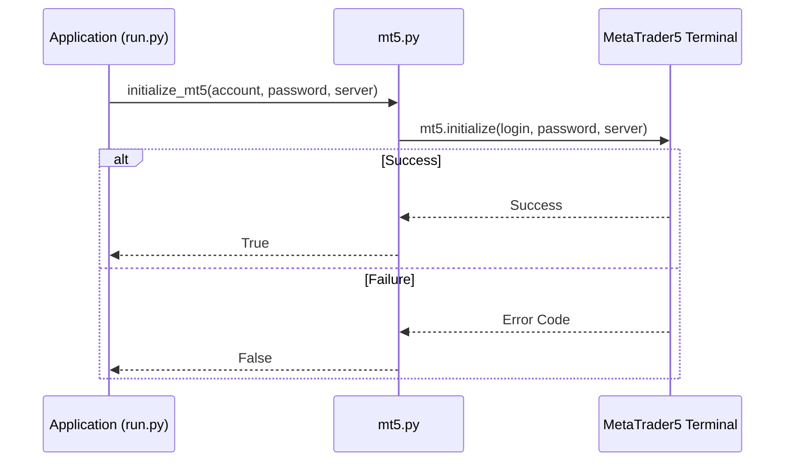
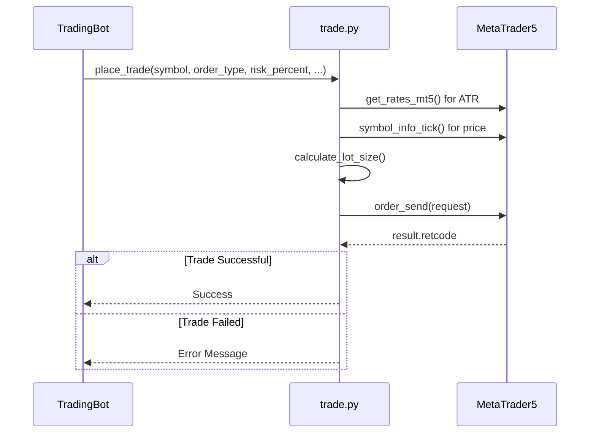

# MT5 Integration

<cite>
**Referenced Files in This Document**   
- [mt5.py](file://core/utils/mt5.py#L0-L144)
- [trade.py](file://core/mt5/trade.py#L0-L152)
- [trading_bot.py](file://core/bots/trading_bot.py#L0-L169)
- [run.py](file://run.py#L0-L51)
- [helpers.py](file://core/helpers.py#L0-L50)
</cite>

## Table of Contents
1. [Introduction](#introduction)
2. [Connection Initialization and Authentication](#connection-initialization-and-authentication)
3. [Market Data Retrieval](#market-data-retrieval)
4. [Order Execution and Trade Management](#order-execution-and-trade-management)
5. [Wrapper Functions and Error Handling](#wrapper-functions-and-error-handling)
6. [Position Synchronization and Monitoring](#position-synchronization-and-monitoring)
7. [Reliability and Session Management](#reliability-and-session-management)
8. [Rate Limiting and API Best Practices](#rate-limiting-and-api-best-practices)
9. [Testing in Demo Mode](#testing-in-demo-mode)
10. [MT5 API Limitations and Workarounds](#mt5-api-limitations-and-workarounds)

## Introduction
The MT5 Integration component in quantumbotx enables seamless interaction with the MetaTrader 5 terminal using the MetaTrader5 Python package. This integration facilitates automated trading by allowing the application to retrieve market data, execute trades, manage positions, and monitor account performance. The system abstracts low-level MT5 API calls through wrapper functions, ensuring robust error handling, symbol compatibility across brokers, and dynamic risk management. This document details the architecture, functionality, and best practices for using the MT5 integration within the quantumbotx framework.

**Section sources**
- [mt5.py](file://core/utils/mt5.py#L0-L144)
- [trade.py](file://core/mt5/trade.py#L0-L152)

## Connection Initialization and Authentication
The application establishes a connection to the MetaTrader 5 terminal using the `initialize_mt5` function defined in `core/utils/mt5.py`. This function initializes the MT5 terminal and authenticates using account credentials (login, password, server) retrieved from environment variables. The initialization occurs at the application level in `run.py`, ensuring a single, centralized connection point.



**Diagram sources**
- [mt5.py](file://core/utils/mt5.py#L16-L22)
- [run.py](file://run.py#L35-L45)

**Section sources**
- [mt5.py](file://core/utils/mt5.py#L16-L22)
- [run.py](file://run.py#L35-L45)

## Market Data Retrieval
The integration supports both historical price data and real-time tick data retrieval. The `get_rates_mt5` function fetches historical OHLC (Open, High, Low, Close) data for a given symbol and timeframe, returning it as a pandas DataFrame. Timeframes are mapped using a constant dictionary (`TIMEFRAME_MAP`) for consistency.

```python
def get_rates_mt5(symbol: str, timeframe: int, count: int = 100):
    rates = mt5.copy_rates_from_pos(symbol, timeframe, 0, count)
    df = pd.DataFrame(rates)
    df['time'] = pd.to_datetime(df['time'], unit='s')
    df.set_index('time', inplace=True)
    return df
```

Real-time tick data is accessed via `mt5.symbol_info_tick(symbol)` for current bid/ask prices. The system handles missing or empty data gracefully by returning empty DataFrames and logging warnings.

**Section sources**
- [mt5.py](file://core/utils/mt5.py#L37-L53)

## Order Execution and Trade Management
Trade execution is managed through the `place_trade` function in `core/mt5/trade.py`, which supports market and limit orders with configurable stop-loss (SL) and take-profit (TP) levels. The function calculates dynamic lot sizes based on risk percentage, account balance, and ATR (Average True Range) for volatility-adjusted SL/TP distances.



**Diagram sources**
- [trade.py](file://core/mt5/trade.py#L72-L128)
- [trading_bot.py](file://core/bots/trading_bot.py#L130-L150)

**Section sources**
- [trade.py](file://core/mt5/trade.py#L72-L128)

## Wrapper Functions and Error Handling
The `core/utils/mt5.py` module provides wrapper functions that abstract low-level MT5 API calls and handle common error codes. Each function uses try-except blocks to catch exceptions and log meaningful error messages. The `find_mt5_symbol` function resolves broker-specific symbol naming variations by searching visible symbols in the Market Watch.

```python
def find_mt5_symbol(base_symbol: str) -> str | None:
    base_symbol_cleaned = re.sub(r'[^A-Z0-9]', '', base_symbol.upper())
    all_symbols = mt5.symbols_get()
    visible_symbols = {s.name for s in all_symbols if s.visible}
    if base_symbol_cleaned in visible_symbols:
        return base_symbol_cleaned
    # Regex pattern matching for variations
    pattern = re.compile(f"^[a-zA-Z]*{base_symbol_cleaned}[a-zA-Z0-9._-]*$", re.IGNORECASE)
    for symbol_name in visible_symbols:
        if pattern.match(symbol_name):
            if mt5.symbol_select(symbol_name, True):
                return symbol_name
    return None
```

**Section sources**
- [mt5.py](file://core/utils/mt5.py#L100-L144)

## Position Synchronization and Monitoring
The system maintains synchronization between local bot state and broker records by periodically querying open positions using `get_open_positions_mt5()`. The `TradingBot` class uses `_get_open_position()` to identify positions associated with its magic number (bot ID), enabling accurate position tracking and management.

```python
def get_open_positions_mt5():
    positions = mt5.positions_get()
    return [pos._asdict() for pos in positions] if positions else []
```

The `_handle_trade_signal` method in `trading_bot.py` ensures that conflicting positions are closed before opening new ones, preventing duplicate or opposing trades.

**Section sources**
- [mt5.py](file://core/utils/mt5.py#L55-L65)
- [trading_bot.py](file://core/bots/trading_bot.py#L152-L169)

## Reliability and Session Management
The application ensures reliability through robust error handling, reconnection logic, and proper session lifecycle management. Network timeouts and API errors are handled via try-except blocks, with warnings logged for transient issues. The connection is initialized in `run.py` and gracefully shut down using `atexit.register(shutdown_app)`.

```python
def shutdown_app():
    shutdown_all_bots()
    mt5.shutdown()
```

Multiple scripts (e.g., `test_xm_connection.py`, `lab/download_data.py`) include `mt5.shutdown()` calls, indicating consistent session cleanup practices.

**Section sources**
- [run.py](file://run.py#L10-L15)
- [run.py](file://run.py#L48-L51)

## Rate Limiting and API Best Practices
While explicit rate limiting is not implemented, the system avoids API bans through conservative polling intervals controlled by the `check_interval` parameter in `TradingBot`. The use of `time.sleep()` between iterations prevents excessive API calls. Additionally, data is fetched only when necessary, and connections are reused across components.

Best practices include:
- Using `ORDER_FILLING_FOK` (Fill or Kill) for immediate execution or rejection
- Validating symbol visibility before trading
- Logging all API interactions for debugging
- Using magic numbers to associate trades with specific bots

**Section sources**
- [trading_bot.py](file://core/bots/trading_bot.py#L100-L110)

## Testing in Demo Mode
The integration supports testing in demo mode using XM demo accounts. Scripts like `test_xm_connection.py` verify connectivity, account details, and symbol availability. Demo testing includes checking balance, leverage, and key symbols (e.g., EURUSD, XAUUSD, USDIDR) to ensure proper configuration.

```python
if 'XM' in account_info.server.upper():
    print("🎉 PERFECT! You're connected to XM!")
```

The `create_crypto_bot.py` script includes demo position size calculations for educational purposes.

**Section sources**
- [test_xm_connection.py](file://test_xm_connection.py#L40-L75)

## MT5 API Limitations and Workarounds
Known limitations of the MT5 API and implemented workarounds include:

1. **Symbol Name Variability**: Different brokers use different naming conventions (e.g., XAUUSD vs. GOLD). Workaround: `find_mt5_symbol` uses regex pattern matching to resolve variations.

2. **Market Watch Requirement**: Symbols must be visible in Market Watch. Workaround: `mt5.symbol_select(symbol, True)` activates the symbol.

3. **No Built-in Rate Limiting**: The API does not enforce rate limits, risking bans. Workaround: Application-level sleep intervals and conservative polling.

4. **Limited Historical Data Access**: Data availability depends on broker. Workaround: Graceful handling of empty responses and user diagnostics via `/api/symbols/all`.

5. **Floating-Point Precision Issues**: Risk of decimal parsing errors. Workaround: Locale setting (`LC_NUMERIC, 'C'`) and string replacement in `parse_decimal`.

**Section sources**
- [mt5.py](file://core/utils/mt5.py#L100-L144)
- [helpers.py](file://core/helpers.py#L0-L5)
- [api_stocks.py](file://core/routes/api_stocks.py#L71-L97)