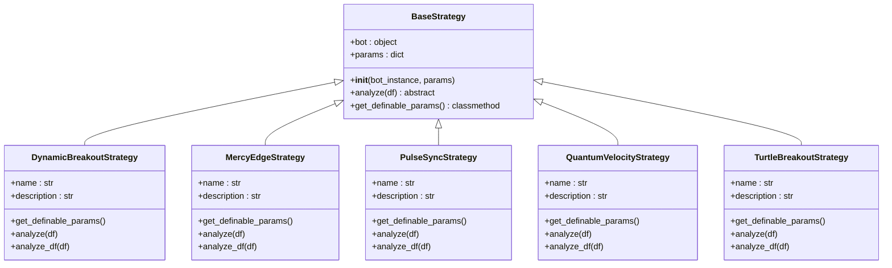
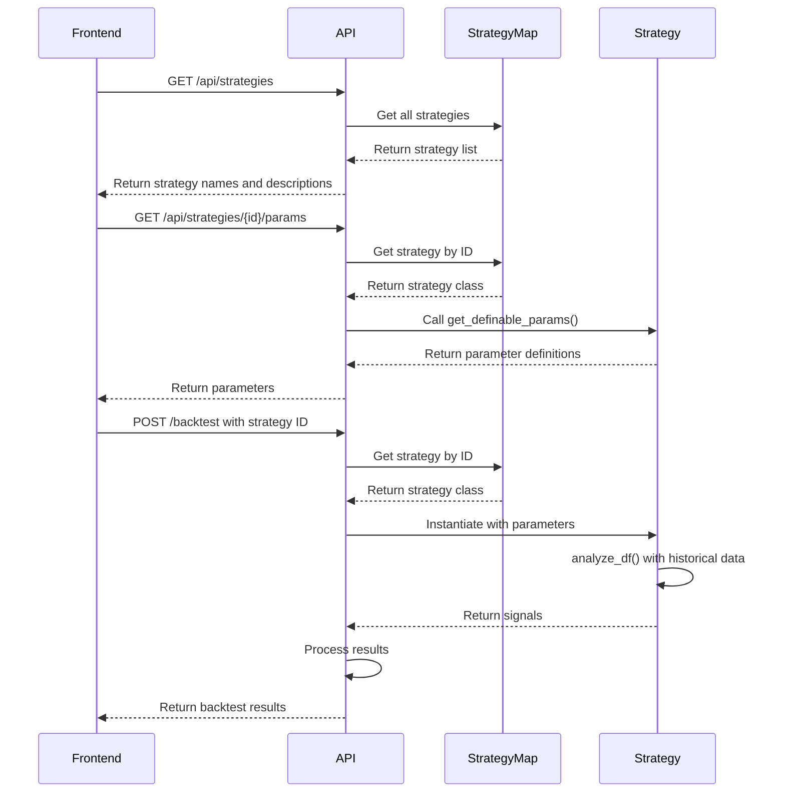
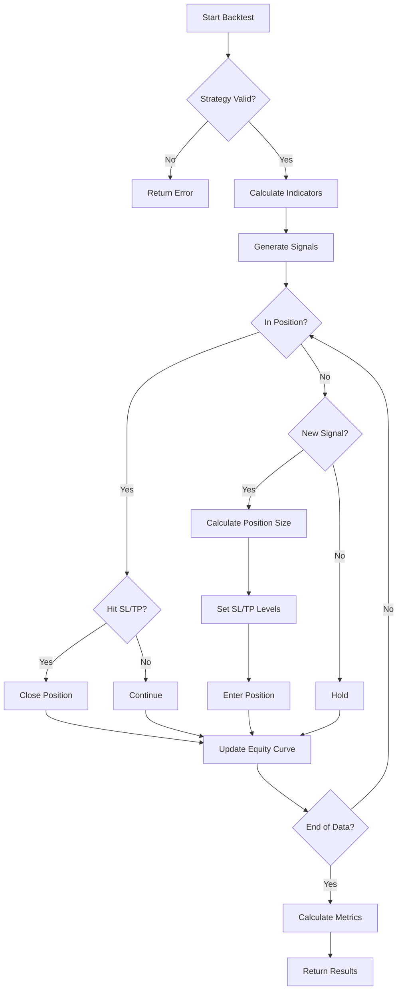

# Additional Strategy Implementations

<cite>
**Referenced Files in This Document**   
- [dynamic_breakout.py](file://core\strategies\dynamic_breakout.py)
- [mercy_edge.py](file://core\strategies\mercy_edge.py)
- [pulse_sync.py](file://core\strategies\pulse_sync.py)
- [quantum_velocity.py](file://core\strategies\quantum_velocity.py)
- [turtle_breakout.py](file://core\strategies\turtle_breakout.py)
- [base_strategy.py](file://core\strategies\base_strategy.py)
- [strategy_map.py](file://core\strategies\strategy_map.py)
- [engine.py](file://core\backtesting\engine.py)
</cite>

## Table of Contents
1. [Dynamic Breakout Strategy](#dynamic-breakout-strategy)
2. [Mercy Edge Strategy](#mercy-edge-strategy)
3. [Pulse Sync Strategy](#pulse-sync-strategy)
4. [Quantum Velocity Strategy](#quantum-velocity-strategy)
5. [Turtle Breakout Strategy](#turtle-breakout-strategy)
6. [Strategy Integration Framework](#strategy-integration-framework)
7. [Backtesting and Risk Management](#backtesting-and-risk-management)

## Dynamic Breakout Strategy

The Dynamic Breakout strategy implements an adaptive threshold calculation based on recent volatility and volume to identify breakout opportunities. It uses Donchian Channels as the primary breakout detection mechanism, enhanced with EMA trend filtering and ATR-based volatility filtering.

The strategy calculates three key components:
1. **Donchian Channels**: Upper and lower bands based on the highest high and lowest low over a configurable period
2. **EMA Trend Filter**: Determines the prevailing trend direction using an Exponential Moving Average
3. **ATR Volatility Filter**: Ensures breakouts occur during periods of sufficient volatility

The adaptive threshold mechanism works by requiring that the bar's range (high-low) exceeds a multiple of the Average True Range (ATR). This prevents false breakouts during low-volatility periods. The strategy only generates signals when three conditions are met simultaneously: price breaks the Donchian channel, the trend aligns with the breakout direction, and the volatility threshold is exceeded.

Optimal market conditions for this strategy include trending markets with increasing volatility, particularly effective during news events or market regime shifts. The key parameters allow customization of the sensitivity:

**Key Parameters:**
- "donchian_period": Period for Donchian Channel calculation (default: 20)
- "ema_filter_period": Period for EMA trend filter (default: 50)
- "atr_period": Period for ATR calculation (default: 14)
- "atr_multiplier": Multiplier for ATR volatility threshold (default: 0.8)

The strategy integrates with the base framework through the `analyze_df` method for backtesting and `analyze` method for live trading, following the standard pattern across all strategies in the system.

**Section sources**
- [dynamic_breakout.py](file://core\strategies\dynamic_breakout.py#L1-L63)

## Mercy Edge Strategy

The Mercy Edge strategy implements risk-aware entry logic that incorporates position sizing and stop-loss placement through a hybrid approach combining multiple technical indicators with AI validation. This strategy focuses on high-precision signals by requiring confluence across multiple indicators.

The core logic combines three components:
1. **Trend Filter**: Uses a 200-period Simple Moving Average (SMA) to determine the long-term trend direction
2. **Momentum Confirmation**: Employs MACD histogram above zero for bullish momentum or below zero for bearish momentum
3. **Entry Trigger**: Requires a Stochastic crossover (fast %K crossing above/below slow %D) for precise entry timing

The risk-aware entry logic is implemented through strict confluence requirements - all three conditions must be satisfied simultaneously for a signal to be generated. This multi-layer validation reduces false signals and improves trade quality. The strategy is particularly effective in trending markets where multiple timeframes align.

Key parameters allow customization of the indicator settings:
- "macd_fast": Fast period for MACD calculation (default: 12)
- "macd_slow": Slow period for MACD calculation (default: 26)
- "macd_signal": Signal period for MACD (default: 9)
- "stoch_k": Period for Stochastic %K (default: 14)
- "stoch_d": Period for Stochastic %D (default: 3)
- "stoch_smooth": Smoothing period for Stochastic (default: 3)

The strategy demonstrates strong performance characteristics with lower trade frequency but higher win rates compared to simpler strategies. It is compatible with backtesting through the standardized `analyze_df` method and includes proper look-ahead prevention by using shifted values for channel calculations.

**Section sources**
- [mercy_edge.py](file://core\strategies\mercy_edge.py#L1-L122)

## Pulse Sync Strategy

The Pulse Sync strategy details momentum synchronization across multiple timeframes through a responsive framework that combines medium-term trend filtering with short-term momentum confirmation. The strategy simulates multi-timeframe analysis by using different period lengths on a single timeframe dataset.

The synchronization mechanism works as follows:
1. **Trend Component**: Uses a 100-period SMA as a medium-term trend filter
2. **Momentum Component**: Applies MACD for momentum assessment
3. **Entry Component**: Utilizes Stochastic crossover for precise entry timing

The strategy achieves "synchronization" by requiring alignment between the medium-term trend direction and short-term momentum signals. This creates a filter that only permits trades in the direction of the prevailing trend, with entries timed by short-term oscillators. The approach effectively simulates the analysis of multiple timeframes using a single timeframe's data.

Optimal market conditions include trending markets with clear directional bias, where the medium-term trend provides context for short-term trading opportunities. The strategy performs less effectively in choppy, range-bound markets where trend filters generate whipsaws.

Key parameters:
- "trend_period": Period for trend filter SMA (default: 100)
- "macd_fast": Fast period for MACD (default: 12)
- "macd_slow": Slow period for MACD (default: 26)
- "macd_signal": Signal period for MACD (default: 9)
- "stoch_k": Period for Stochastic %K (default: 14)
- "stoch_d": Period for Stochastic %D (default: 3)
- "stoch_smooth": Smoothing period for Stochastic (default: 3)

The strategy integrates seamlessly with the backtesting framework and maintains consistency between live trading and backtest results through identical logic implementation in both `analyze` and `analyze_df` methods.

**Section sources**
- [pulse_sync.py](file://core\strategies\pulse_sync.py#L1-L125)

## Quantum Velocity Strategy

The Quantum Velocity strategy describes a rate-of-change acceleration detection mechanism that combines long-term trend filtering with volatility-based breakout detection. The strategy identifies periods of accelerating momentum through a "squeeze" pattern followed by a breakout.

The core mechanism works in two phases:
1. **Squeeze Detection**: Identifies periods of low volatility by comparing Bollinger Band width to a moving average of bandwidth
2. **Breakout Confirmation**: Triggers signals when price closes outside the Bollinger Bands following a squeeze

The rate-of-change acceleration is detected implicitly through the transition from low volatility (squeeze) to high volatility (breakout). The strategy uses EMA 200 as a long-term trend filter, only permitting trades in the direction of the primary trend.

Key parameters:
- "ema_period": Period for EMA trend filter (default: 200)
- "bb_length": Length for Bollinger Bands calculation (default: 20)
- "bb_std": Standard deviation multiplier for Bollinger Bands (default: 2.0)
- "squeeze_window": Window for average bandwidth calculation (default: 10)
- "squeeze_factor": Factor for determining squeeze threshold (default: 0.7)

The strategy is particularly effective in markets that exhibit mean-reverting behavior followed by trending moves, such as equity indices or commodities. It performs best when volatility is cyclical, alternating between periods of contraction and expansion.

The implementation includes proper state management and look-ahead prevention, making it compatible with both live trading and backtesting environments. The vectorized `analyze_df` method ensures efficient backtesting performance across large datasets.

**Section sources**
- [quantum_velocity.py](file://core\strategies\quantum_velocity.py#L1-L95)

## Turtle Breakout Strategy

The Turtle Breakout strategy explains the classic trend-following approach with volatility-based position sizing, implementing the renowned Turtle Trading rules with modern enhancements. The strategy follows a systematic approach to trend following based on price breakouts.

The core logic consists of two components:
1. **Entry System**: Long positions triggered when price exceeds the highest high of the past N periods; short positions when price falls below the lowest low
2. **Exit System**: Positions closed when price reverses to breach the lowest low (for longs) or highest high (for shorts) of a shorter period

The strategy implements proper state management to track position status, preventing multiple entries and ensuring correct exit execution. Unlike simpler strategies, it maintains state between bars, making it suitable for realistic trading simulation.

Key parameters:
- "entry_period": Period for entry channel (default: 20)
- "exit_period": Period for exit channel (default: 10)

The strategy is designed for strong trending markets and performs best in commodities, currencies, and indices with persistent trends. It may generate losses in range-bound markets due to whipsaws.

The implementation includes a stateful backtesting method (`analyze_df`) that accurately simulates position management, providing realistic performance metrics. The live trading method (`analyze`) maintains consistency with backtest results through identical logic.

**Section sources**
- [turtle_breakout.py](file://core\strategies\turtle_breakout.py#L1-L118)

## Strategy Integration Framework

The strategy implementations integrate with the base strategy framework through a standardized interface that ensures consistency across all strategies. The architecture follows the Template Method design pattern, with common structure and variable components.

**Diagram sources**
- [base_strategy.py](file://core\strategies\base_strategy.py#L1-L28)
- [dynamic_breakout.py](file://core\strategies\dynamic_breakout.py#L1-L63)
- [mercy_edge.py](file://core\strategies\mercy_edge.py#L1-L122)
- [pulse_sync.py](file://core\strategies\pulse_sync.py#L1-L125)
- [quantum_velocity.py](file://core\strategies\quantum_velocity.py#L1-L95)
- [turtle_breakout.py](file://core\strategies\turtle_breakout.py#L1-L118)

All strategies inherit from the `BaseStrategy` abstract class, which defines the contract for strategy implementation. The framework supports both live trading (`analyze` method) and backtesting (`analyze_df` method) through separate but consistent implementations.

Strategy registration is managed through the `strategy_map.py` file, which imports all strategy classes and maps them to unique identifiers. This allows dynamic strategy selection and configuration through the API endpoints.

**Diagram sources**
- [strategy_map.py](file://core\strategies\strategy_map.py#L1-L28)
- [api_bots.py](file://core\routes\api_bots.py#L1-L56)
- [api_backtest.py](file://core\routes\api_backtest.py#L1-L23)

**Section sources**
- [strategy_map.py](file://core\strategies\strategy_map.py#L1-L28)
- [base_strategy.py](file://core\strategies\base_strategy.py#L1-L28)

## Backtesting and Risk Management

The strategies are evaluated through a comprehensive backtesting engine that incorporates sophisticated risk management and position sizing logic. The backtesting framework applies consistent rules across all strategies while accounting for instrument-specific characteristics.

The backtesting process follows these steps:
1. Strategy instantiation with parameters
2. Signal generation through `analyze_df` method
3. Position sizing based on volatility (ATR) and risk percentage
4. Trade execution with stop-loss and take-profit levels
5. Performance metric calculation

A key feature is the volatility-based position sizing that adjusts trade size according to market conditions. The system calculates position size based on the risk percentage of account equity and the distance to stop-loss, which is determined by ATR multiples.

Special handling is implemented for high-volatility instruments like XAUUSD, with conservative defaults and multiple safety layers:
- Risk percentage capped at 1.0% maximum
- ATR multipliers capped at 1.0x for stop-loss and 2.0x for take-profit
- Lot sizes capped at 0.03 maximum
- Emergency brake if estimated risk exceeds 5% of capital

**Diagram sources**
- [engine.py](file://core\backtesting\engine.py#L1-L317)

The backtesting engine ensures fair comparison across strategies by applying consistent rules for slippage, commission, and execution. Performance metrics include total profit, win rate, maximum drawdown, and trade statistics, providing a comprehensive evaluation of strategy effectiveness.

**Section sources**
- [engine.py](file://core\backtesting\engine.py#L1-L317)