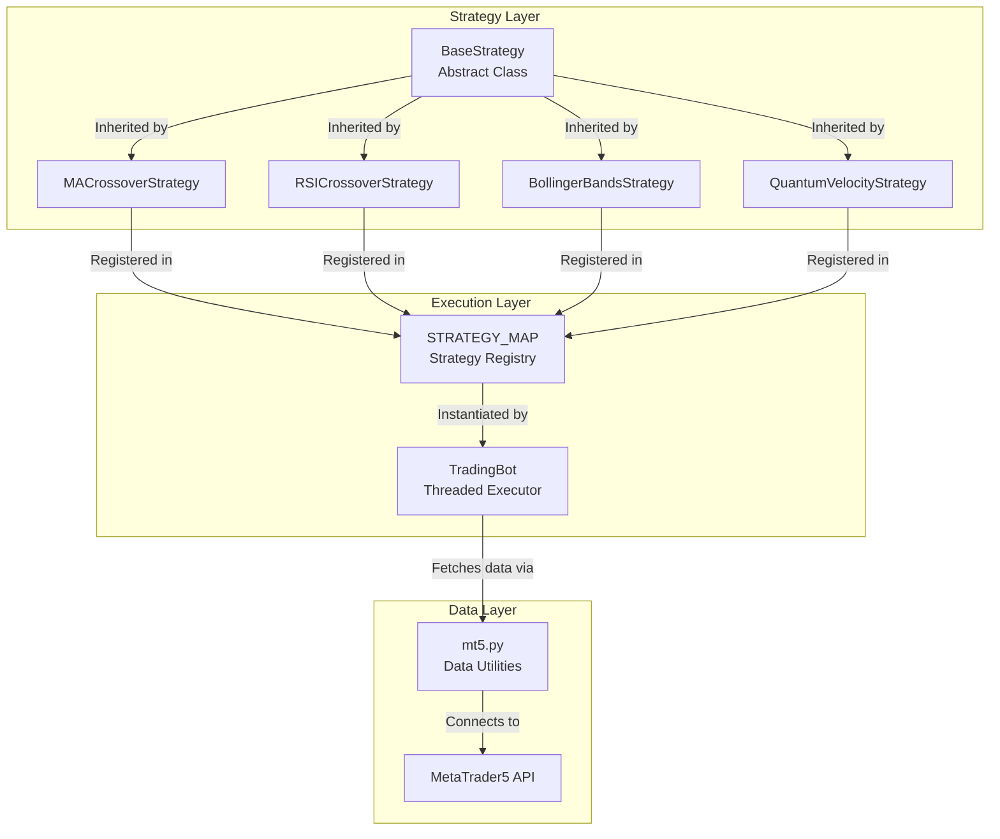
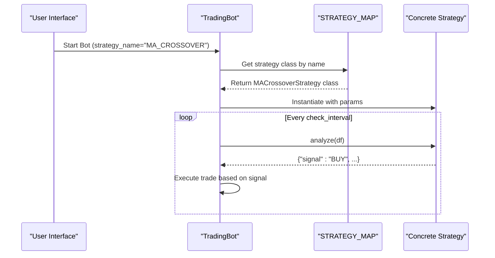

# Base Strategy Interface

<cite>
**Referenced Files in This Document**   
- [base_strategy.py](file://core/strategies/base_strategy.py)
- [strategy_map.py](file://core/strategies/strategy_map.py)
- [ma_crossover.py](file://core/strategies/ma_crossover.py)
- [rsi_crossover.py](file://core/strategies/rsi_crossover.py)
- [bollinger_reversion.py](file://core/strategies/bollinger_reversion.py)
- [quantum_velocity.py](file://core/strategies/quantum_velocity.py)
- [ichimoku_cloud.py](file://core/strategies/ichimoku_cloud.py)
- [trading_bot.py](file://core/bots/trading_bot.py)
- [mt5.py](file://core/utils/mt5.py)
</cite>

## Table of Contents
1. [Introduction](#introduction)
2. [Core Architecture](#core-architecture)
3. [BaseStrategy Class Structure](#basestrategy-class-structure)
4. [Required Methods and Their Roles](#required-methods-and-their-roles)
5. [Strategy Integration via STRATEGY_MAP](#strategy-integration-via-strategy_map)
6. [Lifecycle and Execution Flow](#lifecycle-and-execution-flow)
7. [Data Flow and Market Integration](#data-flow-and-market-integration)
8. [Design Rationale and Inheritance Patterns](#design-rationale-and-inheritance-patterns)
9. [Best Practices for Derived Strategies](#best-practices-for-derived-strategies)
10. [Conclusion](#conclusion)

## Introduction
The `BaseStrategy` abstract class serves as the foundational contract for all trading strategies within the quantumbotx system. It defines a standardized interface that ensures consistency across diverse algorithmic trading implementations, enabling polymorphic behavior in the bot execution engine. This document provides a comprehensive analysis of the `BaseStrategy` class, its integration with the broader system, and best practices for extending it. The design supports both live trading and backtesting workflows, leveraging pandas DataFrames for data processing and pandas_ta for technical indicator computation.

**Section sources**
- [base_strategy.py](file://core/strategies/base_strategy.py#L1-L28)

## Core Architecture
The quantumbotx system follows a modular, component-based architecture where trading strategies are decoupled from execution logic and data retrieval. The `BaseStrategy` class acts as the central abstraction point, allowing the system to dynamically instantiate and execute various strategies based on user configuration. This separation of concerns enables flexibility, testability, and scalability.



**Diagram sources**
- [base_strategy.py](file://core/strategies/base_strategy.py)
- [strategy_map.py](file://core/strategies/strategy_map.py)
- [trading_bot.py](file://core/bots/trading_bot.py)
- [mt5.py](file://core/utils/mt5.py)

**Section sources**
- [base_strategy.py](file://core/strategies/base_strategy.py)
- [strategy_map.py](file://core/strategies/strategy_map.py)
- [trading_bot.py](file://core/bots/trading_bot.py)

## BaseStrategy Class Structure
The `BaseStrategy` class is defined as an abstract base class using Python's `ABC` module. It enforces a consistent interface across all trading strategies while providing shared functionality through concrete methods.

```python
class BaseStrategy(ABC):
    def __init__(self, bot_instance, params: dict = {}):
        self.bot = bot_instance
        self.params = params

    @abstractmethod
    def analyze(self, df):
        raise NotImplementedError("Setiap strategi harus mengimplementasikan metode `analyze(df)`.")

    @classmethod
    def get_definable_params(cls):
        return []
```

The class constructor accepts a `bot_instance` (a reference to the parent `TradingBot`) and a dictionary of parameters (`params`). This allows strategies to access bot-level state and configuration while maintaining encapsulation.

**Section sources**
- [base_strategy.py](file://core/strategies/base_strategy.py#L4-L28)

## Required Methods and Their Roles
### analyze(df)
The `analyze` method is the core abstract method that must be implemented by all derived classes. It processes a pandas DataFrame containing market data and returns a dictionary with the trading signal.

**Key Responsibilities:**
- Accepts a DataFrame (`df`) with OHLCV data
- Returns a dictionary with keys: `signal` (BUY/SELL/HOLD), `price`, and `explanation`
- Designed for live trading with minimal data processing
- Handles edge cases like insufficient data or missing values

Example implementation from `MACrossoverStrategy`:
```python
def analyze(self, df):
    if df is None or df.empty or len(df) < self.params.get('slow_period', 50) + 1:
        return {"signal": "HOLD", "price": None, "explanation": "Data tidak cukup."}
    # ... strategy logic
    return {"signal": signal, "price": price, "explanation": explanation}
```

### get_definable_params(cls)
This class method returns a list of configurable parameters for the strategy, enabling dynamic UI generation and user customization.

**Structure of Parameter Definition:**
```python
{
    "name": "parameter_name",
    "label": "User-friendly Label",
    "type": "number|boolean",
    "default": value,
    "step": optional_increment  # for numeric inputs
}
```

Example from `RSICrossoverStrategy`:
```python
@classmethod
def get_definable_params(cls):
    return [
        {"name": "rsi_period", "label": "Periode RSI", "type": "number", "default": 14},
        {"name": "rsi_ma_period", "label": "Periode MA dari RSI", "type": "number", "default": 10},
        {"name": "trend_filter_period", "label": "Periode SMA Filter Tren", "type": "number", "default": 50}
    ]
```

**Section sources**
- [base_strategy.py](file://core/strategies/base_strategy.py#L15-L28)
- [ma_crossover.py](file://core/strategies/ma_crossover.py#L10-L14)
- [rsi_crossover.py](file://core/strategies/rsi_crossover.py#L10-L18)

## Strategy Integration via STRATEGY_MAP
The `STRATEGY_MAP` dictionary in `strategy_map.py` enables dynamic strategy instantiation based on user configuration. It maps string identifiers to strategy classes, allowing the `TradingBot` to instantiate the correct strategy at runtime.

```python
STRATEGY_MAP = {
    'MA_CROSSOVER': MACrossoverStrategy,
    'QUANTUMBOTX_HYBRID': QuantumBotXHybridStrategy,
    'RSI_CROSSOVER': RSICrossoverStrategy,
    # ... other mappings
}
```

**Integration Flow:**
1. User selects a strategy by name in the UI
2. `TradingBot` retrieves the corresponding class from `STRATEGY_MAP`
3. Strategy instance is created with user-provided parameters
4. `analyze` method is called periodically with fresh market data



**Diagram sources**
- [strategy_map.py](file://core/strategies/strategy_map.py#L1-L30)
- [trading_bot.py](file://core/bots/trading_bot.py#L30-L60)

**Section sources**
- [strategy_map.py](file://core/strategies/strategy_map.py)
- [trading_bot.py](file://core/bots/trading_bot.py)

## Lifecycle and Execution Flow
The lifecycle of a strategy begins when a `TradingBot` instance is created and ends when the bot is stopped. The execution flow is managed by the bot's thread loop.

**Key Stages:**
1. **Initialization**: Strategy instance created with parameters
2. **Data Acquisition**: Bot fetches market data via `mt5.py`
3. **Analysis**: Strategy's `analyze` method processes the data
4. **Signal Handling**: Bot executes trades based on the signal
5. **Iteration**: Process repeats at configured interval

```mermaid
flowchart TD
A[Bot Start] --> B{Valid Symbol?}
B --> |No| C[Set Error Status]
B --> |Yes| D[Get Strategy Class]
D --> E[Instantiate Strategy]
E --> F[Enter Main Loop]
F --> G[Fetch Market Data]
G --> H{Data Valid?}
H --> |No| I[Log Warning]
H --> |Yes| J[Call analyze(df)]
J --> K[Get Signal]
K --> L{Signal = BUY/SELL?}
L --> |Yes| M[Execute Trade]
L --> |No| N[No Action]
M --> O[Update Last Analysis]
N --> O
O --> P[Wait check_interval]
P --> F
```

**Diagram sources**
- [trading_bot.py](file://core/bots/trading_bot.py#L50-L150)

**Section sources**
- [trading_bot.py](file://core/bots/trading_bot.py)

## Data Flow and Market Integration
Strategies receive market data as pandas DataFrames populated with OHLCV data from MetaTrader 5. The data flow is orchestrated by the `TradingBot` and `mt5.py` utility.

**Data Acquisition Process:**
1. `TradingBot` calls `get_rates_mt5()` from `mt5.py`
2. MT5 API returns raw price data
3. Data is converted to a pandas DataFrame with datetime index
4. DataFrame is passed to the strategy's `analyze` method

Key data handling considerations:
- **Missing Data**: Strategies must handle `NaN` values and ensure sufficient data length
- **Timezone Handling**: All timestamps are in UTC
- **Performance**: Data retrieval is optimized to minimize latency

Example data retrieval:
```python
df = get_rates_mt5(self.market_for_mt5, tf_const, 250)  # Fetch 250 bars
```

**Section sources**
- [trading_bot.py](file://core/bots/trading_bot.py#L100-L120)
- [mt5.py](file://core/utils/mt5.py#L30-L50)

## Design Rationale and Inheritance Patterns
The `BaseStrategy` design follows several key principles:

**1. Single Responsibility Principle**
Each strategy focuses solely on signal generation, delegating execution and data retrieval to other components.

**2. Open/Closed Principle**
New strategies can be added without modifying existing code, only by extending `BaseStrategy` and registering in `STRATEGY_MAP`.

**3. Dependency Injection**
Strategies receive their dependencies (bot instance, parameters) through the constructor, promoting testability.

**Recommended Inheritance Pattern:**
```python
class MyStrategy(BaseStrategy):
    name = "My Strategy"
    description = "Brief description"

    @classmethod
    def get_definable_params(cls):
        return [{"name": "param1", "label": "Param 1", "type": "number", "default": 10}]

    def analyze(self, df):
        # Implement strategy logic
        return {"signal": "HOLD", "price": None, "explanation": "No signal"}
```

**Section sources**
- [base_strategy.py](file://core/strategies/base_strategy.py)
- [ma_crossover.py](file://core/strategies/ma_crossover.py)
- [ichimoku_cloud.py](file://core/strategies/ichimoku_cloud.py)

## Best Practices for Derived Strategies
### State Management
- Avoid storing state in instance variables unless necessary
- Use `self.params` for configuration, not runtime state
- If state is required, ensure thread safety

### Missing Data Handling
Always validate input data:
```python
if df is None or df.empty or len(df) < required_length:
    return {"signal": "HOLD", "price": None, "explanation": "Insufficient data"}
```

### Thread Safety
- The `analyze` method runs in a thread, so avoid shared mutable state
- Use immutable operations on DataFrames when possible
- Call `dropna()` after indicator calculation

### Performance Optimization
- Use vectorized operations with pandas/numpy
- Minimize API calls within `analyze`
- Cache expensive calculations when appropriate

### Error Handling
- Wrap critical sections in try-except blocks
- Return meaningful error signals to the bot
- Log errors for debugging

Example robust implementation:
```python
def analyze(self, df):
    try:
        # Validate input
        if df is None or len(df) < 50:
            return {"signal": "HOLD", "explanation": "Insufficient data"}
        
        # Calculate indicators
        df['sma'] = ta.sma(df['close'], length=20)
        df.dropna(inplace=True)
        
        # Generate signal
        last = df.iloc[-1]
        return {"signal": "BUY", "price": last['close'], "explanation": "SMA crossover"}
        
    except Exception as e:
        return {"signal": "HOLD", "explanation": f"Error: {str(e)}"}
```

**Section sources**
- [ma_crossover.py](file://core/strategies/ma_crossover.py)
- [quantum_velocity.py](file://core/strategies/quantum_velocity.py)
- [bollinger_reversion.py](file://core/strategies/bollinger_reversion.py)

## Conclusion
The `BaseStrategy` abstract class provides a robust foundation for implementing diverse trading strategies within the quantumbotx system. By enforcing a consistent interface through abstract methods and providing a registration mechanism via `STRATEGY_MAP`, it enables a flexible, extensible architecture. The integration with pandas for data manipulation and pandas_ta for technical analysis allows for sophisticated strategy development while maintaining performance. When implementing derived strategies, developers should follow best practices for state management, error handling, and thread safety to ensure reliable operation in live trading environments.