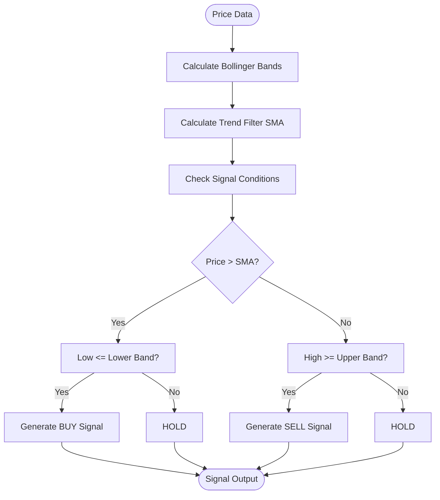
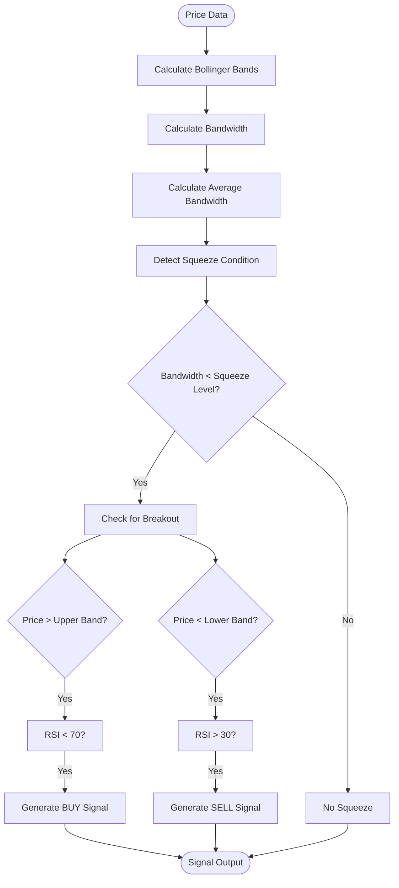
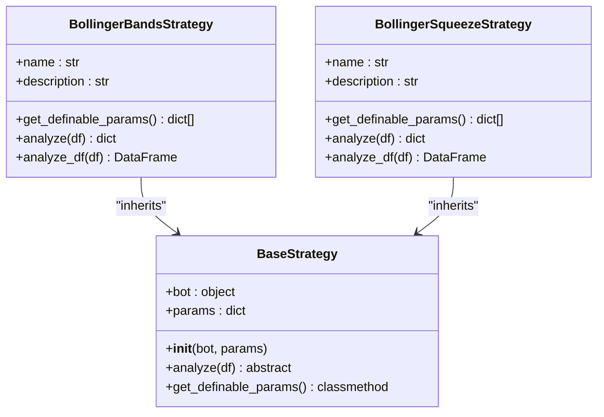
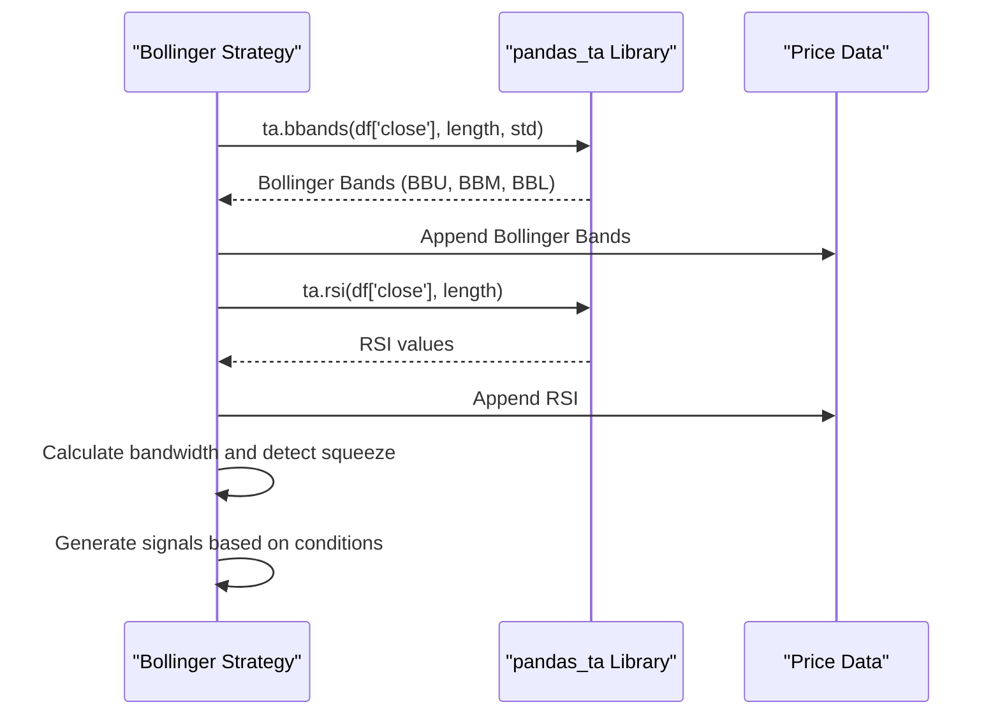
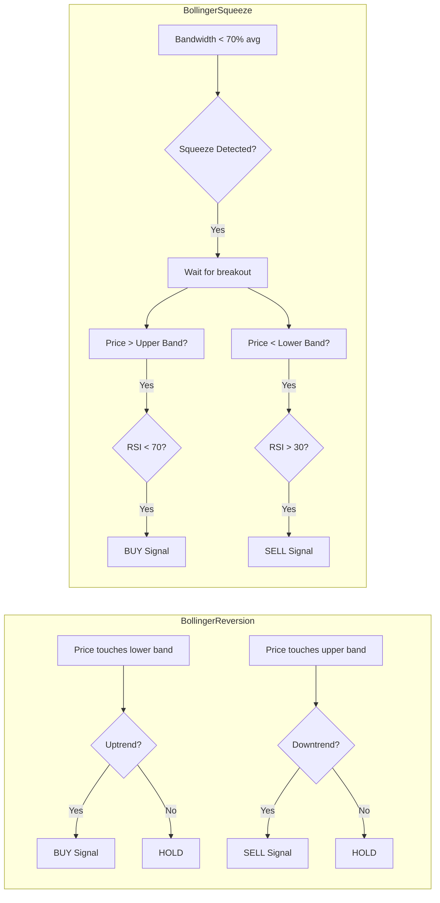
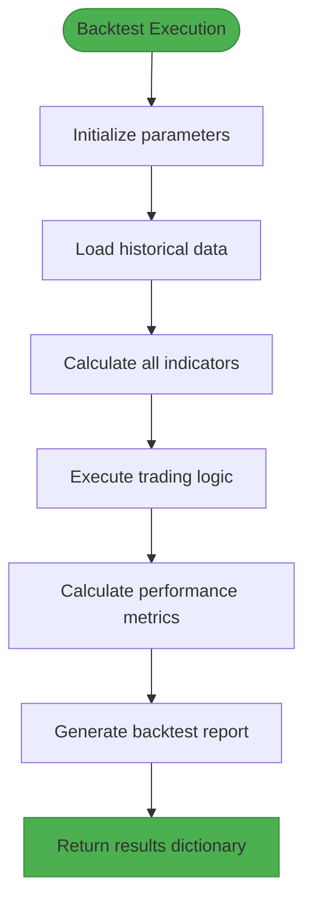
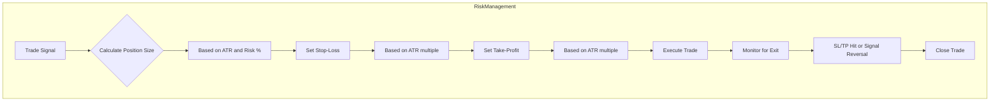

# Bollinger Band Strategies

<cite>
**Referenced Files in This Document**   
- [bollinger_reversion.py](file://core/strategies/bollinger_reversion.py)
- [bollinger_squeeze.py](file://core/strategies/bollinger_squeeze.py)
- [bollinger_squeeze_test.py](file://core/strategies/bollinger_squeeze_test.py)
- [base_strategy.py](file://core/strategies/base_strategy.py)
- [engine.py](file://core/backtesting/engine.py)
</cite>

## Table of Contents
1. [Introduction](#introduction)
2. [Bollinger Reversion Strategy](#bollinger-reversion-strategy)
3. [Bollinger Squeeze Strategy](#bollinger-squeeze-strategy)
4. [Parameter Configuration](#parameter-configuration)
5. [Indicator Integration](#indicator-integration)
6. [Signal Generation Examples](#signal-generation-examples)
7. [Backtesting Performance Metrics](#backtesting-performance-metrics)
8. [Common Issues and Risk Management](#common-issues-and-risk-management)

## Introduction
This document provides a comprehensive analysis of two Bollinger Band-based trading strategies implemented in the QuantumBotX system: Bollinger Reversion and Bollinger Squeeze. Both strategies leverage the pandas_ta library for technical indicator calculations and are designed to identify specific market conditions for generating trading signals. The Bollinger Reversion strategy focuses on mean-reversion opportunities when price touches or crosses the Bollinger Bands, while the Bollinger Squeeze strategy identifies periods of low volatility as precursors to potential breakout moves. These strategies inherit from a common base class and are integrated into a larger trading system with backtesting capabilities.

## Bollinger Reversion Strategy

The Bollinger Reversion strategy implements a mean-reversion approach based on price interaction with Bollinger Bands. This strategy generates signals when the price touches or crosses the upper or lower bands, with additional confirmation from a long-term trend filter.

### Mean-Reversion Logic
The strategy uses Bollinger Bands to identify overbought and oversold conditions in the market. When the price touches or crosses the lower band during an uptrend, it generates a BUY signal, indicating a potential reversal from an oversold condition. Conversely, when the price touches or crosses the upper band during a downtrend, it generates a SELL signal, indicating a potential reversal from an overbought condition.

The implementation includes a trend filter using a Simple Moving Average (SMA) to confirm the direction of the primary trend. This prevents counter-trend trades and improves the quality of signals. The strategy only generates signals when the price is in the direction of the long-term trend, making it a trend-following mean-reversion hybrid.

### Position Sizing Based on Deviation
While the strategy itself doesn't directly implement position sizing based on deviation from the middle band, the system's backtesting engine incorporates risk management that considers market conditions. The position sizing is determined by the backtesting engine based on the Average True Range (ATR) and user-defined risk parameters, ensuring that trades are sized appropriately according to current volatility.

**Diagram sources**
- [bollinger_reversion.py](file://core/strategies/bollinger_reversion.py#L30-L75)

**Section sources**
- [bollinger_reversion.py](file://core/strategies/bollinger_reversion.py#L0-L75)

## Bollinger Squeeze Strategy

The Bollinger Squeeze strategy detects periods of low volatility (squeeze) that often precede significant breakout moves in price. This strategy is particularly effective in identifying consolidation phases and anticipating the subsequent directional move.

### Volatility Contraction Detection
The strategy identifies squeeze conditions by comparing the current Bollinger Band width to its historical average. When the current bandwidth falls below a threshold (determined by the squeeze factor), a squeeze condition is detected. The bandwidth is calculated as the percentage difference between the upper and lower bands relative to the middle band (SMA).

The implementation uses a rolling average of the bandwidth over a specified window period to establish the baseline for comparison. A squeeze occurs when the current bandwidth is significantly lower than this average, indicating reduced volatility and potential consolidation.

### Breakout Signal Generation
Once a squeeze condition is detected, the strategy waits for a breakout confirmation. A bullish breakout is confirmed when the price closes above the upper Bollinger Band, while a bearish breakout is confirmed when the price closes below the lower Bollinger Band. The strategy also incorporates RSI filtering to avoid overbought/oversold conditions that might lead to false breakouts.

The signal logic prioritizes breakout signals during squeeze conditions, making it a high-probability setup for capturing the beginning of new trends after periods of consolidation.

**Diagram sources**
- [bollinger_squeeze.py](file://core/strategies/bollinger_squeeze.py#L60-L87)

**Section sources**
- [bollinger_squeeze.py](file://core/strategies/bollinger_squeeze.py#L0-L87)

## Parameter Configuration

Both Bollinger strategies offer configurable parameters that allow users to adapt the strategies to different market conditions and trading preferences.

### Bollinger Reversion Parameters
The Bollinger Reversion strategy has three key parameters:
- **bb_length**: Length of the Bollinger Bands calculation (default: 20)
- **bb_std**: Standard deviation multiplier for the bands (default: 2.0)
- **trend_filter_period**: Period for the SMA trend filter (default: 200)

These parameters control the sensitivity of the bands and the timeframe of the trend filter. A longer bb_length creates wider bands that are less sensitive to price movements, while a higher bb_std increases the distance between the bands and the middle line.

### Bollinger Squeeze Parameters
The Bollinger Squeeze strategy has five key parameters:
- **bb_length**: Length of the Bollinger Bands calculation (default: 20)
- **bb_std**: Standard deviation multiplier for the bands (default: 2.0)
- **squeeze_window**: Window period for calculating average bandwidth (default: 10)
- **squeeze_factor**: Factor used to determine the squeeze threshold (default: 0.7)
- **rsi_period**: Period for RSI calculation (default: 14)

The squeeze_factor is particularly important as it determines how narrow the bands must be to qualify as a squeeze. A lower factor (e.g., 0.5) requires a more extreme contraction, resulting in fewer but potentially higher-quality signals.

**Diagram sources**
- [bollinger_reversion.py](file://core/strategies/bollinger_reversion.py#L0-L75)
- [bollinger_squeeze.py](file://core/strategies/bollinger_squeeze.py#L0-L87)
- [base_strategy.py](file://core/strategies/base_strategy.py#L0-L28)

**Section sources**
- [bollinger_reversion.py](file://core/strategies/bollinger_reversion.py#L0-L75)
- [bollinger_squeeze.py](file://core/strategies/bollinger_squeeze.py#L0-L87)

## Indicator Integration

Both strategies integrate with technical indicators to enhance signal quality and provide additional confirmation.

### Pandas_ta Integration
The strategies use the pandas_ta library to calculate Bollinger Bands and other technical indicators. The Bollinger Bands are calculated using the ta.bbands() function, which returns the upper band (BBU), middle band (BBM), and lower band (BBL) columns. The implementation appends these columns directly to the price DataFrame for easy access.

For the Bollinger Squeeze strategy, the bandwidth is calculated as the percentage difference between the upper and lower bands relative to the middle band. This normalized measure allows for comparison across different assets and timeframes.

### Volume and RSI Confirmation
While the core Bollinger Squeeze strategy doesn't directly use volume in its main signal logic, the test implementation shows volume analysis as a potential confirmation tool. Volume surge (defined as current volume exceeding the 10-period average by 50%) can be used to validate breakout signals, as genuine breakouts are typically accompanied by increased volume.

The RSI indicator is integrated into the Bollinger Squeeze strategy as a filter to prevent false breakouts. By requiring that RSI is below 70 for buy signals and above 30 for sell signals, the strategy avoids entering trades when the market is already overbought or oversold, which could indicate exhaustion rather than the beginning of a new trend.

**Diagram sources**
- [bollinger_squeeze.py](file://core/strategies/bollinger_squeeze.py#L60-L87)
- [bollinger_reversion.py](file://core/strategies/bollinger_reversion.py#L30-L75)

**Section sources**
- [bollinger_squeeze.py](file://core/strategies/bollinger_squeeze.py#L0-L87)
- [bollinger_reversion.py](file://core/strategies/bollinger_reversion.py#L0-L75)

## Signal Generation Examples

This section provides concrete examples of how signals are generated by both strategies under different market conditions.

### Bollinger Reversion Example
Consider a scenario where the price is in an uptrend (price above the 200-period SMA) and declines to touch the lower Bollinger Band. The strategy would generate a BUY signal with the explanation "Uptrend & Oversold: Harga menyentuh Band Bawah." This indicates that despite the short-term decline, the primary trend is still up, and the price has reached an oversold condition, presenting a buying opportunity.

Conversely, if the price is in a downtrend (price below the 200-period SMA) and rallies to touch the upper Bollinger Band, the strategy would generate a SELL signal with the explanation "Downtrend & Overbought: Harga menyentuh Band Atas." This indicates a short-selling opportunity in the direction of the primary trend.

### Bollinger Squeeze Example
When the Bollinger Bands contract significantly (bandwidth falls below 70% of its 10-period average), a squeeze condition is detected. If the price then closes above the upper band with RSI below 70, a BUY signal is generated with the explanation "Squeeze & Breakout NAIK!" This indicates a bullish breakout from a consolidation phase.

Similarly, if the price closes below the lower band with RSI above 30, a SELL signal is generated with the explanation "Squeeze & Breakout TURUN!" This indicates a bearish breakout. The RSI filter prevents signals when the market is already overextended, reducing the likelihood of false breakouts.

**Diagram sources**
- [bollinger_reversion.py](file://core/strategies/bollinger_reversion.py#L30-L75)
- [bollinger_squeeze.py](file://core/strategies/bollinger_squeeze.py#L60-L87)

**Section sources**
- [bollinger_reversion.py](file://core/strategies/bollinger_reversion.py#L30-L75)
- [bollinger_squeeze.py](file://core/strategies/bollinger_squeeze.py#L60-L87)

## Backtesting Performance Metrics

The strategies are evaluated using a comprehensive backtesting engine that provides detailed performance metrics.

### Performance Evaluation
The backtesting engine calculates several key performance metrics:
- **Total Profit**: The net profit in USD from all trades
- **Win Rate**: The percentage of winning trades
- **Max Drawdown**: The maximum peak-to-trough decline during the backtest
- **Total Trades**: The number of trades executed
- **Final Capital**: The ending capital after all trades

These metrics are returned as a dictionary from the backtesting function and include the equity curve for visual analysis of performance over time.

### Risk-Adjusted Returns
The system emphasizes risk management by incorporating position sizing based on volatility (ATR) and maximum risk per trade. This ensures that performance is evaluated not just on profitability but also on risk-adjusted returns. The backtesting engine logs detailed information about each trade, including entry and exit prices, profit/loss, and the reason for exit (SL/TP).

**Diagram sources**
- [engine.py](file://core/backtesting/engine.py#L290-L317)

**Section sources**
- [engine.py](file://core/backtesting/engine.py#L290-L317)

## Common Issues and Risk Management

This section addresses common challenges with Bollinger Band strategies and the risk management approaches implemented in the system.

### False Breakouts
False breakouts are a common issue with breakout strategies like Bollinger Squeeze. The system addresses this by incorporating RSI filtering to avoid signals when the market is already overbought or oversold. Additionally, the requirement for the price to close beyond the bands (rather than just intrabar excursions) helps filter out false signals caused by market noise.

### Band Repainting
The strategies avoid band repainting issues by using only historical data up to the current bar when calculating signals. The implementation does not use future data or recalculate bands based on future price movements, ensuring that signals are based on information available at the time of decision-making.

### Risk Management Recommendations
The system implements comprehensive risk management:
- Position sizing based on ATR to adjust for current volatility
- Maximum risk per trade as a percentage of capital
- Special handling for high-volatility instruments like XAUUSD with conservative lot sizing
- Stop-loss and take-profit levels based on ATR multiples
- Maximum drawdown limits to protect capital

These risk management features are integrated into the backtesting engine and live trading system, ensuring consistent risk controls across different market conditions.

**Diagram sources**
- [engine.py](file://core/backtesting/engine.py#L290-L317)

**Section sources**
- [engine.py](file://core/backtesting/engine.py#L290-L317)