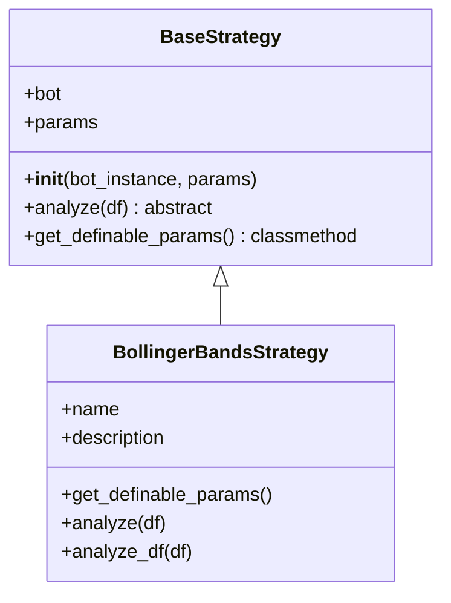
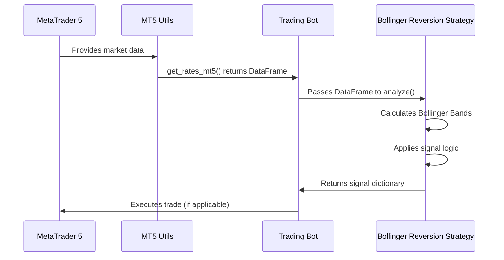
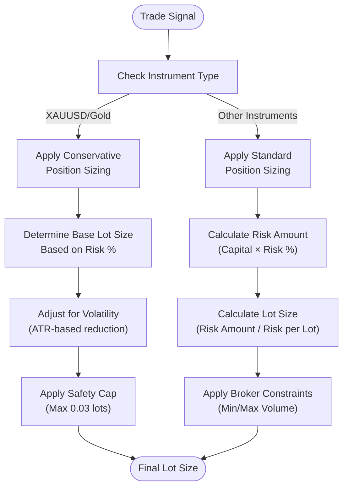
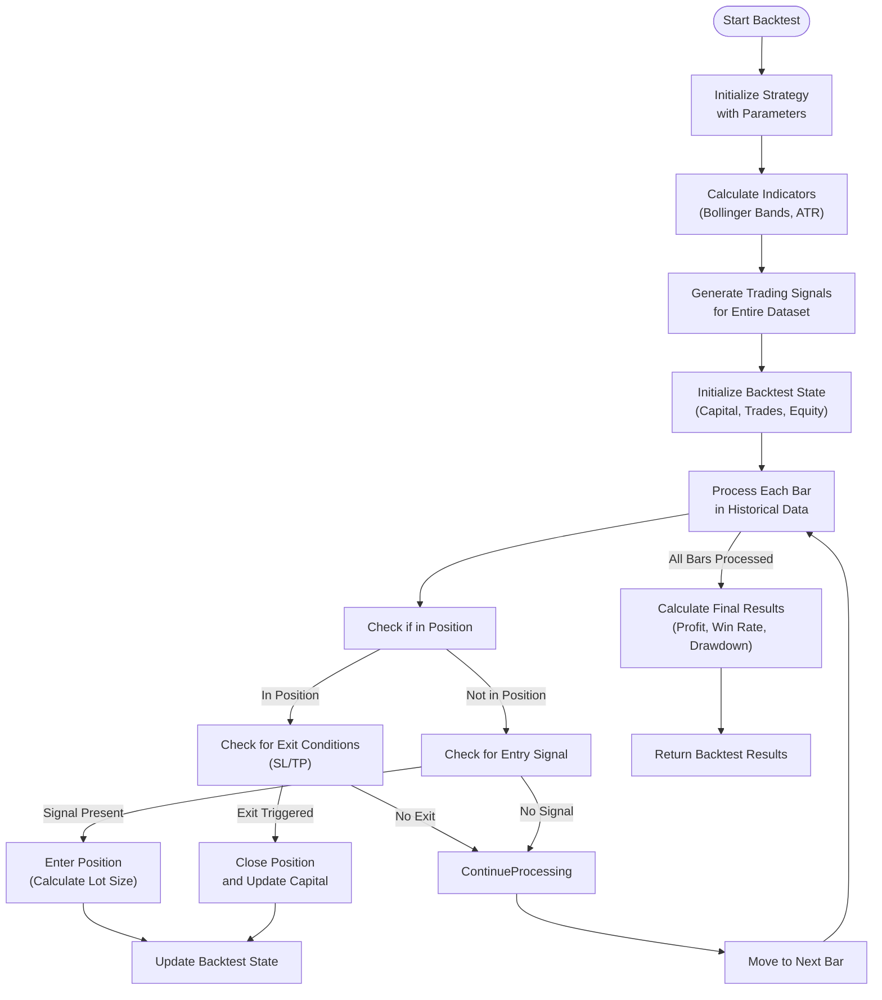

# Bollinger Reversion Strategy

<cite>
**Referenced Files in This Document**   
- [bollinger_reversion.py](file://core/strategies/bollinger_reversion.py)
- [base_strategy.py](file://core/strategies/base_strategy.py)
- [strategy_map.py](file://core/strategies/strategy_map.py)
- [engine.py](file://core/backtesting/engine.py)
- [mt5.py](file://core/utils/mt5.py)
</cite>

## Table of Contents
1. [Introduction](#introduction)
2. [Strategy Overview](#strategy-overview)
3. [Core Components](#core-components)
4. [Signal Generation Logic](#signal-generation-logic)
5. [Configuration Parameters](#configuration-parameters)
6. [Integration with Market Data](#integration-with-market-data)
7. [Risk Management and Position Sizing](#risk-management-and-position-sizing)
8. [Backtesting Implementation](#backtesting-implementation)
9. [Common Issues and Best Practices](#common-issues-and-best-practices)
10. [Conclusion](#conclusion)

## Introduction
The Bollinger Reversion Strategy is a mean-reversion trading approach that identifies potential entry points when price touches or crosses the upper and lower Bollinger Bands. This document provides a comprehensive analysis of the strategy's implementation, including its signal generation logic, configuration parameters, integration with market data, and risk management features. The strategy is designed to work within a larger trading system that includes backtesting capabilities, risk controls, and MT5 integration.

## Strategy Overview
The Bollinger Reversion Strategy implements a mean-reversion trading logic that generates buy and sell signals based on price interaction with Bollinger Bands. The strategy uses the pandas_ta library to calculate Bollinger Bands with configurable window size and standard deviation multiplier. It incorporates a long-term trend filter using a Simple Moving Average (SMA) to improve signal quality.

The strategy operates on the principle that when price reaches the upper or lower Bollinger Band, it is likely to revert to the mean (middle band). However, the strategy only generates signals when the price movement aligns with the long-term trend direction, reducing false signals in strongly trending markets.

**Section sources**
- [bollinger_reversion.py](file://core/strategies/bollinger_reversion.py#L1-L10)

## Core Components

### Strategy Class Structure
The Bollinger Reversion Strategy is implemented as a class that inherits from the BaseStrategy abstract class. This inheritance structure allows the strategy to integrate seamlessly with the broader trading system while implementing its specific logic.



**Diagram sources**
- [bollinger_reversion.py](file://core/strategies/bollinger_reversion.py#L1-L75)
- [base_strategy.py](file://core/strategies/base_strategy.py#L1-L29)

**Section sources**
- [bollinger_reversion.py](file://core/strategies/bollinger_reversion.py#L1-L75)
- [base_strategy.py](file://core/strategies/base_strategy.py#L1-L29)

### Bollinger Bands Calculation
The strategy uses the pandas_ta library to calculate Bollinger Bands. The bands are calculated using a moving average (typically a Simple Moving Average) as the middle band, with upper and lower bands placed at a specified number of standard deviations from the middle band.

The calculation follows the standard Bollinger Bands formula:
- Middle Band = SMA(window_size)
- Upper Band = Middle Band + (standard_deviation_multiplier × STD(window_size))
- Lower Band = Middle Band - (standard_deviation_multiplier × STD(window_size))

The strategy dynamically generates column names for the Bollinger Bands based on the configuration parameters, ensuring compatibility with different parameter settings.

```python
# Bollinger Bands calculation in the strategy
bb_length = self.params.get('bb_length', 20)
bb_std = self.params.get('bb_std', 2.0)
bbu_col = f'BBU_{bb_length}_{bb_std:.1f}'
bbl_col = f'BBL_{bb_length}_{bb_std:.1f}'

df.ta.bbands(length=bb_length, std=bb_std, append=True)
```

**Section sources**
- [bollinger_reversion.py](file://core/strategies/bollinger_reversion.py#L30-L40)

## Signal Generation Logic
The Bollinger Reversion Strategy generates signals based on price interaction with the Bollinger Bands, combined with a long-term trend filter. The strategy evaluates the distance from the middle band (SMA) to determine position sizing and signal strength.

### Live Trading Signal Logic
The `analyze` method is used for live trading and processes market data to generate trading signals. The method first checks for sufficient data, then calculates the Bollinger Bands and trend filter.

```mermaid
flowchart TD
Start([Start Analysis]) --> CheckData["Check Data Availability<br/>and Length"]
CheckData --> |Insufficient Data| ReturnHold["Return HOLD Signal"]
CheckData --> |Sufficient Data| CalculateIndicators["Calculate Bollinger Bands<br/>and Trend Filter"]
CalculateIndicators --> CheckEmpty["Check for NaN Values"]
CheckEmpty --> |Empty DataFrame| ReturnHold
CheckEmpty --> |Valid Data| GetLastValues["Get Last Price and<br/>Indicator Values"]
GetLastValues --> DetermineTrend["Determine Trend Direction<br/>(Price vs Trend Filter)"]
DetermineTrend --> CheckBuySignal["Check Buy Conditions:<br/>Uptrend & Price ≤ Lower Band"]
DetermineTrend --> CheckSellSignal["Check Sell Conditions:<br/>Downtrend & Price ≥ Upper Band"]
CheckBuySignal --> |Conditions Met| GenerateBuy["Generate BUY Signal"]
CheckSellSignal --> |Conditions Met| GenerateSell["Generate SELL Signal"]
GenerateBuy --> ReturnSignal
GenerateSell --> ReturnSignal
CheckBuySignal --> |Not Met| CheckSellSignal
CheckSellSignal --> |Not Met| ReturnHold
ReturnHold --> ReturnSignal
ReturnSignal([Return Signal<br/>(BUY, SELL, or HOLD)])
```

**Diagram sources**
- [bollinger_reversion.py](file://core/strategies/bollinger_reversion.py#L40-L60)

**Section sources**
- [bollinger_reversion.py](file://core/strategies/bollinger_reversion.py#L40-L60)

### Backtesting Signal Logic
The `analyze_df` method is optimized for backtesting and processes the entire DataFrame at once to generate signals for all time periods. This approach is more efficient for historical analysis.

```python
def analyze_df(self, df):
    """Method for BACKTESTING."""
    bb_length = self.params.get('bb_length', 20)
    bb_std = self.params.get('bb_std', 2.0)
    trend_filter_period = self.params.get('trend_filter_period', 200)

    bbu_col = f'BBU_{bb_length}_{bb_std:.1f}'
    bbl_col = f'BBL_{bb_length}_{bb_std:.1f}'
    trend_filter_col = f'SMA_{trend_filter_period}'

    df.ta.bbands(length=bb_length, std=bb_std, append=True)
    df[trend_filter_col] = ta.sma(df['close'], length=trend_filter_period)

    is_uptrend = df['close'] > df[trend_filter_col]
    is_downtrend = df['close'] < df[trend_filter_col]

    buy_signal = is_uptrend & (df['low'] <= df[bbl_col])
    sell_signal = is_downtrend & (df['high'] >= df[bbu_col])

    df['signal'] = np.where(buy_signal, 'BUY', np.where(sell_signal, 'SELL', 'HOLD'))

    return df
```

The backtesting logic uses vectorized operations for efficiency, applying the signal conditions across the entire DataFrame simultaneously. This approach significantly improves performance when processing large historical datasets.

**Section sources**
- [bollinger_reversion.py](file://core/strategies/bollinger_reversion.py#L62-L75)

## Configuration Parameters
The Bollinger Reversion Strategy exposes several configurable parameters that allow users to customize its behavior. These parameters are defined in the `get_definable_params` class method and can be adjusted through the user interface.

### Parameter Definitions
The strategy supports the following configurable parameters:

:cite
**Configuration Parameters**
- **bb_length**: Window size for Bollinger Bands calculation (default: 20)
- **bb_std**: Standard deviation multiplier for Bollinger Bands (default: 2.0)
- **trend_filter_period**: Period for the long-term trend filter SMA (default: 200)
:cite

These parameters can be modified to adapt the strategy to different market conditions and trading styles. For example, a shorter `bb_length` makes the bands more responsive to price changes, while a longer `trend_filter_period` provides a more stable trend indication.

The parameters are accessed through the `self.params` dictionary in the strategy methods, with default values provided to ensure the strategy functions even if specific parameters are not set.

**Section sources**
- [bollinger_reversion.py](file://core/strategies/bollinger_reversion.py#L10-L20)

## Integration with Market Data
The Bollinger Reversion Strategy integrates with market data through the MT5 utilities and the broader trading system architecture. The strategy does not directly connect to the MT5 platform but receives market data from the trading bot controller.

### Data Flow Architecture
The data flow for the Bollinger Reversion Strategy follows a well-defined pattern from data acquisition to signal generation:



**Diagram sources**
- [bollinger_reversion.py](file://core/strategies/bollinger_reversion.py#L40-L60)
- [mt5.py](file://core/utils/mt5.py#L37-L65)
- [trading_bot.py](file://core/bots/trading_bot.py#L64-L87)

**Section sources**
- [bollinger_reversion.py](file://core/strategies/bollinger_reversion.py#L40-L60)
- [mt5.py](file://core/utils/mt5.py#L37-L65)

### Market Data Acquisition
The strategy relies on the `get_rates_mt5` function from the MT5 utilities module to acquire market data. This function retrieves historical price data from the MetaTrader 5 platform and returns it as a pandas DataFrame, which is the expected input format for the strategy's analysis methods.

The trading bot periodically calls this function to update the market data and passes the resulting DataFrame to the strategy's `analyze` method. This decoupled architecture allows for easy testing and replacement of data sources.

**Section sources**
- [mt5.py](file://core/utils/mt5.py#L37-L65)

## Risk Management and Position Sizing
The Bollinger Reversion Strategy operates within a comprehensive risk management framework that includes position sizing, stop-loss placement, and various risk controls. While the strategy itself focuses on signal generation, the broader system implements sophisticated risk management features.

### Position Sizing Logic
The backtesting engine implements dynamic position sizing based on account capital and risk parameters. For high-volatility instruments like XAUUSD, the system applies additional risk controls:



**Diagram sources**
- [engine.py](file://core/backtesting/engine.py#L159-L222)

**Section sources**
- [engine.py](file://core/backtesting/engine.py#L159-L222)

### Risk Controls
The system implements multiple layers of risk controls to protect the trading account:

- **Maximum risk per trade**: Limited to 5% of account capital
- **Instrument-specific limits**: XAUUSD trades are capped at 0.03 lots maximum
- **Volatility-based adjustments**: Position size reduced during high volatility periods
- **Emergency brake**: Trades skipped if estimated risk exceeds threshold
- **Parameter capping**: Risk percentage and ATR multipliers are capped to prevent excessive risk

These controls work together to prevent catastrophic losses, particularly in volatile markets where Bollinger Bands signals might lead to large losses if not properly managed.

**Section sources**
- [engine.py](file://core/backtesting/engine.py#L222-L243)
- [XAUUSD_FIXES_COMPLETE.md](file://XAUUSD_FIXES_COMPLETE.md#L66-L93)

## Backtesting Implementation
The Bollinger Reversion Strategy is integrated with a comprehensive backtesting engine that allows for thorough evaluation of its performance. The backtesting process follows a structured approach to simulate trading performance on historical data.

### Backtesting Workflow
The backtesting workflow consists of several key steps:



**Diagram sources**
- [engine.py](file://core/backtesting/engine.py#L0-L318)

**Section sources**
- [engine.py](file://core/backtesting/engine.py#L0-L318)

### Strategy Registration
The Bollinger Reversion Strategy is registered in the system through the strategy map, which allows it to be selected and configured through the user interface:

```python
# strategy_map.py
from .bollinger_reversion import BollingerBandsStrategy

STRATEGY_MAP = {
    'BOLLINGER_REVERSION': BollingerBandsStrategy,
    # ... other strategies
}
```

This registration enables the strategy to be accessed via API endpoints and displayed in the web interface, making it available for both manual selection and automated trading.

**Section sources**
- [strategy_map.py](file://core/strategies/strategy_map.py#L1-L30)

## Common Issues and Best Practices

### Common Issues
The Bollinger Reversion Strategy, like any mean-reversion approach, faces several common challenges:

**Whipsaw in Volatile Markets**: In highly volatile markets, price can repeatedly touch and cross the Bollinger Bands, generating multiple false signals in quick succession. This can lead to a series of losing trades when the market is trending strongly.

**Band Repainting**: The Bollinger Bands are calculated using a lookback window, which means that as new data arrives, the historical band values can change. This can create a misleading impression of past signal accuracy when reviewing historical data.

**Lagging Indicators**: Both the Bollinger Bands and the trend filter are based on moving averages, which are inherently lagging indicators. This means signals are generated after price movements have already occurred, potentially reducing profitability.

### Best Practices
To address these issues and optimize the strategy's performance, consider the following best practices:

**Parameter Tuning**: Carefully tune the strategy parameters based on the specific instrument and timeframe:
- Use a longer `bb_length` for slower, more stable markets
- Adjust the `bb_std` multiplier based on the instrument's volatility
- Set the `trend_filter_period` to align with the dominant market cycle

**Risk Management**: Implement strict risk controls:
- Use appropriate position sizing based on account size and risk tolerance
- Place stop-loss orders to limit potential losses
- Consider using trailing stops to protect profits in favorable moves

**Confirmation Indicators**: While the current implementation does not include volume confirmation, other strategies in the system demonstrate this approach. Consider adding volume analysis to confirm breakout signals:
- Require above-average volume for breakout signals
- Use volume divergence as an additional filter
- Combine with other momentum indicators like RSI

**Market Regime Adaptation**: Adapt the strategy to different market conditions:
- Use tighter bands in ranging markets
- Widen bands in trending markets
- Adjust position size based on volatility (ATR)

**Backtesting and Validation**: Thoroughly test the strategy before live deployment:
- Test across multiple market conditions (trending, ranging, volatile)
- Validate on out-of-sample data
- Consider forward testing in a demo account

**Section sources**
- [bollinger_reversion.py](file://core/strategies/bollinger_reversion.py#L1-L75)
- [bollinger_squeeze.py](file://core/strategies/bollinger_squeeze.py#L1-L88)
- [engine.py](file://core/backtesting/engine.py#L159-L222)

## Conclusion
The Bollinger Reversion Strategy is a well-structured mean-reversion trading approach that effectively combines Bollinger Bands with a long-term trend filter to generate trading signals. The strategy is implemented as a modular component within a larger trading system, allowing for easy integration, testing, and deployment.

Key strengths of the strategy include its clear logic, configurable parameters, and integration with a comprehensive risk management framework. The use of the pandas_ta library for indicator calculation ensures accuracy and consistency in signal generation.

While the strategy has the potential to perform well in ranging markets, traders should be aware of its limitations in strongly trending conditions and high-volatility environments. By following best practices for parameter tuning, risk management, and market regime adaptation, traders can optimize the strategy's performance and mitigate common issues like whipsaw and false signals.

The strategy's integration with the backtesting engine and MT5 platform provides a complete solution for both development and live trading, making it a valuable component of a diversified trading approach.