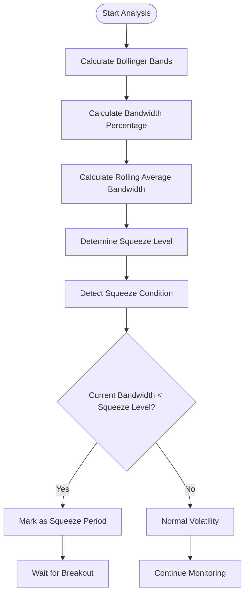
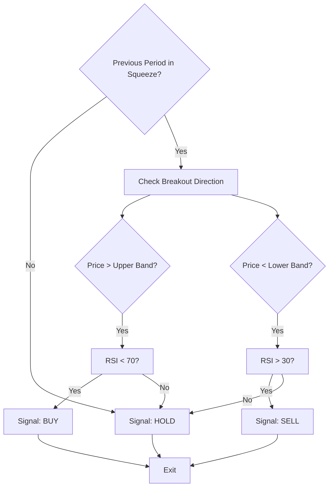
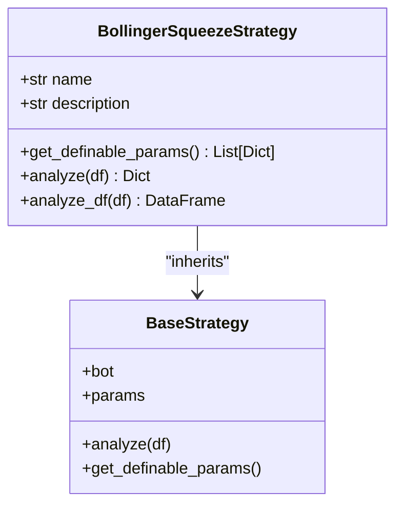
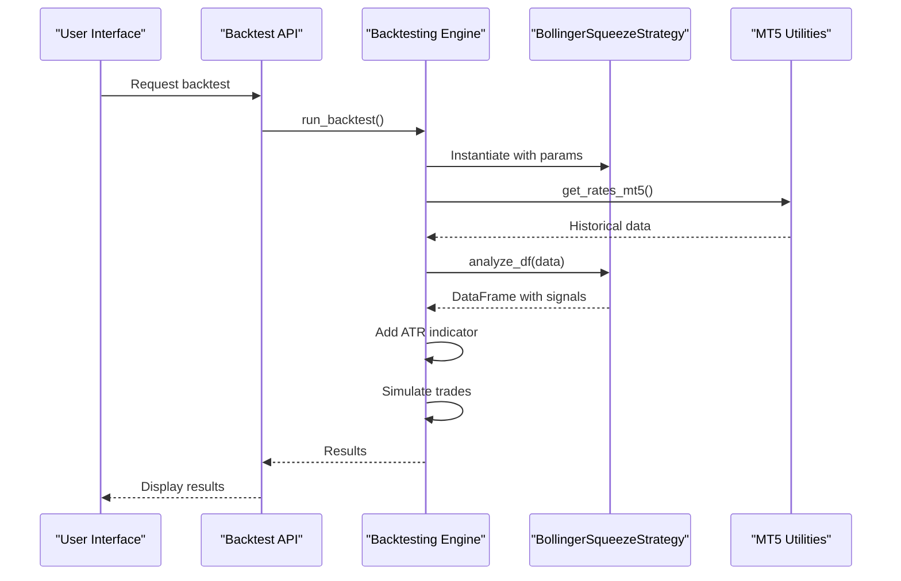

# Bollinger Squeeze Strategy

<cite>
**Referenced Files in This Document**   
- [bollinger_squeeze.py](file://core/strategies/bollinger_squeeze.py)
- [bollinger_squeeze_test.py](file://core/strategies/bollinger_squeeze_test.py)
- [base_strategy.py](file://core/strategies/base_strategy.py)
- [mt5.py](file://core/utils/mt5.py)
- [engine.py](file://core/backtesting/engine.py)
</cite>

## Table of Contents
1. [Introduction](#introduction)
2. [Strategy Overview](#strategy-overview)
3. [Volatility Contraction Detection Mechanism](#volatility-contraction-detection-mechanism)
4. [Squeeze Detection and Bandwidth Calculation](#squeeze-detection-and-bandwidth-calculation)
5. [Breakout Confirmation Logic](#breakout-confirmation-logic)
6. [Key Parameters and Configuration](#key-parameters-and-configuration)
7. [Code Implementation and Integration](#code-implementation-and-integration)
8. [Integration with MT5 and Historical Data](#integration-with-mt5-and-historical-data)
9. [Backtesting Engine Integration](#backtesting-engine-integration)
10. [Common Pitfalls and Optimization Recommendations](#common-pitfalls-and-optimization-recommendations)

## Introduction
The Bollinger Squeeze strategy is a volatility-based trading approach designed to identify periods of low volatility (squeeze) as precursors to high-momentum breakouts. This document provides a comprehensive analysis of the strategy implementation within the QuantumBotX system, detailing its detection mechanisms, parameter configuration, code structure, and integration with technical indicators and market data sources. The strategy leverages Bollinger Bands to measure volatility contraction and combines this with RSI for breakout confirmation, creating a robust system for identifying potential price movements.

## Strategy Overview
The Bollinger Squeeze strategy operates on the principle that periods of low volatility often precede significant price movements. When Bollinger Bands contract to an unusually narrow width, it indicates decreasing volatility and potential consolidation. The strategy identifies these "squeeze" conditions and waits for a breakout above or below the bands to generate trading signals. The implementation in QuantumBotX extends the basic squeeze concept by incorporating RSI filtering to avoid overbought/oversold conditions during breakout confirmation.

**Section sources**
- [bollinger_squeeze.py](file://core/strategies/bollinger_squeeze.py#L1-L10)

## Volatility Contraction Detection Mechanism
The strategy detects volatility contraction through a systematic process that compares current Bollinger Band width against historical averages. The mechanism identifies narrow band conditions as precursors to high-momentum breakouts by calculating the bandwidth percentage and comparing it to a dynamically determined threshold.

The detection process follows these steps:
1. Calculate Bollinger Bands using a configurable moving average length and standard deviation
2. Compute the bandwidth as a percentage of the middle band
3. Establish a historical average bandwidth over a specified window
4. Determine a squeeze level by applying a factor to the average bandwidth
5. Identify squeeze conditions when current bandwidth falls below the squeeze level

This multi-step approach ensures that squeeze detection is relative to recent market conditions rather than relying on absolute values, making it adaptable to different assets and timeframes.

**Section sources**
- [bollinger_squeeze.py](file://core/strategies/bollinger_squeeze.py#L30-L45)

## Squeeze Detection and Bandwidth Calculation
The strategy calculates bandwidth and detects squeeze conditions using precise mathematical formulas implemented in the `analyze` method. The bandwidth is calculated as the percentage difference between the upper and lower Bollinger Bands relative to the middle band (SMA).

```python
df['BB_BANDWIDTH'] = np.where(df[bbm_col] != 0, (df[bbu_col] - df[bbl_col]) / df[bbm_col] * 100, 0)
```

The squeeze detection logic uses a rolling average of bandwidth values over a configurable window and applies a squeeze factor to determine the threshold:

```python
df['AVG_BANDWIDTH'] = df['BB_BANDWIDTH'].rolling(window=squeeze_window).mean()
df['SQUEEZE_LEVEL'] = df['AVG_BANDWIDTH'] * squeeze_factor
df['SQUEEZE'] = df['BB_BANDWIDTH'] < df['SQUEEZE_LEVEL']
```

This implementation allows for fine-tuning of sensitivity through the `squeeze_factor` parameter, where lower values make the strategy more selective in identifying squeeze conditions.



**Diagram sources**
- [bollinger_squeeze.py](file://core/strategies/bollinger_squeeze.py#L30-L50)

**Section sources**
- [bollinger_squeeze.py](file://core/strategies/bollinger_squeeze.py#L30-L50)

## Breakout Confirmation Logic
The strategy employs a multi-factor approach to confirm breakout direction, combining price action with momentum filtering. The breakout confirmation logic ensures that signals are generated only when multiple conditions align, reducing false positives.

For bullish breakouts:
- Previous period must be in squeeze condition
- Current close must be above the previous upper Bollinger Band
- RSI must be below 70 (avoiding overbought conditions)

For bearish breakouts:
- Previous period must be in squeeze condition
- Current close must be below the previous lower Bollinger Band
- RSI must be above 30 (avoiding oversold conditions)

```python
if prev['SQUEEZE']:
    if last['close'] > prev[bbu_col] and last['RSI'] < 70:
        signal = "BUY"
        explanation = "Squeeze & Breakout NAIK!"
    elif last['close'] < prev[bbl_col] and last['RSI'] > 30:
        signal = "SELL"
        explanation = "Squeeze & Breakout TURUN!"
```

The use of the previous period's Bollinger Band values for comparison ensures that the breakout is measured against the most recent band configuration, accounting for any adjustments in the bands themselves.



**Diagram sources**
- [bollinger_squeeze.py](file://core/strategies/bollinger_squeeze.py#L50-L60)

**Section sources**
- [bollinger_squeeze.py](file://core/strategies/bollinger_squeeze.py#L50-L60)

## Key Parameters and Configuration
The Bollinger Squeeze strategy exposes several configurable parameters that allow users to adapt the strategy to different market conditions, asset classes, and trading preferences. These parameters are defined in the `get_definable_params` class method and can be adjusted through the system's user interface.

### Parameter Definitions
- **bb_length**: Moving average window for Bollinger Bands (default: 20)
- **bb_std**: Standard deviation multiplier for band width (default: 2.0)
- **squeeze_window**: Lookback period for average bandwidth calculation (default: 10)
- **squeeze_factor**: Threshold factor for squeeze detection (default: 0.7)
- **rsi_period**: Period for RSI calculation used in breakout confirmation (default: 14)

The `squeeze_factor` parameter is particularly important as it determines the sensitivity of squeeze detection. A lower value (e.g., 0.5) makes the strategy more selective, identifying only the most extreme contractions, while a higher value (e.g., 0.8) makes it more responsive to moderate contractions.



**Diagram sources**
- [bollinger_squeeze.py](file://core/strategies/bollinger_squeeze.py#L10-L25)
- [base_strategy.py](file://core/strategies/base_strategy.py#L10-L25)

**Section sources**
- [bollinger_squeeze.py](file://core/strategies/bollinger_squeeze.py#L10-L25)

## Code Implementation and Integration
The Bollinger Squeeze strategy is implemented as a class that inherits from the `BaseStrategy` abstract base class, following the system's strategy pattern. The implementation includes two primary methods: `analyze` for live trading and `analyze_df` for backtesting.

### Live Trading Implementation
The `analyze` method processes incoming data in real-time, returning a signal dictionary with the current trading decision:

```python
def analyze(self, df):
    """Method for LIVE TRADING."""
    if df is None or df.empty or len(df) < self.params.get('bb_length', 20) + self.params.get('squeeze_window', 10):
        return {"signal": "HOLD", "price": None, "explanation": "Insufficient data."}
    
    # Strategy logic here...
    return {"signal": signal, "price": price, "explanation": explanation}
```

### Backtesting Implementation
The `analyze_df` method is optimized for backtesting, processing the entire dataset at once and returning a DataFrame with signals for each period:

```python
def analyze_df(self, df):
    """Method for BACKTESTING."""
    # Strategy logic here...
    df['signal'] = np.where(buy_signal, 'BUY', np.where(sell_signal, 'SELL', 'HOLD'))
    return df
```

The dual-method approach allows the strategy to be used efficiently in both real-time trading and historical analysis contexts, with appropriate optimizations for each use case.

**Section sources**
- [bollinger_squeeze.py](file://core/strategies/bollinger_squeeze.py#L25-L87)

## Integration with MT5 and Historical Data
The Bollinger Squeeze strategy integrates with MetaTrader 5 (MT5) through the system's utility functions for retrieving historical market data. The `mt5.py` utility module provides the `get_rates_mt5` function that fetches price data from MT5 servers.

```python
def get_rates_mt5(symbol: str, timeframe: int, count: int = 100):
    """Retrieve historical price data (rates) from MT5 as a DataFrame."""
    try:
        rates = mt5.copy_rates_from_pos(symbol, timeframe, 0, count)
        if rates is None or len(rates) == 0:
            logger.warning(f"Failed to retrieve price data for {symbol} (Timeframe: {timeframe}).")
            return pd.DataFrame()
        
        df = pd.DataFrame(rates)
        df['time'] = pd.to_datetime(df['time'], unit='s')
        df.set_index('time', inplace=True)
        return df
    except Exception as e:
        logger.error(f"Error in get_rates_mt5 for {symbol}: {e}", exc_info=True)
        return pd.DataFrame()
```

This integration allows the Bollinger Squeeze strategy to access real market data for both live trading and backtesting. The strategy can be applied to any symbol available in the MT5 platform, with the data retrieval handled transparently by the system's infrastructure.

**Section sources**
- [mt5.py](file://core/utils/mt5.py#L30-L50)

## Backtesting Engine Integration
The Bollinger Squeeze strategy integrates with the system's backtesting engine through the strategy registry and standardized interface. The backtesting engine, implemented in `engine.py`, uses the `STRATEGY_MAP` to instantiate strategy objects and apply them to historical data.

```python
def run_backtest(strategy_id, params, historical_data_df, symbol_name=None):
    """Run backtesting simulation with dynamic position sizing."""
    strategy_class = STRATEGY_MAP.get(strategy_id)
    if not strategy_class:
        return {"error": "Strategy not found"}

    strategy_instance = strategy_class(bot_instance=MockBot(), params=params)
    df_with_signals = strategy_instance.analyze_df(df)
    df_with_signals.ta.atr(length=14, append=True)
    # ... backtesting logic
```

The backtesting engine enhances the strategy by adding ATR-based risk management, position sizing, and performance metrics calculation. It also includes special handling for volatile instruments like XAUUSD, applying conservative position sizing and risk parameters to protect against extreme market movements.

The integration demonstrates a clean separation of concerns, where the strategy focuses on signal generation while the backtesting engine handles trade execution, risk management, and performance evaluation.



**Diagram sources**
- [engine.py](file://core/backtesting/engine.py#L10-L50)
- [bollinger_squeeze.py](file://core/strategies/bollinger_squeeze.py#L10-L25)

**Section sources**
- [engine.py](file://core/backtesting/engine.py#L10-L50)

## Common Pitfalls and Optimization Recommendations
The Bollinger Squeeze strategy, while powerful, is subject to several common pitfalls that traders should be aware of. Understanding these limitations and applying appropriate optimizations can significantly improve performance across different market conditions.

### Common Pitfalls
1. **False Breakouts**: The strategy may generate signals during whipsaw markets where price briefly breaks the bands but quickly reverses.
2. **Lagging Band Adjustments**: Bollinger Bands are based on moving averages, which inherently lag price movements, potentially causing delayed signals.
3. **Parameter Overfitting**: Optimizing parameters to historical data may result in poor performance on unseen data.
4. **Low Volume Breakouts**: Breakouts without volume confirmation may lack sustainability.

### Optimization Recommendations
1. **Parameter Tuning by Asset Class**:
   - For high-volatility assets (e.g., cryptocurrencies): Use shorter `bb_length` (10-15) and higher `squeeze_factor` (0.75-0.85)
   - For low-volatility assets (e.g., major forex pairs): Use standard parameters (20, 0.7)
   - For commodities (e.g., gold): Consider longer `bb_length` (25-30) to filter noise

2. **Timeframe Considerations**:
   - Shorter timeframes (M1-M15): Reduce `squeeze_window` to 5-7 periods for more responsive signals
   - Longer timeframes (H1-D1): Increase `squeeze_window` to 15-20 periods for more reliable squeezes

3. **Complementary Indicators**:
   - **Volume Surge Detection**: Add volume confirmation by requiring current volume to exceed the 10-period average by 1.5x
   - **ATR Filter**: Use ATR to confirm breakout strength, requiring ATR expansion after the squeeze
   - **Trend Filter**: Incorporate a long-term moving average to align trades with the dominant trend

4. **Risk Management Enhancements**:
   - Implement dynamic position sizing based on squeeze intensity (narrower squeezes = larger positions)
   - Use ATR-based stop-loss and take-profit levels to adapt to current volatility
   - Add a reversion timeout to avoid chasing extended moves after breakout

These recommendations help address the strategy's limitations while enhancing its robustness across different market environments. The modular design of the QuantumBotX system allows for easy implementation of these enhancements through parameter adjustments and strategy composition.

**Section sources**
- [bollinger_squeeze.py](file://core/strategies/bollinger_squeeze.py)
- [bollinger_squeeze_test.py](file://core/strategies/bollinger_squeeze_test.py)
- [engine.py](file://core/backtesting/engine.py)