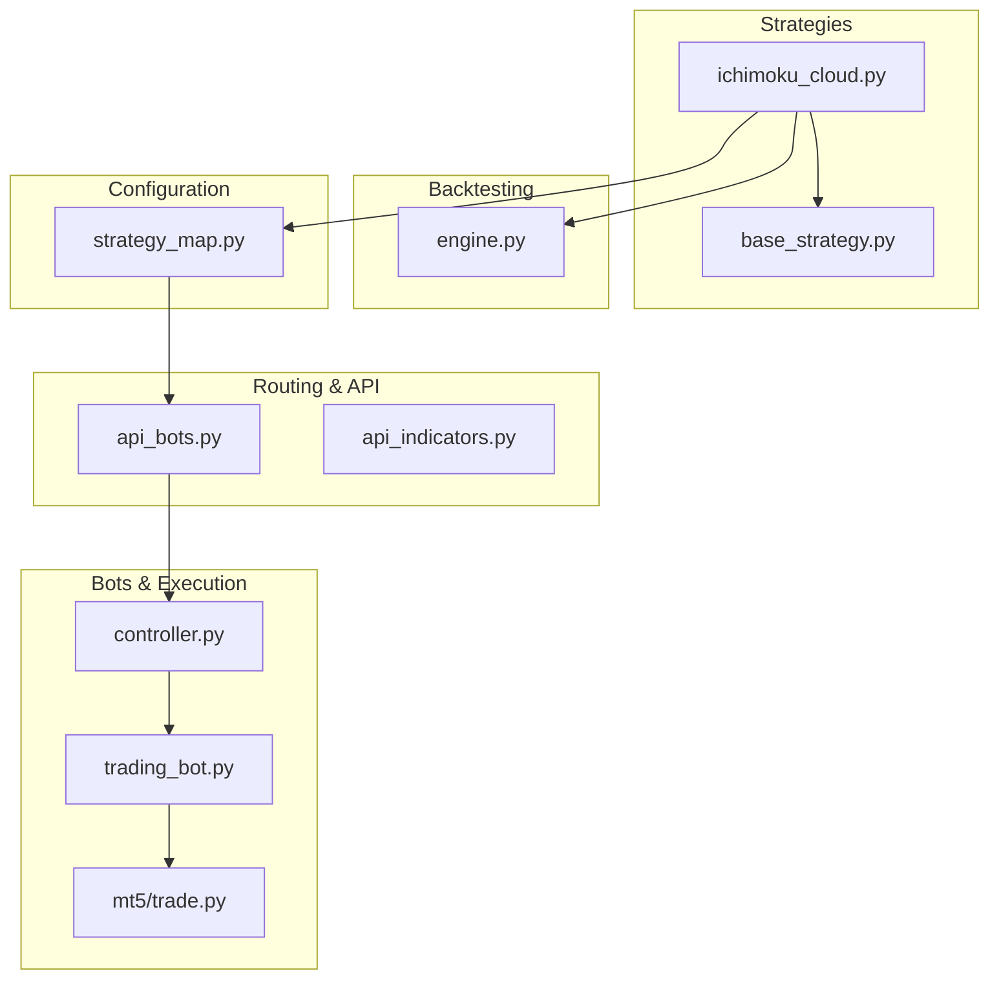
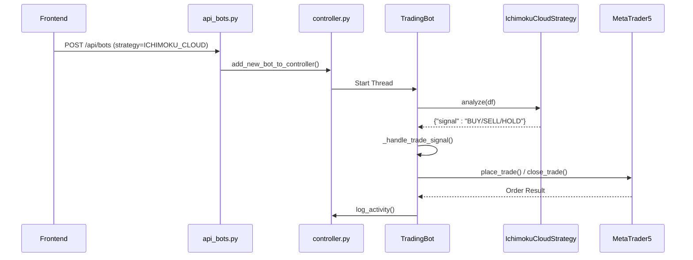
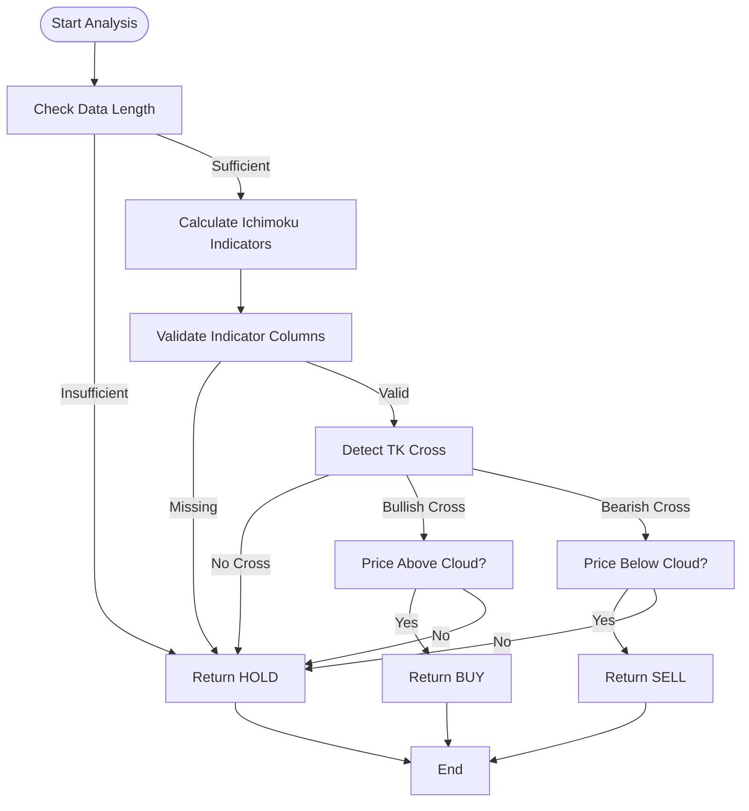
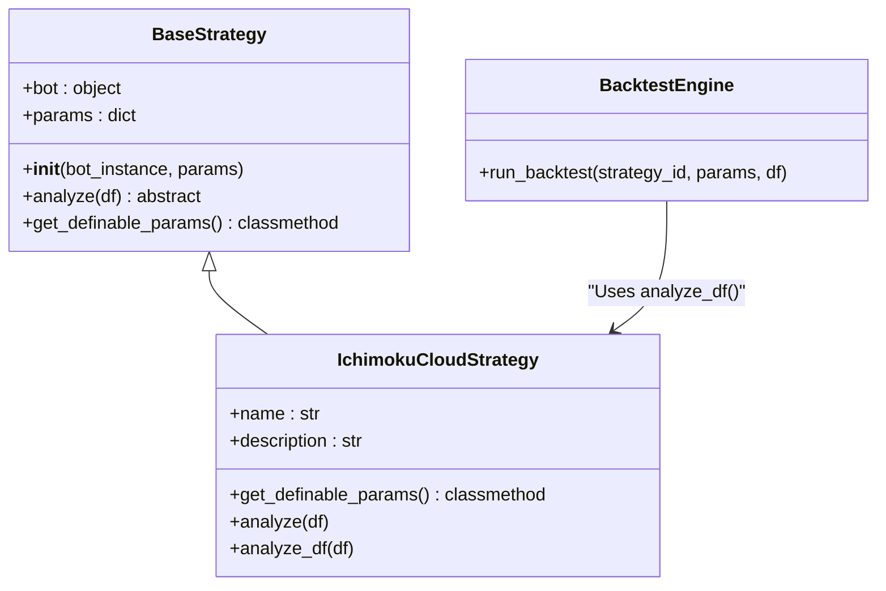
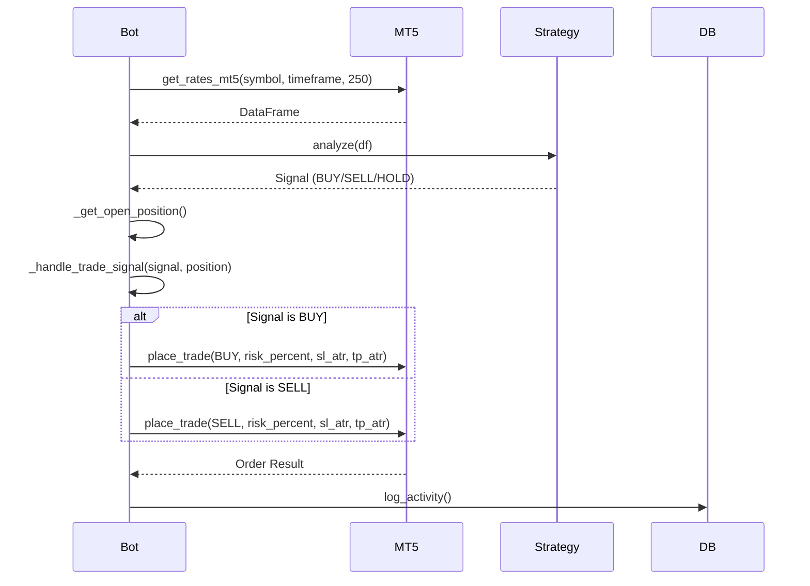
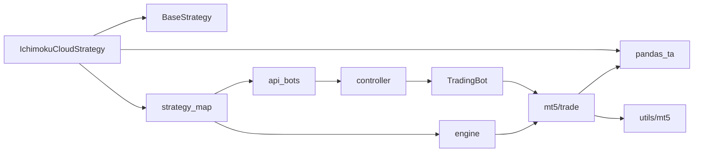

# Ichimoku Cloud Strategy

<cite>
**Referenced Files in This Document**   
- [ichimoku_cloud.py](file://core/strategies/ichimoku_cloud.py)
- [base_strategy.py](file://core/strategies/base_strategy.py)
- [strategy_map.py](file://core/strategies/strategy_map.py)
- [engine.py](file://core/backtesting/engine.py)
- [api_bots.py](file://core/routes/api_bots.py)
- [controller.py](file://core/bots/controller.py)
- [trading_bot.py](file://core/bots/trading_bot.py)
- [trade.py](file://core/mt5/trade.py)
</cite>

## Table of Contents
1. [Introduction](#introduction)
2. [Project Structure](#project-structure)
3. [Core Components](#core-components)
4. [Architecture Overview](#architecture-overview)
5. [Detailed Component Analysis](#detailed-component-analysis)
6. [Dependency Analysis](#dependency-analysis)
7. [Performance Considerations](#performance-considerations)
8. [Troubleshooting Guide](#troubleshooting-guide)
9. [Conclusion](#conclusion)

## Introduction
The Ichimoku Cloud Strategy is a comprehensive trading system implemented within the QuantumBotX platform, designed to identify trends and momentum signals using the multi-dimensional Ichimoku indicator. This document provides an in-depth analysis of the strategy's implementation, covering its technical components, signal generation logic, integration with the broader trading system, and execution workflow. The strategy leverages key Ichimoku components—Tenkan-sen, Kijun-sen, Senkou Span A/B (the cloud), and Chikou Span—to generate BUY and SELL signals based on price position relative to the cloud, TK cross events, and Kumo breakout confirmations. It supports both live trading and backtesting through distinct analysis methods and integrates with risk management systems for dynamic position sizing and trade execution on the MetaTrader 5 (MT5) platform.

## Project Structure
The Ichimoku Cloud strategy is part of a modular trading bot system organized into distinct functional directories. The core strategy logic resides in the `core/strategies` directory, while supporting components for backtesting, API exposure, bot control, and MT5 integration are distributed across related modules. This structure enables separation of concerns, allowing the strategy to be reused across different operational contexts (live trading, backtesting, simulation).

**Diagram sources**
- [ichimoku_cloud.py](file://core/strategies/ichimoku_cloud.py)
- [base_strategy.py](file://core/strategies/base_strategy.py)
- [strategy_map.py](file://core/strategies/strategy_map.py)
- [api_bots.py](file://core/routes/api_bots.py)
- [controller.py](file://core/bots/controller.py)
- [trading_bot.py](file://core/bots/trading_bot.py)
- [trade.py](file://core/mt5/trade.py)
- [engine.py](file://core/backtesting/engine.py)

**Section sources**
- [ichimoku_cloud.py](file://core/strategies/ichimoku_cloud.py)
- [project_structure](context)

## Core Components
The Ichimoku Cloud strategy is built upon several core components that define its behavior, configuration, and integration points. The primary class `IchimokuCloudStrategy` inherits from `BaseStrategy`, enforcing a consistent interface across all trading strategies in the system. It defines configurable parameters such as Tenkan-sen, Kijun-sen, and Senkou Span periods, along with a boolean flag to enable or disable cloud filtering. The strategy implements two analysis methods: `analyze()` for live trading (processing single candles) and `analyze_df()` for backtesting (vectorized processing of entire datasets). Signal generation is based on the intersection of TK cross events and price position relative to the cloud (Kumo), ensuring high-probability entries aligned with the prevailing trend.

**Section sources**
- [ichimoku_cloud.py](file://core/strategies/ichimoku_cloud.py#L1-L124)
- [base_strategy.py](file://core/strategies/base_strategy.py#L1-L29)

## Architecture Overview
The Ichimoku Cloud strategy operates within a layered architecture that separates strategy logic from execution, data access, and user interface concerns. The strategy is registered in a central `STRATEGY_MAP`, making it discoverable via API endpoints. When deployed, a `TradingBot` instance runs the strategy in a dedicated thread, periodically fetching market data and invoking the `analyze()` method. Signals are then processed by the bot’s `_handle_trade_signal()` method, which interacts with the MT5 platform through the `place_trade()` function for order execution. For historical evaluation, the backtesting engine uses `analyze_df()` to generate signals across a dataset, applying dynamic risk management rules including ATR-based stop-loss and take-profit levels.

**Diagram sources**
- [api_bots.py](file://core/routes/api_bots.py#L0-L167)
- [controller.py](file://core/bots/controller.py#L0-L176)
- [trading_bot.py](file://core/bots/trading_bot.py#L0-L169)
- [ichimoku_cloud.py](file://core/strategies/ichimoku_cloud.py#L0-L124)
- [trade.py](file://core/mt5/trade.py#L0-L152)

## Detailed Component Analysis

### Ichimoku Cloud Strategy Analysis
The `IchimokuCloudStrategy` class implements the core logic for generating trading signals based on the Ichimoku indicator. It calculates the Tenkan-sen (conversion line), Kijun-sen (base line), Senkou Span A/B (leading span A/B), and uses their interactions to determine market bias and entry points.

#### Signal Generation Logic
The strategy generates signals using two primary conditions:
1. **TK Cross**: A bullish signal occurs when the Tenkan-sen crosses above the Kijun-sen (Golden Cross), and a bearish signal occurs when it crosses below (Death Cross).
2. **Cloud Filter**: The price must be above the cloud (Senkou Span A and B) for a BUY signal, or below the cloud for a SELL signal. This filter can be disabled via the `use_cloud_filter` parameter.

The final signal is a logical AND of these two conditions unless the cloud filter is explicitly disabled.

**Diagram sources**
- [ichimoku_cloud.py](file://core/strategies/ichimoku_cloud.py#L29-L58)

**Section sources**
- [ichimoku_cloud.py](file://core/strategies/ichimoku_cloud.py#L1-L124)

### Backtesting Engine Integration
The strategy integrates with the backtesting engine through the `analyze_df()` method, which processes an entire DataFrame at once using vectorized operations. This enables efficient historical simulation and performance evaluation. The backtesting engine applies dynamic risk management, including ATR-based stop-loss and take-profit levels, and calculates position size based on account balance and risk percentage.

**Diagram sources**
- [base_strategy.py](file://core/strategies/base_strategy.py#L1-L29)
- [ichimoku_cloud.py](file://core/strategies/ichimoku_cloud.py#L1-L124)
- [engine.py](file://core/backtesting/engine.py#L1-L317)

**Section sources**
- [ichimoku_cloud.py](file://core/strategies/ichimoku_cloud.py#L90-L124)
- [engine.py](file://core/backtesting/engine.py#L1-L317)

### Live Trading Execution Flow
In live trading, the `TradingBot` thread periodically fetches market data and invokes the strategy's `analyze()` method. The resulting signal is processed by the bot, which manages open positions and executes trades via the MT5 API. The `place_trade()` function calculates dynamic stop-loss and take-profit levels using ATR (Average True Range) and determines position size based on risk percentage and account balance.

**Diagram sources**
- [trading_bot.py](file://core/bots/trading_bot.py#L0-L169)
- [trade.py](file://core/mt5/trade.py#L0-L152)

**Section sources**
- [trading_bot.py](file://core/bots/trading_bot.py#L0-L169)
- [trade.py](file://core/mt5/trade.py#L0-L152)

## Dependency Analysis
The Ichimoku Cloud strategy relies on a network of dependencies that enable its full functionality across different operational modes. The primary dependency is on `pandas_ta`, which provides the `ichimoku()` method for calculating all components of the indicator. The strategy is registered in `strategy_map.py`, allowing it to be instantiated by ID in both the backtesting engine and live trading bots. For execution, it depends on the MT5 Python API (`MetaTrader5`) and supporting utilities in `core.utils.mt5` for data retrieval and symbol management. Risk management is handled by the `calculate_lot_size()` function, which ensures trades are sized appropriately based on account balance and stop-loss distance.

**Diagram sources**
- [ichimoku_cloud.py](file://core/strategies/ichimoku_cloud.py)
- [strategy_map.py](file://core/strategies/strategy_map.py)
- [api_bots.py](file://core/routes/api_bots.py)
- [engine.py](file://core/backtesting/engine.py)
- [controller.py](file://core/bots/controller.py)
- [trading_bot.py](file://core/bots/trading_bot.py)
- [trade.py](file://core/mt5/trade.py)
- [utils/mt5.py](file://core/utils/mt5.py)

**Section sources**
- [ichimoku_cloud.py](file://core/strategies/ichimoku_cloud.py#L1-L124)
- [strategy_map.py](file://core/strategies/strategy_map.py#L1-L29)
- [trade.py](file://core/mt5/trade.py#L1-L152)

## Performance Considerations
The Ichimoku Cloud strategy is computationally efficient due to its reliance on vectorized operations in `pandas_ta`. The `analyze_df()` method is optimized for backtesting by processing entire datasets in bulk, minimizing function call overhead. In live trading, the strategy runs on a user-configurable interval (default: 60 seconds), balancing responsiveness with system load. The use of `dropna()` and early exit conditions ensures minimal processing when data is insufficient. For high-volatility instruments like XAUUSD, the system applies conservative risk parameters, including capped lot sizes and reduced ATR multipliers, to prevent excessive drawdowns. The backtesting engine further enhances performance by pre-calculating ATR and other indicators before signal generation.

## Troubleshooting Guide
Common issues with the Ichimoku Cloud strategy typically relate to data availability, configuration errors, or execution failures. The following table outlines key problems and their solutions:

**Label Structure Requirements**
- **Data not enough**: Ensure the input DataFrame contains sufficient historical data (minimum length = max(Tenkan, Kijun, Senkou) + Kijun period).
- **Indicator not mature**: Wait for more candles to be processed; the indicator requires warm-up periods.
- **Column not found**: Verify that `pandas_ta` is correctly installed and the `append=True` parameter is used.
- **Strategy not found**: Confirm the strategy is properly imported and registered in `STRATEGY_MAP`.
- **Order failed**: Check MT5 connection, symbol availability, and account balance. Review logs for specific error codes from `order_send()`.

Logging is implemented throughout the system, with detailed messages in the `run_backtest()`, `TradingBot`, and `place_trade()` functions to aid in diagnosis.

**Section sources**
- [ichimoku_cloud.py](file://core/strategies/ichimoku_cloud.py#L1-L124)
- [engine.py](file://core/backtesting/engine.py#L1-L317)
- [trading_bot.py](file://core/bots/trading_bot.py#L1-L169)
- [trade.py](file://core/mt5/trade.py#L1-L152)

## Conclusion
The Ichimoku Cloud strategy is a robust and well-integrated component of the QuantumBotX trading system, providing a systematic approach to trend identification and momentum trading. Its implementation leverages the full power of the Ichimoku indicator, combining multiple timeframes and components into a coherent signal generation framework. The strategy is seamlessly integrated into both live trading and backtesting workflows, supported by comprehensive risk management and error handling. By adhering to a modular architecture and clear interface contracts, it demonstrates best practices in software design for algorithmic trading systems. Future enhancements could include Chikou Span confirmation, Kumo twist detection, and multi-timeframe analysis for improved signal quality.