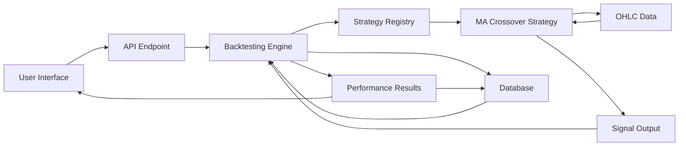
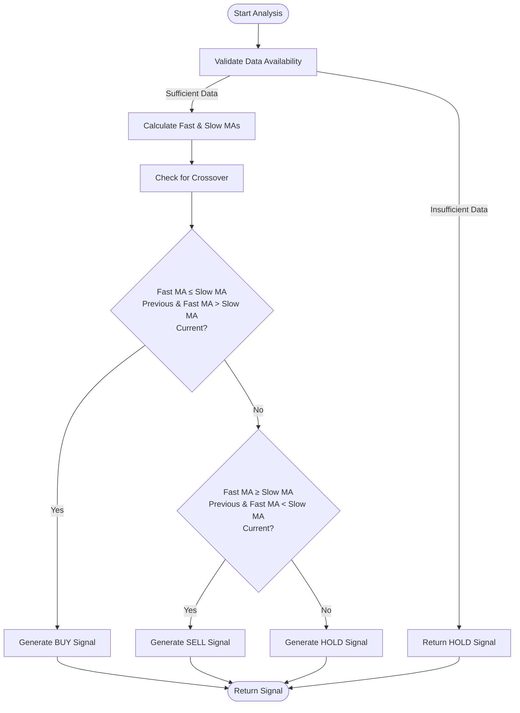
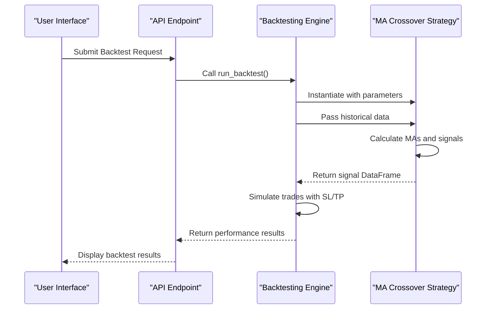
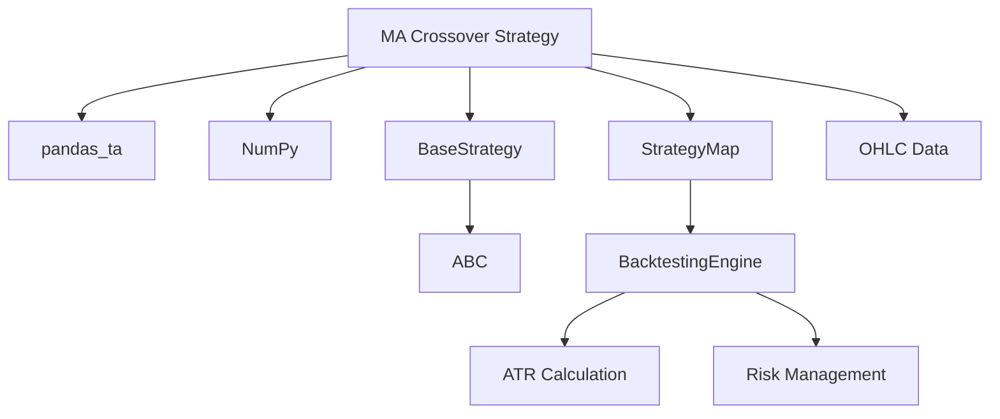

# MA Crossover Strategy

<cite>
**Referenced Files in This Document**   
- [ma_crossover.py](file://core/strategies/ma_crossover.py)
- [base_strategy.py](file://core/strategies/base_strategy.py)
- [strategy_map.py](file://core/strategies/strategy_map.py)
- [engine.py](file://core/backtesting/engine.py)
- [api_backtest.py](file://core/routes/api_backtest.py)
</cite>

## Table of Contents
1. [Introduction](#introduction)
2. [Project Structure](#project-structure)
3. [Core Components](#core-components)
4. [Architecture Overview](#architecture-overview)
5. [Detailed Component Analysis](#detailed-component-analysis)
6. [Dependency Analysis](#dependency-analysis)
7. [Performance Considerations](#performance-considerations)
8. [Troubleshooting Guide](#troubleshooting-guide)
9. [Conclusion](#conclusion)

## Introduction
The MA Crossover Strategy is a trend-following trading algorithm that generates buy and sell signals based on the interaction between two moving averages: a fast (short-term) and a slow (long-term) moving average. This document provides a comprehensive analysis of the implementation within the QuantumBotX framework, covering its logic, configuration, integration with backtesting and live trading systems, performance characteristics, and practical usage. The strategy is designed to capture momentum in trending markets while minimizing false signals through proper parameterization and risk management.

## Project Structure
The MA Crossover strategy is implemented as part of a larger quantitative trading system organized around modular components. The core functionality resides in the `/core/strategies/` directory, with supporting infrastructure in backtesting, routing, and database modules. The structure follows a layered architecture separating strategy logic, execution engines, API interfaces, and data management.

```mermaid
graph TB
subgraph "Strategies"
MA[ma_crossover.py]
Base[base_strategy.py]
Map[strategy_map.py]
end
subgraph "Backtesting"
Engine[engine.py]
end
subgraph "API Routes"
BacktestRoute[api_backtest.py]
end
MA --> Base : "inherits"
Map --> MA : "imports"
Engine --> Map : "uses"
BacktestRoute --> Engine : "calls"
```

**Diagram sources**
- [ma_crossover.py](file://core/strategies/ma_crossover.py)
- [base_strategy.py](file://core/strategies/base_strategy.py)
- [strategy_map.py](file://core/strategies/strategy_map.py)
- [engine.py](file://core/backtesting/engine.py)
- [api_backtest.py](file://core/routes/api_backtest.py)

**Section sources**
- [ma_crossover.py](file://core/strategies/ma_crossover.py)
- [base_strategy.py](file://core/strategies/base_strategy.py)

## Core Components
The MA Crossover strategy is built upon several core components that define its behavior and integration capabilities. The primary component is the `MACrossoverStrategy` class, which inherits from `BaseStrategy` and implements the specific logic for detecting moving average crossovers. Key components include:

- **Signal Generation Logic**: Detects golden cross (bullish) and death cross (bearish) events
- **Parameter Configuration**: Defines configurable parameters for fast and slow moving average periods
- **Dual Analysis Methods**: Separate methods for live trading (`analyze`) and backtesting (`analyze_df`)
- **Integration Hooks**: Registration in `STRATEGY_MAP` for system-wide accessibility

The strategy uses simple moving averages (SMA) calculated via the `pandas_ta` library, comparing price action against two different timeframes to identify trend changes.

**Section sources**
- [ma_crossover.py](file://core/strategies/ma_crossover.py#L1-L60)
- [base_strategy.py](file://core/strategies/base_strategy.py#L1-L29)

## Architecture Overview
The MA Crossover strategy operates within a comprehensive trading architecture that supports both backtesting and live execution. The system follows a modular design where strategies are decoupled from execution engines and user interfaces, allowing for flexible configuration and testing.



**Diagram sources**
- [ma_crossover.py](file://core/strategies/ma_crossover.py)
- [engine.py](file://core/backtesting/engine.py)
- [api_backtest.py](file://core/routes/api_backtest.py)

## Detailed Component Analysis

### MA Crossover Strategy Implementation
The `MACrossoverStrategy` class implements the dual moving average crossover logic with support for both live trading and historical backtesting. The strategy follows the principle that when a short-term moving average crosses above a long-term moving average, it generates a bullish signal (Golden Cross), and when it crosses below, it generates a bearish signal (Death Cross).

#### Signal Generation Algorithm


**Diagram sources**
- [ma_crossover.py](file://core/strategies/ma_crossover.py#L30-L60)

**Section sources**
- [ma_crossover.py](file://core/strategies/ma_crossover.py#L1-L60)

#### Parameter Configuration
The strategy exposes configurable parameters through the `get_definable_params` class method, allowing users to customize the moving average periods:

**Strategy Parameters**
- **fast_period**: Period for the short-term moving average (default: 20)
- **slow_period**: Period for the long-term moving average (default: 50)

These parameters can be adjusted to make the strategy more sensitive (shorter periods) or more conservative (longer periods) based on market conditions and trading objectives.

**Section sources**
- [ma_crossover.py](file://core/strategies/ma_crossover.py#L10-L15)

### Backtesting Integration
The MA Crossover strategy is fully integrated with the backtesting engine, enabling comprehensive performance evaluation using historical data. The integration follows a standardized pattern where the strategy is invoked through the `STRATEGY_MAP` registry.

#### Backtesting Workflow


**Diagram sources**
- [engine.py](file://core/backtesting/engine.py#L1-L318)
- [api_backtest.py](file://core/routes/api_backtest.py#L1-L130)

**Section sources**
- [engine.py](file://core/backtesting/engine.py#L1-L318)
- [api_backtest.py](file://core/routes/api_backtest.py#L1-L130)

### Live Trading vs Backtesting Methods
The strategy implements two distinct analysis methods optimized for different use cases:

#### Live Trading Method (`analyze`)
Designed for real-time execution, this method processes only the most recent data points to generate immediate trading signals:

```python
def analyze(self, df):
    # Validate data sufficiency
    if insufficient_data: 
        return {"signal": "HOLD"}
    
    # Calculate MAs on latest data
    df["ma_fast"] = ta.sma(df["close"], fast_period)
    df["ma_slow"] = ta.sma(df["close"], slow_period)
    df.dropna(inplace=True)
    
    # Compare current and previous values
    if crossover_upward:
        return {"signal": "BUY", "price": current_price}
    elif crossover_downward:
        return {"signal": "SELL", "price": current_price}
    else:
        return {"signal": "HOLD"}
```

#### Backtesting Method (`analyze_df`)
Optimized for historical analysis, this vectorized method processes the entire dataset at once for efficiency:

```python
def analyze_df(self, df):
    # Calculate MAs across entire dataset
    df["ma_fast"] = ta.sma(df["close"], fast_period)
    df["ma_slow"] = ta.sma(df["close"], slow_period)
    
    # Vectorized crossover detection
    golden_cross = (df["ma_fast"].shift(1) <= df["ma_slow"].shift(1)) & (df["ma_fast"] > df["ma_slow"])
    death_cross = (df["ma_fast"].shift(1) >= df["ma_slow"].shift(1)) & (df["ma_fast"] < df["ma_slow"])
    
    # Assign signals to entire DataFrame
    df['signal'] = np.where(golden_cross, 'BUY', np.where(death_cross, 'SELL', 'HOLD'))
    return df
```

**Section sources**
- [ma_crossover.py](file://core/strategies/ma_crossover.py#L30-L60)

## Dependency Analysis
The MA Crossover strategy relies on several key dependencies that enable its functionality and integration within the broader trading system.



**Diagram sources**
- [ma_crossover.py](file://core/strategies/ma_crossover.py)
- [base_strategy.py](file://core/strategies/base_strategy.py)
- [strategy_map.py](file://core/strategies/strategy_map.py)
- [engine.py](file://core/backtesting/engine.py)

**Section sources**
- [ma_crossover.py](file://core/strategies/ma_crossover.py#L1-L60)
- [base_strategy.py](file://core/strategies/base_strategy.py#L1-L29)

## Performance Considerations
The MA Crossover strategy exhibits distinct performance characteristics depending on market conditions and parameter configuration.

### Optimal Market Conditions
The strategy performs best in trending markets where prices move consistently in one direction:
- **Strong Uptrends**: Generates timely buy signals and maintains positions through the trend
- **Strong Downtrends**: Generates timely sell signals and captures downward momentum
- **Momentum Continuation**: Effective at capturing extended price movements

### Common Pitfalls
The strategy faces challenges in certain market environments:
- **Sideways/Range-bound Markets**: Prone to whipsaws, generating false signals as prices oscillate
- **High Volatility Conditions**: May generate premature signals during price spikes
- **Trend Reversals**: Lagging nature may result in late exits or entries

### Parameter Tuning Recommendations
- **Trending Markets**: Use standard parameters (20, 50) or consider faster combinations (10, 30)
- **Volatile Markets**: Increase both periods (25, 60) to reduce false signals
- **Short-term Trading**: Use shorter periods (10, 20) for increased sensitivity
- **Long-term Investing**: Use longer periods (50, 200) for major trend identification

The backtesting engine incorporates ATR-based position sizing and risk management to mitigate potential drawdowns, automatically adjusting lot sizes based on market volatility.

**Section sources**
- [engine.py](file://core/backtesting/engine.py#L90-L119)
- [ma_crossover.py](file://core/strategies/ma_crossover.py)

## Troubleshooting Guide
Common issues and their solutions when implementing and using the MA Crossover strategy:

### Data Insufficiency
**Issue**: Strategy returns "HOLD" due to insufficient data
**Solution**: Ensure the dataset contains at least `slow_period + 1` bars. For default parameters (50), minimum 51 data points are required.

### NaN Values During Initialization
**Issue**: Missing values in moving average calculations
**Solution**: The strategy automatically calls `dropna()` after indicator calculation. Ensure data quality and handle missing values before analysis.

### No Signals Generated
**Issue**: Strategy runs but generates no buy/sell signals
**Solution**: 
- Verify that price data shows actual crossovers
- Check parameter values (fast_period must be less than slow_period)
- Ensure data timeframe is appropriate for the chosen periods

### Backtesting Integration Issues
**Issue**: Strategy not found in backtesting system
**Solution**: Verify that the strategy is properly registered in `STRATEGY_MAP` with the correct key ('MA_CROSSOVER').

**Section sources**
- [ma_crossover.py](file://core/strategies/ma_crossover.py#L20-L30)
- [engine.py](file://core/backtesting/engine.py#L5-L10)
- [strategy_map.py](file://core/strategies/strategy_map.py#L1-L30)

## Conclusion
The MA Crossover strategy provides a robust implementation of a classic trend-following approach within the QuantumBotX framework. Its dual-method design effectively separates live trading and backtesting concerns, while the modular architecture enables seamless integration with the broader trading system. The strategy's simplicity, combined with proper risk management through the backtesting engine, makes it an effective tool for capturing market trends. Users should be aware of its limitations in sideways markets and adjust parameters accordingly based on market conditions. The comprehensive parameter configuration, clear signal logic, and integrated performance evaluation make this implementation suitable for both novice and experienced algorithmic traders.