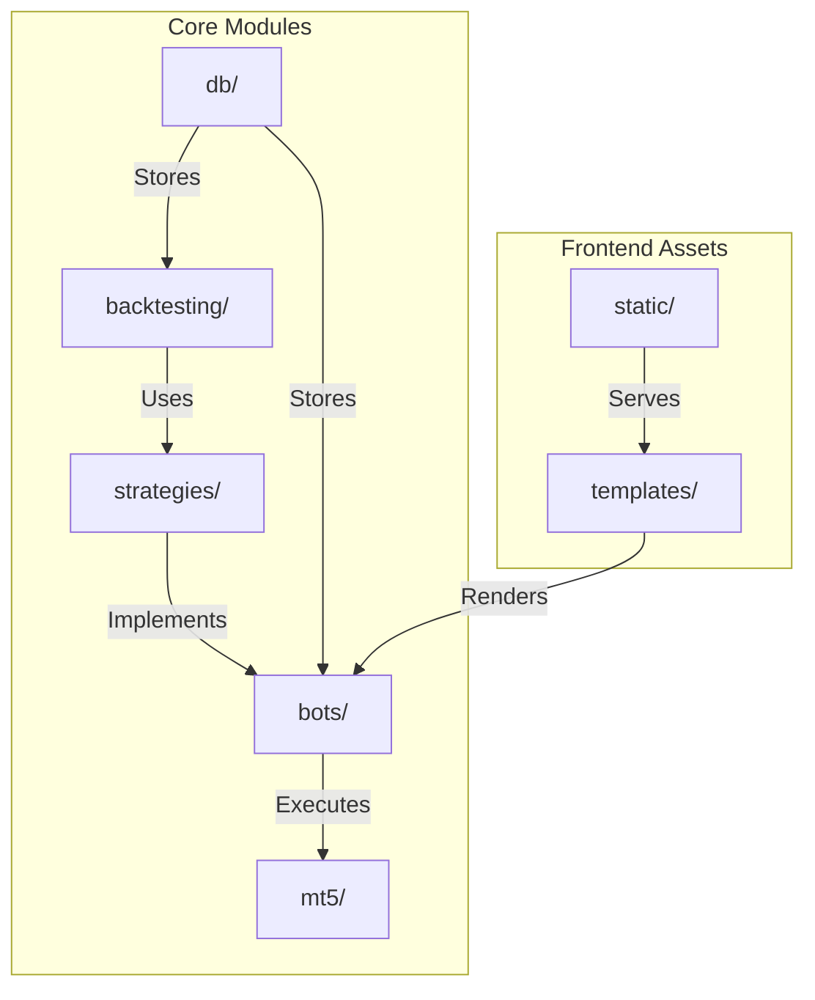
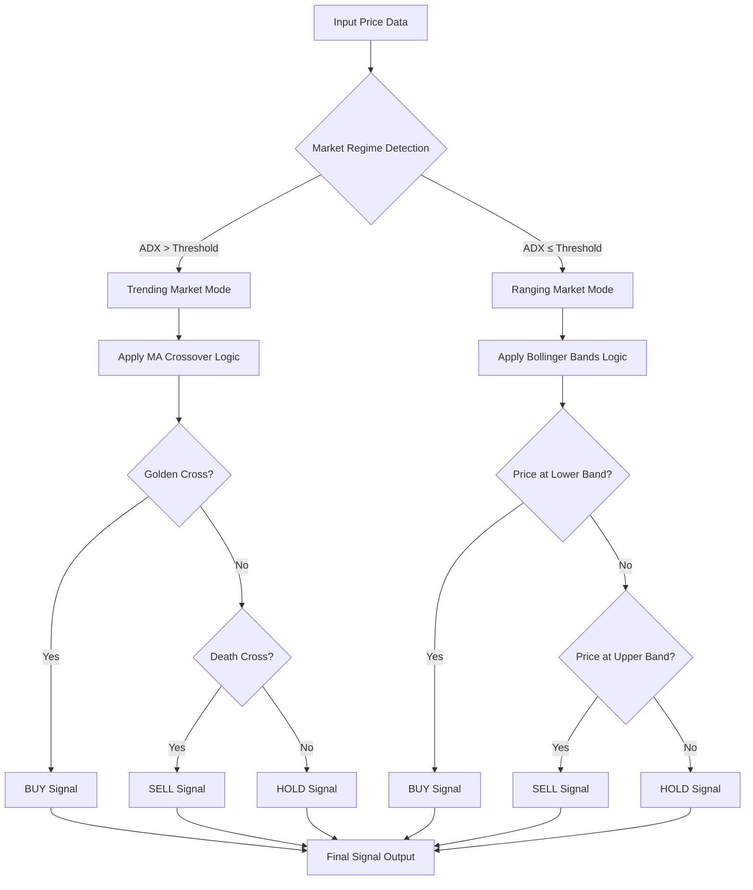
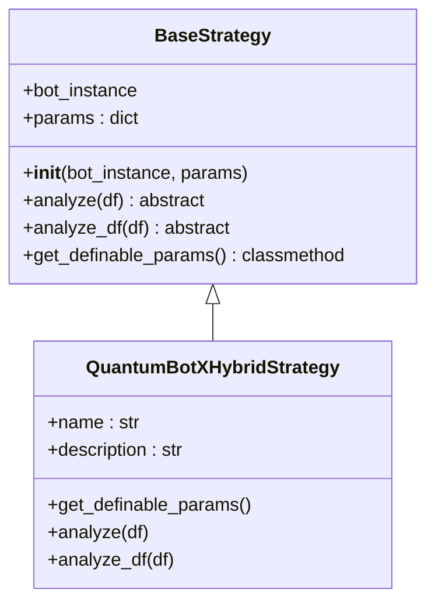
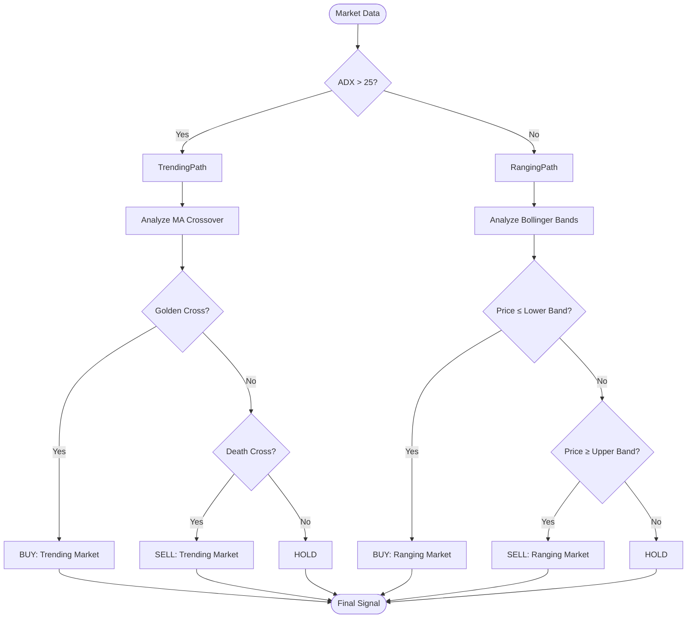
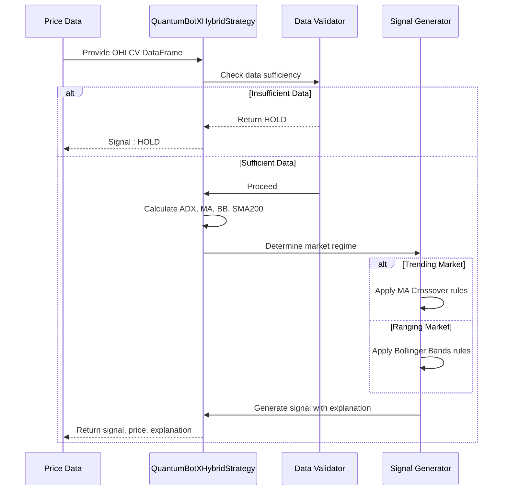

# QuantumbotX Hybrid Strategy

<cite>
**Referenced Files in This Document**   
- [quantumbotx_hybrid.py](file://core/strategies/quantumbotx_hybrid.py)
- [base_strategy.py](file://core/strategies/base_strategy.py)
- [ma_crossover.py](file://core/strategies/ma_crossover.py)
- [bollinger_reversion.py](file://core/strategies/bollinger_reversion.py)
- [rsi_crossover.py](file://core/strategies/rsi_crossover.py)
- [strategy_map.py](file://core/strategies/strategy_map.py)
</cite>

## Table of Contents
1. [Introduction](#introduction)
2. [Project Structure](#project-structure)
3. [Core Components](#core-components)
4. [Architecture Overview](#architecture-overview)
5. [Detailed Component Analysis](#detailed-component-analysis)
6. [Signal Aggregation Logic](#signal-aggregation-logic)
7. [Parameter Configuration and Weighting](#parameter-configuration-and-weighting)
8. [Conflict Resolution and Confirmation Filters](#conflict-resolution-and-confirmation-filters)
9. [Performance Characteristics](#performance-characteristics)
10. [Complexity and Computational Considerations](#complexity-and-computational-considerations)

## Introduction
The QuantumbotX Hybrid Strategy is a sophisticated trading algorithm that integrates multiple technical indicators into a unified decision engine. Unlike single-indicator strategies, this hybrid approach dynamically adapts to market conditions by combining trend-following and mean-reversion signals through a context-aware logic framework. The strategy leverages the Average Directional Index (ADX) to detect trending versus ranging markets, then applies different signal generation rules accordingly. This document provides a comprehensive analysis of its architecture, implementation, and operational characteristics, focusing on how it reduces false positives and improves risk-adjusted returns through intelligent signal fusion.

## Project Structure
The QuantumbotX project follows a modular, feature-based organization with clear separation of concerns. The core logic resides in the `/core` directory, which contains specialized submodules for strategies, backtesting, database operations, and external integrations. The hybrid strategy is located within the `strategies` package alongside other standalone strategies, indicating a design pattern where both atomic and composite strategies coexist under a common interface.



**Diagram sources**
- [quantumbotx_hybrid.py](file://core/strategies/quantumbotx_hybrid.py)
- [strategy_map.py](file://core/strategies/strategy_map.py)

**Section sources**
- [quantumbotx_hybrid.py](file://core/strategies/quantumbotx_hybrid.py)

## Core Components
The hybrid strategy is built upon a foundation of reusable components and design patterns. It inherits from `BaseStrategy`, an abstract base class that defines a contract for all trading strategies in the system. This inheritance ensures consistent method signatures and parameter handling across different strategy types. The core functionality revolves around two primary methods: `analyze` for live trading decisions and `analyze_df` for backtesting across historical datasets.

The strategy integrates three key technical indicators:
- **MA Crossover**: For trend-following signals in trending markets
- **Bollinger Bands**: For mean-reversion signals in ranging markets
- **ADX (Average Directional Index)**: For market regime detection

These components are not weighted numerically but are instead conditionally activated based on market state, representing a form of dynamic signal prioritization rather than static voting.

**Section sources**
- [base_strategy.py](file://core/strategies/base_strategy.py)
- [quantumbotx_hybrid.py](file://core/strategies/quantumbotx_hybrid.py)

## Architecture Overview
The QuantumbotX Hybrid Strategy operates as a state-dependent decision engine that first classifies market conditions and then applies the appropriate signal generation logic. This two-stage architecture separates market regime detection from signal generation, allowing for adaptive behavior across different market environments.



**Diagram sources**
- [quantumbotx_hybrid.py](file://core/strategies/quantumbotx_hybrid.py#L50-L110)

## Detailed Component Analysis

### QuantumBotXHybridStrategy Class Analysis
The `QuantumBotXHybridStrategy` class extends `BaseStrategy` and implements a sophisticated market-adaptive trading logic. Rather than using a weighted scoring system, it employs a conditional execution model where different indicator sets are activated based on market regime. This approach eliminates the need for explicit weighting by making the signal sources mutually exclusive under specific conditions.

#### Class Structure and Inheritance


**Diagram sources**
- [base_strategy.py](file://core/strategies/base_strategy.py#L5-L28)
- [quantumbotx_hybrid.py](file://core/strategies/quantumbotx_hybrid.py#L5-L15)

**Section sources**
- [quantumbotx_hybrid.py](file://core/strategies/quantumbotx_hybrid.py#L5-L112)

### Market Regime Detection with ADX
The strategy uses the Average Directional Index (ADX) to distinguish between trending and ranging markets. When ADX exceeds a configurable threshold (default: 25), the market is classified as trending, and trend-following logic is activated. When ADX is below the threshold, the market is considered ranging, and mean-reversion logic takes precedence.

This regime detection serves as a confirmation filter that prevents the strategy from applying inappropriate signal generation rules to the current market environment, thereby reducing false positives that commonly occur when using single-indicator approaches.

**Section sources**
- [quantumbotx_hybrid.py](file://core/strategies/quantumbotx_hybrid.py#L65-L70)

### Trend Filter Implementation
A long-term Simple Moving Average (SMA) with a default period of 200 acts as a directional filter. All trading signals must align with the long-term trend direction indicated by this SMA. This multi-timeframe confirmation mechanism ensures that trades are taken in the direction of the primary trend, improving the quality of entries and exits.

The trend filter is implemented as a prerequisite check: buy signals require the current price to be above the 200-period SMA, while sell signals require the price to be below it.

**Section sources**
- [quantumbotx_hybrid.py](file://core/strategies/quantumbotx_hybrid.py#L60-L65)

## Signal Aggregation Logic
The QuantumbotX Hybrid Strategy does not use a traditional voting or weighted scoring system. Instead, it implements a conditional signal aggregation approach where different indicator combinations are used based on market state:

### Trending Market Logic
When ADX > threshold:
- **BUY Signal**: Uptrend confirmed by 200-SMA AND Golden Cross (fast MA crosses above slow MA)
- **SELL Signal**: Downtrend confirmed by 200-SMA AND Death Cross (fast MA crosses below slow MA)

### Ranging Market Logic
When ADX ≤ threshold:
- **BUY Signal**: Uptrend confirmed by 200-SMA AND price touches lower Bollinger Band
- **SELL Signal**: Downtrend confirmed by 200-SMA AND price touches upper Bollinger Band

This conditional approach ensures that only relevant indicators influence the decision in each market regime, effectively creating a dynamic weighting scheme where certain indicators have 100% weight in their applicable regime and 0% weight otherwise.



**Diagram sources**
- [quantumbotx_hybrid.py](file://core/strategies/quantumbotx_hybrid.py#L70-L100)

**Section sources**
- [quantumbotx_hybrid.py](file://core/strategies/quantumbotx_hybrid.py#L70-L100)

## Parameter Configuration and Weighting
The strategy exposes several configurable parameters that control its behavior and sensitivity:

```json
{
  "adx_period": {"label": "ADX Period", "default": 14},
  "adx_threshold": {"label": "ADX Threshold", "default": 25},
  "ma_fast_period": {"label": "Fast MA Period", "default": 20},
  "ma_slow_period": {"label": "Slow MA Period", "default": 50},
  "bb_length": {"label": "Bollinger Bands Length", "default": 20},
  "bb_std": {"label": "Bollinger Bands Standard Deviation", "default": 2.0},
  "trend_filter_period": {"label": "Trend Filter Period (SMA)", "default": 200}
}
```

While the strategy does not implement explicit numerical weights for individual indicators, the parameter configuration effectively determines their relative importance:
- The ADX threshold acts as a switch between regime models
- The MA periods determine trend sensitivity in trending markets
- The Bollinger Bands parameters control overbought/oversold thresholds in ranging markets
- The 200-period SMA serves as the primary directional filter

**Section sources**
- [quantumbotx_hybrid.py](file://core/strategies/quantumbotx_hybrid.py#L8-L22)

## Conflict Resolution and Confirmation Filters
The hybrid strategy employs a hierarchical confirmation system to resolve potential conflicts and validate signals:

### Multi-Layer Confirmation
1. **Market Regime Filter**: ADX determines whether to use trend-following or mean-reversion logic
2. **Directional Filter**: 200-period SMA ensures alignment with long-term trend
3. **Signal Confirmation**: Specific indicator conditions must be met (crossover or band touch)

This layered approach means that conflicting signals from different regimes cannot occur simultaneously, as the market regime filter selects only one signal generation pathway at a time.

### Edge Case Handling
The strategy includes robust error handling:
- Returns "HOLD" when insufficient data exists for the 200-period SMA
- Returns "HOLD" when indicators are not yet mature (less than 2 data points)
- Gracefully handles missing or malformed data through pandas operations



**Diagram sources**
- [quantumbotx_hybrid.py](file://core/strategies/quantumbotx_hybrid.py#L50-L110)

**Section sources**
- [quantumbotx_hybrid.py](file://core/strategies/quantumbotx_hybrid.py#L50-L110)

## Performance Characteristics
The hybrid approach offers several performance advantages over single-indicator strategies:

### False Positive Reduction
By requiring multiple confirmations (regime, trend direction, and signal), the strategy significantly reduces false positives:
- Eliminates whipsaws in ranging markets by disabling trend-following signals
- Prevents overbought/oversold entries in strong trends by disabling mean-reversion signals
- Ensures all trades align with the primary trend direction

### Risk-Adjusted Returns
The adaptive nature of the strategy leads to improved risk-adjusted returns:
- Captures strong trends through MA crossovers during high-ADX periods
- Takes contrarian positions during low-ADX periods when mean reversion is more reliable
- Maintains discipline through the 200-SMA filter, avoiding countertrend trades

### Robustness Across Market Conditions
The strategy demonstrates robustness by:
- Adapting to different volatility regimes through ADX-based switching
- Performing well in both trending and ranging markets
- Maintaining consistent logic across various asset classes and timeframes

**Section sources**
- [quantumbotx_hybrid.py](file://core/strategies/quantumbotx_hybrid.py)

## Complexity and Computational Considerations
The hybrid strategy balances sophistication with computational efficiency:

### Computational Overhead
The strategy calculates:
- ADX (moderate complexity)
- Two moving averages (low complexity)
- Bollinger Bands (low complexity)
- 200-period SMA (low complexity)

Despite using multiple indicators, the computational overhead remains reasonable due to vectorized operations in pandas-ta.

### Complexity Trade-offs
Advantages:
- Higher signal quality through multi-factor confirmation
- Adaptive behavior across market regimes
- Reduced false positives compared to single-indicator approaches

Disadvantages:
- Increased parameter sensitivity
- More complex debugging and optimization
- Potential lag in regime detection due to ADX calculation

The strategy's design prioritizes signal quality over simplicity, accepting increased complexity as a trade-off for improved performance and robustness.

**Section sources**
- [quantumbotx_hybrid.py](file://core/strategies/quantumbotx_hybrid.py)