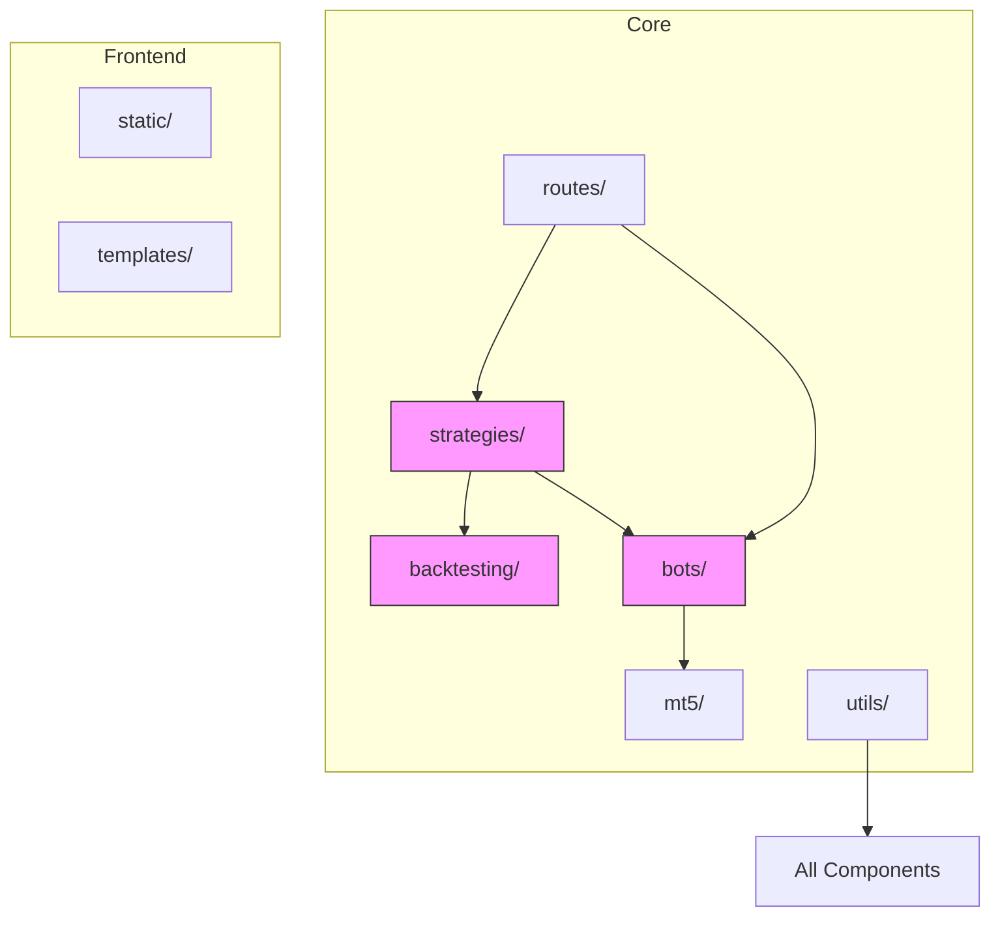
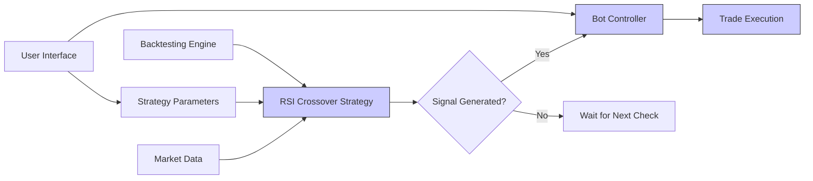
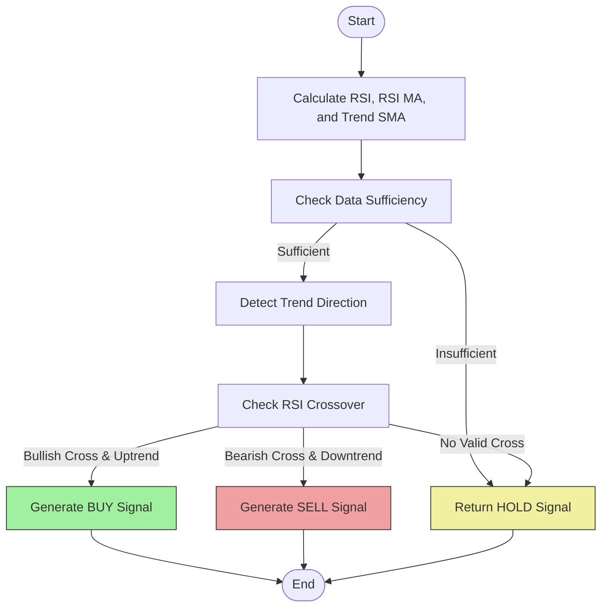
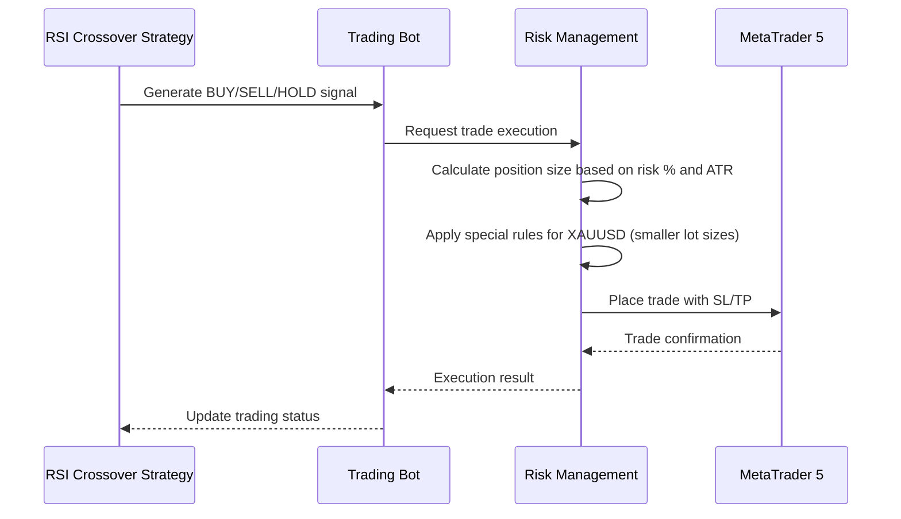
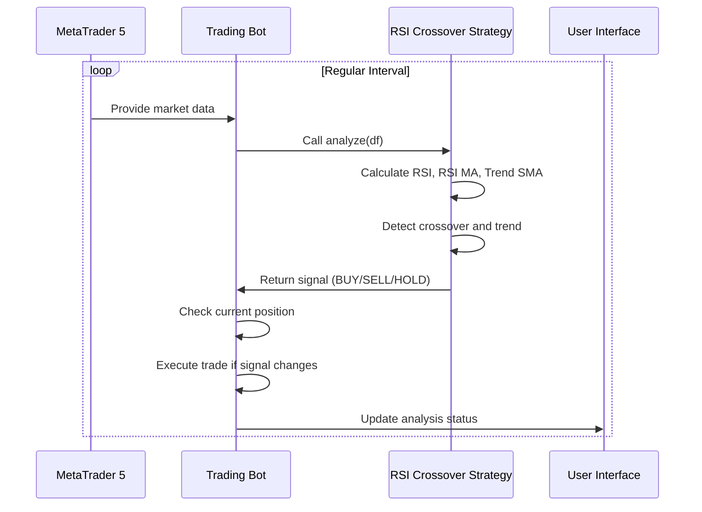

# RSI Crossover Strategy

<cite>
**Referenced Files in This Document**   
- [rsi_crossover.py](file://core/strategies/rsi_crossover.py)
- [base_strategy.py](file://core/strategies/base_strategy.py)
- [strategy_map.py](file://core/strategies/strategy_map.py)
- [api_bots.py](file://core/routes/api_bots.py)
- [controller.py](file://core/bots/controller.py)
- [trading_bot.py](file://core/bots/trading_bot.py)
- [engine.py](file://core/backtesting/engine.py)
</cite>

## Table of Contents
1. [Introduction](#introduction)
2. [Project Structure](#project-structure)
3. [Core Components](#core-components)
4. [Architecture Overview](#architecture-overview)
5. [Detailed Component Analysis](#detailed-component-analysis)
6. [Signal Generation Logic](#signal-generation-logic)
7. [Parameter Configuration](#parameter-configuration)
8. [Integration with Risk Management](#integration-with-risk-management)
9. [Backtesting and Live Trading Workflows](#backtesting-and-live-trading-workflows)
10. [Performance Characteristics and Limitations](#performance-characteristics-and-limitations)
11. [Best Practices and Optimization](#best-practices-and-optimization)

## Introduction
The RSI Crossover Strategy is a momentum-based trading approach implemented within the QuantumBotX platform. Unlike traditional RSI strategies that rely on fixed overbought (70) and oversold (30) thresholds, this strategy uses a crossover mechanism between the Relative Strength Index (RSI) and its moving average (MA) to generate trading signals. The strategy incorporates a long-term trend filter using a Simple Moving Average (SMA) to validate signals, aiming to improve accuracy by aligning trades with the prevailing market direction. This document provides a comprehensive analysis of the strategy's implementation, covering its signal logic, parameter configuration, integration with the trading system, and performance characteristics.

## Project Structure
The QuantumBotX project is organized into a modular structure with clearly defined directories for core functionality, interfaces, services, and utilities. The RSI Crossover Strategy is located within the `core/strategies` directory, which houses various algorithmic trading strategies. The system follows a layered architecture with separation between strategy logic, bot execution, data handling, and API interfaces. Key components include the strategy implementation, backtesting engine, bot controller, and trading execution modules.



**Diagram sources**
- [rsi_crossover.py](file://core/strategies/rsi_crossover.py)
- [engine.py](file://core/backtesting/engine.py)
- [controller.py](file://core/bots/controller.py)

**Section sources**
- [rsi_crossover.py](file://core/strategies/rsi_crossover.py)
- [project_structure](file://)

## Core Components
The RSI Crossover Strategy is built on several core components that work together to generate trading signals and execute trades. The main components include the strategy class itself, which inherits from a base strategy abstract class, the strategy mapping system that registers all available strategies, and the bot execution framework that runs the strategy in live trading. The strategy uses the pandas_ta library for technical indicator calculations and integrates with the MetaTrader 5 platform for market data and trade execution.

**Section sources**
- [rsi_crossover.py](file://core/strategies/rsi_crossover.py)
- [base_strategy.py](file://core/strategies/base_strategy.py)
- [strategy_map.py](file://core/strategies/strategy_map.py)

## Architecture Overview
The RSI Crossover Strategy operates within a comprehensive trading system architecture that supports both backtesting and live trading. The architecture follows a modular design with clear separation of concerns. The strategy receives market data, calculates indicators, generates signals, and communicates with the bot controller for trade execution. In backtesting mode, the strategy processes historical data to simulate performance, while in live trading mode, it analyzes real-time market data at regular intervals.



**Diagram sources**
- [rsi_crossover.py](file://core/strategies/rsi_crossover.py)
- [controller.py](file://core/bots/controller.py)
- [trading_bot.py](file://core/bots/trading_bot.py)

## Detailed Component Analysis

### RSI Crossover Strategy Implementation
The RSICrossoverStrategy class implements a momentum-based trading strategy that generates signals based on the crossover between the RSI indicator and its moving average. The strategy inherits from the BaseStrategy abstract class, which defines the common interface for all trading strategies in the system. The implementation includes two main methods: `analyze()` for live trading and `analyze_df()` for backtesting.

#### Class Structure and Inheritance
```mermaid
classDiagram
class BaseStrategy {
+bot : TradingBot
+params : dict
+__init__(bot_instance, params)
+analyze(df) abstract
+get_definable_params() classmethod
}
class RSICrossoverStrategy {
+name : str
+description : str
+get_definable_params() classmethod
+analyze(df)
+analyze_df(df)
}
BaseStrategy <|-- RSICrossoverStrategy
note right of RSICrossoverStrategy
Implements RSI crossover logic
with trend filter validation
end note
```

**Diagram sources**
- [base_strategy.py](file://core/strategies/base_strategy.py)
- [rsi_crossover.py](file://core/strategies/rsi_crossover.py)

**Section sources**
- [rsi_crossover.py](file://core/strategies/rsi_crossover.py)
- [base_strategy.py](file://core/strategies/base_strategy.py)

## Signal Generation Logic
The RSI Crossover Strategy generates trading signals based on the interaction between the RSI indicator and its moving average, combined with a trend filter. The strategy first calculates the RSI using the specified period, then calculates a moving average of the RSI values. A buy signal is generated when the RSI crosses above its moving average while the price is above the trend filter SMA, indicating an uptrend. Conversely, a sell signal is generated when the RSI crosses below its moving average while the price is below the trend filter SMA, indicating a downtrend.



**Diagram sources**
- [rsi_crossover.py](file://core/strategies/rsi_crossover.py)

**Section sources**
- [rsi_crossover.py](file://core/strategies/rsi_crossover.py)

## Parameter Configuration
The RSI Crossover Strategy provides three configurable parameters that allow users to customize its behavior. These parameters can be adjusted through the user interface or programmatically when creating a trading bot instance.

### Configurable Parameters
- **rsi_period**: The number of periods used to calculate the RSI indicator. Default value is 14.
- **rsi_ma_period**: The number of periods used to calculate the moving average of the RSI. Default value is 10.
- **trend_filter_period**: The number of periods used to calculate the Simple Moving Average for trend filtering. Default value is 50.

The strategy exposes these parameters through the `get_definable_params()` class method, which returns a list of parameter definitions including their name, label, type, and default value. This allows the system to dynamically generate user interface elements for parameter configuration.

```python
@classmethod
def get_definable_params(cls):
    return [
        {"name": "rsi_period", "label": "Periode RSI", "type": "number", "default": 14},
        {"name": "rsi_ma_period", "label": "Periode MA dari RSI", "type": "number", "default": 10},
        {"name": "trend_filter_period", "label": "Periode SMA Filter Tren", "type": "number", "default": 50}
    ]
```

**Section sources**
- [rsi_crossover.py](file://core/strategies/rsi_crossover.py)

## Integration with Risk Management
The RSI Crossover Strategy integrates with the QuantumBotX risk management system through the bot execution framework. While the strategy itself focuses on signal generation, it works in conjunction with risk management rules defined at the bot level. These rules include position sizing based on account risk percentage, stop-loss and take-profit levels based on ATR (Average True Range) multiples, and special risk controls for volatile instruments like gold (XAUUSD).

### Risk Management Workflow


The backtesting engine implements conservative risk management, particularly for gold trading, by capping risk percentages and reducing lot sizes during periods of high volatility. For XAUUSD, the maximum risk is capped at 1% of capital, and lot sizes are dynamically reduced based on ATR values to prevent excessive drawdowns.

**Diagram sources**
- [engine.py](file://core/backtesting/engine.py)
- [trading_bot.py](file://core/bots/trading_bot.py)

**Section sources**
- [engine.py](file://core/backtesting/engine.py)

## Backtesting and Live Trading Workflows
The RSI Crossover Strategy supports both backtesting and live trading through two distinct methods: `analyze_df()` for backtesting and `analyze()` for live trading. This dual-method approach allows the strategy to be efficiently tested on historical data and then deployed in real-time market conditions.

### Backtesting Workflow
```mermaid
flowchart TD
A[Historical Data] --> B[Backtesting Engine]
B --> C[RSI Crossover Strategy.analyze_df()]
C --> D[Generate Signal Series]
D --> E[Apply Risk Management Rules]
E --> F[Simulate Trades]
F --> G[Calculate Performance Metrics]
G --> H[Generate Equity Curve]
H --> I[Return Results]
```

### Live Trading Workflow


The `analyze_df()` method is optimized for vectorized operations on complete datasets, making it efficient for backtesting. It returns a DataFrame with a signal column containing 'BUY', 'SELL', or 'HOLD' values for each time period. The `analyze()` method is designed for real-time analysis of the most recent data, returning a dictionary with the current signal, price, and explanation.

**Diagram sources**
- [rsi_crossover.py](file://core/strategies/rsi_crossover.py)
- [engine.py](file://core/backtesting/engine.py)
- [trading_bot.py](file://core/bots/trading_bot.py)

**Section sources**
- [rsi_crossover.py](file://core/strategies/rsi_crossover.py)
- [engine.py](file://core/backtesting/engine.py)
- [trading_bot.py](file://core/bots/trading_bot.py)

## Performance Characteristics and Limitations
The RSI Crossover Strategy performs best in markets with moderate volatility and clear trends. The trend filter helps reduce false signals in strongly trending markets, while the RSI crossover mechanism provides timely entry and exit points. However, like all momentum strategies, it has limitations in certain market conditions.

### Strengths
- **Trend Validation**: The SMA trend filter helps confirm that signals align with the prevailing market direction, reducing whipsaws.
- **Adaptive Parameters**: Configurable periods allow optimization for different instruments and timeframes.
- **Clear Logic**: The crossover mechanism provides unambiguous entry and exit rules.

### Limitations
- **Lagging Indicators**: Both RSI and SMA are lagging indicators, which may result in delayed signals.
- **Sideways Markets**: In range-bound markets, the strategy may generate multiple false signals as the RSI oscillates around its moving average.
- **Strong Trends**: In very strong trending markets, the RSI may remain in overbought or oversold territory for extended periods, potentially missing trend continuation opportunities.

The strategy's performance is particularly sensitive to parameter selection. The default values (RSI period 14, RSI MA period 10, trend filter 50) represent a balanced configuration, but optimal parameters may vary significantly across different financial instruments and market conditions.

**Section sources**
- [rsi_crossover.py](file://core/strategies/rsi_crossover.py)

## Best Practices and Optimization
To achieve optimal performance with the RSI Crossover Strategy, several best practices should be followed:

### Parameter Optimization
- **Walk-Forward Analysis**: Use walk-forward optimization to identify robust parameter sets that perform well across different market conditions.
- **Instrument-Specific Tuning**: Optimize parameters separately for different asset classes (e.g., forex pairs, commodities, indices) as their volatility and behavior characteristics differ.
- **Timeframe Alignment**: Ensure the RSI and trend filter periods are appropriate for the trading timeframe (e.g., shorter periods for lower timeframes).

### Risk Management
- **Position Sizing**: Use conservative position sizing, especially for volatile instruments like gold.
- **Stop-Loss Placement**: Consider using volatility-based stop-loss levels (e.g., ATR multiples) rather than fixed pip distances.
- **Portfolio Diversification**: Combine the RSI Crossover Strategy with uncorrelated strategies to reduce overall portfolio risk.

### Strategy Enhancement
- **Additional Filters**: Consider adding volume filters or volatility filters to further validate signals.
- **Multiple Timeframe Analysis**: Use higher timeframe trend analysis to filter signals on lower timeframes.
- **Machine Learning Integration**: Explore using machine learning models to dynamically adjust parameters based on market regime detection.

The strategy can be further enhanced by combining it with other technical indicators or fundamental analysis, creating a more robust trading system that benefits from multiple sources of market information.

**Section sources**
- [rsi_crossover.py](file://core/strategies/rsi_crossover.py)
- [engine.py](file://core/backtesting/engine.py)