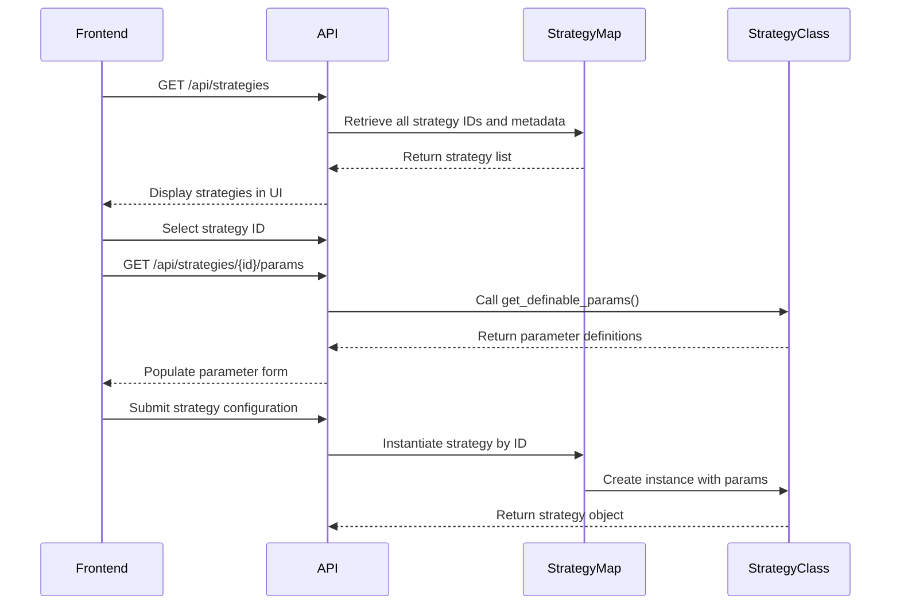
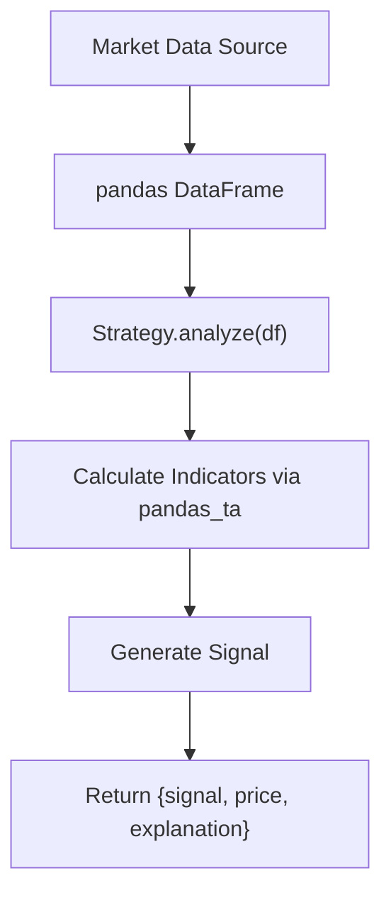

# Strategy Framework

<cite>
**Referenced Files in This Document**   
- [base_strategy.py](file://core/strategies/base_strategy.py)
- [strategy_map.py](file://core/strategies/strategy_map.py)
- [ma_crossover.py](file://core/strategies/ma_crossover.py)
- [rsi_crossover.py](file://core/strategies/rsi_crossover.py)
- [bollinger_reversion.py](file://core/strategies/bollinger_reversion.py)
- [ichimoku_cloud.py](file://core/strategies/ichimoku_cloud.py)
- [quantumbotx_hybrid.py](file://core/strategies/quantumbotx_hybrid.py)
- [api_bots.py](file://core/routes/api_bots.py)
</cite>

## Table of Contents
1. [Introduction](#introduction)
2. [BaseStrategy Abstract Interface](#basestrategy-abstract-interface)
3. [Strategy Registration and Dynamic Instantiation](#strategy-registration-and-dynamic-instantiation)
4. [Key Strategy Implementations](#key-strategy-implementations)
   - [MA Crossover Strategy](#ma-crossover-strategy)
   - [RSI Crossover Strategy](#rsi-crossover-strategy)
   - [Bollinger Reversion Strategy](#bollinger-reversion-strategy)
   - [Ichimoku Cloud Strategy](#ichimoku-cloud-strategy)
   - [QuantumbotX Hybrid Strategy](#quantumbotx-hybrid-strategy)
5. [Technical Integration and Data Flow](#technical-integration-and-data-flow)
6. [Development Challenges and Best Practices](#development-challenges-and-best-practices)
7. [Conclusion](#conclusion)

## Introduction
The Strategy Framework in quantumbotx provides a modular and extensible architecture for implementing algorithmic trading strategies. Built on an abstract base class, the framework supports multiple concrete strategy implementations that leverage technical indicators from the `pandas_ta` library. Strategies are dynamically registered and instantiated via configuration, enabling flexible backtesting and live trading operations. This document details the core interface, registration mechanism, key strategy implementations, and best practices for developing custom strategies.

**Section sources**
- [base_strategy.py](file://core/strategies/base_strategy.py)

## BaseStrategy Abstract Interface
The `BaseStrategy` abstract class defines the contract that all trading strategies must implement. It provides a consistent interface for signal generation and parameter management.

```python
class BaseStrategy(ABC):
    def __init__(self, bot_instance, params: dict = {}):
        self.bot = bot_instance
        self.params = params

    @abstractmethod
    def analyze(self, df):
        raise NotImplementedError("Each strategy must implement the `analyze(df)` method.")

    @classmethod
    def get_definable_params(cls):
        return []
```

The interface requires two key components:
- **`analyze(df)`**: The core method that processes market data (as a pandas DataFrame) and returns a dictionary containing the trading signal (`BUY`, `SELL`, or `HOLD`), price, and explanation.
- **`get_definable_params()`**: A class method that returns a list of configurable parameters with their metadata (name, label, type, default value).

This design ensures all strategies follow a uniform execution pattern while allowing flexibility in implementation logic.

**Section sources**
- [base_strategy.py](file://core/strategies/base_strategy.py#L4-L28)

## Strategy Registration and Dynamic Instantiation
Strategies are registered and made available through the `STRATEGY_MAP` dictionary in `strategy_map.py`. This registry enables dynamic instantiation based on configuration.

```python
STRATEGY_MAP = {
    'MA_CROSSOVER': MACrossoverStrategy,
    'QUANTUMBOTX_HYBRID': QuantumBotXHybridStrategy,
    'RSI_CROSSOVER': RSICrossoverStrategy,
    'BOLLINGER_REVERSION': BollingerBandsStrategy,
    # ... other mappings
}
```

The registration mechanism works as follows:
1. Each strategy class is imported and mapped to a unique string identifier.
2. The `/api/strategies` endpoint exposes available strategies to the frontend.
3. When a user selects a strategy, its parameters are fetched via `/api/strategies/{id}/params`.
4. At runtime, the system instantiates the appropriate strategy class using the configuration-specified ID.

This approach decouples strategy selection from implementation, supporting dynamic loading and configuration-driven execution.



**Diagram sources**
- [strategy_map.py](file://core/strategies/strategy_map.py#L0-L28)
- [api_bots.py](file://core/routes/api_bots.py#L30-L56)

**Section sources**
- [strategy_map.py](file://core/strategies/strategy_map.py)
- [api_bots.py](file://core/routes/api_bots.py)

## Key Strategy Implementations

### MA Crossover Strategy
The Moving Average Crossover strategy generates signals based on the intersection of two moving averages.

**Parameters:**
- `fast_period`: Period for the fast moving average (default: 20)
- `slow_period`: Period for the slow moving average (default: 50)

**Logic:**
- **BUY**: Fast MA crosses above slow MA (Golden Cross)
- **SELL**: Fast MA crosses below slow MA (Death Cross)

```python
def analyze(self, df):
    fast_period = self.params.get('fast_period', 20)
    slow_period = self.params.get('slow_period', 50)
    
    df["ma_fast"] = ta.sma(df["close"], length=fast_period)
    df["ma_slow"] = ta.sma(df["close"], length=slow_period)
    
    # Signal detection logic
    if prev["ma_fast"] <= prev["ma_slow"] and last["ma_fast"] > last["ma_slow"]:
        signal = "BUY"
```

This strategy is effective in trending markets but may generate false signals during sideways price action.

**Section sources**
- [ma_crossover.py](file://core/strategies/ma_crossover.py)

### RSI Crossover Strategy
This momentum-based strategy uses RSI crossovers with a moving average filter, validated by a long-term trend filter.

**Parameters:**
- `rsi_period`: RSI calculation period (default: 14)
- `rsi_ma_period`: MA period applied to RSI (default: 10)
- `trend_filter_period`: Long-term trend filter period (default: 50)

**Logic:**
- **BUY**: Uptrend + RSI crosses above its MA
- **SELL**: Downtrend + RSI crosses below its MA

The dual-filter approach reduces false signals by ensuring trades align with the prevailing trend direction.

**Section sources**
- [rsi_crossover.py](file://core/strategies/rsi_crossover.py)

### Bollinger Reversion Strategy
This mean-reversion strategy identifies overbought and oversold conditions using Bollinger Bands.

**Parameters:**
- `bb_length`: Band calculation period (default: 20)
- `bb_std`: Standard deviation multiplier (default: 2.0)
- `trend_filter_period`: Trend filter period (default: 200)

**Logic:**
- **BUY**: Price touches lower band during an uptrend
- **SELL**: Price touches upper band during a downtrend

The strategy assumes prices will revert to the mean after extreme moves, with the trend filter ensuring trades follow the dominant market direction.

**Section sources**
- [bollinger_reversion.py](file://core/strategies/bollinger_reversion.py)

### Ichimoku Cloud Strategy
A comprehensive trend-following system using the Ichimoku Cloud components.

**Parameters:**
- `tenkan_period`: Tenkan-sen period (default: 9)
- `kijun_period`: Kijun-sen period (default: 26)
- `senkou_period`: Senkou Span B period (default: 52)
- `use_cloud_filter`: Whether to require price above/below cloud

**Logic:**
- **BUY**: Price above cloud + Tenkan crosses above Kijun
- **SELL**: Price below cloud + Tenkan crosses below Kijun

The cloud provides dynamic support/resistance levels, while the Tenkan/Kijun crossover acts as the entry trigger.

**Section sources**
- [ichimoku_cloud.py](file://core/strategies/ichimoku_cloud.py)

### QuantumbotX Hybrid Strategy
A multi-indicator fusion strategy that adapts to market conditions.

**Parameters:**
- ADX, MA, Bollinger, and trend filter parameters

**Logic:**
- **Trending markets** (ADX > threshold): Uses MA crossover signals
- **Ranging markets** (ADX ≤ threshold): Uses Bollinger reversion signals

The strategy dynamically switches between trend-following and mean-reversion modes based on market volatility, providing robust performance across different regimes.

**Section sources**
- [quantumbotx_hybrid.py](file://core/strategies/quantumbotx_hybrid.py)

## Technical Integration and Data Flow
All strategies consume market data as pandas DataFrames and integrate with technical indicators through the `pandas_ta` library. The data flow follows this pattern:



Key integration points:
- **Data Input**: OHLCV data is passed as a DataFrame with standard column names (`open`, `high`, `low`, `close`, `volume`)
- **Indicator Calculation**: Strategies use `pandas_ta` functions (e.g., `ta.sma()`, `ta.rsi()`, `df.ta.bbands()`)
- **Signal Output**: Consistent dictionary format enables uniform handling across the system
- **Backtesting Compatibility**: The `analyze_df()` method supports vectorized operations for efficient backtesting

**Section sources**
- [ma_crossover.py](file://core/strategies/ma_crossover.py)
- [rsi_crossover.py](file://core/strategies/rsi_crossover.py)

## Development Challenges and Best Practices

### Common Challenges
- **Overfitting**: Excessive parameter optimization can lead to poor out-of-sample performance
- **Edge Cases**: Insufficient data can cause indicator miscalculations
- **Parameter Optimization**: Finding robust parameter sets requires rigorous testing
- **Market Regime Changes**: Strategies may perform differently across volatility regimes

### Best Practices
1. **Handle Edge Cases**: Always check for sufficient data before analysis
2. **Use Trend Filters**: Combine primary signals with long-term trend confirmation
3. **Validate Parameters**: Implement bounds checking for configurable parameters
4. **Ensure Thread Safety**: Strategy instances should not share mutable state
5. **Document Assumptions**: Clearly state the market conditions under which the strategy performs best

### Creating Custom Strategies
To create a new strategy:
1. Inherit from `BaseStrategy`
2. Implement `analyze()` and `get_definable_params()`
3. Add to `STRATEGY_MAP`
4. Test thoroughly with historical data

```python
class CustomStrategy(BaseStrategy):
    name = "Custom Strategy"
    description = "Your strategy description"
    
    @classmethod
    def get_definable_params(cls):
        return [{"name": "param1", "label": "Param 1", "type": "number", "default": 10}]
    
    def analyze(self, df):
        # Your signal logic here
        return {"signal": "HOLD", "price": None, "explanation": "No signal"}
```

**Section sources**
- [base_strategy.py](file://core/strategies/base_strategy.py)
- [strategy_map.py](file://core/strategies/strategy_map.py)

## Conclusion
The Strategy Framework in quantumbotx provides a robust foundation for developing, testing, and deploying algorithmic trading strategies. By adhering to the `BaseStrategy` interface and leveraging the dynamic registration system, developers can create sophisticated trading algorithms that integrate seamlessly with the platform. The framework's design emphasizes flexibility, maintainability, and performance, supporting both simple indicator-based strategies and complex multi-component systems. When combined with proper risk management and thorough backtesting, this framework enables the development of effective trading solutions.