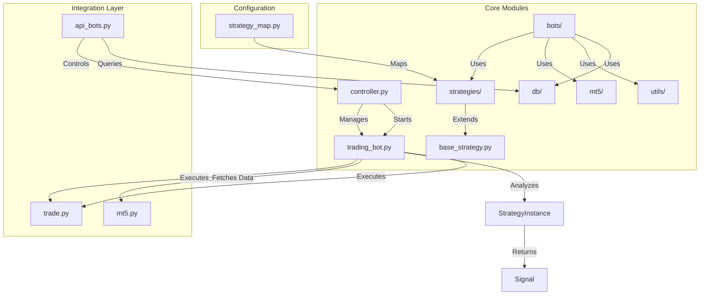
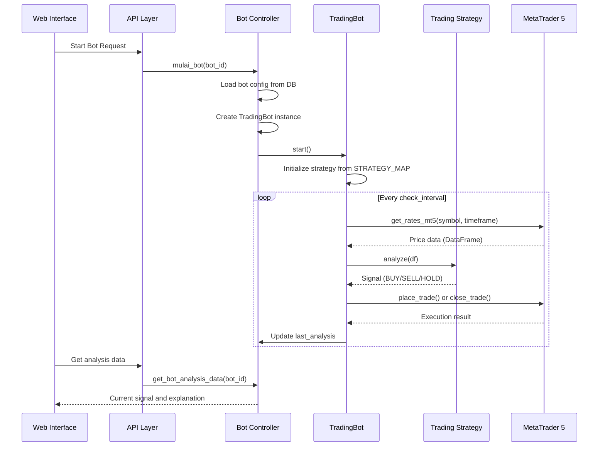
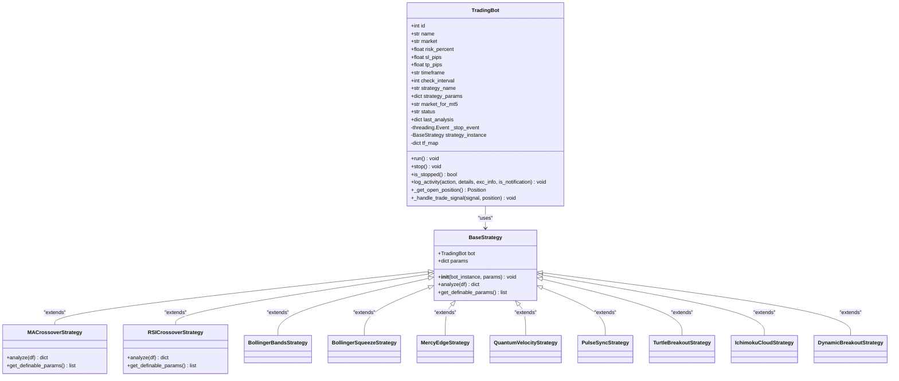
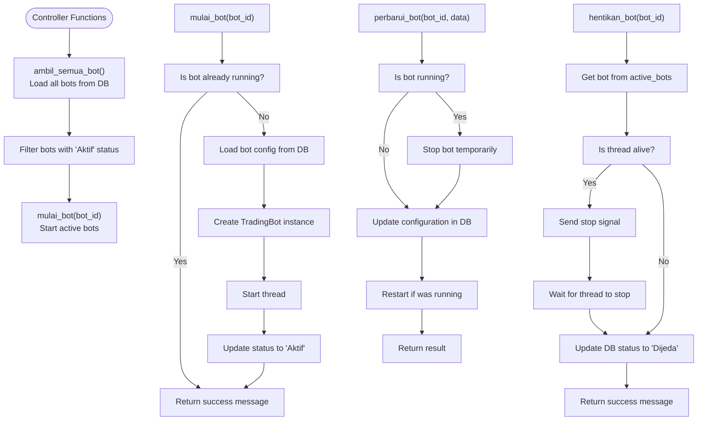
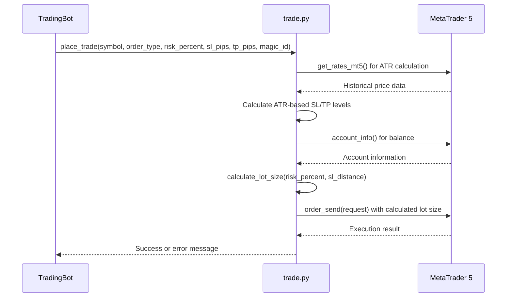
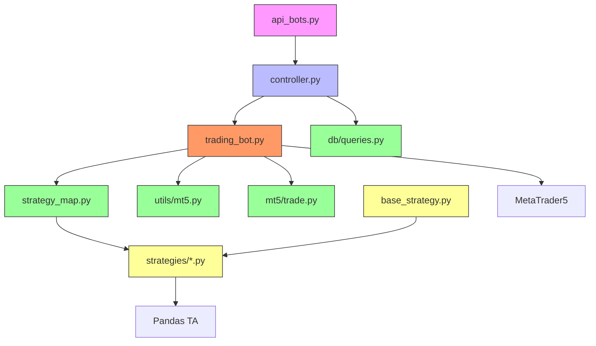

# Trading Bot System

<cite>
**Referenced Files in This Document**   
- [trading_bot.py](file://core/bots/trading_bot.py#L1-L169)
- [controller.py](file://core/bots/controller.py#L1-L176)
- [strategy_map.py](file://core/strategies/strategy_map.py#L1-L29)
- [base_strategy.py](file://core/strategies/base_strategy.py#L1-L28)
- [trade.py](file://core/mt5/trade.py#L1-L152)
- [mt5.py](file://core/utils/mt5.py#L1-L144)
- [api_bots.py](file://core/routes/api_bots.py#L1-L167)
</cite>

## Table of Contents
1. [Introduction](#introduction)
2. [Project Structure](#project-structure)
3. [Core Components](#core-components)
4. [Architecture Overview](#architecture-overview)
5. [Detailed Component Analysis](#detailed-component-analysis)
6. [Dependency Analysis](#dependency-analysis)
7. [Performance Considerations](#performance-considerations)
8. [Troubleshooting Guide](#troubleshooting-guide)
9. [Conclusion](#conclusion)

## Introduction
The Trading Bot System in quantumbotx is a multi-threaded, strategy-driven automated trading platform that integrates with MetaTrader 5 (MT5) for real-time market data and trade execution. The system enables users to configure, start, stop, and monitor multiple trading bots simultaneously through a web interface. Each bot operates independently in its own thread, applying a selected trading strategy to generate signals and execute trades based on configurable risk parameters. This document provides a comprehensive analysis of the system's architecture, lifecycle, configuration, and integration points.

## Project Structure
The project follows a modular structure with clear separation of concerns. Key directories include:
- **core/bots**: Contains the `TradingBot` class and `controller` for managing bot instances
- **core/strategies**: Houses all trading strategy implementations and the `strategy_map`
- **core/mt5**: Manages integration with MetaTrader 5 for trade execution
- **core/utils/mt5**: Provides utility functions for MT5 connectivity and data retrieval
- **core/routes**: Contains API endpoints for web interface interaction
- **core/db**: Handles database operations for bot persistence



**Diagram sources**
- [trading_bot.py](file://core/bots/trading_bot.py#L1-L169)
- [controller.py](file://core/bots/controller.py#L1-L176)
- [strategy_map.py](file://core/strategies/strategy_map.py#L1-L29)
- [mt5.py](file://core/utils/mt5.py#L1-L144)
- [trade.py](file://core/mt5/trade.py#L1-L152)
- [api_bots.py](file://core/routes/api_bots.py#L1-L167)

**Section sources**
- [trading_bot.py](file://core/bots/trading_bot.py#L1-L169)
- [controller.py](file://core/bots/controller.py#L1-L176)

## Core Components
The Trading Bot System consists of several core components that work together to enable automated trading:
- **TradingBot**: A thread-based class that manages the trading lifecycle, including signal generation and trade execution
- **Controller**: Manages the lifecycle of multiple bot instances, handling startup, shutdown, and state persistence
- **Strategy System**: A pluggable architecture that allows different trading strategies to be loaded and executed
- **MT5 Integration**: Provides connectivity to MetaTrader 5 for market data and trade execution
- **API Layer**: Exposes bot management functionality through REST endpoints for web interface interaction

**Section sources**
- [trading_bot.py](file://core/bots/trading_bot.py#L1-L169)
- [controller.py](file://core/bots/controller.py#L1-L176)
- [strategy_map.py](file://core/strategies/strategy_map.py#L1-L29)

## Architecture Overview
The Trading Bot System follows a layered architecture with clear separation between business logic, integration, and presentation layers. The system is designed around a central `TradingBot` class that extends Python's `threading.Thread`, enabling concurrent execution of multiple bots. Each bot operates independently, fetching market data from MT5, applying a configured strategy, and executing trades based on generated signals.

The controller acts as a singleton manager for all active bot instances, maintaining a registry of running bots and providing methods to start, stop, and update bots. Strategies are implemented as pluggable components registered in the `STRATEGY_MAP`, allowing dynamic loading based on configuration. The API layer exposes bot management functionality through REST endpoints, enabling web-based control and monitoring.



**Diagram sources**
- [trading_bot.py](file://core/bots/trading_bot.py#L1-L169)
- [controller.py](file://core/bots/controller.py#L1-L176)
- [strategy_map.py](file://core/strategies/strategy_map.py#L1-L29)
- [mt5.py](file://core/utils/mt5.py#L1-L144)
- [trade.py](file://core/mt5/trade.py#L1-L152)
- [api_bots.py](file://core/routes/api_bots.py#L1-L167)

## Detailed Component Analysis

### TradingBot Class Analysis
The `TradingBot` class is the core execution unit of the system, implementing a thread-based trading agent that continuously monitors the market and executes trades based on strategy signals.

#### Class Diagram


**Diagram sources**
- [trading_bot.py](file://core/bots/trading_bot.py#L1-L169)
- [base_strategy.py](file://core/strategies/base_strategy.py#L1-L28)

**Section sources**
- [trading_bot.py](file://core/bots/trading_bot.py#L1-L169)

#### Initialization and Configuration
The `TradingBot` class is initialized with the following parameters:
- **id**: Unique identifier for the bot (int)
- **name**: Descriptive name for the bot (str)
- **market**: Trading symbol (e.g., "XAUUSD", "EURUSD")
- **risk_percent**: Percentage of account balance to risk per trade (float)
- **sl_pips**: Stop loss distance in pips or ATR multiplier (float)
- **tp_pips**: Take profit distance in pips or ATR multiplier (float)
- **timeframe**: Chart timeframe for analysis (str: "M1", "M5", "H1", etc.)
- **check_interval**: Frequency of market analysis in seconds (int)
- **strategy**: Strategy identifier from STRATEGY_MAP (str)
- **strategy_params**: Dictionary of strategy-specific parameters (dict)
- **status**: Initial status ("Dijeda", "Aktif", "Error")

During initialization, the bot sets up internal state including a stop event for graceful shutdown, an empty last analysis result, and a reference to the timeframe mapping dictionary.

#### Thread-Based Execution Loop
The `run()` method implements the main execution loop that runs in a separate thread:

```python
def run(self):
    self.status = 'Aktif'
    # Verify MT5 symbol
    self.market_for_mt5 = find_mt5_symbol(self.market)
    if not self.market_for_mt5:
        self.handle_error("Symbol not found")
        return
    
    # Initialize strategy
    strategy_class = STRATEGY_MAP.get(self.strategy_name)
    self.strategy_instance = strategy_class(bot_instance=self, params=self.strategy_params)
    
    while not self._stop_event.is_set():
        try:
            # Fetch market data
            tf_const = self.tf_map.get(self.timeframe, mt5.TIMEFRAME_H1)
            df = get_rates_mt5(self.market_for_mt5, tf_const, 250)
            
            if df.empty:
                self.handle_warning("Failed to fetch price data")
                time.sleep(self.check_interval)
                continue
            
            # Generate signal
            self.last_analysis = self.strategy_instance.analyze(df)
            signal = self.last_analysis.get("signal", "HOLD")
            
            # Get current position
            current_position = self._get_open_position()
            
            # Execute trade logic
            self._handle_trade_signal(signal, current_position)
            
            time.sleep(self.check_interval)
        except Exception as e:
            self.handle_exception(e)
            time.sleep(self.check_interval * 2)
    
    self.status = 'Dijeda'
```

The loop performs the following steps:
1. Verifies the trading symbol exists in MT5's Market Watch
2. Initializes the configured trading strategy
3. Continuously fetches price data at the specified timeframe
4. Passes data to the strategy for analysis
5. Processes the generated signal to execute trades
6. Handles errors and exceptions gracefully
7. Respects the configured check interval between iterations

#### Strategy Loading via STRATEGY_MAP
The system uses a strategy registry pattern implemented through the `STRATEGY_MAP` dictionary in `strategy_map.py`. This map associates strategy identifiers with their corresponding class implementations:

```python
STRATEGY_MAP = {
    'MA_CROSSOVER': MACrossoverStrategy,
    'QUANTUMBOTX_HYBRID': QuantumBotXHybridStrategy,
    'QUANTUMBOTX_CRYPTO': QuantumBotXCryptoStrategy,
    'RSI_CROSSOVER': RSICrossoverStrategy,
    'BOLLINGER_REVERSION': BollingerBandsStrategy,
    'BOLLINGER_SQUEEZE': BollingerSqueezeStrategy,
    'MERCY_EDGE': MercyEdgeStrategy,
    'quantum_velocity': QuantumVelocityStrategy,
    'PULSE_SYNC': PulseSyncStrategy,
    'TURTLE_BREAKOUT': TurtleBreakoutStrategy,
    'ICHIMOKU_CLOUD': IchimokuCloudStrategy,
    'DYNAMIC_BREAKOUT': DynamicBreakoutStrategy,
}
```

When a bot starts, it looks up its strategy in this map and instantiates the corresponding class with the bot instance and strategy parameters. This design enables easy addition of new strategies without modifying the core bot logic.

#### Signal Generation and Trade Execution
Signal generation is delegated to the strategy instance through the `analyze()` method, which returns a dictionary containing:
- **signal**: Trading signal ("BUY", "SELL", "HOLD", or "ERROR")
- **explanation**: Human-readable explanation of the analysis
- Additional strategy-specific data (price levels, indicators, etc.)

The `_handle_trade_signal()` method processes these signals according to the following logic:
- For a "BUY" signal: Close any existing SELL position, then open a new BUY position
- For a "SELL" signal: Close any existing BUY position, then open a new SELL position
- For any other signal: Take no action

Trade execution is handled through the `place_trade()` and `close_trade()` functions in `trade.py`, which interface directly with MT5.

### Bot Controller Analysis
The `controller.py` module manages the lifecycle of all trading bot instances in the system.

#### Controller Functions


**Diagram sources**
- [controller.py](file://core/bots/controller.py#L1-L176)

**Section sources**
- [controller.py](file://core/bots/controller.py#L1-L176)

The controller maintains an `active_bots` dictionary that maps bot IDs to their running instances. Key functions include:
- **mulai_bot()**: Starts a bot by loading its configuration, creating a `TradingBot` instance, and starting its thread
- **hentikan_bot()**: Stops a running bot by sending a stop signal and waiting for graceful shutdown
- **mulai_semua_bot()**: Starts all bots with "Dijeda" status
- **hentikan_semua_bot()**: Stops all running bots
- **perbarui_bot()**: Updates bot configuration, restarting the bot if necessary

### MT5 Integration Analysis
The system integrates with MetaTrader 5 through utility functions in `mt5.py` and trade execution functions in `trade.py`.

#### Trade Execution Flow


**Diagram sources**
- [trade.py](file://core/mt5/trade.py#L1-L152)
- [mt5.py](file://core/utils/mt5.py#L1-L144)

The `place_trade()` function implements sophisticated trade execution logic:
1. Calculates ATR (Average True Range) for dynamic stop loss and take profit levels
2. Computes appropriate lot size based on account balance and risk percentage
3. Constructs an MT5 order request with magic number (bot ID) for position tracking
4. Sends the order and returns the result

The `calculate_lot_size()` function ensures risk management by:
- Determining the monetary amount to risk based on account balance
- Calculating the loss per standard lot using MT5's order calculation functions
- Deriving the appropriate lot size to limit loss to the specified risk amount
- Adjusting for broker-specific volume constraints (minimum, maximum, step)

## Dependency Analysis
The Trading Bot System has a well-defined dependency structure that enables modularity and maintainability.



**Diagram sources**
- [trading_bot.py](file://core/bots/trading_bot.py#L1-L169)
- [controller.py](file://core/bots/controller.py#L1-L176)
- [strategy_map.py](file://core/strategies/strategy_map.py#L1-L29)
- [mt5.py](file://core/utils/mt5.py#L1-L144)
- [trade.py](file://core/mt5/trade.py#L1-L152)
- [api_bots.py](file://core/routes/api_bots.py#L1-L167)

Key dependency relationships:
- The API layer depends on the controller for bot management
- The controller depends on both the `TradingBot` class and database queries
- The `TradingBot` class depends on strategy loading, MT5 utilities, and trade execution
- All strategies depend on the `BaseStrategy` abstract class
- The system depends on external libraries: MetaTrader5, pandas, and pandas_ta

## Performance Considerations
The Trading Bot System incorporates several performance and resource management features:

### Thread Management
- Each bot runs in its own thread, enabling concurrent execution of multiple strategies
- The check interval parameter allows control over CPU usage and API call frequency
- Graceful shutdown using threading.Event prevents resource leaks
- Thread joining with timeout ensures responsive shutdown

### Resource Efficiency
- Market data is fetched only when needed, with configurable frequency
- The symbol verification process minimizes unnecessary API calls
- Error handling includes backoff mechanisms to prevent excessive retry loops
- Database operations are batched where appropriate

### Scalability
- The controller can manage multiple bots simultaneously
- Strategy implementations are stateless and can be reused across bots
- Memory usage is minimized by keeping only essential state in each bot instance
- The system can be extended with new strategies without performance degradation

Best practices for running multiple concurrent bots:
- Configure appropriate check intervals to avoid overwhelming the MT5 connection
- Distribute bots across different timeframes to balance resource usage
- Monitor system resources and adjust the number of active bots accordingly
- Use the bulk start/stop functions to manage multiple bots efficiently

## Troubleshooting Guide
Common issues and their solutions:

### Symbol Not Found
**Symptom**: "Simbol 'XAUUSD' atau variasinya tidak dapat ditemukan/diaktifkan di Market Watch MT5."
**Cause**: The symbol is not available or not visible in MT5's Market Watch
**Solution**: 
1. Ensure the symbol exists in your broker's offering
2. Add the symbol to Market Watch in MT5
3. Refresh the symbol list in MT5
4. Restart the application

**Section sources**
- [mt5.py](file://core/utils/mt5.py#L1-L144)

### Strategy Initialization Failed
**Symptom**: "Inisialisasi Gagal: Strategi 'MA_CROSSOVER' tidak ditemukan."
**Cause**: The strategy name doesn't match any entry in STRATEGY_MAP
**Solution**:
1. Verify the strategy name in the bot configuration
2. Check that the strategy file is properly imported in strategy_map.py
3. Ensure the strategy class is correctly defined

**Section sources**
- [strategy_map.py](file://core/strategies/strategy_map.py#L1-L29)

### Trade Execution Errors
**Symptom**: "Order GAGAL, retcode=10013, comment: Invalid stops"
**Cause**: Stop loss or take profit levels are too close to the current price
**Solution**:
1. Increase the SL/TP distance
2. Check broker-specific requirements for minimum distance
3. Verify market conditions (e.g., not during news events)

**Section sources**
- [trade.py](file://core/mt5/trade.py#L1-L152)

### Database Connection Issues
**Symptom**: "Gagal mencatat riwayat untuk bot 1: database is locked"
**Cause**: Multiple processes accessing the database simultaneously
**Solution**:
1. Ensure only one instance of the application is running
2. Implement proper database connection handling
3. Use the init_db.py script to initialize the database

**Section sources**
- [controller.py](file://core/bots/controller.py#L1-L176)
- [init_db.py](file://init_db.py)

## Conclusion
The Trading Bot System in quantumbotx provides a robust, extensible framework for automated trading with MetaTrader 5. The system's modular architecture separates concerns effectively, with clear boundaries between bot execution, strategy implementation, and integration layers. Key strengths include:
- Thread-based design enabling concurrent bot execution
- Pluggable strategy architecture for easy extension
- Comprehensive error handling and graceful shutdown
- Web-based management through REST APIs
- Integrated risk management and position tracking

The system demonstrates sound software engineering practices with proper separation of concerns, defensive programming, and maintainable code structure. Future enhancements could include backtesting integration, strategy optimization tools, and enhanced monitoring capabilities.