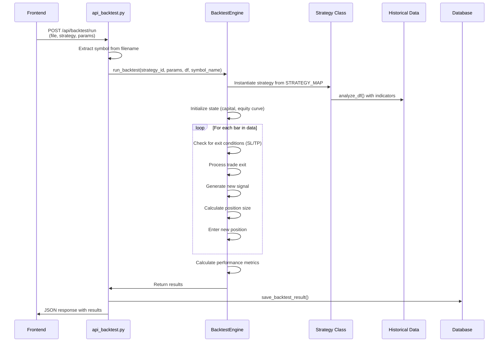
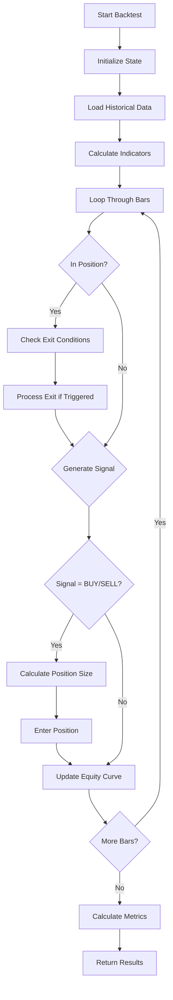

# Backtesting Workflow

<cite>
**Referenced Files in This Document**   
- [api_backtest.py](file://core/routes/api_backtest.py)
- [engine.py](file://core/backtesting/engine.py)
- [strategy_map.py](file://core/strategies/strategy_map.py)
- [base_strategy.py](file://core/strategies/base_strategy.py)
- [queries.py](file://core/db/queries.py)
</cite>

## Table of Contents
1. [Introduction](#introduction)
2. [Backtesting Workflow Overview](#backtesting-workflow-overview)
3. [Strategy Selection and Parameter Input](#strategy-selection-and-parameter-input)
4. [Parameter Validation and Initialization](#parameter-validation-and-initialization)
5. [Backtest Execution and Simulation Logic](#backtest-execution-and-simulation-logic)
6. [Trade Signal Generation and Strategy Implementation](#trade-signal-generation-and-strategy-implementation)
7. [Position Tracking and Risk Management](#position-tracking-and-risk-management)
8. [Performance Metrics Calculation](#performance-metrics-calculation)
9. [Result Interpretation and Output Structure](#result-interpretation-and-output-structure)
10. [Data Persistence and History Management](#data-persistence-and-history-management)
11. [Common Issues and Debugging Strategies](#common-issues-and-debugging-strategies)
12. [Performance Considerations and Optimization](#performance-considerations-and-optimization)

## Introduction
The Backtesting Workflow in quantumbotx enables users to evaluate trading strategies using historical market data. This comprehensive system allows for strategy selection, parameter configuration, simulation execution, and performance analysis. The workflow is orchestrated through a well-defined sequence of operations spanning API endpoints, engine logic, strategy implementations, and data persistence layers. This document provides a detailed technical analysis of the entire backtesting process, from user input to result interpretation, with emphasis on code-level implementation, data flow, and system interactions.

## Backtesting Workflow Overview

The backtesting workflow in quantumbotx follows a structured process that begins with user input and concludes with performance analysis and data persistence. The system is designed to simulate real trading conditions using historical data, allowing users to evaluate strategy effectiveness before live deployment.



**Diagram sources**
- [api_backtest.py](file://core/routes/api_backtest.py#L59-L84)
- [engine.py](file://core/backtesting/engine.py#L15-L317)

**Section sources**
- [api_backtest.py](file://core/routes/api_backtest.py#L59-L84)
- [engine.py](file://core/backtesting/engine.py#L15-L317)

## Strategy Selection and Parameter Input

The backtesting workflow begins with strategy selection and parameter input. Users select a strategy from the available options and provide specific parameters for configuration. The system uses a strategy mapping mechanism to dynamically instantiate the appropriate strategy class based on the selected strategy ID.

The STRATEGY_MAP dictionary in strategy_map.py serves as a registry of all available strategies, mapping strategy IDs to their corresponding class implementations. This design pattern enables extensibility, allowing new strategies to be added without modifying the core backtesting engine.

```python
# core/strategies/strategy_map.py
STRATEGY_MAP = {
    'MA_CROSSOVER': MACrossoverStrategy,
    'QUANTUMBOTX_HYBRID': QuantumBotXHybridStrategy,
    'RSI_CROSSOVER': RSICrossoverStrategy,
    'BOLLINGER_REVERSION': BollingerBandsStrategy,
    # ... additional strategies
}
```

When a backtest is initiated, the API endpoint extracts the strategy ID from the request and passes it to the run_backtest function. The engine then looks up the corresponding strategy class in the STRATEGY_MAP and instantiates it with the provided parameters.

**Section sources**
- [strategy_map.py](file://core/strategies/strategy_map.py#L1-L30)

## Parameter Validation and Initialization

Before executing the backtest, the system performs parameter validation and initialization. The run_backtest function in engine.py validates the input parameters and initializes the necessary components for the simulation.

The validation process includes checking for the existence of the requested strategy in the STRATEGY_MAP, ensuring the historical data DataFrame is not empty, and validating parameter types. The system also initializes a MockBot instance to provide strategy implementations with a consistent interface, even in the backtesting context.

```python
# core/backtesting/engine.py
def run_backtest(strategy_id, params, historical_data_df, symbol_name=None):
    strategy_class = STRATEGY_MAP.get(strategy_id)
    if not strategy_class:
        return {"error": "Strategi tidak ditemukan"}
    
    # Initialize MockBot for strategy
    class MockBot:
        def __init__(self):
            if symbol_name:
                self.market_for_mt5 = symbol_name
            # ... other initialization
```

The MockBot class simulates the bot environment that strategies expect, providing attributes like market_for_mt5 and timeframe. This allows strategies to function identically in both backtesting and live trading contexts.

**Section sources**
- [engine.py](file://core/backtesting/engine.py#L15-L45)

## Backtest Execution and Simulation Logic

The core of the backtesting workflow is the simulation logic implemented in the run_backtest function. This function orchestrates the entire backtesting process, from data preparation to result calculation.

The simulation follows a bar-by-bar replay approach, processing each historical data point in sequence. For each bar, the engine checks for existing position exit conditions (stop-loss or take-profit), processes trade exits, generates new trading signals, calculates position size, and enters new positions if appropriate.



**Diagram sources**
- [engine.py](file://core/backtesting/engine.py#L46-L317)

**Section sources**
- [engine.py](file://core/backtesting/engine.py#L46-L317)

## Trade Signal Generation and Strategy Implementation

Trade signal generation is handled by individual strategy classes through their analyze_df method. All strategies inherit from the BaseStrategy abstract class, which defines the interface that all strategies must implement.

```python
# core/strategies/base_strategy.py
class BaseStrategy(ABC):
    def __init__(self, bot_instance, params: dict = {}):
        self.bot = bot_instance
        self.params = params

    @abstractmethod
    def analyze(self, df):
        raise NotImplementedError("Setiap strategi harus mengimplementasikan metode `analyze(df)`.")
```

Each concrete strategy class implements the analyze_df method to generate trading signals based on technical indicators and market conditions. For example, the MA Crossover strategy generates signals when the fast moving average crosses above (BUY) or below (SELL) the slow moving average.

```python
# core/strategies/ma_crossover.py
def analyze_df(self, df):
    fast_period = self.params.get('fast_period', 20)
    slow_period = self.params.get('slow_period', 50)

    df["ma_fast"] = ta.sma(df["close"], length=fast_period)
    df["ma_slow"] = ta.sma(df["close"], length=slow_period)
    
    golden_cross = (df["ma_fast"].shift(1) <= df["ma_slow"].shift(1)) & (df["ma_fast"] > df["ma_slow"])
    death_cross = (df["ma_fast"].shift(1) >= df["ma_slow"].shift(1)) & (df["ma_fast"] < df["ma_slow"])

    df['signal'] = np.where(golden_cross, 'BUY', np.where(death_cross, 'SELL', 'HOLD'))
    
    return df
```

The engine calls the analyze_df method on the instantiated strategy to generate signals for the entire historical dataset before beginning the simulation loop.

**Section sources**
- [base_strategy.py](file://core/strategies/base_strategy.py#L4-L28)
- [ma_crossover.py](file://core/strategies/ma_crossover.py#L47-L60)

## Position Tracking and Risk Management

The backtesting engine implements comprehensive position tracking and risk management. It maintains state variables to track the current position status, entry price, stop-loss and take-profit levels, and lot size.

For risk management, the system implements dynamic position sizing based on the risk percentage specified in the parameters. The position size is calculated to ensure that the potential loss does not exceed the specified risk percentage of the current capital.

Special handling is implemented for XAUUSD (gold) trading due to its extreme volatility. The system applies conservative defaults and additional protections for gold trading:

```python
# Enhanced XAUUSD detection
is_gold_symbol = (
    'XAU' in str(historical_data_df.columns[0]).upper() or
    (symbol_name and 'XAU' in symbol_name.upper()) or
    'GOLD' in str(historical_data_df.columns[0]).upper() or
    (hasattr(strategy_instance.bot, 'market_for_mt5') and 'XAU' in strategy_instance.bot.market_for_mt5.upper())
)

# Conservative defaults for gold
if is_gold_symbol:
    if risk_percent > 1.0:
        risk_percent = 1.0
    if sl_atr_multiplier > 1.0:
        sl_atr_multiplier = 1.0
    if tp_atr_multiplier > 2.0:
        tp_atr_multiplier = 2.0
```

The system also implements an emergency brake mechanism that skips trades if the estimated risk exceeds 5% of the current capital, providing an additional layer of protection.

**Section sources**
- [engine.py](file://core/backtesting/engine.py#L60-L117)

## Performance Metrics Calculation

At the conclusion of the backtest simulation, the engine calculates a comprehensive set of performance metrics. These metrics provide insights into the strategy's effectiveness and risk profile.

The key performance metrics calculated include:

- **Total Profit**: Final capital minus initial capital
- **Win Rate**: Percentage of winning trades
- **Maximum Drawdown**: Largest peak-to-trough decline in equity
- **Total Trades**: Number of trades executed
- **Wins and Losses**: Count of winning and losing trades

```python
# core/backtesting/engine.py
total_profit = capital - initial_capital
wins = len([t for t in trades if t['profit'] > 0])
losses = len(trades) - wins
win_rate = (wins / len(trades) * 100) if trades else 0
max_drawdown = max(max_drawdown, drawdown)
```

The engine also ensures that all calculated values are finite and properly formatted before returning the results, replacing any NaN or infinite values with appropriate defaults.

**Section sources**
- [engine.py](file://core/backtesting/engine.py#L290-L316)

## Result Interpretation and Output Structure

The backtesting workflow returns results in a structured JSON format that includes both summary metrics and detailed trade information. This allows users to analyze both the overall performance and individual trade behavior.

The output structure includes:

```json
{
  "strategy_name": "MA_CROSSOVER",
  "total_trades": 25,
  "final_capital": 12500.50,
  "total_profit_usd": 2500.50,
  "win_rate_percent": 56.0,
  "wins": 14,
  "losses": 11,
  "max_drawdown_percent": 12.5,
  "equity_curve": [10000, 10150, 10200, ...],
  "trades": [
    {
      "entry_time": "2023-01-01T10:00:00",
      "exit_time": "2023-01-01T15:00:00",
      "entry": 1950.5,
      "exit": 1955.8,
      "profit": 530.0,
      "reason": "TP",
      "position_type": "BUY"
    },
    // ... additional trades (last 20 only)
  ]
}
```

The equity curve is included to visualize the strategy's performance over time, while the trade log provides detailed information about the most recent trades. This comprehensive output enables thorough analysis of the strategy's behavior.

**Section sources**
- [engine.py](file://core/backtesting/engine.py#L300-L316)

## Data Persistence and History Management

The backtesting system persists results to a database for historical analysis and comparison. The save_backtest_result function in api_backtest.py handles the storage of backtest results, ensuring data integrity and proper formatting.

```python
# core/routes/api_backtest.py
def save_backtest_result(strategy_name, filename, params, results):
    # Sanitize data before saving
    for key, value in results.items():
        if isinstance(value, (np.floating, float)) and (np.isinf(value) or np.isnan(value)):
            results[key] = None

    try:
        with get_db_connection() as conn:
            cursor = conn.cursor()
            cursor.execute("""
                INSERT INTO backtest_results (
                    strategy_name, data_filename, total_profit_usd, total_trades, 
                    win_rate_percent, max_drawdown_percent, wins, losses, 
                    equity_curve, trade_log, parameters
                ) VALUES (?, ?, ?, ?, ?, ?, ?, ?, ?, ?, ?)
            """, (
                strategy_name,
                filename,
                profit_to_save,
                results.get('total_trades', 0),
                results.get('win_rate_percent', 0),
                results.get('max_drawdown_percent', 0),
                results.get('wins', 0),
                results.get('losses', 0),
                json.dumps(results.get('equity_curve', [])),
                json.dumps(results.get('trades', [])),
                json.dumps(params)
            ))
            conn.commit()
    except Exception as e:
        logger.error(f"[DB ERROR] Gagal menyimpan hasil backtest: {e}", exc_info=True)
```

The system also provides an API endpoint to retrieve historical backtest results, allowing users to analyze past simulations and compare strategy performance over time.

```python
# core/db/queries.py
def get_all_backtest_history():
    """Mengambil semua riwayat hasil backtest dari database."""
    try:
        with get_db_connection() as conn:
            history = conn.execute('SELECT * FROM backtest_results ORDER BY timestamp DESC').fetchall()
            return [dict(row) for row in history]
    except sqlite3.Error as e:
        logger.error(f"Database error saat mengambil riwayat backtest: {e}")
        return []
```

**Section sources**
- [api_backtest.py](file://core/routes/api_backtest.py#L25-L57)
- [queries.py](file://core/db/queries.py#L165-L173)

## Common Issues and Debugging Strategies

Several common issues can arise during backtesting, and the system includes mechanisms to handle these scenarios:

1. **Insufficient Historical Data**: The system checks for empty DataFrames after indicator calculation and returns an appropriate error message.

2. **Incorrect Parameter Types**: The system validates parameter types and provides default values for missing parameters.

3. **Strategy Exceptions**: The API endpoint wraps the backtest execution in a try-except block to handle any exceptions that occur during simulation.

4. **NaN/Inf Values**: The system sanitizes results before saving, replacing NaN and infinite values with None.

Debugging strategies include:

- **Verbose Logging**: The system uses comprehensive logging to track the backtesting process, including individual trade execution and position sizing calculations.

- **Data Validation**: The system validates all inputs and outputs, ensuring data integrity throughout the process.

- **Error Handling**: The system implements robust error handling at multiple levels, from API input validation to database transaction management.

```python
# Example of comprehensive logging
logger.info(f"Trade closed: {position_type} | Entry: {entry_price} | Exit: {exit_price} | Lot: {lot_size} | Profit: {profit}")
logger.info(f"XAUUSD EXTREME PROTECTION: ATR = {atr_value:.2f}")
logger.info(f"GOLD EMERGENCY BRAKE: Risk ${estimated_risk:.2f} > max ${max_risk_dollar:.2f}, skipping trade")
```

**Section sources**
- [engine.py](file://core/backtesting/engine.py#L290-L316)
- [api_backtest.py](file://core/routes/api_backtest.py#L70-L84)

## Performance Considerations and Optimization

The backtesting workflow includes several performance considerations and optimization opportunities:

1. **Vectorized Operations**: Strategy implementations use pandas_ta for vectorized indicator calculations, which is significantly faster than iterative approaches.

2. **Efficient Data Structures**: The system uses NumPy arrays and pandas DataFrames for efficient numerical computations.

3. **Memory Management**: The system processes data in chunks and releases resources appropriately.

4. **Database Optimization**: The system uses parameterized queries and connection pooling for efficient database operations.

For long backtests with extensive historical data, users can optimize performance by:

- **Reducing Data Resolution**: Using higher timeframe data (e.g., H4 instead of M1) to reduce the number of bars processed.

- **Limiting Indicator Complexity**: Simplifying strategy logic to reduce computational overhead.

- **Batch Processing**: Running multiple backtests in parallel when testing parameter combinations.

- **Caching Results**: Implementing a caching layer for frequently used indicator calculations.

The system's modular design allows for further optimization, such as implementing a compiled backend for the simulation loop or adding support for GPU acceleration in future versions.

**Section sources**
- [engine.py](file://core/backtesting/engine.py#L15-L317)
- [ma_crossover.py](file://core/strategies/ma_crossover.py#L47-L60)