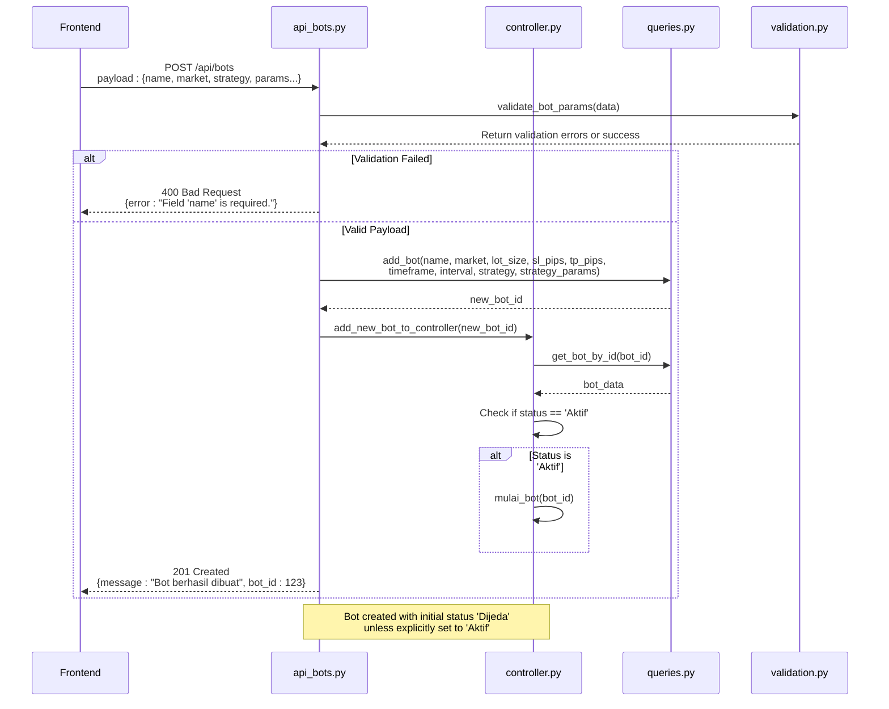
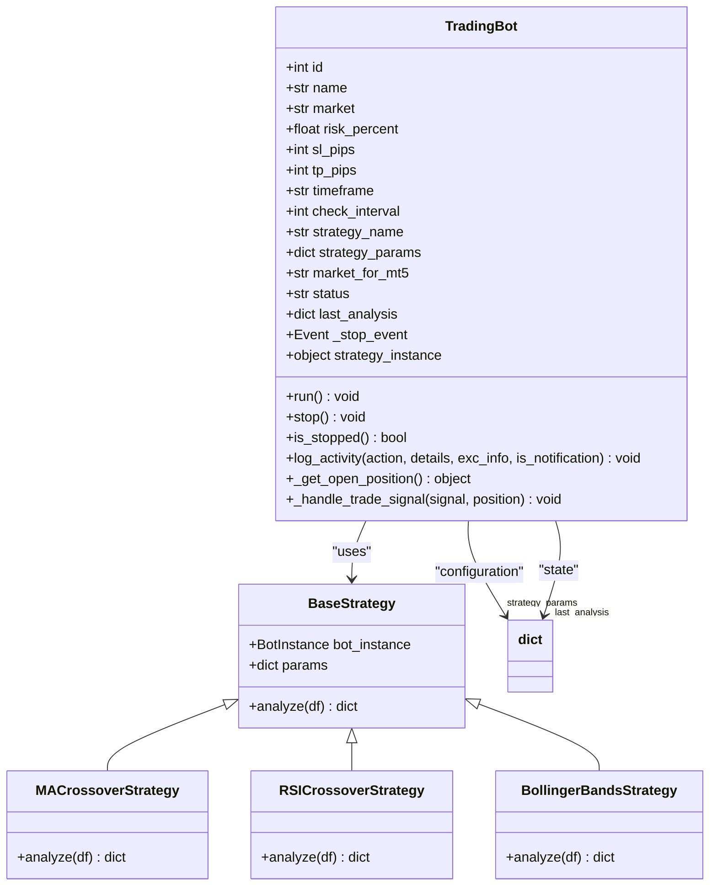
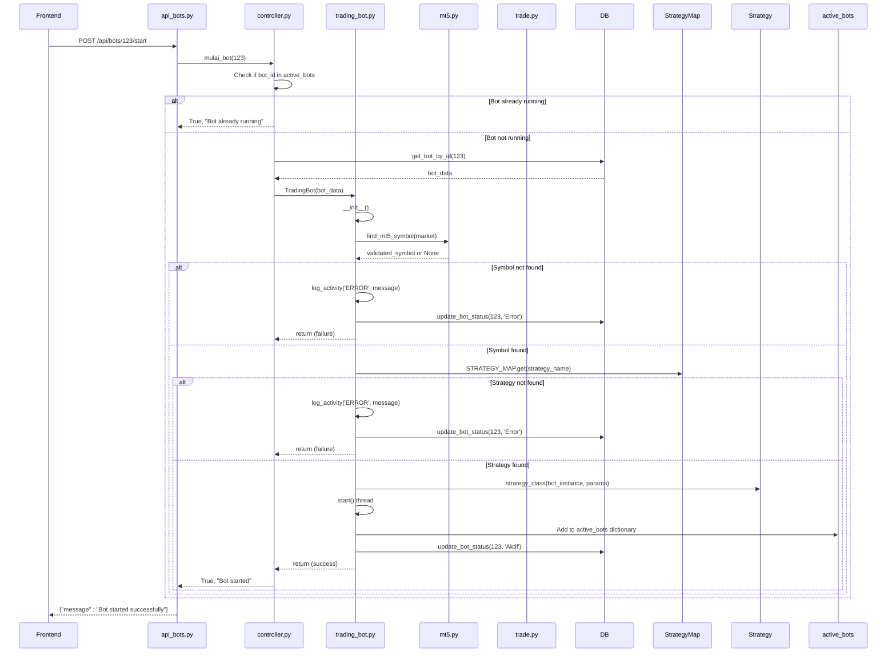
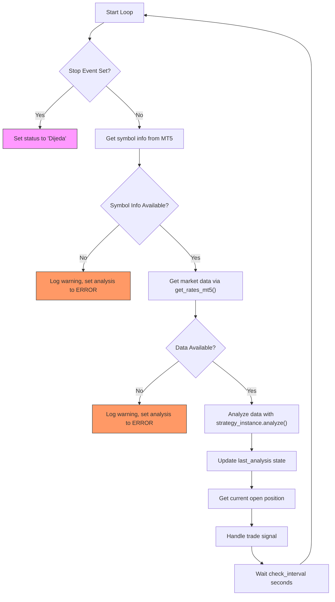
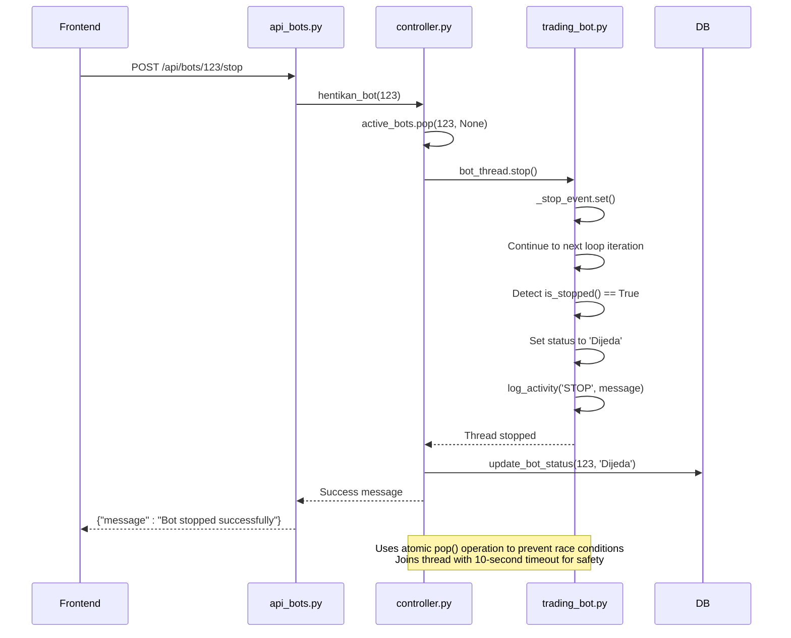
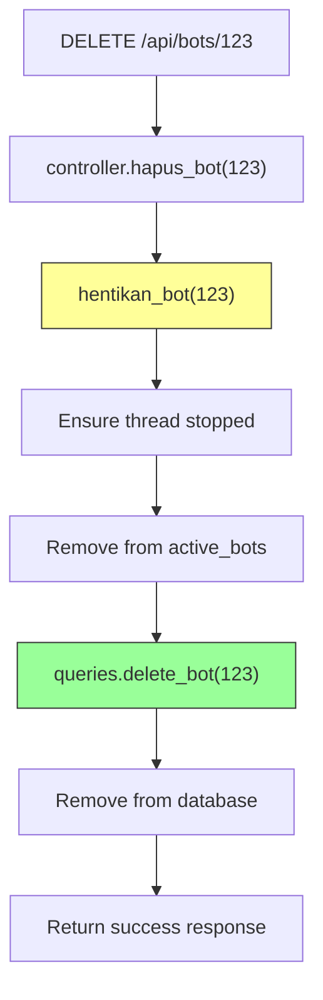
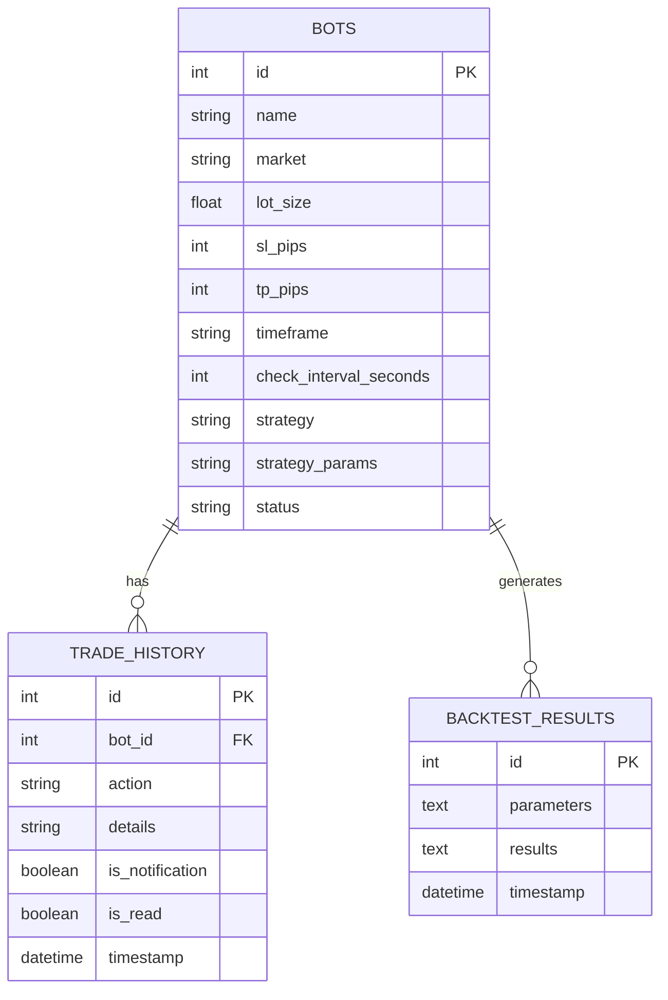

# Bot Lifecycle Management

<cite>
**Referenced Files in This Document**   
- [api_bots.py](file://core/routes/api_bots.py)
- [controller.py](file://core/bots/controller.py)
- [trading_bot.py](file://core/bots/trading_bot.py)
- [queries.py](file://core/db/queries.py)
- [validation.py](file://core/utils/validation.py)
- [mt5.py](file://core/utils/mt5.py)
- [trade.py](file://core/mt5/trade.py)
- [strategy_map.py](file://core/strategies/strategy_map.py)
</cite>

## Table of Contents
1. [Bot Lifecycle Management](#bot-lifecycle-management)
2. [Creation](#creation)
3. [Configuration](#configuration)
4. [Starting](#starting)
5. [Running State](#running-state)
6. [Stopping](#stopping)
7. [Deletion](#deletion)
8. [Error Handling Scenarios](#error-handling-scenarios)
9. [Troubleshooting Guide](#troubleshooting-guide)
10. [Integration Points](#integration-points)

## Creation

The bot creation process begins with a POST request to the `/api/bots` endpoint, which triggers the bot creation workflow. This process involves payload validation, database persistence, and controller registration.



**Diagram sources**
- [api_bots.py](file://core/routes/api_bots.py#L58-L75)
- [controller.py](file://core/bots/controller.py#L140-L148)
- [queries.py](file://core/db/queries.py#L20-L41)
- [validation.py](file://core/utils/validation.py#L2-L20)

**Section sources**
- [api_bots.py](file://core/routes/api_bots.py#L58-L75)
- [validation.py](file://core/utils/validation.py#L2-L20)

## Configuration

Bot configuration involves parameter validation, strategy mapping, and risk settings management. The system validates all required fields and ensures proper data types before persisting configuration changes.

### Parameter Validation

The `validate_bot_params()` function in validation.py enforces strict validation rules for bot creation:

**Required fields:**
- `name`: string, required
- `market`: string, required
- `lot_size`: positive number, required
- `sl_pips`: positive integer, required
- `tp_pips`: positive integer, required
- `timeframe`: string, required
- `check_interval_seconds`: integer, required
- `strategy`: string, required

**Validation rules:**
- Lot size must be a positive number
- SL (Stop Loss) must be a positive integer
- TP (Take Profit) must be a positive integer

### Strategy Mapping

The system uses a strategy registry pattern implemented in strategy_map.py to map strategy identifiers to their corresponding classes:

```python
STRATEGY_MAP = {
    'MA_CROSSOVER': MACrossoverStrategy,
    'QUANTUMBOTX_HYBRID': QuantumBotXHybridStrategy,
    'RSI_CROSSOVER': RSICrossoverStrategy,
    'BOLLINGER_REVERSION': BollingerBandsStrategy,
    # ... additional strategies
}
```

When a bot is configured with a specific strategy, the system looks up the corresponding strategy class and instantiates it with the provided parameters.



**Diagram sources**
- [trading_bot.py](file://core/bots/trading_bot.py#L10-L170)
- [strategy_map.py](file://core/strategies/strategy_map.py#L1-L30)
- [base_strategy.py](file://core/strategies/base_strategy.py)

**Section sources**
- [validation.py](file://core/utils/validation.py#L2-L20)
- [strategy_map.py](file://core/strategies/strategy_map.py#L1-L30)

## Starting

The bot starting process involves thread initialization, MT5 connection verification, and order execution readiness. When a bot is started via the `/api/bots/<id>/start` endpoint, the controller initiates the startup sequence.

### Startup Sequence



**Diagram sources**
- [api_bots.py](file://core/routes/api_bots.py#L91-L100)
- [controller.py](file://core/bots/controller.py#L40-L85)
- [trading_bot.py](file://core/bots/trading_bot.py#L10-L170)
- [mt5.py](file://core/utils/mt5.py#L67-L144)

**Section sources**
- [controller.py](file://core/bots/controller.py#L40-L85)
- [trading_bot.py](file://core/bots/trading_bot.py#L10-L170)

## Running State

Once started, the bot enters a running state where it performs heartbeat monitoring, position synchronization, and continuous market analysis. The TradingBot class inherits from threading.Thread and implements the run() method for continuous operation.

### Main Execution Loop

The bot's main execution loop performs the following steps at regular intervals (defined by check_interval):

1. Verify symbol information is available
2. Retrieve market data from MT5
3. Analyze data using the configured strategy
4. Handle trading signals (BUY, SELL, HOLD)
5. Execute trades as needed
6. Update analysis state



**Diagram sources**
- [trading_bot.py](file://core/bots/trading_bot.py#L64-L135)

**Section sources**
- [trading_bot.py](file://core/bots/trading_bot.py#L64-L135)

## Stopping

The bot stopping process ensures graceful shutdown and proper handling of open positions. When a stop request is received, the system sends a stop signal to the bot thread and waits for it to terminate.

### Graceful Shutdown Process



**Diagram sources**
- [api_bots.py](file://core/routes/api_bots.py#L102-L109)
- [controller.py](file://core/bots/controller.py#L87-L107)
- [trading_bot.py](file://core/bots/trading_bot.py#L58-L62)

**Section sources**
- [controller.py](file://core/bots/controller.py#L87-L107)

## Deletion

The bot deletion process involves resource cleanup and database removal. This ensures that all system resources are properly released and the bot configuration is permanently removed.

### Deletion Workflow



The `hapus_bot()` function in controller.py follows a safe deletion pattern:

1. First calls `hentikan_bot()` to ensure the bot thread is stopped
2. Then calls `queries.delete_bot()` to remove the bot from the database
3. Returns success only if both operations complete

This two-step process prevents resource leaks and ensures data consistency.

**Diagram sources**
- [api_bots.py](file://core/routes/api_bots.py#L99-L101)
- [controller.py](file://core/bots/controller.py#L134-L138)
- [queries.py](file://core/db/queries.py#L55-L65)

**Section sources**
- [controller.py](file://core/bots/controller.py#L134-L138)

## Error Handling Scenarios

The system implements comprehensive error handling for various failure scenarios throughout the bot lifecycle.

### Common Error Scenarios

**Invalid Strategy Name:**
- Occurs when a bot is configured with a strategy not present in STRATEGY_MAP
- Handled in TradingBot.__init__() by checking STRATEGY_MAP.get(strategy_name)
- Results in error status and notification to user
- Logged with full traceback for debugging

**MT5 Disconnection on Start:**
- Occurs when MT5 terminal is not running or connection fails
- Handled by mt5.initialize() returning False
- TradingBot logs initialization failure and sets status to 'Error'
- User receives specific error message about MT5 connection

**Database Write Failure During Creation:**
- Occurs when SQLite database is locked or disk is full
- Handled in queries.add_bot() with try-except block
- Returns None on failure, which propagates to API endpoint
- API returns 500 error with "Gagal menyimpan bot" message

**Symbol Configuration Issues:**
- Occurs when configured symbol is not available in MT5 Market Watch
- Handled by find_mt5_symbol() function which tries multiple variations
- If no valid symbol found, bot initialization fails with specific error
- Common with currency pairs that have different naming conventions (e.g., USDIDR vs USDidr)

```mermaid
stateDiagram-v2
[*] --> Idle
Idle --> Active : Start Bot
Active --> Error : Strategy Not Found
Active --> Error : MT5 Connection Lost
Active --> Error : Database Error
Active --> Error : Symbol Not Found
Active --> Idle : Stop Bot
Error --> Idle : Manual Recovery
Error --> Active : Auto-retry (if configured)
note right of Error
Error states persist until
user intervention or
system recovery
end
```

**Diagram sources**
- [trading_bot.py](file://core/bots/trading_bot.py#L64-L135)
- [mt5.py](file://core/utils/mt5.py#L67-L144)
- [queries.py](file://core/db/queries.py#L20-L41)

**Section sources**
- [trading_bot.py](file://core/bots/trading_bot.py#L64-L135)

## Troubleshooting Guide

This section provides solutions for common issues encountered with bot lifecycle management.

### Common Issues and Solutions

**Bot Fails to Start Due to Incorrect Symbol Configuration:**
- **Symptoms:** Bot status shows "Error", log indicates symbol not found
- **Root Cause:** Symbol name mismatch between bot configuration and MT5 Market Watch
- **Solution:** 
  1. Verify the symbol exists in MT5 Market Watch
  2. Check for naming variations (e.g., XAUUSD vs XAU/USD vs GOLD)
  3. Use the find_mt5_symbol() function which automatically tries common variations
  4. Ensure the symbol is visible in Market Watch (right-click → Show)

**Thread Conflicts When Starting Multiple Bots:**
- **Symptoms:** Intermittent failures when starting multiple bots simultaneously
- **Root Cause:** Race conditions in active_bots dictionary access
- **Solution:**
  1. The system uses atomic operations (pop()) to prevent race conditions
  2. Ensure proper thread joining with timeout
  3. Implement retry logic for transient failures
  4. Monitor system resources (CPU, memory) during bulk operations

**Database Locking Issues:**
- **Symptoms:** "Database error" messages, failed bot creation/deletion
- **Root Cause:** SQLite database locked by another process
- **Solution:**
  1. Implement proper connection context managers
  2. Add retry logic with exponential backoff
  3. Ensure connections are properly closed
  4. Consider connection pooling for high-frequency operations

**MT5 Connection Timeouts:**
- **Symptoms:** Intermittent connection failures, data retrieval issues
- **Root Cause:** Network issues or MT5 server overload
- **Solution:**
  1. Implement connection retry logic
  2. Add connection health checks
  3. Use connection keep-alive mechanisms
  4. Monitor MT5 terminal status and restart if needed

**Strategy Parameter Validation Failures:**
- **Symptoms:** Bot creation fails with parameter validation errors
- **Root Cause:** Missing or invalid required fields
- **Solution:**
  1. Verify all required fields are present in the payload
  2. Check data types (e.g., lot_size must be number, not string)
  3. Validate numeric ranges (positive values for risk parameters)
  4. Use the get_strategy_params_route() to retrieve valid parameter schema

**Section sources**
- [validation.py](file://core/utils/validation.py#L2-L20)
- [mt5.py](file://core/utils/mt5.py#L67-L144)
- [trading_bot.py](file://core/bots/trading_bot.py#L10-L170)

## Integration Points

The bot lifecycle management system integrates with several key components to provide complete trading functionality.

### Database Integration (Bot Persistence)

The system uses SQLite for persistent storage of bot configurations and state:

**Bot Table Schema:**
- `id`: INTEGER PRIMARY KEY
- `name`: TEXT NOT NULL
- `market`: TEXT NOT NULL
- `lot_size`: REAL NOT NULL
- `sl_pips`: INTEGER NOT NULL
- `tp_pips`: INTEGER NOT NULL
- `timeframe`: TEXT NOT NULL
- `check_interval_seconds`: INTEGER NOT NULL
- `strategy`: TEXT NOT NULL
- `strategy_params`: TEXT (JSON)
- `status`: TEXT (Aktif/Dijeda/Error)

**Persistence Operations:**
- **Creation:** INSERT with initial status 'Dijeda'
- **Updates:** UPDATE with field filtering to prevent errors
- **Status Changes:** Dedicated update_bot_status() function
- **Deletion:** Soft delete via DELETE statement



**Diagram sources**
- [queries.py](file://core/db/queries.py#L20-L174)
- [models.py](file://core/db/models.py)

### MT5 Integration (Trading Capability)

The system integrates with MetaTrader 5 for market data and trade execution:

**Key Integration Components:**
- **Market Data:** get_rates_mt5() retrieves historical price data
- **Symbol Management:** find_mt5_symbol() handles symbol name variations
- **Trade Execution:** place_trade() and close_trade() functions
- **Position Management:** _get_open_position() tracks current trades
- **Account Information:** get_account_info_mt5() monitors account status

**Trading Workflow:**
1. Bot requests market data for analysis
2. Strategy analyzes data and generates signal
3. Bot checks for existing position
4. If signal and no conflicting position, execute trade
5. Trade details recorded in local database
6. Position status continuously monitored

**Section sources**
- [queries.py](file://core/db/queries.py#L20-L174)
- [mt5.py](file://core/utils/mt5.py#L67-L144)
- [trade.py](file://core/mt5/trade.py#L20-L152)