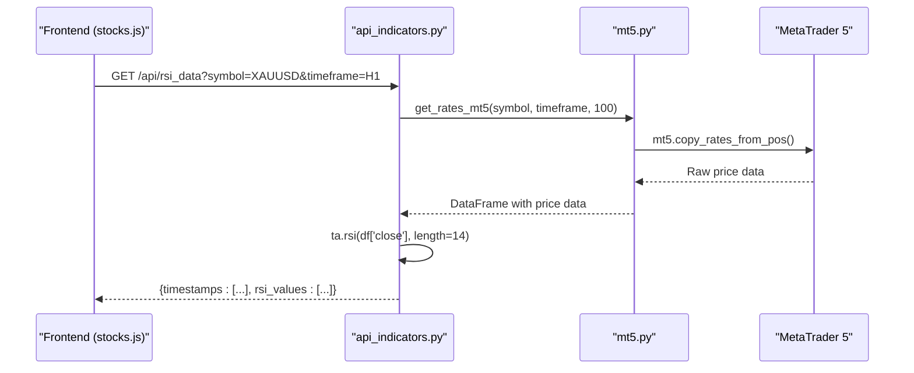
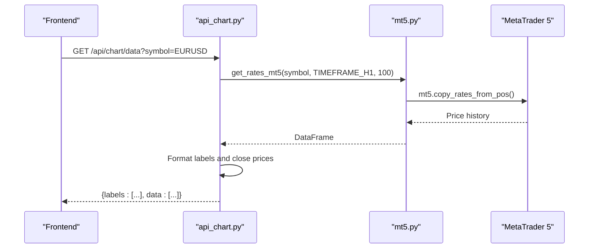

# Market Analysis Workflow

<cite>
**Referenced Files in This Document**   
- [api_indicators.py](file://core/routes/api_indicators.py)
- [api_chart.py](file://core/routes/api_chart.py)
- [api_fundamentals.py](file://core/routes/api_fundamentals.py)
- [mt5.py](file://core/utils/mt5.py)
- [stocks.js](file://static/js/stocks.js)
</cite>

## Table of Contents
1. [Introduction](#introduction)
2. [Data Flow Overview](#data-flow-overview)
3. [Indicator Calculation via API](#indicator-calculation-via-api)
4. [Chart Data Retrieval and Formatting](#chart-data-retrieval-and-formatting)
5. [Fundamental Data Serving](#fundamental-data-serving)
6. [Frontend Integration and Visualization](#frontend-integration-and-visualization)
7. [Sequence Diagrams of Key Workflows](#sequence-diagrams-of-key-workflows)
8. [Caching Strategies and Performance Optimization](#caching-strategies-and-performance-optimization)
9. [Common Issues and Troubleshooting](#common-issues-and-troubleshooting)
10. [Extensibility and Future Enhancements](#extensibility-and-future-enhancements)

## Introduction
The Market Analysis Workflow in quantumbotx enables users to analyze financial instruments through technical indicators, price charts, and fundamental data. This system integrates with MetaTrader 5 (MT5) for historical price data, uses pandas_ta for technical indicator computation, and exposes the processed data via RESTful API endpoints. The frontend consumes this data using JavaScript modules and renders visualizations for user interaction. This document details the end-to-end workflow from data retrieval to frontend rendering, including implementation specifics, performance considerations, and extensibility.

## Data Flow Overview
The market analysis data flow follows a structured pipeline:
1. **Frontend Request**: JavaScript initiates an HTTP request to a specific API endpoint.
2. **API Processing**: Python backend receives the request, validates parameters, and retrieves raw data from MT5.
3. **Data Transformation**: Raw price data is transformed into technical indicators or formatted for charting.
4. **JSON Response**: Processed data is serialized into JSON and returned to the client.
5. **Frontend Rendering**: JavaScript receives the response and updates the DOM or charting library.

This flow ensures separation of concerns and scalability across different data types (technical, chart, fundamental).

## Indicator Calculation via API
Technical indicators are calculated using the `pandas_ta` library through dedicated API endpoints such as `/api/rsi_data`. The implementation resides in `api_indicators.py`.

### Key Function: `get_rsi_data()`
```python
@api_indicators.route('/api/rsi_data')
def get_rsi_data():
    symbol = request.args.get('symbol', 'EURUSD')
    tf = request.args.get('timeframe', 'H1')

    tf_map = {
        'M1': mt5.TIMEFRAME_M1,
        'M5': mt5.TIMEFRAME_M5,
        'M15': mt5.TIMEFRAME_M15,
        'H1': mt5.TIMEFRAME_H1,
        'H4': mt5.TIMEFRAME_H4,
        'D1': mt5.TIMEFRAME_D1
    }
    timeframe = tf_map.get(tf.upper(), mt5.TIMEFRAME_H1)

    df = get_rates_mt5(symbol, timeframe, 100)
    if df is None or len(df) < 20:
        return jsonify({'timestamps': [], 'rsi_values': []})

    df['RSI'] = ta.rsi(df['close'], length=14)
    df = df.dropna().tail(20)

    return jsonify({
        'timestamps': [x.strftime('%H:%M') for x in df['time']],
        'rsi_values': df['RSI'].round(2).tolist()
    })
```

### Input Validation and Error Handling
- **Parameter Validation**: Uses `.get()` with defaults to handle missing query parameters.
- **Timeframe Mapping**: Validates and maps string timeframes to MT5 constants.
- **Data Sufficiency Check**: Ensures at least 20 bars are available before computing RSI.
- **Null Handling**: Drops NaN values and limits output to the most recent 20 values.

### pandas_ta Integration
The `ta.rsi()` function computes the Relative Strength Index using the closing prices from the DataFrame. The result is rounded to two decimal places for readability.

**Section sources**
- [api_indicators.py](file://core/routes/api_indicators.py#L15-L34)

## Chart Data Retrieval and Formatting
Chart data is served via the `/api/chart/data` endpoint defined in `api_chart.py`. This endpoint retrieves raw price data from MT5 and formats it for frontend consumption.

### Implementation in `api_chart.py`
```python
@api_chart.route('/api/chart/data')
def api_chart_data():
    symbol = request.args.get('symbol', 'EURUSD')
    df = get_rates_mt5(symbol, mt5.TIMEFRAME_H1, 100)
    
    if df is None or df.empty:
        return jsonify({"error": "Failed to retrieve chart data"}), 500
    
    chart_data = {
        "labels": df.index.strftime('%H:%M').tolist(),
        "data": df['close'].tolist()
    }
    return jsonify(chart_data)
```

### Data Formatting
- **Labels**: Time values are formatted as `HH:MM` strings for display on the x-axis.
- **Data Series**: Only closing prices are included in the initial implementation, suitable for line charts.

### MT5 Data Retrieval
The `get_rates_mt5()` function from `mt5.py` is used to fetch historical price data:
- Accepts symbol, timeframe, and bar count.
- Returns a pandas DataFrame with datetime index.
- Handles errors and returns empty DataFrame on failure.

**Section sources**
- [api_chart.py](file://core/routes/api_chart.py#L6-L21)
- [mt5.py](file://core/utils/mt5.py#L20-L35)

## Fundamental Data Serving
Fundamental data for trading bots is served through `/api/bots/<int:bot_id>/fundamentals` in `api_fundamentals.py`.

### Endpoint Implementation
```python
@api_fundamentals.route('/api/bots/<int:bot_id>/fundamentals')
def get_bot_fundamentals(bot_id):
    bot = queries.get_bot_by_id(bot_id)
    if not bot:
        return jsonify({'error': 'Bot not found'}), 404

    if '/' in bot['market']:
        return jsonify({})  # Skip if not stock

    return jsonify({})
```

### Current Limitations
- The endpoint currently returns an empty JSON object.
- Intended to return symbol metadata such as contract size, margin requirements, and currency details.
- Relies on `queries.get_bot_by_id()` from the database layer.

This suggests that fundamental data serving is a placeholder and may be extended in future versions.

**Section sources**
- [api_fundamentals.py](file://core/routes/api_fundamentals.py#L7-L19)

## Frontend Integration and Visualization
The frontend uses JavaScript modules, particularly `stocks.js`, to request and visualize market data.

### stocks.js: Core Functionality
```javascript
document.addEventListener('DOMContentLoaded', function() {
    fetchStockData();
});

function fetchStockData() {
    const tableBody = document.getElementById('stocks-table-body');

    fetch('/api/stocks')
        .then(response => {
            if (!response.ok) throw new Error(`HTTP error! status: ${response.status}`);
            return response.json();
        })
        .then(stocks => {
            if (!stocks || stocks.length === 0) {
                tableBody.innerHTML = '<tr><td colspan="5" class="text-center">No stock data available.</td></tr>';
                return;
            }

            const rowsHtml = stocks.map(stock => {
                const changeClass = stock.change >= 0 ? 'text-green-600' : 'text-red-600';
                const changeIcon = stock.change >= 0 ? '▲' : '▼';

                return `
                    <tr>
                        <td class="px-6 py-4 whitespace-nowrap">
                            <div class="flex items-center">
                                <div class="font-medium text-gray-900">${stock.symbol}</div>
                            </div>
                        </td>
                        <td class="px-6 py-4 whitespace-nowrap font-medium">${stock.last_price.toFixed(2)}</td>
                        <td class="px-6 py-4 whitespace-nowrap font-medium ${changeClass}">${changeIcon} ${Math.abs(stock.change)}</td>
                        <td class="px-6 py-4 whitespace-nowrap text-sm text-gray-500">${stock.time}</td>
                        <td class="px-6 py-4 whitespace-nowrap text-right">
                            <button class="bg-blue-600 text-white py-1 px-3 rounded-md text-sm font-medium hover:bg-blue-700">Trade</button>
                            <button class="bg-gray-600 text-white py-1 px-3 rounded-md text-sm font-medium hover:bg-gray-700 details-btn" data-symbol="${stock.symbol}">Details</button>
                        </td>
                    </tr>
                `;
            }).join('');

            tableBody.innerHTML = rowsHtml;
        })
        .catch(error => {
            console.error('Error fetching stock data:', error);
            if (tableBody) {
                tableBody.innerHTML = '<tr><td colspan="5" class="p-4 text-center text-red-500">Failed to load data.</td></tr>';
            }
        });
}
```

### Key Features
- **Automatic Data Fetching**: Loads data when the DOM is ready.
- **Error Handling**: Displays user-friendly messages on network or server errors.
- **Dynamic Table Rendering**: Builds HTML rows from JSON data.
- **Visual Indicators**: Uses color and arrow icons to represent price changes.

### Modal Interaction
- Clicking "Details" triggers `fetchCompanyProfile(symbol)`.
- Fetches additional symbol metadata from `/api/stocks/{symbol}/profile`.
- Displays information in a modal dialog.

**Section sources**
- [stocks.js](file://static/js/stocks.js#L1-L105)

## Sequence Diagrams of Key Workflows

### Indicator Calculation Workflow


**Diagram sources**
- [api_indicators.py](file://core/routes/api_indicators.py#L15-L34)
- [mt5.py](file://core/utils/mt5.py#L20-L35)

### Chart Data Loading Workflow


**Diagram sources**
- [api_chart.py](file://core/routes/api_chart.py#L6-L21)
- [mt5.py](file://core/utils/mt5.py#L20-L35)

## Caching Strategies and Performance Optimization
While explicit caching mechanisms are not implemented in the current codebase, several optimization opportunities exist:

### Recommended Caching Strategies
1. **In-Memory Caching**: Use Redis or Flask-Caching to store recently computed indicators.
2. **Time-Based Cache Expiry**: Cache data for 1-5 minutes depending on timeframe.
3. **Per-Symbol Caching**: Cache results by symbol and timeframe to avoid redundant MT5 calls.

### Performance Optimization Tips
- **Precompute Common Indicators**: Calculate RSI, MACD, and Bollinger Bands in advance for popular symbols.
- **Limit Data Range**: Restrict historical data to necessary periods (e.g., 100 bars instead of 1000).
- **Batch Requests**: Allow frontend to request multiple indicators in a single call.
- **WebSocket Streaming**: For real-time updates, consider WebSocket connections to push updates instead of polling.

These strategies would reduce MT5 API load and improve frontend responsiveness.

## Common Issues and Troubleshooting

### Missing Data Points
- **Cause**: MT5 connection failure or invalid symbol.
- **Solution**: Verify MT5 is running and symbol exists using `find_mt5_symbol()`.

### Indicator Parameter Validation Errors
- **Cause**: Invalid timeframe or missing parameters.
- **Solution**: Ensure query parameters match expected format (e.g., `timeframe=H1`).

### Slow Chart Loading
- **Cause**: Large data requests or network latency.
- **Solution**: Reduce bar count or implement client-side pagination.

### Debugging Tips
- Check MT5 logs via `logger` in `mt5.py`.
- Validate API responses using browser developer tools.
- Test endpoints directly with `curl` or Postman.

## Extensibility and Future Enhancements

### Adding New Indicators
1. Create a new route in `api_indicators.py`.
2. Use corresponding `pandas_ta` function (e.g., `ta.macd()`, `ta.bbands()`).
3. Validate input parameters and handle edge cases.

Example:
```python
@api_indicators.route('/api/macd_data')
def get_macd_data():
    # Similar structure to get_rsi_data()
    df['MACD'] = ta.macd(df['close'])
    # Return MACD line, signal line, histogram
```

### Supporting New Data Sources
- **Integration Points**: Extend `mt5.py` or create new broker modules.
- **Unified Interface**: Use abstract base classes in `brokers/base_broker.py`.
- **Configuration**: Allow dynamic broker selection via API parameters.

### Enhanced Frontend Visualizations
- Integrate charting libraries like Chart.js or TradingView Lightweight Charts.
- Support candlestick charts, volume overlays, and multi-indicator views.
- Implement real-time updates via WebSockets.

These extensibility points ensure the system can evolve with new analytical requirements.