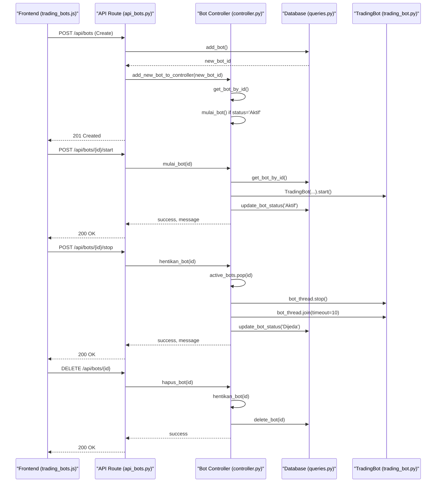
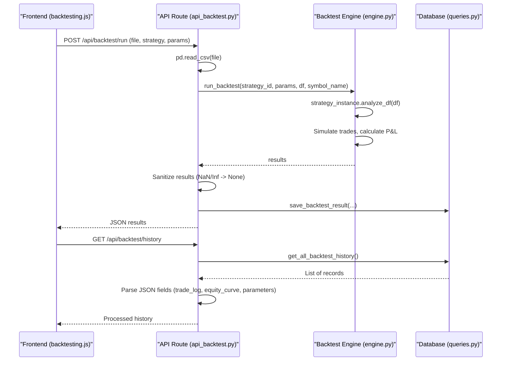
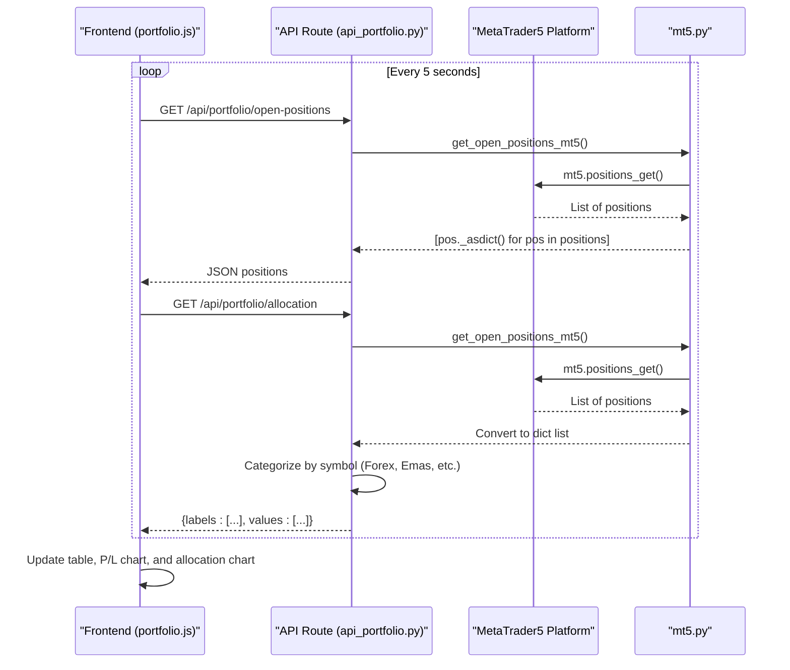
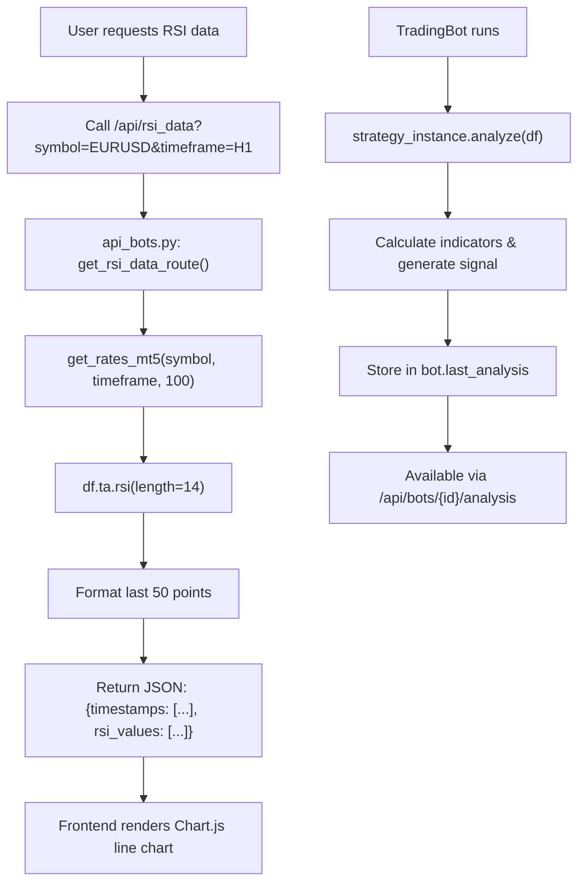

# System Workflows

<cite>
**Referenced Files in This Document**   
- [api_bots.py](file://core/routes/api_bots.py)
- [controller.py](file://core/bots/controller.py)
- [trading_bot.py](file://core/bots/trading_bot.py)
- [api_backtest.py](file://core/routes/api_backtest.py)
- [engine.py](file://core/backtesting/engine.py)
- [api_portfolio.py](file://core/routes/api_portfolio.py)
- [mt5.py](file://core/utils/mt5.py)
- [api_indicators.py](file://core/routes/api_indicators.py)
</cite>

## Table of Contents
1. [Bot Lifecycle Management](#bot-lifecycle-management)
2. [Backtesting Workflow](#backtesting-workflow)
3. [Portfolio Monitoring](#portfolio-monitoring)
4. [Market Analysis](#market-analysis)

## Bot Lifecycle Management

This workflow covers the complete lifecycle of a trading bot, from creation to deletion. The process is orchestrated through API endpoints in `api_bots.py` that interact with the business logic in `controller.py` and the `TradingBot` class.

The workflow begins when a user submits a form in the frontend (`trading_bots.html`) to create a new bot. This triggers an HTTP POST request to the `/api/bots` endpoint. The API validates the input data and calls the `add_bot` function from the database queries module to persist the bot configuration. Upon successful database insertion, the controller is notified via `add_new_bot_to_controller`, which prepares the bot for operation.

When a user starts a bot, either individually or in bulk, the `/api/bots/<int:bot_id>/start` endpoint is called. This invokes the `mulai_bot` function in the controller, which instantiates a `TradingBot` object and starts its execution thread. The bot's status is updated in the database to reflect its active state. Conversely, stopping a bot sends a request to `/api/bots/<int:bot_id>/stop`, which triggers the `hentikan_bot` function. This function safely stops the bot's thread using a stop event and updates the database status.

**Diagram sources**
- [api_bots.py](file://core/routes/api_bots.py#L100-L125)
- [controller.py](file://core/bots/controller.py#L100-L150)
- [trading_bot.py](file://core/bots/trading_bot.py#L50-L80)

Critical integration points include the initialization of the MT5 connection, which is managed by the `initialize_mt5` function in `mt5.py`. This function is called during the application startup in `run.py` and must succeed for any bot to interact with the trading platform. If the MT5 connection fails during bot start, the `TradingBot`'s `run` method will log an error, set its status to 'Error', and terminate gracefully. The system handles this by updating the bot's status in the database and sending a notification to the user.

**Section sources**
- [api_bots.py](file://core/routes/api_bots.py#L100-L167)
- [controller.py](file://core/bots/controller.py#L68-L176)
- [trading_bot.py](file://core/bots/trading_bot.py#L0-L169)

## Backtesting Workflow

The backtesting workflow allows users to evaluate a trading strategy's performance using historical data. The process starts with the user selecting a strategy, inputting parameters, and uploading a CSV file containing historical price data. This data is sent to the `/api/backtest/run` endpoint in `api_backtest.py`.

The API route parses the CSV file into a pandas DataFrame and extracts the strategy ID and parameters. It then calls the `run_backtest` function from the `engine.py` module. This function uses the `STRATEGY_MAP` to instantiate the appropriate strategy class with a `MockBot` instance. The strategy's `analyze_df` method is used to generate trading signals on the historical data. The backtesting engine then simulates trades based on these signals, managing a virtual portfolio with dynamic position sizing.

The engine calculates key performance metrics, including total profit, win rate, number of trades, and maximum drawdown. Special logic is applied for XAUUSD (gold) trading, which implements more conservative risk parameters due to its high volatility. The results, including an equity curve and a log of trades, are returned to the API. The API then sanitizes the data (converting NaN/Inf values to None) and saves it to the `backtest_results` table in the database via the `save_backtest_result` function.

Users can later retrieve their backtesting history by calling the `/api/backtest/history` endpoint. This returns a list of all past backtests, with JSON fields like `equity_curve` and `trade_log` being safely parsed before being sent to the frontend.

**Diagram sources**
- [api_backtest.py](file://core/routes/api_backtest.py#L58-L130)
- [engine.py](file://core/backtesting/engine.py#L0-L318)

**Section sources**
- [api_backtest.py](file://core/routes/api_backtest.py#L0-L130)
- [engine.py](file://core/backtesting/engine.py#L0-L318)

## Portfolio Monitoring

The portfolio monitoring workflow provides real-time insights into open trading positions and overall portfolio performance. The frontend (`portfolio.js`) uses `setInterval` to poll the backend every 5 seconds for updated data.

The primary endpoint for this workflow is `/api/portfolio/open-positions`, defined in `api_portfolio.py`. This endpoint calls the `get_open_positions_mt5` function from `mt5.py`. This function uses the MetaTrader5 API's `positions_get()` method to retrieve all currently open trades. The raw tuple data is converted into a list of dictionaries for easier JSON serialization and returned to the frontend.

The second endpoint, `/api/portfolio/allocation`, also uses `get_open_positions_mt5` to fetch the data. It then categorizes each position based on its symbol (e.g., "XAU" for gold, "EURUSD" for forex) and calculates the total volume for each asset class. This data is formatted into a structure suitable for Chart.js to render a pie chart showing asset allocation.

The frontend (`portfolio.js`) processes the open positions data to calculate the total unrealized profit/loss, which is displayed in a summary. It also updates a real-time line chart (P/L chart) with the total profit value, creating a dynamic visualization of portfolio performance. The asset allocation data is used to update a pie chart, providing a visual representation of risk distribution.

**Diagram sources**
- [api_portfolio.py](file://core/routes/api_portfolio.py#L0-L57)
- [mt5.py](file://core/utils/mt5.py#L100-L120)

**Section sources**
- [api_portfolio.py](file://core/routes/api_portfolio.py#L0-L57)
- [mt5.py](file://core/utils/mt5.py#L100-L120)
- [portfolio.js](file://static/js/portfolio.js#L0-L150)

## Market Analysis

The market analysis workflow encompasses the calculation of technical indicators and the rendering of charts for user consumption. The system provides endpoints for specific indicators, such as the RSI, which is served by the `/api/rsi_data` endpoint in `api_bots.py`.

When this endpoint is called, it retrieves the requested symbol and timeframe, converts it to the corresponding MT5 constant, and fetches the latest 100 bars of historical data using `get_rates_mt5`. It then uses the `pandas-ta` library to calculate the RSI(14) on the closing prices. The last 50 data points are formatted into a JSON structure containing timestamps and RSI values, which is sent to the frontend for rendering with Chart.js.

For more complex analysis, the system relies on the strategy classes in the `strategies` directory. Each strategy (e.g., `bollinger_squeeze.py`, `ma_crossover.py`) implements an `analyze` method that calculates its specific indicators (Bollinger Bands, Moving Averages) and generates a trading signal. This analysis is performed live by the `TradingBot` thread and made available via the `/api/bots/<int:bot_id>/analysis` endpoint.

The fundamental data display is handled by the `api_fundamentals.py` and `api_bots_fundamentals.py` routes, which likely fetch data from external sources (though the README notes these API keys are deprecated). The data is then processed and served to the frontend for display in the respective HTML templates.

**Diagram sources**
- [api_bots.py](file://core/routes/api_bots.py#L150-L167)
- [mt5.py](file://core/utils/mt5.py#L60-L80)
- [trading_bot.py](file://core/bots/trading_bot.py#L100-L130)

**Section sources**
- [api_bots.py](file://core/routes/api_bots.py#L150-L167)
- [api_indicators.py](file://core/routes/api_indicators.py)
- [mt5.py](file://core/utils/mt5.py#L60-L80)
- [trading_bot.py](file://core/bots/trading_bot.py#L100-L130)