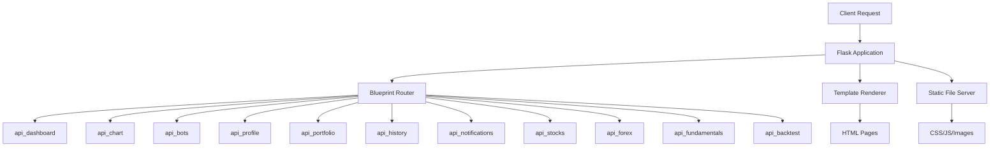
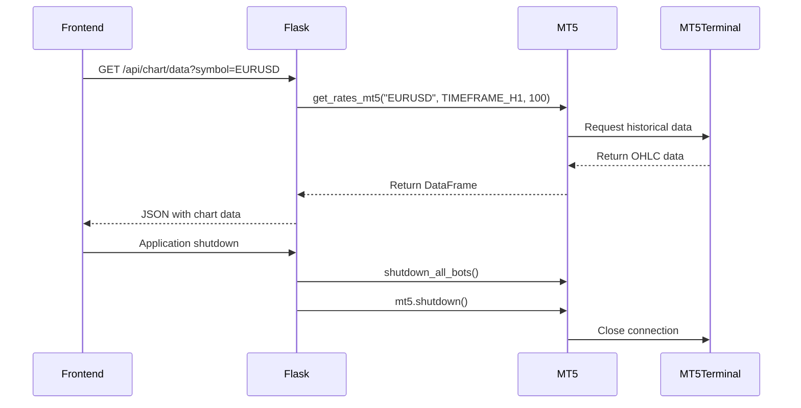
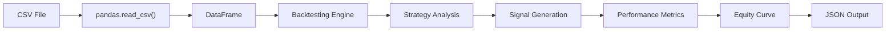
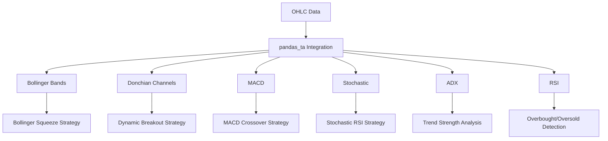
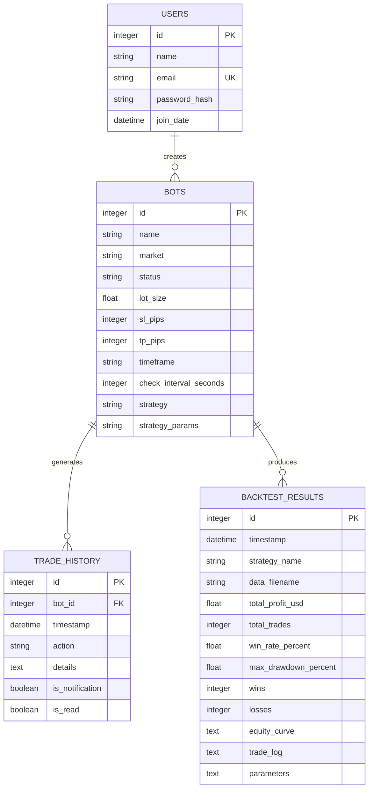
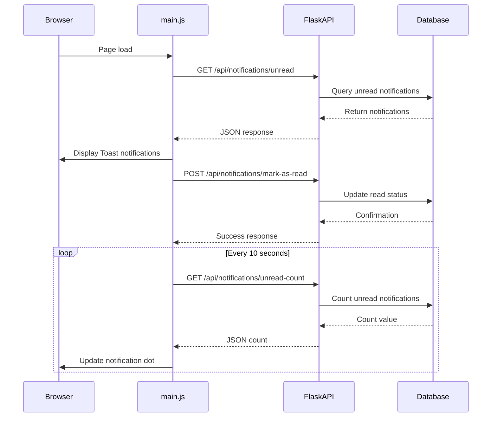
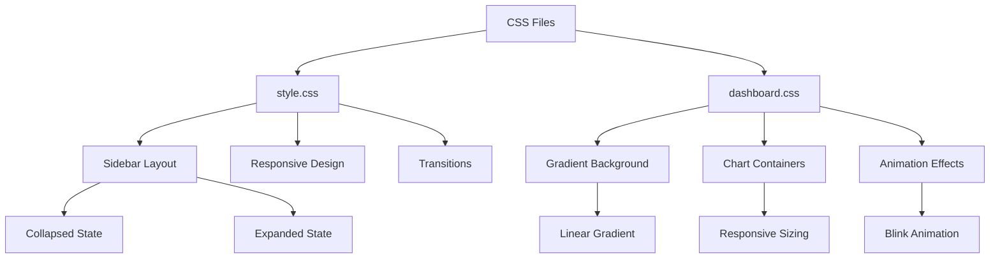
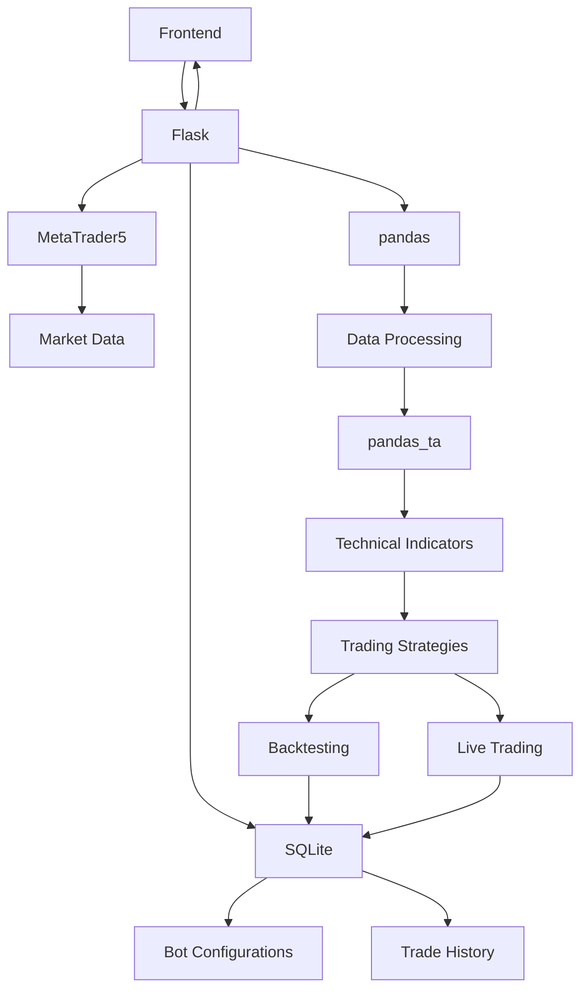

# Technology Stack

<cite>
**Referenced Files in This Document**   
- [requirements.txt](file://requirements.txt)
- [run.py](file://run.py)
- [core/__init__.py](file://core/__init__.py)
- [core/routes/api_chart.py](file://core/routes/api_chart.py)
- [core/strategies/bollinger_squeeze.py](file://core/strategies/bollinger_squeeze.py)
- [core/strategies/dynamic_breakout.py](file://core/strategies/dynamic_breakout.py)
- [core/strategies/ma_crossover.py](file://core/strategies/ma_crossover.py)
- [core/strategies/quantum_velocity.py](file://core/strategies/quantum_velocity.py)
- [core/strategies/mercy_edge.py](file://core/strategies/mercy_edge.py)
- [core/strategies/quantumbotx_hybrid.py](file://core/strategies/quantumbotx_hybrid.py)
- [core/db/models.py](file://core/db/models.py)
- [core/db/queries.py](file://core/db/queries.py)
- [init_db.py](file://init_db.py)
- [static/js/main.js](file://static/js/main.js)
- [static/css/style.css](file://static/css/style.css)
- [static/css/dashboard.css](file://static/css/dashboard.css)
</cite>

## Table of Contents
1. [Technology Stack Overview](#technology-stack-overview)
2. [Core Technology Components](#core-technology-components)
3. [Flask: Web Framework and API Server](#flask-web-framework-and-api-server)
4. [MetaTrader5: Trading Execution and Market Data](#metatrader5-trading-execution-and-market-data)
5. [pandas: Data Manipulation for Backtesting and Analysis](#pandas-data-manipulation-for-backtesting-and-analysis)
6. [pandas_ta: Technical Indicator Calculations](#pandas_ta-technical-indicator-calculations)
7. [SQLite: Persistent Storage](#sqlite-persistent-storage)
8. [JavaScript: Frontend Interactivity](#javascript-frontend-interactivity)
9. [CSS: UI Styling](#css-ui-styling)
10. [Technology Integration Patterns](#technology-integration-patterns)
11. [Performance Considerations](#performance-considerations)
12. [Dependency Management and Installation](#dependency-management-and-installation)

## Technology Stack Overview

The QuantumBotX platform integrates multiple technologies to create a comprehensive automated trading system. This document details the core components of the technology stack, including Flask for web services, MetaTrader5 for trading execution, pandas for data analysis, pandas_ta for technical indicators, SQLite for data persistence, JavaScript for frontend interactivity, and CSS for user interface styling. The integration of these technologies enables the platform to provide backtesting capabilities, real-time trading, and a responsive user interface.

**Section sources**
- [requirements.txt](file://requirements.txt)
- [run.py](file://run.py)

## Core Technology Components

The QuantumBotX platform relies on a carefully selected technology stack that combines web development frameworks, financial data processing libraries, and database systems. Each component plays a specific role in the overall architecture, from serving web pages and APIs to executing trades and storing configuration data. The following sections provide detailed analysis of each core technology and its implementation within the system.

## Flask: Web Framework and API Server

Flask serves as the web framework and API server for QuantumBotX, handling HTTP requests, serving templates, and providing RESTful endpoints for frontend communication. The application is initialized through a factory pattern in `core/__init__.py`, where the Flask app instance is created and configured with logging, error handlers, and route blueprints.

The main entry point in `run.py` creates the Flask application instance and registers a health check endpoint at `/api/health` that returns a JSON response indicating server status. Flask's blueprint system is used extensively to organize API routes into modular components, with separate blueprints for different functional areas such as dashboard, bots, chart data, profile, portfolio, history, notifications, stocks, forex, fundamentals, and backtesting.

**Diagram sources**
- [run.py](file://run.py#L1-L51)
- [core/__init__.py](file://core/__init__.py#L51-L85)

**Section sources**
- [run.py](file://run.py#L1-L51)
- [core/__init__.py](file://core/__init__.py#L1-L137)

## MetaTrader5: Trading Execution and Market Data

The MetaTrader5 Python package enables automated trading execution and provides access to market data within the QuantumBotX platform. The integration is initialized in `run.py` where connection parameters are retrieved from environment variables (MT5_LOGIN, MT5_PASSWORD, MT5_SERVER) and used to establish a connection to the MetaTrader 5 terminal.

Market data retrieval is implemented in various routes, such as the chart data endpoint in `api_chart.py` which uses `get_rates_mt5()` to fetch historical price data for a specified symbol and timeframe. The platform can retrieve tick data for current prices and historical rates for technical analysis and backtesting purposes.

The shutdown process is carefully managed through the `atexit` module, ensuring that all trading bots are properly shut down and the MetaTrader 5 connection is closed when the application terminates. This prevents orphaned processes and ensures clean session termination.

**Diagram sources**
- [run.py](file://run.py#L30-L51)
- [core/routes/api_chart.py](file://core/routes/api_chart.py#L1-L20)

**Section sources**
- [run.py](file://run.py#L30-L51)
- [core/routes/api_chart.py](file://core/routes/api_chart.py#L1-L20)

## pandas: Data Manipulation for Backtesting and Analysis

pandas is used extensively throughout the QuantumBotX platform for data manipulation, particularly in backtesting and analysis workflows. The library's DataFrame structure provides an efficient way to handle time-series financial data, with built-in support for operations like filtering, aggregation, and transformation.

In the backtesting engine (`core/backtesting/engine.py`), pandas DataFrames are used to store and process historical OHLC (Open, High, Low, Close) data. The `run_backtest()` function accepts a DataFrame containing historical market data and passes it to strategy implementations for analysis. The engine performs vectorized operations on the entire dataset to simulate trading performance efficiently.

The platform also uses pandas for processing API responses, such as in the stocks route where tick data is converted into a structured DataFrame format before being returned as JSON to the frontend. This allows for consistent data handling across different components of the system.

**Diagram sources**
- [core/backtesting/engine.py](file://core/backtesting/engine.py#L1-L34)
- [core/routes/api_backtest.py](file://core/routes/api_backtest.py#L59-L83)

**Section sources**
- [core/backtesting/engine.py](file://core/backtesting/engine.py#L1-L34)
- [core/routes/api_backtest.py](file://core/routes/api_backtest.py#L59-L83)

## pandas_ta: Technical Indicator Calculations

pandas_ta is used to calculate technical indicators for trading strategies within the QuantumBotX platform. The library extends pandas DataFrames with technical analysis methods, allowing for seamless integration of indicator calculations into the data processing pipeline.

Multiple strategies implement pandas_ta for indicator computation, including Bollinger Bands, Donchian Channels, EMA, ATR, MACD, and Stochastic indicators. The library's `ta` accessor is used to call indicator functions directly on DataFrames, with results appended as new columns.

For example, in the Bollinger Squeeze strategy (`core/strategies/bollinger_squeeze.py`), the `ta.bbands()` method calculates Bollinger Bands and appends the results to the DataFrame. Similarly, the Dynamic Breakout strategy uses `ta.donchian()` for Donchian Channel calculation and `ta.atr()` for Average True Range.

**Diagram sources**
- [core/strategies/bollinger_squeeze.py](file://core/strategies/bollinger_squeeze.py#L60-L87)
- [core/strategies/dynamic_breakout.py](file://core/strategies/dynamic_breakout.py#L23-L51)

**Section sources**
- [core/strategies/bollinger_squeeze.py](file://core/strategies/bollinger_squeeze.py#L60-L87)
- [core/strategies/dynamic_breakout.py](file://core/strategies/dynamic_breakout.py#L23-L51)

## SQLite: Persistent Storage

SQLite provides persistent storage for bot configurations, trade history, and backtest results in the QuantumBotX platform. The database schema is defined in `init_db.py`, which creates four tables: users, bots, trade_history, and backtest_results.

The `bots` table stores configuration parameters for each trading bot, including name, market, lot size, stop loss and take profit values in pips, timeframe, check interval, strategy type, and strategy parameters (stored as JSON). The `trade_history` table records all actions taken by bots, with foreign key relationships to the bots table and cascade deletion.

Database operations are abstracted through functions in `core/db/queries.py`, which provide a clean interface for CRUD operations. These functions handle connection management, SQL execution, and error logging, ensuring consistent database access patterns throughout the application.

**Diagram sources**
- [init_db.py](file://init_db.py#L49-L114)
- [core/db/queries.py](file://core/db/queries.py#L0-L41)

**Section sources**
- [init_db.py](file://init_db.py#L49-L114)
- [core/db/queries.py](file://core/db/queries.py#L0-L41)

## JavaScript: Frontend Interactivity

JavaScript provides frontend interactivity for the QuantumBotX platform, enhancing the user experience with dynamic features and real-time updates. The core functionality is implemented in `static/js/main.js`, which handles sidebar toggling, notification management, and real-time updates.

The sidebar toggle feature allows users to collapse or expand the navigation sidebar, improving screen space utilization. Notification functionality uses the Toastify library to display real-time alerts when new events occur, such as trade executions or system messages. The system periodically checks for unread notifications and displays them as toast messages that can be clicked to navigate to the notifications page.

Additional JavaScript files handle specific page functionality, including backtesting, bot management, portfolio tracking, and market data visualization. These scripts interact with the Flask backend through API endpoints to retrieve data and send user commands.

**Diagram sources**
- [static/js/main.js](file://static/js/main.js#L1-L95)

**Section sources**
- [static/js/main.js](file://static/js/main.js#L1-L95)

## CSS: UI Styling

CSS is used to style the QuantumBotX user interface, providing a consistent and professional appearance across all pages. The styling is implemented in two main files: `style.css` for general layout and `dashboard.css` for dashboard-specific styles.

The `style.css` file contains styles for the responsive sidebar, including transitions for collapsing and expanding the navigation menu. When collapsed, text elements are hidden and navigation items are centered, optimizing screen space for smaller displays.

The `dashboard.css` file defines visual elements such as the gradient background, chart containers, and animation effects. The gradient background creates a modern, professional appearance, while the chart container ensures proper sizing and positioning of financial charts. A blink animation is defined for highlighting important elements.

**Diagram sources**
- [static/css/style.css](file://static/css/style.css#L1-L4)
- [static/css/dashboard.css](file://static/css/dashboard.css#L1-L20)

**Section sources**
- [static/css/style.css](file://static/css/style.css#L1-L4)
- [static/css/dashboard.css](file://static/css/dashboard.css#L1-L20)

## Technology Integration Patterns

The QuantumBotX platform demonstrates several key integration patterns that connect the various technologies into a cohesive system. Flask serves as the central hub, coordinating between frontend interfaces, data storage, and trading execution systems.

One prominent pattern is the use of Flask blueprints to organize API routes by functionality, improving code maintainability and scalability. Each blueprint handles a specific domain, such as bot management, market data, or backtesting, with clear separation of concerns.

Another integration pattern involves the processing pipeline for trading strategies, where pandas DataFrames flow from data acquisition (via MetaTrader5) through technical analysis (using pandas_ta) to signal generation and backtesting. This pipeline enables efficient vectorized operations on historical data.

The platform also implements a notification system that integrates frontend JavaScript with backend database operations, providing real-time updates to users about trading activities and system events.

**Diagram sources**
- [run.py](file://run.py#L1-L51)
- [core/__init__.py](file://core/__init__.py#L51-L85)
- [core/strategies/bollinger_squeeze.py](file://core/strategies/bollinger_squeeze.py#L60-L87)

**Section sources**
- [run.py](file://run.py#L1-L51)
- [core/__init__.py](file://core/__init__.py#L51-L85)

## Performance Considerations

The QuantumBotX platform addresses several performance considerations to ensure efficient operation, particularly when handling large datasets and real-time trading operations. When loading historical market data for backtesting, memory usage can become a concern, especially with high-frequency data spanning extended periods.

The backtesting engine uses vectorized operations with pandas DataFrames to maximize computational efficiency, avoiding slow iterative processing. However, loading very large datasets into memory can still impact performance, so the system should implement data chunking or streaming for extremely large backtests.

The notification system is designed with performance in mind, using a filter to ignore frequent polling requests in the application logs. This reduces log file size and improves logging performance. The system also batches notification updates, checking for new notifications every 10 seconds rather than continuously polling.

For production deployment, the use of `use_reloader=False` in the Flask configuration prevents the development reloader from running in production, avoiding potential issues with multiple application instances.

## Dependency Management and Installation

The QuantumBotX platform uses a well-defined dependency management system with all Python packages listed in `requirements.txt`. This file specifies exact versions for all dependencies, ensuring consistent environments across development, testing, and production.

Key dependencies include:
- Flask 3.1.1: Web framework and API server
- MetaTrader5 5.0.5120: Trading execution and market data
- pandas 2.3.1: Data manipulation for backtesting and analysis
- pandas_ta 0.3.14b0: Technical indicator calculations
- numpy 1.23.5: Numerical computing
- python-dotenv 1.1.1: Environment variable management

Installation follows standard Python practices using virtual environments to isolate dependencies. The recommended installation process is:
1. Create a virtual environment: `python -m venv venv`
2. Activate the virtual environment: `source venv/bin/activate` (Linux/Mac) or `venv\Scripts\activate` (Windows)
3. Install dependencies: `pip install -r requirements.txt`
4. Initialize the database: `python init_db.py`
5. Run the application: `python run.py`

The platform should be run within a virtual environment to prevent conflicts with system-wide Python packages and ensure reproducible deployments.