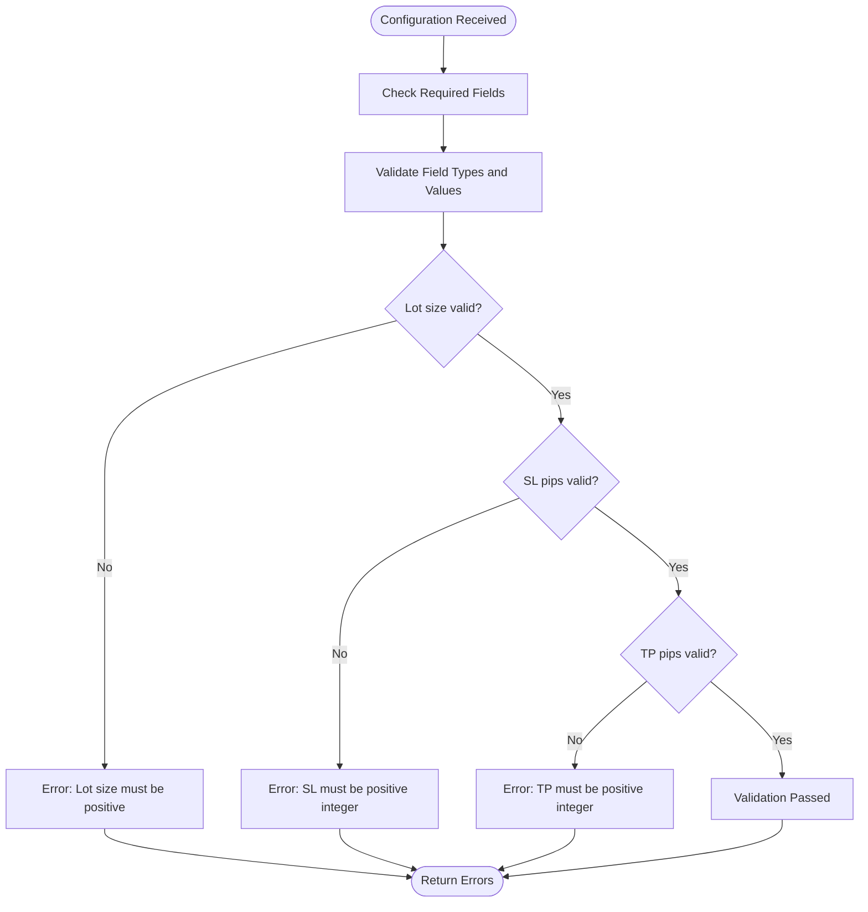
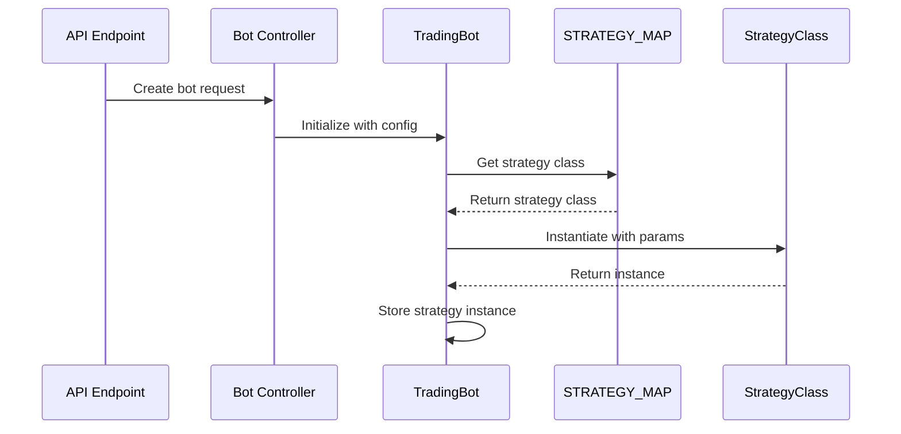

# Bot Configuration

<cite>
**Referenced Files in This Document**   
- [trading_bot.py](file://core/bots/trading_bot.py#L0-L169)
- [strategy_map.py](file://core/strategies/strategy_map.py#L0-L27)
- [validation.py](file://core/utils/validation.py#L0-L20)
- [api_bots.py](file://core/routes/api_bots.py#L0-L167)
- [controller.py](file://core/bots/controller.py#L0-L176)
- [queries.py](file://core/db/queries.py#L0-L174)
- [bollinger_squeeze.py](file://core/strategies/bollinger_squeeze.py#L0-L88)
</cite>

## Table of Contents
1. [Configurable Parameters](#configurable-parameters)
2. [Configuration Validation](#configuration-validation)
3. [Strategy Mapping System](#strategy-mapping-system)
4. [API Configuration Example](#api-configuration-example)
5. [Configuration Persistence](#configuration-persistence)
6. [Runtime Configuration Updates](#runtime-configuration-updates)
7. [Security and Input Sanitization](#security-and-input-sanitization)

## Configurable Parameters

The trading bot system supports a comprehensive set of configurable parameters that define its behavior, risk management, and trading strategy. These parameters are passed during bot initialization and can be modified during runtime.

### Core Configuration Parameters

The following parameters are essential for bot operation:

**symbol**: The financial instrument to trade (referred to as `market` in the code). This parameter specifies the asset pair such as EURUSD or GBPJPY that the bot will analyze and trade.

**timeframe**: The chart interval for analysis, such as M15, H1, or D1. This determines the granularity of the price data used for generating trading signals.

**lot_size**: The position size for trades. In the system, this is stored as `lot_size` in the database but is configured using `risk_percent` through the API, which is then mapped appropriately.

**risk_percentage**: The percentage of account equity to risk per trade. This parameter is passed as `risk_percent` in the API and converted to `lot_size` for internal use.

**strategy_type**: The identifier for the trading strategy to be employed. This string is mapped to the corresponding strategy class via the strategy map system.

### Strategy-Specific Parameters

Each trading strategy can define its own set of configurable parameters through the `get_definable_params()` class method. For example, the Bollinger Squeeze strategy supports the following parameters:

- `bb_length`: Length of the Bollinger Bands period (default: 20)
- `bb_std`: Standard deviation multiplier for Bollinger Bands (default: 2.0)
- `squeeze_window`: Window period for calculating average bandwidth (default: 10)
- `squeeze_factor`: Multiplier for determining squeeze threshold (default: 0.7)
- `rsi_period`: Period for RSI indicator calculation (default: 14)

These parameters are passed as a dictionary within the `params` field of the configuration and are accessible to the strategy instance through `self.params`.

**Section sources**
- [trading_bot.py](file://core/bots/trading_bot.py#L0-L169)
- [bollinger_squeeze.py](file://core/strategies/bollinger_squeeze.py#L0-L88)

## Configuration Validation

The system implements robust validation of configuration parameters during bot creation to ensure data integrity and prevent runtime errors.

### Validation Process

Configuration validation is performed using the `validate_bot_params()` function in `core/utils/validation.py`. This function checks for required fields and validates data types and value ranges.



**Diagram sources**
- [validation.py](file://core/utils/validation.py#L0-L20)

The validation function checks for the presence of required fields including `name`, `market`, `lot_size`, `sl_pips`, `tp_pips`, `timeframe`, `check_interval_seconds`, and `strategy`. It also validates that:
- `lot_size` is a positive number
- `sl_pips` is a positive integer
- `tp_pips` is a positive integer

If any validation fails, the function returns a list of error messages which are then returned to the client via the API.

**Section sources**
- [validation.py](file://core/utils/validation.py#L0-L20)

## Strategy Mapping System

The strategy mapping system enables dynamic instantiation of trading strategies based on string identifiers, providing flexibility in strategy selection and configuration.

### Strategy Map Implementation

The `STRATEGY_MAP` dictionary in `core/strategies/strategy_map.py` serves as a registry that maps string keys to strategy classes. This allows the system to instantiate the appropriate strategy class based on the configuration provided.

```python
STRATEGY_MAP = {
    'MA_CROSSOVER': MACrossoverStrategy,
    'QUANTUMBOTX_HYBRID': QuantumBotXHybridStrategy,
    'RSI_CROSSOVER': RSICrossoverStrategy,
    'BOLLINGER_REVERSION': BollingerBandsStrategy,
    'BOLLINGER_SQUEEZE': BollingerSqueezeStrategy,
    # ... additional mappings
}
```

### Strategy Instantiation Process

When a bot is created, the system uses the strategy map to instantiate the appropriate strategy class:

1. Retrieve the strategy class from `STRATEGY_MAP` using the `strategy` identifier
2. If the strategy is not found, raise a `ValueError`
3. Instantiate the strategy class with the bot instance and parameters
4. Store the strategy instance for use in the trading loop

This approach enables the system to support multiple strategies without requiring changes to the core bot logic, promoting extensibility and maintainability.



**Diagram sources**
- [strategy_map.py](file://core/strategies/strategy_map.py#L0-L27)
- [trading_bot.py](file://core/bots/trading_bot.py#L0-L169)

**Section sources**
- [strategy_map.py](file://core/strategies/strategy_map.py#L0-L27)
- [trading_bot.py](file://core/bots/trading_bot.py#L0-L169)

## API Configuration Example

The following example demonstrates a JSON configuration payload used to instantiate a Bollinger Squeeze trading bot through the API:

```json
{
  "name": "EURUSD Bollinger Squeeze Bot",
  "market": "EURUSD",
  "risk_percent": 1.5,
  "sl_atr_multiplier": 15,
  "tp_atr_multiplier": 30,
  "timeframe": "H1",
  "check_interval_seconds": 300,
  "strategy": "BOLLINGER_SQUEEZE",
  "params": {
    "bb_length": 20,
    "bb_std": 2.0,
    "squeeze_window": 10,
    "squeeze_factor": 0.7,
    "rsi_period": 14
  }
}
```

### Parameter Mapping

The API endpoint in `api_bots.py` processes this configuration by:

1. Extracting the base parameters
2. Converting `risk_percent` to `lot_size` for database storage
3. Converting `sl_atr_multiplier` and `tp_atr_multiplier` to `sl_pips` and `tp_pips`
4. Serializing the `params` dictionary to JSON for storage
5. Storing the configuration in the database

The POST request to `/api/bots` creates a new bot record in the database with the provided configuration, which is then used to instantiate the bot when started.

**Section sources**
- [api_bots.py](file://core/routes/api_bots.py#L0-L167)
- [controller.py](file://core/bots/controller.py#L0-L176)

## Configuration Persistence

The system implements a robust configuration persistence mechanism using a SQLite database to ensure settings are preserved across application restarts.

### Database Schema

Bot configurations are stored in the `bots` table with the following schema:
- `id`: Unique identifier for the bot
- `name`: Bot name
- `market`: Trading symbol
- `lot_size`: Position size
- `sl_pips`: Stop loss in pips
- `tp_pips`: Take profit in pips
- `timeframe`: Analysis timeframe
- `check_interval_seconds`: Frequency of analysis
- `strategy`: Strategy identifier
- `strategy_params`: JSON string of strategy-specific parameters
- `status`: Current status (Aktif/Dijeda)

### Persistence Workflow

```mermaid
flowchart TD
A[API Request] --> B[Controller]
B --> C[Database Queries]
C --> D[(bots.db)]
D --> C
C --> E[Bot Instance]
E --> F[Trading Loop]
subgraph "Persistence Flow"
A --> |POST /api/bots| B
B --> |add_bot()| C
C --> |INSERT| D
D --> |SELECT| C
C --> |bot data| B
B --> |create TradingBot| E
end
subgraph "Retrieval Flow"
G[Application Start] --> H[ambil_semua_bot()]
H --> |get_all_bots()| C
C --> |SELECT * FROM bots| D
D --> |bot records| C
C --> |process each bot| B
B --> |if status=Aktif| I[mulai_bot()]
I --> |create and start| E
end
```

**Diagram sources**
- [queries.py](file://core/db/queries.py#L0-L174)
- [controller.py](file://core/bots/controller.py#L0-L176)

When the application starts, the `ambil_semua_bot()` function retrieves all bot configurations from the database and automatically restarts any bots that were active when the application was last running.

**Section sources**
- [queries.py](file://core/db/queries.py#L0-L174)
- [controller.py](file://core/bots/controller.py#L0-L176)

## Runtime Configuration Updates

Users can modify bot settings during runtime through the API, with the system handling the update process seamlessly.

### Update Process

When a PUT request is sent to `/api/bots/{bot_id}`, the following process occurs:

1. The system checks if the bot is currently running
2. If running, the bot is temporarily stopped
3. The configuration is updated in the database
4. If the bot was previously running, it is restarted with the new configuration

This ensures that configuration changes are applied safely without leaving the bot in an inconsistent state.

```python
def perbarui_bot(bot_id: int, data: dict):
    """Update bot configuration."""
    bot_instance = active_bots.get(bot_id)
    if bot_instance and bot_instance.is_alive():
        logger.info(f"Stopping bot {bot_id} temporarily for update.")
        hentikan_bot(bot_id)
    
    # Process parameter mapping
    if 'check_interval_seconds' in data:
        data['interval'] = data.pop('check_interval_seconds')
    if 'sl_atr_multiplier' in data:
        data['sl_pips'] = data.pop('sl_atr_multiplier')
    if 'tp_atr_multiplier' in data:
        data['tp_pips'] = data.pop('tp_atr_multiplier')
    if 'risk_percent' in data:
        data['lot_size'] = data.pop('risk_percent')
    
    # Serialize custom parameters
    custom_params = data.pop('params', {})
    data['strategy_params'] = json.dumps(custom_params)
    
    # Update database
    success = queries.update_bot(bot_id=bot_id, **update_data)
    return success, "Bot successfully updated."
```

**Section sources**
- [controller.py](file://core/bots/controller.py#L0-L176)
- [api_bots.py](file://core/routes/api_bots.py#L0-L167)

## Security and Input Sanitization

The system implements several security measures to protect against malicious input and ensure configuration safety.

### Input Sanitization

The system performs comprehensive input validation and sanitization:

- **Type checking**: Ensures parameters are of the correct data type
- **Range validation**: Verifies values are within acceptable ranges
- **Parameter filtering**: Only allows expected parameters to be processed
- **JSON serialization**: Safely handles complex parameter objects

The validation process in `validation.py` prevents common issues such as negative lot sizes or invalid timeframes from being processed.

### Default Value Safety

All strategy parameters implement safe default values to prevent undefined behavior:

```python
def analyze(self, df):
    bb_length = self.params.get('bb_length', 20)
    bb_std = self.params.get('bb_std', 2.0)
    squeeze_window = self.params.get('squeeze_window', 10)
    squeeze_factor = self.params.get('squeeze_factor', 0.7)
    rsi_period = self.params.get('rsi_period', 14)
    # ... analysis logic
```

This pattern ensures that even if a parameter is missing from the configuration, the strategy will use a safe default value rather than failing.

### Database Security

The system uses parameterized queries to prevent SQL injection attacks:

```python
def update_bot(bot_id, name, market, lot_size, sl_pips, tp_pips, 
               timeframe, interval, strategy, strategy_params='{}'):
    """Update bot data in database."""
    try:
        with get_db_connection() as conn:
            conn.execute('''
                UPDATE bots SET 
                name = ?, market = ?, lot_size = ?, sl_pips = ?, tp_pips = ?, 
                timeframe = ?, check_interval_seconds = ?, strategy = ?, strategy_params = ?
                WHERE id = ?
            ''', (name, market, lot_size, sl_pips, tp_pips, timeframe, 
                  interval, strategy, strategy_params, bot_id))
            conn.commit()
            return True
    except sqlite3.Error as e:
        logger.error(f"Failed to update bot {bot_id} in DB: {e}")
        return False
```

The use of parameterized queries with the `?` placeholder ensures that user input is properly escaped and cannot be used to execute arbitrary SQL commands.

**Section sources**
- [validation.py](file://core/utils/validation.py#L0-L20)
- [bollinger_squeeze.py](file://core/strategies/bollinger_squeeze.py#L0-L88)
- [queries.py](file://core/db/queries.py#L0-L174)