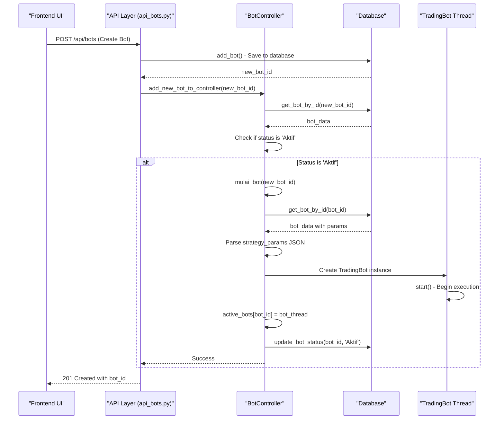
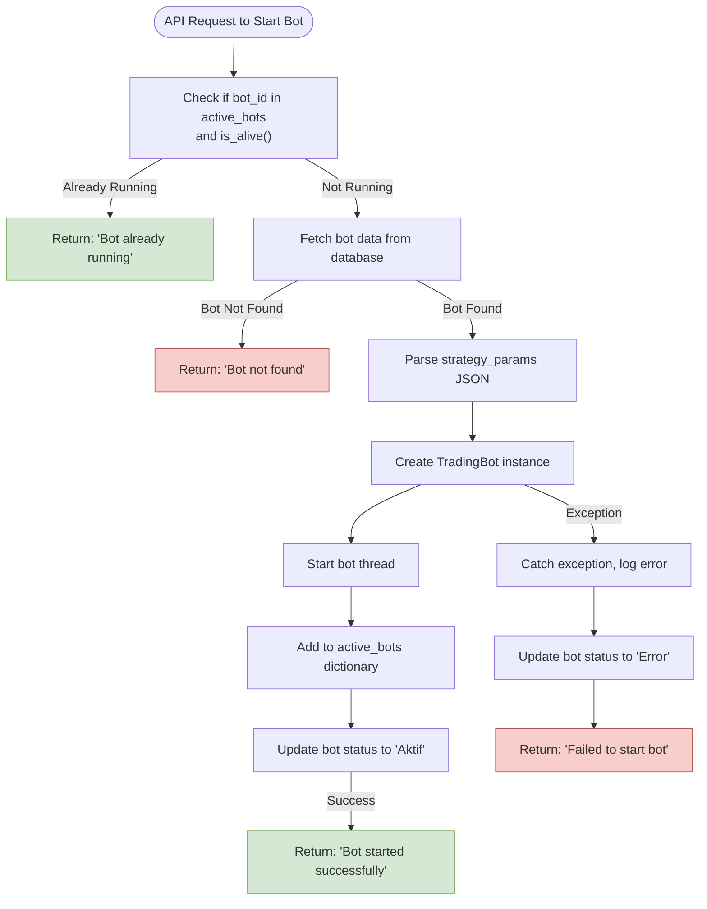

# Bot Controller

<cite>
**Referenced Files in This Document**   
- [controller.py](file://core/bots/controller.py)
- [api_bots.py](file://core/routes/api_bots.py)
- [trading_bot.py](file://core/bots/trading_bot.py)
- [queries.py](file://core/db/queries.py)
</cite>

## Table of Contents
1. [Bot Controller Overview](#bot-controller-overview)
2. [Singleton Pattern and Bot Management](#singleton-pattern-and-bot-management)
3. [Thread-Safe Operations](#thread-safe-operations)
4. [API Integration and Request Flow](#api-integration-and-request-flow)
5. [Error Handling and Failure Scenarios](#error-handling-and-failure-scenarios)
6. [Global Operations](#global-operations)
7. [Scalability Considerations](#scalability-considerations)

## Bot Controller Overview

The BotController component in the quantumbotx system serves as the central coordination point for managing all trading bot instances. It acts as an intermediary between the API layer and individual bot threads, providing a unified interface for bot lifecycle management. The controller is implemented in `core/bots/controller.py` and is responsible for creating, retrieving, starting, stopping, updating, and destroying bot instances.

The controller maintains a global dictionary called `active_bots` that maps bot IDs to their corresponding `TradingBot` thread instances. This dictionary serves as the primary data structure for tracking all running bots within the application. The controller ensures that bot operations are performed in a consistent and controlled manner, handling both the in-memory state of bot threads and their persistent state in the database.

**Section sources**
- [controller.py](file://core/bots/controller.py#L1-L10)

## Singleton Pattern and Bot Management

The BotController implements a singleton-like pattern through the use of a module-level `active_bots` dictionary that persists for the lifetime of the application. This pattern ensures that there is a single, shared state for all bot instances across the entire application, preventing conflicts and ensuring consistency.

The `active_bots` dictionary is defined at the module level with the comment indicating its purpose: "Dictionary untuk menyimpan instance thread bot yang aktif" (Dictionary to store active bot thread instances). The dictionary uses bot IDs as keys and `TradingBot` instances as values, creating a direct mapping between a bot's identifier and its running thread.

```mermaid
classDiagram
class BotController {
+dict active_bots
+start_bot(bot_id)
+stop_bot(bot_id)
+get_bot_instance(bot_id)
+update_bot(bot_id, data)
+delete_bot(bot_id)
+start_all_bots()
+stop_all_bots()
}
class TradingBot {
+int id
+str name
+str market
+float risk_percent
+int sl_pips
+int tp_pips
+str timeframe
+int check_interval
+str strategy
+dict strategy_params
+start()
+stop()
+is_alive()
}
BotController --> TradingBot : "manages"
BotController --> "active_bots" : "uses dictionary"
```

**Diagram sources**
- [controller.py](file://core/bots/controller.py#L1-L10)
- [trading_bot.py](file://core/bots/trading_bot.py)

**Section sources**
- [controller.py](file://core/bots/controller.py#L1-L10)

## Thread-Safe Operations

The BotController implements several thread-safe operations to ensure the integrity of the `active_bots` dictionary when accessed by multiple threads. The most critical aspect of thread safety is demonstrated in the `hentikan_bot` (stop_bot) function, which uses the dictionary's `pop` method to atomically retrieve and remove a bot instance.

The comment in the code explicitly states: "PERBAIKAN: Gunakan .pop() untuk mengambil dan menghapus bot secara atomik. Ini mencegah race condition di mana dua proses mencoba menghentikan bot yang sama." (FIX: Use .pop() to atomically retrieve and remove the bot. This prevents race conditions where two processes try to stop the same bot.)

This atomic operation is crucial because it prevents a race condition where two separate API requests might simultaneously attempt to stop the same bot. Without the atomic pop operation, one request could check if the bot exists, then another request could also check and find it exists, leading to both attempts to stop the same thread, which could cause unpredictable behavior.

The controller also checks if a bot is already running before starting it with the condition `if bot_id in active_bots and active_bots[bot_id].is_alive():`, which prevents duplicate bot instances from being created for the same bot ID.

**Section sources**
- [controller.py](file://core/bots/controller.py#L62-L66)

## API Integration and Request Flow

The BotController is tightly integrated with the API layer through the `api_bots.py` routes file, which exposes REST endpoints for bot management operations. The API layer serves as the entry point for all bot-related requests, forwarding them to the appropriate controller methods.

The sequence diagram below illustrates the flow from an API request to bot creation via the controller:



**Diagram sources**
- [api_bots.py](file://core/routes/api_bots.py#L85-L90)
- [controller.py](file://core/bots/controller.py#L32-L66)

**Section sources**
- [api_bots.py](file://core/routes/api_bots.py#L85-L90)
- [controller.py](file://core/bots/controller.py#L32-L66)

## Error Handling and Failure Scenarios

The BotController implements comprehensive error handling for various failure scenarios, particularly during bot creation and initialization. When a bot fails to start, the controller captures the exception, logs the error with full traceback using `exc_info=True`, updates the bot's status to 'Error' in the database, and returns a descriptive error message.

For duplicate bot ID requests, the controller checks if the bot ID already exists in the `active_bots` dictionary and if the corresponding thread is still alive. If both conditions are true, it returns a message indicating that the bot is already running, preventing the creation of duplicate instances.

The controller also handles database-related errors gracefully. For example, in the `perbarui_bot` (update_bot) function, it uses a try-except block to catch any exceptions that occur during the database update operation. It also implements a data filtering mechanism to prevent TypeError by only passing expected arguments to the database update function.



**Diagram sources**
- [controller.py](file://core/bots/controller.py#L32-L66)
- [controller.py](file://core/bots/controller.py#L109-L135)

**Section sources**
- [controller.py](file://core/bots/controller.py#L32-L66)
- [controller.py](file://core/bots/controller.py#L109-L135)

## Global Operations

The BotController enables global operations that affect multiple bot instances simultaneously. The two primary global operations are `mulai_semua_bot` (start_all_bots) and `hentikan_semua_bot` (stop_all_bots), which allow users to start or stop all bots with a single API call.

The `start_all_bots` function retrieves all bots from the database and filters for those with a status of 'Dijeda' (Paused). It then iterates through these bots, attempting to start each one and counting the number of successful starts. This function is particularly useful when restarting the application or when a user wants to activate multiple bots simultaneously.

The `stop_all_bots` function is even more critical for system stability. It retrieves the list of currently running bot IDs from the `active_bots` dictionary and calls `hentikan_bot` for each one. This ensures that all bot threads are properly stopped before the application shuts down, preventing orphaned processes and ensuring clean termination.

These global operations are exposed through API endpoints `/api/bots/start_all` and `/api/bots/stop_all`, which are triggered by corresponding buttons in the frontend UI, as evidenced by the JavaScript code in `trading_bots.js`.

**Section sources**
- [controller.py](file://core/bots/controller.py#L68-L100)
- [api_bots.py](file://core/routes/api_bots.py#L125-L134)

## Scalability Considerations

The current BotController implementation has several scalability considerations when managing hundreds of concurrent bot instances. The primary concern is the use of a single dictionary (`active_bots`) to manage all bot instances, which could become a performance bottleneck as the number of bots increases.

The controller's current approach of iterating through bots sequentially for global operations like `start_all_bots` could lead to significant delays when managing a large number of bots. For example, if each bot takes 1 second to start, starting 500 bots would take approximately 8 minutes, which is impractical for production use.

Potential improvements to enhance scalability include:

1. **Async Processing**: Implement asynchronous processing for bot operations using asyncio or a task queue like Celery. This would allow the controller to handle multiple bot operations concurrently rather than sequentially.

2. **Sharding**: Implement sharding by dividing bots into multiple groups or "shards" based on criteria such as market, strategy, or user. Each shard could have its own controller instance, distributing the load and reducing contention on the shared `active_bots` dictionary.

3. **Connection Pooling**: For database operations, implement connection pooling to reduce the overhead of establishing database connections for each bot operation.

4. **Caching**: Implement caching for frequently accessed bot data to reduce database queries, especially for read operations like retrieving bot status or configuration.

5. **Batch Operations**: Modify the database schema and queries to support batch operations, allowing multiple bots to be updated or queried in a single database transaction.

The current implementation also lacks explicit resource monitoring, which could lead to system overload when running a large number of bots. Future enhancements could include monitoring CPU, memory, and network usage to dynamically adjust the number of running bots based on available system resources.

**Section sources**
- [controller.py](file://core/bots/controller.py#L68-L100)
- [controller.py](file://core/bots/controller.py#L32-L66)