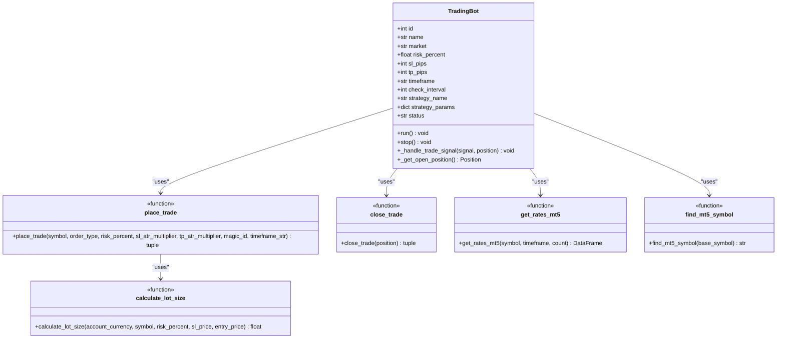

# MT5 Integration for Bots

<cite>
**Referenced Files in This Document**   
- [trading_bot.py](file://core/bots/trading_bot.py)
- [trade.py](file://core/mt5/trade.py)
- [mt5.py](file://core/utils/mt5.py)
- [strategy_map.py](file://core/strategies/strategy_map.py)
- [base_strategy.py](file://core/strategies/base_strategy.py)
</cite>

## Table of Contents
1. [Overview of MT5 Integration](#overview-of-mt5-integration)
2. [Core Components and Architecture](#core-components-and-architecture)
3. [Market Data Retrieval with copy_rates](#market-data-retrieval-with-copy_rates)
4. [Trade Execution via order_send](#trade-execution-via-order_send)
5. [Error Handling Strategy](#error-handling-strategy)
6. [Utility Functions for Price Normalization and Position Sizing](#utility-functions-for-price-normalization-and-position-sizing)
7. [Code Example: Converting Buy Signal to MT5 Order](#code-example-converting-buy-signal-to-mt5-order)
8. [Retry Mechanism and Partial Fill Handling](#retry-mechanism-and-partial-fill-handling)
9. [Timing Considerations and Rate Limit Avoidance](#timing-considerations-and-rate-limit-avoidance)

## Overview of MT5 Integration

The QuantumBotX system integrates with MetaTrader 5 (MT5) to enable automated trading through a modular architecture. The integration supports market data retrieval, trade execution, risk management, and error resilience. This document details how the `TradingBot` class interacts with the MT5 API, handles errors, calculates position sizes, and maintains synchronization with the trading platform.

**Section sources**
- [trading_bot.py](file://core/bots/trading_bot.py#L1-L170)
- [trade.py](file://core/mt5/trade.py#L1-L153)

## Core Components and Architecture

The MT5 integration is structured around three main components:
- **TradingBot**: Manages the lifecycle of a trading instance, including signal generation and trade handling.
- **MT5 Trade Module**: Handles order placement, closure, and dynamic lot sizing.
- **MT5 Utility Module**: Provides helper functions for data retrieval, symbol resolution, and account information.

These components work together in a thread-safe manner, with the `TradingBot` running as a separate thread to avoid blocking the main application.



**Diagram sources**
- [trading_bot.py](file://core/bots/trading_bot.py#L1-L170)
- [trade.py](file://core/mt5/trade.py#L1-L153)
- [mt5.py](file://core/utils/mt5.py#L1-L145)

**Section sources**
- [trading_bot.py](file://core/bots/trading_bot.py#L1-L170)
- [trade.py](file://core/mt5/trade.py#L1-L153)
- [mt5.py](file://core/utils/mt5.py#L1-L145)

## Market Data Retrieval with copy_rates

The `TradingBot` retrieves market data using the `get_rates_mt5` utility function, which wraps MT5's `copy_rates_from_pos` method. This function fetches historical price data for a given symbol, timeframe, and number of bars.

Key features:
- Converts raw MT5 rate data into a pandas DataFrame.
- Sets the timestamp as the index for time-series analysis.
- Includes error handling for failed data retrieval.

The bot uses this data to feed into its trading strategy for signal generation.

```python
# Example usage in TradingBot.run()
df = get_rates_mt5(self.market_for_mt5, tf_const, 250)
```

**Section sources**
- [mt5.py](file://core/utils/mt5.py#L37-L65)
- [trading_bot.py](file://core/bots/trading_bot.py#L78-L83)

## Trade Execution via order_send

Trade execution is handled by the `place_trade` function in `core/mt5/trade.py`. This function:
1. Calculates ATR-based stop-loss and take-profit levels.
2. Dynamically computes lot size based on account risk.
3. Sends a market order using MT5's `order_send` API.

The order request uses `ORDER_FILLING_FOK` (Fill or Kill), meaning the entire order must be filled immediately or rejected.

```python
request = {
    "action": mt5.TRADE_ACTION_DEAL,
    "symbol": symbol,
    "volume": lot_size,
    "type": order_type,
    "price": price,
    "sl": sl_level,
    "tp": tp_level,
    "magic": magic_id,
    "comment": "QuantumBotX Trade",
    "type_time": mt5.ORDER_TIME_GTC,
    "type_filling": mt5.ORDER_FILLING_FOK,
}
```

**Section sources**
- [trade.py](file://core/mt5/trade.py#L97-L128)

## Error Handling Strategy

The system implements a robust error handling strategy for common MT5 errors:

### Common Errors and Handling
- **No Connection**: Checked via `mt5.symbol_info()` and `mt5.account_info()`. If connection fails, the bot logs a warning and retries after `check_interval`.
- **Trade Context Busy**: Not explicitly retried, but the bot continues its loop and attempts the trade again in the next cycle.
- **Invalid Symbol**: Handled by `find_mt5_symbol`, which searches for valid symbol variations in the Market Watch.
- **Order Rejection**: Logged with the retcode and comment from MT5.

The `place_trade` function returns a tuple `(result, comment)` where `result` is `None` on failure, allowing the caller to handle the error appropriately.

```python
if result.retcode != mt5.TRADE_RETCODE_DONE:
    logger.error(f"Order GAGAL, retcode={result.retcode}, comment: {result.comment}")
    return None, result.comment
```

**Section sources**
- [mt5.py](file://core/utils/mt5.py#L100-L129)
- [trade.py](file://core/mt5/trade.py#L119-L128)
- [trading_bot.py](file://core/bots/trading_bot.py#L70-L75)

## Utility Functions for Price Normalization and Position Sizing

### Symbol Resolution
The `find_mt5_symbol` function normalizes symbol names by:
- Removing non-alphanumeric characters.
- Searching for exact or pattern-matched symbols in the visible Market Watch.
- Ensuring the symbol is selectable in MT5.

This prevents errors due to broker-specific symbol naming (e.g., XAUUSD vs XAUUSD.pro).

### Dynamic Position Sizing
The `calculate_lot_size` function computes lot size based on:
- Account balance and risk percentage.
- Stop-loss distance in price.
- Loss per lot calculated via `order_calc_profit`.

It also respects broker constraints like `volume_min`, `volume_max`, and `volume_step`.

```python
loss_for_one_lot = abs(mt5.order_calc_profit(...))
lot_size = amount_to_risk / loss_for_one_lot
```

**Section sources**
- [mt5.py](file://core/utils/mt5.py#L100-L129)
- [trade.py](file://core/mt5/trade.py#L1-L37)

## Code Example: Converting Buy Signal to MT5 Order

This example shows how a buy signal is converted into an MT5 order with proper SL/TP:

```python
def _handle_trade_signal(self, signal, position):
    if signal == 'BUY':
        if position and position.type == mt5.ORDER_TYPE_SELL:
            close_trade(position)
            position = None

        if not position:
            place_trade(
                symbol=self.market_for_mt5,
                order_type=mt5.ORDER_TYPE_BUY,
                risk_percent=self.risk_percent,
                sl_atr_multiplier=self.sl_pips,
                tp_atr_multiplier=self.tp_pips,
                magic_id=self.id,
                timeframe_str=self.timeframe
            )
```

The `place_trade` function then:
1. Fetches ATR(14) over 30 bars.
2. Sets SL at `price - ATR * sl_pips`.
3. Sets TP at `price + ATR * tp_pips`.
4. Calculates lot size dynamically.
5. Sends the order.

**Section sources**
- [trading_bot.py](file://core/bots/trading_bot.py#L147-L168)
- [trade.py](file://core/mt5/trade.py#L45-L128)

## Retry Mechanism and Partial Fill Handling

### Retry Mechanism
The system does not implement an explicit retry loop for failed orders. Instead:
- Failed orders are logged and reported.
- The bot continues its main loop and will attempt the trade again during the next cycle (after `check_interval` seconds).
- This passive retry avoids overwhelming the MT5 terminal with rapid-fire requests.

### Partial Fill Handling
The system currently does **not** handle partial fills. This is because:
- The order filling policy is set to `ORDER_FILLING_FOK` (Fill or Kill), which requires the entire order to be filled or rejected.
- If a partial fill occurs, it would be treated as a failure since the retcode would not be `TRADE_RETCODE_DONE`.

To support partial fills, the system would need to:
- Use `ORDER_FILLING_IOC` or `ORDER_FILLING_RETURN`.
- Track remaining volume and re-submit the unfilled portion.

**Section sources**
- [trade.py](file://core/mt5/trade.py#L97-L128)
- [trading_bot.py](file://core/bots/trading_bot.py#L64-L87)

## Timing Considerations and Rate Limit Avoidance

The bot avoids rate limits and maintains synchronization through:
- **Configurable Check Interval**: The `check_interval` parameter (in seconds) controls how often the bot checks for new signals. Default is 60 seconds.
- **Passive Error Backoff**: On errors, the bot sleeps for `check_interval` or `check_interval * 2` before retrying.
- **Sequential Execution**: Each bot runs in its own thread, but all MT5 API calls are serialized through the MT5 terminal.

The `time.sleep(self.check_interval)` call ensures the bot does not poll MT5 too frequently, preventing API throttling.

```python
while not self._stop_event.is_set():
    try:
        # ... trading logic ...
        time.sleep(self.check_interval)
    except Exception as e:
        time.sleep(self.check_interval * 2)  # Extended backoff on error
```

**Section sources**
- [trading_bot.py](file://core/bots/trading_bot.py#L64-L87)